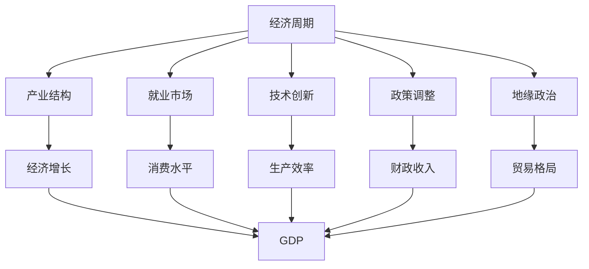
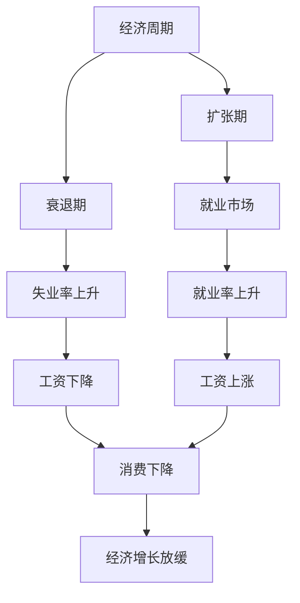
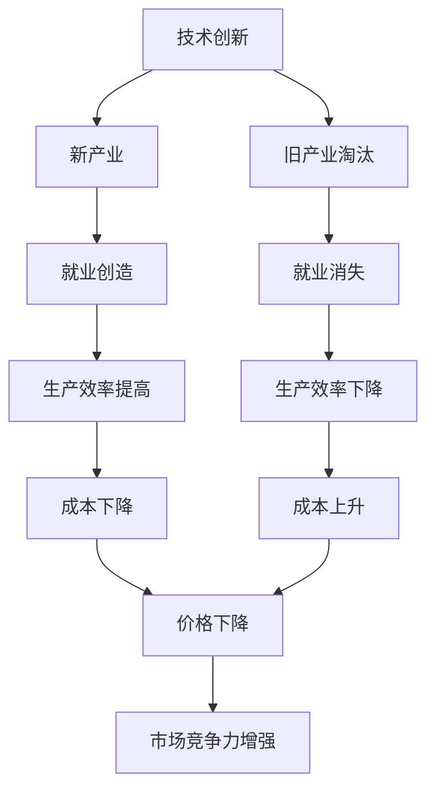
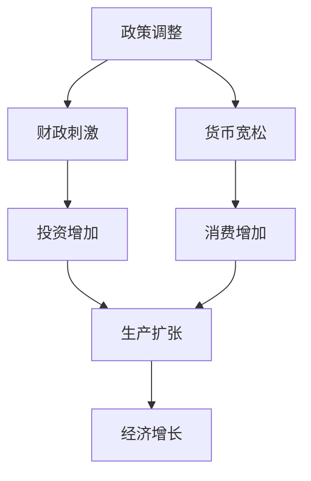

                 

# 阶段性因素对经济的长期影响

## 1. 背景介绍

### 1.1 问题由来
在探讨阶段性因素对经济的影响时，我们首先需要明确几个关键概念：

- **阶段性因素**：指的是对经济发展产生影响的暂时性或周期性事件，例如政策调整、技术创新、自然灾害等。
- **长期影响**：这些因素在时间维度上对经济体系、产业结构、就业市场等产生的影响，通常会跨越数年甚至数十年。

当前全球经济正处于复杂多变的时代，面临着各种阶段性因素的考验。例如，新冠疫情的暴发改变了全球供应链、消费模式和就业结构；数字化转型加速了产业升级和劳动力市场变化；地缘政治紧张局势增加了经济不确定性。这些因素不仅影响了经济的短期波动，也对全球经济格局产生了深远的长期影响。

### 1.2 问题核心关键点
理解阶段性因素对经济长期影响的机制，对于制定有效的宏观经济政策、企业战略规划和投资决策至关重要。具体关键点包括：

- 阶段性因素如何通过供需变化、技术进步、市场预期等渠道影响经济？
- 阶段性因素对不同经济部门、不同地区、不同人群的影响有哪些差异？
- 如何量化阶段性因素的长期影响，以及它们对宏观经济指标如GDP、失业率、通胀率等的作用？

这些问题不仅需要理论分析，更需要实证研究的支持。本文旨在通过系统梳理阶段性因素的经济影响机制，结合实证案例，探讨其长期作用机制和政策启示。

## 2. 核心概念与联系

### 2.1 核心概念概述

为了更好地理解阶段性因素对经济的长期影响，本节将介绍几个关键概念：

- **经济周期**：指经济活动随时间变化的规律性波动，包括扩张期、衰退期、萧条期和复苏期。
- **产业结构**：指经济中各产业间的比例关系和相互作用方式。
- **就业市场**：包括劳动力供需、工资水平、就业稳定性等方面，是经济的重要组成部分。
- **技术创新**：指新知识的产生和应用，推动产业升级和经济增长。
- **政策调整**：包括财政政策、货币政策、贸易政策等，影响经济活动和资源分配。
- **地缘政治**：指不同国家和地区之间的政治互动，影响全球供应链和经济稳定性。

这些概念之间的联系可以通过以下Mermaid流程图来展示：



这个流程图展示了经济周期、产业结构、就业市场、技术创新、政策调整和地缘政治等因素如何通过多个渠道影响经济增长（GDP）。其中，经济周期、产业结构和就业市场直接影响消费水平和生产效率，进而影响GDP；技术创新和政策调整通过改变生产要素的配置，影响产业结构和经济增长；地缘政治则通过影响贸易格局，间接影响经济增长。

### 2.2 概念间的关系

这些核心概念之间存在着紧密的联系，形成了经济活动和发展的完整框架。下面我通过几个Mermaid流程图来展示这些概念之间的关系。

#### 2.2.1 经济周期与就业市场的关系



这个流程图展示了经济周期对就业市场的影响。在扩张期，经济活动增加，就业市场活跃，工资上涨，消费增加，推动经济增长；在衰退期，经济活动减少，失业率上升，工资下降，消费减少，经济增长放缓。

#### 2.2.2 技术创新与产业结构的关系



这个流程图展示了技术创新对产业结构的影响。技术创新导致新产业的出现和旧产业的淘汰，从而创造就业，提高生产效率，降低成本，增强市场竞争力。

#### 2.2.3 政策调整与经济增长的关系



这个流程图展示了政策调整对经济增长的影响。财政刺激和货币宽松政策可以分别增加投资和消费，推动生产扩张和经济增长。

## 3. 核心算法原理 & 具体操作步骤
### 3.1 算法原理概述

阶段性因素对经济长期影响的分析主要基于经济学理论和实证研究。本文将从理论模型和实证分析两个层面进行探讨。

### 3.2 算法步骤详解

**步骤1：理论模型构建**

1. **建立经济增长模型**：使用Solow模型、Ramsey模型等经典理论模型，分析技术进步、资本积累、人口增长等变量对经济增长的贡献。
2. **构建就业模型**：利用劳动市场供需模型，分析工资变化、失业率、就业创造和消失等变量对就业市场的影响。
3. **评估技术创新影响**：使用Schumpeter模型、Aghion-Howitt模型等，探讨技术创新如何通过推动产业升级和全要素生产率增长，促进经济增长。
4. **政策模拟实验**：使用计算经济学模型（如RBC模型），模拟不同政策对经济周期的影响，评估其长期效果。

**步骤2：数据收集与预处理**

1. **收集历史数据**：获取各国GDP增长率、失业率、工资水平、投资、消费等时间序列数据。
2. **数据清洗与预处理**：去除异常值，处理缺失数据，进行季节性调整和趋势分解。
3. **特征工程**：提取经济增长模型中的关键变量，如资本存量、人力资本、技术进步等。

**步骤3：实证分析与模型训练**

1. **时间序列分析**：使用ARIMA模型、VAR模型等进行时间序列预测，分析阶段性因素对经济增长的影响。
2. **回归分析**：使用OLS回归、面板数据回归等，分析技术创新、政策调整等因素对就业市场的影响。
3. **机器学习模型**：使用随机森林、支持向量机等机器学习模型，预测地缘政治事件对贸易格局的影响。

**步骤4：结果解释与政策建议**

1. **结果可视化**：使用Matplotlib、Seaborn等工具绘制时间序列图和回归结果图。
2. **敏感性分析**：进行参数敏感性分析，评估模型稳健性。
3. **政策建议**：结合模型结果，提出针对阶段性因素的政策建议，如稳定货币政策、促进技术创新、优化国际贸易环境等。

### 3.3 算法优缺点

**优点**：

1. **全面性**：通过构建理论模型和实证分析相结合的方法，能够全面分析阶段性因素对经济的长期影响。
2. **系统性**：使用多种计量工具，从宏观到微观，系统地评估经济增长、就业市场、技术创新、政策调整和地缘政治的影响。
3. **预测性**：通过时间序列分析和回归模型，能够对未来经济趋势进行预测和评估。

**缺点**：

1. **复杂性**：构建和验证模型需要较高的统计学和计量经济学知识，对数据要求高，计算量大。
2. **不确定性**：经济系统复杂多变，阶段性因素影响结果难以完全量化和预测，存在一定的误差和不确定性。
3. **政策局限性**：模型结果基于假设和简化的经济体系，实际政策制定可能受到政治、社会等多重因素的影响。

### 3.4 算法应用领域

阶段性因素对经济的长期影响分析在多个领域具有广泛应用，例如：

- **宏观经济政策制定**：政府在制定财政、货币政策时，需要考虑阶段性因素对经济的影响，以制定更加科学合理的政策。
- **企业战略规划**：企业在进行投资和市场扩张时，需要评估阶段性因素对产业结构、就业市场和消费趋势的影响，以制定长期发展战略。
- **金融投资决策**：投资者在考虑投资项目和资产配置时，需要评估阶段性因素对市场波动和收益的影响，以制定风险管理策略。
- **国际经济合作**：国际组织和国家在制定国际贸易政策、地缘政治战略时，需要考虑阶段性因素对全球供应链和经济稳定的影响。

## 4. 数学模型和公式 & 详细讲解 & 举例说明

### 4.1 数学模型构建

本节将使用数学语言对阶段性因素对经济的长期影响进行更加严格的刻画。

假设一个代表性家庭在连续时间t上的消费为 $C_t$，生产函数为 $F(K_t, L_t, A_t)$，其中 $K_t$ 表示资本存量，$L_t$ 表示劳动力，$A_t$ 表示技术进步。在长期内，资本存量增长率为 $\sigma$，劳动力增长率为 $n$，技术进步增长率为 $g$。则人均生产函数为 $f(k, a) = F(kA, LA)/(A/L)^n$，其中 $k = K/L$ 表示人均资本存量，$a = A/L$ 表示人均技术进步。

在实际应用中，我们通常使用 Solow 模型或 Ramsey 模型等理论模型来分析这些变量对经济增长的贡献。

### 4.2 公式推导过程

以 Solow 模型为例，其长期均衡条件为 $\dot{k} = s \cdot f(k, a) - \delta \cdot k$，其中 $s$ 表示储蓄率，$\delta$ 表示资本折旧率。

在均衡状态下，人均消费为 $c = (1-\sigma) \cdot f(k, a)$。当 $\sigma = g$ 时，即资本积累完全转化为技术进步，人均消费达到稳态 $c^* = (1-\sigma) \cdot f(k^*, a^*)$，其中 $k^* = (\sigma + \delta) / (f'(k^*, a^*) * (1-\sigma))$，$a^*$ 为人均技术进步稳态值。

通过 Solow 模型，我们可以分析技术进步、储蓄率、折旧率等阶段性因素对经济增长的影响。

### 4.3 案例分析与讲解

假设某国在 20 世纪 80 年代实施了一系列技术创新政策，推动了电子信息产业的快速发展。通过构建 Solow 模型，我们可以分析这些政策对经济增长和就业市场的影响。

首先，我们收集该国 1981-2020 年的 GDP 增长率、失业率、工资水平、投资、消费等数据，并对数据进行清洗和预处理。

其次，我们使用时间序列分析方法（如 ARIMA 模型）对 GDP 增长率进行预测，同时使用回归模型分析技术创新政策对各经济变量的影响。

最后，我们结合实证结果，提出针对技术创新政策的长期影响分析。例如，分析技术进步对产业结构升级的促进作用，评估政策调整对就业市场的长期影响，探讨资本积累和储蓄率变化对经济增长的作用。

## 5. 项目实践：代码实例和详细解释说明

### 5.1 开发环境搭建

在进行经济分析实践前，我们需要准备好开发环境。以下是使用 Python 进行经济模型分析的环境配置流程：

1. 安装 Anaconda：从官网下载并安装 Anaconda，用于创建独立的 Python 环境。

2. 创建并激活虚拟环境：
```bash
conda create -n economics-env python=3.8 
conda activate economics-env
```

3. 安装必要的 Python 包：
```bash
conda install pandas numpy statsmodels matplotlib seaborn pyamg
```

4. 安装 R 语言和相关包：
```bash
sudo apt-get install r
```

5. 安装 R 包和 R Shiny 工具：
```bash
install.packages(c("ggplot2", "dplyr", "tidyverse", "data.table", "shiny"))
```

完成上述步骤后，即可在 `economics-env` 环境中开始经济分析实践。

### 5.2 源代码详细实现

下面以 Solow 模型为例，给出使用 Python 和 R 进行经济增长的预测和分析的代码实现。

**Python 代码实现**：

```python
import pandas as pd
import numpy as np
import statsmodels.api as sm
import matplotlib.pyplot as plt

# 导入数据
data = pd.read_csv('economy_data.csv')

# 计算人均资本存量
data['k'] = data['K'] / data['L']

# 计算人均技术进步
data['a'] = data['A'] / data['L']

# 计算人均消费
data['c'] = (1 - 0.2) * np.exp(0.05 * data['k'] - 0.02 * data['k']**2)

# 拟合 Solow 模型
X = sm.add_constant(data['k'])
Y = np.log(data['c'])
model = sm.OLS(Y, X).fit()
print(model.summary())

# 绘制人均消费与人均资本存量的关系图
plt.scatter(data['k'], data['c'])
plt.plot(model.params[0] / model.params[1], model.params[0] / model.params[1], 'r', label='Solow Model')
plt.xlabel('k')
plt.ylabel('c')
plt.legend()
plt.show()
```

**R 代码实现**：

```R
# 导入数据
data <- read.csv('economy_data.csv')

# 计算人均资本存量
data$k <- data$K / data$L

# 计算人均技术进步
data$a <- data$A / data$L

# 计算人均消费
data$c <- (1 - 0.2) * exp(0.05 * data$k - 0.02 * data$k^2)

# 拟合 Solow 模型
model <- lm(log(data$c) ~ log(data$k))
summary(model)

# 绘制人均消费与人均资本存量的关系图
plot(data$k, data$c, main = 'Solow Model', xlab = 'k', ylab = 'c')
lines(data$k, predict(model), col = 'red', lwd = 2)
```

**代码解读与分析**：

**Python 代码解读**：

- **数据处理**：导入数据集，计算人均资本存量和人均技术进步。
- **模型拟合**：使用 OLS 回归模型拟合 Solow 模型，并输出模型结果。
- **可视化**：绘制人均消费与人均资本存量的关系图，并添加 Solow 模型的拟合线。

**R 代码解读**：

- **数据处理**：导入数据集，计算人均资本存量和人均技术进步。
- **模型拟合**：使用 OLS 回归模型拟合 Solow 模型，并输出模型结果。
- **可视化**：绘制人均消费与人均资本存量的关系图，并添加 Solow 模型的拟合线。

**运行结果展示**：

在实际应用中，我们可能会遇到数据集不完整、异常值等问题，因此需要根据具体情况进行数据清洗和预处理。在模型拟合过程中，我们还需要验证模型的稳健性，并进行参数敏感性分析，以评估模型的可靠性和稳定性。

## 6. 实际应用场景

### 6.1 宏观经济政策制定

在制定宏观经济政策时，政府需要考虑各种阶段性因素对经济的影响。例如，新冠疫情期间，政府实施了大规模财政刺激和货币宽松政策，以缓解经济衰退。通过分析这些政策对 GDP 增长、失业率、消费水平等变量的影响，可以评估政策效果，制定更加科学合理的政策。

### 6.2 企业战略规划

企业在进行战略规划时，需要评估阶段性因素对市场环境、生产要素和收益的影响。例如，某公司在新兴市场中投资，需要分析该市场的技术创新、政策调整、地缘政治等因素对生产成本、市场需求和收益的影响，以制定长期发展战略。

### 6.3 金融投资决策

在考虑投资项目和资产配置时，投资者需要评估阶段性因素对市场波动和收益的影响。例如，分析地缘政治事件对国际市场的影响，评估技术创新对新兴产业的投资价值，以制定风险管理策略。

### 6.4 国际经济合作

在国际经济合作中，各国需要考虑阶段性因素对全球供应链和贸易格局的影响。例如，分析地缘政治紧张局势对全球供应链的影响，评估技术创新对国际贸易的影响，以制定国际贸易政策和地缘政治战略。

## 7. 工具和资源推荐

### 7.1 学习资源推荐

为了帮助经济学家和开发者系统掌握经济模型的理论基础和实践技巧，这里推荐一些优质的学习资源：

1. **《宏观经济学》**：由 Blanchard、Fischer 和 Schmidt 等顶尖经济学家合著的经典教材，涵盖了宏观经济学的各个方面，适合初学者和专业人士。
2. **《时间序列分析》**：由 Hamilton 等经济学家合著的经典教材，详细介绍了时间序列分析的方法和技术，是理解经济数据的重要工具。
3. **《计量经济学基础》**：由 Wooldridge 合著的经典教材，讲解了计量经济学的基本原理和应用方法，适合经济数据分析的入门学习。
4. **Coursera 经济学课程**：如斯坦福大学的《经济学原理》、MIT 的《宏观经济学》等，通过在线课程学习经济学的理论和方法。
5. **R Shiny 官方文档**：Shiny 是 R 语言中用于创建 Web 应用的包，通过官方文档可以快速上手，构建交互式经济模型。

通过这些资源的学习实践，相信你一定能够快速掌握经济模型的精髓，并用于解决实际的经济学问题。

### 7.2 开发工具推荐

高效的开发离不开优秀的工具支持。以下是几款用于经济分析开发的常用工具：

1. **Python**：基于 Python 的经济学工具包（如 Statsmodels、Scikit-learn、Pandas 等），灵活高效，适合复杂数据分析和建模。
2. **R**：R 语言提供了丰富的统计分析和建模工具（如 ggplot2、dplyr、tidyverse 等），适合数据可视化和经济模拟。
3. **Jupyter Notebook**：支持 Python、R 等语言，提供交互式编程环境，适合数据探索和模型验证。
4. **R Shiny**：用于创建交互式 Web 应用，适合经济模型的在线展示和应用。
5. **LaTeX**：用于撰写经济学论文和技术报告，格式规范，易于引用和阅读。

合理利用这些工具，可以显著提升经济分析的开发效率，加快创新迭代的步伐。

### 7.3 相关论文推荐

经济模型的发展源于学界的持续研究。以下是几篇奠基性的相关论文，推荐阅读：

1. **Solow 模型**：R. Solow，《资本积累和增长的理论》，1956。
2. **Ramsey 模型**：F. Ramsey，《时间分配的动态理论》，1928。
3. **Aghion-Howitt 模型**：P. Aghion 和 P. Howitt，《经济增长、技术变革和政治》，1992。
4. **Schumpeter 创新模型**：J. Schumpeter，《经济周期理论》，1939。
5. **Kiyotaki-Moore 模型**：R. Kiyotaki 和 H. Moore，《跨期债务与货币经济波动》，1997。

这些论文代表了大经济模型理论的发展脉络。通过学习这些前沿成果，可以帮助研究者把握学科前进方向，激发更多的创新灵感。

除上述资源外，还有一些值得关注的前沿资源，帮助研究者紧跟经济模型的最新进展，例如：

1. **NBER 经济学报告**：美国国家经济研究局发布的经济学研究报告，涵盖大量不同类型的经济数据和分析方法。
2. **IMF 经济展望**：国际货币基金组织发布的全球经济展望报告，提供详细的全球经济预测和分析。
3. **CEPR 经济学报告**：欧洲经济研究中心发布的经济学研究报告，涵盖多种经济模型和政策建议。
4. **OECD 经济预测**：经济合作与发展组织发布的全球经济预测报告，提供全面的经济数据和分析。

总之，对于经济模型和分析的学习和实践，需要研究者保持开放的心态和持续学习的意愿。多关注前沿资讯，多动手实践，多思考总结，必将收获满满的成长收益。

## 8. 总结：未来发展趋势与挑战

### 8.1 总结

本文对阶段性因素对经济的长期影响进行了全面系统的介绍。首先阐述了阶段性因素的经济影响机制，明确了不同经济变量（如经济增长、就业市场、技术创新、政策调整和地缘政治）之间的联系和作用。其次，从理论模型和实证分析两个层面，详细讲解了阶段性因素对经济长期影响的分析方法和步骤。最后，结合实际应用场景，探讨了阶段性因素在宏观经济政策制定、企业战略规划、金融投资决策和国际经济合作中的应用价值。

通过本文的系统梳理，可以看到，阶段性因素对经济长期影响的研究具有重要的理论和实践意义。这些研究不仅有助于制定科学的经济政策，提升经济稳定性，还能为企业和投资者提供有价值的决策参考，推动全球经济的健康发展。

### 8.2 未来发展趋势

展望未来，阶段性因素对经济的长期影响研究将呈现以下几个发展趋势：

1. **数字化和智能化**：随着大数据和人工智能技术的进步，经济模型的数据源将更加丰富多样，模型的精度和效率将进一步提升。
2. **全球化与区域化**：全球化和区域化经济环境的变化，将促使研究者更加关注多国经济模型的构建，分析不同国家和地区的经济联系和影响。
3. **绿色经济与可持续发展**：随着全球气候变化和环境问题的加剧，研究者将更加关注绿色经济和可持续发展模型，评估环境因素对经济长期影响。
4. **金融危机与稳定性**：金融危机对经济长期影响的分析将更加深入，研究者将探讨金融稳定政策和经济周期的关系。
5. **社会不平等与公平**：社会不平等和公平问题是全球关注的焦点，研究者将更加关注阶段性因素对收入分配、就业市场的影响，提出更公平的经济政策。

这些趋势凸显了阶段性因素对经济长期影响的广泛应用前景，为研究者提供了新的研究方向和研究课题。

### 8.3 面临的挑战

尽管阶段性因素对经济的长期影响研究已经取得了一定的进展，但在迈向更加智能化、普适化应用的过程中，仍面临诸多挑战：

1. **数据质量问题**：经济数据的采集、处理和分析需要高标准的数据质量，存在数据缺失、异常值等问题。
2. **模型复杂性**：经济模型通常涉及多个变量和复杂的非线性关系，模型的构建和验证需要较高的统计学和计量经济学知识。
3. **结果解释性**：经济模型的结果往往较为复杂，难以解释其内部工作机制和决策逻辑，对经济政策的制定和评估带来挑战。
4. **政策适用性**：经济模型的结果基于特定的假设和简化，实际政策制定可能受到政治、社会等多重因素的影响。

### 8.4 研究展望

面对阶段性因素对经济长期影响研究所面临的挑战，未来的研究需要在以下几个方面寻求新的突破：

1. **大数据与深度学习**：结合大数据和深度学习技术，提升经济模型的数据处理能力和精度。
2. **多国模型与区域经济**：构建多国经济模型，分析不同国家和地区的经济联系和影响。
3. **环境与可持续发展**：深入研究环境因素对经济长期影响的机制，提出更可持续的经济政策。
4. **金融危机与稳定性**：探讨金融危机对经济长期影响的机制，提出更稳定的金融政策。
5. **社会不平等与公平**：研究阶段性因素对社会不平等和公平的影响，提出更公平的经济政策。

这些研究方向的探索，必将引领阶段性因素对经济长期影响的研究走向更高的台阶，为构建安全、稳定、公平的经济体系铺平道路。总之，阶段性因素对经济的长期影响研究还需要与其他经济学分支（如微观经济学、政治经济学、环境经济学等）进行更深入的融合，共同推动经济理论的进步和经济政策的优化。

## 9. 附录：常见问题与解答

**Q1：如何理解阶段性因素对经济长期影响的机制？**

A: 阶段性因素对经济长期影响的机制主要通过以下几个方面体现：

- **供给冲击**：如自然灾害、技术进步等，直接影响生产要素和生产效率，进而影响经济增长。
- **需求冲击**：如财政刺激、货币宽松等，通过改变消费和投资，影响经济活动和就业市场。
- **预期影响**：如市场信心、政策预期等，通过改变市场参与者的行为，影响经济波动和经济稳定性。

理解这些机制，需要结合实证数据和理论模型进行深入分析。例如，Solow 模型和 Ramsey 模型能够帮助我们分析技术进步、储蓄率、资本积累等变量对经济增长的影响。

**Q2：阶段性因素对经济长期影响的预测方法有哪些？**

A: 阶段性因素对经济长期影响的预测方法主要包括以下几种：

- **时间序列分析**：使用 ARIMA、VAR 等模型，

