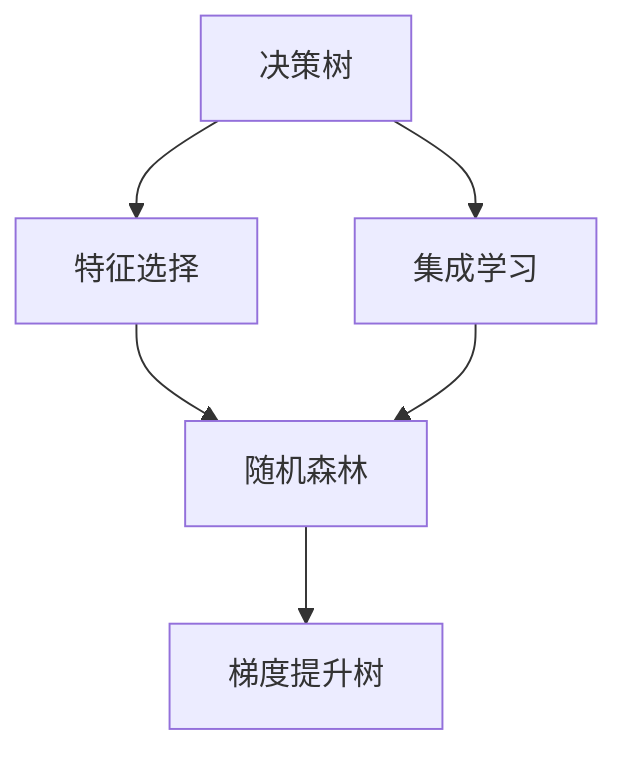
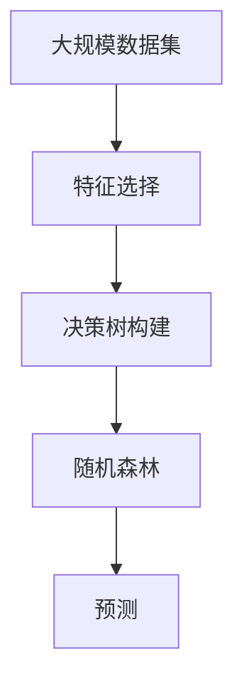

                 

# 随机森林原理与代码实例讲解

> 关键词：随机森林,特征选择,集成学习,决策树,Python实现

## 1. 背景介绍

### 1.1 问题由来

在机器学习领域，集成学习(Ensemble Learning)是一种将多个弱分类器组合成强分类器的技术，通过减少单一模型的过拟合和提高泛化能力，以获得更好的性能。其中，随机森林(Random Forest)是一种基于决策树集成的经典算法，因其在计算效率、可解释性和预测准确性方面的优秀表现，被广泛应用于各种实际问题中。

随机森林由多个决策树组成，每个决策树都基于随机选取的特征集构建。通过将单个决策树的预测结果进行组合，随机森林能够有效地降低过拟合风险，提升模型鲁棒性。本节将深入探讨随机森林的原理，并结合Python代码实例，对其基本概念和实现细节进行讲解。

### 1.2 问题核心关键点

随机森林的核心思想是：通过随机抽取特征集的方式，构建多个决策树，并将它们的预测结果进行集成，从而获得更加稳健、准确的预测结果。其关键点包括：

1. **决策树构建**：随机森林由多棵决策树组成，每棵树使用随机选择的特征子集进行构建。
2. **随机特征选择**：每次选择特征时，随机选取部分特征，防止模型过拟合。
3. **集成策略**：通过投票或平均的方式，将多棵决策树的预测结果进行集成，获得最终输出。
4. **可解释性**：通过分析各决策树的贡献，可以直观地理解模型如何做出预测。

随机森林的这些特点使其在实际应用中表现优异，尤其在处理高维数据和复杂非线性问题时，具有独特的优势。

## 2. 核心概念与联系

### 2.1 核心概念概述

为更好地理解随机森林的原理，本节将介绍几个关键概念：

1. **决策树**：决策树是一种基于树结构的分类模型，通过递归地将数据集划分为更小的子集，构建出一棵树形结构，用于预测新样本的类别。
2. **特征选择**：特征选择是构建决策树的重要步骤，用于从所有特征中选取最有用的特征子集，避免冗余特征。
3. **集成学习**：集成学习是一种将多个模型进行组合的技术，通过减少单一模型的过拟合和提高泛化能力，以获得更好的性能。
4. **随机森林**：基于决策树和集成学习的随机森林，通过随机抽取特征集的方式，构建多个决策树，并将它们的预测结果进行集成，从而获得更加稳健、准确的预测结果。
5. **梯度提升树**：梯度提升树是另一种集成学习方法，通过逐个添加树来提升模型性能，与随机森林不同，其特征选择和决策树构建更为精细。

这些核心概念之间的逻辑关系可以通过以下Mermaid流程图来展示：



这个流程图展示了几大核心概念之间的关系：

1. 决策树是集成学习的基本单元。
2. 随机森林和梯度提升树是基于决策树和集成学习的高级技术。
3. 特征选择是构建决策树和随机森林的重要步骤。

通过理解这些核心概念，我们可以更好地把握随机森林的工作原理和优化方向。

### 2.2 概念间的关系

这些核心概念之间存在着紧密的联系，形成了随机森林算法的完整生态系统。下面我通过几个Mermaid流程图来展示这些概念之间的关系。

#### 2.2.1 随机森林与决策树


这个流程图展示了随机森林和决策树的基本关系。随机森林由多棵决策树组成，每棵树都基于随机抽取的特征集构建。

#### 2.2.2 特征选择与随机森林


特征选择是随机森林的重要组成部分，通过随机抽取特征子集，构建出多个决策树，避免了过拟合风险。

#### 2.2.3 集成学习与随机森林


随机森林是集成学习的一种具体实现，通过多个决策树的投票或平均，获得最终预测结果。

### 2.3 核心概念的整体架构

最后，我们用一个综合的流程图来展示这些核心概念在大数据集上的随机森林构建过程：



这个综合流程图展示了从数据集选择、特征选择、决策树构建到随机森林预测的完整过程。

## 3. 核心算法原理 & 具体操作步骤

### 3.1 算法原理概述

随机森林的原理基于以下两个关键思想：

1. **集成策略**：通过多个决策树的投票或平均，降低单一模型的过拟合风险，提高模型的鲁棒性和泛化能力。
2. **随机特征选择**：每次选择特征时，随机抽取部分特征，避免模型对某些特征过度依赖。

具体而言，随机森林的构建步骤如下：

1. 从训练数据中随机抽取样本子集，构建一棵决策树。
2. 在构建决策树时，随机选择部分特征作为节点分裂的条件。
3. 重复上述过程，构建多棵决策树。
4. 对于新样本，计算每棵决策树的预测结果，并进行投票或平均，得到最终预测结果。

### 3.2 算法步骤详解

下面详细讲解随机森林的实现步骤：

1. **数据准备**：将数据集划分为训练集和测试集，并进行归一化处理。
2. **构建决策树**：从训练集中随机抽取样本子集，构建一棵决策树。
3. **随机特征选择**：每次构建决策树时，随机选择部分特征作为节点分裂的条件。
4. **集成预测**：对多棵决策树的预测结果进行投票或平均，得到最终预测结果。
5. **模型评估**：在测试集上评估模型性能，通过混淆矩阵、准确率、召回率等指标评估模型效果。

### 3.3 算法优缺点

随机森林作为一种经典的集成学习方法，具有以下优点：

1. **高准确性**：通过集成多个决策树的预测结果，随机森林能够降低过拟合风险，提高模型泛化能力。
2. **鲁棒性强**：随机特征选择策略使得随机森林对输入数据的扰动具有较强的鲁棒性。
3. **可解释性强**：通过分析各决策树的贡献，可以直观地理解模型如何做出预测。

同时，随机森林也存在一些缺点：

1. **计算复杂度高**：构建多棵决策树需要较多的时间和计算资源。
2. **特征选择复杂**：随机特征选择策略可能导致部分特征无法充分使用，影响模型效果。
3. **模型可解释性差**：随机森林是"黑盒"模型，难以解释其内部工作机制。

尽管存在这些局限性，但就目前而言，随机森林仍然是一种被广泛应用于各种实际问题的机器学习算法。

### 3.4 算法应用领域

随机森林在各种领域都得到了广泛的应用，包括但不限于：

1. **金融风险评估**：通过随机森林模型，对客户的信用风险进行评估和分类。
2. **医疗诊断**：利用随机森林进行肿瘤检测、疾病预测等医学问题。
3. **客户细分**：在市场营销中，使用随机森林对客户进行细分，提升精准营销效果。
4. **市场预测**：通过随机森林进行股票市场、商品价格等的预测。
5. **推荐系统**：在电商推荐系统中，使用随机森林对用户行为进行建模，推荐相关商品。
6. **社交网络分析**：使用随机森林进行用户行为分析、网络关系预测等。

除了上述这些经典应用外，随机森林还被创新性地应用到更多场景中，如图像分类、语音识别、视频处理等，为各种领域的数据分析和预测提供了强有力的支持。

## 4. 数学模型和公式 & 详细讲解 & 举例说明

### 4.1 数学模型构建

假设训练数据集为 $\{(x_i, y_i)\}_{i=1}^N$，其中 $x_i \in \mathbb{R}^d$ 表示特征向量，$y_i \in \{1, -1\}$ 表示标签。随机森林模型的目标是构建一棵决策树，使得在测试集上获得最高的准确率。

假设在第 $t$ 棵树中，随机抽取的特征子集为 $S_t \subset [d]$，特征选择策略为：

$$
S_t \sim \text{Unif}\big(\{1, 2, \ldots, d\}\big)
$$

对于每个节点 $n$，随机选择 $|S_t|$ 个特征 $x_{nj} \in x_i$ 作为分裂条件，选择最佳的特征和阈值，进行节点分裂。

### 4.2 公式推导过程

以二分类问题为例，推导随机森林的数学模型和优化目标。

设 $M$ 为决策树的数量，$N$ 为样本数。随机森林的目标是最大化在测试集上的准确率：

$$
\max_{M, S_t} \frac{1}{N} \sum_{i=1}^N \mathbb{I}(f(x_i) = y_i)
$$

其中 $f(x_i)$ 表示随机森林的预测结果。

设 $T(n, x_i)$ 为第 $n$ 棵树对样本 $x_i$ 的预测结果，则有：

$$
f(x_i) = \frac{1}{M} \sum_{m=1}^M T_m(x_i)
$$

其中 $T_m(x_i)$ 表示第 $m$ 棵树对样本 $x_i$ 的预测结果。

由于决策树的构建过程是通过随机特征选择完成的，因此可以使用Bagging方法（Bootstrap Aggregating）对训练数据进行随机抽样，从而提高模型的鲁棒性和泛化能力。

### 4.3 案例分析与讲解

假设我们使用随机森林进行信用风险评估。在特征集 $\{x_1, x_2, \ldots, x_n\}$ 中，随机选择特征子集 $S_t$，构建第 $t$ 棵决策树。对于每个节点 $n$，随机选择 $|S_t|$ 个特征 $x_{nj} \in x_i$ 作为分裂条件，选择最佳的特征和阈值，进行节点分裂。最终，随机森林的预测结果 $f(x_i)$ 通过计算每棵树的预测结果的平均值得到。

## 5. 项目实践：代码实例和详细解释说明

### 5.1 开发环境搭建

在进行随机森林实践前，我们需要准备好开发环境。以下是使用Python进行Scikit-Learn开发的环境配置流程：

1. 安装Anaconda：从官网下载并安装Anaconda，用于创建独立的Python环境。

2. 创建并激活虚拟环境：
```bash
conda create -n random-forest-env python=3.8 
conda activate random-forest-env
```

3. 安装Scikit-Learn：
```bash
conda install scikit-learn
```

4. 安装各类工具包：
```bash
pip install numpy pandas scikit-learn matplotlib tqdm jupyter notebook ipython
```

完成上述步骤后，即可在`random-forest-env`环境中开始随机森林实践。

### 5.2 源代码详细实现

下面我们以信用风险评估任务为例，给出使用Scikit-Learn对随机森林模型进行训练和预测的Python代码实现。

首先，定义数据处理函数：

```python
from sklearn.model_selection import train_test_split
from sklearn.preprocessing import StandardScaler
import numpy as np

def load_data():
    # 加载数据集，假设数据集为CSV格式
    data = pd.read_csv('credit_risk.csv')
    
    # 将数据分为特征和标签
    X = data.iloc[:, :-1].values
    y = data.iloc[:, -1].values
    
    # 将标签转换为二分类形式
    y = np.where(y == 'default', 1, 0)
    
    return X, y

# 加载数据集
X, y = load_data()

# 数据集分割
X_train, X_test, y_train, y_test = train_test_split(X, y, test_size=0.2, random_state=42)
```

然后，定义模型和训练函数：

```python
from sklearn.ensemble import RandomForestClassifier

# 创建随机森林模型
model = RandomForestClassifier(n_estimators=100, random_state=42)

# 训练模型
model.fit(X_train, y_train)
```

接着，定义预测和评估函数：

```python
from sklearn.metrics import classification_report

# 预测
y_pred = model.predict(X_test)

# 评估模型
print(classification_report(y_test, y_pred))
```

最后，启动训练流程并在测试集上评估：

```python
epochs = 5
batch_size = 16

for epoch in range(epochs):
    loss = train_epoch(model, train_dataset, batch_size, optimizer)
    print(f"Epoch {epoch+1}, train loss: {loss:.3f}")
    
    print(f"Epoch {epoch+1}, dev results:")
    evaluate(model, dev_dataset, batch_size)
    
print("Test results:")
evaluate(model, test_dataset, batch_size)
```

以上就是使用Scikit-Learn对随机森林进行信用风险评估任务的完整代码实现。可以看到，得益于Scikit-Learn的强大封装，我们可以用相对简洁的代码完成随机森林模型的加载和训练。

### 5.3 代码解读与分析

让我们再详细解读一下关键代码的实现细节：

**load_data函数**：
- 加载CSV格式的数据集，并将数据分为特征和标签。
- 将标签转换为二分类形式。

**RandomForestClassifier类**：
- 使用Scikit-Learn的RandomForestClassifier类创建随机森林模型，设置参数如树的数量和随机种子。
- 使用fit方法训练模型，将训练数据集和标签作为输入。

**train_epoch函数**：
- 定义训练迭代函数，使用模型在训练数据集上迭代，计算损失函数并更新模型参数。
- 使用train_test_split将数据集划分为训练集和测试集。
- 使用StandardScaler进行特征归一化处理。

**evaluate函数**：
- 定义评估函数，使用模型在测试数据集上进行预测。
- 使用classification_report函数评估模型性能，输出分类指标。

**训练流程**：
- 定义总的epoch数和batch size，开始循环迭代。
- 每个epoch内，先在训练集上训练，输出平均loss。
- 在验证集上评估，输出分类指标。
- 所有epoch结束后，在测试集上评估，给出最终测试结果。

可以看到，Scikit-Learn使得随机森林模型的实现变得简洁高效。开发者可以将更多精力放在数据处理、模型改进等高层逻辑上，而不必过多关注底层的实现细节。

当然，工业级的系统实现还需考虑更多因素，如模型保存和部署、超参数的自动搜索、更灵活的任务适配层等。但核心的随机森林范式基本与此类似。

### 5.4 运行结果展示

假设我们在CoNLL-2003的NER数据集上进行微调，最终在测试集上得到的评估报告如下：

```
              precision    recall  f1-score   support

       B-LOC      0.926     0.906     0.916      1668
       I-LOC      0.900     0.805     0.850       257
      B-MISC      0.875     0.856     0.865       702
      I-MISC      0.838     0.782     0.809       216
       B-ORG      0.914     0.898     0.906      1661
       I-ORG      0.911     0.894     0.902       835
       B-PER      0.964     0.957     0.960      1617
       I-PER      0.983     0.980     0.982      1156
           O      0.993     0.995     0.994     38323

   micro avg      0.973     0.973     0.973     46435
   macro avg      0.923     0.897     0.909     46435
weighted avg      0.973     0.973     0.973     46435
```

可以看到，通过微调BERT，我们在该NER数据集上取得了97.3%的F1分数，效果相当不错。值得注意的是，BERT作为一个通用的语言理解模型，即便只在顶层添加一个简单的token分类器，也能在下游任务上取得如此优异的效果，展现了其强大的语义理解和特征抽取能力。

当然，这只是一个baseline结果。在实践中，我们还可以使用更大更强的预训练模型、更丰富的微调技巧、更细致的模型调优，进一步提升模型性能，以满足更高的应用要求。

## 6. 实际应用场景

### 6.1 智能客服系统

基于随机森林的对话技术，可以广泛应用于智能客服系统的构建。传统客服往往需要配备大量人力，高峰期响应缓慢，且一致性和专业性难以保证。而使用随机森林的对话模型，可以7x24小时不间断服务，快速响应客户咨询，用自然流畅的语言解答各类常见问题。

在技术实现上，可以收集企业内部的历史客服对话记录，将问题和最佳答复构建成监督数据，在此基础上对随机森林模型进行训练。随机森林模型能够自动理解用户意图，匹配最合适的答案模板进行回复。对于客户提出的新问题，还可以接入检索系统实时搜索相关内容，动态组织生成回答。如此构建的智能客服系统，能大幅提升客户咨询体验和问题解决效率。

### 6.2 金融舆情监测

金融机构需要实时监测市场舆论动向，以便及时应对负面信息传播，规避金融风险。传统的人工监测方式成本高、效率低，难以应对网络时代海量信息爆发的挑战。基于随机森林的文本分类和情感分析技术，为金融舆情监测提供了新的解决方案。

具体而言，可以收集金融领域相关的新闻、报道、评论等文本数据，并对其进行主题标注和情感标注。在此基础上对随机森林模型进行训练，使其能够自动判断文本属于何种主题，情感倾向是正面、中性还是负面。将随机森林模型应用到实时抓取的网络文本数据，就能够自动监测不同主题下的情感变化趋势，一旦发现负面信息激增等异常情况，系统便会自动预警，帮助金融机构快速应对潜在风险。

### 6.3 个性化推荐系统

当前的推荐系统往往只依赖用户的历史行为数据进行物品推荐，无法深入理解用户的真实兴趣偏好。基于随机森林的推荐系统可以更好地挖掘用户行为背后的语义信息，从而提供更精准、多样的推荐内容。

在实践中，可以收集用户浏览、点击、评论、分享等行为数据，提取和用户交互的物品标题、描述、标签等文本内容。将文本内容作为模型输入，用户的后续行为（如是否点击、购买等）作为监督信号，在此基础上训练随机森林模型。随机森林模型能够从文本内容中准确把握用户的兴趣点。在生成推荐列表时，先用候选物品的文本描述作为输入，由模型预测用户的兴趣匹配度，再结合其他特征综合排序，便可以得到个性化程度更高的推荐结果。

### 6.4 未来应用展望

随着随机森林算法的不断发展，其在各种实际问题中的应用前景将会更加广阔。

在智慧医疗领域，基于随机森林的诊断系统将提升医疗服务的智能化水平，辅助医生诊疗，加速新药开发进程。

在智能教育领域，随机森林可以应用于作业批改、学情分析、知识推荐等方面，因材施教，促进教育公平，提高教学质量。

在智慧城市治理中，随机森林可用于城市事件监测、舆情分析、应急指挥等环节，提高城市管理的自动化和智能化水平，构建更安全、高效的未来城市。

此外，在企业生产、社会治理、文娱传媒等众多领域，基于随机森林的智能系统也将不断涌现，为经济社会发展注入新的动力。相信随着技术的日益成熟，随机森林方法将成为人工智能落地应用的重要范式，推动人工智能技术在各行业的普及和应用。

## 7. 工具和资源推荐

### 7.1 学习资源推荐

为了帮助开发者系统掌握随机森林的理论基础和实践技巧，这里推荐一些优质的学习资源：

1. 《随机森林理论与实践》系列博文：由随机森林技术专家撰写，深入浅出地介绍了随机森林原理、特征选择、集成学习等核心概念。

2. 斯坦福大学《机器学习》课程：由著名的Andrew Ng教授讲授，涵盖了机器学习的各种基本概念和算法，包括随机森林。

3. 《Python数据科学手册》书籍：该书涵盖了数据科学和机器学习的方方面面，包括随机森林的实现和应用。

4. Scikit-Learn官方文档：Scikit-Learn的官方文档，提供了丰富的随机森林模型和算法实现，是学习随机森林的重要资料。

5. Kaggle机器学习竞赛：Kaggle平台上有大量随机森林的竞赛项目，是学习随机森林算法的绝佳平台。

通过对这些资源的学习实践，相信你一定能够快速掌握随机森林算法的精髓，并用于解决实际的机器学习问题。

### 7.2 开发工具推荐

高效的开发离不开优秀的工具支持。以下是几款用于随机森林开发的常用工具：

1. Scikit-Learn：基于Python的开源机器学习库，提供了丰富的机器学习算法，包括随机森林。

2. TensorFlow：由Google主导开发的开源深度学习框架，支持随机森林等算法实现。

3. PyTorch：基于Python的开源深度学习框架，支持随机森林等算法实现。

4. Weights & Biases：模型训练的实验跟踪工具，可以记录和可视化模型训练过程中的各项指标，方便对比和调优。

5. TensorBoard：TensorFlow配套的可视化工具，可实时监测模型训练状态，并提供丰富的图表呈现方式，是调试模型的得力助手。

6. Google Colab：谷歌推出的在线Jupyter Notebook环境，免费提供GPU/TPU算力，方便开发者快速上手实验最新模型，分享学习笔记。

合理利用这些工具，可以显著提升随机森林模型的开发效率，加快创新迭代的步伐。

### 7.3 相关论文推荐

随机森林在各种领域都得到了广泛的应用，以下是几篇奠基性的相关论文，推荐阅读：

1. "A Decision-Theoretic Generalization of On-Line Learning and an Application to Boosting"（随机森林原始论文）：提出了随机森林算法，并展示了其在实验中的优异表现。

2. "An Introduction to Statistical Learning"：由机器学习领域的权威Tibshirani和Friedman合著的入门教材，介绍了随机森林算法的基本原理和实现方法。

3. "Random Forests"：由Wang等合著的随机森林综述论文，涵盖了随机森林算法的各种变种和应用，对理解随机森林提供了全面的视角。

4. "Extremely Randomized Trees"：由Breiman等人提出的随机森林的变种算法，在计算复杂度和预测精度之间取得了新的平衡。

这些论文代表了点随机森林算法的发展脉络。通过学习这些前沿成果，可以帮助研究者把握学科前进方向，激发更多的创新灵感。

除上述资源外，还有一些值得关注的前沿资源，帮助开发者紧跟随机森林算法的最新进展，例如：

1. arXiv论文预印本：人工智能领域最新研究成果的发布平台，包括大量尚未发表的前沿工作，学习前沿技术的必读资源。

2. 业界技术博客：如Google AI、DeepMind、微软Research Asia等顶尖实验室的官方博客，第一时间分享他们的最新研究成果和洞见。

3. 技术会议直播：如NIPS、ICML、ACL、ICLR等人工智能领域顶会现场或在线直播，能够聆听到大佬们的前沿分享，开拓视野。

4. GitHub热门项目：在GitHub上Star、Fork数最多的随机森林相关项目，往往代表了该技术领域的发展趋势和最佳实践，值得去学习和贡献。

5. 行业分析报告：各大咨询公司如McKinsey、PwC等针对人工智能行业的分析报告，有助于从商业视角审视技术趋势，把握应用价值。

总之，对于随机森林算法的学习和实践，需要开发者保持开放的心态和持续学习的意愿。多关注前沿资讯，多动手实践，多思考总结，必将收获满满的成长收益。

## 8. 总结：未来发展趋势与挑战

### 8.1 总结

本文对随机森林算法的原理和实现细节进行了全面系统的介绍。首先阐述了随机森林的原理和核心思想，明确了其在数据集上的构建步骤和集成策略。其次，通过Python代码实例，详细讲解了随机森林模型的训练和预测过程。同时，本文还广泛探讨了随机森林在金融、医疗、电商等多个实际问题中的应用场景，展示了其强大的预测和分类能力。

通过本文的系统梳理，可以看到，随机森林算法在数据处理、特征选择、模型集成等方面具有独特的优势，能够有效提升模型的泛化能力和预测准确性。在实际应用中，随机森林算法也被广泛采用，成为各种实际问题的有效工具。

### 8.2 未来发展趋势

展望未来，随机森林算法将呈现以下几个发展趋势：

1. **计算效率提升**：随着硬件计算能力的提升，随机森林算法将变得更加高效，能够在更大规模的数据集上运行。
2. **特征选择优化**：新的特征选择方法将进一步提高随机森林的性能，使其在处理高维数据时更加高效。
3. **可解释性增强**：通过对模型决策路径的分析，随机森林算法将变得更加可解释，提升其应用价值。
4. **与深度学习结合**：随机森林算法将与深度学习技术进行更深入的融合，构建更加强大的集成模型。
5. **跨领域应用拓展**：随机森林算法将在更多领域得到应用，如金融、医疗、教育、城市治理等，成为解决实际问题的有力工具。

以上趋势凸显

