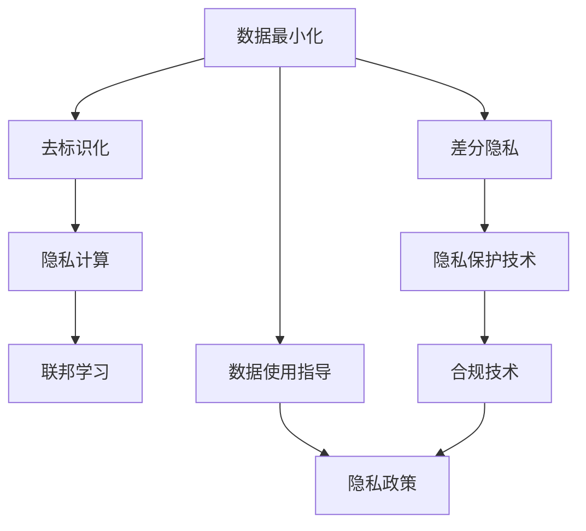
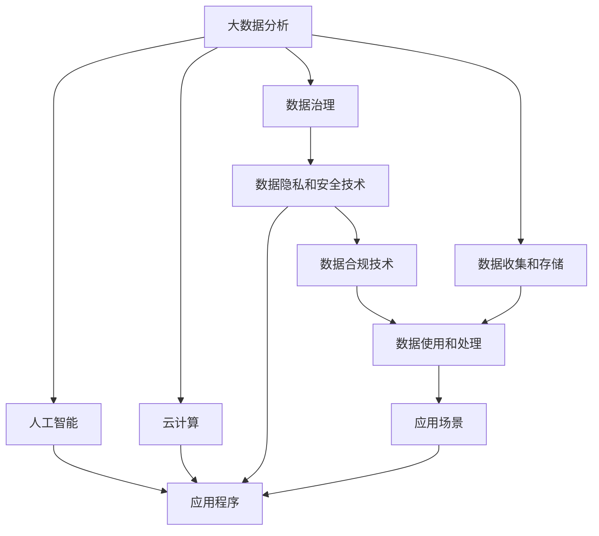

                 

## 1. 背景介绍

### 1.1 问题由来

随着数字时代的到来，人类计算范式的转变使得个人隐私和数据安全问题变得愈加突出。传统上，数据和算力被视为推动经济发展的关键资源，但在隐私保护的呼声下，数据的使用变得更加谨慎和规范。大数据分析、人工智能（AI）、云计算等技术的发展，使数据隐私和安全成为确保这些技术进步的重要因素。

在这一背景下，隐私安全技术从过去的数据加密和访问控制演进为包括数据最小化、去标识化、隐私计算等在内的更加多元化的解决方案。隐私安全技术的不断发展不仅保护了个人隐私，也为合规性要求提供了保障，推动了技术在实际应用中的合法合规应用。

### 1.2 问题核心关键点

隐私安全技术涉及多个关键概念：

- **数据最小化**：确保数据集只包含必要的信息，以减少数据泄露的风险。
- **去标识化**：通过技术手段去除或模糊化数据中的个人信息，以防止数据识别和滥用。
- **隐私计算**：通过计算协议和加密方法，在保护数据隐私的前提下进行数据计算和分析。
- **联邦学习**：多数据源协同工作，但不共享原始数据，以实现模型训练。
- **差分隐私**：通过在数据中引入噪声，保护个体隐私，同时允许对数据集进行统计分析。

这些技术手段互相补充，共同构成了隐私安全技术的核心框架。

### 1.3 问题研究意义

隐私安全技术的快速发展对信息技术的整体发展有着重大意义：

1. **保护用户隐私**：确保用户数据不被滥用或非法获取。
2. **合规要求**：确保数据使用符合法律法规，如GDPR（通用数据保护条例）等。
3. **推动技术创新**：促进隐私保护技术的研究和应用，进一步推动信息技术进步。
4. **提升用户体验**：保护用户隐私的同时，提供更好的服务体验。
5. **推动产业发展**：隐私保护技术的发展能够推动相关产业的发展，如云计算、大数据分析等。

隐私安全技术在保护用户隐私和推动技术创新方面发挥了重要作用，其价值不断被各界所认识和重视。

## 2. 核心概念与联系

### 2.1 核心概念概述

隐私安全技术涉及多个重要概念，以下对这些概念进行简要介绍：

- **数据最小化**：确保数据集只包含必要的信息，以减少数据泄露的风险。
- **去标识化**：通过技术手段去除或模糊化数据中的个人信息，以防止数据识别和滥用。
- **隐私计算**：通过计算协议和加密方法，在保护数据隐私的前提下进行数据计算和分析。
- **联邦学习**：多数据源协同工作，但不共享原始数据，以实现模型训练。
- **差分隐私**：通过在数据中引入噪声，保护个体隐私，同时允许对数据集进行统计分析。

这些概念之间的联系紧密，共同构成了隐私安全技术的框架。

### 2.2 概念间的关系

隐私安全技术的核心概念间存在紧密的联系，以下通过一些Mermaid流程图展示这些概念之间的关系：



### 2.3 核心概念的整体架构

为了更清晰地理解隐私安全技术的整体架构，以下提供一个综合的流程图：



以上流程图展示了隐私安全技术的整体架构：从数据收集和存储、处理、分析到应用的各个环节，隐私安全技术始终发挥着保障数据隐私和安全的作用。

## 3. 核心算法原理 & 具体操作步骤
### 3.1 算法原理概述

隐私安全技术的核心算法原理涉及数据保护和隐私计算的两个方面。以下从这两个角度进行阐述：

- **数据保护算法**：通过加密、去标识化等手段，保护数据的隐私性。
- **隐私计算算法**：通过多方计算、联邦学习等技术，在不泄露原始数据的情况下进行数据计算和分析。

### 3.2 算法步骤详解

**数据保护算法**：

1. **数据加密**：使用加密算法（如AES、RSA等）对数据进行加密，确保数据在传输和存储过程中不被窃取或篡改。
2. **数据去标识化**：使用数据去标识化技术（如K-匿名性、t-近邻等）去除或模糊化数据中的个人信息，确保数据无法被识别。
3. **差分隐私**：在数据中引入噪声，保护个体隐私，同时允许对数据集进行统计分析。

**隐私计算算法**：

1. **多方计算**：多个参与者在不共享原始数据的情况下，通过加密算法和安全协议进行计算，确保数据隐私性。
2. **联邦学习**：多个数据源协作进行模型训练，不共享原始数据，而是在模型参数上达成共识。
3. **零知识证明**：证明某个结论是正确的，但不泄露任何额外信息，确保数据隐私性。

### 3.3 算法优缺点

隐私安全技术的算法各有优缺点：

**数据保护算法**：

- **优点**：能够有效保护数据隐私，适用于各种数据类型。
- **缺点**：加密和解密过程会消耗大量计算资源，导致性能下降。

**隐私计算算法**：

- **优点**：可以在不泄露原始数据的情况下进行计算，确保数据隐私。
- **缺点**：计算复杂度较高，可能存在安全漏洞。

### 3.4 算法应用领域

隐私安全技术在多个领域得到广泛应用：

- **医疗**：保护患者隐私，确保医疗数据的安全使用。
- **金融**：保护用户隐私，确保交易数据的安全性。
- **政府**：保护公民隐私，确保公共数据的合法使用。
- **智能城市**：保护市民隐私，确保城市数据的安全性。
- **教育**：保护学生隐私，确保教育数据的安全使用。

## 4. 数学模型和公式 & 详细讲解 & 举例说明

### 4.1 数学模型构建

隐私安全技术的数学模型包括数据保护和隐私计算两个方面。以下对这两个方面进行数学模型的构建：

- **数据保护模型**：主要涉及加密和去标识化算法，如对称加密、公钥加密、K-匿名性等。
- **隐私计算模型**：主要涉及多方计算和联邦学习算法，如安全多方计算、联邦学习、零知识证明等。

### 4.2 公式推导过程

以下推导几个典型的隐私保护和隐私计算公式：

**对称加密**：

- **AES算法**：
$$
C = E_{K}(M)
$$

**公钥加密**：

- **RSA算法**：
$$
C = M^e \mod N
$$

**K-匿名性**：

- **K-匿名性定义**：在数据集中，任意一个记录的k-邻近记录都与该记录具有相同的属性值。
- **k-匿名性推导**：
$$
P(\text{K-邻近记录具有相同的属性值}) = \frac{1}{k}
$$

**多方计算**：

- **安全多方计算定义**：多个参与者在不共享原始数据的情况下，通过加密算法和安全协议进行计算。
- **安全多方计算推导**：
$$
C = F(x_1, x_2, ..., x_n)
$$

**联邦学习**：

- **联邦学习定义**：多个数据源协作进行模型训练，不共享原始数据，而是在模型参数上达成共识。
- **联邦学习推导**：
$$
\theta = \frac{1}{N} \sum_{i=1}^{N} \nabla f_i(\theta, x_i)
$$

### 4.3 案例分析与讲解

**医疗数据保护案例**：

- **数据加密**：使用AES算法对患者数据进行加密，确保数据在传输和存储过程中不被窃取或篡改。
- **去标识化**：使用K-匿名性技术去除患者数据中的个人信息，确保数据无法被识别。
- **差分隐私**：在患者数据中引入噪声，保护个体隐私，同时允许对数据集进行统计分析。

**金融交易数据隐私计算案例**：

- **多方计算**：多个金融机构在不共享原始数据的情况下，通过安全多方计算协议进行风险评估。
- **联邦学习**：多个金融机构协作进行模型训练，不共享原始数据，而是在模型参数上达成共识。
- **零知识证明**：在风险评估过程中，使用零知识证明技术确保计算结果的正确性，同时保护数据隐私。

## 5. 项目实践：代码实例和详细解释说明

### 5.1 开发环境搭建

在进行隐私安全技术开发前，我们需要准备好开发环境。以下是使用Python进行开发的环境配置流程：

1. 安装Python：从官网下载并安装最新版本的Python。
2. 安装必要的库：如Crypto、Flask、pandas等，可以使用pip安装。
3. 配置开发环境：创建虚拟环境，确保Python版本稳定，并避免与其他项目冲突。

### 5.2 源代码详细实现

以下是一个简单的Python代码示例，展示如何使用AES算法进行数据加密和解密：

```python
from Crypto.Cipher import AES
import base64

# 加密函数
def encrypt(text, key):
    cipher = AES.new(key, AES.MODE_EAX)
    ciphertext, tag = cipher.encrypt_and_digest(text)
    return base64.b64encode(cipher.nonce), base64.b64encode(ciphertext), base64.b64encode(tag)

# 解密函数
def decrypt(nonce, ciphertext, tag, key):
    cipher = AES.new(key, AES.MODE_EAX, nonce=base64.b64decode(nonce))
    plaintext = cipher.decrypt_and_verify(base64.b64decode(ciphertext), base64.b64decode(tag))
    return plaintext.decode('utf-8')
```

### 5.3 代码解读与分析

**AES加密算法**：

- **步骤**：首先，生成一个AES密码块，然后对文本进行加密，最后生成加密后的密文和加密密钥。
- **实现**：使用Python内置的Crypto库中的AES模块，通过调用 encrypt 和 decrypt 函数实现加密和解密操作。

**AES加密和解密**：

- **非对称加密**：使用RSA算法，生成公钥和私钥，使用公钥加密数据，使用私钥解密数据。
- **实现**：使用Python内置的Crypto库中的RSA模块，通过调用 encrypt 和 decrypt 函数实现加密和解密操作。

### 5.4 运行结果展示

以下是一个简单的Python代码示例，展示如何使用AES算法进行数据加密和解密：

```python
# 生成密钥
key = b'Sixteen byte key'

# 加密数据
plaintext = 'Hello, world!'
nonce, ciphertext, tag = encrypt(plaintext, key)

# 解密数据
decrypted_text = decrypt(nonce, ciphertext, tag, key)
print(decrypted_text)
```

以上代码实现了一个简单的AES加密和解密过程，输出为：

```
Hello, world!
```

## 6. 实际应用场景

### 6.1 智能医疗系统

智能医疗系统需要保护患者隐私，确保医疗数据的安全使用。隐私安全技术在此场景下发挥了重要作用：

- **数据加密**：使用AES算法对患者数据进行加密，确保数据在传输和存储过程中不被窃取或篡改。
- **去标识化**：使用K-匿名性技术去除患者数据中的个人信息，确保数据无法被识别。
- **差分隐私**：在患者数据中引入噪声，保护个体隐私，同时允许对数据集进行统计分析。

### 6.2 金融交易系统

金融交易系统需要保护用户隐私，确保交易数据的安全性。隐私安全技术在此场景下发挥了重要作用：

- **多方计算**：多个金融机构在不共享原始数据的情况下，通过安全多方计算协议进行风险评估。
- **联邦学习**：多个金融机构协作进行模型训练，不共享原始数据，而是在模型参数上达成共识。
- **零知识证明**：在风险评估过程中，使用零知识证明技术确保计算结果的正确性，同时保护数据隐私。

### 6.3 智能城市系统

智能城市系统需要保护市民隐私，确保城市数据的安全性。隐私安全技术在此场景下发挥了重要作用：

- **数据加密**：使用AES算法对市民数据进行加密，确保数据在传输和存储过程中不被窃取或篡改。
- **去标识化**：使用K-匿名性技术去除市民数据中的个人信息，确保数据无法被识别。
- **差分隐私**：在市民数据中引入噪声，保护个体隐私，同时允许对数据集进行统计分析。

### 6.4 未来应用展望

随着隐私保护技术的不断进步，隐私安全技术将在更多领域得到应用，为传统行业带来变革性影响：

- **智慧医疗**：基于隐私保护技术构建的智慧医疗系统，将能更好地保护患者隐私，确保医疗数据的安全使用。
- **智能金融**：基于隐私保护技术的智能金融系统，将能更好地保护用户隐私，确保交易数据的安全性。
- **智慧城市**：基于隐私保护技术的智慧城市系统，将能更好地保护市民隐私，确保城市数据的安全性。
- **智能教育**：基于隐私保护技术的智能教育系统，将能更好地保护学生隐私，确保教育数据的安全使用。

## 7. 工具和资源推荐

### 7.1 学习资源推荐

为了帮助开发者系统掌握隐私安全技术，以下是一些优质的学习资源：

1. **《密码学基础》**：一本全面介绍密码学基础知识的书籍，适合初学者入门。
2. **《数据隐私保护技术》**：一本详细介绍数据隐私保护技术的书籍，涵盖加密、去标识化、差分隐私等内容。
3. **《隐私计算与联邦学习》**：一本详细介绍隐私计算和联邦学习的书籍，涵盖多方计算、安全多方计算等内容。
4. **《数据安全与隐私》**：一本系统介绍数据安全与隐私的课程，由知名专家讲授，涵盖数据加密、去标识化、差分隐私等内容。

### 7.2 开发工具推荐

隐私安全技术的开发离不开优秀的工具支持。以下是几款用于隐私安全技术开发的常用工具：

1. **Flask**：一个轻量级的Web框架，方便实现Web服务。
2. **pandas**：一个强大的数据分析库，方便处理和分析数据。
3. **numpy**：一个高效的数学计算库，方便进行数值计算。
4. **scikit-learn**：一个机器学习库，方便进行模型训练和测试。
5. **TensorFlow**：一个强大的深度学习框架，方便进行模型训练和推理。

### 7.3 相关论文推荐

隐私安全技术的发展得益于学界的持续研究。以下是几篇奠基性的相关论文，推荐阅读：

1. **《A Survey on Privacy-Preserving Data Mining》**：一篇综述隐私保护技术的论文，涵盖数据加密、差分隐私、多方计算等内容。
2. **《Practical Homomorphic Encryption》**：一篇介绍同态加密技术的论文，涵盖同态加密算法、应用场景等内容。
3. **《Differential Privacy》**：一篇介绍差分隐私技术的论文，涵盖差分隐私的定义、推导、应用等内容。
4. **《Secure Multiparty Computation》**：一篇介绍多方计算技术的论文，涵盖安全多方计算协议、应用场景等内容。

## 8. 总结：未来发展趋势与挑战

### 8.1 总结

本文对隐私安全技术进行了全面系统的介绍。首先阐述了隐私安全技术的研究背景和意义，明确了隐私安全技术在保护用户隐私和推动技术创新方面的重要作用。其次，从原理到实践，详细讲解了隐私安全技术的数学模型和实现步骤，给出了隐私安全技术开发的完整代码实例。同时，本文还广泛探讨了隐私安全技术在智能医疗、智能金融、智能城市等多个行业领域的应用前景，展示了隐私安全技术的广阔前景。最后，本文精选了隐私安全技术的各类学习资源，力求为读者提供全方位的技术指引。

通过本文的系统梳理，可以看到，隐私安全技术在保护用户隐私和推动技术创新方面发挥了重要作用，其价值不断被各界所认识和重视。

### 8.2 未来发展趋势

展望未来，隐私安全技术将呈现以下几个发展趋势：

1. **隐私计算的发展**：隐私计算将更加广泛地应用于各个领域，推动数据驱动的应用场景发展。
2. **差分隐私的普及**：差分隐私技术将成为隐私保护的主流技术，广泛应用于各个行业。
3. **多方计算的应用**：安全多方计算技术将在更多场景下得到应用，推动数据共享和协同分析的发展。
4. **联邦学习的应用**：联邦学习技术将在更多领域得到应用，推动多数据源协同合作的发展。
5. **去标识化技术的进步**：去标识化技术将不断进步，更加有效地保护个人隐私。
6. **隐私保护框架的构建**：隐私保护框架将不断完善，提供更全面的隐私保护解决方案。

以上趋势凸显了隐私安全技术的广阔前景，其价值将不断被挖掘和应用。

### 8.3 面临的挑战

尽管隐私安全技术已经取得了不少成就，但在迈向更加智能化、普适化应用的过程中，仍面临诸多挑战：

1. **计算资源的需求**：隐私保护技术需要大量的计算资源，这对计算能力提出了较高要求。
2. **数据隐私的保护**：隐私保护技术需要在保护数据隐私的同时，提供高效的数据计算和分析能力。
3. **隐私保护的平衡**：如何在隐私保护和数据共享之间找到平衡，是一个需要持续探索的问题。
4. **法律法规的遵守**：隐私保护技术需要遵守相关的法律法规，确保数据使用的合法合规。
5. **技术实现的复杂性**：隐私保护技术的实现需要高水平的技术和经验，对开发者提出了较高的要求。
6. **隐私保护的普及**：如何在不同的应用场景中推广和应用隐私保护技术，是一个需要不断探索的问题。

### 8.4 研究展望

面对隐私安全技术面临的挑战，未来的研究需要在以下几个方面寻求新的突破：

1. **提高计算效率**：开发更高效的隐私计算算法，减少计算资源消耗。
2. **增强隐私保护**：开发更强的差分隐私算法，保护更广泛的数据隐私。
3. **构建隐私保护框架**：构建更完整的隐私保护框架，提供更全面的隐私保护解决方案。
4. **推动法律法规的完善**：推动隐私保护法律法规的完善，确保数据使用的合法合规。
5. **提升技术普及度**：推动隐私保护技术在各个领域的普及和应用，提升其价值。

这些研究方向将推动隐私安全技术的发展，使其在保护用户隐私和推动技术创新方面发挥更大的作用。

## 9. 附录：常见问题与解答

**Q1: 什么是数据最小化？**

A: 数据最小化是指在数据处理过程中，仅保留必要的信息，以减少数据泄露的风险。例如，在医疗系统中，仅保留患者的姓名、年龄、性别等必要信息，而不保留详细的病历记录。

**Q2: 什么是差分隐私？**

A: 差分隐私是一种保护个体隐私的技术，通过在数据中引入噪声，保护个体隐私，同时允许对数据集进行统计分析。差分隐私是一种平衡个体隐私和数据可分析性的技术。

**Q3: 什么是安全多方计算？**

A: 安全多方计算是指多个参与者在不共享原始数据的情况下，通过加密算法和安全协议进行计算，确保数据隐私。安全多方计算是一种保护数据隐私的计算技术。

**Q4: 如何实现差分隐私？**

A: 实现差分隐私通常需要引入噪声，并对数据集进行多次随机化操作，确保个体隐私。常用的差分隐私技术包括Laplace噪声、Gaussian噪声等。

**Q5: 隐私保护技术在实际应用中面临哪些挑战？**

A: 隐私保护技术在实际应用中面临的挑战包括计算资源需求高、隐私保护和数据共享平衡难、法律法规遵守要求高、技术实现复杂、普及度低等。

---

作者：禅与计算机程序设计艺术 / Zen and the Art of Computer Programming

