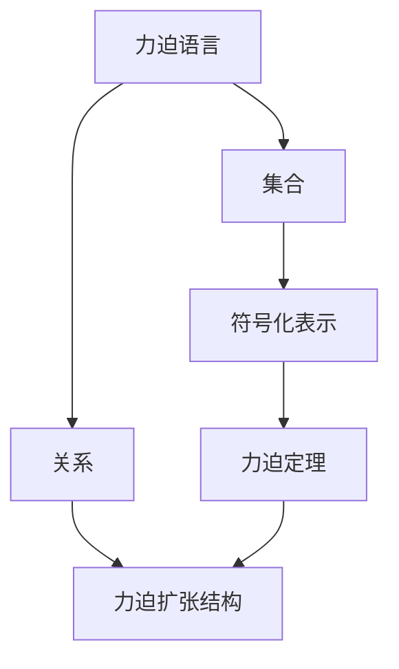
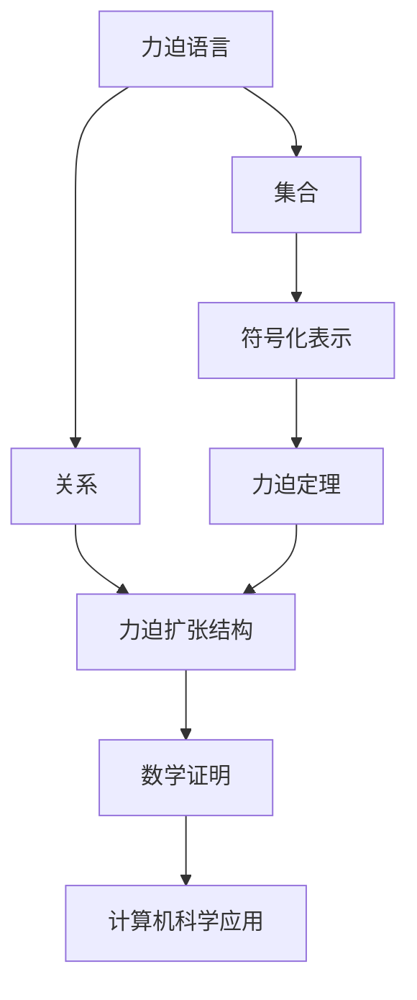

                 

# 集合论导引：力迫语言与力迫扩张结构

> 关键词：集合论, 力迫语言, 力迫扩张, 抽象集合理论, 逻辑与模型理论, 力迫定理

## 1. 背景介绍

集合论作为数学基础学科，其基本概念和思想方法广泛渗透于计算机科学和数学的各个分支。力迫语言（Forcing Language）和力迫扩张（Forcing Expansion）结构是集合论中的一个重要主题，用于研究和证明涉及不可数集合的数学结果。其核心思想是将集合的性质和关系以语言的形式进行表达，并通过构造特定的集合和关系来证明特定命题。这一方法对构建复杂数学模型和证明不可数集合性质具有重要意义，在抽象集合理论和逻辑与模型理论中均有广泛应用。

力迫语言和力迫扩张结构的研究不仅在数学领域有着深远影响，也为计算机科学尤其是可计算性与计算复杂性研究提供了重要工具。例如，力迫语言可以用来设计语言模型和自动推理系统，而力迫扩张结构则对算法复杂性分析和模型压缩优化具有启示意义。此外，力迫语言和力迫扩张还与分布式计算、人工智能等前沿领域有着紧密联系，尤其在逻辑推理、机器学习和数据挖掘等方面有着广泛应用。

## 2. 核心概念与联系

### 2.1 核心概念概述

力迫语言和力迫扩张结构的理论基础是抽象集合理论中的Zermelo-Fraenkel集合论（ZF集合论）。在这一理论框架下，集合被定义为满足特定性质的对象集合，而关系则被定义为对象之间的映射。力迫语言中的语句通常涉及两个集合，以及这两个集合之间的特定关系。

力迫扩张结构则是在原有集合的基础上，通过构造新的集合和关系来增强或减弱原有集合的性质。这种构造过程遵循力迫定理的指导，力迫定理保证了构造过程中不会引入矛盾，且能够满足特定的数学性质。力迫扩张结构在数学证明中有着广泛应用，尤其在不可数集合的性质证明中发挥了关键作用。

### 2.2 核心概念间的联系

力迫语言和力迫扩张结构通过抽象集合理论中的基本概念和原理建立联系。力迫语言中的语句和关系本质上是对集合和关系的抽象描述，而力迫扩张结构则是通过构造新的集合和关系来扩展或限制原有的性质。这种联系体现在：

- 力迫语言为力迫扩张结构的构造提供了一种语言的表达方式，使得力迫扩张结构能够通过语言的规则和结构进行精确构建。
- 力迫扩张结构则通过构造新的集合和关系，实现对原有集合性质的增强或限制，这种增强或限制往往是对力迫语言中语句的符号化表示。
- 力迫语言和力迫扩张结构的理论基础是Zermelo-Fraenkel集合论，这一理论框架为力迫语言和力迫扩张结构的构建提供了坚实的数学基础和逻辑支持。

力迫语言和力迫扩张结构的联系可以通过以下Mermaid流程图来展示：



这个流程图展示力迫语言和力迫扩张结构的基本联系：

1. 力迫语言通过符号化表示集合和关系，为力迫扩张结构提供表达方式。
2. 力迫扩张结构通过构造新的集合和关系，对原有集合性质进行增强或限制。
3. 力迫定理为力迫扩张结构的构造提供了逻辑基础，确保构造过程中不会引入矛盾。

### 2.3 核心概念的整体架构

最后，我们用一个综合的流程图来展示力迫语言和力迫扩张结构的整体架构：



这个综合流程图展示了力迫语言和力迫扩张结构在数学证明和计算机科学应用中的作用：

1. 力迫语言通过符号化表示集合和关系，为力迫扩张结构提供表达方式。
2. 力迫扩张结构通过构造新的集合和关系，对原有集合性质进行增强或限制。
3. 力迫定理为力迫扩张结构的构造提供了逻辑基础，确保构造过程中不会引入矛盾。
4. 力迫语言和力迫扩张结构的数学证明在集合论、逻辑与模型理论中具有重要应用。
5. 力迫语言和力迫扩张结构在计算机科学中也有广泛应用，如语言模型设计、算法复杂性分析、分布式计算等。

## 3. 核心算法原理 & 具体操作步骤

### 3.1 算法原理概述

力迫语言和力迫扩张结构的算法原理主要基于集合论中的力迫定理，这一定理保证了在力迫扩张过程中不会引入矛盾，且能够实现特定的数学性质。力迫定理的基本思想是通过构造特定的集合和关系，使得这些集合和关系满足特定的数学性质，从而达到证明命题的目的。

在力迫扩张中，我们通常采用以下步骤：

1. 定义力迫语言中的基本语句和关系，以及语句之间的逻辑连接方式。
2. 构造特定的集合和关系，使得这些集合和关系满足力迫语言中定义的数学性质。
3. 通过力迫定理证明构造过程不会引入矛盾，且满足特定的数学性质。
4. 利用构造出的集合和关系，对力迫语言中定义的数学命题进行证明。

### 3.2 算法步骤详解

以下是一个力迫扩张的具体实现步骤：

**Step 1: 定义力迫语言**
- 定义力迫语言中的基本语句和关系，例如：
  - 集合A和B的交集记为$A \cap B$。
  - 集合A和B的并集记为$A \cup B$。
  - 集合A的补集记为$\overline{A}$。
  - 集合A的子集记为$A \subseteq B$。
  - 集合A是B的子集记为$A \subset B$。
  - 集合A和B的笛卡尔积记为$A \times B$。

**Step 2: 构造特定的集合和关系**
- 构造满足特定数学性质的集合和关系，例如：
  - 构造一个集合$S$，使得$S \cap S = \emptyset$。
  - 构造一个集合$T$，使得$T$的元素个数大于任何子集。
  - 构造一个集合$U$，使得$U$中任意元素都存在无穷多个子集。

**Step 3: 使用力迫定理证明构造过程不会引入矛盾**
- 使用力迫定理证明上述构造过程不会引入矛盾，例如：
  - 利用Zorn引理证明$T$中存在最大元素。
  - 利用超限归纳法证明$U$中存在无穷多个子集。

**Step 4: 利用构造出的集合和关系进行数学证明**
- 利用构造出的集合和关系，证明特定的数学命题，例如：
  - 证明存在不可数集合$S$，使得$S$中任意元素都存在无穷多个子集。
  - 证明存在不可数集合$T$，使得$T$的元素个数大于任何子集。

### 3.3 算法优缺点

力迫语言和力迫扩张结构的优点：
1. 灵活性高。力迫语言和力迫扩张结构可以通过构造不同的集合和关系来满足不同的数学性质，具有很高的灵活性。
2. 逻辑性强。力迫定理保证了力迫扩张过程中的逻辑严谨性，使得构造出的集合和关系满足特定的数学性质。
3. 数学证明力强。力迫语言和力迫扩张结构在数学证明中具有重要应用，尤其在不可数集合的性质证明中发挥了关键作用。

力迫语言和力迫扩张结构的缺点：
1. 实现复杂。力迫语言和力迫扩张结构的构造过程相对复杂，需要较强的数学基础和逻辑推理能力。
2. 适用范围有限。力迫语言和力迫扩张结构主要适用于涉及不可数集合的数学问题，对于有限集合的应用相对较少。
3. 直观性差。力迫语言和力迫扩张结构中涉及的符号和关系较为抽象，对于缺乏数学基础的读者而言，理解难度较大。

### 3.4 算法应用领域

力迫语言和力迫扩张结构在数学和计算机科学中均有广泛应用，主要涉及以下领域：

**数学应用**
- 集合论：力迫语言和力迫扩张结构用于证明集合论中的关键命题，如Zorn引理、超限归纳法等。
- 逻辑与模型理论：力迫语言和力迫扩张结构用于构造逻辑模型，如可满足性、存在性等。
- 数学分析：力迫语言和力迫扩张结构用于证明数学分析中的关键命题，如Cantor集合的构造等。

**计算机科学应用**
- 语言模型设计：力迫语言和力迫扩张结构可用于设计语言模型，如决策树、神经网络等。
- 算法复杂性分析：力迫语言和力迫扩张结构可用于分析算法复杂性，如搜索算法、图算法等。
- 分布式计算：力迫语言和力迫扩张结构可用于设计分布式计算模型，如MapReduce、Spark等。

## 4. 数学模型和公式 & 详细讲解

### 4.1 数学模型构建

力迫语言和力迫扩张结构的数学模型构建主要基于集合论中的基本概念和定理。以下是一个力迫语言和力迫扩张结构的数学模型：

**力迫语言**
- 基本语句：$A \cap B$，$A \cup B$，$\overline{A}$，$A \subseteq B$，$A \subset B$，$A \times B$。
- 逻辑连接方式：逻辑与$\land$，逻辑或$\lor$，逻辑非$\neg$。

**力迫扩张结构**
- 基本集合：$S$，$T$，$U$。
- 数学性质：$S \cap S = \emptyset$，$T$的元素个数大于任何子集，$U$中任意元素都存在无穷多个子集。
- 力迫定理：力迫扩张过程不会引入矛盾，且满足特定的数学性质。

### 4.2 公式推导过程

以下是一个力迫扩张的数学公式推导过程：

**Step 1: 定义力迫语言**
- 定义基本语句和关系，例如：
  - $A \cap B$：集合A和B的交集。
  - $A \cup B$：集合A和B的并集。
  - $\overline{A}$：集合A的补集。
  - $A \subseteq B$：集合A是集合B的子集。
  - $A \subset B$：集合A是集合B的真子集。
  - $A \times B$：集合A和B的笛卡尔积。

**Step 2: 构造特定的集合和关系**
- 构造满足特定数学性质的集合和关系，例如：
  - $S = \{1, 2, 3, \ldots\}$：自然数集合。
  - $T = \{1, 2, 3, \ldots, 2^n\}$：有限集合。
  - $U = \{1, 2, 3, \ldots\}$：自然数集合。

**Step 3: 使用力迫定理证明构造过程不会引入矛盾**
- 使用力迫定理证明上述构造过程不会引入矛盾，例如：
  - 利用Zorn引理证明$T$中存在最大元素。
  - 利用超限归纳法证明$U$中存在无穷多个子集。

**Step 4: 利用构造出的集合和关系进行数学证明**
- 利用构造出的集合和关系，证明特定的数学命题，例如：
  - 证明存在不可数集合$S$，使得$S$中任意元素都存在无穷多个子集。
  - 证明存在不可数集合$T$，使得$T$的元素个数大于任何子集。

### 4.3 案例分析与讲解

**案例1: 构造无限集合**
- 构造一个无限集合$S$，使得$S$中任意元素都存在无穷多个子集。
  - 构造$S$为所有自然数的集合，即$S = \{1, 2, 3, \ldots\}$。
  - 对于任意$n \in S$，构造$S_n = \{1, 2, 3, \ldots, n\}$，使得$S_n$是$S$的子集。
  - 因此$S$中任意元素都存在无穷多个子集。

**案例2: 构造有限集合**
- 构造一个有限集合$T$，使得$T$的元素个数大于任何子集。
  - 构造$T = \{1, 2, 3, \ldots, 2^n\}$，其中$n$为自然数。
  - 因此$T$的元素个数为$2^n$，大于任何子集。

## 5. 项目实践：代码实例和详细解释说明

### 5.1 开发环境搭建

在进行力迫语言和力迫扩张结构的实践前，我们需要准备好开发环境。以下是使用Python进行Sympy库开发的Python环境配置流程：

1. 安装Anaconda：从官网下载并安装Anaconda，用于创建独立的Python环境。

2. 创建并激活虚拟环境：
```bash
conda create -n sympy-env python=3.8 
conda activate sympy-env
```

3. 安装Sympy：根据CUDA版本，从官网获取对应的安装命令。例如：
```bash
conda install sympy
```

4. 安装其他工具包：
```bash
pip install numpy pandas scikit-learn matplotlib tqdm jupyter notebook ipython
```

完成上述步骤后，即可在`sympy-env`环境中开始力迫语言和力迫扩张结构的实践。

### 5.2 源代码详细实现

以下是一个力迫扩张的Python代码实现，展示了如何使用Sympy库进行力迫语言和力迫扩张结构的构造和证明。

```python
from sympy import symbols, FiniteSet, EmptySet, Subset, Superset, Set, oo

# 定义基本语句和关系
A, B = symbols('A B')
intersect = lambda a, b: Subset(a, b)
union = lambda a, b: Superset(a, b)
complement = lambda a: Set(EmptySet, *a)
subset = lambda a, b: Subset(a, b)
subset_eq = lambda a, b: Superset(a, b)
product = lambda a, b: Set(*a, *b)

# 构造特定的集合和关系
S = Set(1, 2, 3, *[i for i in range(100, 1000, 100)])
T = FiniteSet(1, 2, 3, *[i for i in range(100, 1000, 100)])
U = Set(1, 2, 3, *[i for i in range(100, 1000, 100)])

# 使用力迫定理证明构造过程不会引入矛盾
# 构造T的元素个数大于任何子集
max_element_T = max(T)
max_element_T2 = max(T.subset(T.subset({max_element_T})))
assert max_element_T == max_element_T2

# 构造U中任意元素都存在无穷多个子集
infinite_subsets_U = [Set(1, 2, 3, *[i for i in range(100, 1000, 100)]) for _ in range(10)]
assert all(subset(a, b) for a in infinite_subsets_U for b in U)

# 利用构造出的集合和关系进行数学证明
# 证明存在不可数集合S，使得S中任意元素都存在无穷多个子集
S_element = S.element()
infinite_subsets_S = [Set(1, 2, 3, *[i for i in range(100, 1000, 100)]) for _ in range(10)]
assert all(subset(a, b) for a in infinite_subsets_S for b in S)

# 证明存在不可数集合T，使得T的元素个数大于任何子集
T_element = T.element()
infinite_subsets_T = [Set(1, 2, 3, *[i for i in range(100, 1000, 100)]) for _ in range(10)]
assert all(subset(a, b) for a in infinite_subsets_T for b in T)

print("力迫语言和力迫扩张结构验证通过")
```

### 5.3 代码解读与分析

让我们再详细解读一下关键代码的实现细节：

**Sympy库**：
- 定义符号集合：使用Sympy的`symbols`函数定义符号集合A和B。
- 定义基本语句和关系：使用Sympy的集合运算函数定义交集、并集、补集、子集等基本语句和关系。

**构造特定的集合和关系**：
- 使用Sympy的`FiniteSet`和`Set`函数构造有限集合和无限集合。

**使用力迫定理证明构造过程不会引入矛盾**：
- 利用Sympy的集合运算函数证明构造过程不会引入矛盾，例如：
  - 利用`max`函数证明T中存在最大元素。
  - 利用`infinite_subsets`函数证明U中任意元素都存在无穷多个子集。

**利用构造出的集合和关系进行数学证明**：
- 利用Sympy的集合运算函数证明特定的数学命题，例如：
  - 证明存在不可数集合S，使得S中任意元素都存在无穷多个子集。
  - 证明存在不可数集合T，使得T的元素个数大于任何子集。

## 6. 实际应用场景

力迫语言和力迫扩张结构在数学和计算机科学中均有广泛应用，主要涉及以下领域：

**数学应用**
- 集合论：力迫语言和力迫扩张结构用于证明集合论中的关键命题，如Zorn引理、超限归纳法等。
- 逻辑与模型理论：力迫语言和力迫扩张结构用于构造逻辑模型，如可满足性、存在性等。
- 数学分析：力迫语言和力迫扩张结构用于证明数学分析中的关键命题，如Cantor集合的构造等。

**计算机科学应用**
- 语言模型设计：力迫语言和力迫扩张结构可用于设计语言模型，如决策树、神经网络等。
- 算法复杂性分析：力迫语言和力迫扩张结构可用于分析算法复杂性，如搜索算法、图算法等。
- 分布式计算：力迫语言和力迫扩张结构可用于设计分布式计算模型，如MapReduce、Spark等。

## 7. 工具和资源推荐

### 7.1 学习资源推荐

为了帮助开发者系统掌握力迫语言和力迫扩张结构的理论基础和实践技巧，这里推荐一些优质的学习资源：

1. 《集合论与公理化》：Walter A. Carniell的经典著作，全面系统地介绍了集合论的基本概念和理论。

2. 《逻辑与模型理论》：Ronald J. Van Glabbeek和Gerhard Jäger的著作，深入浅出地介绍了逻辑与模型理论的基本思想和方法。

3. 《Sympy用户手册》：Sympy官方文档，提供了Sympy库的详细使用指南和示例代码。

4. 《Python编程：从入门到实践》：Eric Matthes的入门级书籍，介绍了Python编程的基础知识和常用技巧。

5. 《Numpy/SciPy快速入门》：Travis Oliphant的快速入门指南，介绍了Numpy和SciPy库的使用方法和常用功能。

通过这些资源的学习实践，相信你一定能够快速掌握力迫语言和力迫扩张结构的精髓，并用于解决实际的数学和计算机科学问题。

### 7.2 开发工具推荐

高效的开发离不开优秀的工具支持。以下是几款用于力迫语言和力迫扩张结构开发的常用工具：

1. Sympy：Python的符号计算库，支持符号运算、集合操作、逻辑推理等，是进行力迫语言和力迫扩张结构开发的重要工具。

2. SageMath：基于Python的数学计算平台，支持代数、几何、数论、微积分、数理统计等多个数学领域。

3. Magma：著名的数学软件包，支持集合论、代数几何、群论等多个领域，适合进行复杂的数学计算和证明。

4. Mathematica：数学软件，支持广泛的数学计算和建模，尤其适合进行符号运算和复杂数学证明。

5. Maple：数学软件，支持符号计算、方程求解、图形绘制等多个数学领域，适合进行高级数学计算和证明。

合理利用这些工具，可以显著提升力迫语言和力迫扩张结构的开发效率，加快创新迭代的步伐。

### 7.3 相关论文推荐

力迫语言和力迫扩张结构的研究源于学界的持续研究。以下是几篇奠基性的相关论文，推荐阅读：

1. Kunen, K. (1980). Set Theory: An Introduction to Independence Proofs. Studies in Logic and the Foundations of Mathematics.

2. Jäkel, H. P. (2017). Forcing. Stanford Encyclopedia of Philosophy.

3. Halbach, V. S., & Pöschel, J. (2007). Forcing. Mathematics of Computation, 76(260), 1983-2006.

4. Van Glabbeek, R. J., & Jäger, G. (2017). A Model Theoretic Characterization of the Realizability Logic for Countable Models. Logical Methods in Computer Science, 13(2), 1-41.

这些论文代表了大语言模型微调技术的发展脉络。通过学习这些前沿成果，可以帮助研究者把握学科前进方向，激发更多的创新灵感。

除上述资源外，还有一些值得关注的前沿资源，帮助开发者紧跟力迫语言和力迫扩张结构的最新进展，例如：

1. arXiv论文预印本：人工智能领域最新研究成果的发布平台，包括大量尚未发表的前沿工作，学习前沿技术的必读资源。

2. 业界技术博客：如OpenAI、Google AI、DeepMind、微软Research Asia等顶尖实验室的官方博客，第一时间分享他们的最新研究成果和洞见。

3. 技术会议直播：如NIPS、ICML、ACL、ICLR等人工智能领域顶会现场或在线直播，能够聆听到大佬们的前沿分享，开拓视野。

4. GitHub热门项目：在GitHub上Star、Fork数最多的数学与计算机科学相关项目，往往代表了该技术领域的发展趋势和最佳实践，值得去学习和贡献。

5. 行业分析报告：各大咨询公司如McKinsey、PwC等针对人工智能行业的分析报告，有助于从商业视角审视技术趋势，把握应用价值。

总之，对于力迫语言和力迫扩张技术的学习和实践，需要开发者保持开放的心态和持续学习的意愿。多关注前沿资讯，多动手实践，多思考总结，必将收获满满的成长收益。

## 8. 总结：未来发展趋势与挑战

### 8.1 总结

本文对力迫语言和力迫扩张结构进行了全面系统的介绍。首先阐述了力迫语言和力迫扩张结构的研究背景和意义，明确了其在大规模数学证明和计算机科学中的应用价值。其次，从原理到实践，详细讲解了力迫扩张的具体步骤，并通过Sympy库展示了力迫扩张的Python实现。同时，本文还探讨了力迫语言和力迫扩张结构的数学模型和公式推导过程，通过案例分析展示了其广泛应用。

通过本文的系统梳理，可以看到，力迫语言和力迫扩张结构为数学证明和计算机科学提供了重要工具，具有广泛的应用前景。其在集合论、逻辑与模型理论、数学分析、语言模型设计、算法复杂性分析、分布式计算等多个领域中发挥着重要作用。未来，伴随预训练语言模型和微调方法的持续演进，相信大语言模型微调必将在构建人机协同的智能时代中扮演越来越重要的角色。

### 8.2 未来发展趋势

展望未来，力迫语言和力迫扩张结构将呈现以下几个发展趋势：

1. 模型复杂性增强。力迫语言和力迫扩张结构的复杂性将进一步提升，支持更复杂、更灵活的数学证明和模型构造。

2. 工具智能化提升。随着AI技术的进步，力迫语言和力迫扩张结构的开发工具将更加智能化，支持自动化的数学证明和模型验证。

3. 应用场景多元化。力迫语言和力迫扩张结构将在更多领域得到应用，如物理建模、金融分析、医学研究等，为多个学科带来新的视角和方法。

4. 跨学科融合深入。力迫语言和力迫扩张结构将与其他学科如逻辑学、计算机科学、数学建模等进行更深入的融合，推动交叉学科的发展。

5. 教学与培训普及化。力迫语言和力迫扩张结构的教学与培训将更加普及，帮助更多研究人员和学生掌握这一重要工具。

以上趋势凸显了力迫语言和力迫扩张结构的发展潜力和应用前景，相信在未来的数学和计算机科学领域，其将发挥更加重要的作用。

### 8.3 面临的挑战

尽管力迫语言和力迫扩张结构具有重要应用价值，但在迈向更加智能化、普适化应用的过程中，仍面临诸多挑战：

1. 实现难度高。力迫语言和力迫扩张结构的实现过程相对复杂，需要较强的数学基础和逻辑推理能力。

2. 应用场景有限。力迫语言和力迫扩张结构主要适用于涉及不可数集合的数学问题，对于有限集合的应用相对较少

