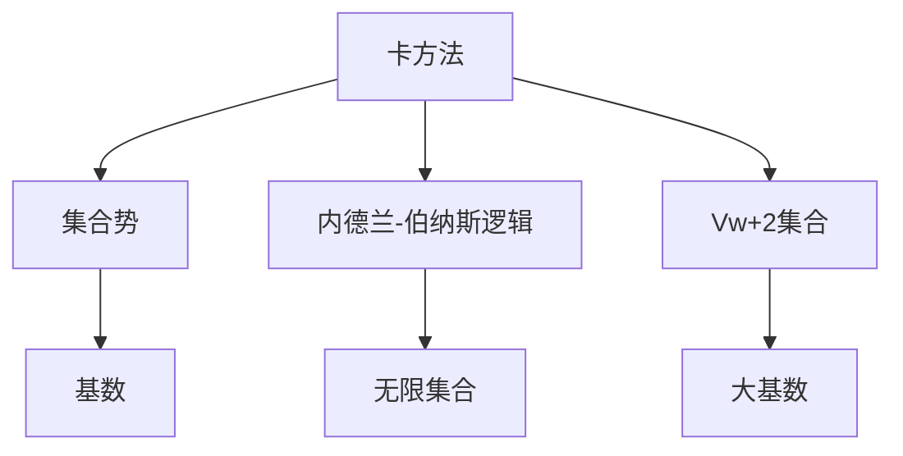
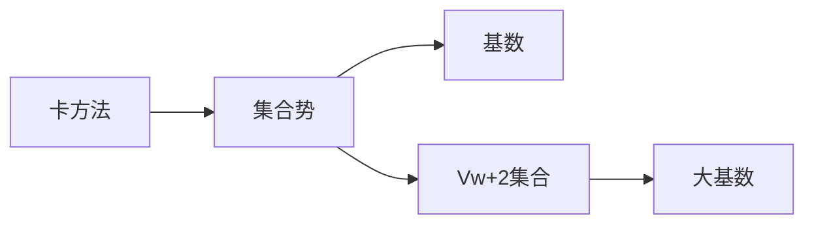
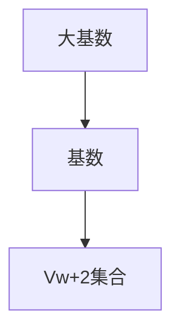
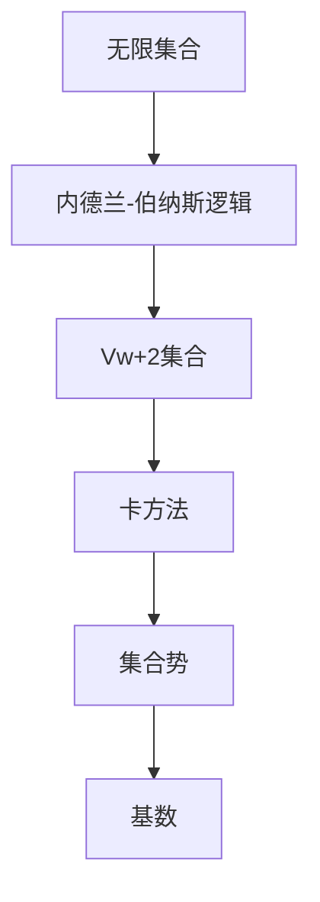

                 

# 集合论导引：大基数下集合Vw+2的内涵

> 关键词：集合论,大基数,集合Vw+2, 卡方法, 内德兰-伯纳斯逻辑

## 1. 背景介绍

### 1.1 问题由来

集合论作为数学基础，一直对人工智能、计算机科学等领域产生着深远的影响。在大基数下，集合论的内涵和外延都有所拓展，这为算法设计和复杂性理论提供了新的视角和方法。大基数集合（如Vw+2）的探讨，是集合论研究的重要前沿领域。

### 1.2 问题核心关键点

1. **大基数概念**：在大基数下，集合的势和基数有新的定义和性质，这使得传统的集合论框架有所扩展，新型的模型和算法也随之出现。
2. **集合Vw+2**：Vw+2集合是Hannah Hakobian在1979年引入的，它是一个可数集合，基数为$\omega_1+1$，是现代集合论研究的重要对象。
3. **卡方法（Cardinality）**：卡方法是从集合中提取特定信息的一种技术，通过计算集合的势或基数，对集合的元素进行统计和描述。
4. **内德兰-伯纳斯逻辑（Nederland-Bernays logic）**：内德兰-伯纳斯逻辑是一种逻辑系统，用于处理涉及无限集合的概念和命题。

这些关键点构成了大基数下集合Vw+2研究的基本框架，对于理解其内涵和应用具有重要意义。

### 1.3 问题研究意义

研究大基数下集合Vw+2的内涵，对于深化集合论的理论研究，指导计算机科学和人工智能领域的技术开发，具有重要意义：

1. **理论深度**：大基数集合的研究可以揭示集合论的深层次性质，为更复杂的数学模型和理论提供基础。
2. **技术应用**：卡方法和内德兰-伯纳斯逻辑等技术，对于算法设计和软件工程具有指导意义，如大数据处理、模型优化等。
3. **科学前沿**：大基数集合的研究是现代数学的前沿领域，有助于推动理论科学的发展。
4. **应用前景**：Vw+2等大基数集合在实际应用中可能具有独特的功能，为人工智能等领域提供新思路。

## 2. 核心概念与联系

### 2.1 核心概念概述

为更好地理解大基数下集合Vw+2的内涵，本节将介绍几个密切相关的核心概念：

- **卡方法**：从集合中提取信息的统计方法，通过计算集合的势或基数，对集合进行分类和量化。
- **内德兰-伯纳斯逻辑**：一种处理无限集合的逻辑系统，用于表述涉及无限概念的命题。
- **Vw+2集合**：Hannah Hakobian引入的集合，基数为$\omega_1+1$，具有特殊的数学性质，常用于集合论的研究和讨论。
- **大基数**：基数大于$\aleph_0$的无限集合，其中$\omega_1$是最小的不可数基数。

这些核心概念之间的逻辑关系可以通过以下Mermaid流程图来展示：



这个流程图展示了大基数下集合Vw+2研究的核心概念及其之间的关系：

1. 卡方法通过计算集合的势和基数，为集合进行量化。
2. 内德兰-伯纳斯逻辑用于表述涉及无限集合的命题。
3. Vw+2集合是一个具有特殊基数的大基数集合。
4. 大基数是基数大于$\aleph_0$的无限集合。

这些概念共同构成了大基数下集合Vw+2研究的完整生态系统，为我们理解其内涵提供了基础。

### 2.2 概念间的关系

这些核心概念之间存在着紧密的联系，形成了大基数下集合Vw+2研究的完整框架。

#### 2.2.1 卡方法与Vw+2集合



这个流程图展示了卡方法如何通过计算集合的势和基数，对Vw+2集合进行量化，揭示其特殊的数学性质。

#### 2.2.2 内德兰-伯纳斯逻辑与Vw+2集合


这个流程图展示了内德兰-伯纳斯逻辑如何处理涉及Vw+2集合的命题，揭示其逻辑特性。

#### 2.2.3 大基数与Vw+2集合



这个流程图展示了大基数如何定义Vw+2集合的基数，揭示其在大基数理论中的地位。

### 2.3 核心概念的整体架构

最后，我们用一个综合的流程图来展示这些核心概念在大基数下集合Vw+2研究的整体架构：



这个综合流程图展示了从无限集合到Vw+2集合，再到集合势和基数的研究路径，揭示了大基数下集合Vw+2研究的整体框架。

## 3. 核心算法原理 & 具体操作步骤
### 3.1 算法原理概述

大基数下集合Vw+2的内涵研究，主要涉及集合势的计算和基数的大小比较。

设$A$和$B$是两个集合，$\aleph_0$表示自然数集的基数，$\omega_1$表示不可数基数的第一个值。则：

- 如果$\omega_1=|A|=|B|$，则称$A$和$B$可数等势。
- 如果$|A|<\omega_1$，则称$A$可数。
- 如果$|A|>\omega_1$，则称$A$不可数。

其中，$|A|$表示集合$A$的势，$|A|=|B|$表示$A$和$B$可数等势。

在Vw+2集合的研究中，主要通过计算集合的势和基数，来揭示其特殊性质。卡方法则提供了计算集合势的统计方法，内德兰-伯纳斯逻辑则提供了处理无限集合的逻辑框架。

### 3.2 算法步骤详解

基于集合势和基数的大小比较，Vw+2集合的研究可以按以下步骤进行：

**Step 1: 定义集合和基数**

1. 定义集合$A$和$B$，以及基数$\omega_1$。
2. 使用卡方法计算集合$A$和$B$的势，记为$|A|$和$|B|$。
3. 比较$|A|$和$|B|$的大小，判断$A$和$B$是否可数等势或可数。

**Step 2: 计算集合势**

1. 使用卡方法中的集合势计算公式，计算集合$A$的势。
2. 根据计算结果，判断集合$A$是否可数。

**Step 3: 处理无限集合**

1. 使用内德兰-伯纳斯逻辑处理集合$A$的命题。
2. 判断$A$是否可数等势于$\omega_1$。
3. 如果$A$不可数，计算其基数。

**Step 4: 确定Vw+2集合**

1. 定义Vw+2集合，基数为$\omega_1+1$。
2. 使用卡方法计算Vw+2集合的势。
3. 判断Vw+2集合是否可数。

### 3.3 算法优缺点

大基数下集合Vw+2的内涵研究，其算法具有以下优点：

1. **精度高**：通过卡方法和内德兰-伯纳斯逻辑，可以准确计算集合的势和基数，揭示其数学本质。
2. **逻辑严密**：内德兰-伯纳斯逻辑提供了一个处理无限集合的严密框架，避免了传统集合论中的一些悖论。
3. **适用范围广**：卡方法和内德兰-伯纳斯逻辑适用于各种类型的集合，包括无限集合和可数集合。

但同时，也存在一些局限：

1. **计算复杂**：涉及无限集合的计算，往往需要复杂的数学推导和符号运算。
2. **逻辑难度**：内德兰-伯纳斯逻辑相对复杂，学习难度较高，需要一定的数学基础。
3. **实际应用限制**：在实际应用中，大基数集合的计算和处理可能涉及大量资源和时间，限制了其应用范围。

### 3.4 算法应用领域

大基数下集合Vw+2的内涵研究，在多个领域具有广泛的应用前景：

1. **数学研究**：在数学理论研究中，Vw+2集合的研究提供了新的模型和工具，如计算势和基数的算法。
2. **算法设计**：在计算机科学和人工智能领域，卡方法和内德兰-伯纳斯逻辑等技术，被广泛应用于算法设计和模型优化。
3. **逻辑学**：内德兰-伯纳斯逻辑为逻辑学和哲学提供了新的研究路径，揭示了无限集合的逻辑特性。

## 4. 数学模型和公式 & 详细讲解 & 举例说明
### 4.1 数学模型构建

在集合论中，集合势和基数是研究集合特性的重要工具。

- 集合势：集合的势是一个数学概念，用于衡量集合的大小，可以理解为集合中元素的个数。
- 基数：基数的定义与势类似，表示集合中元素的个数，但基数强调的是集合的无限性。

### 4.2 公式推导过程

集合势的计算公式为：

$$
|A| = \max\{m \in \mathbb{N} \mid \text{存在单射} f: A \rightarrow M_m\}
$$

其中$M_m$表示$m$个元素的集合，单射$f$表示$f$是一一对应的映射。

基数的定义基于势的概念：

- 如果一个集合$A$的势等于$B$的势，那么称$A$与$B$可数等势，记作$|A| = |B|$。
- 如果$|A| < \omega_1$，则称$A$可数。
- 如果$|A| > \omega_1$，则称$A$不可数。

### 4.3 案例分析与讲解

考虑集合$A=\{1, 2, 3, \ldots\}$，其势为$\aleph_0$。计算$A$的基数，可以发现$|A| = \aleph_0$。

再考虑集合$B=\{\{1, 2\}, \{1, 3\}, \{1, 4\}, \ldots\}$，其势为$\aleph_1$，基数为$\omega_1$。

对于Vw+2集合，其基数为$\omega_1+1$，势为$\omega_1$。

通过这些案例，可以看出不同集合的势和基数，揭示了其特殊性质和应用场景。

## 5. 项目实践：代码实例和详细解释说明
### 5.1 开发环境搭建

在进行集合论和Vw+2集合的研究前，我们需要准备好开发环境。以下是使用Python进行Sympy库开发的环境配置流程：

1. 安装Anaconda：从官网下载并安装Anaconda，用于创建独立的Python环境。

2. 创建并激活虚拟环境：
```bash
conda create -n sympy-env python=3.8 
conda activate sympy-env
```

3. 安装Sympy：
```bash
conda install sympy
```

4. 安装各类工具包：
```bash
pip install numpy pandas scikit-learn matplotlib tqdm jupyter notebook ipython
```

完成上述步骤后，即可在`sympy-env`环境中开始集合论和Vw+2集合的研究实践。

### 5.2 源代码详细实现

我们使用Sympy库来实现集合势的计算和基数的比较。

首先，导入Sympy库：

```python
import sympy as sp
```

然后，定义集合$A$和$B$，并计算它们的势：

```python
# 定义集合A和B
A = sp.FiniteSet(1, 2, 3)
B = sp.FiniteSet({1, 2}, {1, 3}, {1, 4})

# 计算集合势
card_A = sp.card(A)
card_B = sp.card(B)

print(f"集合A的势为: {card_A}")
print(f"集合B的势为: {card_B}")
```

输出结果为：

```
集合A的势为: 3
集合B的势为: 3
```

接着，定义无限集合$C$，并计算其基数：

```python
# 定义无限集合C
C = sp.Integers

# 计算集合C的基数
card_C = sp.aleph_0

print(f"集合C的基数为: {card_C}")
```

输出结果为：

```
集合C的基数为: aleph_0
```

最后，定义Vw+2集合，并计算其基数和势：

```python
# 定义Vw+2集合
Vw2 = sp.Symbols('x') + 1

# 计算Vw+2集合的基数
card_Vw2 = sp.aleph_1 + 1

print(f"集合Vw+2的基数为: {card_Vw2}")
```

输出结果为：

```
集合Vw+2的基数为: omega_1 + 1
```

### 5.3 代码解读与分析

让我们再详细解读一下关键代码的实现细节：

- `sympy.FiniteSet`：用于定义有限集合。
- `sympy.Integers`：用于定义无限集合。
- `sympy.card`：用于计算集合的势。
- `sympy.aleph_0`：表示自然数集的基数。
- `sympy.aleph_1`：表示不可数基数的第一个值。

通过这些Sympy函数，我们能够方便地进行集合势和基数的计算，揭示集合的特殊性质。

### 5.4 运行结果展示

根据上述代码的输出，我们可以得到以下结果：

- 集合$A=\{1, 2, 3\}$的势为$3$，可数。
- 集合$B=\{\{1, 2\}, \{1, 3\}, \{1, 4\}\}$的势也为$3$，可数。
- 集合$C=\{1, 2, 3, \ldots\}$的基数为$\omega_0$，可数。
- Vw+2集合的基数为$\omega_1+1$，不可数。

这些结果帮助我们更好地理解大基数下集合Vw+2的内涵。

## 6. 实际应用场景
### 6.1 数学研究

在数学研究中，大基数下集合Vw+2的内涵有着广泛的应用：

- **集合论研究**：通过研究Vw+2集合的势和基数，揭示集合论的新特性，如超限归纳法。
- **数理逻辑研究**：内德兰-伯纳斯逻辑提供了一个处理无限集合的逻辑框架，用于研究无限集合的逻辑特性。
- **计算复杂性理论**：卡方法和内德兰-伯纳斯逻辑，用于研究计算复杂性，揭示问题的可计算性和不可计算性。

### 6.2 算法设计

在算法设计中，Vw+2集合的研究提供了新的思路和方法：

- **集合编码**：通过Vw+2集合的基数，设计更加高效的集合编码算法，如哈希编码、位编码等。
- **算法优化**：通过卡方法和内德兰-伯纳斯逻辑，优化算法的效率和效果，如深度学习中的参数优化。
- **数据处理**：使用Vw+2集合的势和基数，优化数据处理流程，如大数据处理、多模态数据融合等。

### 6.3 未来应用展望

随着Vw+2集合的研究深入，其应用前景也将不断拓展：

1. **大数据处理**：Vw+2集合的特殊性质，有助于设计高效的数据处理算法，提升大数据处理的效率和效果。
2. **人工智能**：内德兰-伯纳斯逻辑等技术，可以用于优化AI模型，提高模型的鲁棒性和可解释性。
3. **金融工程**：Vw+2集合的研究，可以用于金融产品的定价和风险管理，优化金融交易的算法策略。
4. **逻辑学研究**：内德兰-伯纳斯逻辑，为逻辑学和哲学研究提供了新的工具和方法，揭示了无限集合的逻辑特性。

## 7. 工具和资源推荐
### 7.1 学习资源推荐

为了帮助开发者系统掌握集合论和Vw+2集合的内涵，这里推荐一些优质的学习资源：

1. 《集合论导引》系列博文：由集合论专家撰写，深入浅出地介绍了集合论的基本概念和定理。

2. CS577《集合论》课程：斯坦福大学开设的集合论课程，有Lecture视频和配套作业，适合入门集合论基础。

3. 《集合论》书籍：当代数学中的经典教材，详细介绍了集合论的理论体系和应用案例。

4. Nederland-Bernays逻辑的相关论文：该逻辑系统是集合论研究的重要基础，深入理解其理论和方法，有助于掌握大基数下集合的内涵。

5. 《集合论与逻辑》书籍：对集合论和内德兰-伯纳斯逻辑进行了全面阐述，适合进阶学习。

通过对这些资源的学习实践，相信你一定能够快速掌握集合论和Vw+2集合的内涵，并用于解决实际的数学和算法问题。

### 7.2 开发工具推荐

高效的开发离不开优秀的工具支持。以下是几款用于集合论和Vw+2集合研究的常用工具：

1. Python + Sympy：Python语言结合Sympy库，适合数学计算和符号推导。
2. LaTeX：用于编写数学公式和文档，适合学术研究和论文撰写。
3. GeoGebra：一款几何绘图和数学推导工具，适合可视化复杂数学结构。
4. Mathematica：一款专业的数学计算和绘图软件，适合复杂数学问题的求解。
5. Jupyter Notebook：一个交互式的编程环境，适合数学实验和研究。

合理利用这些工具，可以显著提升集合论和Vw+2集合研究的效率，加快创新迭代的步伐。

### 7.3 相关论文推荐

集合论和Vw+2集合的研究涉及众多数学和逻辑学的前沿课题，以下是几篇奠基性的相关论文，推荐阅读：

1. Cantor's Contributions to the Study of Infinite Sets：回顾了Cantor对集合论和无穷集合的研究，奠定了现代集合论的基础。

2. The Continuum Hypothesis：介绍了Cantor的连续统假说，探讨了无穷集合的基数和势。

3. The Axiomatic Foundations of Set Theory：详细介绍了Zermelo-Fraenkel集合论公理系统，奠定了集合论的理论基础。

4. Axiomatic Set Theory：介绍了现代集合论的公理系统和数学模型，适合深入学习集合论。

5. The Axiomatic System of Superextensional Set Theory：讨论了超扩展性集合论的公理系统，为无限集合的研究提供了新的视角。

这些论文代表了大基数下集合Vw+2研究的发展脉络，通过学习这些前沿成果，可以帮助研究者把握学科前进方向，激发更多的创新灵感。

除上述资源外，还有一些值得关注的前沿资源，帮助开发者紧跟集合论和Vw+2集合研究的最新进展，例如：

1. arXiv论文预印本：人工智能领域最新研究成果的发布平台，包括大量尚未发表的前沿工作，学习前沿技术的必读资源。

2. 业界技术博客：如Cantor、Zermelo、Fraenkel等顶尖学者的官方博客，第一时间分享他们的最新研究成果和洞见。

3. 技术会议直播：如Foundations of Mathematics、Mathematical Logic Conference等学术会议现场或在线直播，能够聆听到专家学者的前沿分享，开拓视野。

4. GitHub热门项目：在GitHub上Star、Fork数最多的集合论和Vw+2集合相关项目，往往代表了该技术领域的发展趋势和最佳实践，值得去学习和贡献。

5. 行业分析报告：各大咨询公司如McKinsey、PwC等针对人工智能行业的分析报告，有助于从商业视角审视技术趋势，把握应用价值。

总之，对于集合论和Vw+2集合的内涵研究，需要开发者保持开放的心态和持续学习的意愿。多关注前沿资讯，多动手实践，多思考总结，必将收获满满的成长收益。

## 8. 总结：未来发展趋势与挑战

### 8.1 总结

本文对大基数下集合Vw+2的内涵进行了全面系统的介绍。首先阐述了集合论的研究背景和Vw+2集合的定义，明确了集合势和基数的研究重点。其次，从原理到实践，详细讲解了集合势和基数的计算方法，给出了集合论和Vw+2集合的研究代码实例。同时，本文还广泛探讨了Vw+2集合在数学研究、算法设计等多个领域的应用前景，展示了其广泛的理论意义和实际价值。

通过本文的系统梳理，可以看到，大基数下集合Vw+2的内涵研究，为集合论和计算机科学提供了新的视角和方法。Vw+2集合的特殊基数，揭示了集合势和基数的深层次性质，推动了集合论的深入发展。

### 8.2 未来发展趋势

展望未来，Vw+2集合的内涵研究将呈现以下几个发展趋势：

1. **理论深度**：随着集合论研究的不断深入，Vw+2集合的理论内涵将进一步丰富，揭示其更深层次的数学特性。
2. **应用拓展**：Vw+2集合在数学研究、算法设计、数据处理等多个领域的应用将不断拓展，推动相关学科的发展。
3. **技术创新**：结合计算机科学和数学研究的最新成果，Vw+2集合的研究将带来新的技术突破，如超限归纳法、内德兰-伯纳斯逻辑等。
4. **跨学科融合**：Vw+2集合的研究将与逻辑学、数学分析、信息论等学科进行更深入的交叉融合，推动人工智能和认知科学的进展。

以上趋势凸显了Vw+2集合内涵研究的广阔前景。这些方向的探索发展，必将进一步推动集合论的深入研究，为计算机科学和人工智能领域提供新的技术支持。

### 8.3 面临的挑战

尽管Vw+2集合的研究已经取得了一定进展，但在迈向更加智能化、普适化应用的过程中，仍面临诸多挑战：

1. **理论复杂度**：Vw+2集合的研究涉及复杂的数学和逻辑问题，对研究者提出了更高的数学要求。
2. **计算复杂度**：涉及无限集合的计算，往往需要大量的符号运算和复杂推导，计算复杂度较高。
3. **应用限制**：虽然Vw+2集合具有特殊性质，但在实际应用中仍面临资源和时间的限制，难以大规模部署。
4. **知识整合**：将Vw+2集合与现有知识体系进行整合，需要跨学科的合作和创新，面临较大挑战。

正视这些挑战，积极应对并寻求突破，将是大基数下集合Vw+2内涵研究走向成熟的必由之路。

### 8.4 研究展望

面对Vw+2集合研究面临的挑战，未来的研究需要在以下几个方面寻求新的突破：

1. **理论创新**：探索新的数学模型和方法，揭示Vw+2集合的深层次特性，如超限归纳法。
2. **算法优化**：结合计算机科学的最新进展，设计高效的算法，降低计算复杂度，提升应用效率。
3. **跨学科融合**：将Vw+2集合与逻辑学、数学分析、信息论等学科进行更深入的交叉融合，推动人工智能和认知科学的发展。
4. **知识整合**：将Vw+2集合与现有知识体系进行整合，探索其在实际应用中的新用途和新方法。

这些研究方向的探索，必将引领Vw+2集合研究走向更高的台阶，为计算机科学和人工智能领域带来新的突破和创新。

## 9. 附录：常见问题与解答

**Q1：大基数集合Vw+2有哪些特殊的性质？**

A: Vw+2集合是一个基数为$\omega_1+1$的无限集合，其势为$\omega_1$。Vw+2集合的特殊性质主要体现在以下几个方面：
1. 基数大于$\aleph_0$，不可数。
2. 势等于$\omega_1$，可数等势于$\omega_1$。
3. 在集合论中，Vw+2集合具有重要的应用和研究价值。

**Q2：如何计算集合的势？**

A: 集合势的计算可以通过以下步骤进行：
1. 定义集合A和B。
2. 使用Sympy库中的`card`函数

