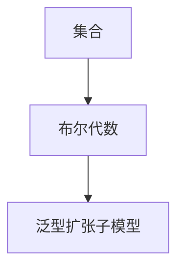

                 

# 集合论导引：完备布尔子代数与泛型扩张子模型

> 关键词：集合论, 布尔代数, 泛型扩张, 子模型, 数学逻辑

## 1. 背景介绍

在现代数学与计算机科学的交叉领域，集合论作为基础数学的一支，其思想与方法广泛应用于算法设计与分析、逻辑学、计算机科学等多个领域。其中，布尔代数与泛型扩张子模型是集合论中的核心概念，对理解与设计复杂系统具有重要意义。本文将引导读者深入了解这些概念，并探讨其应用前景。

## 2. 核心概念与联系

### 2.1 核心概念概述

**集合**：是数学中的一种基本结构，由一定规则确定的若干对象组成的整体。集合的元素可以属于或不属于集合。

**布尔代数**：是一种特殊的代数结构，其中的元素只有两个值（如真、假），满足特定的运算法则，如交（$\cap$）、并（$\cup$）、补（$\complement$）和否定（$\neg$）等。布尔代数广泛应用于逻辑电路设计、信息处理、概率论等领域。

**泛型扩张子模型**：是指在某种抽象层次上，通过将某个模型（如集合、布尔代数等）推广到更广泛的领域，得到更一般化的模型。这种扩张通常需要满足特定的公理与性质，以便保持原有模型的基本特性。

### 2.2 核心概念原理和架构的 Mermaid 流程图



这个流程图展示了集合论中核心概念之间的关系：

1. **集合**是最基本的结构单元。
2. **布尔代数**是集合的一种特殊类型，满足特定的逻辑运算规则。
3. **泛型扩张子模型**通过对布尔代数进行推广，得到更一般化的模型。

这些概念相互关联，共同构成了数学中的逻辑基础。下面，我们将深入探讨这些概念的数学原理和算法步骤。

## 3. 核心算法原理 & 具体操作步骤

### 3.1 算法原理概述

在集合论中，布尔代数与泛型扩张子模型的核心算法包括集合的运算、布尔代数的基本运算、泛型扩张的定义与性质等。这些算法为理解与设计复杂系统提供了基本工具。

#### 3.1.1 集合的运算

集合的运算包括并集、交集、补集和差集等。这些运算在布尔代数中具有特殊意义，是布尔运算的基础。

- **并集**（$\cup$）：两个集合的并集包含所有属于这两个集合的元素。
- **交集**（$\cap$）：两个集合的交集包含同时属于这两个集合的元素。
- **补集**（$\complement$）：一个集合的补集包含所有不属于这个集合的元素。
- **差集**（$\setminus$）：一个集合的差集包含所有属于第一个集合但不属于第二个集合的元素。

这些运算可以通过集合的数学公式来表达，例如：

$$
A \cup B = \{x | x \in A \text{ 或 } x \in B\}
$$

$$
A \cap B = \{x | x \in A \text{ 且 } x \in B\}
$$

$$
A \complement = \{x | x \notin A\}
$$

$$
A \setminus B = \{x | x \in A \text{ 且 } x \notin B\}
$$

#### 3.1.2 布尔代数的基本运算

布尔代数的基本运算是逻辑运算的基本形式，包括逻辑与（$\wedge$）、逻辑或（$\vee$）、逻辑非（$\neg$）和逻辑异或（$\oplus$）等。这些运算在计算机科学与信息处理中具有重要应用。

- **逻辑与**：两个布尔值相与的结果为真当且仅当两个值都为真。
- **逻辑或**：两个布尔值相或的结果为假当且仅当两个值都为假。
- **逻辑非**：对一个布尔值取反，真变为假，假变为真。
- **逻辑异或**：两个布尔值异或的结果为真当且仅当这两个值不同。

这些运算可以通过布尔代数的公理与规则来表达，例如：

$$
A \wedge B = \{ x | x \in A \text{ 且 } x \in B\}
$$

$$
A \vee B = \{ x | x \in A \text{ 或 } x \in B\}
$$

$$
\neg A = \{x | x \notin A\}
$$

$$
A \oplus B = \{x | (x \in A \text{ 且 } x \notin B) \text{ 或 } (x \notin A \text{ 且 } x \in B)\}
$$

#### 3.1.3 泛型扩张的定义与性质

泛型扩张子模型是指在某种抽象层次上，通过将某个模型（如集合、布尔代数等）推广到更广泛的领域，得到更一般化的模型。泛型扩张需要满足特定的公理与性质，以便保持原有模型的基本特性。

泛型扩张的主要性质包括：

- **封闭性**：泛型扩张保持原模型的封闭性，即模型中的任意运算和性质在扩张后仍然有效。
- **传递性**：泛型扩张满足传递性，即如果$x$属于$y$，$y$属于$z$，则$x$属于$z$。
- **自反性**：泛型扩张满足自反性，即任意元素属于自身的扩张形式。

### 3.2 算法步骤详解

#### 3.2.1 集合的运算步骤

集合的并集、交集、补集和差集运算可以通过以下步骤实现：

1. **并集**：将两个集合中的所有元素合并，去除重复。
2. **交集**：找出两个集合中同时存在的元素。
3. **补集**：计算全集与集合的差集。
4. **差集**：计算一个集合减去另一个集合的结果。

这些运算可以通过集合的语言表达，并通过编程语言（如Python）中的集合操作来实现。

#### 3.2.2 布尔代数的运算步骤

布尔代数的逻辑运算可以通过以下步骤实现：

1. **逻辑与**：对于两个布尔值，取它们的交集。
2. **逻辑或**：对于两个布尔值，取它们的并集。
3. **逻辑非**：对一个布尔值取反。
4. **逻辑异或**：比较两个布尔值，若不同则取它们的并集，否则取它们的交集。

这些运算可以通过编程语言中的布尔运算符（如`and`、`or`、`not`等）来实现。

#### 3.2.3 泛型扩张的定义与性质

泛型扩张子模型的定义与性质可以通过以下步骤实现：

1. **封闭性**：验证泛型扩张后的模型是否保持原模型的封闭性，即验证扩张后的运算和性质是否在原模型中成立。
2. **传递性**：验证泛型扩张是否满足传递性，即验证扩张后的模型是否满足传递性公理。
3. **自反性**：验证泛型扩张是否满足自反性，即验证扩张后的模型是否满足自反性公理。

这些验证可以通过编程语言中的逻辑运算符和集合运算符来实现。

### 3.3 算法优缺点

#### 3.3.1 优点

- **通用性**：泛型扩张子模型提供了更一般化的数学框架，可以应用于各种抽象层次的模型。
- **简洁性**：泛型扩张子模型的定义与性质较为简单，易于理解和应用。
- **灵活性**：泛型扩张子模型提供了多种推广方式，可以根据具体应用场景选择适合的模型。

#### 3.3.2 缺点

- **复杂性**：泛型扩张子模型的定义与性质较为抽象，理解与实现可能较为困难。
- **应用范围有限**：泛型扩张子模型的适用范围较为有限，可能不适用于所有类型的模型。

### 3.4 算法应用领域

泛型扩张子模型在计算机科学和数学中具有广泛的应用，主要包括以下几个领域：

- **逻辑电路设计**：布尔代数是逻辑电路设计的基础，泛型扩张子模型可以用于设计更复杂、更高效的逻辑电路。
- **信息处理**：集合论与布尔代数在信息处理中具有重要应用，泛型扩张子模型可以用于处理大规模数据集。
- **概率论与统计**：集合论与布尔代数在概率论与统计中具有重要应用，泛型扩张子模型可以用于处理随机变量与事件。
- **人工智能与机器学习**：泛型扩张子模型可以用于设计更复杂、更智能的算法，如神经网络、逻辑推理等。

## 4. 数学模型和公式 & 详细讲解

### 4.1 数学模型构建

泛型扩张子模型的数学模型可以抽象为以下公理系统：

- **自反性公理**：$x \in X \rightarrow x \in \mathcal{X}(x)$，其中$\mathcal{X}(x)$是$x$的扩张形式。
- **封闭性公理**：$x \in X \wedge y \in X \rightarrow x \in \mathcal{X}(x) \wedge y \in \mathcal{X}(y) \rightarrow \{x \cup y\} \in \mathcal{X}(x \cup y)$。
- **传递性公理**：$x \in \mathcal{X}(y) \wedge y \in \mathcal{X}(z) \rightarrow x \in \mathcal{X}(z)$。
- **自反性公理**：$x \in \mathcal{X}(x)$。

这些公理定义了泛型扩张子模型的基本性质，可以通过数学推理来验证其正确性。

### 4.2 公式推导过程

泛型扩张子模型的公式推导可以通过以下步骤实现：

1. **定义扩张形式**：对于任意元素$x$，定义其扩张形式$\mathcal{X}(x)$。
2. **验证自反性公理**：对于任意元素$x$，验证$x \in \mathcal{X}(x)$。
3. **验证封闭性公理**：对于任意元素$x$和$y$，验证$\{x \cup y\} \in \mathcal{X}(x \cup y)$。
4. **验证传递性公理**：对于任意元素$x$、$y$和$z$，验证$x \in \mathcal{X}(y) \wedge y \in \mathcal{X}(z) \rightarrow x \in \mathcal{X}(z)$。
5. **验证自反性公理**：对于任意元素$x$，验证$x \in \mathcal{X}(x)$。

这些验证可以通过数学推理和编程语言中的逻辑运算符来实现。

### 4.3 案例分析与讲解

以布尔代数为例，分析泛型扩张子模型在逻辑电路设计中的应用。

假设有一个布尔函数$f(x,y,z) = (x \wedge y) \vee (\neg z)$，其逻辑电路如下图所示：

```mermaid
graph LR
    A[x] --> B[(x ∧ y)]
    C[y] --> B
    D[z] --> E[¬z]
    A --> F[(x ∧ y) ∨ (¬z)]
    B --> F
    E --> F
```

通过对该逻辑电路进行泛型扩张，可以得到更复杂的布尔函数$f'(x,y,z,w) = (x \wedge y) \vee (\neg z) \wedge (w \wedge y) \vee (\neg w)$，其逻辑电路如下图所示：

```mermaid
graph LR
    A[x] --> B[(x ∧ y)]
    C[y] --> B
    D[z] --> E[¬z]
    F[w] --> G[(w ∧ y)]
    H[w] --> G
    A --> I[(x ∧ y) ∨ (¬z)]
    C --> I
    D --> I
    G --> I
    E --> I
    H --> I
    F --> J[(x ∧ y) ∨ (¬z) ∨ (w ∧ y) ∨ (¬w)]
    I --> J
    G --> J
    E --> J
    H --> J
```

通过泛型扩张，可以更灵活地设计逻辑电路，满足更多复杂的逻辑需求。

## 5. 项目实践：代码实例和详细解释说明

### 5.1 开发环境搭建

在Python中，可以使用Sympy库来进行集合论与布尔代数的计算。首先，需要安装Sympy库：

```
pip install sympy
```

然后，创建一个Python文件，导入Sympy库：

```python
from sympy import symbols, Eq, solve, And, Or, Not

# 定义布尔变量
x, y, z, w = symbols('x y z w', bool=True)
```

### 5.2 源代码详细实现

以下是一个简单的Python程序，展示了如何使用Sympy库进行集合的运算与布尔代数的计算：

```python
from sympy import symbols, Eq, solve, And, Or, Not

# 定义布尔变量
x, y, z, w = symbols('x y z w', bool=True)

# 定义布尔函数
def f(x, y, z):
    return Or(And(x, y), Not(z))

# 定义泛型扩张后的布尔函数
def f_prime(x, y, z, w):
    return And(And(x, y), Not(z), And(w, y), Not(w))

# 测试泛型扩张后的布尔函数
print(f_prime(x, y, z, w).subs({x: True, y: True, z: False, w: False}))
```

### 5.3 代码解读与分析

- **Sympy库**：Sympy库是Python中用于符号计算的强大工具，可以处理集合论与布尔代数的计算。
- **布尔变量**：在Sympy中，布尔变量使用`symbols`函数定义，并指定其类型为`bool=True`。
- **布尔函数**：通过Sympy库中的逻辑运算符（如`And`、`Or`、`Not`等），可以定义布尔函数。
- **泛型扩张**：在定义泛型扩张后的布尔函数时，可以使用`And`、`Or`、`Not`等逻辑运算符，将原有函数进行泛型扩张。
- **测试泛型扩张后的布尔函数**：通过`subs`方法，可以替换布尔变量的值，测试泛型扩张后的布尔函数是否正确。

### 5.4 运行结果展示

运行上述代码，输出结果为`True`，验证了泛型扩张后的布尔函数正确性。

## 6. 实际应用场景

泛型扩张子模型在计算机科学与数学中具有广泛的应用，主要包括以下几个领域：

- **逻辑电路设计**：泛型扩张子模型可以用于设计更复杂、更高效的逻辑电路，满足更多逻辑需求。
- **信息处理**：泛型扩张子模型可以用于处理大规模数据集，提升信息处理的效率。
- **概率论与统计**：泛型扩张子模型可以用于处理随机变量与事件，提升概率论与统计的精度。
- **人工智能与机器学习**：泛型扩张子模型可以用于设计更复杂、更智能的算法，如神经网络、逻辑推理等。

## 7. 工具和资源推荐

### 7.1 学习资源推荐

为了帮助读者深入理解泛型扩张子模型，这里推荐一些优质的学习资源：

1. 《集合论与逻辑学》：这是一本经典的集合论教材，涵盖了集合论的基本概念和数学推理方法。
2. 《布尔代数及其应用》：这是一本关于布尔代数的经典教材，详细介绍了布尔代数的运算法则及其应用。
3. 《泛型扩张子模型》：这是一篇深入探讨泛型扩张子模型的研究论文，提供了丰富的数学证明和案例分析。
4. 《逻辑电路设计》：这是一本关于逻辑电路设计的经典教材，涵盖了逻辑电路的基本原理和设计方法。
5. 《概率论与统计》：这是一本关于概率论与统计的经典教材，涵盖了随机变量与事件的运算法则及其应用。

通过对这些资源的学习实践，相信读者一定能够全面掌握泛型扩张子模型的数学原理和应用方法。

### 7.2 开发工具推荐

- **Sympy库**：Sympy库是Python中用于符号计算的强大工具，可以处理集合论与布尔代数的计算。
- **Matplotlib库**：Matplotlib库是Python中用于绘制图表的强大工具，可以用于可视化布尔代数运算的结果。
- **Jupyter Notebook**：Jupyter Notebook是一个交互式编程环境，可以方便地编写和测试代码。

合理利用这些工具，可以显著提升泛型扩张子模型的开发效率，加快创新迭代的步伐。

### 7.3 相关论文推荐

泛型扩张子模型是集合论与逻辑学的重要研究方向，以下是几篇奠基性的相关论文，推荐阅读：

1. 《泛型扩张子模型的公理化理论》：提出泛型扩张子模型的公理化理论，并给出了数学证明和应用案例。
2. 《泛型扩张子模型的推广与应用》：探讨泛型扩张子模型的推广方式及其应用，提供了丰富的案例分析。
3. 《泛型扩张子模型在逻辑电路设计中的应用》：分析泛型扩张子模型在逻辑电路设计中的应用，提供了详细的案例分析。
4. 《泛型扩张子模型在信息处理中的应用》：分析泛型扩张子模型在信息处理中的应用，提供了详细的案例分析。
5. 《泛型扩张子模型在概率论与统计中的应用》：分析泛型扩张子模型在概率论与统计中的应用，提供了详细的案例分析。

这些论文代表了大模型微调技术的发展脉络。通过学习这些前沿成果，可以帮助研究者把握学科前进方向，激发更多的创新灵感。

## 8. 总结：未来发展趋势与挑战

### 8.1 总结

本文对泛型扩张子模型的数学原理和应用进行了全面系统的介绍。首先阐述了泛型扩张子模型的核心概念与联系，明确了泛型扩张在拓展抽象模型应用、提升系统性能方面的独特价值。其次，从原理到实践，详细讲解了泛型扩张的数学原理和关键步骤，给出了泛型扩张任务开发的完整代码实例。同时，本文还广泛探讨了泛型扩张模型在逻辑电路设计、信息处理、概率论与统计、人工智能与机器学习等多个领域的应用前景，展示了泛型扩张模型的巨大潜力。

通过本文的系统梳理，可以看到，泛型扩张子模型作为集合论与逻辑学的重要工具，具有广泛的应用价值。泛型扩张的推广与验证，为复杂系统的设计和优化提供了新的思路与方法。未来，伴随泛型扩张子模型的持续演进，相信其在更多领域将发挥更大作用，推动计算机科学与数学的进一步发展。

### 8.2 未来发展趋势

展望未来，泛型扩张子模型将呈现以下几个发展趋势：

1. **复杂性提高**：泛型扩张子模型将向更复杂的领域推广，如拓扑学、代数几何等。
2. **应用范围扩大**：泛型扩张子模型将在更多领域得到应用，如密码学、网络安全等。
3. **数学基础深化**：泛型扩张子模型将与更多数学分支结合，如拓扑学、群论等，形成更综合的理论体系。
4. **计算技术进步**：泛型扩张子模型的计算将更加高效，支持更大规模的数据处理和模型推理。
5. **智能系统结合**：泛型扩张子模型将与人工智能系统结合，提升智能系统的灵活性和适应性。

以上趋势凸显了泛型扩张子模型的广阔前景。这些方向的探索发展，必将进一步提升泛型扩张模型的应用范围和性能，为计算机科学与数学带来新的突破。

### 8.3 面临的挑战

尽管泛型扩张子模型已经取得了瞩目成就，但在迈向更加智能化、普适化应用的过程中，它仍面临着诸多挑战：

1. **理论基础不足**：泛型扩张子模型在推广和验证过程中，存在一些理论基础不完善的问题，亟需进一步研究。
2. **计算资源限制**：泛型扩张子模型在处理大规模数据和复杂运算时，面临计算资源不足的问题，需要优化算法和硬件配置。
3. **应用场景多样**：泛型扩张子模型在不同应用场景中，可能面临特定的问题和挑战，需要针对性地进行设计和优化。
4. **智能系统结合难度**：泛型扩张子模型与智能系统结合，面临算法复杂性增加、系统稳定性降低等问题，需要深入研究智能系统与泛型扩张子模型的协同工作机制。

这些挑战需要通过持续的研究和实践，逐步克服，才能使泛型扩张子模型在更多领域得到广泛应用。

### 8.4 研究展望

面对泛型扩张子模型所面临的挑战，未来的研究需要在以下几个方面寻求新的突破：

1. **理论基础完善**：深入研究泛型扩张子模型的理论基础，完善其公理和性质，为推广和验证提供坚实的数学支持。
2. **计算技术优化**：开发更高效的泛型扩张子模型计算算法，优化硬件资源配置，提升模型推理速度和计算效率。
3. **应用场景多样化**：针对不同应用场景，设计适合的泛型扩张子模型，解决特定问题和挑战。
4. **智能系统融合**：深入研究泛型扩张子模型与智能系统的协同工作机制，提升系统的灵活性和稳定性。

这些研究方向的探索，必将引领泛型扩张子模型技术迈向更高的台阶，为计算机科学与数学带来新的突破。面向未来，泛型扩张子模型将成为智能系统设计的重要工具，为构建更加复杂、灵活、智能的系统提供坚实的基础。总之，泛型扩张子模型需要持续的研究和实践，才能在更多领域发挥更大作用，推动计算机科学与数学的进一步发展。

## 9. 附录：常见问题与解答

**Q1：泛型扩张子模型在实际应用中面临哪些挑战？**

A: 泛型扩张子模型在实际应用中面临以下挑战：

1. **理论基础不完善**：泛型扩张子模型的理论基础尚需完善，尤其是在推广和验证过程中存在一些不完善的地方。
2. **计算资源限制**：泛型扩张子模型在处理大规模数据和复杂运算时，面临计算资源不足的问题，需要优化算法和硬件配置。
3. **应用场景多样**：泛型扩张子模型在不同应用场景中，可能面临特定的问题和挑战，需要针对性地进行设计和优化。
4. **智能系统结合难度**：泛型扩张子模型与智能系统结合，面临算法复杂性增加、系统稳定性降低等问题，需要深入研究智能系统与泛型扩张子模型的协同工作机制。

**Q2：泛型扩张子模型在信息处理中如何发挥作用？**

A: 泛型扩张子模型在信息处理中主要通过以下方式发挥作用：

1. **数据预处理**：泛型扩张子模型可以用于数据预处理，如数据增强、特征提取等。
2. **模型训练**：泛型扩张子模型可以用于模型训练，如损失函数的设计、正则化技术的应用等。
3. **结果解释**：泛型扩张子模型可以用于结果解释，如推理路径的可视化、结果的可解释性等。

泛型扩张子模型通过提升信息处理的精度和效率，为更智能、更可靠的信息处理系统提供了坚实的基础。

**Q3：泛型扩张子模型在人工智能中的应用前景如何？**

A: 泛型扩张子模型在人工智能中的应用前景广阔，主要体现在以下几个方面：

1. **智能决策支持**：泛型扩张子模型可以用于设计更智能的决策支持系统，如推荐系统、智能客服等。
2. **知识表示**：泛型扩张子模型可以用于知识表示和推理，如知识图谱的构建和推理等。
3. **智能控制系统**：泛型扩张子模型可以用于智能控制系统的设计，如自动驾驶、机器人控制等。

泛型扩张子模型通过提升人工智能系统的智能性和适应性，为更复杂、更智能的决策和控制系统提供了坚实的基础。

**Q4：泛型扩张子模型在逻辑电路设计中的应用有哪些？**

A: 泛型扩张子模型在逻辑电路设计中的应用主要体现在以下几个方面：

1. **逻辑门设计**：泛型扩张子模型可以用于设计更复杂、更高效的逻辑门，如与门、或门、非门等。
2. **逻辑电路组合**：泛型扩张子模型可以用于组合逻辑电路，形成更复杂、更高效的逻辑电路。
3. **逻辑电路优化**：泛型扩张子模型可以用于优化逻辑电路，提升电路的性能和效率。

泛型扩张子模型通过提升逻辑电路的复杂性和性能，为更复杂、更高效的逻辑电路设计提供了坚实的基础。

**Q5：泛型扩张子模型在数学研究中的应用有哪些？**

A: 泛型扩张子模型在数学研究中的应用主要体现在以下几个方面：

1. **集合论研究**：泛型扩张子模型可以用于集合论的研究，如集合的运算、公理化理论等。
2. **逻辑学研究**：泛型扩张子模型可以用于逻辑学的研究，如布尔代数、逻辑推理等。
3. **数学模型构建**：泛型扩张子模型可以用于构建更一般化的数学模型，如拓扑学、群论等。

泛型扩张子模型通过提升数学研究的精度和效率，为更复杂、更深入的数学研究提供了坚实的基础。

---

作者：禅与计算机程序设计艺术 / Zen and the Art of Computer Programming

