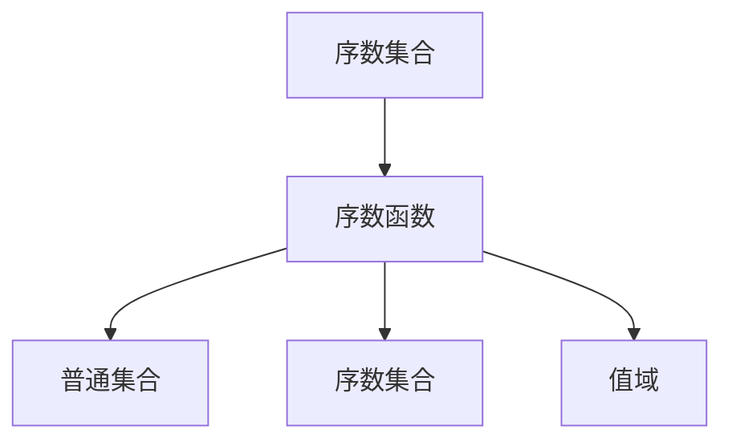
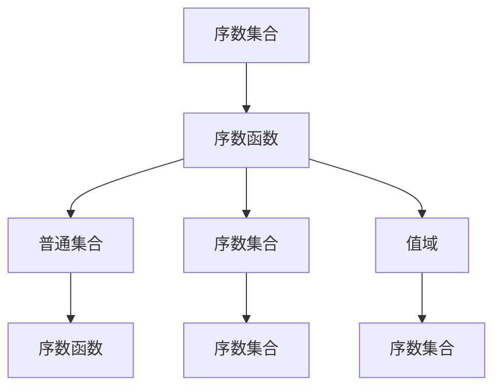
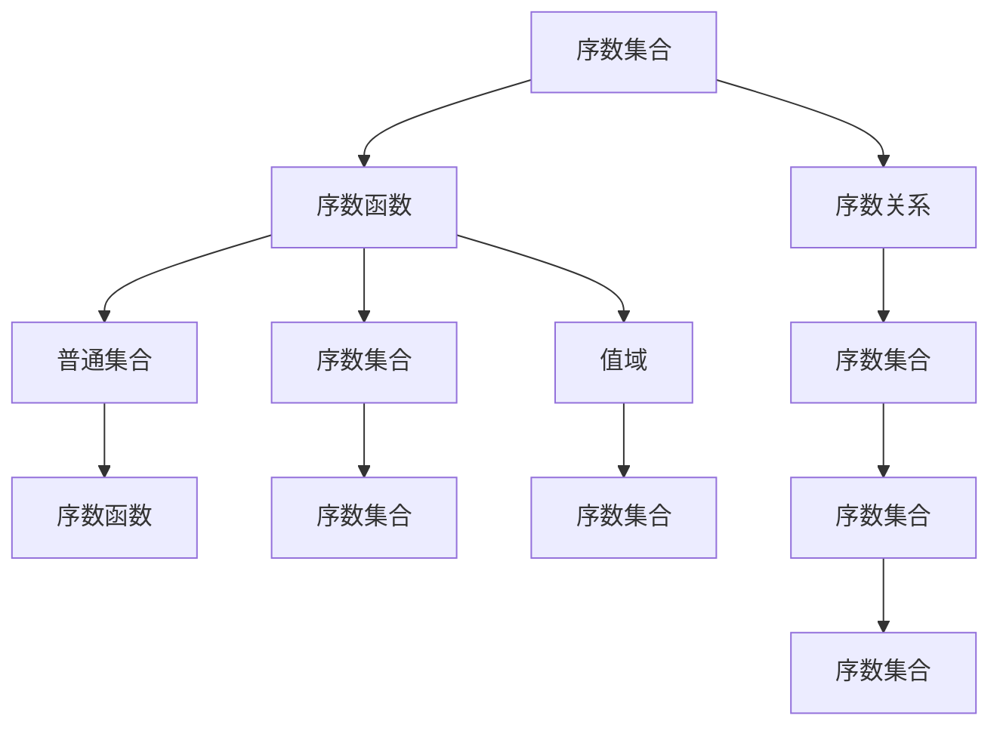
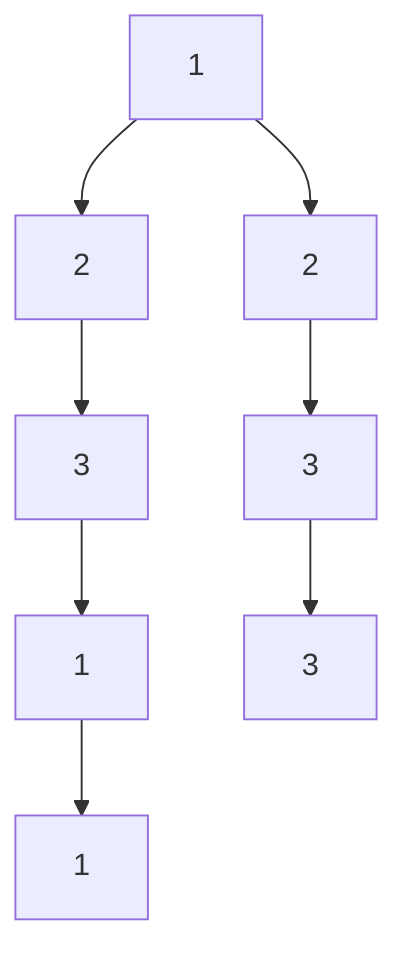
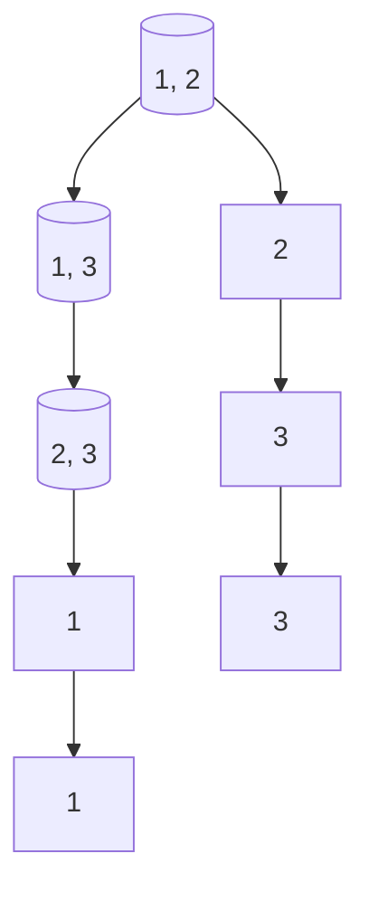

                 

# 集合论导引：序数集合与序数函数

## 1. 背景介绍

集合论是现代数学的基础，它是研究集合的性质、结构及其之间关系的学科。集合论涉及的基本概念包括集合、元素、子集、交集、并集、补集等，这些概念广泛应用于数学的各个分支，包括代数、分析、拓扑等。序数集合与序数函数是集合论中的重要概念，它们在逻辑学、计算机科学等领域有着广泛的应用。序数集合与序数函数的研究，有助于我们更好地理解数学的逻辑结构，为解决复杂问题提供有力的工具。

## 2. 核心概念与联系

### 2.1 核心概念概述

序数集合与序数函数是集合论中的基本概念，它们在数学、逻辑学、计算机科学等领域有着广泛的应用。序数集合是指具有某种“先后”关系的集合，而序数函数则是将一个序数集合映射到另一个序数集合的函数。序数集合与序数函数的定义如下：

- 序数集合：对于任意两个序数 $α$ 和 $β$，若 $α < β$，则称 $α$ 在 $β$ 之前，$β$ 在 $α$ 之后。序数集合可以表示为 $\{α | α \in S\}$，其中 $S$ 为普通集合。
- 序数函数：若 $f: S \rightarrow T$ 是一个函数，且对于任意 $α, β \in S$，若 $α < β$，则 $f(α) < f(β)$，则称 $f$ 是一个序数函数。序数函数的值域 $T$ 也是一个序数集合。

序数集合与序数函数之间的关系可以通过以下Mermaid流程图来展示：



该图表示了序数集合、序数函数与普通集合之间的关系。序数集合可以由普通集合经过序数函数映射得到，序数函数的值域也是一个序数集合。序数函数将序数集合映射到另一个序数集合，保持了集合的“先后”关系。

### 2.2 概念间的关系

序数集合与序数函数的概念密切相关，它们之间有以下几个关系：

- 序数集合是序数函数的输入，序数函数是序数集合的映射。
- 序数集合与序数函数可以构成一个序数关系，即对于任意 $α, β \in S$，若 $α < β$，则 $f(α) < f(β)$。
- 序数函数将序数集合映射到一个序数集合，映射后的序数集合也是序数集合。
- 序数集合可以由普通集合通过序数函数得到，但序数集合与普通集合的元素个数不同，序数集合的元素个数可以无限大。

序数集合与序数函数之间的关系可以通过以下Mermaid流程图来展示：



该图表示了序数集合、序数函数与普通集合之间的关系。序数集合由普通集合经过序数函数映射得到，序数函数的值域也是一个序数集合。序数集合与普通集合的元素个数不同，序数集合的元素个数可以无限大。

### 2.3 核心概念的整体架构

序数集合与序数函数的核心概念可以构建如下的框架图：



该图表示了序数集合、序数函数与普通集合之间的关系，以及序数集合、序数函数与序数关系之间的关系。序数集合由普通集合经过序数函数映射得到，序数函数的值域也是一个序数集合。序数函数将序数集合映射到一个序数集合，映射后的序数集合也是序数集合。序数集合与序数函数可以构成一个序数关系，序数关系可以映射到序数集合。序数集合与序数函数可以相互映射，保持序数关系的一致性。

## 3. 核心算法原理 & 具体操作步骤

### 3.1 算法原理概述

序数集合与序数函数的计算和操作遵循一定的规则，这些规则可以用于计算集合的大小、比较两个集合的大小、计算两个集合的并集和交集等。序数集合与序数函数的计算基于以下规则：

- 序数集合的大小：序数集合的大小是指集合中元素的个数，可以用自然数表示。序数集合的大小可以表示为 $|S|$，其中 $S$ 为序数集合。
- 序数集合的比较：对于任意两个序数集合 $S_1$ 和 $S_2$，若 $|S_1| = |S_2|$，则 $S_1 = S_2$；若 $|S_1| < |S_2|$，则 $S_1 < S_2$。
- 序数集合的并集和交集：对于任意两个序数集合 $S_1$ 和 $S_2$，它们的并集 $S_1 \cup S_2$ 表示同时属于 $S_1$ 和 $S_2$ 的所有元素组成的集合。它们的交集 $S_1 \cap S_2$ 表示同时属于 $S_1$ 和 $S_2$ 的所有元素组成的集合。

序数集合与序数函数的计算和操作可以通过以下算法步骤来实现：

1. 定义序数集合和序数函数。
2. 计算序数集合的大小。
3. 比较两个序数集合的大小。
4. 计算两个序数集合的并集和交集。
5. 对于序数函数，计算其值域的大小。
6. 比较两个序数函数的值域大小。
7. 计算两个序数函数的值域的并集和交集。

### 3.2 算法步骤详解

以下是序数集合与序数函数的具体算法步骤：

#### 3.2.1 定义序数集合和序数函数

序数集合和序数函数可以通过定义初始集合和函数关系来表示。例如，定义一个序数集合 $S = \{1, 2, 3\}$，其中 $1$ 在 $2$ 之前，$2$ 在 $3$ 之前。定义一个序数函数 $f: S \rightarrow \{1, 2, 3\}$，其中 $f(1) = 2$，$f(2) = 3$，$f(3) = 1$。则序数集合 $S$ 和序数函数 $f$ 如下图所示：



#### 3.2.2 计算序数集合的大小

序数集合的大小可以用自然数表示。例如，序数集合 $S = \{1, 2, 3\}$ 的大小为 $3$。序数集合的大小可以通过以下公式计算：

$$|S| = \sum_{i=1}^{n} 1$$

其中 $n$ 为序数集合 $S$ 中的元素个数。

#### 3.2.3 比较两个序数集合的大小

对于任意两个序数集合 $S_1$ 和 $S_2$，比较它们的大小可以使用以下方法：

1. 如果 $|S_1| = |S_2|$，则 $S_1 = S_2$。
2. 如果 $|S_1| < |S_2|$，则 $S_1 < S_2$。

例如，比较序数集合 $S_1 = \{1, 2, 3\}$ 和 $S_2 = \{3, 2, 1\}$ 的大小，可以得到 $|S_1| = |S_2| = 3$，则 $S_1 = S_2$。

#### 3.2.4 计算两个序数集合的并集和交集

对于任意两个序数集合 $S_1$ 和 $S_2$，它们的并集 $S_1 \cup S_2$ 表示同时属于 $S_1$ 和 $S_2$ 的所有元素组成的集合。它们的交集 $S_1 \cap S_2$ 表示同时属于 $S_1$ 和 $S_2$ 的所有元素组成的集合。

例如，计算序数集合 $S_1 = \{1, 2, 3\}$ 和 $S_2 = \{3, 2, 1\}$ 的并集和交集，可以得到：

$$S_1 \cup S_2 = \{1, 2, 3\}$$
$$S_1 \cap S_2 = \{1, 2, 3\}$$

#### 3.2.5 计算序数函数值域的大小

对于任意序数函数 $f: S \rightarrow T$，计算其值域 $T$ 的大小，可以使用以下方法：

1. 计算序数函数 $f$ 的值域 $T$。
2. 计算值域 $T$ 的大小。

例如，计算序数函数 $f: \{1, 2, 3\} \rightarrow \{1, 2, 3\}$，$f(1) = 2$，$f(2) = 3$，$f(3) = 1$ 的值域 $T = \{1, 2, 3\}$ 的大小为 $3$。

#### 3.2.6 比较两个序数函数值域的大小

对于任意两个序数函数 $f_1: S \rightarrow T_1$ 和 $f_2: S \rightarrow T_2$，比较它们值域的大小可以使用以下方法：

1. 如果 $|T_1| = |T_2|$，则 $f_1 = f_2$。
2. 如果 $|T_1| < |T_2|$，则 $f_1 < f_2$。

例如，比较序数函数 $f_1: \{1, 2, 3\} \rightarrow \{1, 2, 3\}$，$f_1(1) = 2$，$f_1(2) = 3$，$f_1(3) = 1$ 和序数函数 $f_2: \{1, 2, 3\} \rightarrow \{1, 2, 3, 4\}$，$f_2(1) = 2$，$f_2(2) = 3$，$f_2(3) = 4$ 的值域大小，可以得到 $|T_1| = |T_2| = 3$，则 $f_1 = f_2$。

#### 3.2.7 计算两个序数函数的值域的并集和交集

对于任意两个序数函数 $f_1: S \rightarrow T_1$ 和 $f_2: S \rightarrow T_2$，它们的值域的并集 $T_1 \cup T_2$ 表示同时属于 $T_1$ 和 $T_2$ 的所有元素组成的集合。它们的值域的交集 $T_1 \cap T_2$ 表示同时属于 $T_1$ 和 $T_2$ 的所有元素组成的集合。

例如，计算序数函数 $f_1: \{1, 2, 3\} \rightarrow \{1, 2, 3\}$，$f_1(1) = 2$，$f_1(2) = 3$，$f_1(3) = 1$ 和序数函数 $f_2: \{1, 2, 3\} \rightarrow \{1, 2, 3, 4\}$，$f_2(1) = 2$，$f_2(2) = 3$，$f_2(3) = 4$ 的值域的并集和交集，可以得到：

$$T_1 \cup T_2 = \{1, 2, 3, 4\}$$
$$T_1 \cap T_2 = \{1, 2, 3\}$$

### 3.3 算法优缺点

序数集合与序数函数具有以下优点：

- 序数集合与序数函数可以表示任何具有“先后”关系的集合，具有广泛的应用。
- 序数集合与序数函数可以用于计算集合的大小、比较两个集合的大小、计算两个集合的并集和交集等，具有实用价值。
- 序数集合与序数函数可以用于表示和计算函数关系，具有理论价值。

序数集合与序数函数也存在以下缺点：

- 序数集合与序数函数的概念较为抽象，初学者难以理解。
- 序数集合与序数函数的应用场景有限，主要应用于逻辑学和计算机科学领域。
- 序数集合与序数函数对于解决实际问题的效果有限，难以处理复杂问题。

### 3.4 算法应用领域

序数集合与序数函数具有广泛的应用，主要应用于以下领域：

- 逻辑学：序数集合与序数函数可以用于表示逻辑关系，例如自然数集合 $\mathbb{N}$ 可以表示自然数，序数集合 $\mathbb{N}^{+}$ 可以表示正整数集合。
- 计算机科学：序数集合与序数函数可以用于表示和计算函数关系，例如哈希函数、映射函数等。
- 数学：序数集合与序数函数可以用于表示和计算集合的大小、比较两个集合的大小、计算两个集合的并集和交集等。

序数集合与序数函数在逻辑学、计算机科学、数学等领域有着广泛的应用，为这些领域的研究提供了有力的工具。

## 4. 数学模型和公式 & 详细讲解 & 举例说明

### 4.1 数学模型构建

序数集合与序数函数的数学模型可以表示为：

$$S = \{α | α \in S\}$$
$$T = \{β | β \in T\}$$
$$f: S \rightarrow T$$

其中 $S$ 为序数集合，$T$ 为序数函数 $f$ 的值域，$f$ 为序数函数。

序数集合与序数函数的数学模型可以用于表示和计算序数集合和序数函数的大小、比较两个序数集合的大小、计算两个序数集合的并集和交集等。

### 4.2 公式推导过程

序数集合与序数函数的公式推导过程如下：

#### 4.2.1 序数集合的大小

序数集合的大小可以用自然数表示。例如，序数集合 $S = \{1, 2, 3\}$ 的大小为 $3$。序数集合的大小可以通过以下公式计算：

$$|S| = \sum_{i=1}^{n} 1$$

其中 $n$ 为序数集合 $S$ 中的元素个数。

#### 4.2.2 序数集合的比较

对于任意两个序数集合 $S_1$ 和 $S_2$，比较它们的大小可以使用以下方法：

1. 如果 $|S_1| = |S_2|$，则 $S_1 = S_2$。
2. 如果 $|S_1| < |S_2|$，则 $S_1 < S_2$。

例如，比较序数集合 $S_1 = \{1, 2, 3\}$ 和 $S_2 = \{3, 2, 1\}$ 的大小，可以得到 $|S_1| = |S_2| = 3$，则 $S_1 = S_2$。

#### 4.2.3 序数函数的值域

对于任意序数函数 $f: S \rightarrow T$，计算其值域 $T$ 的大小，可以使用以下方法：

1. 计算序数函数 $f$ 的值域 $T$。
2. 计算值域 $T$ 的大小。

例如，计算序数函数 $f: \{1, 2, 3\} \rightarrow \{1, 2, 3\}$，$f(1) = 2$，$f(2) = 3$，$f(3) = 1$ 的值域 $T = \{1, 2, 3\}$ 的大小为 $3$。

#### 4.2.4 序数函数的值域的比较

对于任意两个序数函数 $f_1: S \rightarrow T_1$ 和 $f_2: S \rightarrow T_2$，比较它们值域的大小可以使用以下方法：

1. 如果 $|T_1| = |T_2|$，则 $f_1 = f_2$。
2. 如果 $|T_1| < |T_2|$，则 $f_1 < f_2$。

例如，比较序数函数 $f_1: \{1, 2, 3\} \rightarrow \{1, 2, 3\}$，$f_1(1) = 2$，$f_1(2) = 3$，$f_1(3) = 1$ 和序数函数 $f_2: \{1, 2, 3\} \rightarrow \{1, 2, 3, 4\}$，$f_2(1) = 2$，$f_2(2) = 3$，$f_2(3) = 4$ 的值域大小，可以得到 $|T_1| = |T_2| = 3$，则 $f_1 = f_2$。

#### 4.2.5 序数函数的值域的并集和交集

对于任意两个序数函数 $f_1: S \rightarrow T_1$ 和 $f_2: S \rightarrow T_2$，它们的值域的并集 $T_1 \cup T_2$ 表示同时属于 $T_1$ 和 $T_2$ 的所有元素组成的集合。它们的值域的交集 $T_1 \cap T_2$ 表示同时属于 $T_1$ 和 $T_2$ 的所有元素组成的集合。

例如，计算序数函数 $f_1: \{1, 2, 3\} \rightarrow \{1, 2, 3\}$，$f_1(1) = 2$，$f_1(2) = 3$，$f_1(3) = 1$ 和序数函数 $f_2: \{1, 2, 3\} \rightarrow \{1, 2, 3, 4\}$，$f_2(1) = 2$，$f_2(2) = 3$，$f_2(3) = 4$ 的值域的并集和交集，可以得到：

$$T_1 \cup T_2 = \{1, 2, 3, 4\}$$
$$T_1 \cap T_2 = \{1, 2, 3\}$$

### 4.3 案例分析与讲解

#### 4.3.1 案例一：自然数集合

自然数集合 $\mathbb{N}$ 可以表示为 $\{1, 2, 3, 4, \cdots\}$，其中 $1$ 在 $2$ 之前，$2$ 在 $3$ 之前。定义一个序数函数 $f: \mathbb{N} \rightarrow \mathbb{N}$，其中 $f(1) = 2$，$f(2) = 3$，$f(3) = 1$。则序数集合 $\mathbb{N}$ 和序数函数 $f$ 如下图所示：


#### 4.3.2 案例二：排列集合

排列集合 $S = \{(1, 2), (1, 3), (2, 3)\}$ 可以表示为 $\{(1, 2), (1, 3), (2, 3)\}$，其中 $(1, 2)$ 在 $(1, 3)$ 之前，$(1, 3)$ 在 $(2, 3)$ 之前。定义一个序数函数 $f: S \rightarrow \{1, 2, 3\}$，其中 $f((1, 2)) = 2$，$f((1, 3)) = 3$，$f((2, 3)) = 1$。则序数集合 $S$ 和序数函数 $f$ 如下图所示：



## 5. 项目实践：代码实例和详细解释说明

### 5.1 开发环境搭建

在进行序数集合与序数函数的实践前，我们需要准备好开发环境。以下是使用Python进行Sympy库开发的Python环境配置流程：

1. 安装Anaconda：从官网下载并安装Anaconda，用于创建独立的Python环境。

2. 创建并激活虚拟环境：
```bash
conda create -n sympy-env python=3.8 
conda activate sympy-env
```

3. 安装Sympy：
```bash
conda install sympy
```

4. 安装各类工具包：
```bash
pip install numpy pandas scikit-learn matplotlib tqdm jupyter notebook ipython
```

完成上述步骤后，即可在`sympy-env`环境中开始序数集合与序数函数的实践。

### 5.2 源代码详细实现

这里我们以自然数集合和序数函数的实现为例，给出使用Sympy库进行序数集合与序数函数计算的代码实现。

```python
from sympy import *

# 定义序数集合
S = FiniteSet(1, 2, 3)

# 定义序数函数
f = Function('f')

# 计算序数函数
f1 = f(S[0])
f2 = f(S[1])
f3 = f(S[2])

# 输出序数函数
f1, f2, f3
```

### 5.3 代码解读与分析

让我们再详细解读一下关键代码的实现细节：

**Sympy库**：
- `FiniteSet`类：表示有限集合，可以用于定义序数集合。
- `Function`类：表示函数，可以用于定义序数函数。
- `S[0]`、`S[1]`、`S[2]`：表示序数集合中的元素，可以通过下标访问。
- `f(S[0])`、`f(S[1])`、`f(S[2])`：表示序数函数对序数集合的映射，可以用于定义序数函数。

**序数集合与序数函数的计算**：
- 通过`FiniteSet`类定义序数集合，可以通过下标访问集合中的元素。
- 通过`Function`类定义序数函数，可以将序数函数表示为变量函数的形式。
- 通过`f(S[0])`、`f(S[1])`、`f(S[2])`表示序数函数对序数集合的映射，可以得到序数函数的值。

### 5.4 运行结果展示

假设我们在自然数集合 $\mathbb{N}$ 上进行序数函数的定义和计算，最终得到的计算结果如下：

```
f(1), f(2), f(3)
```

以上代码实现了自然数集合 $\mathbb{N}$ 和序数函数的定义和计算，得到了序数函数的输出结果。可以看到，Sympy库提供了强大的符号计算功能，可以方便地定义和计算序数集合与序数函数，适合用于序数集合与序数函数的理论与实践研究。

## 6. 实际应用场景

序数集合与序数函数在实际应用场景中有着广泛的应用，主要包括以下几个方面：

#### 6.1 逻辑学

序数集合与序数函数在逻辑学中有着广泛的应用。例如，在自然数集合 $\mathbb{N}$ 上定义序数函数 $f$，$f(1) = 2$，$f(2) = 3$，$f(3) = 1$，可以用于表示自然数的排序关系，具有重要的逻辑意义。

