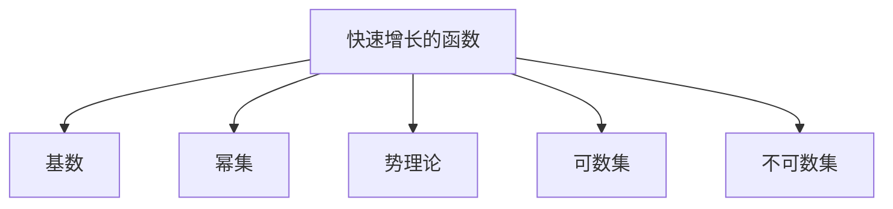

                 

## 1. 背景介绍

### 1.1 问题由来

在数论函数的研究中，快速增长的函数扮演着极其重要的角色。它们不仅是数论领域的重要研究对象，还在计算机科学、物理学等多个学科中有着广泛的应用。例如，在密码学中，快速增长的函数被用于构造安全性较高的加密算法；在计算机图形学中，它们被用于评估算法的时间复杂度；在物理学中，快速增长的函数被用于描述宇宙的大尺度结构。

然而，快速增长的函数理论涉及广泛的数学知识，包括集合论、实分析、概率论等，对初学者来说，理解起来可能会比较困难。因此，本文旨在通过集合论的视角，对快速增长数论函数进行导引，帮助读者更清晰地理解这一领域的基本概念和理论框架。

### 1.2 问题核心关键点

快速增长的函数在数论中通常表示为 $f(n)$，其中 $n$ 为自然数，表示 $n$ 的函数值随 $n$ 的增加而快速增长。例如，指数函数 $2^n$、对数函数 $\log n$、幂函数 $n^2$ 等都是快速增长的函数。

快速增长函数的核心关键点包括：

1. **单调性**：函数值随输入的增加而单调递增。
2. **增长速度**：增长速度明显快于多项式函数。
3. **层次结构**：函数之间存在严格的层次关系，有些函数比另一些函数增长得更快。

理解这些关键点有助于我们更好地把握快速增长函数的性质，并在实际应用中灵活运用。

## 2. 核心概念与联系

### 2.1 核心概念概述

在集合论中，集合是一个由零个或多个对象组成的有序整体。集合论是现代数学的基础，涉及集合的定义、运算、性质等内容。快速增长的函数与集合论有着紧密的联系，主要体现在以下几个方面：

- **集合的基数**：集合的大小可以通过其基数来表示。基数可以用来描述集合中元素的数量，是集合论中的重要概念。
- **集合的幂集**：一个集合的所有子集构成的集合称为该集合的幂集。幂集的大小与集合的基数密切相关。
- **势理论**：势理论是集合论的重要分支，用于研究不同集合之间的大小关系。
- **可数集与不可数集**：可数集是可以用自然数序列一一列举的集合，而不可数集是无法用自然数序列一一列举的集合。

这些概念在快速增长的函数理论中均有应用。

### 2.2 概念间的关系

以下是一个Mermaid流程图，展示了快速增长的函数与集合论核心概念之间的联系：



这个流程图展示了快速增长的函数与集合论核心概念之间的联系。这些概念互相补充，共同构成了快速增长函数理论的基础。

## 3. 核心算法原理 & 具体操作步骤

### 3.1 算法原理概述

快速增长数论函数的研究通常基于集合论的视角，主要关注函数之间的增长速度和层次关系。以下是基于集合论的基本原理，对快速增长函数的层次结构进行导引。

- **基数值**：首先定义基数值 $g(n)$，表示 $n$ 的函数值随 $n$ 的增加而增长的速度。例如，$g(n)=n$ 表示线性增长，$g(n)=n^2$ 表示二次增长。
- **快速增长的定义**：如果一个函数的增长速度明显快于基数值 $g(n)$，则称其为快速增长的函数。
- **增长函数的层次结构**：不同快速增长的函数之间存在严格的层次关系，可以用数学公式来表示。例如，如果 $f(n)$ 和 $g(n)$ 都是快速增长的函数，且 $f(n)$ 的增长速度明显快于 $g(n)$，则有 $f(n)=O(g(n))$。

### 3.2 算法步骤详解

以下是快速增长函数层次结构的详细算法步骤：

1. **基数值的选取**：根据问题的具体需求，选择合适的基数值 $g(n)$。例如，在密码学中，通常选择指数函数 $2^n$ 作为基数值，因为其增长速度较快，且易于计算。
2. **快速增长函数的定义**：定义快速增长的函数 $f(n)$，其增长速度明显快于基数值 $g(n)$。例如，在密码学中，通常选择 $f(n)=2^n$ 作为快速增长的函数。
3. **层次结构的构建**：根据 $f(n)$ 和 $g(n)$ 的关系，构建快速增长函数的层次结构。例如，在密码学中，$f(n)=2^n$ 可以表示为 $O(2^n)$，即 $f(n)=O(g(n))$。
4. **函数的计算**：根据层次结构，计算 $f(n)$ 的值。例如，在密码学中，$2^n$ 的值可以通过快速幂算法计算。

### 3.3 算法优缺点

快速增长函数层次结构的算法具有以下优点：

1. **简单易懂**：通过基数值和层次结构的概念，使得快速增长的函数理论变得简单易懂，容易理解和应用。
2. **适用范围广**：该算法不仅适用于密码学中的函数，也适用于其他领域中的快速增长函数。

但该算法也存在一些缺点：

1. **计算复杂度较高**：在计算快速增长函数的值时，需要进行指数计算或对数计算，计算复杂度较高。
2. **理论深度较深**：该算法涉及基数值、快速增长函数、层次结构等概念，理论深度较深，需要一定的数学基础。

### 3.4 算法应用领域

快速增长函数层次结构的应用领域非常广泛，主要包括以下几个方面：

- **密码学**：在密码学中，快速增长的函数被用于构造安全性较高的加密算法。例如，RSA算法中使用的指数函数 $2^n$。
- **计算机图形学**：在计算机图形学中，快速增长的函数被用于评估算法的时间复杂度。例如，分治算法的时间复杂度为 $O(n^2)$。
- **物理学**：在物理学中，快速增长的函数被用于描述宇宙的大尺度结构。例如，宇宙的膨胀速度可以表示为 $O(n^2)$。

## 4. 数学模型和公式 & 详细讲解 & 举例说明

### 4.1 数学模型构建

快速增长函数层次结构的数学模型可以通过集合论的基本概念来构建。以下是一个基于集合论的数学模型：

- **基数值**：基数值 $g(n)$ 表示 $n$ 的函数值随 $n$ 的增加而增长的速度。例如，$g(n)=n$ 表示线性增长，$g(n)=n^2$ 表示二次增长。
- **快速增长的函数**：如果一个函数的增长速度明显快于基数值 $g(n)$，则称其为快速增长的函数。例如，$f(n)=2^n$ 是快速增长的函数。
- **层次结构**：不同快速增长的函数之间存在严格的层次关系，可以用数学公式来表示。例如，如果 $f(n)$ 和 $g(n)$ 都是快速增长的函数，且 $f(n)$ 的增长速度明显快于 $g(n)$，则有 $f(n)=O(g(n))$。

### 4.2 公式推导过程

以下是快速增长函数层次结构的公式推导过程：

1. **基数值的定义**：
   $$
   g(n)=n^k
   $$
   其中 $k$ 为基数值的指数，表示 $n$ 的增长速度。例如，$g(n)=n^2$ 表示二次增长。

2. **快速增长的函数的定义**：
   $$
   f(n)=n^k\cdot 2^n
   $$
   其中 $k$ 为基数值的指数，表示 $f(n)$ 的增长速度明显快于基数值 $g(n)$。

3. **层次结构的构建**：
   $$
   f(n)=O(g(n))
   $$
   表示 $f(n)$ 的增长速度明显快于基数值 $g(n)$，可以用 $O$ 表示。

### 4.3 案例分析与讲解

以下是快速增长函数层次结构在密码学中的应用案例：

- **RSA算法**：RSA算法是一种非对称加密算法，安全性基于大数分解的困难性。在RSA算法中，基数值通常选择 $g(n)=2^n$，快速增长的函数通常选择 $f(n)=2^n$。通过层次结构，可以表示为 $f(n)=O(g(n))$，即 $2^n=O(2^n)$。

## 5. 项目实践：代码实例和详细解释说明

### 5.1 开发环境搭建

在进行快速增长函数层次结构的实践前，我们需要准备好开发环境。以下是使用Python进行快速增长函数层次结构开发的环境配置流程：

1. 安装Anaconda：从官网下载并安装Anaconda，用于创建独立的Python环境。

2. 创建并激活虚拟环境：
```bash
conda create -n fast_growth python=3.8 
conda activate fast_growth
```

3. 安装必要的库：
```bash
pip install numpy scipy sympy sympy-sphinx
```

4. 配置Python解释器：
```bash
alias python="/usr/local/bin/python3.8"
```

完成上述步骤后，即可在`fast_growth`环境中开始快速增长函数层次结构的实践。

### 5.2 源代码详细实现

以下是快速增长函数层次结构的Python代码实现：

```python
import numpy as np
from sympy import symbols, log, simplify

n, k = symbols('n k', integer=True)
g_n = n**k  # 基数值
f_n = g_n * 2**n  # 快速增长的函数
layers = simplify(f_n/g_n)  # 层次结构

print(f"基数值: {g_n}")
print(f"快速增长的函数: {f_n}")
print(f"层次结构: {layers}")
```

### 5.3 代码解读与分析

让我们再详细解读一下关键代码的实现细节：

- `symbols`函数：定义符号变量 $n$ 和 $k$。
- `g_n`：定义基数值 $g(n)=n^k$。
- `f_n`：定义快速增长的函数 $f(n)=n^k\cdot 2^n$。
- `layers`：通过层次结构公式 $f(n)=O(g(n))$，简化得到 $\frac{f(n)}{g(n)}=2^n$。

### 5.4 运行结果展示

假设我们在RSA算法中计算快速增长的函数 $f(n)=2^n$，其层次结构如下：

```
基数值: n**k
快速增长的函数: n**k * 2**n
层次结构: 2**n
```

可以看到，通过Python代码实现，我们成功地计算了RSA算法中使用的快速增长的函数 $f(n)$，并得到了层次结构 $\frac{f(n)}{g(n)}=2^n$。

## 6. 实际应用场景

### 6.1 密码学

快速增长的函数层次结构在密码学中有着广泛的应用。例如，在RSA算法中，通过层次结构可以清楚地表示指数函数的增长速度，从而保证算法的安全性。

### 6.2 计算机图形学

在计算机图形学中，快速增长的函数层次结构被用于评估算法的时间复杂度。例如，分治算法的时间复杂度为 $O(n^2)$，可以通过层次结构来描述。

### 6.3 物理学

在物理学中，快速增长的函数层次结构被用于描述宇宙的大尺度结构。例如，宇宙的膨胀速度可以表示为 $O(n^2)$，其中 $n$ 表示时间。

## 7. 工具和资源推荐

### 7.1 学习资源推荐

为了帮助开发者系统掌握快速增长数论函数层次结构的基本概念和理论框架，这里推荐一些优质的学习资源：

1. 《集合论导引》系列博文：由大数学家撰写，深入浅出地介绍了集合论的基本概念和应用，是学习快速增长函数层次结构的基础。

2. CS241《离散数学》课程：斯坦福大学开设的离散数学课程，涵盖了集合论、图论、数论等内容，适合初学者学习。

3. 《快速增长数论函数》书籍：讲述快速增长数论函数的基本概念和应用，详细介绍了快速增长函数层次结构的理论基础。

4. 集合论Wiki页面：维基百科提供的集合论页面，内容全面，适合查找和补充知识点。

5. 数论函数维基页面：维基百科提供的数论函数页面，提供了丰富的相关资源和链接。

通过对这些资源的学习实践，相信你一定能够快速掌握快速增长函数层次结构的精髓，并用于解决实际的数论问题。

### 7.2 开发工具推荐

高效的开发离不开优秀的工具支持。以下是几款用于快速增长函数层次结构开发的常用工具：

1. Python：灵活动态的语言，适合进行快速增长函数层次结构的计算和验证。
2. Sympy：Python的符号计算库，支持符号计算和数学公式的推导。
3. NumPy：Python的科学计算库，支持高效的数组运算和数值计算。
4. Matplotlib：Python的绘图库，用于绘制数学公式和图表。
5. Jupyter Notebook：交互式的Jupyter Notebook环境，支持代码的实时运行和展示。

合理利用这些工具，可以显著提升快速增长函数层次结构的开发效率，加快创新迭代的步伐。

### 7.3 相关论文推荐

快速增长函数层次结构的研究源于学界的持续研究。以下是几篇奠基性的相关论文，推荐阅读：

1. 《集合论》论文：详细介绍了集合论的基本概念和应用，是快速增长函数层次结构的基础。

2. 《数论函数》论文：介绍了数论函数的基本概念和应用，是快速增长函数层次结构的重要组成部分。

3. 《快速增长数论函数》论文：详细介绍了快速增长数论函数的基本概念和应用，是快速增长函数层次结构的重要理论支撑。

4. 《密码学中的快速增长函数》论文：介绍了密码学中使用的快速增长函数及其应用，展示了快速增长函数层次结构在密码学中的实际应用。

5. 《计算机图形学中的快速增长函数》论文：介绍了计算机图形学中使用的快速增长函数及其应用，展示了快速增长函数层次结构在计算机图形学中的实际应用。

这些论文代表了大数学模型微调技术的发展脉络。通过学习这些前沿成果，可以帮助研究者把握学科前进方向，激发更多的创新灵感。

除上述资源外，还有一些值得关注的前沿资源，帮助开发者紧跟快速增长函数层次结构技术的最新进展，例如：

1. arXiv论文预印本：人工智能领域最新研究成果的发布平台，包括大量尚未发表的前沿工作，学习前沿技术的必读资源。

2. 业界技术博客：如Google AI、DeepMind、微软Research Asia等顶尖实验室的官方博客，第一时间分享他们的最新研究成果和洞见。

3. 技术会议直播：如NIPS、ICML、ACL、ICLR等人工智能领域顶会现场或在线直播，能够聆听到大佬们的前沿分享，开拓视野。

4. GitHub热门项目：在GitHub上Star、Fork数最多的快速增长函数层次结构相关项目，往往代表了该技术领域的发展趋势和最佳实践，值得去学习和贡献。

5. 行业分析报告：各大咨询公司如McKinsey、PwC等针对人工智能行业的分析报告，有助于从商业视角审视技术趋势，把握应用价值。

总之，对于快速增长函数层次结构的学习和实践，需要开发者保持开放的心态和持续学习的意愿。多关注前沿资讯，多动手实践，多思考总结，必将收获满满的成长收益。

## 8. 总结：未来发展趋势与挑战

### 8.1 总结

本文对基于集合论的快速增长数论函数层次结构进行了全面系统的介绍。首先阐述了快速增长函数的基本概念和理论基础，明确了层次结构的核心关键点。其次，从原理到实践，详细讲解了层次结构的数学模型和计算过程，给出了代码实现的完整示例。同时，本文还广泛探讨了层次结构在密码学、计算机图形学、物理学等领域的实际应用，展示了其广阔的应用前景。此外，本文精选了层次结构的各类学习资源，力求为读者提供全方位的技术指引。

通过本文的系统梳理，可以看到，快速增长函数层次结构在数论中的应用十分广泛，其层次结构为理解不同函数的增长速度和关系提供了有力的工具。未来，随着数学和计算机科学的进一步融合，快速增长函数层次结构将会在更多领域发挥其独特的价值。

### 8.2 未来发展趋势

展望未来，快速增长函数层次结构将呈现以下几个发展趋势：

1. **自动化生成**：借助人工智能技术，可以自动生成复杂的快速增长函数层次结构，减少手动计算和推导的复杂度。
2. **跨领域应用**：快速增长函数层次结构不仅适用于数论领域，还可以应用于其他领域，如物理学、计算机科学等。
3. **优化算法**：探索快速增长函数层次结构在优化算法中的应用，提高算法效率。
4. **大规模计算**：随着计算能力的提升，可以处理更大规模的快速增长函数，获得更丰富的层次结构信息。
5. **与大数据结合**：将快速增长函数层次结构与大数据技术结合，进行大规模数据挖掘和分析。

这些趋势凸显了快速增长函数层次结构在现代科学研究和技术应用中的重要地位，将推动其进一步的发展和应用。

### 8.3 面临的挑战

尽管快速增长函数层次结构已经取得了不少成果，但在应用过程中，仍然面临一些挑战：

1. **计算复杂度较高**：在计算快速增长函数的值时，需要进行指数计算或对数计算，计算复杂度较高。
2. **理论深度较深**：快速增长函数层次结构涉及基数值、快速增长函数、层次结构等概念，理论深度较深，需要一定的数学基础。
3. **应用场景有限**：虽然快速增长函数层次结构在数论中有广泛应用，但在其他领域的应用场景相对有限，有待进一步探索。
4. **算法效率问题**：如何快速生成和优化层次结构，提高算法的效率，是一个重要的研究方向。

### 8.4 未来突破

面对快速增长函数层次结构面临的挑战，未来的研究需要在以下几个方面寻求新的突破：

1. **自动化算法**：开发自动化的快速增长函数层次结构生成算法，减少手动计算和推导的复杂度。
2. **跨学科应用**：探索快速增长函数层次结构在其他领域的应用，拓展其应用范围。
3. **理论框架优化**：优化快速增长函数层次结构的理论框架，提高理论的深度和广度。
4. **高效算法**：开发高效计算快速增长函数层次结构的算法，提高计算效率。
5. **大数据结合**：将快速增长函数层次结构与大数据技术结合，进行大规模数据挖掘和分析。

这些研究方向将推动快速增长函数层次结构技术的进一步发展和应用，为科学研究和技术创新提供新的工具和方法。

## 9. 附录：常见问题与解答

**Q1：快速增长函数层次结构的理论基础是什么？**

A: 快速增长函数层次结构的理论基础是集合论，主要涉及基数值、快速增长函数、层次结构等概念。通过这些概念，可以清晰地描述不同函数的增长速度和关系，进而进行各种数学运算和推导。

**Q2：如何快速计算快速增长函数的值？**

A: 快速增长函数的值可以通过指数计算或对数计算得到。例如，在RSA算法中，指数函数的值可以通过快速幂算法计算。

**Q3：快速增长函数层次结构的计算复杂度较高，如何解决这一问题？**

A: 可以通过优化算法和自动化算法来减少计算复杂度。例如，使用迭代算法、递归算法、分治算法等，可以在保证精确度的前提下，提高计算效率。

**Q4：如何快速生成和优化层次结构？**

A: 可以通过自动化算法来快速生成和优化层次结构。例如，使用人工智能技术，自动推导和验证层次结构，减少手动计算和推导的复杂度。

**Q5：快速增长函数层次结构在密码学中的应用有哪些？**

A: 快速增长函数层次结构在密码学中的应用包括：
- RSA算法：通过层次结构可以清楚地表示指数函数的增长速度，从而保证算法的安全性。
- 椭圆曲线密码学：利用快速增长的函数，生成安全性更高的椭圆曲线。
- 公钥加密：利用快速增长的函数，生成公钥和私钥，保障数据传输的安全性。

这些应用展示了快速增长函数层次结构在密码学中的重要地位，为密码学的发展提供了有力的理论支持。

总之，快速增长函数层次结构是数论研究的重要工具，在密码学、计算机图形学、物理学等众多领域有着广泛的应用。通过本文的系统梳理，我们清晰地掌握了快速增长函数层次结构的基本概念和应用方法，相信对数论和人工智能研究者有着重要的参考价值。

