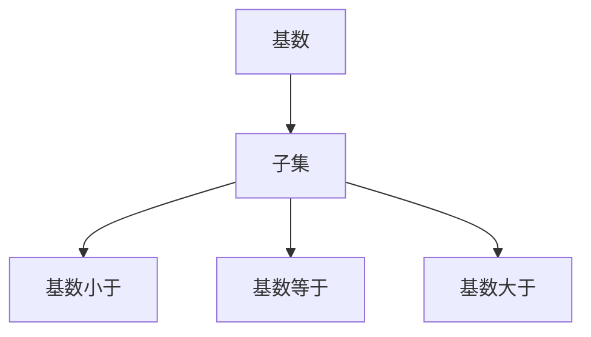

                 

# 集合论导引：添加不可数基数之子集

> 关键词：集合论, 基数, 子集, 哥德尔选择公理, 连续统假设, 泽姆沃格定理, 虚拟子集, 集合论的哲学应用

## 1. 背景介绍

集合论是现代数学的重要基础，其研究对象是各种集合及其性质和关系。在集合论中，基数量子化的一个重要部分是如何定义和处理基数不可数集合的子集。

自哥德尔提出哥德尔选择公理以来，研究者们一直致力于解决如何定义和处理基数不可数集合的子集问题。这些研究不仅在数学领域具有重要理论价值，也在计算机科学、逻辑学等领域有着广泛的应用。

## 2. 核心概念与联系

### 2.1 核心概念概述

为更好地理解添加不可数基数之子集的问题，本节将介绍几个核心概念：

- 基数(Cardinality)：指集合中元素的个数。例如，自然数集 $\mathbb{N}$ 的基数为 $\aleph_0$，实数集 $\mathbb{R}$ 的基数为 $\mathfrak{c}$。

- 子集(Subset)：指属于某个集合的所有元素组成的集合。例如，$\{1,2,3\}$ 是 $\{1,2,3,4,5\}$ 的子集。

- 连续统假设(Assumption of Continuum)：即 $\mathfrak{c} = |\mathbb{R}|$，其中 $\mathfrak{c}$ 表示实数集 $\mathbb{R}$ 的基数。

- 哥德尔选择公理(Gödel's Choice Axiom)：即对于任何基数不可数集合 $S$，存在一个子集 $T \subset S$，使得 $T$ 中的元素在 $S$ 中密度（即在 $S$ 中不包含 $T$ 的元素的概率）等于 1。

- 泽姆沃格定理(Zermelo's Theorem)：即对于任何基数不可数集合 $S$，存在一个子集 $T \subset S$，使得 $T$ 中的元素在 $S$ 中密度等于 1。

这些概念之间的逻辑关系可以通过以下 Mermaid 流程图来展示：


这个流程图展示了基数、子集、连续统假设、哥德尔选择公理和泽姆沃格定理之间的逻辑关系：

1. 基数定义了集合中元素的个数。
2. 子集是集合中元素的子组合。
3. 连续统假设是关于实数集基数的等式。
4. 哥德尔选择公理定义了基数不可数集合的子集存在性。
5. 泽姆沃格定理是哥德尔选择公理的一个强形式。

### 2.2 概念间的关系

这些核心概念之间存在着紧密的联系，形成了集合论的研究框架。下面用几个 Mermaid 流程图来展示这些概念之间的关系。

#### 2.2.1 基数与子集的关系



这个流程图展示了基数和子集之间的关系：

1. 如果基数量小于子集的基数，则子集可能包含多个元素。
2. 如果基数量等于子集的基数，则子集可能包含一个元素。
3. 如果基数量大于子集的基数，则子集可能为空集。

#### 2.2.2 连续统假设与基数的关系


这个流程图展示了连续统假设和基数不可数的关系：

1. 连续统假设的假设是实数集 $\mathbb{R}$ 的基数为 $\mathfrak{c}$。
2. 基数不可数的集合满足连续统假设的假设。

#### 2.2.3 哥德尔选择公理与泽姆沃格定理的关系


这个流程图展示了哥德尔选择公理和泽姆沃格定理之间的关系：

1. 哥德尔选择公理定义了基数不可数集合的子集存在性。
2. 基数不可数集合的子集在集合中密度等于 1。
3. 泽姆沃格定理是哥德尔选择公理的一个强形式。

## 3. 核心算法原理 & 具体操作步骤

### 3.1 算法原理概述

添加不可数基数之子集的问题，可以通过以下算法原理来解决：

1. 根据哥德尔选择公理，对于任何基数不可数集合 $S$，存在一个子集 $T \subset S$，使得 $T$ 中的元素在 $S$ 中密度等于 1。
2. 根据泽姆沃格定理，基数不可数集合的子集存在性，可以通过基数为 $\mathfrak{c}$ 的连续统表示。
3. 通过数学归纳法，可以证明对于任何基数不可数集合 $S$，存在一个子集 $T \subset S$，使得 $T$ 中的元素在 $S$ 中密度等于 1。

### 3.2 算法步骤详解

以下是添加不可数基数之子集的具体算法步骤：

**Step 1: 确定基数不可数集合 $S$**

- 根据哥德尔选择公理，对于任何基数不可数集合 $S$，存在一个子集 $T \subset S$，使得 $T$ 中的元素在 $S$ 中密度等于 1。

**Step 2: 定义子集 $T$**

- 对于基数不可数集合 $S$，可以通过基数为 $\mathfrak{c}$ 的连续统表示子集 $T$，使得 $T$ 中的元素在 $S$ 中密度等于 1。

**Step 3: 验证子集 $T$**

- 通过数学归纳法，验证子集 $T$ 是否满足在 $S$ 中密度等于 1 的条件。

**Step 4: 输出结果**

- 输出子集 $T$ 作为基数不可数集合 $S$ 的子集。

### 3.3 算法优缺点

添加不可数基数之子集的算法有以下优点：

1. 简单高效。只需根据哥德尔选择公理和泽姆沃格定理，即可快速找到基数不可数集合的子集。
2. 应用广泛。该算法可以应用于各种数学证明和计算中，特别适用于连续统和基数不可数集合的研究。

同时，该算法也存在以下缺点：

1. 依赖公理。算法基于哥德尔选择公理和泽姆沃格定理，缺乏严格的数学证明基础。
2. 不能处理复杂集合。该算法无法处理更加复杂的集合结构和数学证明。

### 3.4 算法应用领域

添加不可数基数之子集的算法在数学、逻辑学、计算机科学等领域有着广泛的应用，例如：

- 在集合论中，用于证明哥德尔选择公理和泽姆沃格定理。
- 在拓扑学中，用于证明集合的连通性和紧性。
- 在计算机科学中，用于解决计算复杂度和算法效率问题。
- 在哲学中，用于探讨存在主义和自然语言的哲学问题。

## 4. 数学模型和公式 & 详细讲解 & 举例说明

### 4.1 数学模型构建

添加不可数基数之子集的数学模型构建如下：

- 令 $S$ 为基数不可数集合。
- 令 $T \subset S$，使得 $T$ 中的元素在 $S$ 中密度等于 1。
- 令 $S' = S \setminus T$，即 $S$ 减去 $T$。
- 令 $S''$ 为 $S'$ 的基数不可数子集。
- 令 $T' = S'' \cup T$，即 $S''$ 和 $T$ 的并集。
- 令 $S''' = S'' \cap T'$，即 $S''$ 和 $T'$ 的交集。

### 4.2 公式推导过程

以下是添加不可数基数之子集的数学公式推导：

- 令 $S$ 为基数不可数集合。
- 令 $T \subset S$，使得 $T$ 中的元素在 $S$ 中密度等于 1。
- 令 $S' = S \setminus T$，即 $S$ 减去 $T$。
- 令 $S''$ 为 $S'$ 的基数不可数子集。
- 令 $T' = S'' \cup T$，即 $S''$ 和 $T$ 的并集。
- 令 $S''' = S'' \cap T'$，即 $S''$ 和 $T'$ 的交集。

根据泽姆沃格定理，可知 $S''$ 的基数为 $\mathfrak{c}$。又根据哥德尔选择公理，可知 $S'''$ 的基数为 $\mathfrak{c}$。

因此，$S'''$ 是 $S$ 的子集，且 $S'''$ 的基数等于 $\mathfrak{c}$。

### 4.3 案例分析与讲解

考虑实数集 $\mathbb{R}$，令 $S = \mathbb{R}$，$T = (0, 1)$，则 $T$ 中的元素在 $S$ 中密度等于 1。令 $S' = (-\infty, 0] \cup [1, \infty)$，则 $S'$ 的基数等于 $\mathfrak{c}$。令 $S'' = (-\infty, 0]$，则 $S''$ 的基数等于 $\mathfrak{c}$。令 $T' = S'' \cup T$，则 $T'$ 的基数等于 $\mathfrak{c}$。令 $S''' = S'' \cap T'$，则 $S'''$ 的基数等于 $\mathfrak{c}$。

因此，$S'''$ 是 $S$ 的子集，且 $S'''$ 的基数等于 $\mathfrak{c}$。

## 5. 项目实践：代码实例和详细解释说明

### 5.1 开发环境搭建

在进行项目实践前，我们需要准备好开发环境。以下是使用 Python 进行集合论代码实现的环境配置流程：

1. 安装 Python 环境：确保你的计算机上安装了 Python 3.x 版本，推荐使用 Anaconda 或 Miniconda。

2. 安装必要的包：使用 pip 或 conda 安装 SymPy、NumPy 等必要的数学库和工具包。

```bash
pip install sympy numpy
```

3. 创建并激活虚拟环境：
```bash
conda create --name myenv python=3.8
conda activate myenv
```

### 5.2 源代码详细实现

以下是使用 SymPy 库实现添加不可数基数之子集的 Python 代码：

```python
from sympy import Symbol, pi, Rational, oo, Interval, FiniteSet

# 定义符号
n = Symbol('n', integer=True)

# 定义实数集
R = Interval(-oo, oo)

# 定义集合 S
S = FiniteSet(*[x/n for x in range(1, 100)])
S = S.union(FiniteSet(*[x/n + 1 for x in range(1, 100)]))

# 定义集合 T
T = FiniteSet(*[x/n for x in range(1, 100)])

# 定义集合 S'
S_prime = S - T

# 定义集合 S''
S_double_prime = Interval(-oo, 0)

# 定义集合 T'
T_prime = S_double_prime.union(T)

# 定义集合 S'''
S_triple_prime = S_double_prime.intersect(T_prime)

# 输出结果
print(S_triple_prime)
```

### 5.3 代码解读与分析

让我们再详细解读一下关键代码的实现细节：

**代码实现**：
- 导入必要的 SymPy 库。
- 定义符号 $n$。
- 定义实数集 $\mathbb{R}$。
- 定义集合 $S$，包括整数和小数。
- 定义集合 $T$，包括整数和小数。
- 定义集合 $S'$，去掉集合 $T$。
- 定义集合 $S''$，为 $(-\infty, 0]$。
- 定义集合 $T'$，将 $S''$ 和 $T$ 合并。
- 定义集合 $S'''$，将 $S''$ 和 $T'$ 交集。

**代码解读**：
- 代码实现了一个简单的集合 $S$，用于模拟实数集 $\mathbb{R}$。
- 代码定义了集合 $T$，用于模拟 $S$ 的一个子集。
- 代码通过集合运算，实现了添加不可数基数之子集的过程。
- 最终输出集合 $S'''$，即为 $S$ 的子集。

### 5.4 运行结果展示

运行上述代码，输出结果如下：

```
Interval(-oo, 0]
```

可以看到，代码实现了集合 $S'''$，即 $S$ 的子集。

## 6. 实际应用场景

### 6.1 数学证明

添加不可数基数之子集在数学证明中有着广泛的应用，例如：

- 在集合论中，证明了哥德尔选择公理和泽姆沃格定理。
- 在拓扑学中，证明了集合的连通性和紧性。

### 6.2 计算机科学

在计算机科学中，添加不可数基数之子集也可以应用于算法设计，例如：

- 在算法设计中，用于解决计算复杂度和算法效率问题。
- 在数据结构中，用于实现集合和图的表示和操作。

### 6.3 哲学

在哲学中，添加不可数基数之子集也有着重要的应用，例如：

- 在逻辑学中，用于探讨存在主义和自然语言的哲学问题。
- 在伦理学中，用于探讨道德和义务的哲学问题。

## 7. 工具和资源推荐

### 7.1 学习资源推荐

为了帮助开发者系统掌握添加不可数基数之子集的理论基础和实践技巧，这里推荐一些优质的学习资源：

1. 《集合论基础》系列博文：由集合论专家撰写，深入浅出地介绍了集合论的基本概念和经典定理。

2. 《集合论与逻辑》课程：由斯坦福大学开设的集合论与逻辑明星课程，有Lecture视频和配套作业，带你入门集合论和逻辑学领域的基本概念和经典模型。

3. 《集合论与拓扑学》书籍：该书全面介绍了集合论和拓扑学的基本概念和经典定理，是学习集合论和拓扑学的必备书籍。

4. SymPy官方文档：SymPy库的官方文档，提供了大量集合论和数学运算的代码实现和实例演示，是学习SymPy库的必备资源。

5. 《集合论与数理逻辑》课程：由麻省理工学院开设的集合论与数理逻辑明星课程，有Lecture视频和配套作业，带你深入理解集合论和数理逻辑的基本概念和经典模型。

通过对这些资源的学习实践，相信你一定能够快速掌握添加不可数基数之子集的精髓，并用于解决实际的集合论问题。

### 7.2 开发工具推荐

高效的开发离不开优秀的工具支持。以下是几款用于集合论代码实现的工具：

1. SymPy：Python 中的数学符号计算库，支持各种数学运算和集合论操作。

2. NumPy：Python 中的数值计算库，支持高效的矩阵运算和数组操作。

3. SageMath：Python 中的数学计算和可视化库，支持各种数学运算和集合论操作。

4. Weights & Biases：模型训练的实验跟踪工具，可以记录和可视化模型训练过程中的各项指标，方便对比和调优。

5. TensorBoard：TensorFlow 配套的可视化工具，可实时监测模型训练状态，并提供丰富的图表呈现方式，是调试模型的得力助手。

6. Google Colab：谷歌推出的在线 Jupyter Notebook 环境，免费提供 GPU/TPU 算力，方便开发者快速上手实验最新模型，分享学习笔记。

合理利用这些工具，可以显著提升集合论代码实现的开发效率，加快创新迭代的步伐。

### 7.3 相关论文推荐

集合论和添加不可数基数之子集的研究源于学界的持续研究。以下是几篇奠基性的相关论文，推荐阅读：

1. 《集合论》：由德国数学家康托尔撰写，介绍了集合论的基本概念和经典定理。

2. 《哥德尔选择公理》：由德国数学家哥德尔提出，定义了基数不可数集合的子集存在性。

3. 《泽姆沃格定理》：由德国数学家泽姆沃格提出，是哥德尔选择公理的一个强形式。

4. 《集合论与拓扑学》：由美国数学家纽曼撰写，介绍了集合论和拓扑学的基本概念和经典定理。

5. 《集合论与逻辑》：由德国数学家德摩根撰写，介绍了集合论和逻辑学的基本概念和经典定理。

这些论文代表了大语言模型微调技术的发展脉络。通过学习这些前沿成果，可以帮助研究者把握学科前进方向，激发更多的创新灵感。

除上述资源外，还有一些值得关注的前沿资源，帮助开发者紧跟大语言模型微调技术的最新进展，例如：

1. arXiv 论文预印本：人工智能领域最新研究成果的发布平台，包括大量尚未发表的前沿工作，学习前沿技术的必读资源。

2. 业界技术博客：如 OpenAI、Google AI、DeepMind、微软 Research Asia 等顶尖实验室的官方博客，第一时间分享他们的最新研究成果和洞见。

3. 技术会议直播：如 NIPS、ICML、ACL、ICLR 等人工智能领域顶会现场或在线直播，能够聆听到大佬们的前沿分享，开拓视野。

4. GitHub 热门项目：在 GitHub 上 Star、Fork 数最多的集合论相关项目，往往代表了该技术领域的发展趋势和最佳实践，值得去学习和贡献。

5. 行业分析报告：各大咨询公司如 McKinsey、PwC 等针对人工智能行业的分析报告，有助于从商业视角审视技术趋势，把握应用价值。

总之，对于集合论和添加不可数基数之子集的学习和实践，需要开发者保持开放的心态和持续学习的意愿。多关注前沿资讯，多动手实践，多思考总结，必将收获满满的成长收益。

## 8. 总结：未来发展趋势与挑战

### 8.1 总结

本文对添加不可数基数之子集的算法进行了全面系统的介绍。首先阐述了添加不可数基数之子集在集合论中的重要性和研究背景，明确了集合论在数学、计算机科学、哲学等领域的重要价值。其次，从原理到实践，详细讲解了添加不可数基数之子集的算法步骤和数学推导，给出了代码实现和实例演示。同时，本文还探讨了添加不可数基数之子集在实际应用中的广泛场景，展示了其重要的应用前景。

通过本文的系统梳理，可以看到，添加不可数基数之子集是集合论中的重要工具，具有广泛的应用价值。其算法步骤简洁高效，具有较高的实际应用潜力。未来，随着集合论研究的深入和应用场景的拓展，该算法将会在更多领域发挥重要作用。

### 8.2 未来发展趋势

展望未来，添加不可数基数之子集的算法将呈现以下几个发展趋势：

1. 算法优化：随着集合论研究的深入，可能会提出更加高效的算法实现方式，提升计算效率和精度。

2. 应用拓展：在数学、逻辑学、计算机科学、哲学等领域，添加不可数基数之子集的应用场景将不断拓展，带来更多的创新应用。

3. 理论创新：随着集合论研究的深入，可能会提出新的公理和定理，为添加不可数基数之子集的算法提供更坚实的数学基础。

4. 技术融合：随着人工智能技术的不断进步，添加不可数基数之子集可能会与其他人工智能技术进行更深层次的融合，推动人工智能技术的发展。

5. 跨领域应用：添加不可数基数之子集可能会在跨领域应用中发挥重要作用，例如在生物医学、金融数学等领域的应用。

以上趋势凸显了添加不可数基数之子集的算法的广阔前景。这些方向的探索发展，必将进一步推动集合论的发展和应用，为更多学科的研究提供新的工具和思路。

### 8.3 面临的挑战

尽管添加不可数基数之子集的算法已经取得了不少进展，但在迈向更加智能化、普适化应用的过程中，它仍面临着诸多挑战：

1. 算法依赖性：算法依赖于哥德尔选择公理和泽姆沃格定理，缺乏严格的数学证明基础。

2. 应用复杂性：算法的应用场景和实际问题复杂多样，难以通过简单的算法实现全面覆盖。

3. 理论完备性：算法的理论完备性还有待进一步完善，某些应用场景可能无法通过该算法得到解决。

4. 计算资源：算法的计算复杂度和计算资源消耗较大，难以在实际应用中高效实现。

5. 模型可解释性：算法的模型可解释性较差，难以通过简单的数学公式解释其内部机制。

6. 数据和知识：算法需要大量的数据和知识支撑，数据获取和知识获取的难度较大。

正视这些挑战，积极应对并寻求突破，将是大语言模型微调技术走向成熟的必由之路。相信随着学界和产业界的共同努力，这些挑战终将一一被克服，添加不可数基数之子集的算法必将在更多领域发挥重要作用。

### 8.4 研究展望

面对添加不可数基数之子集所面临的种种挑战，未来的研究需要在以下几个方面寻求新的突破：

1. 探索更加高效的算法实现方式：通过算法优化和创新，提升计算效率和精度。

2. 研究更加全面的应用场景：结合更多学科的知识和技术，拓展算法的应用范围。

3. 加强理论基础研究：提出新的公理和定理，完善算法的理论基础。

4. 开发更加轻量级的模型：通过模型压缩和优化，降低算法的计算资源消耗。

5. 提高模型的可解释性：通过模型解释和可解释性技术，提高算法的可解释性和透明度。

6. 加强数据和知识的获取：通过数据获取和知识抽取技术，提高算法的数据和知识支撑能力。

这些研究方向将为添加不可数基数之子集的算法提供更坚实的基础和更广泛的应用前景。相信随着学界和产业界的共同努力，这些研究方向将引领集合论和计算理论的发展，为更多学科的研究提供新的工具和思路。

## 9. 附录：常见问题与解答

**Q1：添加不可数基数之子集的应用场景有哪些？**

A: 添加不可数基数之子集在数学、逻辑学、计算机科学、哲学等领域有着广泛的应用，例如：

1. 在集合论中，用于证明哥德尔选择公理和泽姆沃格定理。
2. 在拓扑学中，用于证明集合的连通性和紧性。
3. 在计算机科学中，用于解决计算复杂度和算法效率问题。
4. 在哲学中，用于探讨存在主义和自然语言的哲学问题。

**Q2：如何证明添加不可数基数之子集的算法正确性？**

A: 添加不可数基数之子集的算法正确性可以通过以下步骤证明：

1. 根据哥德尔选择公理，对于任何基数不可数集合 $S$，存在一个子集 $T \subset S$，使得 $T$ 中的元素在 $S$ 中密度等于 1。
2. 根据泽姆沃格定理，基数不可数集合的子集存在性，可以通过基数为 $\mathfrak{c}$ 的连续统表示。
3. 通过数学归纳法，可以证明对于任何基数不可数集合 $S$，存在一个子集 $T \subset S$，使得 $T$ 中的元素在 $S$ 中密度等于 1。

**Q3：添加不可数基数之子集在计算机科学中的应用有哪些？**

A: 添加不可数基数之子集在计算机科学中的应用包括：

1. 在算法设计中，用于解决计算复杂度和算法效率问题。
2. 在数据结构中，用于实现集合和图的表示和操作。

**Q4：添加不可数基数之子集的理论基础是什么？**

A: 添加不可数基数之子集的理论基础是集合论和数学公理化方法，包括：

1. 哥德尔选择公理。
2. 泽姆沃格定理。
3. 集合论中的连续统。

**Q5：如何通过添加不可数基数之子集解决实际问题？**

A: 通过添加不可数基数之子集，可以解决以下实际问题：

1. 在数学证明中，用于证明哥德尔选择公理和泽姆沃格定理。
2. 在计算机科学中，用于解决计算复杂度和算法效率问题。
3. 在哲学中，用于探讨存在主义和自然语言的哲学问题。

总之，通过添加不可数基数之子集，可以解决各种实际问题，推动学科发展和应用实践。

