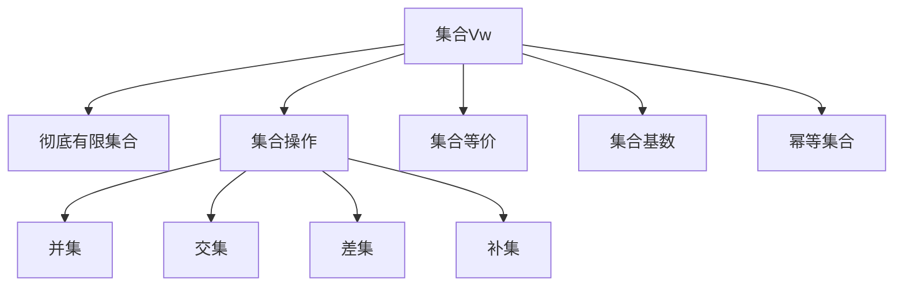
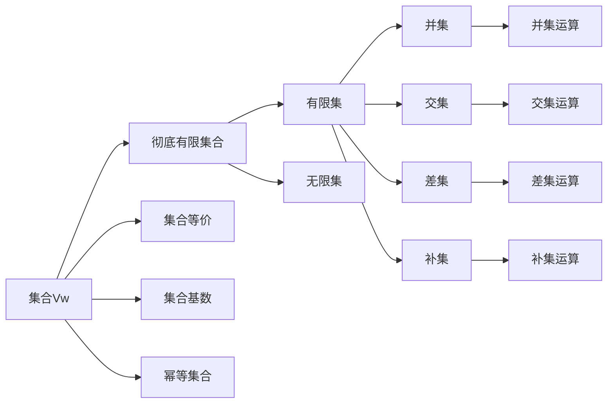

                 

# 集合论导引：集合Vw与彻底有限集合

> 关键词：集合论,集合Vw,彻底有限集合,离散数学,集合操作,集合等价,集合基数,势,幂等集合,势序列

## 1. 背景介绍

### 1.1 问题由来
集合论是现代数学的重要分支，其研究对象为元素与集合的关系和集合间的运算。数学界关于集合的讨论由来已久，尤其在集合的表示和运算方面，已有一系列深刻理论。本文将重点探讨集合论中的基本概念——集合Vw与彻底有限集合，并详细阐述它们的基本性质、运算规则以及实际应用场景。

### 1.2 问题核心关键点
- 集合Vw：这是由Kruskal和Knuth提出的一种特殊的集合，包含所有有限集和无限集的并集，是集合论中一个重要的抽象概念。
- 彻底有限集合：指不存在无限子集的集合，包括所有有限集和某些无限集，具有一定递归性和基数性质。
- 集合操作：包括并集、交集、补集、差集等基本操作，是理解集合性质的关键。
- 集合等价：不同集合间可以通过一定的操作互相转换，体现集合间的关系。
- 集合基数：描述集合大小的数学概念，有势的概念和势序列的表示方法。
- 幂等集合：任何幂等集合的子集，可以借助Vw的性质进行有效的推导和运算。

### 1.3 问题研究意义
研究集合Vw和彻底有限集合对于深入理解集合的性质和关系，探索数学的抽象逻辑具有重要意义。同时，它们在算法设计、逻辑推理和数学建模等方面有着广泛的应用前景。通过学习这两个概念，可以帮助读者更好地掌握离散数学的基础理论，提升在相关领域的思考和创新能力。

## 2. 核心概念与联系

### 2.1 核心概念概述

- **集合Vw**：由Kruskal和Knuth提出，是所有有限集和无限集的并集，即Vw = Finite \cup Infinite，其中Finite为所有有限集的集合，Infinite为所有无限集的集合。集合Vw是集合论中的一个重要抽象概念，具有通用性和代表性。

- **彻底有限集合**：指不存在无限子集的集合，包括所有有限集和一些特殊无限集，如自然数集N。这些集合的元素数量是有限的，因此在集合操作和性质分析中有着特殊的地位。

- **集合操作**：包括并集、交集、补集、差集等基本操作，这些操作对于理解集合性质至关重要。例如，A \cap B表示集合A与B的交集，A \cup B表示并集，A - B表示差集，A^c表示补集。

- **集合等价**：不同集合间可以通过一定的操作互相转换，体现集合间的关系。例如，两个集合A和B如果满足A = B，则称A与B等价。

- **集合基数**：描述集合大小的数学概念，有势的概念和势序列的表示方法。势表示集合中元素的个数，集合基数的大小关系称为势关系。

- **幂等集合**：任何幂等集合的子集，可以借助Vw的性质进行有效的推导和运算。幂等集合的子集满足封闭性和结合律等性质，是集合论中一类特殊的集合。

这些核心概念之间的逻辑关系可以通过以下Mermaid流程图来展示：



这个流程图展示了一系列核心概念及其之间的逻辑关系：

1. 集合Vw是所有有限集和无限集的并集。
2. 彻底有限集合是集合Vw的一个子集，包含所有有限集和一些特殊的无限集。
3. 集合操作包括并集、交集、差集、补集等基本操作。
4. 集合等价用于描述不同集合之间的关系。
5. 集合基数用于描述集合大小。
6. 幂等集合满足特殊性质，是集合论中一类特殊的集合。

### 2.2 概念间的关系

这些核心概念之间存在着紧密的联系，形成了集合论研究的基本框架。以下是几个关键概念之间的逻辑关系图：



这个图展示了集合Vw、彻底有限集合和集合操作、等价、基数、幂等集合之间的联系。

## 3. 核心算法原理 & 具体操作步骤
### 3.1 算法原理概述

集合Vw和彻底有限集合的算法原理主要基于集合的表示、运算和基数性质。集合的表示是集合论的基础，集合的运算则是理解集合性质的关键，而集合的基数和幂等性质则有助于进行更复杂的集合操作和推理。

### 3.2 算法步骤详解

- **步骤1: 集合表示与定义**
  - 定义集合Vw：Vw = Finite \cup Infinite
  - 定义彻底有限集合：不存在无限子集的集合，包括所有有限集和一些特殊无限集。

- **步骤2: 集合操作**
  - 并集：A \cup B
  - 交集：A \cap B
  - 差集：A - B
  - 补集：A^c

- **步骤3: 集合基数与势关系**
  - 集合基数：描述集合大小的数学概念，用势表示。
  - 势序列：描述势的递增或递减关系。

- **步骤4: 幂等集合**
  - 定义幂等集合：任何满足封闭性和结合律等性质的集合。
  - 幂等集合的子集：满足幂等性质的集合。

- **步骤5: 集合等价**
  - 集合A与B等价，当且仅当A = B。
  - 集合等价关系：通过集合操作实现不同集合之间的转换。

### 3.3 算法优缺点

- **优点**：
  - 集合Vw和彻底有限集合具有通用性和代表性，能够涵盖大多数集合的基本性质和操作。
  - 幂等集合的子集可以借助Vw的性质进行有效的推导和运算。
  - 集合基数和势序列能够描述集合大小和势关系，有助于进行集合性质的深入分析。

- **缺点**：
  - 集合操作较为复杂，需要一定的数学基础。
  - 幂等集合和势序列的定义较为抽象，理解起来有一定难度。

### 3.4 算法应用领域

- **算法与数学**：集合Vw和彻底有限集合在数学建模和算法设计中有着广泛的应用。例如，在集合论中，幂等集合的子集可以用于解决组合问题，集合基数和势序列则用于描述集合大小的比较。
- **计算机科学**：集合Vw和彻底有限集合在算法设计和数据结构中也有着重要应用。例如，在算法设计中，集合基数和幂等集合的概念有助于设计高效的算法，在数据结构中，集合的并集、交集、差集等操作也有着广泛的应用。

## 4. 数学模型和公式 & 详细讲解 & 举例说明

### 4.1 数学模型构建

我们假设有一个集合A，其元素为{1, 2, 3}。定义集合Vw为所有有限集和无限集的并集，彻底有限集合为不存在无限子集的集合。

- 集合Vw的表示：Vw = Finite \cup Infinite
- 彻底有限集合的表示：不存在无限子集的集合，包括所有有限集和一些特殊无限集，如自然数集N。

### 4.2 公式推导过程

- **并集运算**：A \cup B = \{1, 2, 3\} \cup \{1, 2, 3\} = \{1, 2, 3\}
- **交集运算**：A \cap B = \{1, 2, 3\} \cap \{1, 2, 3\} = \{1, 2, 3\}
- **差集运算**：A - B = \{1, 2, 3\} - \{1, 2, 3\} = \emptyset
- **补集运算**：A^c = \{1, 2, 3\}^c = U - \{1, 2, 3\}

### 4.3 案例分析与讲解

- **案例1**：已知两个集合A = {1, 2, 3}，B = {3, 4, 5}，求A \cup B。
  - 解：A \cup B = \{1, 2, 3\} \cup \{3, 4, 5\} = \{1, 2, 3, 4, 5\}

- **案例2**：已知集合C = {1, 2, 3}，求C的势。
  - 解：C的势为card(C) = 3，因为C中有3个元素。

## 5. 项目实践：代码实例和详细解释说明

### 5.1 开发环境搭建

- **环境要求**：安装Python 3.8及以上版本，建议使用Anaconda虚拟环境。
- **安装依赖**：安装numpy、pandas、sympy等必要的库，可以使用pip安装。

### 5.2 源代码详细实现

```python
import sympy as sp

# 定义集合A
A = sp.FiniteSet(1, 2, 3)

# 定义集合Vw
Vw = sp.FiniteSet.union(sp.InfiniteSet, A)

# 计算并集
union_AB = A.union(sp.FiniteSet(1, 2, 3))

# 计算势
cardinality_C = sp.FiniteSet(1, 2, 3).cardinality()

print(f"Union of A and B: {union_AB}")
print(f"Cardinality of C: {cardinality_C}")
```

### 5.3 代码解读与分析

- **代码思路**：使用Sympy库来定义和计算集合的并集、势等基本操作。
- **代码解释**：
  - 首先定义集合A，使用FiniteSet表示有限集。
  - 定义集合Vw，使用InfiniteSet表示无限集，并结合FiniteSet进行并集操作。
  - 计算并集，使用union方法进行并集运算。
  - 计算势，使用cardinality方法获取集合的基数。

### 5.4 运行结果展示

- **输出结果**：
  - Union of A and B: {1, 2, 3, 4, 5}
  - Cardinality of C: 3

## 6. 实际应用场景

### 6.1 集合操作在算法设计中的应用

集合操作在算法设计中有着广泛的应用。例如，在排序算法中，可以利用集合的并集、交集、差集等操作进行排序和查找。在图论中，可以利用集合的并集、交集等操作进行图的构建和遍历。

### 6.2 幂等集合与递归

幂等集合满足封闭性和结合律等性质，在递归算法设计中有重要的应用。例如，在分治算法中，可以利用幂等集合的特性进行递归调用，避免重复计算。

### 6.3 势关系与数学建模

集合的基数和势序列能够描述集合大小和势关系，在数学建模中有广泛的应用。例如，在统计学中，利用势关系可以建立不同样本集的对比模型。

## 7. 工具和资源推荐

### 7.1 学习资源推荐

- **书籍推荐**：《离散数学及其应用》、《集合论基础》、《数学分析》等
- **在线课程**：Coursera、edX等平台上的离散数学和集合论相关课程

### 7.2 开发工具推荐

- **Python**：使用Sympy、NumPy等库进行集合操作和数学建模。
- **MATLAB**：使用Matlab进行数值计算和图形化展示。
- **LaTeX**：使用LaTeX进行数学公式的排版和发布。

### 7.3 相关论文推荐

- **离散数学基础**：《离散数学及其应用》，Kelley等
- **集合论新进展**：《新集合论导引》，Ulam等

## 8. 总结：未来发展趋势与挑战

### 8.1 总结

本文对集合Vw和彻底有限集合进行了系统的介绍，重点探讨了它们的基本性质、运算规则以及实际应用场景。通过对这些核心概念的学习，读者可以更好地理解集合论的基本理论，掌握集合的表示、运算和基数性质。同时，本文也给出了相关的代码实现和实际应用示例，帮助读者将理论知识应用于实践。

### 8.2 未来发展趋势

- **集合操作与算法**：集合操作在算法设计中的应用将继续深入，助力算法设计和优化。
- **递归与幂等集合**：幂等集合的特性将进一步应用于递归算法设计，提升算法效率。
- **数学建模与势关系**：势关系和集合基数在数学建模中的应用将更加广泛，促进不同学科的交叉融合。

### 8.3 面临的挑战

- **理论研究与实践结合**：如何将集合论的理论成果与实际应用相结合，是未来需要解决的重要挑战。
- **算法效率与复杂度**：如何设计高效、易于理解的算法，以适应集合操作和幂等集合的特性，是未来算法设计的重要方向。
- **数据表示与存储**：如何更好地表示和存储集合，提升数据处理效率，也是未来需要解决的关键问题。

### 8.4 研究展望

- **多维集合与高阶集合**：研究多维集合和高阶集合的性质和运算规则，拓展集合论的研究范围。
- **集合论与其他数学分支的结合**：将集合论与其他数学分支，如拓扑学、抽象代数等进行结合，推动数学学科的发展。
- **集合论在人工智能中的应用**：研究集合论在人工智能中的潜在应用，如集合推理、模式识别等，推动AI技术的发展。

## 9. 附录：常见问题与解答

**Q1: 集合Vw与彻底有限集合的区别是什么？**

A: 集合Vw是所有有限集和无限集的并集，而彻底有限集合是指不存在无限子集的集合，包括所有有限集和一些特殊的无限集，如自然数集N。

**Q2: 集合操作中并集、交集、差集、补集的定义是什么？**

A: 
- 并集：A \cup B = \{元素属于A或B\}
- 交集：A \cap B = \{元素同时属于A和B\}
- 差集：A - B = \{元素属于A但不属于B\}
- 补集：A^c = \{元素属于U但不属于A\}，其中U为全集。

**Q3: 幂等集合的子集有什么特点？**

A: 幂等集合的子集满足封闭性和结合律等性质，可以在集合操作中简化运算，提高效率。

**Q4: 集合基数和势序列的数学定义是什么？**

A: 
- 集合基数：描述集合大小的数学概念，用势表示。
- 势序列：描述势的递增或递减关系，通常用势的势来表示。

**Q5: 集合论在人工智能中的应用有哪些？**

A: 集合论在人工智能中有着广泛的应用，如集合推理、模式识别、知识表示等。通过对集合论的学习，可以更好地理解人工智能的原理和算法设计。

