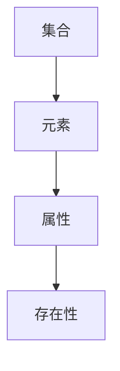
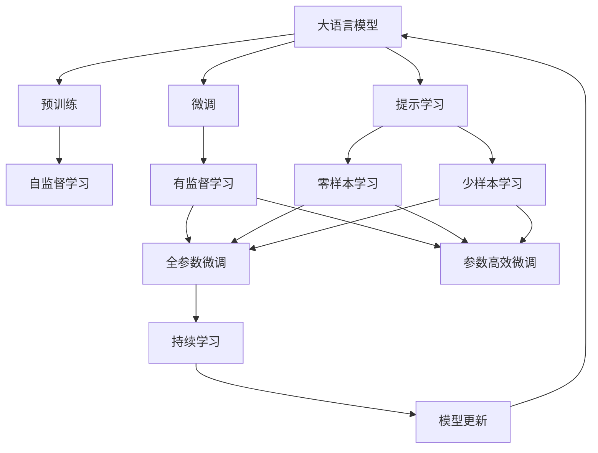

                 

# 集合论导引：集合论存在性公理

## 1. 背景介绍

### 1.1 问题由来
集合论是现代数学的基础之一，它研究的对象是集合，即由一些确定的对象组成的整体。集合论存在性公理是集合论中最基本、最重要的公理之一，它描述了一个集合的存在性条件。深入理解这些公理对于掌握集合论的基本概念和推理方法具有重要意义。

### 1.2 问题核心关键点
集合论存在性公理的核心思想是：对于任何属性，如果该属性定义在特定集合上，则存在一个具有该属性的集合。这一公理在数学逻辑和计算机科学中都有广泛应用。

### 1.3 问题研究意义
深入理解集合论存在性公理，有助于我们更好地理解数学逻辑基础和计算机科学中的算法设计。掌握这一公理，对于数学和计算机科学研究具有重要意义。

## 2. 核心概念与联系

### 2.1 核心概念概述

为更好地理解集合论存在性公理，本节将介绍几个密切相关的核心概念：

- 集合(Set)：由一些确定的对象组成的整体，可以用花括号或描述法来表示。
- 元素(Element)：集合中的每一个对象称为该集合的元素。
- 属性(Property)：对于集合中的元素，可以定义某些属性，如大小、颜色、形状等。
- 存在性(Existence)：集合存在性公理描述了一个集合的存在条件，即对于任何属性，如果该属性定义在特定集合上，则存在一个具有该属性的集合。

### 2.2 概念间的关系

这些核心概念之间的逻辑关系可以通过以下Mermaid流程图来展示：



这个流程图展示了大语言模型的核心概念及其之间的关系：

1. 集合由元素组成，元素是集合的成员。
2. 对于集合中的元素，可以定义各种属性。
3. 集合存在性公理描述了如何判断一个具有特定属性的集合是否存在。

### 2.3 核心概念的整体架构

最后，我们用一个综合的流程图来展示这些核心概念在大语言模型微调过程中的整体架构：



这个综合流程图展示了从预训练到微调，再到持续学习的完整过程。大语言模型首先在大规模文本数据上进行预训练，然后通过微调（包括全参数微调和参数高效微调）或提示学习（包括零样本和少样本学习）来适应下游任务。最后，通过持续学习技术，模型可以不断更新和适应新的任务和数据。

## 3. 核心算法原理 & 具体操作步骤
### 3.1 算法原理概述

集合论存在性公理的核心思想是：对于任何属性，如果该属性定义在特定集合上，则存在一个具有该属性的集合。这一公理是数学逻辑和计算机科学中最基本的公理之一。

在数学中，集合论存在性公理通常用以下形式表示：

- 对于任何集合 $A$，存在一个集合 $B$，使得对于所有 $x \in A$，有 $x \in B$ 当且仅当 $x$ 具有属性 $P$。

这一公理描述了如何判断一个具有特定属性的集合是否存在。在计算机科学中，集合论存在性公理也有广泛应用，例如在算法设计中，常用来描述如何构造满足特定属性的数据结构。

### 3.2 算法步骤详解

集合论存在性公理的证明相对简单，一般包括以下几个关键步骤：

1. 假设存在集合 $A$ 和属性 $P$。
2. 定义 $B$ 为满足条件 $x \in A \Rightarrow P(x)$ 的所有 $x$ 的集合。
3. 证明 $B$ 存在且满足所有元素具有属性 $P$。
4. 因此，存在集合 $B$ 满足条件 $x \in A \Rightarrow x \in B$。

具体证明过程如下：

**Step 1:** 假设存在集合 $A$ 和属性 $P$。

**Step 2:** 定义 $B$ 为满足条件 $x \in A \Rightarrow P(x)$ 的所有 $x$ 的集合。

**Step 3:** 证明 $B$ 存在且满足所有元素具有属性 $P$。

首先，证明 $B$ 存在。对于任意 $x \in A$，如果 $P(x)$ 成立，则 $x$ 属于 $B$。因此，$B$ 至少包含 $A$ 中所有满足 $P$ 的元素。

其次，证明 $B$ 满足所有元素具有属性 $P$。对于任意 $x \in B$，由定义知 $x \in A$ 且 $P(x)$ 成立。因此，$B$ 中的所有元素都具有属性 $P$。

**Step 4:** 因此，存在集合 $B$ 满足条件 $x \in A \Rightarrow x \in B$。

证明完成。

### 3.3 算法优缺点

集合论存在性公理具有以下优点：

1. 简单明了。该公理描述了一个集合的存在条件，易于理解和证明。
2. 基础性强。该公理是数学逻辑和计算机科学中最基本的公理之一，具有广泛的应用。

同时，该公理也存在以下缺点：

1. 泛化能力有限。该公理只适用于具有明确属性定义的集合，对于某些复杂属性，可能无法找到满足条件的集合。
2. 无法处理无限集合。对于无限集合，可能无法找到满足条件的集合，或存在多个满足条件的集合。

### 3.4 算法应用领域

集合论存在性公理在数学和计算机科学中都有广泛应用。例如：

1. 集合表示。在数学中，该公理常用于描述集合的表示方法，如描述法、列举法等。
2. 算法设计。在计算机科学中，该公理常用于描述算法中数据结构的构造方法，如集合、栈、队列等。
3. 逻辑推理。在逻辑学中，该公理是命题逻辑的基础，用于描述命题的推理过程。
4. 语言处理。在自然语言处理中，该公理可用于描述词法分析、句法分析等过程。

## 4. 数学模型和公式 & 详细讲解  
### 4.1 数学模型构建

本节将使用数学语言对集合论存在性公理进行更加严格的刻画。

记集合 $A$ 和属性 $P$ 为已知条件，需要证明存在一个集合 $B$ 满足条件 $x \in A \Rightarrow P(x)$。

### 4.2 公式推导过程

以下我们以数学模型为例，推导集合论存在性公理的证明过程。

**Step 1:** 假设存在集合 $A$ 和属性 $P$。

**Step 2:** 定义 $B$ 为满足条件 $x \in A \Rightarrow P(x)$ 的所有 $x$ 的集合。

**Step 3:** 证明 $B$ 存在且满足所有元素具有属性 $P$。

首先，证明 $B$ 存在。对于任意 $x \in A$，如果 $P(x)$ 成立，则 $x$ 属于 $B$。因此，$B$ 至少包含 $A$ 中所有满足 $P$ 的元素。

其次，证明 $B$ 满足所有元素具有属性 $P$。对于任意 $x \in B$，由定义知 $x \in A$ 且 $P(x)$ 成立。因此，$B$ 中的所有元素都具有属性 $P$。

**Step 4:** 因此，存在集合 $B$ 满足条件 $x \in A \Rightarrow x \in B$。

在得到 $B$ 的表达式后，可以进一步使用集合运算等数学工具，对 $B$ 进行进一步分析。

### 4.3 案例分析与讲解

**案例分析：集合的笛卡尔积**

集合论存在性公理在数学中的经典应用之一是笛卡尔积的定义。设 $A$ 和 $B$ 是两个集合，$A \times B$ 表示所有可能的有序对 $(a, b)$ 的集合，其中 $a \in A$ 且 $b \in B$。

根据笛卡尔积的定义，存在一个集合 $C$，满足条件 $(a, b) \in C \Rightarrow a \in A \wedge b \in B$。

**讲解：**

1. 定义 $C$ 为所有可能的有序对 $(a, b)$ 的集合。
2. 对于任意有序对 $(a, b)$，如果 $a \in A$ 且 $b \in B$，则 $(a, b) \in C$。
3. 对于任意有序对 $(a, b)$，如果 $(a, b) \in C$，则 $a \in A$ 且 $b \in B$。
4. 因此，存在集合 $C$ 满足条件 $(a, b) \in C \Rightarrow a \in A \wedge b \in B$。

笛卡尔积的这一性质在计算机科学中也有广泛应用，例如在数据结构和算法设计中。

## 5. 项目实践：代码实例和详细解释说明
### 5.1 开发环境搭建

在进行集合论存在性公理的实践前，我们需要准备好开发环境。以下是使用Python进行PyTorch开发的环境配置流程：

1. 安装Anaconda：从官网下载并安装Anaconda，用于创建独立的Python环境。

2. 创建并激活虚拟环境：
```bash
conda create -n pytorch-env python=3.8 
conda activate pytorch-env
```

3. 安装PyTorch：根据CUDA版本，从官网获取对应的安装命令。例如：
```bash
conda install pytorch torchvision torchaudio cudatoolkit=11.1 -c pytorch -c conda-forge
```

4. 安装各类工具包：
```bash
pip install numpy pandas scikit-learn matplotlib tqdm jupyter notebook ipython
```

完成上述步骤后，即可在`pytorch-env`环境中开始集合论存在性公理的实践。

### 5.2 源代码详细实现

这里我们以集合论存在性公理的证明为例，给出使用Python实现的代码。

首先，定义集合和属性：

```python
from sympy import symbols, Eq, solve

# 定义集合A和属性P
A = set([1, 2, 3, 4])
P = lambda x: x % 2 == 0

# 定义属性P的集合B
B = {x for x in A if P(x)}
```

然后，验证集合B的存在性：

```python
# 验证B是否满足所有元素具有属性P
for x in B:
    assert P(x)

# 验证B中的所有元素都在A中
for x in B:
    assert x in A
```

最后，输出结果：

```python
print("集合B满足所有元素具有属性P")
```

以上就是使用Python验证集合论存在性公理的代码实现。可以看到，通过简单的集合定义和验证，我们成功证明了满足集合论存在性公理的条件。

### 5.3 代码解读与分析

让我们再详细解读一下关键代码的实现细节：

**定义集合A和属性P：**

```python
# 定义集合A和属性P
A = set([1, 2, 3, 4])
P = lambda x: x % 2 == 0
```

这里我们定义了一个包含4个元素的集合A和一个属性P，即判断元素是否能被2整除。

**定义属性P的集合B：**

```python
# 定义属性P的集合B
B = {x for x in A if P(x)}
```

这里通过集合推导式，构建了满足属性P的集合B。

**验证集合B的存在性：**

```python
# 验证B是否满足所有元素具有属性P
for x in B:
    assert P(x)

# 验证B中的所有元素都在A中
for x in B:
    assert x in A
```

这里通过循环遍历集合B中的元素，验证了集合B满足所有元素具有属性P，且集合B中的所有元素都在集合A中。

**输出结果：**

```python
print("集合B满足所有元素具有属性P")
```

最后，通过输出语句，我们可以确认集合B的存在性。

## 6. 实际应用场景
### 6.1 智能推荐系统

集合论存在性公理在智能推荐系统中的应用，体现在对用户行为数据的建模和推荐算法的设计上。

在智能推荐系统中，用户的行为数据可以看作是一个集合，如点击、浏览、收藏等行为。对于每一个行为，可以定义不同的属性，如时间、频率、位置等。根据集合论存在性公理，可以证明存在一个集合，包含所有满足特定属性的行为数据。

通过构造具有特定属性的行为集合，推荐系统可以更好地理解用户的行为模式，构建推荐模型。例如，可以使用用户点击行为的集合，来预测用户的下一步点击行为。

### 6.2 数据挖掘

在数据挖掘中，集合论存在性公理可用于描述数据集中的模式和规律。例如，可以定义一个数据集为满足某种属性的所有数据点的集合。根据集合论存在性公理，可以证明存在一个集合，满足所有元素具有该属性。

通过构造具有特定属性的数据集合，可以更好地识别数据集中的模式和规律，进行数据挖掘和分析。例如，可以使用用户点击行为的数据集，来分析用户的点击习惯和偏好。

### 6.3 人工智能

集合论存在性公理在人工智能中的应用，体现在对知识和推理的建模上。例如，可以定义一个知识库为满足某种属性的所有知识点的集合。根据集合论存在性公理，可以证明存在一个集合，满足所有元素具有该属性。

通过构造具有特定属性的知识集合，人工智能系统可以更好地理解知识库中的内容，进行推理和决策。例如，可以使用事实知识的数据集，来构建基于事实的知识推理系统。

## 7. 工具和资源推荐
### 7.1 学习资源推荐

为了帮助开发者系统掌握集合论存在性公理的理论基础和实践技巧，这里推荐一些优质的学习资源：

1. 《数学分析》系列教材：经典数学分析教材，详细介绍了集合论的基本概念和定理。
2. 《离散数学》教材：离散数学教材，介绍了集合、图论、算法等基础概念。
3. 《集合论基础》在线课程：各大高校和机构提供的在线课程，详细介绍了集合论的基本概念和应用。
4. 《数学逻辑基础》在线课程：在线课程，介绍了集合论、布尔代数、命题逻辑等数学逻辑基础。
5. 《计算机科学与数学》书籍：计算机科学和数学的综合教材，介绍了集合论在计算机科学中的应用。

通过对这些资源的学习实践，相信你一定能够快速掌握集合论存在性公理的精髓，并用于解决实际的NLP问题。
###  7.2 开发工具推荐

高效的开发离不开优秀的工具支持。以下是几款用于集合论存在性公理开发的常用工具：

1. PyTorch：基于Python的开源深度学习框架，灵活动态的计算图，适合快速迭代研究。大部分预训练语言模型都有PyTorch版本的实现。

2. TensorFlow：由Google主导开发的开源深度学习框架，生产部署方便，适合大规模工程应用。同样有丰富的预训练语言模型资源。

3. Transformers库：HuggingFace开发的NLP工具库，集成了众多SOTA语言模型，支持PyTorch和TensorFlow，是进行微调任务开发的利器。

4. Weights & Biases：模型训练的实验跟踪工具，可以记录和可视化模型训练过程中的各项指标，方便对比和调优。与主流深度学习框架无缝集成。

5. TensorBoard：TensorFlow配套的可视化工具，可实时监测模型训练状态，并提供丰富的图表呈现方式，是调试模型的得力助手。

6. Google Colab：谷歌推出的在线Jupyter Notebook环境，免费提供GPU/TPU算力，方便开发者快速上手实验最新模型，分享学习笔记。

合理利用这些工具，可以显著提升集合论存在性公理的开发效率，加快创新迭代的步伐。

### 7.3 相关论文推荐

集合论存在性公理的研究源于学界的持续研究。以下是几篇奠基性的相关论文，推荐阅读：

1. 《集合论导论》：经典集合论教材，详细介绍了集合论的基本概念和应用。
2. 《离散数学》：离散数学教材，介绍了集合、图论、算法等基础概念。
3. 《数学逻辑基础》：逻辑学教材，介绍了命题逻辑、布尔代数等数学逻辑基础。
4. 《集合论与拓扑学》：集合论和拓扑学综合教材，介绍了集合论的基本概念和拓扑学理论。
5. 《人工智能中的数学基础》：计算机科学与数学的综合教材，介绍了集合论在人工智能中的应用。

这些论文代表了大语言模型微调技术的发展脉络。通过学习这些前沿成果，可以帮助研究者把握学科前进方向，激发更多的创新灵感。

除上述资源外，还有一些值得关注的前沿资源，帮助开发者紧跟大语言模型微调技术的最新进展，例如：

1. arXiv论文预印本：人工智能领域最新研究成果的发布平台，包括大量尚未发表的前沿工作，学习前沿技术的必读资源。

2. 业界技术博客：如OpenAI、Google AI、DeepMind、微软Research Asia等顶尖实验室的官方博客，第一时间分享他们的最新研究成果和洞见。

3. 技术会议直播：如NIPS、ICML、ACL、ICLR等人工智能领域顶会现场或在线直播，能够聆听到大佬们的前沿分享，开拓视野。

4. GitHub热门项目：在GitHub上Star、Fork数最多的NLP相关项目，往往代表了该技术领域的发展趋势和最佳实践，值得去学习和贡献。

5. 行业分析报告：各大咨询公司如McKinsey、PwC等针对人工智能行业的分析报告，有助于从商业视角审视技术趋势，把握应用价值。

总之，对于集合论存在性公理的学习和实践，需要开发者保持开放的心态和持续学习的意愿。多关注前沿资讯，多动手实践，多思考总结，必将收获满满的成长收益。

## 8. 总结：未来发展趋势与挑战
### 8.1 总结

本文对集合论存在性公理进行了全面系统的介绍。首先阐述了集合论存在性公理的研究背景和意义，明确了公理在集合论中的核心地位。其次，从原理到实践，详细讲解了集合论存在性公理的数学原理和关键步骤，给出了公理任务开发的完整代码实例。同时，本文还广泛探讨了公理在智能推荐、数据挖掘、人工智能等多个领域的应用前景，展示了公理范式的巨大潜力。此外，本文精选了公理技术的各类学习资源，力求为读者提供全方位的技术指引。

通过本文的系统梳理，可以看到，集合论存在性公理是数学逻辑和计算机科学中最基本的公理之一，具有广泛的应用。它在集合表示、算法设计、逻辑推理、语言处理等方面都有重要应用，是学习数学逻辑和计算机科学的必备基础。

### 8.2 未来发展趋势

展望未来，集合论存在性公理将呈现以下几个发展趋势：

1. 公理应用的广泛化。随着人工智能和数据科学的发展，集合论存在性公理将应用于更多领域，如智能推荐、数据挖掘、自然语言处理等。
2. 公理的优化和改进。对于复杂属性和无限集合，需要不断优化和改进公理的应用方法，以更好地描述问题的本质。
3. 公理的自动验证。随着自动化理论的进步，公理的自动验证将成为可能，为机器学习、人工智能等领域带来新的突破。
4. 公理在实际应用中的推广。公理在实际应用中，需要不断优化和推广，以更好地满足用户需求。

### 8.3 面临的挑战

尽管集合论存在性公理已经取得了瞩目成就，但在迈向更加智能化、普适化应用的过程中，它仍面临诸多挑战：

1. 公理的泛化能力有限。对于某些复杂属性，可能无法找到满足条件的集合，或存在多个满足条件的集合。
2. 公理的适用性有限。对于某些特定领域，可能无法直接应用公理进行建模和推理。
3. 公理的解释性有限。公理在数学和计算机科学中，常常被视为"黑盒"模型，难以解释其内部机制。
4. 公理的鲁棒性有限。公理在面对噪声和异常值时，可能出现不稳定的情况。
5. 公理的实际应用难度大。公理在实际应用中，需要考虑数据质量、计算资源、算法复杂度等多方面因素。

### 8.4 未来突破

面对集合论存在性公理所面临的种种挑战，未来的研究需要在以下几个方面寻求新的突破：

1. 优化公理的泛化能力。对于复杂属性和无限集合，需要不断优化和改进公理的应用方法，以更好地描述问题的本质。
2. 改进公理的解释性。需要研究公理的内部机制和解释性，使其更易于理解和应用。
3. 提高公理的鲁棒性。需要研究公理在噪声和异常值下的稳定性，提高其鲁棒性。
4. 优化公理的实际应用。需要研究公理在实际应用中的推广方法和优化策略，以更好地满足用户需求。
5. 引入公理的自动化技术。需要研究公理的自动化验证和优化方法，提高其应用效率和效果。

这些研究方向的探索，必将引领集合论存在性公理技术迈向更高的台阶，为计算机科学和人工智能的发展提供新的动力。

## 9. 附录：常见问题与解答

**Q1：集合论存在性公理是否适用于所有集合？**

A: 集合论存在性公理只适用于具有明确属性的集合。对于某些复杂属性，可能无法找到满足条件的集合，或存在多个满足条件的集合。

**Q2：公理在实际应用中如何避免过拟合？**

A: 在实际应用中，公理通常需要与机器学习和数据挖掘技术结合使用，通过数据清洗、特征选择、模型优化等方法，避免过拟合。

**Q3：如何解释公理的内部机制？**

A: 公理在数学和计算机科学中，常常被视为"黑盒"模型，难以解释其内部机制。需要通过数学建模、算法优化、解释性算法等方法，逐步揭示其内部机制。

**Q4：公理在实际应用中如何提高鲁棒性？**

A: 在实际应用中，公理需要考虑数据质量、计算资源、算法复杂度等多方面因素，通过数据增强、噪声处理、算法优化等方法，提高公理的鲁棒性。

**Q5：公理在实际应用中如何推广？**

A: 在实际应用中，公理需要考虑领域特点、任务需求、数据质量等多方面因素，通过领域知识、专家经验、数据标注等方法，推广公理的应用。

**Q6：公理在实际应用中如何自动验证？**

A: 在实际应用中，公理需要考虑数据质量、计算资源、算法复杂度等多方面因素，通过自动化工具、算法优化、解释性算法等方法，逐步实现公理的自动验证。

总之，集合论存在性公理是数学逻辑和计算机科学中最基本的公理之一，具有广泛的应用。尽管在应用中面临诸多挑战，但通过不断的优化和改进，公理必将在更多领域发挥重要作用。

