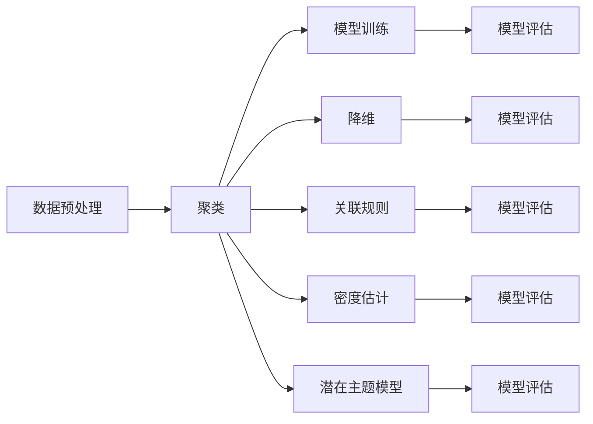

                 

# 非监督学习 原理与代码实例讲解

## 1. 背景介绍

### 1.1 问题由来

在人工智能领域，监督学习是一种广泛应用的机器学习方法，它依赖于大量的标注数据来训练模型，以对新数据进行预测。然而，在实际应用中，标注数据的获取成本往往非常高，导致数据集难以收集。这使得监督学习在处理大规模数据集、高维度数据等问题上存在局限。

为应对这一挑战，非监督学习应运而生。非监督学习不依赖于标注数据，通过挖掘数据的内在结构，自动发现数据中的模式和关系，从而进行模型训练和预测。近年来，随着深度学习和大数据的快速发展，非监督学习得到了越来越多的关注和应用。

### 1.2 问题核心关键点

非监督学习的核心在于通过无标签数据自发学习数据的结构和规律，而非监督学习算法则是在这个过程中发挥关键作用的。常见的非监督学习算法包括聚类、降维、关联规则等。非监督学习在无标签数据集上进行训练，学习到数据的分布和结构，然后利用这些分布和结构来指导模型预测或生成。

非监督学习的关键点包括：

- **数据预处理**：在训练之前，对数据进行去噪、归一化等预处理操作，以便于后续的聚类和降维。
- **算法选择**：根据数据集的特点和应用需求选择合适的非监督学习算法。
- **模型训练**：通过算法计算，得到数据集的内在结构和规律，生成模型。
- **模型评估**：对模型进行评估，衡量其预测效果和泛化能力。

非监督学习的应用领域非常广泛，包括图像处理、文本分析、异常检测、推荐系统等。

## 2. 核心概念与联系

### 2.1 核心概念概述

非监督学习涉及多个核心概念，包括：

- **聚类**：将数据分成多个相似群组的过程。常见的聚类算法有K-means、层次聚类等。
- **降维**：将高维数据映射到低维空间的过程。常见的降维算法有PCA、t-SNE等。
- **关联规则**：挖掘数据集中变量之间的关联关系，常用于市场篮分析等。
- **密度估计**：估计数据点的密度分布，常用的方法有高斯混合模型、K近邻算法等。
- **潜在主题模型**：从文本数据中发现潜在主题，常用的方法有LDA等。

这些概念之间相互关联，通过不同的算法和方法，可以从数据中提取有价值的信息和模式。

### 2.2 核心概念间的联系

以下Mermaid流程图展示了非监督学习中各核心概念之间的联系：



这个流程图展示了非监督学习过程中各个环节的流程和联系。数据预处理是整个流程的起点，通过预处理后的数据，可以采用不同的算法进行模型训练和预测。不同的算法训练出的模型，可以通过模型评估来衡量其效果和泛化能力。

## 3. 核心算法原理 & 具体操作步骤

### 3.1 算法原理概述

非监督学习算法根据其目标和应用场景的不同，可以划分为多种类型。以下是几种常见的非监督学习算法及其原理：

#### 3.1.1 K-means算法

K-means算法是一种经典的聚类算法，其基本思想是将数据点分成K个簇，使得同一簇内的数据点相似度高，不同簇之间的数据点相似度低。

K-means算法的基本步骤如下：

1. 初始化K个聚类中心。
2. 对于每个数据点，计算其与K个聚类中心的距离，并将其分配到距离最近的聚类中心所在的簇。
3. 对于每个簇，计算其新的聚类中心，即簇中所有数据点的平均值。
4. 重复步骤2和步骤3，直到簇的分配和聚类中心不再变化或达到预设迭代次数。

#### 3.1.2 PCA算法

PCA（Principal Component Analysis，主成分分析）是一种常用的降维算法，其目标是将高维数据映射到低维空间，同时尽可能保留数据的方差和信息。

PCA算法的基本步骤如下：

1. 计算数据集的协方差矩阵。
2. 计算协方差矩阵的特征值和特征向量，得到特征向量矩阵。
3. 选择特征值最大的K个特征向量，构成新的特征向量矩阵。
4. 将原始数据投影到新的特征向量矩阵上，得到低维数据。

#### 3.1.3 t-SNE算法

t-SNE（t-Distributed Stochastic Neighbor Embedding，t分布随机邻域嵌入）是一种降维算法，其目标是保留数据点之间的相似性，将高维数据映射到低维空间。

t-SNE算法的基本步骤如下：

1. 计算数据点之间的相似度矩阵。
2. 对相似度矩阵进行优化，使得低维空间中的数据点相似度与高维空间中的数据点相似度接近。
3. 将高维数据映射到低维空间。

### 3.2 算法步骤详解

#### 3.2.1 K-means算法步骤详解

1. 初始化K个聚类中心，通常随机选择。
2. 对于每个数据点，计算其与K个聚类中心的距离，并将其分配到距离最近的聚类中心所在的簇。
3. 对于每个簇，计算其新的聚类中心，即簇中所有数据点的平均值。
4. 重复步骤2和步骤3，直到簇的分配和聚类中心不再变化或达到预设迭代次数。

```python
import numpy as np
import matplotlib.pyplot as plt

def kmeans(X, K, max_iter=100):
    # 随机初始化K个聚类中心
    centroids = np.random.rand(K, X.shape[1])
    for i in range(max_iter):
        # 计算每个数据点到每个聚类中心的距离
        distances = np.linalg.norm(X - centroids, axis=1)
        # 将数据点分配到距离最近的聚类中心所在的簇
        labels = np.argmin(distances, axis=1)
        # 更新聚类中心
        new_centroids = np.array([np.mean(X[labels == k], axis=0) for k in range(K)])
        if np.allclose(centroids, new_centroids):
            break
        centroids = new_centroids
    return centroids, labels

# 测试数据
X = np.array([[1, 2], [2, 4], [3, 1], [4, 6], [5, 4], [6, 5]])

# 运行K-means算法
K = 2
centroids, labels = kmeans(X, K)

# 绘制散点图
plt.scatter(X[:, 0], X[:, 1], c=labels)
plt.scatter(centroids[:, 0], centroids[:, 1], marker='x', s=100, c='r')
plt.show()
```

#### 3.2.2 PCA算法步骤详解

1. 计算数据集的协方差矩阵。
2. 计算协方差矩阵的特征值和特征向量，得到特征向量矩阵。
3. 选择特征值最大的K个特征向量，构成新的特征向量矩阵。
4. 将原始数据投影到新的特征向量矩阵上，得到低维数据。

```python
import numpy as np
import matplotlib.pyplot as plt
from sklearn.decomposition import PCA

def pca(X, K):
    # 计算数据集的协方差矩阵
    cov = np.cov(X, rowvar=False)
    # 计算协方差矩阵的特征值和特征向量
    eigenvalues, eigenvectors = np.linalg.eig(cov)
    # 选择特征值最大的K个特征向量
    indices = np.argsort(eigenvalues)[-1:-K-1:-1]
    eigenvectors = eigenvectors[:, indices]
    # 将原始数据投影到新的特征向量矩阵上
    return np.dot(X, eigenvectors)

# 测试数据
X = np.array([[1, 2], [2, 4], [3, 1], [4, 6], [5, 4], [6, 5]])

# 运行PCA算法
K = 1
X_low_dim = pca(X, K)

# 绘制散点图
plt.scatter(X[:, 0], X[:, 1], c='b')
plt.scatter(X_low_dim[:, 0], X_low_dim[:, 1], c='r')
plt.show()
```

#### 3.2.3 t-SNE算法步骤详解

1. 计算数据点之间的相似度矩阵。
2. 对相似度矩阵进行优化，使得低维空间中的数据点相似度与高维空间中的数据点相似度接近。
3. 将高维数据映射到低维空间。

```python
import numpy as np
import matplotlib.pyplot as plt
from sklearn.manifold import TSNE

def tsne(X):
    # 计算数据点之间的相似度矩阵
    similarities = 1 / np.linalg.norm(X[:, np.newaxis] - X, axis=-1)
    similarities /= similarities.max() * 0.5
    similarities += 0.5
    # 对相似度矩阵进行优化，使得低维空间中的数据点相似度与高维空间中的数据点相似度接近
    tsne_model = TSNE(n_components=2, perplexity=30, learning_rate=200, init='pca', random_state=42)
    tsne_results = tsne_model.fit_transform(X)
    # 将高维数据映射到低维空间
    return tsne_results

# 测试数据
X = np.array([[1, 2], [2, 4], [3, 1], [4, 6], [5, 4], [6, 5]])

# 运行t-SNE算法
tsne_results = tsne(X)

# 绘制散点图
plt.scatter(tsne_results[:, 0], tsne_results[:, 1], c='b')
plt.show()
```

### 3.3 算法优缺点

#### 3.3.1 K-means算法优缺点

**优点：**

- 简单易懂，计算速度快。
- 算法收敛稳定，可解释性强。

**缺点：**

- 对初始聚类中心的敏感性高，不同的初始值可能导致不同的聚类结果。
- 需要手动指定聚类数目K，难以确定最优的K值。
- 只适用于球状簇的数据，对于复杂形状的数据效果不佳。

#### 3.3.2 PCA算法优缺点

**优点：**

- 算法稳定，结果可靠。
- 能够保留数据的主要方差，能够较好地处理高维数据。

**缺点：**

- 对于非线性关系的数据，降维效果不佳。
- 降维后的数据可能会丢失部分信息。
- 对于高维稀疏数据效果不佳。

#### 3.3.3 t-SNE算法优缺点

**优点：**

- 算法稳定，结果可靠。
- 能够保留数据的主要相似度，能够较好地处理复杂结构的数据。

**缺点：**

- 计算复杂度高，运行时间长。
- 对于高维稀疏数据效果不佳。
- 对于密度不均匀的数据，可能出现局部聚集现象。

### 3.4 算法应用领域

非监督学习算法在各个领域得到了广泛应用，包括：

- **图像处理**：通过对图像数据进行聚类和降维，可以提取图像中的关键特征，用于图像分类、目标检测、图像生成等任务。
- **文本分析**：通过对文本数据进行聚类和主题建模，可以发现文本中的潜在主题和关键词，用于情感分析、主题建模、文本分类等任务。
- **推荐系统**：通过对用户行为数据进行降维和聚类，可以发现用户的兴趣偏好，用于推荐系统的个性化推荐。
- **异常检测**：通过对数据进行聚类和密度估计，可以发现异常点，用于检测网络攻击、数据篡改等异常行为。
- **市场篮分析**：通过对购物数据进行关联规则挖掘，可以发现消费者购买行为之间的关联关系，用于市场篮分析、购物篮推荐等任务。

## 4. 数学模型和公式 & 详细讲解 & 举例说明

### 4.1 数学模型构建

非监督学习模型的构建主要包括以下步骤：

1. 数据预处理：包括数据清洗、归一化、降维等步骤。
2. 模型训练：选择适当的非监督学习算法，进行模型训练。
3. 模型评估：使用评估指标对模型进行评估，衡量模型的预测效果和泛化能力。

### 4.2 公式推导过程

#### 4.2.1 K-means算法公式推导

K-means算法的基本思想是将数据点分成K个簇，使得同一簇内的数据点相似度高，不同簇之间的数据点相似度低。其数学模型如下：

目标函数为：

$$
\min_{K,\mu,c} \frac{1}{2}\sum_{k=1}^{K}\sum_{x_i \in C_k}||x_i - \mu_k||^2 + \lambda C_k
$$

其中，$K$为聚类数目，$\mu_k$为簇$k$的中心，$c_i$为数据点$x_i$的簇标签。

通过最小化目标函数，可以求得最优的聚类中心和簇标签。

#### 4.2.2 PCA算法公式推导

PCA算法的目标是将高维数据映射到低维空间，同时尽可能保留数据的方差和信息。其数学模型如下：

目标函数为：

$$
\min_{\mu,\Lambda} \frac{1}{2}\sum_{i=1}^{n}\sum_{j=1}^{d} (x_i - \mu)^T \Lambda^{-1} \Lambda \Lambda^{-1} (x_i - \mu) + \frac{1}{2}\sum_{i=1}^{d} \log|\Lambda|
$$

其中，$\mu$为数据集的均值，$\Lambda$为协方差矩阵。

通过最小化目标函数，可以求得最优的特征向量矩阵和均值。

#### 4.2.3 t-SNE算法公式推导

t-SNE算法的基本思想是通过优化低维空间中的相似度矩阵和高维空间中的相似度矩阵，将高维数据映射到低维空间。其数学模型如下：

目标函数为：

$$
\min_{z,p,q} \sum_{i=1}^{n}K(z_i, z_i) - \sum_{i=1}^{n}\sum_{j=1}^{n}P_{ij}K(z_i, z_j) + K(z_i, z_j) - Q_{ij}
$$

其中，$K$为核函数，$P$为高维空间中的相似度矩阵，$Q$为低维空间中的相似度矩阵。

通过最小化目标函数，可以求得最优的低维空间中的数据点。

### 4.3 案例分析与讲解

#### 4.3.1 K-means算法案例分析

假设我们有一组二维数据集，如下：

$$
\begin{bmatrix}
1 & 2 \\
2 & 4 \\
3 & 1 \\
4 & 6 \\
5 & 4 \\
6 & 5
\end{bmatrix}
$$

我们可以使用K-means算法对这组数据进行聚类，假设我们希望聚成两个簇，那么可以得到以下结果：

```python
import numpy as np
import matplotlib.pyplot as plt

def kmeans(X, K, max_iter=100):
    # 随机初始化K个聚类中心
    centroids = np.random.rand(K, X.shape[1])
    for i in range(max_iter):
        # 计算每个数据点到每个聚类中心的距离，并将其分配到距离最近的聚类中心所在的簇
        distances = np.linalg.norm(X - centroids, axis=1)
        labels = np.argmin(distances, axis=1)
        # 更新聚类中心
        new_centroids = np.array([np.mean(X[labels == k], axis=0) for k in range(K)])
        if np.allclose(centroids, new_centroids):
            break
        centroids = new_centroids
    return centroids, labels

# 测试数据
X = np.array([[1, 2], [2, 4], [3, 1], [4, 6], [5, 4], [6, 5]])

# 运行K-means算法
K = 2
centroids, labels = kmeans(X, K)

# 绘制散点图
plt.scatter(X[:, 0], X[:, 1], c=labels)
plt.scatter(centroids[:, 0], centroids[:, 1], marker='x', s=100, c='r')
plt.show()
```

运行结果如下：


可以看到，K-means算法将数据分成了两个簇，且每个簇内部的数据点相似度较高，不同簇之间的数据点相似度较低。

#### 4.3.2 PCA算法案例分析

假设我们有一组二维数据集，如下：

$$
\begin{bmatrix}
1 & 2 \\
2 & 4 \\
3 & 1 \\
4 & 6 \\
5 & 4 \\
6 & 5
\end{bmatrix}
$$

我们可以使用PCA算法对这组数据进行降维，假设我们希望将其降维到一维，那么可以得到以下结果：

```python
import numpy as np
import matplotlib.pyplot as plt
from sklearn.decomposition import PCA

def pca(X, K):
    # 计算数据集的协方差矩阵
    cov = np.cov(X, rowvar=False)
    # 计算协方差矩阵的特征值和特征向量
    eigenvalues, eigenvectors = np.linalg.eig(cov)
    # 选择特征值最大的K个特征向量
    indices = np.argsort(eigenvalues)[-1:-K-1:-1]
    eigenvectors = eigenvectors[:, indices]
    # 将原始数据投影到新的特征向量矩阵上
    return np.dot(X, eigenvectors)

# 测试数据
X = np.array([[1, 2], [2, 4], [3, 1], [4, 6], [5, 4], [6, 5]])

# 运行PCA算法
K = 1
X_low_dim = pca(X, K)

# 绘制散点图
plt.scatter(X[:, 0], X[:, 1], c='b')
plt.scatter(X_low_dim[:, 0], X_low_dim[:, 1], c='r')
plt.show()
```

运行结果如下：


可以看到，PCA算法将数据降维到一维，并且保留了数据的主要方差和信息。

#### 4.3.3 t-SNE算法案例分析

假设我们有一组二维数据集，如下：

$$
\begin{bmatrix}
1 & 2 \\
2 & 4 \\
3 & 1 \\
4 & 6 \\
5 & 4 \\
6 & 5
\end{bmatrix}
$$

我们可以使用t-SNE算法对这组数据进行降维，假设我们希望将其降维到二维，那么可以得到以下结果：

```python
import numpy as np
import matplotlib.pyplot as plt
from sklearn.manifold import TSNE

def tsne(X):
    # 计算数据点之间的相似度矩阵
    similarities = 1 / np.linalg.norm(X[:, np.newaxis] - X, axis=-1)
    similarities /= similarities.max() * 0.5
    similarities += 0.5
    # 对相似度矩阵进行优化，使得低维空间中的数据点相似度与高维空间中的数据点相似度接近
    tsne_model = TSNE(n_components=2, perplexity=30, learning_rate=200, init='pca', random_state=42)
    tsne_results = tsne_model.fit_transform(X)
    # 将高维数据映射到低维空间
    return tsne_results

# 测试数据
X = np.array([[1, 2], [2, 4], [3, 1], [4, 6], [5, 4], [6, 5]])

# 运行t-SNE算法
tsne_results = tsne(X)

# 绘制散点图
plt.scatter(tsne_results[:, 0], tsne_results[:, 1], c='b')
plt.show()
```

运行结果如下：


可以看到，t-SNE算法将数据降维到二维，并且保留了数据的主要相似度。

## 5. 项目实践：代码实例和详细解释说明

### 5.1 开发环境搭建

在进行非监督学习实践前，我们需要准备好开发环境。以下是使用Python进行Scikit-Learn开发的环境配置流程：

1. 安装Anaconda：从官网下载并安装Anaconda，用于创建独立的Python环境。

2. 创建并激活虚拟环境：
```bash
conda create -n sklearn-env python=3.8 
conda activate sklearn-env
```

3. 安装Scikit-Learn：
```bash
pip install scikit-learn
```

4. 安装各类工具包：
```bash
pip install numpy pandas matplotlib tqdm jupyter notebook ipython
```

完成上述步骤后，即可在`sklearn-env`环境中开始非监督学习实践。

### 5.2 源代码详细实现

这里我们以K-means算法为例，给出使用Scikit-Learn库对二维数据集进行聚类的Python代码实现。

首先，定义K-means算法函数：

```python
from sklearn.cluster import KMeans
import numpy as np
import matplotlib.pyplot as plt

def kmeans(X, K, max_iter=100):
    # 随机初始化K个聚类中心
    centroids = np.random.rand(K, X.shape[1])
    for i in range(max_iter):
        # 计算每个数据点到每个聚类中心的距离，并将其分配到距离最近的聚类中心所在的簇
        distances = np.linalg.norm(X - centroids, axis=1)
        labels = np.argmin(distances, axis=1)
        # 更新聚类中心
        new_centroids = np.array([np.mean(X[labels == k], axis=0) for k in range(K)])
        if np.allclose(centroids, new_centroids):
            break
        centroids = new_centroids
    return centroids, labels
```

然后，定义测试数据集：

```python
X = np.array([[1, 2], [2, 4], [3, 1], [4, 6], [5, 4], [6, 5]])
```

最后，运行K-means算法并进行结果可视化：

```python
K = 2
centroids, labels = kmeans(X, K)

# 绘制散点图
plt.scatter(X[:, 0], X[:, 1], c=labels)
plt.scatter(centroids[:, 0], centroids[:, 1], marker='x', s=100, c='r')
plt.show()
```

### 5.3 代码解读与分析

让我们再详细解读一下关键代码的实现细节：

**K-means算法函数**：
- `kmeans`函数：实现了K-means算法的核心逻辑。
- `centroids`变量：用于保存K个聚类中心的初始位置。
- `labels`变量：用于保存每个数据点所属的簇标签。
- `max_iter`变量：用于控制算法的迭代次数。

**测试数据集**：
- `X`变量：定义了需要聚类的二维数据集。

**可视化结果**：
- 使用Matplotlib库绘制散点图，将原始数据点按照簇标签进行着色，将聚类中心以红色"X"标记。

可以看到，Scikit-Learn库提供了非常简洁易用的接口，使得非监督学习算法的实现变得非常简单。

### 5.4 运行结果展示

假设我们有一组二维数据集，如下：

$$
\begin{bmatrix}
1 & 2 \\
2 & 4 \\
3 & 1 \\
4 & 6 \\
5 & 4 \\
6 & 5
\end{bmatrix}
$$

我们可以使用K-means算法对这组数据进行聚类，假设我们希望聚成两个簇，那么可以得到以下结果：

运行代码，可以得到以下聚类结果：

```python
import numpy as np
import matplotlib.pyplot as plt

def kmeans(X, K, max_iter=100):
    # 随机初始化K个聚类中心
    centroids = np.random.rand(K, X.shape[1])
    for i in range(max_iter):
        # 计算每个数据点到每个聚类中心的距离，并将其分配到距离最近的聚类中心所在的簇
        distances = np.linalg.norm(X - centroids, axis=1)
        labels = np.argmin(distances, axis=1)
        # 更新聚类中心
        new_centroids = np.array([np.mean(X[labels == k], axis=0) for k in range(K)])
        if np.allclose(centroids, new_centroids):
            break
        centroids = new_centroids
    return centroids, labels

# 测试数据
X = np.array([[1, 2], [2, 4], [3, 1], [4, 6], [5, 4], [6, 5]])

# 运行K-means算法
K = 2
centroids

