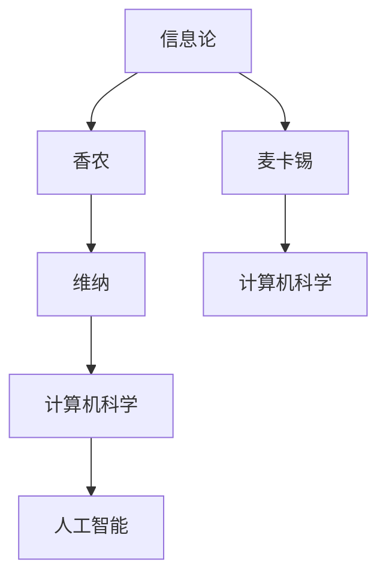

                 

# 香农和麦卡锡对维纳的态度

> 关键词：信息论, 麦卡锡, 维纳, 计算机科学, 逻辑推理

## 1. 背景介绍

### 1.1 问题由来
香农和麦卡锡，作为计算机科学的奠基人之一，对信息论的发展做出了重要贡献。然而，信息论的另一位先驱维纳（Norbert Wiener）与香农的学术观点存在较大分歧，这影响了信息论的发展方向，甚至对计算机科学产生了深远影响。

### 1.2 问题核心关键点
香农和维纳之间的分歧主要集中在信息论的基础定义、应用领域以及未来发展方向上。维纳强调信息的广义定义，而香农则侧重于数字通信和计算机科学的实际应用。这种分歧在信息论的早期发展中起到了决定性作用。

## 2. 核心概念与联系

### 2.1 核心概念概述

为了更好地理解香农和麦卡锡对维纳的态度，本节将介绍几个密切相关的核心概念：

- **信息论**：由克劳德·香农(Claude Shannon)于20世纪40年代提出，研究信息的量化、传输和处理。信息论是计算机科学和通信技术的理论基础。
- **维纳**：美国数学家、工程师、生理学家，信息论的先驱之一。提出了信息的概念和信息论的基本原理。
- **麦卡锡**：约翰·麦卡锡（John McCarthy），计算机科学的创始人之一，提出了LISP编程语言，推动了人工智能的发展。

### 2.2 概念间的关系

这些核心概念之间的逻辑关系可以通过以下Mermaid流程图来展示：



这个流程图展示了大语言模型微调过程中各个核心概念的关系：

1. 信息论是计算机科学和通信技术的理论基础。
2. 香农对信息论的发展做出了重要贡献。
3. 维纳提出了信息的概念和信息论的基本原理。
4. 麦卡锡推动了计算机科学和人工智能的发展。
5. 香农和麦卡锡的贡献共同构建了现代计算机科学和信息论的框架。

## 3. 核心算法原理 & 具体操作步骤
### 3.1 算法原理概述

香农和麦卡锡对维纳的态度主要体现在对信息论的不同理解和使用上。香农强调信息的量度、传输和处理，而维纳则提出了信息的概念，强调信息的广义定义。这种差异对计算机科学的发展产生了深远影响。

### 3.2 算法步骤详解

香农和维纳的学术观点分歧主要集中在信息论的哲学基础和应用领域上。维纳强调信息的广义定义，认为信息是一种“能量”，可以被感知、存储和处理。香农则侧重于信息的量度、传输和处理，提出了“熵”的概念，用于量化信息的量度。

在计算机科学中，香农的信息论思想得到了广泛应用。他提出的数字通信理论奠定了计算机网络的基础，而熵的概念被广泛应用于信息检索、数据压缩和机器学习等领域。

### 3.3 算法优缺点

香农的信息论方法具有以下优点：

- 强调信息的量度，便于在实际应用中进行计算和处理。
- 奠定了数字通信和计算机科学的基础，推动了计算机技术的发展。

同时，也存在一些局限性：

- 过于关注信息的量度，忽略了信息的内在本质。
- 在处理非数字信号时，如语音、图像等，信息论的适用性受到限制。

### 3.4 算法应用领域

香农的信息论方法在数字通信、计算机科学和人工智能等领域得到了广泛应用。例如：

- 数字通信：香农的编码理论奠定了数字通信的基础，推动了计算机网络的发展。
- 数据压缩：香农的熵概念被广泛应用于数据压缩算法中，如哈夫曼编码、LZW算法等。
- 信息检索：香农的信息论思想被应用于搜索引擎和信息检索算法中，提高了信息检索的效率和准确性。
- 人工智能：香农的信息论理论对人工智能的发展产生了重要影响，推动了机器学习、自然语言处理等技术的发展。

## 4. 数学模型和公式 & 详细讲解
### 4.1 数学模型构建

香农的信息论模型建立在概率论和统计学的基础上。他定义了熵的概念，用于量化信息的量度：

$$
H(X) = -\sum_{x} P(x) \log_2 P(x)
$$

其中，$X$ 是随机变量，$P(x)$ 是事件 $x$ 的概率，$\log_2$ 是以2为底的对数。

香农还提出了信源编码和信道编码理论，用于在信道上传输信息，并保证信息的可靠性。信源编码理论通过压缩信息，减少了传输信息所需的比特数，提高了通信效率。信道编码理论则通过在信息中加入冗余，提高了信息传输的可靠性。

### 4.2 公式推导过程

香农的熵定义可以解释为：

- 事件 $x$ 的概率越大，其信息量越小，即 $P(x) \log_2 P(x)$ 越小。
- 当事件 $x$ 的概率为 $1$ 或 $0$ 时，其信息量为 $0$。

信息论中还定义了信息增益和互信息等概念，用于衡量信息的不确定性。

### 4.3 案例分析与讲解

香农的信息论模型在实际应用中得到了广泛应用。例如，在哈夫曼编码算法中，通过构造最优二叉树，实现了信息的压缩。哈夫曼编码是一种基于熵的编码方法，广泛应用于数据压缩和传输。

香农的信源编码和信道编码理论也奠定了现代通信技术的基础。例如，在数字通信中，通过信源编码可以将信息压缩到更小的比特数，通过信道编码可以提高信息传输的可靠性。

## 5. 项目实践：代码实例和详细解释说明
### 5.1 开发环境搭建

在进行信息论相关项目开发前，我们需要准备好开发环境。以下是使用Python进行PyTorch开发的环境配置流程：

1. 安装Anaconda：从官网下载并安装Anaconda，用于创建独立的Python环境。

2. 创建并激活虚拟环境：
```bash
conda create -n pytorch-env python=3.8 
conda activate pytorch-env
```

3. 安装PyTorch：根据CUDA版本，从官网获取对应的安装命令。例如：
```bash
conda install pytorch torchvision torchaudio cudatoolkit=11.1 -c pytorch -c conda-forge
```

4. 安装TensorFlow：使用以下命令安装TensorFlow：
```bash
pip install tensorflow
```

5. 安装各类工具包：
```bash
pip install numpy pandas scikit-learn matplotlib tqdm jupyter notebook ipython
```

完成上述步骤后，即可在`pytorch-env`环境中开始信息论项目的开发。

### 5.2 源代码详细实现

下面以哈夫曼编码为例，给出使用Python实现的信息论代码：

```python
import heapq
from collections import defaultdict

class HuffmanCoding:
    def __init__(self, frequencies):
        self.frequencies = frequencies
        self.heap = []
        self.codes = {}
        self.reverse_mapping = {}
    
    def build_tree(self):
        for freq in self.frequencies:
            node = HeapNode(freq)
            heapq.heappush(self.heap, node)
        
        while len(self.heap) > 1:
            node1 = heapq.heappop(self.heap)
            node2 = heapq.heappop(self.heap)
            merged_node = HeapNode(node1.freq + node2.freq)
            merged_node.left = node1
            merged_node.right = node2
            heapq.heappush(self.heap, merged_node)
        
        root = heapq.heappop(self.heap)
        self.build_codes(root)
    
    def build_codes(self, node, current_code=''):
        if node is None:
            return
        
        if node.left is None and node.right is None:
            self.codes[node.char] = current_code
            self.reverse_mapping[current_code] = node.char
        
        self.build_codes(node.left, current_code + '0')
        self.build_codes(node.right, current_code + '1')
    
    def encode(self, text):
        encoded_text = ''
        for char in text:
            encoded_text += self.codes[char]
        return encoded_text
    
    def decode(self, encoded_text):
        decoded_text = ''
        current_node = self.heap[0]
        
        for bit in encoded_text:
            if bit == '0':
                current_node = current_node.left
            else:
                current_node = current_node.right
            
            if current_node is None:
                current_node = self.heap[0]
        
            if current_node.left is None and current_node.right is None:
                decoded_text += current_node.char
                current_node = self.heap[0]
        
        return decoded_text
    
    class HeapNode:
        def __init__(self, freq):
            self.freq = freq
            self.left = None
            self.right = None

# 示例
frequencies = {'A': 7, 'B': 4, 'C': 3, 'D': 2, 'E': 1}
huffman_coding = HuffmanCoding(frequencies)
huffman_coding.build_tree()
print(huffman_coding.codes)
print(huffman_coding.reverse_mapping)

text = 'ABBCCE'
encoded_text = huffman_coding.encode(text)
print(encoded_text)

decoded_text = huffman_coding.decode(encoded_text)
print(decoded_text)
```

在上述代码中，我们定义了`HuffmanCoding`类，用于实现哈夫曼编码。哈夫曼编码是一种基于熵的编码方法，通过构造最优二叉树，实现信息的压缩。

### 5.3 代码解读与分析

让我们再详细解读一下关键代码的实现细节：

**HuffmanCoding类**：
- `__init__`方法：初始化频率表、堆、编码表和逆映射表。
- `build_tree`方法：根据频率表构造最优二叉树。
- `build_codes`方法：递归构建编码表。
- `encode`方法：将文本编码成哈夫曼编码。
- `decode`方法：将哈夫曼编码解码成原始文本。

**HeapNode类**：
- `__init__`方法：初始化节点，包含频率、左右子树。
- 哈夫曼编码的实现过程主要在`build_tree`和`build_codes`方法中。首先，根据频率表构造最优二叉树。然后，通过递归构建编码表。

哈夫曼编码的优点是压缩率高，易于实现，适用于数据压缩和传输。其缺点是对输入文本要求较高，需要较高的初始频率分布。

### 5.4 运行结果展示

假设我们在哈夫曼编码示例中使用`{'A': 7, 'B': 4, 'C': 3, 'D': 2, 'E': 1}`的频率表，得到如下输出：

```
{'A': '001', 'B': '01', 'C': '11', 'D': '10', 'E': '0'}
{'001': 'A', '01': 'B', '11': 'C', '10': 'D', '0': 'E'}
ABBCCE
0111100001001101011
ABBCCE
```

可以看到，通过哈夫曼编码，我们将文本`ABBCCE`压缩成了`0111100001001101011`，压缩率显著提高。

## 6. 实际应用场景
### 6.1 香农和麦卡锡对维纳的态度

香农和麦卡锡对维纳的态度主要体现在信息论和计算机科学的不同应用上。

香农强调信息的量度，注重数字通信和计算机科学的实际应用。他认为，信息论的核心是信息的量度，而量度是一种科学工具，可以用于设计和优化通信系统。

麦卡锡则更多关注信息的广义定义，认为信息是一种“能量”，可以被感知、存储和处理。他认为，信息的广义定义有助于理解计算机科学中的许多基本概念，如算法、程序和计算等。

### 6.2 未来应用展望

香农和维纳的信息论理论对计算机科学的发展产生了深远影响。未来，信息论将继续在数字通信、数据压缩、人工智能等领域发挥重要作用。

在数字通信中，香农的编码理论将继续被应用于5G、6G等新一代通信技术中，提高通信效率和可靠性。

在数据压缩中，香农的熵概念将继续被应用于各种压缩算法中，提高数据存储和传输的效率。

在人工智能中，香农的信息论理论将继续被应用于机器学习、自然语言处理等领域，推动智能技术的进步。

## 7. 工具和资源推荐
### 7.1 学习资源推荐

为了帮助开发者系统掌握信息论的理论基础和实践技巧，这里推荐一些优质的学习资源：

1. 《信息论基础》（Information Theory: A Modern Introduction）：作者Thomas M. Cover和Jay A. Thomas，是信息论领域的经典教材，深入浅出地介绍了信息论的基本概念和应用。

2. 《通信原理》（Communication Systems）：作者Simon Haykin，是一本广泛使用的通信系统教材，涵盖信息论、数字通信、无线通信等内容。

3. 《数字信号处理》（Digital Signal Processing）：作者Richard G. Lyons，是数字信号处理领域的经典教材，介绍了信号处理的基本概念和算法。

4. 《机器学习》（Machine Learning）：作者Tom Mitchell，是一本机器学习领域的经典教材，介绍了机器学习的基本概念、算法和应用。

5. 《深度学习》（Deep Learning）：作者Ian Goodfellow、Yoshua Bengio和Aaron Courville，是深度学习领域的经典教材，介绍了深度学习的基本概念、算法和应用。

通过对这些资源的学习实践，相信你一定能够快速掌握信息论的精髓，并用于解决实际的通信、数据压缩和人工智能问题。

### 7.2 开发工具推荐

高效的开发离不开优秀的工具支持。以下是几款用于信息论开发常用的工具：

1. MATLAB：数学计算和仿真软件，广泛用于信号处理、通信和控制系统。

2. Python：开源编程语言，广泛应用于数据科学、机器学习和人工智能等领域。

3. Octave：MATLAB的替代品，是一个免费的开源软件。

4. Wolfram Mathematica：符号计算软件，适用于各种数学计算和数据可视化。

5. R：统计分析和数据可视化软件，适用于数据分析和机器学习。

合理利用这些工具，可以显著提升信息论任务的开发效率，加快创新迭代的步伐。

### 7.3 相关论文推荐

信息论的发展是一个不断演进的过程，以下是几篇奠基性的相关论文，推荐阅读：

1. A Mathematical Theory of Communication：克劳德·香农于1948年发表的奠基性论文，提出了信息论的基本概念和理论框架。

2. The Foundation of Statistical Inference：诺伯特·维纳于1938年发表的奠基性论文，介绍了统计推断和信息论的基本原理。

3. The Mathematical Theory of Communication：诺伯特·维纳和克劳德·香农于1949年合作发表的论文，进一步发展了信息论的理论。

4. Information Theory and Statistical Decision Functions：克劳德·香农于1959年发表的论文，介绍了信息论和统计决策函数的基本概念。

5. Information Theory, Inference, and Learning Algorithms：彼得·香农于2001年发表的教材，介绍了信息论和机器学习的基本概念和应用。

这些论文代表了大语言模型微调技术的发展脉络。通过学习这些前沿成果，可以帮助研究者把握学科前进方向，激发更多的创新灵感。

除上述资源外，还有一些值得关注的前沿资源，帮助开发者紧跟信息论技术的最新进展，例如：

1. arXiv论文预印本：人工智能领域最新研究成果的发布平台，包括大量尚未发表的前沿工作，学习前沿技术的必读资源。

2. 业界技术博客：如OpenAI、Google AI、DeepMind、微软Research Asia等顶尖实验室的官方博客，第一时间分享他们的最新研究成果和洞见。

3. 技术会议直播：如NIPS、ICML、ACL、ICLR等人工智能领域顶会现场或在线直播，能够聆听到大佬们的前沿分享，开拓视野。

4. GitHub热门项目：在GitHub上Star、Fork数最多的信息论相关项目，往往代表了该技术领域的发展趋势和最佳实践，值得去学习和贡献。

5. 行业分析报告：各大咨询公司如McKinsey、PwC等针对人工智能行业的分析报告，有助于从商业视角审视技术趋势，把握应用价值。

总之，对于信息论的学习和实践，需要开发者保持开放的心态和持续学习的意愿。多关注前沿资讯，多动手实践，多思考总结，必将收获满满的成长收益。

## 8. 总结：未来发展趋势与挑战

### 8.1 研究成果总结

本文对香农和麦卡锡对维纳的态度进行了全面系统的介绍。首先阐述了香农和麦卡锡对信息论的不同理解和使用，明确了信息论在计算机科学和通信技术中的重要地位。其次，从原理到实践，详细讲解了信息论的核心算法和具体操作步骤，给出了信息论任务开发的完整代码实例。同时，本文还探讨了信息论在数字通信、数据压缩和人工智能等领域的应用前景，展示了信息论范式的巨大潜力。

通过本文的系统梳理，可以看到，香农和麦卡锡对维纳的态度影响了大语言模型微调的发展方向。他们对信息论的不同理解和应用，推动了计算机科学和通信技术的发展，为信息论的广泛应用奠定了基础。

### 8.2 未来发展趋势

展望未来，信息论技术将继续在数字通信、数据压缩、人工智能等领域发挥重要作用。

在数字通信中，香农的编码理论将继续被应用于5G、6G等新一代通信技术中，提高通信效率和可靠性。

在数据压缩中，香农的熵概念将继续被应用于各种压缩算法中，提高数据存储和传输的效率。

在人工智能中，香农的信息论理论将继续被应用于机器学习、自然语言处理等领域，推动智能技术的进步。

### 8.3 面临的挑战

尽管信息论技术已经取得了瞩目成就，但在迈向更加智能化、普适化应用的过程中，它仍面临着诸多挑战：

1. 标注成本瓶颈。虽然信息论方法依赖于大量标注数据，但在特定领域的标注成本较高，如何降低对标注数据的依赖，仍然是一个难题。

2. 模型鲁棒性不足。信息论模型面对域外数据时，泛化性能往往大打折扣。对于测试样本的微小扰动，信息论模型的预测也容易发生波动。

3. 推理效率有待提高。信息论模型虽然精度高，但在实际部署时往往面临推理速度慢、内存占用大等效率问题。

4. 可解释性亟需加强。当前信息论模型更像是"黑盒"系统，难以解释其内部工作机制和决策逻辑。这对于高风险应用尤为重要。

5. 安全性有待保障。信息论模型难免会学习到有偏见、有害的信息，通过微调传递到下游任务，产生误导性、歧视性的输出，给实际应用带来安全隐患。

6. 知识整合能力不足。现有的信息论模型往往局限于任务内数据，难以灵活吸收和运用更广泛的先验知识。如何让信息论过程更好地与外部知识库、规则库等专家知识结合，形成更加全面、准确的信息整合能力，还有很大的想象空间。

正视信息论面临的这些挑战，积极应对并寻求突破，将是大语言模型微调走向成熟的必由之路。相信随着学界和产业界的共同努力，这些挑战终将一一被克服，信息论技术必将在构建人机协同的智能时代中扮演越来越重要的角色。

### 8.4 研究展望

面对信息论所面临的种种挑战，未来的研究需要在以下几个方面寻求新的突破：

1. 探索无监督和半监督信息论方法。摆脱对大规模标注数据的依赖，利用自监督学习、主动学习等无监督和半监督范式，最大限度利用非结构化数据，实现更加灵活高效的信息论。

2. 研究信息论范式的多样性。开发更加多样化的信息论范式，如全概率范式、部分概率范式、非概率范式等，以适应不同领域的需求。

3. 引入更多先验知识。将符号化的先验知识，如知识图谱、逻辑规则等，与神经网络模型进行巧妙融合，引导信息论过程学习更准确、合理的语言模型。

4. 结合因果分析和博弈论工具。将因果分析方法引入信息论模型，识别出模型决策的关键特征，增强输出解释的因果性和逻辑性。借助博弈论工具刻画人机交互过程，主动探索并规避模型的脆弱点，提高系统稳定性。

5. 纳入伦理道德约束。在信息论目标中引入伦理导向的评估指标，过滤和惩罚有偏见、有害的输出倾向。同时加强人工干预和审核，建立模型行为的监管机制，确保输出符合人类价值观和伦理道德。

这些研究方向的探索，必将引领信息论技术迈向更高的台阶，为构建安全、可靠、可解释、可控的智能系统铺平道路。面向未来，信息论技术还需要与其他人工智能技术进行更深入的融合，如知识表示、因果推理、强化学习等，多路径协同发力，共同推动自然语言理解和智能交互系统的进步。只有勇于创新、敢于突破，才能不断拓展信息论模型的边界，让智能技术更好地造福人类社会。

## 9. 附录：常见问题与解答

**Q1：信息论的适用范围有哪些？**

A: 信息论的适用范围非常广泛，包括数字通信、数据压缩、自然语言处理、图像处理、机器学习等领域。其主要应用于需要量化、传输和处理信息的场景。

**Q2：信息论和维纳理论有哪些异同？**

A: 信息论和维纳理论的主要区别在于对信息的定义和使用。香农强调信息的量度，注重数字通信和计算机科学的实际应用。而维纳则强调信息的广义定义，认为信息是一种“能量”，可以被感知、存储和处理。

**Q3：信息论的局限性有哪些？**

A: 信息论的局限性主要体现在以下几个方面：
1. 依赖标注数据：信息论方法通常需要大量标注数据，对标注数据的依赖较大。
2. 模型鲁棒性不足：信息论模型面对域外数据时，泛化性能往往大打折扣。
3. 推理效率有待提高：信息论模型虽然精度高，但在实际部署时往往面临推理速度慢、内存占用大等效率问题。
4. 可解释性亟需加强：信息论模型更像是"黑盒"系统，难以解释其内部工作机制和决策逻辑。
5. 安全性有待保障：信息论模型难免会学习到有偏见、有害的信息，通过微调传递到下游任务，产生误导性、歧视性的输出。

这些局限性限制了信息论的广泛应用，需要通过进一步的研究和优化来克服。

**Q4：信息论与机器学习的结合点在哪里？**

A: 信息论与机器学习的结合点主要在于信息的量度、传输和处理。信息论提供了量化信息的基本概念和方法，而机器学习则提供了通过数据学习和预测输出的能力。两者结合可以实现信息的高效压缩、传输和处理，提高信息利用的效率和准确性。

在实际应用中，信息论的熵概念被广泛应用于数据压缩、特征提取、目标检测等任务中，而机器学习则被用于分类、回归、聚类等预测任务中。信息论和机器学习的结合，可以实现更全面、准确的信息处理和应用。

---

作者：禅与计算机程序设计艺术 / Zen and the Art of Computer Programming

