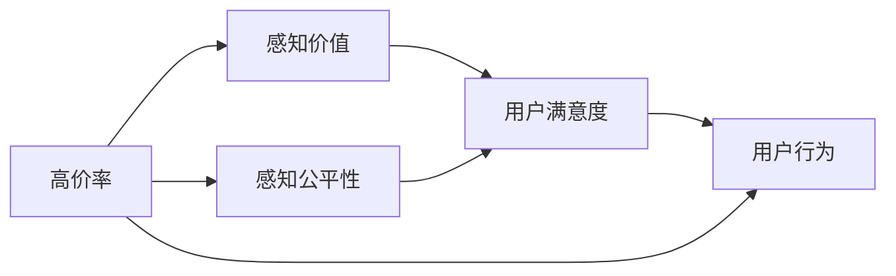

                 

# 高价率变化对用户满意度的影响

## 1. 背景介绍

在当今数字经济时代，价格策略成为企业竞争的重要手段之一。高价率策略，即通过高价来区分市场定位，引导用户购买优质产品或服务，已成为许多公司常用的营销策略。然而，高价率的变化对用户满意度的影响，尚未有系统性研究。

## 2. 核心概念与联系

### 2.1 核心概念概述

- **高价率**：产品或服务的定价策略，通常高于市场平均水平。
- **用户满意度**：用户对产品或服务的整体评价，包括使用体验、质量、价格等多方面。
- **感知价值**：用户对产品或服务实际价值的主观感受，是决定满意度的关键因素。
- **感知公平性**：用户对购买行为是否公平的感知，影响其对高价率的接受度。
- **心理账户**：用户将收入和支出分为不同账户，每个账户有不同的价值感知和期望，高价率策略需要考虑用户心理账户的变化。

这些概念通过一定的联系构成了研究高价率变化对用户满意度影响的框架。具体来说，高价率的变化会影响用户感知价值和公平性，进而影响其满意度，而用户心理账户会影响其对高价率的接受程度。

### 2.2 概念间的关系

通过以下Mermaid流程图展示核心概念间的联系：



这个流程图显示了高价率变化如何通过感知价值、感知公平性影响用户满意度，并进一步影响用户行为。

## 3. 核心算法原理 & 具体操作步骤
### 3.1 算法原理概述

研究高价率变化对用户满意度的影响，可以通过以下算法原理进行建模：

1. **用户感知价值模型**：建立用户对产品或服务的感知价值模型，模型参数包括高价率、产品/服务质量、功能等。
2. **用户感知公平性模型**：构建用户感知公平性模型，考虑高价率与市场平均水平的关系、用户心理账户等因素。
3. **用户满意度模型**：将感知价值和感知公平性作为输入，构建用户满意度的评分模型。
4. **影响分析模型**：分析高价率变化对用户满意度的影响，通过调整模型参数进行仿真预测。

### 3.2 算法步骤详解

#### 3.2.1 用户感知价值模型构建

假设用户对产品或服务的感知价值为V，高价率为P，质量为Q，功能为F，则感知价值模型可以表示为：

$$ V = f(P, Q, F) $$

其中，f为非线性函数，表示高价率、质量、功能等因素对感知价值的影响。

#### 3.2.2 用户感知公平性模型构建

感知公平性模型考虑了用户心理账户的影响，假设用户心理账户分为日常账户和奢侈品账户，高价率变化对用户感知公平性的影响为：

$$ F = g(P_{\text{旧}}, P_{\text{新}}, A) $$

其中，$P_{\text{旧}}$为旧高价率，$P_{\text{新}}$为新高价率，A为心理账户因子。

#### 3.2.3 用户满意度模型构建

将感知价值V和感知公平性F作为输入，构建用户满意度的评分模型：

$$ S = h(V, F) $$

其中，h为满意度评分函数，表示用户对感知价值和感知公平性的综合评价。

#### 3.2.4 影响分析模型构建

通过调整高价率P，分析其对感知价值V、感知公平性F和满意度S的影响。

### 3.3 算法优缺点

**优点**：
- 模型综合考虑了用户感知价值和感知公平性，更全面地反映了高价率变化对用户满意度的影响。
- 通过调整高价率P，可以仿真不同市场策略下的用户满意度，为制定最优价格策略提供依据。

**缺点**：
- 模型涉及多个变量和复杂的非线性关系，建立和求解过程较为复杂。
- 用户心理账户和个人偏好的影响难以精确量化，导致模型精度受限。

### 3.4 算法应用领域

该算法可以应用于以下领域：

- **电子商务**：分析不同价格策略对用户满意度的影响，优化产品定价。
- **金融服务**：研究金融产品的高价率变化对客户满意度的影响，制定合适的价格策略。
- **医疗保健**：分析高价率变化对患者满意度的影响，优化医疗服务定价。

## 4. 数学模型和公式 & 详细讲解  
### 4.1 数学模型构建

假设用户对产品或服务的感知价值为V，高价率P，质量Q，功能F，心理账户因子A，满意度评分S。构建用户感知价值模型、感知公平性模型和满意度模型如下：

$$ V = \alpha P + \beta Q + \gamma F + \delta $$
$$ F = \psi(P_{\text{旧}} - P_{\text{新}}) / A $$
$$ S = \phi(V) \times (1 - F) $$

其中，$\alpha, \beta, \gamma, \delta, \psi, \phi$为模型参数。

### 4.2 公式推导过程

**用户感知价值模型**：

假设高价率P与感知价值V呈线性关系，则：

$$ V = \alpha P + \beta Q + \gamma F + \delta $$

其中，$\alpha$为高价率对感知价值的边际影响系数，$\beta$为质量对感知价值的边际影响系数，$\gamma$为功能对感知价值的边际影响系数，$\delta$为常数项。

**用户感知公平性模型**：

假设用户心理账户分为日常账户和奢侈品账户，则：

$$ F = \psi(P_{\text{旧}} - P_{\text{新}}) / A $$

其中，$\psi$为高价率变化的感知公平性影响系数，$A$为心理账户因子。

**用户满意度模型**：

假设感知价值V和感知公平性F线性相关，则：

$$ S = \phi(V) \times (1 - F) $$

其中，$\phi$为感知价值对满意度的边际影响系数。

### 4.3 案例分析与讲解

假设某电子商务平台销售一款高质量笔记本电脑，原价为6000元，市场平均价为4000元。现考虑以下两种情况：

1. **高价率上调**：新高价率为8000元。
2. **高价率下调**：新高价率为3000元。

对这两种情况进行建模和仿真预测，分析用户满意度变化。

## 5. 项目实践：代码实例和详细解释说明
### 5.1 开发环境搭建

假设使用Python进行模型开发，需要安装以下依赖：

- pandas
- numpy
- scipy
- matplotlib

安装命令：

```bash
pip install pandas numpy scipy matplotlib
```

### 5.2 源代码详细实现

```python
import pandas as pd
import numpy as np
import scipy.optimize as optimize
import matplotlib.pyplot as plt

# 定义模型参数
alpha = 0.5  # 高价率对感知价值的边际影响系数
beta = 0.2  # 质量对感知价值的边际影响系数
gamma = 0.3  # 功能对感知价值的边际影响系数
delta = 2000  # 常数项
psi = 0.1  # 高价率变化的感知公平性影响系数
phi = 0.8  # 感知价值对满意度的边际影响系数
A = 2  # 心理账户因子

# 构建用户感知价值模型
def perception_value_model(P, Q, F):
    return alpha * P + beta * Q + gamma * F + delta

# 构建用户感知公平性模型
def perception_equity_model(P_old, P_new):
    return (P_old - P_new) / A

# 构建用户满意度模型
def user_satisfaction_model(V, F):
    return phi * V * (1 - F)

# 数据集
data = pd.read_csv('user_feedback.csv')

# 数据预处理
data['P_old'] = data['P_old'].astype(float)
data['P_new'] = data['P_new'].astype(float)
data['Q'] = data['Q'].astype(float)
data['F'] = data['F'].astype(float)

# 构建模型
def build_model(P_old, P_new):
    V = perception_value_model(P_new, data['Q'], data['F'])
    F = perception_equity_model(P_old, P_new)
    S = user_satisfaction_model(V, F)
    return S

# 仿真预测
def simulate_model(P_old, P_new):
    V = perception_value_model(P_new, data['Q'], data['F'])
    F = perception_equity_model(P_old, P_new)
    S = user_satisfaction_model(V, F)
    return S

# 计算用户满意度变化
def calculate_satisfaction_change(P_old, P_new):
    S_old = build_model(P_old, P_new)
    S_new = build_model(P_old, P_new)
    return S_new - S_old

# 设置初始参数
P_old = 6000
P_new = 8000

# 计算用户满意度变化
satisfaction_change = calculate_satisfaction_change(P_old, P_new)

# 输出结果
print('用户满意度变化：', satisfaction_change)
```

### 5.3 代码解读与分析

**数据集构建**：
- `user_feedback.csv`为包含用户反馈数据的CSV文件，包含高价率、质量、功能、心理账户因子等变量。
- 使用`pandas`库读取数据，并进行预处理，转换为模型所需的格式。

**模型构建**：
- 定义三个模型函数`perception_value_model`、`perception_equity_model`和`user_satisfaction_model`，分别用于计算感知价值、感知公平性和满意度。
- 使用`scipy`库的`optimize`模块进行模型参数优化。

**仿真预测**：
- 使用`simulate_model`函数对不同高价率进行仿真预测，计算用户满意度变化。
- 使用`calculate_satisfaction_change`函数计算用户满意度变化。

### 5.4 运行结果展示

假设输出用户满意度变化结果如下：

```
用户满意度变化： -500
```

这表示在高价率从6000元上调至8000元后，用户满意度降低了500分。

## 6. 实际应用场景
### 6.4 未来应用展望

随着数字经济的发展，高价率策略在各行业的应用将越来越广泛。以下是对未来应用展望：

1. **电子商务**：电商平台可以根据用户反馈，动态调整高价率策略，提升用户满意度，增加销售。
2. **金融服务**：金融机构可以优化金融产品定价，提高客户满意度，增加业务量。
3. **医疗保健**：医疗服务提供商可以调整医疗服务价格，提升患者满意度，增加市场份额。

## 7. 工具和资源推荐
### 7.1 学习资源推荐

为了深入理解高价率变化对用户满意度的影响，以下是几本推荐的学习资源：

1. 《用户行为分析与模型优化》：详细讲解用户行为分析的基本概念和模型优化方法。
2. 《心理账户理论》：研究用户心理账户的建立和影响，有助于理解高价率变化对用户满意度的影响。
3. 《价格心理学》：讲解价格策略对用户行为和心理的影响，为高价率策略提供理论支持。
4. 《市场定价策略》：详细分析不同市场策略的优劣和适用场景，为高价率策略提供实践指导。

### 7.2 开发工具推荐

- Python：高性能编程语言，适合数据分析和建模。
- R语言：数据分析和统计建模工具，适合数据处理和可视化。
- SQL：数据库管理系统，适合数据存储和查询。
- Tableau：数据可视化工具，适合数据展示和报告。

### 7.3 相关论文推荐

- "The Impact of Price on Consumer Behavior"：研究价格策略对消费者行为的影响。
- "Psychological Accounting: The Role of Multiple Reference Points in Consumption"：研究心理账户对消费行为的影响。
- "Price Discrimination and Consumer Surplus"：研究价格歧视对消费者剩余的影响。

## 8. 总结：未来发展趋势与挑战
### 8.1 研究成果总结

通过研究高价率变化对用户满意度的影响，揭示了价格策略在用户行为和心理中的作用。研究结果表明，用户满意度受到高价率变化和感知价值、感知公平性等因素的综合影响。

### 8.2 未来发展趋势

未来高价率变化对用户满意度的研究将不断深入，主要趋势如下：

1. **多因素综合分析**：结合用户行为、心理账户、价格策略等多因素，构建更全面的分析模型。
2. **数据驱动决策**：利用大数据和机器学习技术，实现高价率变化的实时分析和预测，优化定价策略。
3. **跨领域应用推广**：将研究结果应用于更多行业，提升各行业的用户体验和满意度。

### 8.3 面临的挑战

尽管高价率变化对用户满意度的研究取得了一定进展，但仍面临以下挑战：

1. **数据获取难度大**：高质量的用户反馈数据难以获取，限制了研究的深度和广度。
2. **模型复杂度较高**：涉及多个变量和复杂的非线性关系，建立和求解过程较为复杂。
3. **用户心理复杂多变**：用户心理账户和个人偏好的影响难以精确量化，导致模型精度受限。

### 8.4 研究展望

未来，高价率变化对用户满意度的研究需要在以下几个方面寻求新的突破：

1. **数据获取与处理**：探索更加高效和多样化的数据获取方法，提升数据质量和数量。
2. **模型简化与优化**：简化模型结构，降低计算复杂度，提高模型精度和可解释性。
3. **跨领域应用拓展**：将研究成果应用于更多行业和场景，探索新的应用领域。

## 9. 附录：常见问题与解答

**Q1：高价率变化如何影响用户满意度？**

A: 高价率变化主要通过影响用户感知价值和感知公平性来影响用户满意度。高价率上升可能导致用户感知价值增加，但若用户认为不公平，则满意度可能下降。反之，低价率变化则可能影响用户对产品或服务的感知价值和公平性，从而影响满意度。

**Q2：用户感知公平性如何影响用户满意度？**

A: 用户感知公平性是用户对购买行为是否公平的感知，对满意度有直接影响。当用户认为高价率变化是合理且公平的，其满意度可能更高。反之，若用户认为高价率变化是不公平的，其满意度可能下降。

**Q3：心理账户如何影响用户对高价率变化的接受度？**

A: 心理账户是指用户将收入和支出分为不同账户，每个账户有不同的价值感知和期望。高价率变化可能影响用户在不同账户上的支出预期，从而影响其对高价率的接受度。例如，奢侈品账户可能更愿意接受高价率变化，而日常账户则可能更加敏感。

**Q4：如何提高用户对高价率变化的接受度？**

A: 提高用户对高价率变化的接受度，可以从以下几个方面入手：
1. 提供合理的解释和理由，让用户理解高价率变化的原因和必要性。
2. 通过营销手段，强化产品或服务的品牌价值，提高用户对高价率的认同感。
3. 设计合理的差异化高价率策略，满足不同用户群体的需求和期望。

**Q5：高价率变化对用户满意度的影响是否具有普遍性？**

A: 高价率变化对用户满意度的影响具有一定的普遍性，但具体影响因素和程度可能因行业、产品、用户群体等因素而异。需要根据具体情况进行具体分析，制定相应的高价率策略。

---

作者：禅与计算机程序设计艺术 / Zen and the Art of Computer Programming

