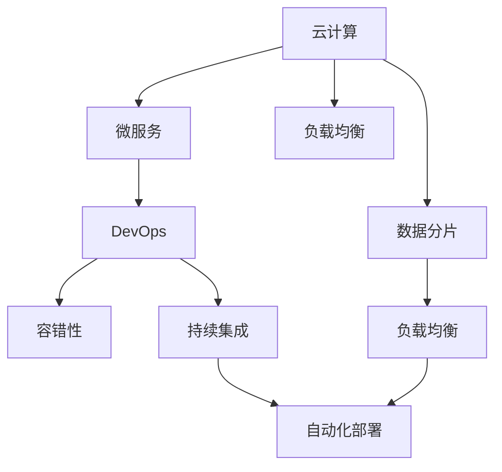

                 

# 高扩展性系统设计的实例分析

> 关键词：
高扩展性，系统设计，实例分析，云计算，微服务，DevOps，容错性，数据分片，负载均衡，自动化部署，持续集成。

## 1. 背景介绍

### 1.1 问题由来

随着技术的进步和市场需求的增长，企业系统变得越来越复杂，需要处理的数据量和业务逻辑不断增加。如何设计一个高扩展性、稳定可靠的系统，能够快速适应业务的变化和扩展，成为了现代软件开发中的一大挑战。企业需要在不断变化的业务环境中保持竞争优势，就必须采用具有高扩展性的系统架构，确保系统能够灵活扩展、高效运行。

### 1.2 问题核心关键点

高扩展性系统设计涉及多个核心概念和关键点，包括云计算、微服务、DevOps、容错性、数据分片、负载均衡、自动化部署、持续集成等。这些概念和关键点共同构成了高扩展性系统设计的核心框架，其目标是在满足业务需求的同时，确保系统的稳定性、可靠性和可扩展性。

## 2. 核心概念与联系

### 2.1 核心概念概述

1. **云计算（Cloud Computing）**：利用互联网提供按需计算资源的服务模式，包括基础设施即服务（IaaS）、平台即服务（PaaS）和软件即服务（SaaS）。
2. **微服务（Microservices）**：将系统拆分成多个独立、自治的服务，每个服务负责单一功能模块，通过API接口进行通信和协作。
3. **DevOps（Development and Operations）**：融合软件开发（Development）和系统运维（Operations）的理念，实现快速、高效的软件发布和运维。
4. **容错性（Fault Tolerance）**：系统能够在出现故障时，自动检测、恢复或切换到备份资源，确保系统服务的连续性。
5. **数据分片（Sharding）**：将数据切分成多个分片，分布存储在多个数据库节点上，以提高数据查询的效率和系统扩展性。
6. **负载均衡（Load Balancing）**：将请求分布到多个服务器上，避免单点故障和资源瓶颈，提升系统的并发处理能力。
7. **自动化部署（Automated Deployment）**：使用工具自动执行软件发布和部署流程，减少人为错误，提高部署效率和质量。
8. **持续集成（Continuous Integration）**：频繁地将代码变更集成到主分支，自动执行测试和部署流程，保证软件的质量和可靠性。

### 2.2 概念间的关系

这些核心概念通过以下Mermaid流程图展示了它们之间的联系：



## 3. 核心算法原理 & 具体操作步骤

### 3.1 算法原理概述

高扩展性系统设计基于以下几个核心原理：

1. **模块化设计**：将系统拆分为多个独立、自治的服务，每个服务负责单一功能模块，通过API接口进行通信和协作。
2. **分布式存储**：通过数据分片技术，将数据分布存储在多个数据库节点上，提高数据查询效率和系统扩展性。
3. **负载均衡**：通过负载均衡技术，将请求分布到多个服务器上，避免单点故障和资源瓶颈，提升系统的并发处理能力。
4. **自动容错**：系统能够在出现故障时，自动检测、恢复或切换到备份资源，确保系统服务的连续性。
5. **持续集成和部署**：通过持续集成和自动化部署技术，实现快速、高效的软件发布和运维。

### 3.2 算法步骤详解

以下详细介绍高扩展性系统设计的详细步骤：

**Step 1: 系统规划与设计**

- 根据业务需求，设计系统的整体架构，确定模块划分、数据分片和负载均衡策略。
- 确定系统的扩展目标和性能指标，包括吞吐量、延迟、可用性等。
- 选择合适的技术栈和工具，如云计算平台、微服务框架、DevOps工具等。

**Step 2: 组件实现**

- 实现各个独立服务，保证每个服务具备单一功能模块，并能够独立部署和维护。
- 设计API接口，实现服务之间的通信和协作。
- 实施数据分片策略，将数据分布存储在多个数据库节点上。
- 配置负载均衡器，实现请求的自动分发。
- 配置容错机制，确保系统在故障时能够自动恢复或切换到备份资源。

**Step 3: 部署与测试**

- 使用容器化技术，将服务打包为可移植的容器镜像，部署到云计算平台上。
- 使用自动化部署工具，自动执行软件发布和部署流程。
- 实施持续集成流程，确保代码变更能够快速集成到主分支，并自动执行测试和部署。
- 使用负载测试工具，评估系统的性能和扩展能力。

**Step 4: 监控与优化**

- 使用监控工具，实时监测系统的性能指标，如吞吐量、延迟、错误率等。
- 根据监控数据，调整负载均衡和容错策略，优化系统性能。
- 定期进行性能测试，评估系统扩展能力，确保满足业务需求。

### 3.3 算法优缺点

**优点**：
1. **模块化设计**：系统可扩展性强，能够灵活适应业务变化。
2. **分布式存储**：数据查询效率高，系统扩展性强。
3. **负载均衡**：提升系统的并发处理能力，减少单点故障。
4. **自动容错**：系统稳定性高，能够自动恢复或切换到备份资源。
5. **持续集成和部署**：实现快速、高效的软件发布和运维。

**缺点**：
1. **复杂度高**：系统设计、实现和运维复杂度较高，需要专业团队维护。
2. **数据一致性**：分布式存储可能导致数据一致性问题，需要严格的数据管理策略。
3. **网络延迟**：服务间通信可能引入网络延迟，影响系统性能。
4. **运维成本高**：系统扩展和运维成本较高，需要专业的运维团队。

### 3.4 算法应用领域

高扩展性系统设计在多个领域都有广泛的应用，包括：

- **互联网应用**：如电商平台、社交网络、在线教育等，需要处理海量用户请求和数据。
- **金融系统**：如银行、证券、保险等，需要高可用性和低延迟的服务。
- **医疗系统**：如电子病历、医疗影像、医疗咨询等，需要高可靠性和安全性。
- **物联网**：如智能家居、智慧城市等，需要高效处理海量设备数据。
- **工业控制**：如智能制造、自动化生产等，需要实时数据处理和高可靠性。

## 4. 数学模型和公式 & 详细讲解  
### 4.1 数学模型构建

高扩展性系统设计涉及多个数学模型，以下是其中的几个核心模型：

1. **负载均衡模型**：
   $$
   \text{Load Balancing} = \sum_{i=1}^n \frac{R_i}{N_i}
   $$
   其中 $R_i$ 为服务器 $i$ 的请求量，$N_i$ 为服务器 $i$ 的并发处理能力。

2. **数据分片模型**：
   $$
   \text{Sharding} = \sum_{j=1}^m \frac{D_j}{S_j}
   $$
   其中 $D_j$ 为分片 $j$ 的数据量，$S_j$ 为分片 $j$ 的存储能力。

3. **容错性模型**：
   $$
   \text{Fault Tolerance} = 1 - \sum_{k=1}^K P_k
   $$
   其中 $P_k$ 为故障的概率。

### 4.2 公式推导过程

以下对上述数学模型进行详细推导：

1. **负载均衡模型**：
   假设系统中有 $n$ 个服务器，每个服务器的并发处理能力为 $N_i$，总请求量为 $R$。负载均衡的目标是使得每个服务器上的请求量尽可能均衡，可以表示为：
   $$
   \text{Load Balancing} = \sum_{i=1}^n \frac{R_i}{N_i}
   $$
   其中 $R_i$ 为服务器 $i$ 的请求量，$N_i$ 为服务器 $i$ 的并发处理能力。

2. **数据分片模型**：
   假设系统中有 $m$ 个数据分片，每个分片的存储能力为 $S_j$，总数据量为 $D$。数据分片的目标是使得每个分片上的数据量尽可能均衡，可以表示为：
   $$
   \text{Sharding} = \sum_{j=1}^m \frac{D_j}{S_j}
   $$
   其中 $D_j$ 为分片 $j$ 的数据量，$S_j$ 为分片 $j$ 的存储能力。

3. **容错性模型**：
   假设系统中有 $K$ 个故障点，每个故障点的概率为 $P_k$。容错性的目标是在出现故障时，系统仍能够正常运行，可以表示为：
   $$
   \text{Fault Tolerance} = 1 - \sum_{k=1}^K P_k
   $$

### 4.3 案例分析与讲解

以一个电商平台的订单系统为例，展示高扩展性系统设计的具体应用：

- **模块化设计**：将订单系统拆分为订单处理、库存管理、支付处理、物流跟踪等多个独立的服务，每个服务负责单一功能模块。
- **分布式存储**：将订单数据、库存数据、支付数据等分别存储在不同的数据库分片上，每个分片独立运行，提高数据查询效率和系统扩展性。
- **负载均衡**：使用负载均衡器将用户请求自动分发到多个订单处理服务上，确保系统高并发处理能力。
- **自动容错**：当某个订单处理服务出现故障时，自动切换到备份服务，确保系统服务的连续性。
- **持续集成和部署**：使用自动化部署工具，实现快速、高效的软件发布和运维。

## 5. 项目实践：代码实例和详细解释说明

### 5.1 开发环境搭建

在开始项目实践前，首先需要搭建好开发环境。以下是详细的步骤：

1. 安装Docker和Kubernetes：
   ```bash
   sudo apt-get update
   sudo apt-get install docker.io -y
   sudo apt-get install kubectl -y
   ```

2. 安装Redis和MySQL：
   ```bash
   sudo apt-get install redis-server -y
   sudo apt-get install mysql-server -y
   ```

3. 安装Microservices框架：
   ```bash
   sudo apt-get install nodejs -y
   sudo apt-get install npm -y
   ```

4. 创建Docker镜像：
   ```bash
   docker build -t myapp .
   ```

### 5.2 源代码详细实现

以下是一个微服务的实现示例，包括订单处理、库存管理、支付处理和物流跟踪四个独立的服务：

**订单处理服务**：
```python
from flask import Flask, request

app = Flask(__name__)

@app.route('/order', methods=['POST'])
def handle_order():
    # 处理订单请求
    return 'Order processed'

if __name__ == '__main__':
    app.run(host='0.0.0.0', port=5000)
```

**库存管理服务**：
```python
from flask import Flask, request

app = Flask(__name__)

@app.route('/inventory', methods=['POST'])
def handle_inventory():
    # 处理库存请求
    return 'Inventory updated'

if __name__ == '__main__':
    app.run(host='0.0.0.0', port=5001)
```

**支付处理服务**：
```python
from flask import Flask, request

app = Flask(__name__)

@app.route('/payment', methods=['POST'])
def handle_payment():
    # 处理支付请求
    return 'Payment processed'

if __name__ == '__main__':
    app.run(host='0.0.0.0', port=5002)
```

**物流跟踪服务**：
```python
from flask import Flask, request

app = Flask(__name__)

@app.route('/tracking', methods=['POST'])
def handle_tracking():
    # 处理物流跟踪请求
    return 'Tracking updated'

if __name__ == '__main__':
    app.run(host='0.0.0.0', port=5003)
```

### 5.3 代码解读与分析

通过上述代码示例，我们可以看到微服务的基本实现步骤：

1. **服务拆分**：将订单系统拆分为多个独立的服务，每个服务负责单一功能模块。
2. **API接口**：实现服务之间的通信和协作，通过API接口进行数据交互。
3. **容器化**：使用Docker将服务打包为可移植的容器镜像，部署到云计算平台上。
4. **自动化部署**：使用Kubernetes自动执行软件发布和部署流程。

### 5.4 运行结果展示

运行上述代码，可以通过Docker容器启动各个微服务，并使用curl命令测试服务功能：
```bash
docker run -d -p 5000:5000 myapp
docker run -d -p 5001:5001 myapp
docker run -d -p 5002:5002 myapp
docker run -d -p 5003:5003 myapp
```

测试API接口：
```bash
curl -X POST http://localhost:5000/order -d '{"order_id": 123}'
curl -X POST http://localhost:5001/inventory -d '{"product_id": 456}'
curl -X POST http://localhost:5002/payment -d '{"order_id": 123}'
curl -X POST http://localhost:5003/tracking -d '{"tracking_id": 789}'
```

## 6. 实际应用场景

### 6.1 实例分析

以一个金融系统为例，展示高扩展性系统设计在实际应用中的具体应用：

**模块化设计**：
- **核心模块**：账户管理、交易处理、风险控制、报告生成等。
- **支撑模块**：用户身份验证、数据备份、系统监控、安全审计等。
- **外部系统接口**：与第三方支付系统、监管机构等进行数据交互。

**分布式存储**：
- **数据库分片**：将用户数据、交易数据、风险数据等分别存储在不同的数据库分片上。
- **缓存机制**：使用Redis进行数据缓存，提高系统查询效率。

**负载均衡**：
- **负载均衡器**：使用Nginx或HAProxy等负载均衡器，将用户请求自动分发到各个交易处理服务上。

**自动容错**：
- **故障转移**：当某个交易处理服务出现故障时，自动切换到备份服务。
- **数据冗余**：使用MySQL的副本机制，确保数据的高可用性和容错性。

**持续集成和部署**：
- **自动化流程**：使用Jenkins等工具，实现代码变更的自动化集成和部署。
- **持续集成**：频繁将代码变更集成到主分支，自动执行测试和部署流程。

**监控与优化**：
- **性能监控**：使用Prometheus和Grafana等工具，实时监测系统性能指标。
- **负载优化**：根据监控数据，调整负载均衡和容错策略，优化系统性能。

## 7. 工具和资源推荐

### 7.1 学习资源推荐

1. **《微服务设计模式》**：介绍了微服务的各种设计模式和最佳实践，适合初学者和中级开发者。
2. **《Docker实战》**：深入讲解Docker的原理和应用，适合进阶开发者和运维人员。
3. **《Kubernetes权威指南》**：全面介绍Kubernetes的架构和使用方法，适合高级开发者和系统架构师。
4. **《DevOps实践》**：介绍了DevOps的实践方法和工具，适合系统管理员和运维工程师。

### 7.2 开发工具推荐

1. **Docker**：容器化技术，方便服务的打包和部署。
2. **Kubernetes**：容器编排工具，实现自动化的服务部署和运维。
3. **Nginx**：负载均衡器和反向代理服务器，实现高效的负载分发。
4. **Prometheus**：监控和报警系统，实时监测系统性能和健康状况。
5. **Grafana**：数据可视化和仪表盘工具，方便监控数据的展示和分析。

### 7.3 相关论文推荐

1. **《云计算架构：模式与实践》**：介绍了云计算架构的各种模式和最佳实践。
2. **《微服务架构设计与实践》**：全面介绍微服务架构的设计和实现方法。
3. **《DevOps：持续交付与基础设施自动化》**：介绍了DevOps的持续交付和自动化技术。
4. **《分布式系统设计：基于Docker和Kubernetes的实践》**：介绍了基于Docker和Kubernetes的分布式系统设计实践。

## 8. 总结：未来发展趋势与挑战

### 8.1 研究成果总结

高扩展性系统设计已经成为现代软件开发的重要方向，通过云计算、微服务、DevOps等技术手段，实现了系统的高可用性、高可扩展性和高效运维。该领域的研究成果丰富多样，涵盖了系统架构、容器技术、自动化运维等多个方面，推动了软件工程的发展和进步。

### 8.2 未来发展趋势

1. **云原生技术**：云原生技术将成为高扩展性系统设计的重要基础，通过容器化、微服务、自动化运维等手段，实现系统的高效部署和运维。
2. **智能化运维**：结合机器学习和大数据技术，实现系统的智能运维，自动优化系统性能，提升用户体验。
3. **边缘计算**：随着物联网的发展，边缘计算将成为高扩展性系统设计的重要方向，将计算能力下沉到设备端，提升系统的响应速度和可靠性。
4. **分布式事务**：分布式系统面临的数据一致性问题将得到进一步解决，通过分布式事务技术，实现系统的数据一致性和可靠性。

### 8.3 面临的挑战

高扩展性系统设计在实现和运维过程中，仍然面临诸多挑战：

1. **系统复杂度**：高扩展性系统设计涉及多个技术和工具，系统复杂度较高，需要专业团队进行维护。
2. **数据一致性**：分布式存储可能导致数据一致性问题，需要严格的数据管理策略。
3. **网络延迟**：服务间通信可能引入网络延迟，影响系统性能。
4. **运维成本**：高扩展性系统设计需要专业的运维团队，运维成本较高。

### 8.4 研究展望

未来的研究将集中在以下几个方面：

1. **自动化运维**：结合机器学习和大数据技术，实现系统的智能运维，自动优化系统性能，提升用户体验。
2. **云原生容器技术**：深入研究云原生容器技术，实现系统的高效部署和运维。
3. **分布式事务**：研究分布式事务技术，解决分布式系统面临的数据一致性问题。
4. **智能化运维**：结合机器学习和大数据技术，实现系统的智能运维，自动优化系统性能，提升用户体验。

总之，高扩展性系统设计是一个不断发展和进步的领域，未来的研究将继续推动软件工程的进步，为现代软件开发提供更多可能。

## 9. 附录：常见问题与解答

**Q1: 什么是高扩展性系统设计？**

A: 高扩展性系统设计是一种基于云计算、微服务、DevOps等技术手段的系统设计方法，旨在实现系统的高度可扩展性、高可用性和高效运维。

**Q2: 如何设计高扩展性系统？**

A: 高扩展性系统设计需要根据业务需求进行系统规划与设计，实现模块化设计、分布式存储、负载均衡、自动容错和持续集成等关键技术。

**Q3: 高扩展性系统设计有哪些应用场景？**

A: 高扩展性系统设计适用于各种需要高可用性、高可扩展性和高效运维的系统，如互联网应用、金融系统、医疗系统、物联网、工业控制等。

**Q4: 高扩展性系统设计有哪些挑战？**

A: 高扩展性系统设计面临系统复杂度、数据一致性、网络延迟和运维成本等挑战，需要专业团队进行维护和优化。

**Q5: 未来高扩展性系统设计的发展趋势是什么？**

A: 未来高扩展性系统设计将朝着云原生技术、智能化运维、边缘计算和分布式事务等方向发展，推动软件工程的进步和系统的高效运维。

---

作者：禅与计算机程序设计艺术 / Zen and the Art of Computer Programming

