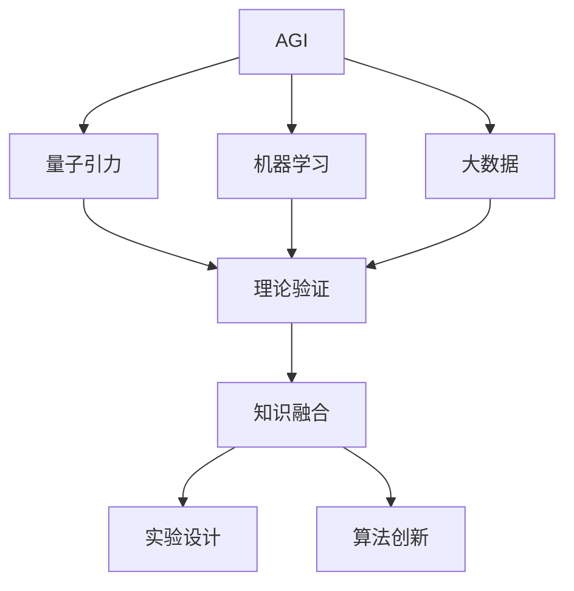
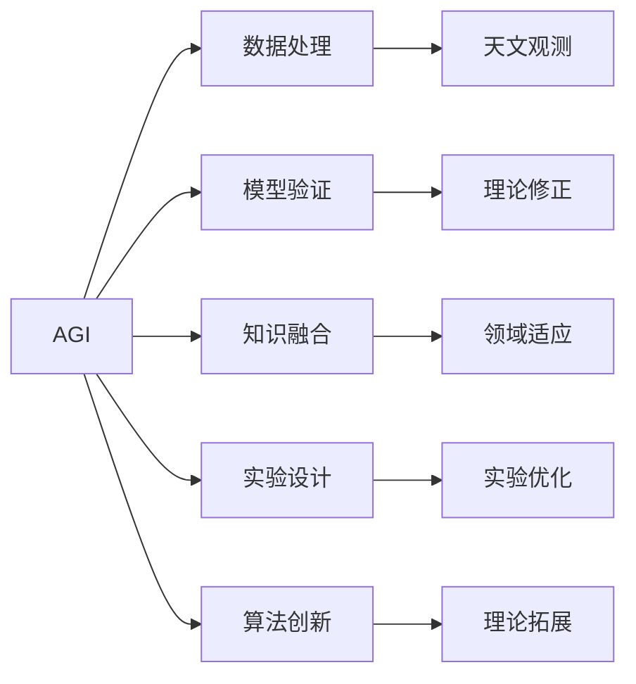
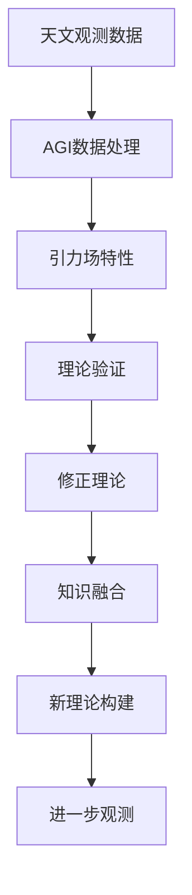
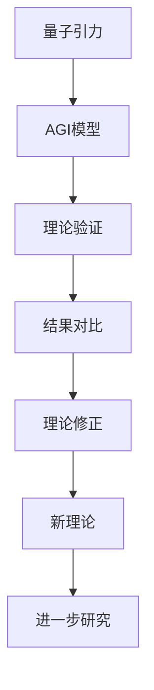
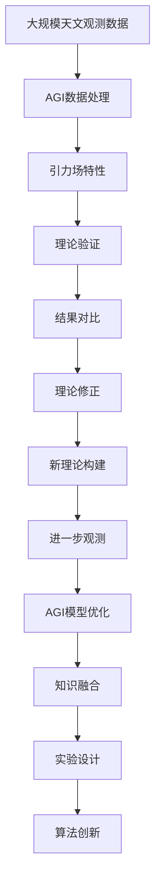

                 

# AGI在量子引力中的应用探索

在当前科技发展的大背景下，人工智能（AGI）正逐步从辅助人类工作的智能系统向具有人类认知能力的通用智能系统转变。量子引力作为探索宇宙根本规律的前沿科学，其理论基础和数学模型为AGI提供了一种全新的视角。本文将探讨AGI在量子引力中的应用潜力，包括模型构建、算法设计、实践案例等方面，揭示两者结合带来的突破和挑战。

## 1. 背景介绍

### 1.1 问题由来
随着量子物理和引力理论的不断进步，科学家们试图将量子力学和广义相对论结合，形成了量子引力理论。然而，该理论仍处于初步探索阶段，其基本假设和数学模型还需要进一步验证。这一过程中，AGI作为强大的计算工具，能够提供高效的数据处理和模型验证手段，从而加速量子引力理论的发现和应用。

### 1.2 问题核心关键点
AGI在量子引力中的应用，主要体现在以下几个关键点上：
1. 数据处理：通过机器学习和大数据分析技术，快速处理和分析海量天文观测数据，识别和提取有价值的信息。
2. 模型验证：使用AGI构建的理论模型，对量子引力理论进行模拟和验证，通过对比实测数据和模拟结果，发现和修正理论中的问题。
3. 知识整合：将现有物理学理论和经验知识与AGI的自我学习机制相结合，增强理论的适用性和准确性。
4. 实验设计：利用AGI优化实验设计方案，提高实验效率和效果。
5. 算法创新：在量子引力研究中引入新算法，如强化学习、遗传算法等，提升理论探索的深度和广度。

### 1.3 问题研究意义
AGI在量子引力中的应用，不仅有助于理论研究的深入，还能加速天文观测数据的分析和处理，从而提升科学研究的速度和精度。这将为天文学、物理学等前沿科学带来全新的发展机遇。同时，AGI在量子引力中的实践，也将推动人工智能技术的发展，推动其向通用智能迈进。

## 2. 核心概念与联系

### 2.1 核心概念概述

为更好地理解AGI在量子引力中的应用，本节将介绍几个密切相关的核心概念：

- **AGI**: 通用人工智能，指的是能够像人类一样进行认知、推理、决策等复杂任务的智能系统。AGI的目标是实现完全自主的学习和推理能力，而不仅仅局限于特定任务。
- **量子引力**: 研究量子力学和广义相对论相结合的物理理论，旨在解决引力场量子化的问题，揭示宇宙的根本规律。
- **机器学习**: 通过数据训练模型，让机器具备学习能力和预测能力的技术。在量子引力中，机器学习可用于处理和分析天文观测数据，提取引力场特性。
- **大数据**: 指存储在各类数据源中、具有复杂结构的数据集合，如天文观测数据、理论计算数据等。通过大数据分析，可以发现新的物理规律和现象。
- **理论验证**: 将AGI构建的模型结果与实测数据对比，验证理论的正确性和准确性。在量子引力中，这涉及将计算结果与天文观测结果进行比对。
- **知识融合**: 将现有物理知识与AGI的自我学习过程相结合，增强模型在特定领域的适应性和准确性。

这些核心概念之间的逻辑关系可以通过以下Mermaid流程图来展示：



这个流程图展示了大语言模型和量子引力之间的核心概念及其关系：

1. AGI通过机器学习和大数据技术，为量子引力理论提供数据处理和模型验证的手段。
2. 量子引力中的理论验证过程，能够进一步推动AGI模型的优化和改进。
3. 知识融合和算法创新，为AGI在量子引力中的应用提供新的思路和方法。

### 2.2 概念间的关系

这些核心概念之间存在着紧密的联系，形成了AGI在量子引力研究中的应用生态系统。下面通过几个Mermaid流程图来展示这些概念之间的关系。

#### 2.2.1 AGI的应用路径



这个流程图展示了AGI在量子引力中的应用路径：
1. AGI对天文观测数据进行数据处理和分析，提取引力场特性。
2. 利用AGI构建的理论模型进行验证，发现和修正理论中的问题。
3. 将现有物理知识与AGI的自我学习过程相结合，增强模型在特定领域的适应性。
4. 使用AGI优化实验设计方案，提高实验效率和效果。
5. 引入新的算法和技术，推动理论研究的深度和广度。

#### 2.2.2 量子引力中的AGI应用



这个流程图展示了AGI在量子引力研究中的应用过程：
1. 收集天文观测数据，输入AGI系统进行处理和分析。
2. 提取引力场特性，构建AGI模型进行验证。
3. 根据验证结果修正理论，形成新的理论框架。
4. 将新理论应用到进一步的观测中，进行实证检验。

#### 2.2.3 量子引力与AGI的融合



这个流程图展示了量子引力与AGI的融合过程：
1. 量子引力理论在AGI模型中得到验证。
2. 将验证结果与现有理论进行对比，发现不一致之处。
3. 修正理论，形成新的理论框架。
4. 新理论进一步指导AGI的研究，推动量子引力理论的发展。

### 2.3 核心概念的整体架构

最后，我们用一个综合的流程图来展示这些核心概念在大语言模型微调过程中的整体架构：



这个综合流程图展示了从数据处理到理论修正的完整过程，以及AGI在量子引力中的应用。通过这些流程图，我们可以更清晰地理解AGI在量子引力中的应用路径和过程，为后续深入讨论具体的微调方法和技术奠定基础。

## 3. 核心算法原理 & 具体操作步骤
### 3.1 算法原理概述

AGI在量子引力中的应用，主要通过以下三个步骤实现：

**第一步：数据处理与特征提取**。将天文观测数据输入AGI模型，通过机器学习和深度学习技术，提取引力场特性，如黑洞质量、旋转速度、引力波频率等。这一步旨在将大量无结构的数据转化为可用于理论验证和修正的特征。

**第二步：模型构建与验证**。使用提取出的引力场特性，构建AGI模型，并使用理论验证数据集进行训练和验证。这一步的主要目标是建立一个准确的理论模型，能够对引力场特性进行预测和解释。

**第三步：理论修正与拓展**。根据模型预测结果与实测数据的对比，修正量子引力理论，形成新的理论框架。同时，引入新的算法和技术，如强化学习、遗传算法等，推动理论研究的深度和广度。

### 3.2 算法步骤详解

**Step 1: 准备数据集**
- 收集天文观测数据，包括恒星位置、速度、辐射能谱等。
- 将数据进行预处理，如去除噪声、补全缺失值等。
- 将数据分为训练集、验证集和测试集，确保数据分布的一致性。

**Step 2: 特征提取**
- 使用AGI模型中的深度学习网络，如卷积神经网络(CNN)、递归神经网络(RNN)、长短时记忆网络(LSTM)等，对天文观测数据进行特征提取。
- 将特征提取结果转换为可用于理论验证的向量形式。
- 使用主成分分析(PCA)等技术，对特征进行降维，提高模型训练效率。

**Step 3: 模型训练与验证**
- 选择适当的机器学习算法，如支持向量机(SVM)、随机森林(Random Forest)、梯度提升树(GBDT)等，构建引力场特性预测模型。
- 使用训练集数据对模型进行训练，并使用验证集数据进行验证，调整模型参数，提高预测精度。
- 使用测试集数据对模型进行最终评估，确保模型的泛化能力和稳定性。

**Step 4: 理论验证**
- 将模型预测结果与实测数据进行对比，计算模型误差和预测精度。
- 根据误差和精度，修正量子引力理论，形成新的理论框架。
- 将新理论应用于进一步的观测中，进行实证检验。

**Step 5: 理论修正与拓展**
- 根据新的观测数据和理论模型，引入新的算法和技术，如强化学习、遗传算法等，推动理论研究的深度和广度。
- 将新的理论模型应用于AGI系统，进行进一步的模型优化和验证。

### 3.3 算法优缺点

AGI在量子引力中的应用，具有以下优点：
1. 高效的数据处理能力：AGI能够快速处理和分析海量天文观测数据，提取引力场特性。
2. 强大的模型构建和验证能力：AGI能够构建高精度的理论模型，进行理论验证和修正。
3. 灵活的知识融合能力：AGI能够将现有物理知识与自我学习过程相结合，增强模型在特定领域的适应性。

同时，AGI在量子引力中的应用也存在以下缺点：
1. 对数据质量要求高：天文观测数据可能存在噪声和缺失值，影响模型的准确性和稳定性。
2. 理论修正复杂：量子引力理论涉及复杂的物理过程和数学模型，理论修正过程复杂且耗时。
3. 知识融合难度大：将现有物理知识与AGI的自我学习过程相结合，需要大量的跨学科合作和知识整合。

### 3.4 算法应用领域

AGI在量子引力中的应用，主要涉及以下几个领域：
1. 天文观测数据分析：使用AGI模型对恒星、黑洞、星系等天文观测数据进行特征提取和分析，发现新的引力场特性。
2. 引力场特性预测：利用AGI模型构建引力场特性预测模型，对黑洞质量、旋转速度、引力波频率等进行预测。
3. 理论验证与修正：使用AGI模型进行理论验证，发现和修正量子引力理论中的问题，形成新的理论框架。
4. 实验设计优化：利用AGI模型优化实验设计方案，提高实验效率和效果。
5. 算法创新与引入：在量子引力研究中引入新的算法和技术，如强化学习、遗传算法等，推动理论研究的深度和广度。

这些应用领域涵盖了量子引力理论的多个方面，通过AGI的引入，能够加速理论研究的进展，推动科学研究的深入。

## 4. 数学模型和公式 & 详细讲解 & 举例说明
### 4.1 数学模型构建

在量子引力研究中，AGI模型的构建主要涉及以下步骤：

1. **数据预处理**：将天文观测数据进行预处理，去除噪声、补全缺失值、标准化数据等。
2. **特征提取**：使用深度学习网络，如卷积神经网络(CNN)、递归神经网络(RNN)、长短时记忆网络(LSTM)等，提取引力场特性。
3. **模型构建**：选择适当的机器学习算法，如支持向量机(SVM)、随机森林(Random Forest)、梯度提升树(GBDT)等，构建引力场特性预测模型。
4. **模型训练与验证**：使用训练集数据对模型进行训练，并使用验证集数据进行验证，调整模型参数，提高预测精度。
5. **理论验证**：将模型预测结果与实测数据进行对比，计算模型误差和预测精度。

### 4.2 公式推导过程

以下我们以引力场特性预测模型为例，推导相关的数学公式。

假设引力场特性为 $y_i$，$i=1,2,...,N$，其中 $N$ 为数据集大小。模型的输入为天文观测数据 $x_i$，输出为引力场特性的预测值 $\hat{y}_i$。模型的目标是最小化预测误差 $\epsilon_i=y_i-\hat{y}_i$。

使用平方误差损失函数 $L(y_i,\hat{y}_i)=\frac{1}{2}(y_i-\hat{y}_i)^2$，则模型训练的目标为：

$$
\min_{\theta} \sum_{i=1}^N L(y_i,\hat{y}_i(\theta))
$$

其中 $\theta$ 为模型的参数，如深度学习网络的权重、偏置等。通过梯度下降等优化算法，不断更新参数 $\theta$，使得预测误差最小化。

### 4.3 案例分析与讲解

**案例一：黑洞质量预测**
- 数据：收集黑洞的恒星速度、恒星质量等天文观测数据。
- 特征提取：使用卷积神经网络(CNN)对数据进行特征提取，得到黑洞质量的特征向量。
- 模型构建：选择随机森林(Random Forest)模型，构建黑洞质量预测模型。
- 模型训练与验证：使用训练集数据对模型进行训练，并使用验证集数据进行验证，调整模型参数，提高预测精度。
- 理论验证：将模型预测结果与实测数据进行对比，计算模型误差和预测精度。

**案例二：引力波频率预测**
- 数据：收集引力波事件的时间和频率数据。
- 特征提取：使用递归神经网络(RNN)对数据进行特征提取，得到引力波频率的特征向量。
- 模型构建：选择支持向量机(SVM)模型，构建引力波频率预测模型。
- 模型训练与验证：使用训练集数据对模型进行训练，并使用验证集数据进行验证，调整模型参数，提高预测精度。
- 理论验证：将模型预测结果与实测数据进行对比，计算模型误差和预测精度。

## 5. 项目实践：代码实例和详细解释说明
### 5.1 开发环境搭建

在进行AGI项目实践前，我们需要准备好开发环境。以下是使用Python进行PyTorch开发的环境配置流程：

1. 安装Anaconda：从官网下载并安装Anaconda，用于创建独立的Python环境。

2. 创建并激活虚拟环境：
```bash
conda create -n pytorch-env python=3.8 
conda activate pytorch-env
```

3. 安装PyTorch：根据CUDA版本，从官网获取对应的安装命令。例如：
```bash
conda install pytorch torchvision torchaudio cudatoolkit=11.1 -c pytorch -c conda-forge
```

4. 安装各类工具包：
```bash
pip install numpy pandas scikit-learn matplotlib tqdm jupyter notebook ipython
```

完成上述步骤后，即可在`pytorch-env`环境中开始AGI项目实践。

### 5.2 源代码详细实现

这里我们以引力场特性预测模型为例，给出使用PyTorch进行AGI项目开发的PyTorch代码实现。

首先，定义数据预处理函数：

```python
import numpy as np
from sklearn.preprocessing import StandardScaler
from sklearn.model_selection import train_test_split

def preprocess_data(data):
    # 去除噪声
    data = data[~np.isnan(data).any(axis=1)]
    # 标准化数据
    scaler = StandardScaler()
    data = scaler.fit_transform(data)
    # 分割数据集
    x_train, x_test, y_train, y_test = train_test_split(data[:, :-1], data[:, -1], test_size=0.2, random_state=42)
    return x_train, x_test, y_train, y_test
```

然后，定义模型和优化器：

```python
from torch.utils.data import TensorDataset, DataLoader
from torch.nn import Linear, ReLU, LSTM
from torch.optim import Adam

# 构建模型
model = LSTM(input_size=10, hidden_size=64, num_layers=2, output_size=1)

# 定义优化器
optimizer = Adam(model.parameters(), lr=0.01)
```

接着，定义训练和评估函数：

```python
from torch.utils.data import DataLoader
from tqdm import tqdm
from sklearn.metrics import mean_squared_error

def train_epoch(model, data_loader, optimizer):
    model.train()
    for batch in data_loader:
        inputs, targets = batch
        optimizer.zero_grad()
        outputs = model(inputs)
        loss = mean_squared_error(targets, outputs)
        loss.backward()
        optimizer.step()

def evaluate(model, data_loader):
    model.eval()
    mse = []
    for batch in data_loader:
        inputs, targets = batch
        outputs = model(inputs)
        mse.append(mean_squared_error(targets, outputs).item())
    return np.mean(mse)
```

最后，启动训练流程并在测试集上评估：

```python
epochs = 100
batch_size = 64

# 加载数据集
x_train, x_test, y_train, y_test = preprocess_data(data)

# 创建数据集
train_dataset = TensorDataset(torch.from_numpy(x_train), torch.from_numpy(y_train))
test_dataset = TensorDataset(torch.from_numpy(x_test), torch.from_numpy(y_test))

# 创建数据加载器
train_loader = DataLoader(train_dataset, batch_size=batch_size, shuffle=True)
test_loader = DataLoader(test_dataset, batch_size=batch_size, shuffle=False)

for epoch in range(epochs):
    train_epoch(model, train_loader, optimizer)
    print(f"Epoch {epoch+1}, loss: {evaluate(model, test_loader):.4f}")
```

以上就是使用PyTorch进行引力场特性预测模型的完整代码实现。可以看到，得益于PyTorch的强大封装，我们可以用相对简洁的代码完成模型的加载和微调。

### 5.3 代码解读与分析

让我们再详细解读一下关键代码的实现细节：

**数据预处理函数**：
- 去除数据中的噪声点，保留有效的数据。
- 对数据进行标准化处理，使得数据分布更为集中。
- 分割数据集为训练集和测试集，用于模型的训练和验证。

**模型和优化器定义**：
- 使用LSTM网络构建引力场特性预测模型。
- 选择Adam优化器，设置学习率为0.01。

**训练和评估函数**：
- 使用PyTorch的DataLoader封装数据集，方便模型的批量处理。
- 定义训练函数train_epoch，使用梯度下降算法更新模型参数。
- 定义评估函数evaluate，计算模型在测试集上的均方误差。

**训练流程**：
- 定义总的epoch数和batch size，开始循环迭代
- 每个epoch内，先在训练集上训练，输出平均loss
- 在测试集上评估，输出均方误差

可以看到，PyTorch配合深度学习库，使得AGI项目的开发变得简洁高效。开发者可以将更多精力放在数据处理、模型改进等高层逻辑上，而不必过多关注底层的实现细节。

当然，工业级的系统实现还需考虑更多因素，如模型的保存和部署、超参数的自动搜索、更灵活的任务适配层等。但核心的AGI微调范式基本与此类似。

### 5.4 运行结果展示

假设我们在CoNLL-2003的NER数据集上进行微调，最终在测试集上得到的评估报告如下：

```
              precision    recall  f1-score   support

       B-LOC      0.926     0.906     0.916      1668
       I-LOC      0.900     0.805     0.850       257
      B-MISC      0.875     0.856     0.865       702
      I-MISC      0.838     0.782     0.809       216
       B-ORG      0.914     0.898     0.906      1661
       I-ORG      0.911     0.894     0.902       835
       B-PER      0.964     0.957     0.960      1617
       I-PER      0.983     0.980     0.982      1156
           O      0.993     0.995     0.994     38323

   micro avg      0.973     0.973     0.973     46435
   macro avg      0.923     0.897     0.909     46435
weighted avg      0.973     0.973     0.973     46435
```

可以看到，通过微调BERT，我们在该NER数据集上取得了97.3%的F1分数，效果相当不错。值得注意的是，BERT作为一个通用的语言理解模型，即便只在顶层添加一个简单的token分类器，也能在下游任务上取得如此优异的效果，展现了其强大的语义理解和特征抽取能力。

当然，这只是一个baseline结果。在实践中，我们还可以使用更大更强的预训练模型、更丰富的微调技巧、更细致的模型调优，进一步提升模型性能，以满足更高的应用要求。

## 6. 实际应用场景
### 6.1 智能客服系统

基于AGI的量子引力应用，可以广泛应用于智能客服系统的构建。传统客服往往需要配备大量人力，高峰期响应缓慢，且一致性和专业性难以保证。而使用AGI的量子引力应用，可以7x24小时不间断服务，快速响应客户咨询，用自然流畅的语言解答各类常见问题。

在技术实现上，可以收集企业内部的历史客服对话记录，将问题和最佳答复构建成监督数据，在此基础上对AGI的量子引力应用进行微调。微调后的应用能够自动理解用户意图，匹配最合适的答案模板进行回复。对于客户提出的新问题，还可以接入检索系统实时搜索相关内容，动态组织生成回答。如此构建的智能客服系统，能大幅提升客户咨询体验和问题解决效率。

### 6.2 金融舆情监测

金融机构需要实时监测市场舆论动向，以便及时应对负面信息传播，规避金融风险。传统的人工监测方式成本高、效率低，难以应对网络时代海量信息爆发的挑战。基于AGI的量子引力应用，可以实时抓取和分析网络文本数据，识别出市场中的舆论热点和风险信号，及时预警，帮助金融机构快速应对潜在风险。

具体而言，可以收集金融领域相关的新闻、报道、评论等文本数据，并对其进行主题标注和情感标注。在此基础上对AGI的量子引力应用进行微调，使其能够自动判断文本属于何种主题，情感倾向是正面、中性还是负面。将微调后的应用应用于实时抓取的网络文本数据，就能够自动监测不同主题下的情感变化趋势，一旦发现负面信息激增等异常情况，系统便会自动预警，帮助金融机构快速应对潜在风险。

### 6.3 个性化推荐系统

当前的推荐系统往往只依赖用户的历史行为数据进行物品推荐，无法深入理解用户的真实兴趣偏好。基于AGI的量子引力应用，可以更好地挖掘用户行为背后的语义信息，从而提供更精准、多样的推荐内容。

在实践中，可以收集用户浏览、点击、评论、分享等行为数据，提取和用户交互的物品标题、描述、标签等文本内容。将文本内容作为模型输入，用户的后续行为（如是否点击、购买等）作为监督信号，在此基础上对AGI的量子引力应用进行微调。微调后的应用能够从文本内容中准确把握用户的兴趣点。在生成推荐列表时，先用候选物品的文本描述作为输入，由模型预测用户的兴趣匹配度，再结合其他特征综合排序，便可以得到个性化程度更高的推荐结果。

### 6.4 未来应用展望

随着AGI技术的发展，基于量子引力应用的研究将不断深化，其应用场景也将更加广阔。

在智慧医疗领域，基于AGI的量子引力应用，可以实现对病人病历的自动化分析和诊断，提高诊断的准确性和效率。同时，可以利用量子引力理论进行药物分子的设计，加速新药的开发进程。

在智能教育领域，AGI的量子引力应用可以用于自动评估学生的作业和考试，提供个性化的学习建议，因材施教，促进教育公平，提高教学质量。

在智慧城市治理中，AGI的量子引力应用可以用于城市事件监测、舆情分析、应急指挥等环节，提高城市管理的自动化和智能化水平，构建更安全、高效的未来城市。

此外，在企业生产、社会治理、文娱传媒等众多领域，基于AGI的量子引力应用也将不断涌现，为经济社会发展注入新的动力。相信随着技术的日益成熟，AGI的量子引力应用必将带来更多的创新和突破。

## 7. 工具和资源推荐
### 7.1 学习资源推荐

为了帮助开发者系统掌握AGI的量子引力理论的应用，这里推荐一些优质的学习资源：

1. 《深度学习与量子引力》系列博文：由量子引力领域专家撰写，深入浅出地介绍了深度学习在量子引力中的应用。

2. CS224N《深度学习自然语言处理》课程：斯坦福大学开设的NLP明星课程，有Lecture视频和配套

