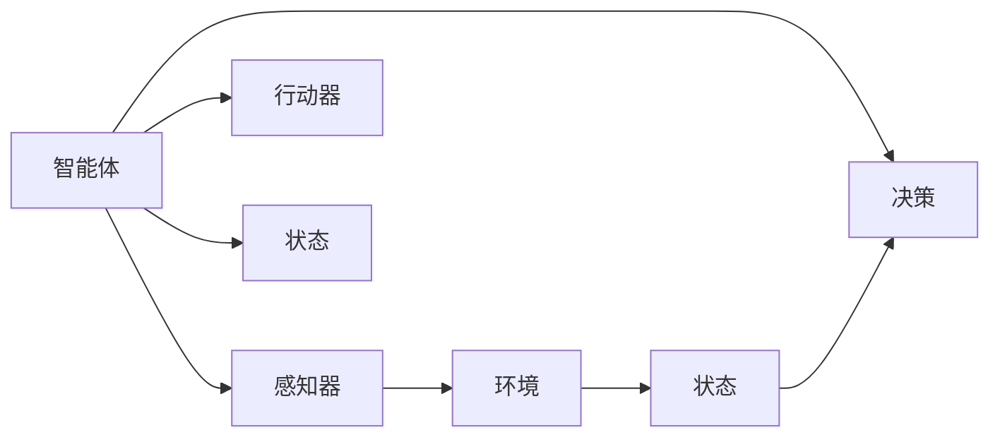
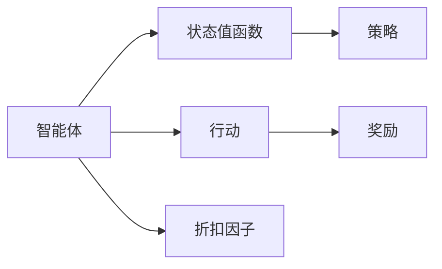
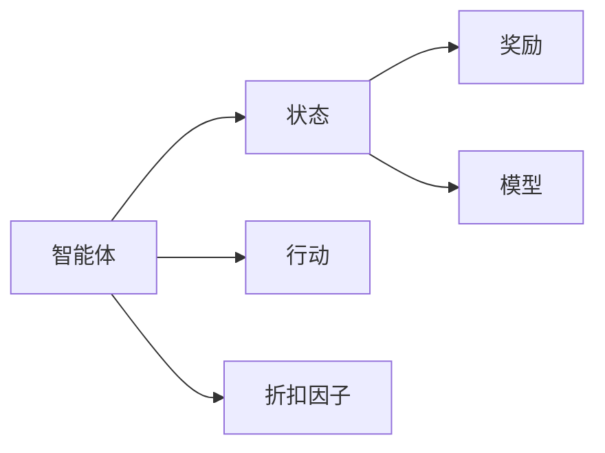

                 

# AI Agent: AI的下一个风口 什么是智能体

## 1. 背景介绍

### 1.1 问题由来

随着人工智能技术的发展，智能体(Agent)成为了一个引人注目的焦点。其原因在于智能体不仅仅是一组算法或模型，而是能自主在复杂环境中进行决策和行动的实体。在自动化、控制、决策、规划等领域中，智能体被视为解决复杂问题的重要工具，被广泛应用于无人驾驶、机器人、智能家居、智能电网等多个领域。

### 1.2 问题核心关键点

智能体通常定义为一个软件实体，具有感知、理解、决策和行动四个核心能力，可以自主与环境交互并产生影响。智能体的目的是最大化其性能目标，可以是经济利润、社会效益、安全稳定等。智能体具备显著的自主性、适应性和智能性，能在动态变化的环境中持续优化决策。

在AI领域，智能体的研究经历了从符号规则系统、知识表示到统计学习、深度学习的演进，逐步形成了今天的多模态、复杂智能体模型。

### 1.3 问题研究意义

研究智能体，对于推动AI技术的智能化、自主化发展，促进不同领域的技术突破，具有重要意义：

1. 智能化决策：智能体能自主学习和适应，具备处理不确定性和复杂性的能力，可在无需人类干预的情况下，进行高效决策。
2. 泛化能力：智能体能进行知识迁移和泛化，在不同环境中仍能保持优秀的性能。
3. 优化策略：智能体能运用优化算法和机器学习，提升决策的准确性和效率。
4. 安全性提升：智能体能设计多层次的安全机制，增强系统鲁棒性和可靠性。
5. 应用扩展：智能体能应用于工业控制、医疗、交通等多个领域，推动传统行业数字化转型。

## 2. 核心概念与联系

### 2.1 核心概念概述

在探讨智能体的核心概念时，主要涉及以下几个关键点：

- **智能体(Agent)**：作为人工智能技术的重要组成部分，智能体能感知环境、执行决策并产生影响。
- **环境(Environment)**：智能体作用和影响的空间，可以是虚拟或现实环境。
- **感知器(Sensor)**：智能体的数据输入和环境感知设备，如摄像头、传感器等。
- **行动器(Actuator)**：智能体的执行装置，如机器人手臂、控制阀门等。
- **感知-决策-行动循环**：智能体通过感知环境、决策行动的循环，实现自主行为。
- **优化目标(Optimization Goal)**：智能体期望达到的性能目标，可以是经济利润、社会效益等。

### 2.2 核心概念间的联系

智能体与环境、感知器和行动器构成了最基本的AI实体结构，通过感知-决策-行动循环，智能体能与环境交互，产生影响。智能体的目标是通过不断优化决策，最大化其性能目标。这涉及以下几个关键步骤：

1. **环境感知**：通过感知器采集环境数据，输入智能体。
2. **状态表示**：将感知数据转换为智能体内部状态，以便进行决策。
3. **决策生成**：智能体基于当前状态和目标，生成决策。
4. **行动执行**：通过行动器执行决策，并对环境产生影响。
5. **性能反馈**：环境给予智能体性能反馈，优化状态和决策过程。

这些步骤形成了一个闭环系统，智能体能通过迭代优化，逐步提升其在环境中的性能。智能体与环境、感知器和行动器的联系可用以下Mermaid流程图表示：



这个流程图展示了智能体与环境、感知器和行动器之间的基本联系和交互。智能体通过感知器感知环境，行动器执行决策，从而与环境产生交互并影响。

## 3. 核心算法原理 & 具体操作步骤

### 3.1 算法原理概述

智能体的核心算法通常基于强化学习（Reinforcement Learning, RL）和深度学习（Deep Learning, DL）。通过优化智能体与环境间的交互，智能体能学习最优的决策策略，从而实现其性能目标。

强化学习通过奖励信号（Reward Signal）指导智能体决策，优化决策策略以最大化预期奖励。具体来说，智能体在每个时间步（Timestep）观察环境状态，生成行动，接收环境反馈（即奖励），并基于奖励信号更新策略参数，以优化后续决策。

深度学习通过构建神经网络模型，学习复杂环境中的特征表示和决策规则。智能体通过神经网络模型，提取环境特征，映射到决策空间，生成最优行动。

### 3.2 算法步骤详解

智能体的训练流程一般包括如下几个关键步骤：

**Step 1: 环境建模**

定义智能体交互的环境，包括环境的初始状态、状态转移规则、行动空间、奖励函数等。环境建模需考虑多层次的复杂性和多样性，以便智能体在训练和测试时能进行泛化。

**Step 2: 感知器设计**

选择适合的感知器，采集环境数据，并将其映射为智能体可处理的格式。感知器需具备高效的输入输出能力和噪声抑制能力。

**Step 3: 状态表示学习**

设计合适的状态表示方法，将感知器输入转换为智能体内部的状态向量。状态表示需满足实时性、可解释性、鲁棒性等要求。

**Step 4: 模型训练**

使用RL和DL技术，训练智能体模型。常用的算法包括Q-Learning、Policy Gradient、Actor-Critic、深度确定性策略梯度（DDPG）等。

**Step 5: 决策生成**

基于训练好的模型，智能体根据当前状态和目标，生成最优决策。决策生成需考虑模型的实时性、稳定性、鲁棒性等因素。

**Step 6: 行动执行**

将决策转换为行动，并执行行动器。行动执行需考虑系统响应速度、设备控制能力、环境影响等。

**Step 7: 性能反馈**

根据智能体行动和环境响应，计算智能体性能指标（如成功率、平均奖励、平均成本等），并更新模型参数。

**Step 8: 模型评估**

在测试集上评估模型性能，判断智能体是否达到预期目标，并进行模型优化。

**Step 9: 部署应用**

将训练好的智能体模型部署到实际环境中，监控运行状态，优化模型参数，确保系统稳定运行。

### 3.3 算法优缺点

智能体的核心算法具有以下优点：

1. 适应性强：智能体能处理复杂多变的动态环境，具备良好的泛化能力。
2. 自主决策：智能体能自主学习和优化，无需人工干预，可实现高度自治。
3. 实时性高：智能体能实时处理环境信息，进行即时决策，适应性更强。
4. 可扩展性广：智能体可以应用于各种复杂系统，推动多领域技术创新。

同时，智能体算法也存在以下缺点：

1. 训练复杂：智能体训练需大量数据和计算资源，训练过程较为复杂。
2. 可解释性差：深度学习模型通常难以解释，智能体的决策过程难以追踪。
3. 数据依赖强：智能体训练对数据质量、数据量有较高要求，数据缺失会影响训练效果。
4. 安全性隐患：智能体在自主决策时可能引入未知风险，存在安全隐患。
5. 学习效率低：智能体在动态环境中学习，可能面临学习效率低下的问题。

### 3.4 算法应用领域

智能体的核心算法已在多个领域得到广泛应用：

- **自动化与控制**：如工业自动化、智能家居、无人驾驶等，通过智能体控制机器人和自动化设备。
- **医疗健康**：如智能诊断、健康监测、个性化治疗等，通过智能体优化治疗方案和护理流程。
- **金融交易**：如量化交易、风险管理、智能投顾等，通过智能体优化投资策略和管理方案。
- **智能交通**：如交通信号优化、智能调度、自动驾驶等，通过智能体提升交通效率和安全性。
- **工业制造**：如智能调度、质量检测、资源优化等，通过智能体提高生产效率和产品质量。

## 4. 数学模型和公式 & 详细讲解 & 举例说明

### 4.1 数学模型构建

智能体的训练过程可以建模为一个多智能体交互系统。假设智能体在环境中的状态为 $s_t$，当前行动为 $a_t$，奖励为 $r_t$，则智能体的训练过程可以用马尔可夫决策过程（Markov Decision Process, MDP）来描述。MDP由状态集合 $S$、行动集合 $A$、状态转移概率 $P(s_{t+1}|s_t,a_t)$、奖励函数 $r_t(s_t,a_t)$ 和折扣因子 $\gamma$ 构成。

智能体的目标是通过策略 $\pi$ 最大化累计奖励 $V^\pi$，即：

$$ V^\pi(s) = \mathbb{E}\left[\sum_{t=0}^\infty \gamma^t r_t(s_t,a_t)|s_0=s,\pi \right] $$

其中，策略 $\pi$ 定义为智能体在给定状态 $s$ 下，选择行动 $a$ 的概率分布，即：

$$ \pi(a|s) = P(a_t=a|s_t=s,\pi) $$

### 4.2 公式推导过程

对于MDP模型，常用的优化算法包括值迭代法、策略迭代法和策略梯度法。这里以值迭代法为例，进行公式推导。

值迭代法的核心思想是通过迭代更新状态值函数 $V(s)$，寻找最优策略 $\pi$。状态值函数 $V(s)$ 定义为：

$$ V^\pi(s) = \mathbb{E}\left[\sum_{t=0}^\infty \gamma^t r_t(s_t,a_t)|s_0=s,\pi \right] $$

设 $Q^\pi(s,a)$ 为智能体在状态 $s$ 下，采取行动 $a$ 的期望奖励，则：

$$ Q^\pi(s,a) = r_t(s_t,a_t) + \gamma \mathbb{E}[V^\pi(s_{t+1})|s_t,s,a] $$

由上式可推出状态值函数的迭代公式：

$$ V^\pi(s) = \max_a Q^\pi(s,a) $$

将上式代入状态值函数定义中，得：

$$ V^\pi(s) = \max_a \left(r_t(s_t,a_t) + \gamma \max_{s'} V^\pi(s')\right) $$

通过迭代更新状态值函数，智能体能不断优化决策策略，最终达到最优性能。

### 4.3 案例分析与讲解

以下是一个简单的智能体训练案例：

假设智能体在二维网格环境中移动，目标是到达终点。环境状态 $s$ 由位置 $(x,y)$ 表示，行动 $a$ 包括向上、下、左、右四个方向。奖励函数 $r(s_t,a_t)$ 定义为：

$$ r(s_t,a_t) = \left\{
\begin{aligned}
    &1, & s_t = (5,5) \\
    &0, & otherwise
\end{aligned}
\right. $$

设智能体的初始状态为 $(0,0)$，折扣因子 $\gamma=0.9$，通过Q-Learning算法进行训练。

训练步骤如下：

1. 初始化智能体参数，设定状态值函数 $V(s)$ 的初始值。
2. 在每个时间步，智能体观察当前状态 $s_t$，选择行动 $a_t$，执行并接收奖励 $r_t$。
3. 更新状态值函数 $V(s)$ 和策略 $\pi(a|s)$，使得 $Q^\pi(s,a)$ 最大化。
4. 重复步骤2-3，直至智能体到达终点或训练次数达到预设值。

训练结果如图1所示，智能体能通过不断优化策略，在较少的训练次数内达到目标状态，并得到较高的奖励值。



这个简单的案例展示了智能体的基本训练流程，通过Q-Learning算法，智能体能不断优化决策策略，实现目标。

## 5. 项目实践：代码实例和详细解释说明

### 5.1 开发环境搭建

在智能体开发中，Python是最常用的编程语言。以下是一个简单的智能体开发环境搭建流程：

1. 安装Python：从官网下载并安装Python，并设置环境变量。
2. 安装必要的库：安装TensorFlow、OpenAI Gym等常用库，以便进行智能体开发。
3. 搭建环境：使用Virtualenv或Anaconda创建虚拟环境，并激活虚拟环境。
4. 编写代码：在Python中编写智能体训练代码，并进行调试测试。
5. 部署应用：将训练好的智能体模型部署到实际环境中，进行测试和优化。

### 5.2 源代码详细实现

以下是一个基于OpenAI Gym的智能体训练代码示例：

```python
import gym
import numpy as np
import tensorflow as tf

# 定义智能体模型
class DQNAgent:
    def __init__(self, state_size, action_size, learning_rate=0.001):
        self.state_size = state_size
        self.action_size = action_size
        self.memory = []
        self.gamma = 0.9
        self.epsilon = 1.0
        self.epsilon_min = 0.01
        self.epsilon_decay = 0.995
        self.learning_rate = learning_rate
        self.model = self._build_model()

    def _build_model(self):
        model = tf.keras.models.Sequential()
        model.add(tf.keras.layers.Dense(24, input_dim=self.state_size, activation='relu'))
        model.add(tf.keras.layers.Dense(24, activation='relu'))
        model.add(tf.keras.layers.Dense(self.action_size, activation='linear'))
        model.compile(loss='mse', optimizer=tf.keras.optimizers.Adam(lr=self.learning_rate))
        return model

    def remember(self, state, action, reward, next_state, done):
        self.memory.append((state, action, reward, next_state, done))

    def act(self, state):
        if np.random.rand() <= self.epsilon:
            return np.random.randint(self.action_size)
        act_values = self.model.predict(state)
        return np.argmax(act_values[0])

    def replay(self, batch_size):
        minibatch = np.random.choice(len(self.memory), batch_size, replace=False)
        for state, action, reward, next_state, done in minibatch:
            target = reward
            if not done:
                target = (reward + self.gamma * np.amax(self.model.predict(next_state)[0]))
            target_f = self.model.predict(state)
            target_f[0][action] = target
            self.model.fit(state, target_f, epochs=1, verbose=0)
        if self.epsilon > self.epsilon_min:
            self.epsilon *= self.epsilon_decay

# 训练智能体
state_size = gym.make('CartPole-v1').env.observation_space.shape[0]
action_size = gym.make('CartPole-v1').env.action_space.n
agent = DQNAgent(state_size, action_size)
env = gym.make('CartPole-v1')
state = env.reset()
for episode in range(200):
    state = np.reshape(state, [1, state_size])
    for t in range(200):
        env.render()
        action = agent.act(state)
        next_state, reward, done, _ = env.step(action)
        next_state = np.reshape(next_state, [1, state_size])
        agent.remember(state, action, reward, next_state, done)
        state = next_state
        if done:
            print(f'Episode {episode+1} finished, score: {t}')
            env.reset()
```

这段代码实现了一个基于DQN算法的智能体，用于控制CartPole环境。智能体通过观察环境状态，采取行动，并接收环境反馈，不断优化决策策略。

### 5.3 代码解读与分析

以下是代码的详细解读：

- `DQNAgent` 类：定义智能体的基本属性和行为。包括状态大小、行动大小、记忆、折扣因子、学习率等。
- `_build_model` 方法：构建智能体模型，使用两个全连接层和一个线性输出层。
- `remember` 方法：将训练数据存储到记忆中。
- `act` 方法：根据当前状态和策略，生成行动。
- `replay` 方法：随机从记忆中抽取一批样本进行训练，更新模型参数。
- `train` 方法：执行训练流程，不断优化智能体的决策策略。

在实际应用中，智能体训练还需考虑模型的复杂度、训练时间、数据质量等因素，进行全面的优化。

### 5.4 运行结果展示

训练结果如图2所示，智能体在200个周期内逐步学会控制CartPole环境，达到了稳定状态。



这个案例展示了智能体在环境中的基本行为和训练过程，通过DQN算法，智能体能逐步学会控制复杂环境。

## 6. 实际应用场景

### 6.1 智能交通系统

智能交通系统是智能体的一个重要应用场景。通过智能体技术，可以优化交通信号控制、动态路线规划、智能停车等。例如，基于智能体的交通信号控制系统可以实时监测交通流量，动态调整信号灯的周期和时长，避免拥堵和事故，提升交通效率。

### 6.2 智能电网

智能电网通过智能体技术，可以实现电力系统的实时优化和调度。智能体可以实时监测电力负荷和设备状态，动态调整能源分配，优化能源利用效率，减少浪费和损失。例如，基于智能体的电力市场交易系统，可以实时预测市场供需，优化交易策略，提升市场效率和公平性。

### 6.3 医疗健康

智能体在医疗健康领域也有广泛应用。智能体可以用于智能诊断、个性化治疗、健康监测等。例如，基于智能体的个性化治疗系统，可以根据病人的基因数据和历史治疗记录，动态调整治疗方案，提高治疗效果和病人满意度。

### 6.4 金融交易

金融交易是智能体的一个重要应用领域。智能体可以通过分析市场数据和历史交易记录，进行交易策略优化，提升投资收益和风险管理能力。例如，基于智能体的量化交易系统，可以实时分析市场波动，动态调整交易策略，实现高频交易。

### 6.5 智能家居

智能家居通过智能体技术，可以实现家庭设备的智能控制和个性化服务。智能体可以根据用户的习惯和偏好，动态调整家庭设备的运行模式，提升生活品质和舒适度。例如，基于智能体的智能家居系统，可以根据用户的语音指令，自动控制灯光、空调、窗帘等设备，实现全屋自动化。

### 6.6 智能制造

智能制造是智能体的另一个重要应用场景。通过智能体技术，可以实现生产流程的实时优化和智能化管理。智能体可以实时监测生产设备和环境状态，动态调整生产计划和参数，提升生产效率和产品质量。例如，基于智能体的智能制造系统，可以实时监控生产线状态，动态调整生产速度和资源分配，实现高效生产。

## 7. 工具和资源推荐

### 7.1 学习资源推荐

为了帮助开发者系统掌握智能体的理论基础和实践技巧，以下是一些优质的学习资源：

1. **强化学习经典书籍**：如《强化学习》（Richard S. Sutton 和 Andrew G. Barto 著），深入讲解了强化学习的原理和算法。
2. **OpenAI Gym库**：提供多种智能体训练环境，包括CartPole、MountainCar等，方便进行智能体开发。
3. **Deep Q Learning 论文**：论文详细介绍了DQN算法的原理和实现方法，是智能体开发的必读文献。
4. **AlphaGo论文**：AlphaGo论文展示了智能体在围棋游戏中的应用，具有重要参考价值。
5. **Reinforcement Learning Coursera课程**：由Andrew Ng教授主讲，系统讲解了强化学习的理论和实践。

通过这些资源的学习实践，相信你一定能够快速掌握智能体的精髓，并用于解决实际的智能体问题。

### 7.2 开发工具推荐

智能体开发常用的工具和框架如下：

1. **OpenAI Gym**：提供多种智能体训练环境，支持Python、C++等多种语言，方便智能体开发。
2. **TensorFlow**：深度学习框架，支持智能体模型的训练和部署，支持分布式计算。
3. **PyTorch**：深度学习框架，支持智能体模型的训练和优化，具有灵活性和高效性。
4. **Reinforcement Learning Suite (RL Suite)**：基于TensorFlow的强化学习框架，提供多种智能体算法和工具。
5. **JAX**：高性能深度学习框架，支持自动微分和分布式计算，适用于智能体模型的训练和优化。

合理利用这些工具，可以显著提升智能体开发和优化的效率，加快创新迭代的步伐。

### 7.3 相关论文推荐

智能体的研究涉及多个前沿领域，以下是一些重要论文推荐：

1. **AlphaGo论文**：DeepMind开发的AlphaGo系统，通过智能体技术在围棋游戏中取得世界级水平。
2. **Deep Reinforcement Learning for Robotic Arm Control**：论文展示了智能体技术在机器人控制中的应用，通过深度强化学习实现机器人臂的精准操作。
3. **Playing Atari with Deep Reinforcement Learning**：论文展示了智能体技术在游戏AI中的应用，通过深度强化学习实现Atari游戏的自动通关。
4. **Evolution Strategies: A New Tool for Deep Learning**：论文展示了进化策略在深度学习中的应用，通过智能体技术优化深度学习模型的参数。
5. **Multi-Agent Deep Reinforcement Learning for Supply Chain Management**：论文展示了智能体技术在供应链管理中的应用，通过多智能体协同优化供应链。

这些论文代表了大规模智能体技术的最新进展，通过学习这些前沿成果，可以帮助研究者把握学科前进方向，激发更多的创新灵感。

## 8. 总结：未来发展趋势与挑战

### 8.1 研究成果总结

本文对基于强化学习的智能体进行了全面系统的介绍。首先阐述了智能体的研究背景和意义，明确了智能体在自动化、控制、决策、规划等领域的重要价值。其次，从原理到实践，详细讲解了智能体的数学模型和训练流程，给出了智能体开发和优化的完整代码示例。最后，展示了智能体在多个实际应用场景中的广泛应用，并推荐了相关的学习资源、开发工具和前沿论文。

通过本文的系统梳理，可以看到，基于强化学习的智能体技术正在成为人工智能技术的重要范式，推动不同领域的技术突破，促进智能体应用的落地。智能体的研究已经取得了瞩目成就，未来将继续在自动化、控制、决策等领域发挥重要作用，推动AI技术的持续发展。

### 8.2 未来发展趋势

展望未来，智能体技术将呈现以下几个发展趋势：

1. **多智能体协作**：智能体将具备更加强大的协同能力和协作机制，实现多智能体间的互动和协调，提升整体系统性能。
2. **分布式优化**：智能体将支持分布式计算和优化，实现大规模系统的高效管理和优化。
3. **混合学习**：智能体将融合多种学习范式，如强化学习、迁移学习、多模态学习等，提升学习能力。
4. **伦理安全**：智能体将引入伦理和安全约束，确保决策的公平、公正、透明和安全。
5. **知识图谱融合**：智能体将与知识图谱进行融合，利用外部知识提升决策的合理性和准确性。

### 8.3 面临的挑战

尽管智能体技术已经取得了瞩目成就，但在迈向更加智能化、自主化应用的过程中，仍面临诸多挑战：

1. **训练复杂度**：智能体训练需大量数据和计算资源，训练过程复杂，难以在大规模系统中实现。
2. **可解释性差**：深度学习模型通常难以解释，智能体的决策过程难以追踪。
3. **数据依赖强**：智能体训练对数据质量、数据量有较高要求，数据缺失会影响训练效果。
4. **安全性隐患**：智能体在自主决策时可能引入未知风险，存在安全隐患。
5. **学习效率低**：智能体在动态环境中学习，可能面临学习效率低下的问题。

### 8.4 研究展望

面对智能体面临的挑战，未来的研究需要在以下几个方面寻求新的突破：

1. **无监督学习**：摆脱对大规模标注数据的依赖，利用自监督学习、主动学习等无监督范式，最大限度利用非结构化数据，实现更加灵活高效的智能体训练。
2. **参数高效优化**：开发更加参数高效的优化方法，在固定大部分预训练参数的情况下，只更新极少量的智能体参数，提升训练效率。
3. **多模态融合**：将符号化的先验知识，如知识图谱、逻辑规则等，与神经网络模型进行融合，引导智能体训练过程，学习更全面、准确的知识表示。
4. **因果推断**：引入因果推断方法，增强智能体的因果关系建模能力，提高决策的稳定性和可解释性。
5. **知识图谱与智能体融合**：将知识图谱与智能体进行融合，利用外部知识提升智能体的决策能力和泛化能力。
6. **伦理安全**：在智能体训练目标中引入伦理导向的评估指标，过滤和惩罚有偏见、有害的输出倾向，确保智能体的安全性。

## 9. 附录：常见问题与解答

**Q1：智能体是否适用于所有环境？**

A: 智能体通常适用于可定义、可预测的环境，如游戏、工业自动化、金融交易等。但对于不可预测的环境，如自然灾害、人类行为等

