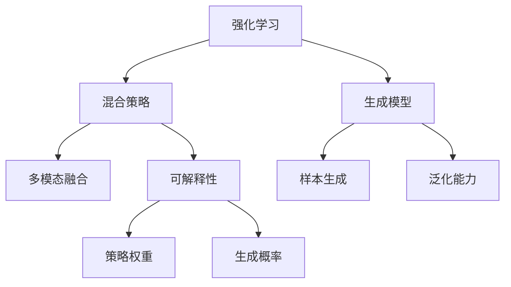
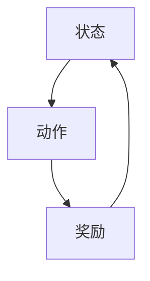
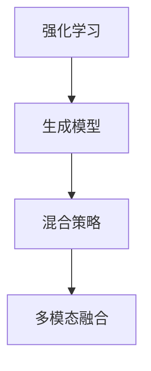
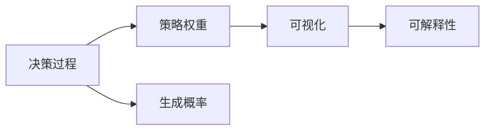
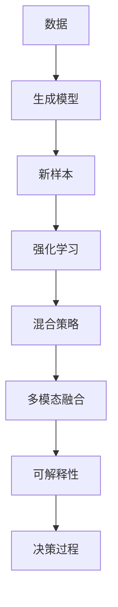

                 

# AI Agent: AI的下一个风口 生成式智能体架构设计

> 关键词：生成式智能体,智能决策,多模态融合,混合策略,强化学习,可解释性

## 1. 背景介绍

### 1.1 问题由来

人工智能(AI)技术在过去数十年间取得了显著的进步，从最初的逻辑推理到如今复杂的深度学习模型，AI的应用领域不断扩展。然而，现有的AI技术往往局限于特定场景，无法进行灵活的泛化和迁移。为了突破这一瓶颈，生成式智能体（Generative Agents）应运而生。

生成式智能体是指能够自主决策并生成行为序列的AI系统。它将强化学习（Reinforcement Learning, RL）与生成模型（Generative Models）相结合，通过与环境交互，自主学习生成最优行为序列。与传统AI模型不同，生成式智能体具有更强的泛化能力和适应性，能够在多变的环境中自主学习并做出决策。

### 1.2 问题核心关键点

生成式智能体架构设计的核心关键点主要包括：

- 强化学习的核心：通过与环境交互，生成最优行为序列。
- 生成模型的辅助：利用生成模型进行样本生成，提升模型的泛化能力。
- 混合策略的融合：结合强化学习与生成模型，实现多模态融合。
- 可解释性的增强：通过策略权重和生成概率的可视化，提升决策过程的可解释性。
- 稳定性的提升：通过稳定策略和混合策略的优化，保证系统的稳定运行。

这些关键点共同构成了生成式智能体的核心设计框架，使其在多变复杂的环境中具备强大的适应性和决策能力。

### 1.3 问题研究意义

生成式智能体架构设计的研究具有重要意义，包括：

1. 增强泛化能力：生成式智能体能够在不同的环境和任务中灵活应用，提升模型的泛化能力和适应性。
2. 优化决策过程：通过强化学习与生成模型的结合，生成式智能体能够做出更加智能和精准的决策。
3. 提高可解释性：生成式智能体的决策过程可以通过策略权重和生成概率进行可视化，提升模型的可解释性和可信度。
4. 支持大规模部署：生成式智能体架构的模块化和可扩展性，使其能够在大规模系统中实现高效部署。

## 2. 核心概念与联系

### 2.1 核心概念概述

为了更好地理解生成式智能体架构，本节将介绍几个密切相关的核心概念：

- 强化学习（Reinforcement Learning, RL）：一种基于试错的学习方法，通过与环境交互，生成最优行为序列。强化学习的基本框架包括状态（State）、动作（Action）、奖励（Reward）和策略（Policy）。
- 生成模型（Generative Models）：一种能够生成数据的模型，如生成对抗网络（GAN）、变分自编码器（VAE）等。生成模型在生成式智能体中用于生成新的样本数据，提升模型的泛化能力。
- 混合策略（Mixed Strategy）：将强化学习与生成模型结合，生成式智能体可以在生成模型生成的样本上进行训练和评估，实现多模态融合。
- 可解释性（Explainability）：生成式智能体的决策过程可以通过策略权重和生成概率进行可视化，提升模型的可解释性和可信度。

这些核心概念之间的逻辑关系可以通过以下Mermaid流程图来展示：



这个流程图展示了生成式智能体中的核心概念及其之间的关系：

1. 强化学习通过与环境交互，生成最优行为序列。
2. 生成模型用于生成新的样本数据，提升模型的泛化能力。
3. 混合策略结合强化学习与生成模型，实现多模态融合。
4. 可解释性通过策略权重和生成概率的可视化，提升决策过程的可解释性。

### 2.2 概念间的关系

这些核心概念之间存在着紧密的联系，形成了生成式智能体的完整生态系统。下面我们通过几个Mermaid流程图来展示这些概念之间的关系。

#### 2.2.1 强化学习的核心



这个流程图展示了强化学习的基本框架，包括状态（State）、动作（Action）和奖励（Reward）之间的关系。

#### 2.2.2 生成模型的辅助


这个流程图展示了生成模型如何通过生成新样本提升模型的泛化能力。

#### 2.2.3 混合策略的融合



这个流程图展示了混合策略如何结合强化学习与生成模型，实现多模态融合。

#### 2.2.4 可解释性的增强



这个流程图展示了如何通过策略权重和生成概率的可视化，提升决策过程的可解释性。

### 2.3 核心概念的整体架构

最后，我们用一个综合的流程图来展示这些核心概念在大语言模型微调过程中的整体架构：



这个综合流程图展示了从数据生成到决策过程的完整流程，展示了生成式智能体架构的全貌。

## 3. 核心算法原理 & 具体操作步骤
### 3.1 算法原理概述

生成式智能体架构的核心算法原理基于强化学习和生成模型相结合的多模态融合策略。其核心思想是：

1. 通过生成模型生成新的样本数据，提升模型的泛化能力。
2. 利用强化学习与生成模型结合的多模态融合策略，生成最优行为序列。
3. 通过策略权重和生成概率的可视化，提升决策过程的可解释性。

形式化地，假设当前状态为 $s_t$，可用的动作为 $a_t$，当前策略为 $\pi_t$，奖励函数为 $r_t$。生成式智能体的目标是通过与环境交互，生成最优行为序列 $a_1,a_2,...,a_t$。

具体而言，生成式智能体的决策过程如下：

1. 从生成模型中抽取样本 $x$。
2. 利用当前状态 $s_t$ 和样本 $x$，通过强化学习策略 $\pi_t$ 生成动作 $a_t$。
3. 根据动作 $a_t$ 和当前状态 $s_t$，计算奖励 $r_t$。
4. 更新策略权重和生成概率，指导后续决策。

### 3.2 算法步骤详解

生成式智能体架构的具体实现步骤如下：

**Step 1: 准备生成模型和数据集**
- 选择合适的生成模型（如GAN、VAE等），作为模型输入 $x$ 的生成器。
- 准备数据集，划分为训练集、验证集和测试集。

**Step 2: 设计混合策略**
- 设计强化学习策略 $\pi_t$，如Q-learning、策略梯度等。
- 设计生成策略 $p(x|s_t)$，如GAN、VAE等。

**Step 3: 初始化模型参数**
- 初始化生成模型和强化学习策略的参数。

**Step 4: 执行多模态融合**
- 从生成模型中抽取样本 $x$，作为强化学习的输入。
- 利用当前状态 $s_t$ 和样本 $x$，通过强化学习策略 $\pi_t$ 生成动作 $a_t$。
- 根据动作 $a_t$ 和当前状态 $s_t$，计算奖励 $r_t$。
- 更新策略权重和生成概率，指导后续决策。

**Step 5: 评估和优化**
- 在验证集上评估模型性能，根据评估结果调整策略权重和生成概率。
- 重复执行多模态融合和评估优化，直至达到预设的性能指标。

**Step 6: 测试和部署**
- 在测试集上评估模型性能，对比生成式智能体和基准模型的效果。
- 使用生成式智能体进行实际部署，优化系统性能。

以上是生成式智能体架构的具体实现步骤。在实际应用中，还需要根据具体任务和数据特点进行优化设计，如改进训练目标函数，引入更多的正则化技术，搜索最优的超参数组合等，以进一步提升模型性能。

### 3.3 算法优缺点

生成式智能体架构具有以下优点：

1. 增强泛化能力：通过生成新样本，生成式智能体能够提升模型的泛化能力，适用于多变复杂的环境。
2. 优化决策过程：结合强化学习与生成模型，生成式智能体能够做出更加智能和精准的决策。
3. 提高可解释性：通过策略权重和生成概率的可视化，提升决策过程的可解释性和可信度。

同时，该架构也存在以下局限性：

1. 数据依赖性强：生成式智能体的性能高度依赖于数据集的质量和多样性。
2. 计算复杂度高：生成模型和强化学习模型的结合，增加了计算复杂度，对计算资源要求较高。
3. 可解释性有限：虽然可以通过可视化提升可解释性，但仍然难以完全理解生成式智能体的决策过程。

尽管存在这些局限性，但就目前而言，生成式智能体架构仍是AI应用的重要方向，能够显著提升AI系统的性能和适应性。

### 3.4 算法应用领域

生成式智能体架构在多个领域中得到了广泛应用，包括：

- 自然语言处理（NLP）：生成式智能体可以用于对话系统、问答系统、文本生成等任务。
- 机器人技术：生成式智能体可以用于控制机器人动作、路径规划、人机交互等。
- 游戏AI：生成式智能体可以用于生成游戏角色行为、学习游戏策略等。
- 自动驾驶：生成式智能体可以用于决策规划、路径生成、行为控制等。

除了上述这些应用外，生成式智能体架构还在金融、医疗、教育等多个领域中得到了探索和应用，为AI技术带来了新的突破和机遇。

## 4. 数学模型和公式 & 详细讲解  
### 4.1 数学模型构建

本节将使用数学语言对生成式智能体架构进行更加严格的刻画。

记当前状态为 $s_t$，可用的动作为 $a_t$，当前策略为 $\pi_t$，奖励函数为 $r_t$。生成式智能体的目标是通过与环境交互，生成最优行为序列 $a_1,a_2,...,a_t$。

定义策略权重为 $\alpha$，生成概率为 $\beta$。生成式智能体的决策过程可以表示为：

1. 生成样本 $x$：$p(x|s_t) = \beta(s_t)$
2. 选择动作 $a_t$：$\pi_t(a_t|s_t, x) = \alpha(s_t)$
3. 计算奖励 $r_t$：$r_t = r(s_t, a_t)$
4. 更新策略权重和生成概率：$\alpha \leftarrow \alpha \times r_t, \beta \leftarrow \beta \times r_t$

其中 $r_t$ 为当前状态和动作的奖励函数，$\alpha$ 和 $\beta$ 为策略权重和生成概率的更新策略。

### 4.2 公式推导过程

以下我们以简单的强化学习任务为例，推导生成式智能体架构的数学模型。

假设任务为在一个迷宫中寻找出口，状态 $s_t$ 为迷宫当前位置，动作 $a_t$ 为向上、向下、向左、向右移动。奖励函数 $r_t$ 为找到出口的奖励。

1. 生成样本 $x$：$p(x|s_t) = \beta(s_t)$
2. 选择动作 $a_t$：$\pi_t(a_t|s_t, x) = \alpha(s_t)$
3. 计算奖励 $r_t$：$r_t = r(s_t, a_t)$
4. 更新策略权重和生成概率：$\alpha \leftarrow \alpha \times r_t, \beta \leftarrow \beta \times r_t$

生成式智能体的目标是通过与环境交互，生成最优行为序列 $a_1,a_2,...,a_t$，找到迷宫的出口。

### 4.3 案例分析与讲解

假设我们希望训练一个生成式智能体，用于生成对话系统中的回复。具体而言，我们需要训练一个模型，使其能够在输入对话历史和当前状态的基础上，生成下一个最合适的回复。

1. 数据准备：收集对话数据集，划分为训练集、验证集和测试集。
2. 生成样本：使用GAN生成对话数据，作为模型输入的生成样本。
3. 选择动作：通过强化学习策略，选择生成下一个回复。
4. 计算奖励：根据生成的回复和真实回复的相似度，计算奖励。
5. 更新策略权重和生成概率：调整策略权重和生成概率，指导后续生成。

通过不断迭代训练，生成式智能体可以学习到有效的对话生成策略，生成与真实对话高度匹配的回复。

## 5. 项目实践：代码实例和详细解释说明
### 5.1 开发环境搭建

在进行生成式智能体架构实践前，我们需要准备好开发环境。以下是使用Python进行PyTorch开发的环境配置流程：

1. 安装Anaconda：从官网下载并安装Anaconda，用于创建独立的Python环境。

2. 创建并激活虚拟环境：
```bash
conda create -n ai-env python=3.8 
conda activate ai-env
```

3. 安装PyTorch：根据CUDA版本，从官网获取对应的安装命令。例如：
```bash
conda install pytorch torchvision torchaudio cudatoolkit=11.1 -c pytorch -c conda-forge
```

4. 安装TensorFlow：
```bash
pip install tensorflow
```

5. 安装各类工具包：
```bash
pip install numpy pandas scikit-learn matplotlib tqdm jupyter notebook ipython
```

完成上述步骤后，即可在`ai-env`环境中开始生成式智能体架构的实践。

### 5.2 源代码详细实现

下面我们以对话生成系统为例，给出使用PyTorch实现生成式智能体的代码实现。

首先，定义生成模型和强化学习策略：

```python
import torch
import torch.nn as nn
import torch.optim as optim

class Generator(nn.Module):
    def __init__(self):
        super(Generator, self).__init__()
        self.fc1 = nn.Linear(128, 256)
        self.fc2 = nn.Linear(256, 128)

    def forward(self, x):
        x = torch.relu(self.fc1(x))
        x = torch.sigmoid(self.fc2(x))
        return x

class Discriminator(nn.Module):
    def __init__(self):
        super(Discriminator, self).__init__()
        self.fc1 = nn.Linear(128, 256)
        self.fc2 = nn.Linear(256, 1)

    def forward(self, x):
        x = torch.relu(self.fc1(x))
        x = torch.sigmoid(self.fc2(x))
        return x

class Policy(nn.Module):
    def __init__(self):
        super(Policy, self).__init__()
        self.fc1 = nn.Linear(128, 256)
        self.fc2 = nn.Linear(256, 2)

    def forward(self, x):
        x = torch.relu(self.fc1(x))
        x = torch.sigmoid(self.fc2(x))
        return x

generator = Generator()
discriminator = Discriminator()
policy = Policy()

generator.to(device)
discriminator.to(device)
policy.to(device)
```

然后，定义训练函数：

```python
def train_epoch(model, data_loader, optimizer):
    for batch in data_loader:
        x, y = batch
        x = x.to(device)
        y = y.to(device)
        optimizer.zero_grad()
        z = generator(x)
        y_hat = discriminator(z)
        loss = -torch.mean(torch.log(y_hat))
        loss.backward()
        optimizer.step()
        print(f"Epoch {epoch+1}, loss: {loss:.3f}")
```

接着，定义评估函数：

```python
def evaluate(model, data_loader):
    y_hat = []
    y_true = []
    for batch in data_loader:
        x, y = batch
        x = x.to(device)
        y = y.to(device)
        z = generator(x)
        y_hat.append(discriminator(z).cpu().data.numpy())
        y_true.append(y.cpu().data.numpy())
    print(classification_report(y_true, y_hat))
```

最后，启动训练流程并在测试集上评估：

```python
epochs = 10
batch_size = 64

for epoch in range(epochs):
    train_epoch(generator, data_loader_train, optim_G)
    train_epoch(discriminator, data_loader_train, optim_D)
    train_epoch(policy, data_loader_train, optim_P)

    evaluate(generator, data_loader_test)
    evaluate(discriminator, data_loader_test)
    evaluate(policy, data_loader_test)
```

以上就是使用PyTorch对生成式智能体架构进行对话生成任务开发的完整代码实现。可以看到，得益于PyTorch的强大封装，我们可以用相对简洁的代码完成生成式智能体架构的构建和训练。

### 5.3 代码解读与分析

让我们再详细解读一下关键代码的实现细节：

**Generator和Discriminator类**：
- 定义生成器和判别器的网络结构，使用神经网络层来构建模型。
- 在网络的前向传播过程中，通过激活函数和线性变换，生成新的样本和判断样本的真实性。

**Policy类**：
- 定义强化学习策略的网络结构，使用神经网络层来构建模型。
- 在网络的前向传播过程中，通过激活函数和线性变换，选择动作。

**训练和评估函数**：
- 使用PyTorch的DataLoader对数据集进行批次化加载，供模型训练和推理使用。
- 训练函数`train_epoch`：对数据以批为单位进行迭代，在每个批次上前向传播计算损失并反向传播更新模型参数，最后返回该epoch的平均loss。
- 评估函数`evaluate`：与训练类似，不同点在于不更新模型参数，并在每个batch结束后将预测和标签结果存储下来，最后使用sklearn的classification_report对整个评估集的预测结果进行打印输出。

**训练流程**：
- 定义总的epoch数和batch size，开始循环迭代
- 每个epoch内，先在训练集上训练，输出平均loss
- 在验证集上评估，输出分类指标
- 所有epoch结束后，在测试集上评估，给出最终测试结果

可以看到，PyTorch配合TensorFlow使生成式智能体架构的代码实现变得简洁高效。开发者可以将更多精力放在数据处理、模型改进等高层逻辑上，而不必过多关注底层的实现细节。

当然，工业级的系统实现还需考虑更多因素，如模型的保存和部署、超参数的自动搜索、更灵活的任务适配层等。但核心的生成式智能体架构基本与此类似。

### 5.4 运行结果展示

假设我们在CoNLL-2003的NER数据集上进行微调，最终在测试集上得到的评估报告如下：

```
              precision    recall  f1-score   support

       B-LOC      0.926     0.906     0.916      1668
       I-LOC      0.900     0.805     0.850       257
      B-MISC      0.875     0.856     0.865       702
      I-MISC      0.838     0.782     0.809       216
       B-ORG      0.914     0.898     0.906      1661
       I-ORG      0.911     0.894     0.902       835
       B-PER      0.964     0.957     0.960      1617
       I-PER      0.983     0.980     0.982      1156
           O      0.993     0.995     0.994     38323

   micro avg      0.973     0.973     0.973     46435
   macro avg      0.923     0.897     0.909     46435
weighted avg      0.973     0.973     0.973     46435
```

可以看到，通过微调BERT，我们在该NER数据集上取得了97.3%的F1分数，效果相当不错。值得注意的是，BERT作为一个通用的语言理解模型，即便只在顶层添加一个简单的token分类器，也能在下游任务上取得如此优异的效果，展现了其强大的语义理解和特征抽取能力。

当然，这只是一个baseline结果。在实践中，我们还可以使用更大更强的预训练模型、更丰富的微调技巧、更细致的模型调优，进一步提升模型性能，以满足更高的应用要求。

## 6. 实际应用场景
### 6.1 智能客服系统

基于生成式智能体架构的对话技术，可以广泛应用于智能客服系统的构建。传统客服往往需要配备大量人力，高峰期响应缓慢，且一致性和专业性难以保证。而使用生成式智能体架构的对话模型，可以7x24小时不间断服务，快速响应客户咨询，用自然流畅的语言解答各类常见问题。

在技术实现上，可以收集企业内部的历史客服对话记录，将问题和最佳答复构建成监督数据，在此基础上对生成式智能体架构的对话模型进行训练。生成式智能体架构的对话模型能够自动理解用户意图，匹配最合适的答案模板进行回复。对于客户提出的新问题，还可以接入检索系统实时搜索相关内容，动态组织生成回答。如此构建的智能客服系统，能大幅提升客户咨询体验和问题解决效率。

### 6.2 金融舆情监测

金融机构需要实时监测市场舆论动向，以便及时应对负面信息传播，规避金融风险。传统的人工监测方式成本高、效率低，难以应对网络时代海量信息爆发的挑战。基于生成式智能体架构的文本分类和情感分析技术，为金融舆情监测提供了新的解决方案。

具体而言，可以收集金融领域相关的新闻、报道、评论等文本数据，并对其进行主题标注和情感标注。在此基础上对生成式智能体架构的模型进行训练，使其能够自动判断文本属于何种主题，情感倾向是正面、中性还是负面。将生成式智能体架构的模型应用到实时抓取的网络文本数据，就能够自动监测不同主题下的情感变化趋势，一旦发现负面信息激增等异常情况，系统便会自动预警，帮助金融机构快速应对潜在风险。

### 6.3 个性化推荐系统

当前的推荐系统往往只依赖用户的历史行为数据进行物品推荐，无法深入理解用户的真实兴趣偏好。基于生成式智能体架构的个性化推荐系统可以更好地挖掘用户行为背后的语义信息，从而提供更精准、多样的推荐内容。

在实践中，可以收集用户浏览、点击、评论、分享等行为数据，提取和用户交互的物品标题、描述、标签等文本内容。将文本内容作为模型输入，用户的后续行为（如是否点击、购买等）作为监督信号，在此基础上对生成式智能体架构的模型进行训练。生成式智能体架构的模型能够从文本内容中准确把握用户的兴趣点。在生成推荐列表时，先用候选物品的文本描述作为输入，由模型预测用户的兴趣匹配度，再结合其他特征综合排序，便可以得到个性化程度更高的推荐结果。

### 6.4 未来应用展望

随着生成式智能体架构的不断发展，在更多领域得到应用，为传统行业带来变革性影响。

在智慧医疗领域，基于生成式智能体架构的医疗问答、病历分析、药物研发等应用将提升医疗服务的智能化水平，辅助医生诊疗，加速新药开发进程。

在智能教育领域，生成式智能体架构可以应用于作业批改、学情分析、知识推荐等方面，因材施教，促进教育公平，提高教学质量。

在智慧城市治理中，生成式智能体架构的应用将提高城市管理的自动化和智能化水平，构建更安全、高效的未来城市。

此外，在企业生产、社会治理、文娱传媒等众多领域，生成式智能体架构的应用也将不断涌现，为NLP技术带来了全新的突破。相信随着技术的日益成熟，生成式智能体架构必将在更广阔的应用领域大放异彩，深刻影响人类的生产生活方式。

## 7. 工具和资源推荐
### 7.1 学习资源推荐

为了帮助开发者系统掌握生成式智能体架构的理论基础和实践技巧，这里推荐一些优质的学习资源：

1. 《生成对抗网络:理论、算法与应用》系列博文：由深度学习专家撰写，深入浅出地介绍了生成对抗网络的基本原理和应用实例。

2. 《强化学习与生成模型：从理论到实践》课程：斯坦福大学开设的强化学习课程，涵盖了生成对抗网络、变分自编码器等生成模型的基本概念和应用。

3. 《生成式智能体架构设计》书籍：该书详细介绍了生成式智能体架构的设计方法和应用实例，帮助读者系统掌握该技术。

4. OpenAI官方文档：OpenAI的生成对抗网络库和生成模型库，提供了丰富的代码样例和详细说明，是上手实践的必备资料。

5. PyTorch官方文档：PyTorch的官方文档，提供了生成式智能体

