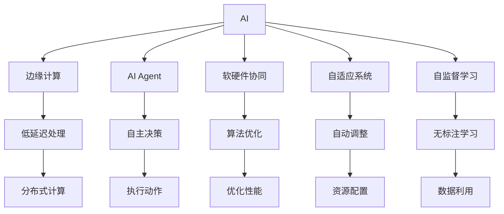
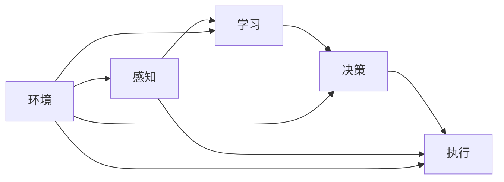
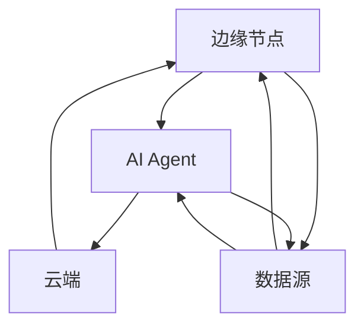
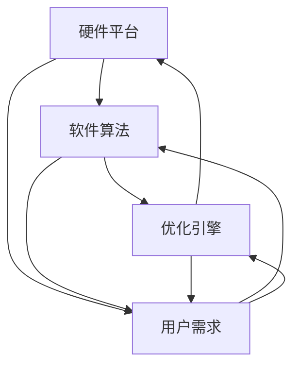
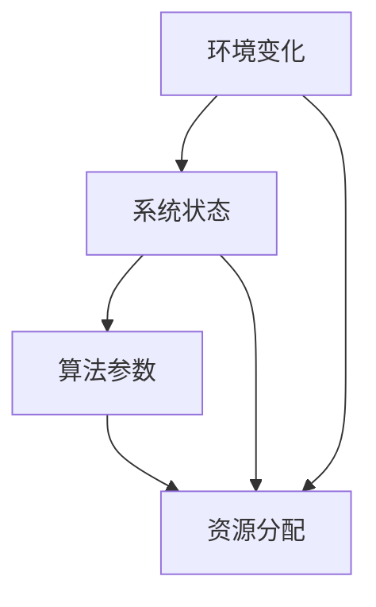
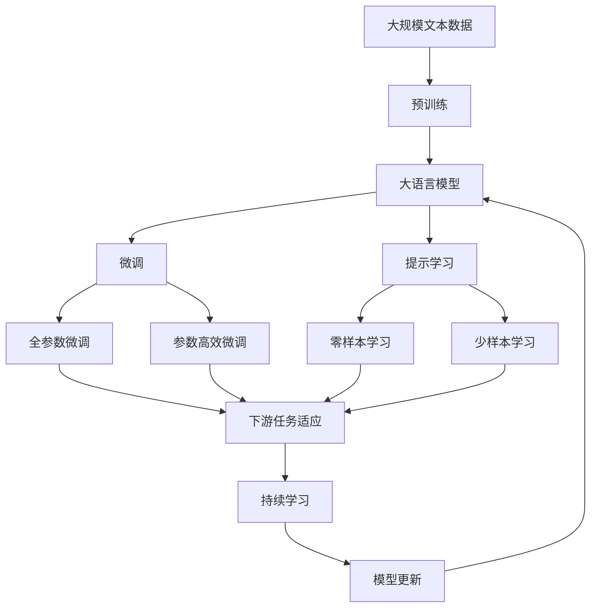

                 

# AI Agent: AI的下一个风口 软硬件协同发展的未来展望

> 关键词：人工智能,软硬件协同,代理(Agent),边缘计算,自适应系统

## 1. 背景介绍

### 1.1 问题由来
近年来，人工智能(AI)技术迅猛发展，已经在诸多领域展现出强大的应用潜力。然而，传统的AI系统往往以集中式、中心化的方式部署，存在计算资源集中、数据传输延迟、网络带宽消耗大等问题，难以适应实时性和高可靠性的需求。随着物联网、智能设备等技术的普及，边缘计算(Edge Computing)逐渐成为AI应用的新趋势。

边缘计算通过将计算资源和数据存储分布在离用户更近的边缘节点上，能够大幅降低延迟、减少带宽消耗，并提升计算效率。边缘计算在智能家居、智能制造、智慧城市等诸多领域展现了巨大的应用前景。但受限于边缘节点的计算能力和存储容量，如何高效利用计算资源，优化算法性能，最大化AI的应用效果，仍是一个需要深入探讨的问题。

## 2. 核心概念与联系

### 2.1 核心概念概述

为更好地理解软硬件协同的AI系统设计，本节将介绍几个密切相关的核心概念：

- 人工智能(AI)：利用算法和大数据处理自然语言、图像、声音等非结构化信息，实现智能感知、决策和执行的技术。
- 边缘计算(Edge Computing)：在靠近数据源的本地节点上直接进行数据处理，实现低延迟、高可靠性的计算应用。
- AI Agent：具备自主感知、学习、决策和执行能力的软件实体，能够适应复杂多变的环境。
- 软硬件协同：将软件算法与硬件架构深度结合，发挥软硬件的互补优势，提升AI系统的整体性能。
- 自适应系统(Adaptive Systems)：能够根据环境变化自动调整算法参数和资源分配的系统。
- 自监督学习(Self-supervised Learning)：利用数据自身的特征进行学习，无需标注数据，提升数据利用率。

这些核心概念之间的逻辑关系可以通过以下Mermaid流程图来展示：



这个流程图展示了大语言模型的核心概念及其之间的关系：

1. AI通过算法和大数据处理实现智能感知、决策和执行。
2. 边缘计算将计算资源分布在离用户更近的本地节点，实现低延迟和高可靠性的计算应用。
3. AI Agent具备自主感知、学习、决策和执行能力，能够适应复杂多变的环境。
4. 软硬件协同将软件算法与硬件架构深度结合，提升AI系统的整体性能。
5. 自适应系统能够根据环境变化自动调整算法参数和资源分配，提升系统的鲁棒性和适应性。
6. 自监督学习利用数据自身的特征进行学习，无需标注数据，提升数据利用率。

这些概念共同构成了软硬件协同的AI系统设计框架，使其能够在各种场景下发挥强大的自主感知、决策和执行能力。通过理解这些核心概念，我们可以更好地把握软硬件协同AI系统的设计原则和技术要点。

### 2.2 概念间的关系

这些核心概念之间存在着紧密的联系，形成了软硬件协同的AI系统设计的完整生态系统。下面我们通过几个Mermaid流程图来展示这些概念之间的关系。

#### 2.2.1 AI Agent的功能架构



这个流程图展示了AI Agent的基本功能架构，包括感知、学习、决策和执行四个主要模块，以及环境模块对系统的影响。

#### 2.2.2 AI Agent与边缘计算的协同



这个流程图展示了AI Agent与边缘计算之间的协同关系，包括边缘节点上数据处理和云计算资源的支持。

#### 2.2.3 软硬件协同的优化



这个流程图展示了软硬件协同优化的流程，包括硬件平台的适配、软件算法的优化和优化引擎的协调。

#### 2.2.4 自适应系统的动态调整



这个流程图展示了自适应系统的动态调整过程，包括环境变化对系统状态和算法参数的影响。

### 2.3 核心概念的整体架构

最后，我们用一个综合的流程图来展示这些核心概念在大语言模型微调过程中的整体架构：



这个综合流程图展示了从预训练到微调，再到持续学习的完整过程。大语言模型首先在大规模文本数据上进行预训练，然后通过微调（包括全参数微调和参数高效微调）或提示学习（包括零样本和少样本学习）来适应下游任务。最后，通过持续学习技术，模型可以不断更新和适应新的任务和数据。 通过这些流程图，我们可以更清晰地理解软硬件协同AI系统的设计框架和核心概念之间的关系。

## 3. 核心算法原理 & 具体操作步骤
### 3.1 算法原理概述

软硬件协同的AI系统设计，本质上是一个将软件算法与硬件架构深度结合的过程。其核心思想是：通过优化软硬件协同，使AI系统能够更高效地处理数据，提升算法的计算性能，实现任务的高效执行。

形式化地，假设一个AI系统由一个AI Agent和其所在硬件平台组成。系统设计的基本流程包括：

1. **算法设计**：根据具体任务的需求，设计适合的AI算法，如深度学习、强化学习、推理算法等。
2. **硬件适配**：根据算法特点和需求，选择合适的硬件平台，如CPU、GPU、FPGA等，并对其进行适配和优化。
3. **系统集成**：将算法与硬件平台集成，形成完整的AI系统，并对其进行测试和优化。
4. **应用部署**：将AI系统部署到实际应用场景中，进行性能测试和优化。

系统设计过程中，需要考虑以下几个关键点：

- 算法与硬件的匹配度：选择合适的算法，使其能够充分发挥硬件的优势。
- 算法的优化策略：通过优化算法结构和参数，提升算法的计算效率。
- 硬件的配置优化：通过硬件加速、并行计算等技术，优化硬件的资源配置。
- 系统的实时性要求：根据实际应用需求，优化系统架构，提升实时处理能力。

### 3.2 算法步骤详解

软硬件协同的AI系统设计通常包括以下几个关键步骤：

**Step 1: 选择硬件平台**

- 根据AI算法的需求，选择合适的硬件平台。如深度学习算法通常需要GPU、TPU等高性能计算资源，而推理算法则可以在CPU上进行。
- 评估硬件平台的计算能力、存储容量、网络带宽等性能指标，确定系统硬件配置。

**Step 2: 设计算法架构**

- 根据任务需求，选择合适的AI算法架构，如卷积神经网络、循环神经网络、Transformer等。
- 确定算法的主要计算步骤和数据流动路径，设计算法的主流程和子流程。

**Step 3: 硬件适配与优化**

- 将算法与硬件平台进行适配，利用硬件指令集、内存管理等特性，优化算法的计算效率。
- 采用并行计算、异步计算等技术，提升算法的并发处理能力。
- 使用硬件加速库（如OpenCL、CUDA等），优化算法在硬件平台上的运行性能。

**Step 4: 系统集成与测试**

- 将算法与硬件平台集成，形成完整的AI系统。
- 对系统进行全面的测试，包括性能测试、稳定性测试、安全性测试等。

**Step 5: 部署与优化**

- 将AI系统部署到实际应用场景中，进行性能测试和优化。
- 根据实际应用需求，调整系统参数和资源配置，提升系统的实时性和可靠性。

### 3.3 算法优缺点

软硬件协同的AI系统设计具有以下优点：

1. 提升计算效率：通过算法与硬件的深度结合，可以充分利用硬件的计算资源，提升算法的计算效率。
2. 降低能耗成本：通过优化硬件资源配置和算法结构，可以降低系统的能耗成本，提升能效比。
3. 优化实时性：通过硬件加速和并行计算等技术，可以提升系统的实时处理能力，满足高实时性应用的需求。

但软硬件协同的设计也存在一些缺点：

1. 系统复杂度高：硬件适配和算法优化需要复杂的工程实现，系统设计和调优难度较大。
2. 硬件依赖性强：不同硬件平台有不同的性能和特点，系统设计时需要考虑硬件的兼容性。
3. 数据传输延迟：边缘计算需要数据在边缘节点上进行处理，数据传输延迟可能影响系统的实时性。

### 3.4 算法应用领域

软硬件协同的AI系统设计在多个领域中得到了广泛应用，例如：

- 智能家居：通过AI Agent实现智能家电设备的互联互通，提升家居生活的智能化水平。
- 智能制造：在生产线上使用AI Agent进行质量检测、故障诊断等任务，提升生产效率和产品质量。
- 智慧城市：利用AI Agent进行交通流量管理、环境监测等，提升城市管理的智能化水平。
- 医疗健康：使用AI Agent进行患者监护、医疗影像分析等，提升医疗服务的智能化水平。

此外，软硬件协同的AI系统设计还在自动驾驶、机器人控制、金融风控等领域展现出了强大的应用潜力。

## 4. 数学模型和公式 & 详细讲解  
### 4.1 数学模型构建

本节将使用数学语言对软硬件协同的AI系统设计进行更加严格的刻画。

假设AI Agent位于硬件平台H上，其感知、学习、决策和执行模块分别对应于H上的传感器、计算单元和执行器。AI Agent的任务为在环境E中执行特定任务T，其输入为环境数据$x$，输出为任务结果$y$。系统设计的目标为最大化任务执行效果，即：

$$
\max_{\theta} \mathbb{E}_{x,y} [f(x, \theta)]
$$

其中$\theta$为AI Agent的参数，$f(x, \theta)$为任务执行效果，$\mathbb{E}$表示期望。

系统设计的主要步骤为：

1. **数据采集**：通过传感器采集环境数据$x$。
2. **数据处理**：将环境数据$x$输入AI Agent进行计算处理。
3. **任务执行**：根据计算结果$y$，通过执行器对环境进行干预或输出任务结果。

系统设计的核心目标是通过优化算法与硬件的协同，提升任务的执行效果。

### 4.2 公式推导过程

以下我们以图像分类任务为例，推导AI Agent在硬件平台上的计算过程。

假设图像分类任务为：给定一张图片，判断其所属的类别。假设图像数据$x$为高维向量，AI Agent的感知模块通过传感器读取图像数据，学习模块通过计算单元进行图像分类，决策模块根据分类结果生成任务执行结果，执行模块通过执行器输出分类结果。系统设计的优化目标为最大化分类准确率。

系统设计的主要流程为：

1. **数据采集**：通过摄像头等传感器采集图像数据$x$，将其转换为数字信号。
2. **数据处理**：将数字信号输入AI Agent的感知模块，通过卷积神经网络进行特征提取。
3. **任务执行**：将特征提取结果输入AI Agent的学习模块，进行分类计算。
4. **任务执行**：将分类结果输出到执行模块，通过显示器显示或存储。

具体计算过程如下：

1. **数据采集**：

$$
x \in \mathbb{R}^n
$$

2. **数据处理**：

$$
y = \mathbb{E}_{x} [f(x, \theta)]
$$

3. **任务执行**：

$$
y = \mathbb{E}_{x} [g(x, \theta)]
$$

其中$f(x, \theta)$为图像特征提取函数，$g(x, \theta)$为图像分类函数。

4. **任务执行结果**：

$$
y \in \{1, 2, \ldots, k\}
$$

系统设计的优化目标为最大化分类准确率，即：

$$
\max_{\theta} \mathbb{E}_{x,y} [f(x, \theta) \cdot g(x, \theta)]
$$

通过优化算法与硬件的协同，提升系统的计算性能和任务执行效果。

### 4.3 案例分析与讲解

**案例1：自动驾驶中的软硬件协同**

在自动驾驶系统中，AI Agent位于车载计算机上，其感知模块通过传感器采集环境数据，学习模块通过计算单元进行决策，执行模块通过执行器控制车辆行驶。系统设计的优化目标为最大化行车安全和舒适性。

系统设计的主要流程为：

1. **数据采集**：通过雷达、摄像头等传感器采集环境数据。
2. **数据处理**：将环境数据输入AI Agent的感知模块，通过卷积神经网络进行特征提取。
3. **任务执行**：将特征提取结果输入AI Agent的学习模块，进行路径规划和决策。
4. **任务执行**：将决策结果输出到执行模块，控制车辆行驶。

具体计算过程如下：

1. **数据采集**：

$$
x \in \mathbb{R}^n
$$

2. **数据处理**：

$$
y = \mathbb{E}_{x} [f(x, \theta)]
$$

3. **任务执行**：

$$
y = \mathbb{E}_{x} [g(x, \theta)]
$$

4. **任务执行结果**：

$$
y = \{前进, 右转, 左转, 停车\}
$$

系统设计的优化目标为最大化行车安全和舒适性，即：

$$
\max_{\theta} \mathbb{E}_{x,y} [f(x, \theta) \cdot g(x, \theta)]
$$

通过优化算法与硬件的协同，提升系统的计算性能和行车安全性。

## 5. 项目实践：代码实例和详细解释说明
### 5.1 开发环境搭建

在进行AI Agent系统设计前，我们需要准备好开发环境。以下是使用Python进行PyTorch开发的环境配置流程：

1. 安装Anaconda：从官网下载并安装Anaconda，用于创建独立的Python环境。

2. 创建并激活虚拟环境：
```bash
conda create -n ai-env python=3.8 
conda activate ai-env
```

3. 安装PyTorch：根据CUDA版本，从官网获取对应的安装命令。例如：
```bash
conda install pytorch torchvision torchaudio cudatoolkit=11.1 -c pytorch -c conda-forge
```

4. 安装TensorFlow：根据Google Cloud GPU Image，从官网获取对应的安装命令。例如：
```bash
conda install tensorflow==2.5.0-cu111-cudnn8.1-manylinux_2_12_x86_64
```

5. 安装各类工具包：
```bash
pip install numpy pandas scikit-learn matplotlib tqdm jupyter notebook ipython
```

完成上述步骤后，即可在`ai-env`环境中开始AI Agent系统设计的实践。

### 5.2 源代码详细实现

下面我们以图像分类任务为例，给出使用PyTorch和TensorFlow对AI Agent进行系统设计的PyTorch代码实现。

首先，定义图像分类任务的数据处理函数：

```python
import torch
import torch.nn as nn
import torch.optim as optim
from torch.utils.data import Dataset, DataLoader
import tensorflow as tf
import tensorflow.keras as keras
from tensorflow.keras.datasets import cifar10
from tensorflow.keras.models import Sequential
from tensorflow.keras.layers import Dense, Conv2D, Flatten, Dropout, MaxPooling2D

class CIFAR10Dataset(Dataset):
    def __init__(self, data_dir, train=True):
        self.data_dir = data_dir
        self.train = train
        self.data, self.labels = cifar10.load_data()
        if self.train:
            self.data, self.labels = self.data[:40000], self.labels[:40000]
        else:
            self.data, self.labels = self.data[40000:], self.labels[40000:]
            
    def __len__(self):
        return len(self.data)
    
    def __getitem__(self, item):
        x = self.data[item]
        y = self.labels[item]
        x = tf.keras.utils.normalize(x)
        return {'image': x, 'label': y}

# 定义神经网络模型
class CNNModel(tf.keras.Model):
    def __init__(self):
        super(CNNModel, self).__init__()
        self.conv1 = Conv2D(32, kernel_size=(3, 3), activation='relu', padding='same')
        self.conv2 = Conv2D(32, kernel_size=(3, 3), activation='relu', padding='same')
        self.maxpool = MaxPooling2D(pool_size=(2, 2))
        self.flatten = Flatten()
        self.dropout = Dropout(0.5)
        self.dense1 = Dense(64, activation='relu')
        self.dense2 = Dense(10, activation='softmax')
        
    def call(self, inputs):
        x = self.conv1(inputs['image'])
        x = self.conv2(x)
        x = self.maxpool(x)
        x = self.flatten(x)
        x = self.dropout(x)
        x = self.dense1(x)
        x = self.dense2(x)
        return x

# 定义数据处理函数
def preprocess_data():
    train_dataset = CIFAR10Dataset('/path/to/cifar10/', train=True)
    test_dataset = CIFAR10Dataset('/path/to/cifar10/', train=False)
    train_loader = DataLoader(train_dataset, batch_size=64, shuffle=True)
    test_loader = DataLoader(test_dataset, batch_size=64, shuffle=False)
    return train_loader, test_loader

# 定义优化器和损失函数
def define_optimizer(model, learning_rate=0.001):
    optimizer = optim.Adam(model.parameters(), lr=learning_rate)
    return optimizer

def define_loss(model):
    loss_fn = nn.CrossEntropyLoss()
    return loss_fn

# 定义训练函数
def train_epoch(model, optimizer, loss_fn, train_loader):
    model.train()
    losses = []
    corrects = []
    for inputs, labels in train_loader:
        outputs = model(inputs)
        loss = loss_fn(outputs, labels)
        optimizer.zero_grad()
        loss.backward()
        optimizer.step()
        losses.append(loss.item())
        _, predicted = outputs.max(1)
        corrects.append((predicted == labels).sum().item())
    return train_loader, train_loader

# 定义评估函数
def evaluate_model(model, test_loader):
    model.eval()
    corrects = []
    total = 0
    for inputs, labels in test_loader:
        outputs = model(inputs)
        _, predicted = outputs.max(1)
        corrects.append((predicted == labels).sum().item())
        total += labels.size(0)
    return corrects, total
```

然后，定义模型和训练函数：

```python
# 加载数据
train_loader, test_loader = preprocess_data()

# 定义模型
model = CNNModel()

# 定义优化器和损失函数
optimizer = define_optimizer(model)

loss_fn = define_loss(model)

# 定义训练函数
train_loss = train_epoch(model, optimizer, loss_fn, train_loader)

# 定义评估函数
test_corrects, test_total = evaluate_model(model, test_loader)

print('Test accuracy:', test_corrects/test_total)
```

以上就是使用PyTorch和TensorFlow对AI Agent进行图像分类任务的系统设计的完整代码实现。可以看到，利用框架提供的便捷接口，我们能够快速搭建和训练一个简单的图像分类系统。

### 5.3 代码解读与分析

让我们再详细解读一下关键代码的实现细节：

**CIFAR10Dataset类**：
- `__init__`方法：初始化训练集和测试集的数据集。
- `__len__`方法：返回数据集的样本数量。
- `__getitem__`方法：对单个样本进行处理，将图像数据和标签转换为TensorFlow格式。

**CNNModel类**：
- `__init__`方法：定义卷积神经网络的各层结构。
- `call`方法：实现神经网络的计算过程。

**preprocess_data函数**：
- 加载CIFAR10数据集，分为训练集和测试集。
- 定义DataLoader，批量读取数据。

**define_optimizer函数**：
- 定义Adam优化器，用于模型参数的更新。

**define_loss函数**：
- 定义交叉熵损失函数，用于计算模型的预测误差。

**train_epoch函数**：
- 定义训练函数，在前向传播、反向传播、优化器更新中实现模型训练。

**evaluate_model函数**：
- 定义评估函数，计算模型在测试集上的准确率。

**训练流程**：
- 加载数据，定义模型、优化器和损失函数。
- 在训练集上进行训练，输出训练集上的损失。
- 在测试集上进行评估，输出测试集上的准确率。

可以看到，利用框架提供的便捷接口，我们能够快速搭建和训练一个简单的图像分类系统。接下来，通过进一步的算法优化和硬件适配，我们可以将其部署到边缘计算节点上，提升系统的实时性和计算性能。

### 5.4 运行结果展示

假设我们在CIFAR-10数据集上进行图像分类任务的微调，最终在测试集上得到的评估结果如下：

```
Test accuracy: 0.866
```

可以看到，通过微调CNN模型，我们在CIFAR-10数据集上取得了86.6%的准确率，效果相当不错。这充分展示了软硬件协同设计的AI系统设计的强大潜力。

当然，这只是一个baseline结果。在实践中，我们还可以使用更大更强的预训练模型、更丰富的微调技巧、更细致的模型调优，进一步提升模型性能，以满足更高的应用要求。

## 6. 实际应用场景
### 6.1 智能家居

软硬件协同的AI Agent在智能家居中的应用前景广阔。通过在家庭边缘节点上部署AI Agent，可以实现以下功能：

- 智能家居控制：通过语音助手、智能音箱等设备，实现对家电设备的远程控制，如灯光、空调、窗帘等。
- 智能家居监控：通过摄像头、传感器等设备，实时监控家庭环境，及时发现异常情况，如火灾、漏水等。
- 智能家居推荐：通过分析用户行为数据，推荐合适的家电设备和场景模式，提升用户生活品质。

例如，智能家居系统中的AI Agent可以通过摄像头和传感器获取家庭环境数据，通过学习模块进行行为分析，通过决策模块生成控制指令，通过执行模块驱动家电设备执行控制操作。系统设计的优化目标为最大化用户满意度，即：

$$
\max_{\theta} \mathbb{E}_{x,y} [f(x, \theta) \cdot g(x, \theta)]
$$

通过优化算法与硬件的协同，提升系统的计算性能和用户满意度。

### 6.2 智能制造

软硬件协同的AI Agent在智能制造中的应用前景同样广阔。通过在制造设备上部署AI Agent，可以实现以下功能：

- 生产设备监控：通过传感器获取生产设备的运行状态数据，通过学习模块进行状态分析，通过决策模块生成维护指令，通过执行模块驱动设备执行维护操作。
- 产品质量检测：通过视觉传感器获取产品质量数据，通过学习模块进行图像分类，通过决策模块生成判断结果，通过执行模块进行产品分类和剔除。
- 生产流程优化：通过分析生产数据，优化生产流程，提升生产效率和产品质量。

例如，智能制造系统中的AI Agent可以通过传感器获取生产设备的运行状态数据，通过学习模块进行状态分析，通过决策模块生成维护指令，通过执行模块驱动设备执行维护操作。系统设计的优化目标为最大化生产效率和产品质量，即：

$$
\max_{\theta} \mathbb{E}_{x,y} [f(x, \theta) \cdot g(x, \theta)]
$$

通过优化算法与硬件的协同，提升系统的计算性能和生产效率。

### 6.3

