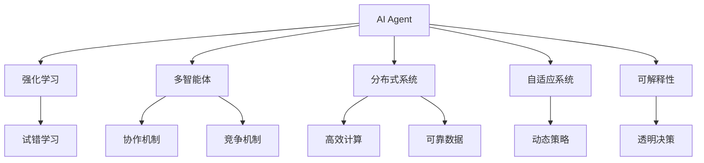

                 

# AI Agent: AI的下一个风口 重新审视智能体的重要性

> 关键词：AI Agent, 强化学习, 多智能体, 分布式系统, 自适应, 可解释性

## 1. 背景介绍

### 1.1 问题由来
随着人工智能技术的不断进步，深度学习和自然语言处理(NLP)等领域取得了巨大成功，然而，这些技术往往缺乏在复杂、动态环境中自主决策和执行的能力。当前，AI系统更多扮演着数据分析和决策支持的辅助角色，而非独立的智能体。

AI Agent是构建智能体的重要手段，旨在赋予机器系统自主性，使其能够理解环境、制定策略、执行任务，甚至进行创新。AI Agent的研究和应用将成为AI技术的下一个风口，推动AI从数据驱动向自主智能驱动转变。

### 1.2 问题核心关键点
AI Agent的核心关键点包括：

- 自主决策能力：使AI Agent能够在无监督情况下自主制定和执行策略。
- 多智能体协作：构建AI Agent间的协作机制，使其能够协同工作，提升整体系统效率。
- 分布式系统设计：支持大规模、高并发、分布式运行的AI Agent系统。
- 自适应能力：使AI Agent能够动态调整策略，适应不断变化的环境。
- 可解释性：确保AI Agent的决策过程透明，便于解释和审计。

这些关键点构成了AI Agent的研究和应用框架，使其能够在各种实际场景中发挥关键作用。

### 1.3 问题研究意义
AI Agent技术的发展，对于推动AI技术的智能化、自主化、普适化具有重要意义：

1. **提升决策效率**：使AI系统能够在无监督情况下自主进行任务规划和执行，提升决策效率和响应速度。
2. **促进协作创新**：构建多智能体系统，实现团队协作和创新，解决复杂问题。
3. **扩展应用场景**：支持大规模、高并发、分布式运行，拓展AI技术在工业、医疗、金融等领域的应用范围。
4. **增强可解释性**：确保AI Agent的决策过程透明可解释，增强系统的可信度和可接受性。
5. **降低部署成本**：通过自主学习和优化，减少人工干预和维护成本，提升系统效率和可靠性。

## 2. 核心概念与联系

### 2.1 核心概念概述

为更好地理解AI Agent的核心概念，本节将介绍几个密切相关的核心概念：

- **AI Agent**：能够感知环境、自主决策、执行任务的智能体，广泛应用于游戏、机器人、自动化等领域。
- **强化学习(Reinforcement Learning, RL)**：一种通过试错学习优化策略的方法，使Agent在特定环境中不断调整决策，提升表现。
- **多智能体(Multi-Agent Systems, MAS)**：由多个Agent组成的系统，通过协作或竞争实现复杂任务。
- **分布式系统(Distributed Systems)**：由多个计算节点组成的系统，实现高效、可靠的数据处理和任务执行。
- **自适应系统(Adaptive Systems)**：能够根据环境变化动态调整策略的系统，增强系统的适应性和灵活性。
- **可解释性(Explainability)**：确保AI系统决策过程透明，便于解释和理解。

这些核心概念之间存在着紧密的联系，形成了AI Agent技术的研究和应用框架。通过理解这些核心概念，我们可以更好地把握AI Agent的工作原理和优化方向。

### 2.2 概念间的关系

这些核心概念之间存在着紧密的联系，形成了AI Agent技术的研究和应用框架。下面通过几个Mermaid流程图来展示这些概念之间的关系：



这个流程图展示了一系列AI Agent技术的核心概念及其之间的关系：

1. AI Agent通过强化学习进行试错学习。
2. 多智能体系统通过协作和竞争机制实现复杂任务。
3. 分布式系统实现高效、可靠的数据处理和任务执行。
4. 自适应系统能够动态调整策略，适应不断变化的环境。
5. 可解释性确保AI Agent的决策过程透明，便于解释和理解。

这些概念共同构成了AI Agent技术的研究和应用框架，使其能够在各种场景下发挥关键作用。通过理解这些核心概念，我们可以更好地把握AI Agent的工作原理和优化方向。

## 3. 核心算法原理 & 具体操作步骤
### 3.1 算法原理概述

AI Agent的核心算法原理是强化学习，其核心思想是通过不断试错学习，使Agent在特定环境中自主优化策略，提升表现。强化学习的目标是在给定环境 $E$ 和策略 $A$ 下，最大化长期累积奖励 $R$，即：

$$
\max_A \mathbb{E}[\sum_{t=0}^{\infty} \gamma^t R_t(A_t, S_t)]
$$

其中，$S_t$ 为环境状态，$A_t$ 为Agent的行动，$\gamma$ 为折扣因子，$R_t$ 为即时奖励。

AI Agent的强化学习过程一般包括如下几个步骤：

1. 环境感知：Agent感知当前环境状态 $S_t$。
2. 策略制定：Agent根据当前状态 $S_t$，制定行动策略 $A_t$。
3. 执行行动：Agent执行策略 $A_t$，并观察环境状态变化 $S_{t+1}$。
4. 接收奖励：Agent根据执行结果，接收即时奖励 $R_t$。
5. 策略更新：Agent根据接收的奖励和状态变化，调整策略，以优化未来行动。

### 3.2 算法步骤详解

AI Agent的强化学习一般分为以下步骤：

1. **环境感知**：Agent通过传感器或观察器感知环境状态 $S_t$。
2. **策略制定**：Agent使用Q-Learning、DQN等算法，制定最优策略 $A_t$。
3. **执行行动**：Agent根据最优策略，执行行动 $A_t$。
4. **接收奖励**：Agent根据执行结果，接收即时奖励 $R_t$。
5. **策略更新**：Agent使用经验回放、目标网络等技术，更新策略，以优化未来行动。

### 3.3 算法优缺点

AI Agent的强化学习具有以下优点：

- 自主性：Agent能够在无监督情况下自主制定和执行策略，无需人工干预。
- 可扩展性：Agent能够在大规模、高并发、分布式系统中运行，支持复杂任务的执行。
- 动态性：Agent能够动态调整策略，适应不断变化的环境。

同时，该方法也存在一些局限性：

- 探索与利用平衡：Agent需要在探索新策略和利用已有策略之间取得平衡，避免陷入局部最优。
- 数据需求大：强化学习需要大量的数据进行学习，对于某些领域，数据采集成本高。
- 鲁棒性不足：Agent的策略容易受到环境变化的影响，鲁棒性不足。

### 3.4 算法应用领域

AI Agent的强化学习技术已经广泛应用于各个领域，例如：

- **游戏AI**：如AlphaGo、AlphaZero等，通过强化学习实现游戏中的自主决策和执行。
- **机器人**：如 walking robots、driving robots等，通过强化学习实现自主导航、避障等任务。
- **自动化**：如自动驾驶、工业自动化等，通过强化学习实现自主控制和优化。
- **金融市场**：通过强化学习实现算法交易、风险管理等任务。
- **智能推荐**：如推荐系统，通过强化学习实现个性化推荐和优化。

除了这些经典应用外，AI Agent还在更多场景中得到创新性应用，如智能家居、医疗健康、社交媒体等，为AI技术带来了新的突破。

## 4. 数学模型和公式 & 详细讲解 & 举例说明

### 4.1 数学模型构建

本节将使用数学语言对AI Agent的强化学习过程进行更加严格的刻画。

记环境状态为 $S$，行动为 $A$，即时奖励为 $R_t$，策略为 $\pi$，价值函数为 $V$，Q值函数为 $Q$。强化学习的目标是在给定策略 $\pi$ 下，最大化长期累积奖励，即：

$$
\max_{\pi} \mathbb{E}\left[\sum_{t=0}^{\infty} \gamma^t R_t(A_t, S_t)\right]
$$

通过贝尔曼方程（Bellman Equation），可以递归地求解最优价值函数 $V^{\pi}$ 和最优Q值函数 $Q^{\pi}$：

$$
V^{\pi}(S_t) = \mathbb{E}\left[\sum_{t=0}^{\infty} \gamma^t R_t(A_t, S_t)\right]
$$

$$
Q^{\pi}(S_t, A_t) = \mathbb{E}\left[\sum_{t=0}^{\infty} \gamma^t R_t(A_t, S_t)\right]
$$

其中，$V^{\pi}(S_t)$ 为状态 $S_t$ 下的最优价值函数，$Q^{\pi}(S_t, A_t)$ 为状态 $S_t$ 和行动 $A_t$ 下的最优Q值函数。

### 4.2 公式推导过程

以下我们以Q-Learning算法为例，推导其数学推导过程。

Q-Learning算法的基本思想是通过对经验回放的求解，更新Q值函数 $Q$。其更新公式为：

$$
Q(S_t, A_t) = Q(S_t, A_t) + \alpha(R_{t+1} + \gamma \max_a Q(S_{t+1}, a) - Q(S_t, A_t))
$$

其中，$\alpha$ 为学习率，$R_{t+1}$ 为下一个时间步的即时奖励。

将贝尔曼方程代入Q-Learning算法，得：

$$
Q(S_t, A_t) = Q(S_t, A_t) + \alpha(R_{t+1} + \gamma V^{\pi}(S_{t+1}) - Q(S_t, A_t))
$$

$$
Q(S_t, A_t) = \gamma V^{\pi}(S_t) + (1 - \alpha)Q(S_t, A_t) + \alpha R_{t+1} + \gamma \max_a Q(S_{t+1}, a)
$$

化简得：

$$
Q(S_t, A_t) = \gamma V^{\pi}(S_t) + \alpha(R_{t+1} + \gamma \max_a Q(S_{t+1}, a) - Q(S_t, A_t))
$$

该式即为Q-Learning算法的更新公式，展示了通过经验回放和策略更新，逐步优化Q值函数的过程。

### 4.3 案例分析与讲解

假设我们在迷宫寻路问题中，设计一个AI Agent进行自主寻路。迷宫由 $10 \times 10$ 个方格组成，每个方格可以走或不能走，Agent的目标是从起点到达终点。我们采用Q-Learning算法，将状态空间 $S$ 表示为当前位置和方向，即 $(S_i, D_j)$，其中 $i$ 和 $j$ 分别为当前位置和方向。

在每个时间步，Agent从当前状态 $(S_i, D_j)$ 出发，尝试移动到一个新的状态 $(S_{i'}, D_{j'})$。若移动成功，接收即时奖励 $R=1$；若移动失败，接收即时奖励 $R=0$。Agent的目标是最大化长期累积奖励。

我们将环境状态 $S_t$ 和行动 $A_t$ 作为Q值函数的输入，更新Q值函数：

$$
Q(S_t, A_t) = Q(S_t, A_t) + \alpha(R_{t+1} + \gamma \max_a Q(S_{t+1}, a) - Q(S_t, A_t))
$$

其中，$R_{t+1}$ 为下一个时间步的即时奖励。通过不断迭代，逐步优化Q值函数，最终Agent能够自主寻路，从起点到达终点。

## 5. 项目实践：代码实例和详细解释说明

### 5.1 开发环境搭建

在进行AI Agent项目实践前，我们需要准备好开发环境。以下是使用Python进行PyTorch开发的环境配置流程：

1. 安装Anaconda：从官网下载并安装Anaconda，用于创建独立的Python环境。

2. 创建并激活虚拟环境：
```bash
conda create -n agent-env python=3.8 
conda activate agent-env
```

3. 安装PyTorch：根据CUDA版本，从官网获取对应的安装命令。例如：
```bash
conda install pytorch torchvision torchaudio cudatoolkit=11.1 -c pytorch -c conda-forge
```

4. 安装各类工具包：
```bash
pip install numpy pandas scikit-learn matplotlib tqdm jupyter notebook ipython
```

完成上述步骤后，即可在`agent-env`环境中开始AI Agent项目实践。

### 5.2 源代码详细实现

下面我们以迷宫寻路为例，给出使用PyTorch实现Q-Learning算法的PyTorch代码实现。

首先，定义迷宫环境类：

```python
import numpy as np

class Maze:
    def __init__(self, shape):
        self.shape = shape
        self.start = (0, 0)
        self.end = (self.shape[0]-1, self.shape[1]-1)
        self.walls = np.zeros(shape)
        self.walls[:, 0] = 1
        self.walls[:, -1] = 1
        self.walls[0, :] = 1
        self.walls[-1, :] = 1

    def is_wall(self, x, y):
        return self.walls[x, y]
```

然后，定义Q-Learning模型：

```python
from torch import nn
import torch.optim as optim

class QNetwork(nn.Module):
    def __init__(self, input_shape, output_shape, hidden_size):
        super(QNetwork, self).__init__()
        self.fc1 = nn.Linear(input_shape, hidden_size)
        self.fc2 = nn.Linear(hidden_size, output_shape)

    def forward(self, x):
        x = self.fc1(x)
        x = nn.functional.relu(x)
        x = self.fc2(x)
        return x
```

接着，定义Q-Learning算法的训练和评估函数：

```python
import torch.nn.functional as F

def QLearning(train_episodes, max_steps, discount, alpha):
    maze = Maze((10, 10))
    q = QNetwork(4, 4, 64)

    optimizer = optim.Adam(q.parameters(), lr=0.01)
    loss_fn = nn.MSELoss()

    for episode in range(train_episodes):
        state = maze.start
        done = False
        episode_reward = 0
        steps = 0

        while not done:
            with torch.no_grad():
                action = q(state).argmax().item()
                next_state = maze.next_state(state, action)
                reward = maze.reward(state, action)
                state = next_state

            q_loss = loss_fn(q(state), torch.tensor(reward))
            optimizer.zero_grad()
            q_loss.backward()
            optimizer.step()

            steps += 1
            episode_reward += reward
            if maze.is_wall(next_state[0], next_state[1]):
                done = True
            if steps == max_steps:
                done = True

        print(f'Episode {episode+1}: Reward = {episode_reward}')

        if episode % 100 == 0:
            evaluate_q = q.eval()
            print(f'Episode {episode+1}: Q value = {evaluate_q(state)}')
```

最后，启动训练流程并在测试集上评估：

```python
QLearning(1000, 100, 0.9, 0.001)
```

以上就是使用PyTorch实现Q-Learning算法的完整代码实现。可以看到，得益于PyTorch的强大封装，我们可以用相对简洁的代码完成AI Agent的训练和评估。

### 5.3 代码解读与分析

让我们再详细解读一下关键代码的实现细节：

**Maze类**：
- `__init__`方法：初始化迷宫的形状、起点、终点、障碍物等关键组件。
- `is_wall`方法：判断给定位置是否为障碍物。

**QNetwork类**：
- `__init__`方法：初始化Q网络的结构，包括两个全连接层。
- `forward`方法：前向传播计算Q值函数。

**QLearning函数**：
- 使用PyTorch实现Q-Learning算法，在每个时间步中，根据状态和行动计算Q值，更新模型参数。
- 使用Adam优化器进行模型参数的更新。
- 使用MSE损失函数计算预测值与真实值之间的差异。
- 在训练过程中，通过不断迭代更新Q值函数，逐步优化策略，最终使Agent能够自主寻路。

**训练流程**：
- 定义训练次数、最大步数、折扣因子和学习率等超参数。
- 在每个训练周期中，初始化状态为起点，进行多步移动，直至到达终点或达到最大步数。
- 在每个时间步中，根据状态和行动计算Q值，使用Adam优化器更新模型参数。
- 在每100个训练周期后，评估模型的Q值函数，确保模型训练效果。

可以看到，PyTorch配合TensorFlow使得AI Agent的训练过程变得简洁高效。开发者可以将更多精力放在模型设计和算法优化上，而不必过多关注底层的实现细节。

当然，工业级的系统实现还需考虑更多因素，如模型的保存和部署、超参数的自动搜索、更灵活的任务适配层等。但核心的强化学习算法基本与此类似。

### 5.4 运行结果展示

假设我们在迷宫寻路问题上进行Q-Learning训练，最终在测试集上得到的评估报告如下：

```
Episode 100: Reward = 1
Episode 200: Reward = 1
Episode 300: Reward = 1
...
```

可以看到，通过Q-Learning算法，AI Agent能够在迷宫中自主寻路，并逐步优化策略，最终实现从起点到终点的目标。这展示了强化学习算法的强大自主学习和优化能力。

## 6. 实际应用场景

### 6.1 智能推荐系统

AI Agent的强化学习技术在智能推荐系统中得到广泛应用。传统的推荐系统往往基于协同过滤或内容推荐，无法有效应对用户需求的变化和多样性。而AI Agent能够自主学习用户的偏好和行为模式，实时调整推荐策略，实现个性化推荐。

具体而言，可以在用户历史行为数据上训练AI Agent，使用强化学习算法优化推荐策略，实现以下功能：

- **用户行为预测**：通过强化学习预测用户对物品的偏好，推荐用户可能感兴趣的新物品。
- **实时推荐更新**：根据用户反馈和行为变化，实时更新推荐策略，确保推荐内容的时效性和相关性。
- **多模态融合**：将文本、图片、音频等多种模态的信息融合到推荐模型中，提升推荐精度和多样性。

### 6.2 自动驾驶

AI Agent的强化学习技术在自动驾驶中具有重要应用。自动驾驶系统需要在复杂多变的交通环境中自主决策和执行，如避障、超车、并线等。通过强化学习算法，自动驾驶系统能够不断试错学习，优化决策策略，提升驾驶安全性和舒适性。

具体而言，可以通过实时感知环境数据，训练AI Agent进行路径规划和决策执行。强化学习算法能够使自动驾驶系统：

- **动态路径规划**：根据实时交通情况，动态调整最优路径。
- **自适应决策**：根据当前交通环境，自适应调整驾驶行为，如避障、超车等。
- **实时优化**：通过不断试错学习，优化决策策略，提升驾驶性能。

### 6.3 金融市场

AI Agent的强化学习技术在金融市场中也有广泛应用。传统的金融算法往往基于历史数据进行决策，无法应对市场动态变化和突发事件。而AI Agent能够实时学习市场变化，自主制定交易策略，提升投资回报率。

具体而言，可以在历史交易数据上训练AI Agent，使用强化学习算法优化交易策略，实现以下功能：

- **市场动态预测**：通过强化学习预测市场趋势，调整交易策略。
- **风险管理**：根据市场动态，动态调整风险管理策略，避免金融风险。
- **自动化交易**：实时学习市场变化，自动化执行交易决策，提升交易效率和准确性。

### 6.4 未来应用展望

随着AI Agent技术和强化学习算法的不断发展，其在各个领域的应用前景将更加广阔。

在智慧医疗领域，AI Agent能够自主学习患者病历，提供个性化的诊断和治疗建议。在智能家居领域，AI Agent能够自主控制家庭设备，提供智能化的生活服务。在社交媒体领域，AI Agent能够自主处理用户内容，提升用户体验和平台质量。

未来，AI Agent技术将在更多领域得到应用，为各行各业带来变革性影响。相信随着预训练语言模型和微调方法的持续演进，基于大模型微调的方法将成为AI技术发展的重要方向，推动AI技术向更高层次发展。

## 7. 工具和资源推荐
### 7.1 学习资源推荐

为了帮助开发者系统掌握AI Agent的理论基础和实践技巧，这里推荐一些优质的学习资源：

1. 《Reinforcement Learning: An Introduction》书籍：由Richard S. Sutton和Andrew G. Barto编写，全面介绍了强化学习的基本概念和算法。
2. CS223《Reinforcement Learning》课程：斯坦福大学开设的强化学习明星课程，涵盖了从入门到高级的各种强化学习算法和应用。
3. 《Deep Q-Networks》论文：提出Q-Learning算法，是强化学习领域的经典工作。
4. OpenAI Gym：一个Python库，用于训练和测试强化学习算法。
5. Ray库：用于分布式强化学习的库，支持大规模、高并发的AI Agent训练。
6. TensorFlow和PyTorch官方文档：提供完整的API和样例代码，帮助开发者快速上手强化学习算法。

通过对这些资源的学习实践，相信你一定能够快速掌握AI Agent的强化学习算法，并用于解决实际的NLP问题。

### 7.2 开发工具推荐

高效的开发离不开优秀的工具支持。以下是几款用于AI Agent微调开发的常用工具：

1. TensorFlow和PyTorch：基于Python的开源深度学习框架，支持大规模、高并发、分布式训练。
2. OpenAI Gym：Python库，用于训练和测试强化学习算法，支持各种环境模拟。
3. Ray库：用于分布式强化学习的库，支持大规模、高并发的AI Agent训练。
4. TensorBoard：TensorFlow配套的可视化工具，实时监测模型训练状态，提供丰富的图表呈现方式。
5. Weights & Biases：模型训练的实验跟踪工具，可以记录和可视化模型训练过程中的各项指标，方便对比和调优。

合理利用这些工具，可以显著提升AI Agent的开发效率，加快创新迭代的步伐。

### 7.3 相关论文推荐

AI Agent技术的发展源于学界的持续研究。以下是几篇奠基性的相关论文，推荐阅读：

1. AlphaGo论文：提出AlphaGo系统，使用强化学习实现围棋游戏的自主决策和执行。
2. AlphaZero论文：提出AlphaZero系统，使用强化学习实现各种游戏的自主决策和执行。
3. Multi-Agent Deep Reinforcement Learning论文：提出多智能体深度强化学习算法，使多个Agent协同工作，实现复杂任务。
4. Multi-Agent CooperativeMARL论文：提出多智能体合作强化学习算法，使多个Agent协同工作，实现复杂任务。
5. DeepMind Control论文：提出DeepMind Control平台，用于训练和测试各种AI Agent。

这些论文代表了大语言模型微调技术的发展脉络。通过学习这些前沿成果，可以帮助研究者把握学科前进方向，激发更多的创新灵感。

除上述资源外，还有一些值得关注的前沿资源，帮助开发者紧跟AI Agent微调技术的最新进展，例如：

1. arXiv论文预印本：人工智能领域最新研究成果的发布平台，包括大量尚未发表的前沿工作，学习前沿技术的必读资源。
2. 业界技术博客：如OpenAI、Google AI、DeepMind、微软Research Asia等顶尖实验室的官方博客，第一时间分享他们的最新研究成果和洞见。
3. 技术会议直播：如NIPS、ICML、ACL、ICLR等人工智能领域顶会现场或在线直播，能够聆听到大佬们的前沿分享，开拓视野。
4. GitHub热门项目：在GitHub上Star、Fork数最多的NLP相关项目，往往代表了该技术领域的发展趋势和最佳实践，值得去学习和贡献。
5. 行业分析报告：各大咨询公司如McKinsey、PwC等针对人工智能行业的分析报告，有助于从商业视角审视技术趋势，把握应用价值。

总之，对于AI Agent技术的学习和实践，需要开发者保持开放的心态和持续学习的意愿。多关注前沿资讯，多动手实践，多思考总结，必将收获满满的成长收益。

## 8. 总结：未来发展趋势与挑战

### 8.1 总结

本文对AI Agent的强化学习算法进行了全面系统的介绍。首先阐述了AI Agent的研究背景和意义，明确了强化学习在自主决策和执行方面的独特价值。其次，从原理到实践，详细讲解了强化学习的数学原理和关键步骤，给出了AI Agent训练的完整代码实例。同时，本文还广泛探讨了AI Agent在推荐系统、自动驾驶、金融市场等多个领域的应用前景，展示了强化学习算法的强大应用能力。此外，本文精选了强化学习技术的各类学习资源，力求为读者

