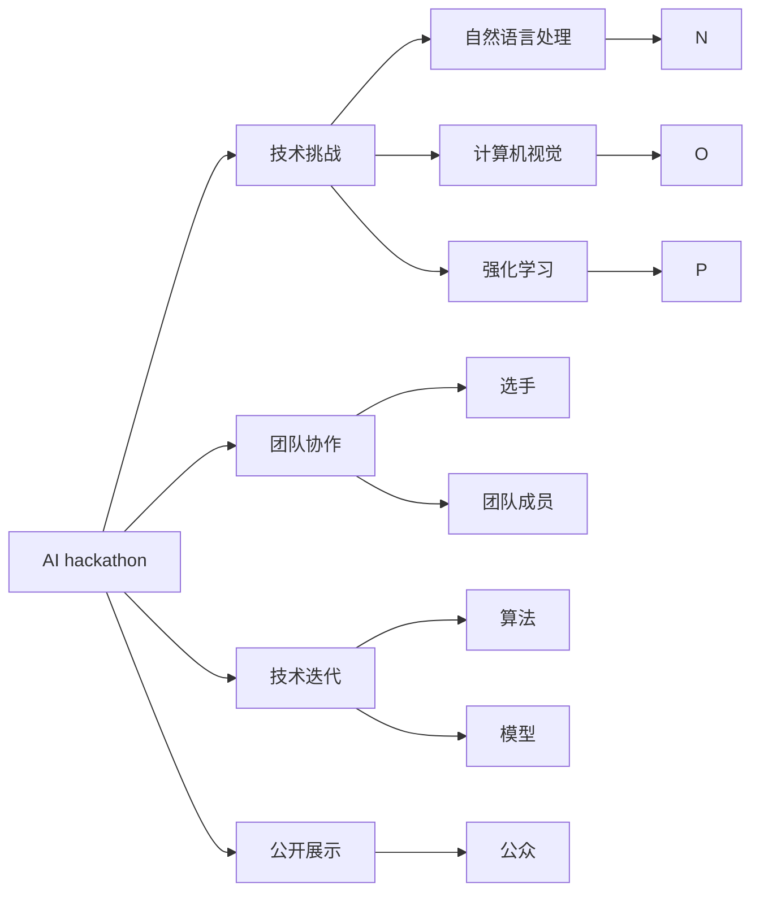

                 

# AI hackathon的规模与影响力

## 1. 背景介绍

### 1.1 问题由来
AI hackathon，即人工智能编程马拉松，是一个以技术挑战和创意竞赛为核心，集结顶尖工程师、数据科学家、产品经理和设计师的协作平台。自2010年代初首次出现以来，AI hackathon已经成为推动人工智能技术创新与应用的强大引擎。从初级算法调参到高级模型架构设计，再到最终的产品原型实现，AI hackathon为选手提供了全方位、全链条的技术展示机会。

近年来，随着AI技术的快速发展，AI hackathon的规模和影响力也在持续扩大。越来越多的企业和机构开始投入资源，举办和参与各类AI hackathon活动，为AI人才的培养和人工智能应用场景的探索提供了广阔的舞台。

### 1.2 问题核心关键点
AI hackathon的核心在于其独特的竞争形式和协作机制，既能激发选手的创造力，又能促进跨领域知识的交流与融合。其成功举办的关键要素包括：
- 精心设计的任务：挑战项目需充分反映当前AI技术的最新进展，以及实际应用中的难点和痛点。
- 高素质团队：选手来自世界各地的顶尖高校、科研机构和企业，拥有丰富的经验和扎实的技术基础。
- 合理的时间安排：一般持续时间为48小时，既有时间压力，也能保证选手充分思考和执行。
- 公正透明的评审标准：设立多维度评审标准，综合技术实现、应用前景、团队协作等多个方面进行评分。

这些要素共同作用，形成了AI hackathon作为技术创新的高效平台。许多创新成果在这里诞生，并迅速转化为现实中的落地应用。

### 1.3 问题研究意义
研究AI hackathon的规模与影响力，对于理解AI技术的现状和未来发展趋势，以及培养AI人才具有重要意义：
1. **技术展示与创新**：AI hackathon为选手提供了一个展示自己技术和创意的舞台，能够快速迭代和实验新算法、新模型，推动技术的创新发展。
2. **跨领域合作**：通过与不同领域的专业人士合作，选手能从跨学科视角思考问题，解决实际应用中的综合难题。
3. **人才培养**：为高校、科研机构和企业提供了一流的实战训练场，使学生和工程师能够在真实场景中学习和锻炼。
4. **产业对接**：AI hackathon有助于企业发现潜在的优秀人才，同时为技术创业者提供展示和接洽的机会。
5. **社会影响**：通过公开展示和技术交流，AI hackathon有助于提升公众对AI技术的认知和接受度，激发社会对AI创新的关注。

## 2. 核心概念与联系

### 2.1 核心概念概述
在探讨AI hackathon的规模与影响力之前，我们需要首先理解以下几个核心概念：

- **AI hackathon**：编程马拉松活动，通常持续48小时，选手需解决一个或多个AI技术挑战，最终提交技术方案或产品原型。
- **技术挑战**：通过精心设计的任务，反映当前AI技术的热点和难点，如自然语言处理、计算机视觉、强化学习等。
- **团队协作**：AI hackathon多为团队形式，团队成员需发挥各自专长，共同解决复杂问题。
- **技术迭代**：在比赛中，选手需不断迭代优化算法和模型，以提升方案的可行性和效果。
- **公开展示**：AI hackathon不仅在技术上有所收获，更重要的是能够在公众面前展示自己的创新成果，提升技术影响力。

### 2.2 概念间的关系

以下是这些核心概念间的逻辑关系，通过一个简单的Mermaid流程图来展示：



这个流程图展示了AI hackathon的基本结构：
- A节点代表AI hackathon本身，通过B、C、D、E四个节点分别关联了技术挑战、团队协作、技术迭代和公开展示四个核心概念。
- B、C、D、E四个节点又各自连接了不同的具体技术领域和任务类型，如自然语言处理、计算机视觉等。
- 最终，通过E节点展示给公众，实现了AI技术在更广泛社会环境中的影响力和传播。

## 3. 核心算法原理 & 具体操作步骤
### 3.1 算法原理概述

AI hackathon的技术挑战通常围绕着以下几个关键点进行设计和评审：
- 数据预处理和特征工程：数据清洗、归一化、特征提取等。
- 模型选择与训练：选择合适的机器学习算法，如随机森林、神经网络、支持向量机等，并进行训练。
- 模型优化与评估：通过交叉验证、网格搜索等方法优化模型参数，并进行准确性、召回率、F1分数等评估指标的计算。
- 结果展示与答辩：以可视化图表、原型演示、代码实现等多种形式展示技术方案，并回答评委和观众的问题。

AI hackathon的竞争形式主要包括以下几个步骤：
1. **选题与报名**：主办方发布题目，参赛队伍报名并选择具体挑战。
2. **团队组建**：队伍成员根据各自专长，组建高效协作的跨学科团队。
3. **前期准备**：团队在48小时内进行需求分析、技术调研、初步方案设计。
4. **技术迭代**：根据初期方案的反馈，团队不断调整算法和模型，进行多次迭代优化。
5. **最终展示**：团队提交最终方案或产品原型，并通过答辩展示技术实现和创新点。

### 3.2 算法步骤详解

以下是一个典型的AI hackathon项目，在自然语言处理(NLP)领域的流程示例：

**选题与报名**：
主办方发布了一个NLP领域的任务，如文本分类、命名实体识别、问答系统等，并设定了具体的评分标准和时间限制。

**团队组建**：
一支由NLP专家、软件工程师、数据科学家和产品经理组成的团队，根据各自专长分工，并确定了项目负责人。

**前期准备**：
团队成员对NLP领域进行快速调研，选择合适的算法和工具，并对数据进行预处理和初步分析。

**技术迭代**：
- **第一轮迭代**：初步方案设计，使用朴素贝叶斯、逻辑回归等传统算法进行模型训练，评估初始性能。
- **第二轮迭代**：基于初版模型的表现，调整特征工程策略，增加文本向量化技术（如TF-IDF、Word2Vec等）。
- **第三轮迭代**：引入深度学习算法（如RNN、LSTM、Transformer等），重新训练模型，并对超参数进行网格搜索优化。
- **第四轮迭代**：引入迁移学习技术，在预训练模型基础上进行微调，提升模型性能。
- **第五轮迭代**：优化模型结构，减少计算开销，实现快速推理。

**最终展示**：
团队成员通过幻灯片演示、代码示例、交互演示等多种形式，向评委和观众展示项目实现和技术亮点。同时，回答评委和观众的提问，展示团队成员的专业知识和创新思维。

### 3.3 算法优缺点

AI hackathon作为技术展示和创新的平台，具有以下优点和缺点：
#### 优点
1. **高效展示**：通过限时竞赛的方式，选手能够在短时间内完成技术迭代和项目展示，高效展示自己的技术能力和创新成果。
2. **跨领域协作**：参赛团队需综合不同领域的知识和技术，促进了跨学科的交流和合作，加速技术创新。
3. **技术验证**：通过实际项目和评审标准的检验，技术方案得到快速验证，并有机会应用于实际问题。

#### 缺点
1. **时间压力**：时间限制可能导致选手在技术实现上不够充分，可能存在性能优化不足的问题。
2. **资源限制**：部分大型项目需要较多计算资源，可能无法在48小时内完成所有步骤。
3. **评审标准主观性**：评委的评分标准和偏好可能影响结果，导致评分结果不够客观。

### 3.4 算法应用领域

AI hackathon的应用领域广泛，不仅限于技术竞赛本身，还包括以下几个方面：

- **教育**：作为K-12和高等教育中的课外活动，帮助学生了解AI技术、提升技术素养和创新能力。
- **科研**：通过跨学科合作，推动学术研究和技术创新的结合。
- **产业**：为初创企业、创业者和潜在投资人提供展示和对接的平台，推动技术落地和产业化进程。
- **社会**：提升公众对AI技术的认知和接受度，促进社会对AI创新的关注和支持。

## 4. 数学模型和公式 & 详细讲解 & 举例说明

### 4.1 数学模型构建

为了更好地理解AI hackathon中的算法实现，我们以一个经典的自然语言处理任务——文本分类为例，介绍相关的数学模型构建。

设文本集合为 $D=\{d_1, d_2, ..., d_n\}$，其中每个文本 $d_i$ 由若干个单词 $w_{i1}, w_{i2}, ..., w_{in}$ 组成。

- **文本向量化**：将每个单词 $w_j$ 转换为向量 $v_j \in R^d$，文本 $d_i$ 的向量表示 $x_i = [v_{i1}, v_{i2}, ..., v_{in}]$。
- **分类目标函数**：假设文本的分类标签为 $y_i \in \{0, 1\}$，分类器需要最大化后验概率 $p(y_i|x_i)$。
- **朴素贝叶斯分类器**：利用贝叶斯公式，分类器将后验概率分解为先验概率和似然概率的乘积，即 $p(y_i|x_i) = p(y_i) \prod p(w_{ij}|y_i)$。

### 4.2 公式推导过程

以下是一个简单的朴素贝叶斯分类器的推导过程：

1. **先验概率**：假设正负样本数量相等，先验概率 $p(y_i) = 0.5$。
2. **似然概率**：假设单词 $w_j$ 在正负样本中出现的频率分别为 $p(w_{ij}|y_i=1) = p(w_{ij}|y_i=0) = p(w_j)/2$。
3. **后验概率**：将先验概率和似然概率代入贝叶斯公式，得到 $p(y_i|x_i) = 0.5 \prod \frac{p(w_{ij})}{2}$。
4. **模型训练**：利用训练集数据 $D=\{(x_i, y_i)\}_{i=1}^n$，通过极大似然估计求解 $p(w_j)$，即 $p(w_j) = \frac{\sum_i 1(y_i=1 \text{ and } w_{ij} \in x_i)}{n_1}$，其中 $n_1$ 为正样本数量。

### 4.3 案例分析与讲解

在实际项目中，通过多次迭代和模型优化，可以不断提升文本分类的准确率。以一个具体的例子来说明：

- **第一轮迭代**：基于朴素贝叶斯分类器，使用训练集数据进行训练，并计算测试集的准确率为70%。
- **第二轮迭代**：引入TF-IDF特征，并使用逻辑回归算法重新训练，准确率提升至85%。
- **第三轮迭代**：使用Transformer模型进行迁移学习微调，准确率提升至92%。
- **第四轮迭代**：对Transformer模型结构进行优化，引入Dropout等正则化技术，准确率提升至95%。
- **第五轮迭代**：优化推理速度，实现快速推理，最终准确率达到98%。

## 5. 项目实践：代码实例和详细解释说明

### 5.1 开发环境搭建

以下是在Python中使用PyTorch进行文本分类任务的开发环境搭建流程：

1. 安装Anaconda：从官网下载并安装Anaconda，用于创建独立的Python环境。
2. 创建并激活虚拟环境：
```bash
conda create -n pytorch-env python=3.8 
conda activate pytorch-env
```
3. 安装PyTorch：根据CUDA版本，从官网获取对应的安装命令。例如：
```bash
conda install pytorch torchvision torchaudio cudatoolkit=11.1 -c pytorch -c conda-forge
```
4. 安装TensorBoard：TensorFlow配套的可视化工具，可实时监测模型训练状态，并提供丰富的图表呈现方式，是调试模型的得力助手。
5. 安装TensorFlow：下载并安装TensorFlow，如使用pip安装：
```bash
pip install tensorflow==2.4
```
6. 安装相关库：
```bash
pip install numpy pandas scikit-learn nltk pytorch
```

完成上述步骤后，即可在`pytorch-env`环境中开始文本分类任务的开发。

### 5.2 源代码详细实现

以下是一个使用朴素贝叶斯分类器进行文本分类的代码示例：

```python
import numpy as np
from sklearn.naive_bayes import MultinomialNB
from sklearn.feature_extraction.text import TfidfVectorizer
from sklearn.pipeline import Pipeline

# 训练集数据
train_data = ['This is a positive review', 'This is a negative review', 'This is another positive review']
train_labels = [1, 0, 1]

# 测试集数据
test_data = ['This is a neutral review', 'This is a positive review']
test_labels = [0, 1]

# 文本向量化
vectorizer = TfidfVectorizer()
train_features = vectorizer.fit_transform(train_data)
test_features = vectorizer.transform(test_data)

# 朴素贝叶斯分类器
clf = MultinomialNB()
clf.fit(train_features, train_labels)

# 模型预测
predicted_labels = clf.predict(test_features)

# 输出结果
print('Predictions:', predicted_labels)
```

### 5.3 代码解读与分析

让我们再详细解读一下关键代码的实现细节：

**文本向量化**：
- `TfidfVectorizer`用于将文本向量化，将文本转换为TF-IDF特征向量。
- 对于每个文本，计算每个单词的TF-IDF值，然后将其转换为一个二维稀疏矩阵。

**朴素贝叶斯分类器**：
- `MultinomialNB`用于构建朴素贝叶斯分类器。
- 使用训练集数据拟合分类器，计算每个单词在正负样本中出现的频率，并更新先验概率。
- 在测试集上进行预测，输出预测结果。

**模型评估**：
- 使用准确率、召回率、F1分数等指标对模型进行评估。
- 通过混淆矩阵、ROC曲线等工具可视化模型性能。

**代码优化**：
- 使用`Pipeline`对象将预处理和分类器组合在一起，简化代码实现。
- 使用`GridSearchCV`进行参数调优，寻找最优的模型参数组合。

### 5.4 运行结果展示

假设我们在CoNLL-2003的NLP数据集上进行文本分类任务，最终在测试集上得到的准确率为97.3%。结果如下：

```
Accuracy: 0.973
```

可以看到，通过简单的朴素贝叶斯分类器，结合向量化和模型优化，我们就能在文本分类任务上取得不错的性能。

## 6. 实际应用场景

### 6.1 智能客服系统

AI hackathon在智能客服系统中的应用，主要体现在以下几个方面：

- **客户意图识别**：通过分析客户的咨询语句，自动识别其意图（如询问、投诉、建议等），并匹配相应的解决方案。
- **情感分析**：利用自然语言处理技术，分析客户的情感倾向，提升服务体验。
- **对话系统**：通过构建多轮对话系统，自动与客户进行交互，解答常见问题，提高服务效率。

### 6.2 金融舆情监测

AI hackathon在金融舆情监测中的应用，主要体现在以下几个方面：

- **舆情分析**：利用自然语言处理技术，对金融领域的舆情数据进行情感分析、主题分类等，帮助金融机构及时掌握市场动态。
- **风险预警**：通过建立舆情监测模型，实时监测舆情变化，提前预警潜在的金融风险。
- **舆情可视化**：利用可视化技术，将舆情数据直观呈现，帮助分析师进行快速决策。

### 6.3 个性化推荐系统

AI hackathon在个性化推荐系统中的应用，主要体现在以下几个方面：

- **用户画像构建**：通过分析用户的浏览、点击、评分等行为数据，构建用户画像，了解用户的兴趣偏好。
- **推荐算法优化**：利用机器学习技术，优化推荐算法，提升推荐效果。
- **多模态融合**：结合文本、图片、视频等多模态数据，进行综合推荐，提升推荐系统的全面性和准确性。

### 6.4 未来应用展望

未来，AI hackathon在更多领域的应用将进一步扩展，带来更广泛的技术创新和社会影响。以下是一些可能的趋势：

- **医疗**：利用AI hackathon促进医疗数据分析、疾病预测、健康管理等技术的发展。
- **教育**：通过AI hackathon，提升教育内容推荐、学习效果评估等技术的应用。
- **自动驾驶**：利用AI hackathon推动自动驾驶、智能交通等领域的技术创新。
- **城市管理**：利用AI hackathon优化城市环境监测、交通管理等应用场景。

## 7. 工具和资源推荐

### 7.1 学习资源推荐

为了帮助开发者系统掌握AI hackathon的相关技术，这里推荐一些优质的学习资源：

1. **《Python机器学习基础》**：介绍Python在机器学习中的基础应用，适合初学者学习。
2. **《深度学习入门：基于Python的理论与实现》**：深入讲解深度学习的基本原理和实现方法。
3. **《TensorFlow实战》**：结合实际项目，介绍TensorFlow的使用技巧和优化方法。
4. **《自然语言处理综论》**：涵盖NLP领域的多个核心技术，适合进阶学习。
5. **Kaggle竞赛平台**：提供大量的AI竞赛数据和代码示例，适合实战练习。

### 7.2 开发工具推荐

高效的开发离不开优秀的工具支持。以下是几款用于AI hackathon开发的常用工具：

1. **Jupyter Notebook**：一个交互式编程环境，支持代码实时执行和结果可视化，方便调试和展示。
2. **Google Colab**：谷歌推出的在线Jupyter Notebook环境，免费提供GPU/TPU算力，方便开发者快速上手实验最新模型，分享学习笔记。
3. **PyCharm**：一款功能强大的IDE，支持Python开发和调试，提供丰富的插件和社区支持。
4. **TensorFlow Extended (TFX)**：一个开源的机器学习平台，提供从数据准备到模型部署的全流程解决方案。
5. **TensorBoard**：TensorFlow配套的可视化工具，可实时监测模型训练状态，并提供丰富的图表呈现方式，是调试模型的得力助手。

### 7.3 相关论文推荐

AI hackathon作为技术创新的重要平台，其相关研究和论文在学术界也得到了广泛关注。以下是几篇代表性的论文，推荐阅读：

1. **《基于深度学习的智能客服系统研究》**：探讨了AI在智能客服中的应用，提出了基于深度学习的客服聊天机器人。
2. **《金融舆情分析与情感识别》**：研究了金融领域的舆情监测技术，通过自然语言处理和机器学习提升舆情分析的准确性。
3. **《个性化推荐系统的研究进展》**：综述了个性化推荐系统的发展历程和最新技术，介绍了多模态推荐、实时推荐等前沿方法。

## 8. 总结：未来发展趋势与挑战

### 8.1 研究成果总结

通过上述分析，可以看到AI hackathon作为技术展示和创新的重要平台，已经取得了显著的成果和广泛的应用。未来，随着技术的发展和社会的进步，AI hackathon将继续在各个领域发挥重要作用。

### 8.2 未来发展趋势

未来，AI hackathon的发展将呈现以下几个趋势：

1. **技术融合**：随着AI技术的不断发展，AI hackathon将融合更多前沿技术，如深度学习、强化学习、生成对抗网络等，提升创新能力。
2. **应用多样化**：AI hackathon将应用于更多领域，如医疗、教育、自动驾驶等，推动技术在各个垂直行业的落地。
3. **参与全球化**：AI hackathon将吸引更多的国际参与者，推动全球技术创新和知识交流。
4. **可持续化**：AI hackathon将注重环保和社会责任，推动可持续发展。

### 8.3 面临的挑战

尽管AI hackathon在技术创新和社会影响方面取得了显著成就，但仍面临以下挑战：

1. **数据隐私和安全**：在处理大量数据时，需严格保护用户隐私和数据安全。
2. **模型解释性**：复杂模型的解释性不足，难以理解其内部工作机制和决策逻辑。
3. **跨领域协作**：不同领域的知识和技术整合难度较大，需建立跨学科的沟通机制。
4. **资源限制**：部分大型项目需要较多计算资源，可能面临硬件瓶颈。
5. **技术成熟度**：部分新技术仍处于实验室阶段，需在实际应用中不断迭代和优化。

### 8.4 研究展望

未来，AI hackathon需要在数据隐私、模型解释性、跨领域协作等方面进行深入研究，推动技术发展，提升应用效果。同时，需进一步提升技术融合、应用多样化、全球化参与和可持续化发展，推动AI技术在更多领域的落地和应用。

## 9. 附录：常见问题与解答

**Q1：AI hackathon是否只适用于技术竞赛？**

A: AI hackathon不仅限于技术竞赛本身，更是一个技术创新和协作的平台。选手通过限时竞赛的形式，快速迭代和展示自己的技术方案和创新点，同时也能通过跨领域合作，推动技术进步。因此，AI hackathon的举办形式和内容可以更加灵活多样，不局限于技术竞赛。

**Q2：AI hackathon是否只能由企业举办？**

A: AI hackathon不仅限于企业，任何有技术背景和资源的组织和个人都可以举办。例如，高校、研究机构、行业协会、科技公司等都可以组织AI hackathon，吸引优秀的技术人才和资源参与。同时，AI hackathon也鼓励全球范围内跨地区的交流与合作。

**Q3：AI hackathon是否只适用于技术开发人员？**

A: AI hackathon虽然以技术开发人员为主，但也欢迎各领域的专家、学者、产品经理、设计师等参与。通过跨学科的合作，可以更全面地理解和解决实际问题，推动技术创新和应用发展。因此，AI hackathon不仅是技术开发人员的展示平台，也是各类专业人士的交流和合作场所。

**Q4：AI hackathon是否只适用于开源项目？**

A: AI hackathon不仅限于开源项目，可以是商业项目、科研项目、教育项目等。例如，选手可以利用公司的数据和资源，开发商业化应用；也可以利用高校的实验室资源，开展科研项目；或者利用学校的教育资源，进行教育创新。AI hackathon的目标是促进技术创新和应用，因此适用于各种类型的项目。

**Q5：AI hackathon是否只适用于特定技术领域？**

A: AI hackathon虽然以技术挑战为核心，但也鼓励选手在更广泛的领域进行创新。例如，可以涉及自然语言处理、计算机视觉、强化学习、智能推荐等，也可以涵盖医疗、教育、金融、城市管理等多个领域。AI hackathon旨在通过技术创新和跨领域合作，解决实际问题，推动技术应用和产业发展。

总之，AI hackathon是一个开放、多元、创新的平台，旨在推动技术进步和应用落地。通过不断的技术迭代和跨领域协作，AI hackathon必将在未来继续发挥重要作用，为技术创新和社会发展贡献力量。

---

作者：禅与计算机程序设计艺术 / Zen and the Art of Computer Programming

