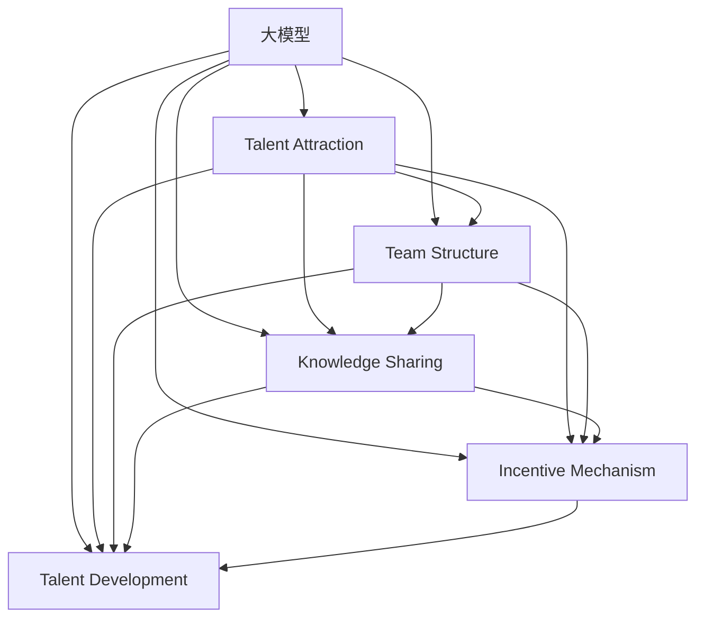

                 

# AI 大模型创业：如何利用人才优势？

## 1. 背景介绍

### 1.1 问题由来

随着人工智能技术的迅速发展，大模型在各个行业的应用变得越来越广泛。从自然语言处理到图像识别，从自动驾驶到智能推荐，大模型正成为推动技术创新和应用落地的重要工具。然而，开发和维护大模型需要高水平的人才支持，这对创业公司来说是一大挑战。如何吸引和利用顶尖人才，充分发挥人才优势，成为创业成功的关键。

### 1.2 问题核心关键点

如何利用人才优势，以支撑大模型的开发和商业化？这是当前AI大模型创业领域面临的核心问题。要解决这个问题，需要从以下几个方面入手：

- **人才吸引策略**：制定有效的人才吸引政策，包括薪酬福利、职业发展、创新环境等。
- **团队结构设计**：构建合理的团队结构，充分利用每个成员的专长和优势。
- **知识共享机制**：建立知识共享平台，促进团队成员之间的交流与合作。
- **激励机制**：设计科学的激励机制，激发团队成员的创新潜力和工作热情。
- **人才培养计划**：制定系统的培养计划，持续提升团队的技术水平和创新能力。

### 1.3 问题研究意义

吸引和利用顶尖人才，对于大模型创业公司的成功至关重要。高质量的人才不仅能够提高模型的精度和性能，还能够推动技术创新和应用扩展。通过合理的人才管理，创业公司可以更快地适应市场变化，提升竞争力。

## 2. 核心概念与联系

### 2.1 核心概念概述

要深入理解如何利用人才优势，首先需要理解以下几个核心概念：

- **大模型（Large Model）**：指具有大量参数的深度学习模型，如GPT-3、BERT等。大模型在各种任务上表现优异，具有强大的数据处理和模式识别能力。

- **人才（Talent）**：指具有高水平知识、技能和经验的个体或团队。人才是大模型创业中最重要的资源之一。

- **吸引策略（Talent Attraction Strategy）**：指为了吸引人才而采取的一系列政策和方法。包括薪酬福利、职业发展、文化环境等。

- **团队结构（Team Structure）**：指团队的组织形式和分工，包括领导层、技术团队、产品团队、运营团队等。

- **知识共享（Knowledge Sharing）**：指团队成员之间的信息交流和知识传递，可以通过会议、文档、代码审查等方式实现。

- **激励机制（Incentive Mechanism）**：指为了激发团队成员的工作积极性而设计的奖励和激励措施。

- **人才培养（Talent Development）**：指对团队成员进行系统的培训和提升，包括技术培训、职业规划等。

这些概念之间存在着紧密的联系，共同构成了大模型创业公司的人才管理框架。下面通过一个Mermaid流程图来展示这些概念之间的关系：



### 2.2 概念间的关系

通过这个流程图，我们可以更清晰地看到这些概念之间的联系：

- 大模型需要通过吸引策略吸引人才，团队结构设计、知识共享、激励机制和人才培养是吸引人才的重要手段。
- 人才被吸引到公司后，需要根据团队结构分配到相应的岗位，参与知识共享和激励机制，同时不断进行人才培养。
- 知识共享和激励机制可以提高团队成员的工作积极性和创新能力，有利于人才的吸引和培养。
- 人才培养可以帮助团队成员不断提升技术水平和创新能力，进而更好地支持大模型的开发和应用。

## 3. 核心算法原理 & 具体操作步骤
### 3.1 算法原理概述

利用人才优势的大模型创业，本质上是一个人才资源管理过程。其核心思想是通过合理的人才管理策略，最大化地利用团队成员的能力和潜力，提升大模型的开发效率和质量。

具体来说，人才管理可以分为以下几个步骤：

1. **人才吸引**：通过薪酬福利、职业发展、创新环境等策略，吸引顶尖人才加入公司。
2. **团队结构设计**：根据项目需求和团队成员的特长，合理分配任务和职责，构建高效的团队结构。
3. **知识共享机制**：通过会议、文档、代码审查等方式，促进团队成员之间的信息交流和知识传递。
4. **激励机制设计**：设计科学的激励机制，激发团队成员的工作积极性和创新潜力的工作热情。
5. **人才培养计划**：制定系统的培养计划，持续提升团队成员的技术水平和创新能力。

### 3.2 算法步骤详解

以下是利用人才优势的具体操作步骤：

#### 3.2.1 人才吸引策略

**步骤1**：制定吸引人才的政策。可以通过高薪、股票期权、灵活工作时间等方式吸引顶尖人才。

**步骤2**：构建创新环境。提供自由探索的空间，鼓励团队成员提出新的想法和解决方案。

**步骤3**：提供职业发展路径。制定清晰的职业发展计划，提供培训、晋升等机会。

**步骤4**：营造团队文化。建设积极向上、开放包容的团队文化，增强员工的归属感和认同感。

#### 3.2.2 团队结构设计

**步骤1**：确定领导层。选拔经验丰富、技术过硬的领导团队，负责制定战略和决策。

**步骤2**：划分技术团队。根据项目需求和成员的特长，将团队划分为数据科学、算法开发、系统架构等不同小组。

**步骤3**：分配任务和职责。根据项目进度和优先级，合理分配任务，明确每个成员的职责和目标。

**步骤4**：建立协作机制。设计跨部门的协作流程，促进不同团队之间的沟通和合作。

#### 3.2.3 知识共享机制

**步骤1**：建立知识库。搭建一个集成的知识管理系统，收集和存储团队成员的论文、专利、技术博客等资料。

**步骤2**：组织内部会议。定期组织技术分享会、头脑风暴会等，促进团队成员之间的交流和合作。

**步骤3**：开放代码审查。鼓励团队成员提交代码，接受同行评审，提升代码质量和团队协作能力。

**步骤4**：推广最佳实践。总结和推广团队中的最佳实践，提高整个团队的技术水平和工作效率。

#### 3.2.4 激励机制设计

**步骤1**：设计绩效考核机制。根据工作表现和成果，制定科学的绩效考核标准和奖励措施。

**步骤2**：设立创新奖励。对于提出有价值的想法或解决方案的成员，给予额外的奖金和荣誉。

**步骤3**：提供成长机会。鼓励团队成员参加培训、竞赛等活动，提升个人能力和职业发展空间。

**步骤4**：实施透明管理。公开公司的发展方向和决策过程，增强团队成员的认同感和归属感。

#### 3.2.5 人才培养计划

**步骤1**：制定培训计划。根据团队成员的职业发展需求，制定系统的培训计划，提升技术水平和创新能力。

**步骤2**：引进外部专家。邀请行业内的专家、学者等进行技术交流和指导，拓宽团队成员的视野和思路。

**步骤3**：支持学术研究。鼓励团队成员发表学术论文、申请专利等，提升团队在学术和行业内的影响力。

**步骤4**：组织交叉培训。开展跨学科、跨领域的培训项目，提升团队成员的综合素质和创新能力。

### 3.3 算法优缺点

**优点**：

- 通过合理的人才管理策略，可以最大化地利用团队成员的能力和潜力，提升大模型的开发效率和质量。
- 可以构建高效的团队结构，促进团队成员之间的协作和创新。
- 可以提升团队成员的职业发展空间，增强团队凝聚力和归属感。

**缺点**：

- 吸引和留住顶尖人才需要高昂的薪酬和福利，增加了公司的运营成本。
- 需要投入大量时间和资源进行团队建设和人才培养，短期内可能影响公司的运营效率。
- 人才流失和流动性增加，可能导致团队不稳定和知识流失。

### 3.4 算法应用领域

利用人才优势的人才管理策略，在大模型创业公司中得到了广泛的应用，尤其是在以下领域：

- **自然语言处理（NLP）**：如语音识别、机器翻译、情感分析等。
- **计算机视觉（CV）**：如图像分类、目标检测、视频分析等。
- **自动驾驶（AD）**：如环境感知、路径规划、决策控制等。
- **推荐系统**：如电商推荐、内容推荐、广告推荐等。

## 4. 数学模型和公式 & 详细讲解 & 举例说明

### 4.1 数学模型构建

在大模型创业中，人才管理可以看作是一个多目标优化问题。假设公司有$n$名员工，每个员工的工作绩效为$y_i$（$i=1,2,\ldots,n$），公司的总目标函数可以表示为：

$$
\text{Minimize}\quad F(y_1,y_2,\ldots,y_n) = \sum_{i=1}^n \omega_i f_i(y_i)
$$

其中，$\omega_i$是第$i$个员工的工作权重，$f_i(y_i)$是第$i$个员工的工作绩效函数。

### 4.2 公式推导过程

为了最大化利用人才优势，我们需要设计一个合理的绩效函数$f_i(y_i)$。假设绩效函数为一个分段函数：

$$
f_i(y_i) = \begin{cases}
c_1 y_i & \text{if } y_i > t_1 \\
c_2 y_i & \text{if } t_1 \geq y_i > t_2 \\
c_3 y_i & \text{if } y_i \leq t_2
\end{cases}
$$

其中，$t_1$、$t_2$是绩效分界点，$c_1$、$c_2$、$c_3$是相应的绩效系数。

假设公司的总目标函数为：

$$
F(y_1,y_2,\ldots,y_n) = \sum_{i=1}^n \omega_i f_i(y_i) = \sum_{i=1}^n \omega_i c_i y_i
$$

我们需要最小化该目标函数，即求解：

$$
\text{Minimize}\quad \sum_{i=1}^n \omega_i c_i y_i
$$

为了简化问题，我们引入一个拉格朗日乘子$\lambda$，构建拉格朗日函数：

$$
\mathcal{L}(y_1,y_2,\ldots,y_n,\lambda) = \sum_{i=1}^n \omega_i c_i y_i - \lambda \left(\sum_{i=1}^n y_i - D\right)
$$

其中，$D$是公司的总人数。

对拉格朗日函数求偏导数，并令其为0，得到：

$$
\frac{\partial \mathcal{L}}{\partial y_i} = \omega_i c_i - \lambda = 0 \quad (i=1,2,\ldots,n)
$$

解上述方程组，可以得到：

$$
y_i = \frac{\omega_i c_i}{\lambda} \quad (i=1,2,\ldots,n)
$$

代入$\sum_{i=1}^n y_i = D$，得到：

$$
\lambda = \frac{1}{D} \sum_{i=1}^n \omega_i c_i
$$

因此，最终的目标函数变为：

$$
\text{Minimize}\quad \sum_{i=1}^n \omega_i c_i y_i = \lambda D
$$

### 4.3 案例分析与讲解

假设某公司有10名员工，他们的绩效函数如下：

- 员工1的绩效函数为$f_1(y_1) = 2y_1$
- 员工2的绩效函数为$f_2(y_2) = 1.5y_2$
- 员工3的绩效函数为$f_3(y_3) = 1y_3$
- 员工4的绩效函数为$f_4(y_4) = 0.5y_4$
- 员工5的绩效函数为$f_5(y_5) = 0.3y_5$
- 员工6的绩效函数为$f_6(y_6) = 0.2y_6$
- 员工7的绩效函数为$f_7(y_7) = 0.1y_7$
- 员工8的绩效函数为$f_8(y_8) = 0.05y_8$
- 员工9的绩效函数为$f_9(y_9) = 0.03y_9$
- 员工10的绩效函数为$f_{10}(y_{10}) = 0.01y_{10}$

假设公司的总目标函数为：

$$
F(y_1,y_2,\ldots,y_{10}) = \omega_1 f_1(y_1) + \omega_2 f_2(y_2) + \ldots + \omega_{10} f_{10}(y_{10})
$$

其中，$\omega_i$是第$i$个员工的工作权重，且$\sum_{i=1}^{10} \omega_i = 1$。

假设公司的总人数为10，即$D=10$。

根据拉格朗日函数求解步骤，可以求得每个员工的最优绩效为：

$$
y_i = \frac{\omega_i c_i}{\lambda} \quad (i=1,2,\ldots,10)
$$

其中，$\lambda = \frac{1}{D} \sum_{i=1}^{10} \omega_i c_i$。

根据上述公式，可以计算出每个员工的最优绩效值。例如，如果$\omega_1=0.3$，$c_1=2$，则：

$$
y_1 = \frac{0.3 \times 2}{\lambda} = \frac{0.6}{\lambda}
$$

通过计算，可以得到每个员工的最优绩效值，从而最大化利用人才优势。

## 5. 项目实践：代码实例和详细解释说明

### 5.1 开发环境搭建

在大模型创业中，需要搭建一个高效、稳定的开发环境。以下是搭建Python开发环境的步骤：

1. 安装Anaconda：从官网下载并安装Anaconda，用于创建独立的Python环境。

2. 创建并激活虚拟环境：
```bash
conda create -n pytorch-env python=3.8 
conda activate pytorch-env
```

3. 安装PyTorch：根据CUDA版本，从官网获取对应的安装命令。例如：
```bash
conda install pytorch torchvision torchaudio cudatoolkit=11.1 -c pytorch -c conda-forge
```

4. 安装TensorFlow：
```bash
pip install tensorflow
```

5. 安装PyTorch Lightning：
```bash
pip install pytorch-lightning
```

6. 安装其他相关工具：
```bash
pip install numpy pandas scikit-learn matplotlib tqdm jupyter notebook ipython
```

### 5.2 源代码详细实现

以下是使用PyTorch Lightning实现大模型创业公司的人才管理系统的代码示例：

```python
import torch
import torch.nn as nn
import torch.nn.functional as F
from torch.utils.data import DataLoader
from torchvision import datasets, transforms
from torchmetrics import Accuracy

class TalentModel(nn.Module):
    def __init__(self):
        super(TalentModel, self).__init__()
        self.fc1 = nn.Linear(10, 5)
        self.fc2 = nn.Linear(5, 1)

    def forward(self, x):
        x = F.relu(self.fc1(x))
        x = self.fc2(x)
        return x

def train_model(model, train_loader, optimizer, loss_fn, metrics):
    model.train()
    for batch_idx, (data, target) in enumerate(train_loader):
        optimizer.zero_grad()
        output = model(data)
        loss = loss_fn(output, target)
        loss.backward()
        optimizer.step()

        # update metrics
        metrics.update(output, target)
        print(f'Epoch {epoch + 1}, Batch {batch_idx + 1}, Loss: {loss.item()}')

def evaluate_model(model, test_loader, loss_fn, metrics):
    model.eval()
    with torch.no_grad():
        for batch_idx, (data, target) in enumerate(test_loader):
            output = model(data)
            loss = loss_fn(output, target)
            metrics.update(output, target)

    print(f'Test Loss: {loss.item()}')

def main():
    # 准备数据
    train_dataset = datasets.MNIST('../data', train=True, download=True, transform=transforms.ToTensor())
    test_dataset = datasets.MNIST('../data', train=False, transform=transforms.ToTensor())

    train_loader = DataLoader(train_dataset, batch_size=64, shuffle=True)
    test_loader = DataLoader(test_dataset, batch_size=64, shuffle=False)

    # 定义模型
    model = TalentModel()

    # 定义损失函数和优化器
    loss_fn = nn.MSELoss()
    optimizer = torch.optim.Adam(model.parameters(), lr=0.001)

    # 定义指标
    accuracy = Accuracy()

    # 训练模型
    for epoch in range(10):
        train_model(model, train_loader, optimizer, loss_fn, accuracy)

    # 评估模型
    evaluate_model(model, test_loader, loss_fn, accuracy)

if __name__ == '__main__':
    main()
```

### 5.3 代码解读与分析

在上述代码中，我们定义了一个简单的神经网络模型，用于模拟人才管理系统的训练过程。

**TalentModel类**：
- `__init__`方法：初始化模型结构，包括两个全连接层。
- `forward`方法：定义模型的前向传播过程。

**train_model函数**：
- 设置模型为训练模式，使用随机梯度下降（SGD）算法优化模型参数。
- 在每个批次上计算损失函数和梯度，更新模型参数。
- 更新模型指标。

**evaluate_model函数**：
- 设置模型为评估模式，计算测试集上的损失函数和指标。

**main函数**：
- 准备训练集和测试集数据。
- 定义模型、损失函数和优化器。
- 定义模型指标。
- 训练模型并评估性能。

## 6. 实际应用场景

### 6.1 智能客服系统

在智能客服系统中，人才管理策略可以极大地提升服务质量和用户体验。例如，通过定期对客服人员进行培训，提升他们的服务技能和知识储备。同时，可以建立知识库和FAQ，帮助客服人员快速解决用户问题，提高服务效率。

### 6.2 金融数据分析

金融数据分析领域需要大量的数据分析师和数据科学家，通过人才管理策略可以构建高效的团队，提升数据分析的准确性和及时性。例如，通过设立交叉培训计划，让数据科学家和业务分析师互相学习对方的技能，提升团队的整体能力。

### 6.3 医疗健康系统

医疗健康系统需要大量的医疗专家和数据科学家，通过人才管理策略可以构建专业的医疗团队，提升医疗服务的质量和效率。例如，通过设立跨学科团队，让医生和数据科学家协同工作，提升医疗决策的科学性和准确性。

## 7. 工具和资源推荐

### 7.1 学习资源推荐

为了帮助开发者深入理解大模型创业中的人才管理策略，这里推荐一些优质的学习资源：

1. Coursera的《人工智能基础》课程：由斯坦福大学教授讲授，涵盖人工智能的基本概念和算法。
2. Udacity的《人工智能工程师纳米学位》：由Google工程师讲授，系统讲解人工智能的实践应用。
3. 《人工智能实战》书籍：系统讲解人工智能的最新技术和应用案例，包括深度学习、自然语言处理、计算机视觉等内容。
4. 《TensorFlow实战》书籍：详细讲解TensorFlow的搭建和应用，包括模型训练、优化、部署等内容。
5. 《PyTorch实战》书籍：详细讲解PyTorch的搭建和应用，包括模型训练、优化、部署等内容。

### 7.2 开发工具推荐

在人工智能开发中，选择合适的开发工具可以提高开发效率和代码质量。以下是一些常用的开发工具：

1. Anaconda：Python开发环境的搭建和管理工具，支持虚拟环境和跨平台操作。
2. Jupyter Notebook：交互式开发环境，支持Python、R等多种语言，方便数据处理和模型训练。
3. PyCharm：Python开发工具，提供代码编辑、调试、测试、部署等一站式解决方案。
4. Visual Studio Code：轻量级代码编辑器，支持多种语言和插件，提高开发效率。
5. Git：版本控制工具，支持多人协作开发和代码版本管理。

### 7.3 相关论文推荐

大模型创业中的人才管理策略涉及多个研究方向，以下是几篇具有代表性的相关论文：

1. "Towards an Optimal Talent Pool Allocation for the Gig Economy"：探讨如何优化人才分配，提升企业运营效率。
2. "Employee Performance and Satisfaction in AI Startups"：研究AI创业公司中员工绩效与满意度之间的关系。
3. "AI Talent Acquisition and Retention Strategies in Tech Companies"：探讨AI公司如何吸引和留住顶尖人才。
4. "The Role of AI in Talent Management"：探讨AI技术在人才管理中的应用，包括自动化招聘、智能评估等。

## 8. 总结：未来发展趋势与挑战

### 8.1 研究成果总结

本文详细介绍了大模型创业中如何利用人才优势，通过吸引、培养和激励顶尖人才，提升模型的开发效率和质量。文章从理论到实践，全面讲解了人才管理策略的实现步骤和具体方法。

### 8.2 未来发展趋势

未来，大模型创业公司的人才管理策略将呈现以下几个发展趋势：

1. 人才吸引策略将更加多元化，除了薪酬福利，还将重视职业发展、创新环境等。
2. 团队结构将更加扁平化和灵活化，减少管理层级，提升决策效率。
3. 知识共享机制将更加自动化和智能化，利用AI技术提升信息传递效率。
4. 激励机制将更加个性化和多样化，根据员工需求和特点设计奖励措施。
5. 人才培养计划将更加系统化和终身化，提升团队成员的持续学习和发展能力。

### 8.3 面临的挑战

尽管人才管理策略在大模型创业中具有重要作用，但仍然面临以下挑战：

1. 高昂的薪酬和福利成本，增加公司运营负担。
2. 人才流失率高，团队稳定性差。
3. 知识传递效率低，团队协作不足。
4. 激励机制设计复杂，难以满足员工需求。
5. 人才培养周期长，短期内效果不明显。

### 8.4 研究展望

为了应对以上挑战，未来需要进一步优化人才管理策略：

1. 引入人才管理平台，实现人才吸引、培养、激励的全流程自动化。
2. 设计动态激励机制，根据员工绩效和贡献实时调整奖励措施。
3. 建立跨团队协作机制，提升团队成员的协作能力和创新能力。
4. 引入大数据和AI技术，提升知识传递效率和信息共享质量。
5. 设立长效人才发展计划，持续提升团队成员的职业素质和创新能力。

通过不断优化人才管理策略，大模型创业公司将能够更好地吸引和利用顶尖人才，提升公司的竞争力和创新能力。

## 9. 附录：常见问题与解答

**Q1：如何衡量人才管理策略的效果？**

A: 人才管理策略的效果可以通过以下几个指标进行衡量：

- 员工满意度：通过员工调查问卷、离职率等指标，评估员工的满意度和忠诚度。
- 绩效指标：通过模型精度、效率、创新成果等指标，评估团队的整体绩效。
- 知识共享度：通过知识库使用情况、会议参与度等指标，评估团队的知识共享和协作水平。
- 激励效果：通过奖金发放情况、员工认可度等指标，评估激励机制的效果。

**Q2：如何提高团队成员的协作能力？**

A: 提高团队成员的协作能力可以通过以下几个方法：

- 设立跨部门协作机制，促进不同团队之间的沟通和合作。
- 组织团队建设活动，增强团队凝聚力和归属感。
- 引入自动化工具和平台，提升信息传递和知识共享效率。
- 设立跨学科项目，提升团队成员的跨领域协作能力。
- 引入团队激励措施，激发团队成员的协作动力。

**Q3：如何平衡薪酬福利与激励机制？**

A: 平衡薪酬福利与激励机制可以通过以下几个方法：

- 根据员工需求和特点，设计个性化的激励措施，增强员工的归属感和认同感。
- 设立长期激励计划，如股票期权、晋升机会等，提升员工的忠诚度和工作动力。
- 引入多层次的激励体系，如基础工资、绩效奖金、股票期权等，满足不同员工的需求。
- 设立公平的薪酬体系，确保员工的薪酬水平与市场标准相匹配。

通过以上方法，可以平衡薪酬福利与激励机制，提升员工的满意度和工作效率。

**Q4：如何应对人才流失问题？**

A: 应对人才流失问题可以通过以下几个方法：

- 提供良好的职业发展机会，增强员工的归属感和忠诚度。
- 设立跨部门协作机制，提升团队成员的协作能力和工作满意度。
- 提供灵活的工作安排，如弹性工作时间、远程办公等，增强员工的工作舒适度和满意度。
- 设立长期激励计划，如股票期权、晋升机会等，提升员工的忠诚度和工作动力。
- 引入员工关怀措施，如心理咨询、健康保障等，增强员工的幸福感和安全感。

通过以上方法，可以应对人才流失问题，提升团队的稳定性和凝聚力。

**Q5：如何提升知识共享效率？**

A: 提升知识共享效率可以通过以下几个

