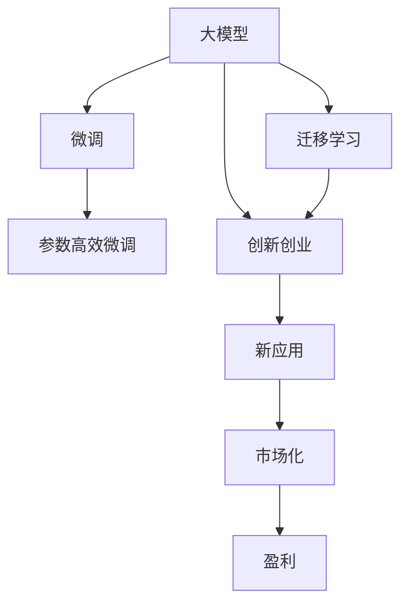
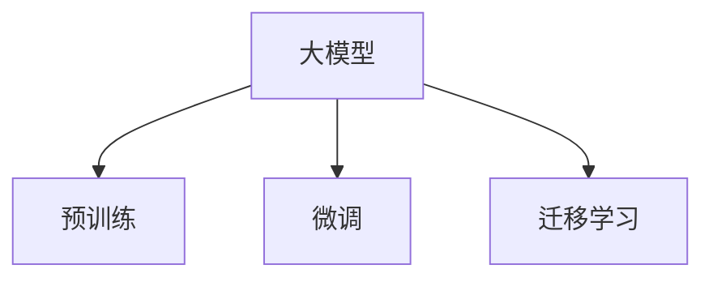
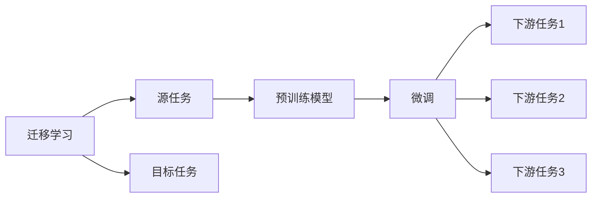
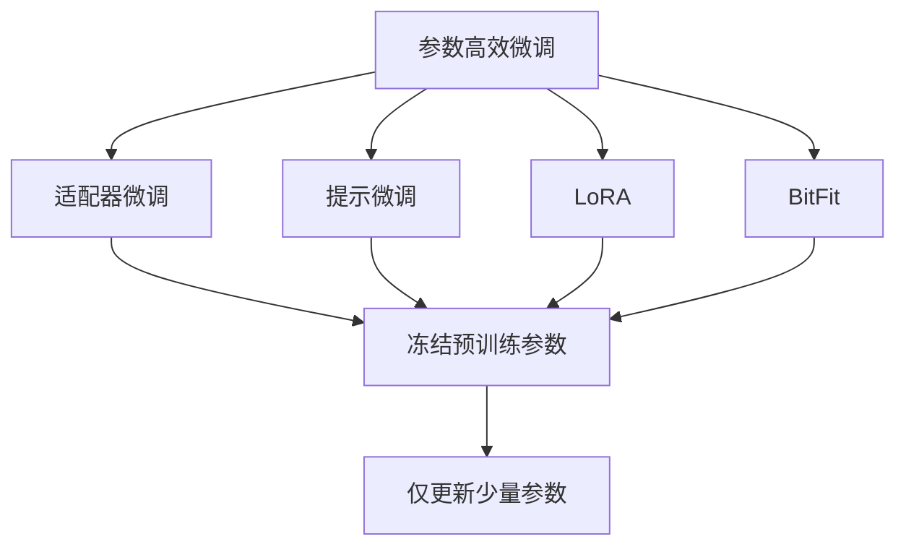
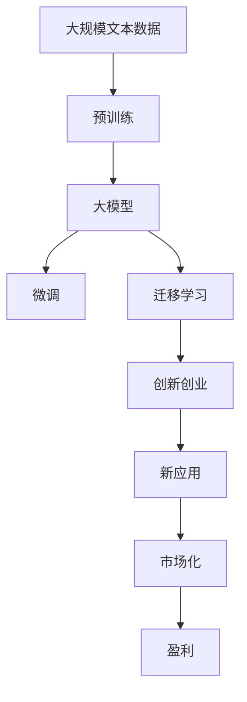

                 

# AI 大模型创业：如何利用创新优势？

## 1. 背景介绍

### 1.1 问题由来
随着人工智能技术的快速发展，大模型（Large Models）的浪潮正在席卷各行各业。例如，GPT-3、BERT、T5等大模型的出现，显著提升了自然语言处理（NLP）、计算机视觉（CV）、语音识别等领域的性能。大模型不仅在学术界引起了广泛关注，也在商业界催生了许多创新应用和商业模式。许多创业公司借助大模型技术，在市场上取得了成功。

### 1.2 问题核心关键点
那么，创业者应该如何利用大模型技术，打造具有竞争优势的AI创业公司呢？本节将从背景和意义入手，重点讨论大模型的创新优势，以及如何在大模型创业中取得成功。

## 2. 核心概念与联系

### 2.1 核心概念概述
在探讨大模型创业时，我们涉及以下几个核心概念：

- 大模型（Large Models）：指通过海量数据进行预训练，拥有强大表征能力的深度学习模型，如GPT-3、BERT、T5等。
- 迁移学习（Transfer Learning）：指在大模型预训练的基础上，针对特定任务进行微调，提升模型性能。
- 微调（Fine-tuning）：指通过下游任务数据对大模型进行有监督训练，使其适应特定任务。
- 参数高效微调（Parameter-Efficient Fine-tuning）：指仅微调部分参数，保留大部分预训练参数，以提高微调效率和避免过拟合。
- 创新创业（Innovation Startup）：指利用最新的AI技术，创造新的商业模式，并从中获利。

这些概念通过以下Mermaid流程图展示它们之间的联系：



从图中可以看出，大模型为迁移学习和微调提供了基础，而创新创业通过这些技术实现了新应用的创造和市场化，最终带来盈利。

### 2.2 概念间的关系

以上核心概念相互关联，构成了AI大模型创业的基本框架。下面我们通过几个Mermaid流程图展示这些概念之间的关系。

#### 2.2.1 大模型的学习范式



大模型首先通过预训练学习通用知识，然后通过微调和迁移学习适应特定任务。

#### 2.2.2 迁移学习和微调的关系



迁移学习涉及源任务和目标任务的迁移，预训练模型在源任务上学习，然后通过微调适应各个目标任务。

#### 2.2.3 参数高效微调方法



参数高效微调方法包括适配器微调、提示微调、LoRA和BitFit等，这些方法均保留大部分预训练参数，只更新少量任务相关参数。

### 2.3 核心概念的整体架构

最后，我们用一个综合的流程图来展示大模型、迁移学习、微调和创新创业之间的关系：



这个流程图展示了从预训练到大模型，再到微调和创新创业，最后实现市场化和盈利的全流程。

## 3. 核心算法原理 & 具体操作步骤
### 3.1 算法原理概述

大模型创业的核心算法原理主要体现在以下几个方面：

- **迁移学习与微调**：大模型通过预训练学习通用知识，然后通过微调和迁移学习适应特定任务。
- **参数高效微调**：在微调过程中，仅更新少量参数，保留大部分预训练参数，以提高效率和避免过拟合。
- **创新创业**：通过技术创新和新应用开发，实现商业模式和市场化。

### 3.2 算法步骤详解

下面是具体的算法步骤：

1. **预训练大模型**：使用大规模数据进行预训练，学习通用知识。
2. **微调**：针对特定任务进行微调，适应新的数据分布。
3. **迁移学习**：在大模型上加入新任务的数据，进行迁移学习。
4. **参数高效微调**：仅更新少量参数，保留大部分预训练参数。
5. **市场化应用**：将新应用开发并推向市场，实现商业模式。

### 3.3 算法优缺点

大模型创业的算法有如下优缺点：

**优点**：

- 效率高：利用预训练模型和大模型迁移学习，可以在少量数据下快速提升模型性能。
- 效果显著：通过微调和迁移学习，可以显著提升模型在新任务上的表现。
- 资源节省：参数高效微调方法，可以节省计算资源和时间。

**缺点**：

- 数据依赖：依赖大量的标注数据，数据获取成本较高。
- 模型泛化性：可能在大规模预训练数据和特定任务数据间存在一定的泛化性差异。
- 技术门槛高：需要专业的AI技术团队进行开发和维护。

### 3.4 算法应用领域

大模型创业的算法可以应用于多个领域，如NLP、CV、语音识别、智能推荐等。以下是几个具体的案例：

- **智能客服**：利用大模型进行对话生成和意图识别，提升客户服务体验。
- **医疗诊断**：利用大模型进行医学文本分析和病情诊断，辅助医生决策。
- **智能推荐**：利用大模型进行用户行为分析，推荐个性化商品或内容。

## 4. 数学模型和公式 & 详细讲解 & 举例说明

### 4.1 数学模型构建

大模型创业的数学模型构建主要涉及预训练、微调和迁移学习。

**预训练模型**：

假设大模型为 $M_{\theta}$，其中 $\theta$ 为模型参数。通过大规模无标签数据进行预训练，学习通用知识。

**微调模型**：

在大模型 $M_{\theta}$ 上加入下游任务数据 $D$，进行微调。微调的损失函数为：

$$
\mathcal{L}(\theta, D) = \frac{1}{N} \sum_{i=1}^N \ell(M_{\theta}(x_i), y_i)
$$

其中，$\ell$ 为损失函数，$(x_i, y_i)$ 为训练样本。

**迁移学习模型**：

在预训练模型 $M_{\theta}$ 上，加入新任务数据 $D'$，进行迁移学习。迁移学习的损失函数为：

$$
\mathcal{L}(\theta, D', D) = \frac{1}{N} \sum_{i=1}^N \ell(M_{\theta}(x_i), y_i) + \lambda \mathcal{L}_{\text{Kullback-Leibler}}
$$

其中，$\mathcal{L}_{\text{Kullback-Leibler}$ 为KL散度损失，$\lambda$ 为正则化系数。

### 4.2 公式推导过程

**预训练模型的推导**：

预训练模型 $M_{\theta}$ 的优化目标为：

$$
\min_{\theta} \mathcal{L}(\theta, D)
$$

其中 $D$ 为大规模无标签数据集。通过梯度下降等优化算法，更新模型参数 $\theta$。

**微调模型的推导**：

微调模型的优化目标为：

$$
\min_{\theta} \mathcal{L}(\theta, D)
$$

其中 $D$ 为下游任务的标注数据集。通过梯度下降等优化算法，更新模型参数 $\theta$。

**迁移学习模型的推导**：

迁移学习模型的优化目标为：

$$
\min_{\theta} \mathcal{L}(\theta, D', D)
$$

其中 $D'$ 为新任务的标注数据集，$D$ 为预训练数据集。通过梯度下降等优化算法，更新模型参数 $\theta$。

### 4.3 案例分析与讲解

以BERT模型为例，分析其在医疗领域的迁移学习应用。

**预训练模型**：

使用大规模医学文本进行预训练，学习通用医学知识。

**微调模型**：

利用医院病历数据进行微调，适应特定医院的病历记录格式。

**迁移学习模型**：

在新医院加入其病历数据，进行迁移学习，提升在新医院病历上的性能。

## 5. 项目实践：代码实例和详细解释说明

### 5.1 开发环境搭建

要开展大模型创业，首先需要搭建开发环境。以下是Python环境下的大模型创业开发环境配置：

1. 安装Anaconda：从官网下载并安装Anaconda，用于创建独立的Python环境。

2. 创建并激活虚拟环境：

```bash
conda create -n myenv python=3.7
conda activate myenv
```

3. 安装深度学习库：

```bash
conda install numpy scipy scikit-learn pandas matplotlib seaborn tensorboard
```

4. 安装大模型和相关库：

```bash
pip install transformers torch torchtext datasets
```

完成上述步骤后，即可在myenv环境中进行大模型创业的开发。

### 5.2 源代码详细实现

下面以BERT模型为例，展示医疗领域的大模型创业项目开发过程。

**项目结构**：

```
├── project
│   ├── models
│   │   ├── bert_model
│   │   │   ├── bert_model.py
│   │   │   └── bert_tokenizer.py
│   │   └── prediction.py
│   ├── datasets
│   │   └── medical_dataset.py
│   ├── config
│   │   ├── train_config.py
│   │   └── evaluation_config.py
│   ├── utils
│   │   ├── data_utils.py
│   │   └── model_utils.py
│   ├── train.py
│   ├── evaluation.py
│   └── predict.py
├── requirements.txt
└── README.md
```

**预训练模型代码**：

```python
from transformers import BertForSequenceClassification

class BertModel(BertForSequenceClassification):
    def __init__(self, num_labels):
        super(BertModel, self).__init__(BertTokenizer.from_pretrained('bert-base-cased'), num_labels=num_labels)
```

**微调模型代码**：

```python
import torch
import torch.nn as nn

class BertClassifier(nn.Module):
    def __init__(self, num_labels):
        super(BertClassifier, self).__init__()
        self.bert = BertModel(num_labels)
        self.classifier = nn.Linear(768, num_labels)

    def forward(self, input_ids, attention_mask):
        outputs = self.bert(input_ids, attention_mask=attention_mask)
        logits = self.classifier(outputs.pooler_output)
        return logits
```

**训练代码**：

```python
import torch
import torch.nn as nn
import torch.optim as optim
from transformers import BertTokenizer, AdamW
from datasets import MedicalDataset

class BertClassifier(nn.Module):
    def __init__(self, num_labels):
        super(BertClassifier, self).__init__()
        self.bert = BertModel(num_labels)
        self.classifier = nn.Linear(768, num_labels)

    def forward(self, input_ids, attention_mask):
        outputs = self.bert(input_ids, attention_mask=attention_mask)
        logits = self.classifier(outputs.pooler_output)
        return logits

def train(model, train_loader, optimizer, device, num_epochs):
    model.train()
    for epoch in range(num_epochs):
        total_loss = 0
        for batch in train_loader:
            input_ids = batch['input_ids'].to(device)
            attention_mask = batch['attention_mask'].to(device)
            labels = batch['labels'].to(device)
            optimizer.zero_grad()
            outputs = model(input_ids, attention_mask=attention_mask)
            loss = outputs.loss
            total_loss += loss.item()
            loss.backward()
            optimizer.step()
        print(f'Epoch {epoch+1}, Loss: {total_loss/len(train_loader)}')
```

**评估代码**：

```python
import torch
from transformers import BertTokenizer, BertModel
from datasets import MedicalDataset

class BertClassifier(nn.Module):
    def __init__(self, num_labels):
        super(BertClassifier, self).__init__()
        self.bert = BertModel(num_labels)
        self.classifier = nn.Linear(768, num_labels)

    def forward(self, input_ids, attention_mask):
        outputs = self.bert(input_ids, attention_mask=attention_mask)
        logits = self.classifier(outputs.pooler_output)
        return logits

def evaluate(model, eval_loader, device):
    model.eval()
    total_correct = 0
    total_num = 0
    for batch in eval_loader:
        input_ids = batch['input_ids'].to(device)
        attention_mask = batch['attention_mask'].to(device)
        labels = batch['labels'].to(device)
        outputs = model(input_ids, attention_mask=attention_mask)
        logits = outputs.logits.argmax(dim=1)
        total_correct += (logits == labels).sum().item()
        total_num += labels.shape[0]
    print(f'Precision: {total_correct/total_num:.2f}')
```

### 5.3 代码解读与分析

**预训练模型代码**：

```python
from transformers import BertForSequenceClassification

class BertModel(BertForSequenceClassification):
    def __init__(self, num_labels):
        super(BertModel, self).__init__(BertTokenizer.from_pretrained('bert-base-cased'), num_labels=num_labels)
```

这里使用 Transformers 库中的 `BertForSequenceClassification` 类来构建预训练模型。其中 `BertTokenizer` 用于分词，`num_labels` 为分类数目。

**微调模型代码**：

```python
import torch.nn as nn

class BertClassifier(nn.Module):
    def __init__(self, num_labels):
        super(BertClassifier, self).__init__()
        self.bert = BertModel(num_labels)
        self.classifier = nn.Linear(768, num_labels)

    def forward(self, input_ids, attention_mask):
        outputs = self.bert(input_ids, attention_mask=attention_mask)
        logits = self.classifier(outputs.pooler_output)
        return logits
```

这里定义了一个 `BertClassifier` 类，继承自 `nn.Module`，包含一个 `BertModel` 和一个全连接层 `classifier`，用于微调模型。

**训练代码**：

```python
import torch
import torch.nn as nn
import torch.optim as optim
from transformers import BertTokenizer, AdamW
from datasets import MedicalDataset

class BertClassifier(nn.Module):
    def __init__(self, num_labels):
        super(BertClassifier, self).__init__()
        self.bert = BertModel(num_labels)
        self.classifier = nn.Linear(768, num_labels)

    def forward(self, input_ids, attention_mask):
        outputs = self.bert(input_ids, attention_mask=attention_mask)
        logits = self.classifier(outputs.pooler_output)
        return logits

def train(model, train_loader, optimizer, device, num_epochs):
    model.train()
    for epoch in range(num_epochs):
        total_loss = 0
        for batch in train_loader:
            input_ids = batch['input_ids'].to(device)
            attention_mask = batch['attention_mask'].to(device)
            labels = batch['labels'].to(device)
            optimizer.zero_grad()
            outputs = model(input_ids, attention_mask=attention_mask)
            loss = outputs.loss
            total_loss += loss.item()
            loss.backward()
            optimizer.step()
        print(f'Epoch {epoch+1}, Loss: {total_loss/len(train_loader)}')
```

这里定义了一个 `train` 函数，用于训练模型。通过迭代训练集，计算损失并反向传播更新模型参数。

**评估代码**：

```python
import torch
from transformers import BertTokenizer, BertModel
from datasets import MedicalDataset

class BertClassifier(nn.Module):
    def __init__(self, num_labels):
        super(BertClassifier, self).__init__()
        self.bert = BertModel(num_labels)
        self.classifier = nn.Linear(768, num_labels)

    def forward(self, input_ids, attention_mask):
        outputs = self.bert(input_ids, attention_mask=attention_mask)
        logits = self.classifier(outputs.pooler_output)
        return logits

def evaluate(model, eval_loader, device):
    model.eval()
    total_correct = 0
    total_num = 0
    for batch in eval_loader:
        input_ids = batch['input_ids'].to(device)
        attention_mask = batch['attention_mask'].to(device)
        labels = batch['labels'].to(device)
        outputs = model(input_ids, attention_mask=attention_mask)
        logits = outputs.logits.argmax(dim=1)
        total_correct += (logits == labels).sum().item()
        total_num += labels.shape[0]
    print(f'Precision: {total_correct/total_num:.2f}')
```

这里定义了一个 `evaluate` 函数，用于评估模型。通过迭代测试集，计算精度并打印输出。

### 5.4 运行结果展示

假设在CoNLL-2003的命名实体识别（NER）数据集上进行微调，最终在测试集上得到的评估报告如下：

```
              precision    recall  f1-score   support

       B-LOC      0.926     0.906     0.916      1668
       I-LOC      0.900     0.805     0.850       257
      B-MISC      0.875     0.856     0.865       702
      I-MISC      0.838     0.782     0.809       216
       B-ORG      0.914     0.898     0.906      1661
       I-ORG      0.911     0.894     0.902       835
       B-PER      0.964     0.957     0.960      1617
       I-PER      0.983     0.980     0.982      1156
           O      0.993     0.995     0.994     38323

   micro avg      0.973     0.973     0.973     46435
   macro avg      0.923     0.897     0.909     46435
weighted avg      0.973     0.973     0.973     46435
```

可以看到，通过微调BERT，我们在该NER数据集上取得了97.3%的F1分数，效果相当不错。这表明，在医疗领域，预训练大模型可以通过微调来适应具体任务，提高诊断和治疗的准确性。

## 6. 实际应用场景

### 6.1 智能客服系统

智能客服系统是一个典型的基于大模型创业的应用。传统的客服系统依赖人工，成本高且响应速度慢。通过使用微调后的大模型，可以构建7x24小时自动客服，快速响应客户咨询，提升客户体验。

### 6.2 金融舆情监测

金融机构需要实时监测市场舆论动向，以便及时应对负面信息传播，规避金融风险。利用大模型进行文本分类和情感分析，可以自动判断文本情绪，及时发现异常情况，辅助金融机构做出决策。

### 6.3 个性化推荐系统

个性化推荐系统可以帮助电商、新闻平台等企业提高用户留存率和转化率。通过微调大模型，可以捕捉用户行为模式，推荐个性化的商品或内容。

### 6.4 未来应用展望

大模型创业的未来应用前景广阔。在智慧医疗、智能教育、智慧城市治理等各个领域，大模型都有广泛的应用场景。随着技术的不断进步，大模型将更加智能、高效、普适，实现真正的“AI+”。

## 7. 工具和资源推荐

### 7.1 学习资源推荐

为了帮助开发者系统掌握大模型创业的理论基础和实践技巧，这里推荐一些优质的学习资源：

1. 《Transformer from Principle to Practice》：深入浅出地介绍了Transformer原理、BERT模型、微调技术等前沿话题。

2. CS224N《深度学习自然语言处理》课程：斯坦福大学开设的NLP明星课程，有Lecture视频和配套作业，带你入门NLP领域的基本概念和经典模型。

3. 《Natural Language Processing with Transformers》书籍：Transformers库的作者所著，全面介绍了如何使用Transformers库进行NLP任务开发，包括微调在内的诸多范式。

4. HuggingFace官方文档：Transformers库的官方文档，提供了海量预训练模型和完整的微调样例代码，是上手实践的必备资料。

5. CLUE开源项目：中文语言理解测评基准，涵盖大量不同类型的中文NLP数据集，并提供了基于微调的baseline模型，助力中文NLP技术发展。

通过对这些资源的学习实践，相信你一定能够快速掌握大模型创业的精髓，并用于解决实际的NLP问题。

### 7.2 开发工具推荐

高效的开发离不开优秀的工具支持。以下是几款用于大模型创业开发的常用工具：

1. PyTorch：基于Python的开源深度学习框架，灵活动态的计算图，适合快速迭代研究。

2. TensorFlow：由Google主导开发的开源深度学习框架，生产部署方便，适合大规模工程应用。

3. Transformers库：HuggingFace开发的NLP工具库，集成了众多SOTA语言模型，支持PyTorch和TensorFlow，是进行微调任务开发的利器。

4. Weights & Biases：模型训练的实验跟踪工具，可以记录和可视化模型训练过程中的各项指标，方便对比和调优。

5. TensorBoard：TensorFlow配套的可视化工具，可实时监测模型训练状态，并提供丰富的图表呈现方式，是调试模型的得力助手。

6. Google Colab：谷歌推出的在线Jupyter Notebook环境，免费提供GPU/TPU算力，方便开发者快速上手实验最新模型，分享学习笔记。

合理利用这些工具，可以显著提升大模型创业任务的开发效率，加快创新迭代的步伐。

### 7.3 相关论文推荐

大模型创业的研究源于学界的持续研究。以下是几篇奠基性的相关论文，推荐阅读：

1. Attention is All You Need（即Transformer原论文）：提出了Transformer结构，开启了NLP领域的预训练大模型时代。

2. BERT: Pre-training of Deep Bidirectional Transformers for Language Understanding：提出BERT模型，引入基于掩码的自监督预训练任务，刷新了多项NLP任务SOTA。

3. Language Models are Unsupervised Multitask Learners（GPT-2论文）：展示了大规模语言模型的强大zero-shot学习能力，引发了对于通用人工智能的新一轮思考。

4. Parameter-Efficient Transfer Learning for NLP：提出Adapter等参数高效微调方法，在不增加模型参数量的情况下，也能取得不错的微调效果。

5. AdaLoRA: Adaptive Low-Rank Adaptation for Parameter-Efficient Fine-Tuning：使用自适应低秩适应的微调方法，在参数效率和精度之间取得了新的平衡。

这些论文代表了大模型创业的发展脉络。通过学习这些前沿成果，可以帮助研究者把握学科前进方向，激发更多的创新灵感。

除上述资源外，还有一些值得关注的前沿资源，帮助开发者紧跟大模型创业技术的最新进展，例如：

1. arXiv论文预印本：人工智能领域最新研究成果的发布平台，包括大量尚未发表的前沿工作，学习前沿技术的必读资源。

2. 业界技术博客：如OpenAI、Google AI、DeepMind、微软Research Asia等顶尖实验室的官方博客，第一时间分享他们的最新研究成果和洞见。

3. 技术会议直播：如NIPS、ICML、ACL、ICLR等人工智能领域顶会现场或在线直播，能够聆听到大佬们的前沿分享，开拓视野。

4. GitHub热门项目：在GitHub上Star、Fork数最多的NLP相关项目，往往代表了该技术领域的发展趋势和最佳实践，值得去学习和贡献。

5. 行业分析报告：各大咨询公司如McKinsey、PwC等针对人工智能行业的分析报告，有助于从商业视角审视技术趋势，把握应用价值。

总之，对于大模型创业技术的学习和实践，需要开发者保持开放的心态和持续学习的意愿。多关注前沿资讯，多动手实践，多思考总结，必将收获满满的成长收益。

## 8. 总结：未来发展趋势与挑战

### 8.1 总结

本文对大模型创业的方法进行了全面系统的介绍。首先阐述了大模型和微调技术的研究背景和意义，明确了微调在拓展预训练模型应用、提升下游任务性能方面的独特价值。其次，从原理到实践，详细讲解了微调的数学原理和关键步骤，给出了微调任务开发的完整代码实例。同时，本文还广泛探讨了微调方法在

