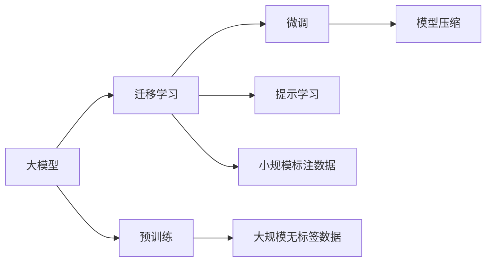
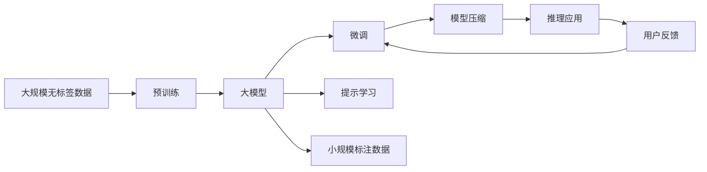

                 

## 1. 背景介绍

### 1.1 问题由来

在人工智能（AI）领域，大模型（Large Models）技术正迅速崛起。大模型，尤其是基于深度学习的预训练大模型，拥有丰富的语义表达和上下文理解能力，已经在多个领域展现出强大的应用潜力。然而，随着大模型技术的发展，创业公司如何利用这一技术优势，尤其是在早期创业阶段，成为了一个亟需解决的问题。本文将探讨如何通过充分利用用户优势，在大模型创业中取得成功。

### 1.2 问题核心关键点

利用用户优势在大模型创业中的核心关键点包括：

- 数据获取：如何在有限的资源下，获取高质量的训练数据，以便进行有效的大模型训练。
- 模型优化：如何通过精细化的模型设计和参数调整，在大模型上实现高效的训练和推理。
- 应用场景：如何将大模型技术应用于实际业务中，最大化其商业价值。
- 市场定位：如何准确地进行市场定位，以满足目标用户的需求，同时区分于竞争对手。

### 1.3 问题研究意义

利用用户优势在大模型创业中，具有重要意义：

- **降低成本**：高质量的大模型训练需要大量数据和计算资源，通过利用用户数据，可以减少这些成本。
- **提升性能**：用户数据往往具有更高的代表性，利用这些数据可以提升模型的性能和泛化能力。
- **加速迭代**：用户反馈可以帮助快速迭代模型，提高产品的适应性和竞争力。
- **增强市场认可**：利用用户优势可以更好地满足市场需求，提高产品的市场认可度和用户粘性。

## 2. 核心概念与联系

### 2.1 核心概念概述

- **大模型（Large Model）**：指通过大规模数据预训练得到的深度学习模型，通常具有较高的复杂度和丰富的语义表达能力。
- **迁移学习（Transfer Learning）**：指将在大规模数据上预训练得到的模型知识，迁移到小规模数据上，以提升模型在小数据集上的性能。
- **预训练（Pre-training）**：指在大规模无标签数据上训练模型，以学习到通用的语言表示和知识。
- **微调（Fine-tuning）**：指在大规模预训练模型基础上，针对特定任务进行参数更新，以优化模型在特定任务上的表现。
- **提示学习（Prompt Learning）**：指通过设计特定的提示文本，引导模型进行特定的推理和生成。
- **模型压缩（Model Compression）**：指在大模型基础上，通过剪枝、量化等方法，减少模型大小和计算资源消耗，提升模型推理速度。

### 2.2 概念间的关系

这些核心概念之间存在着密切的联系，形成了一个完整的模型训练和应用框架。以下是它们之间的关系：



从图中可以看出，大模型首先通过预训练学习到通用的语言表示（C），然后通过迁移学习（B）将知识迁移到特定任务上，最后通过微调（D）和提示学习（E）进行参数优化，以适应特定的应用场景（H）。同时，为了提升模型的推理速度和资源利用效率，可以通过模型压缩（F）对大模型进行优化。

### 2.3 核心概念的整体架构

综合以上概念，可以构建一个完整的模型训练和应用框架，如下所示：



这个架构展示了大模型从预训练到推理应用的完整过程，以及如何通过微调和提示学习来提升模型性能。

## 3. 核心算法原理 & 具体操作步骤

### 3.1 算法原理概述

利用用户优势在大模型创业中的核心算法原理，主要基于迁移学习和大规模数据训练的理念。具体来说，通过在大模型基础上进行微调或提示学习，利用用户数据来优化模型，以适应特定任务，从而提升模型的性能和商业价值。

### 3.2 算法步骤详解

以下是利用用户优势在大模型创业中的详细步骤：

1. **数据获取**：收集用户的标注数据，确保数据的质量和多样性。数据收集可以从现有的数据集中筛选、购买或与用户合作获取。
2. **模型选择**：选择合适的预训练模型，如BERT、GPT等，作为基础模型。
3. **微调或提示学习**：在预训练模型上，进行微调或提示学习，以适应特定任务。微调时，需要选择合适的任务适配层和损失函数，进行参数更新。提示学习时，需要设计合适的提示文本，引导模型进行推理和生成。
4. **模型优化**：对微调或提示学习后的模型进行优化，如剪枝、量化等，以提升推理速度和资源利用效率。
5. **应用部署**：将优化后的模型部署到实际应用中，如问答系统、文本生成、情感分析等。

### 3.3 算法优缺点

利用用户优势在大模型创业中的算法优点包括：

- **高效训练**：利用用户数据进行微调或提示学习，可以大幅减少训练时间和计算资源消耗。
- **性能提升**：用户数据往往更具代表性，能够提升模型在特定任务上的性能和泛化能力。
- **快速迭代**：用户反馈可以快速迭代模型，提高产品的适应性和市场竞争力。

同时，也存在一些缺点：

- **数据隐私**：收集用户数据可能涉及隐私问题，需要严格遵守数据保护法规。
- **数据质量**：用户数据质量参差不齐，可能影响模型性能。
- **依赖用户**：过于依赖用户数据，可能限制了模型的广泛应用和泛化能力。

### 3.4 算法应用领域

利用用户优势在大模型创业中，可以在多个领域进行应用，例如：

- **自然语言处理（NLP）**：利用用户标注的数据，进行情感分析、文本分类、问答系统等NLP任务的微调或提示学习。
- **计算机视觉（CV）**：利用用户标注的数据，进行图像分类、目标检测、图像生成等CV任务的微调或提示学习。
- **语音识别（ASR）**：利用用户标注的数据，进行语音识别、语音合成、情感识别等ASR任务的微调或提示学习。
- **推荐系统**：利用用户行为数据，进行个性化推荐、商品匹配等任务的微调或提示学习。

## 4. 数学模型和公式 & 详细讲解 & 举例说明

### 4.1 数学模型构建

在利用用户优势的大模型微调过程中，可以使用以下数学模型：

$$
\theta^* = \mathop{\arg\min}_{\theta} \mathcal{L}(M_{\theta},D)
$$

其中，$\theta$ 为模型参数，$M_{\theta}$ 为预训练模型，$D$ 为用户标注的数据集，$\mathcal{L}$ 为损失函数。

### 4.2 公式推导过程

在微调或提示学习的过程中，可以采用交叉熵损失函数：

$$
\ell(M_{\theta}(x),y) = -[y\log M_{\theta}(x)+(1-y)\log(1-M_{\theta}(x))]
$$

其中，$x$ 为输入，$y$ 为标签，$M_{\theta}(x)$ 为模型的输出。

对于提示学习，可以设计一个提示文本 $p$，引导模型进行推理：

$$
\ell(p,M_{\theta}(x),y) = -[y\log P_{\theta}(y|p,x)+(1-y)\log(1-P_{\theta}(y|p,x))]
$$

其中，$P_{\theta}(y|p,x)$ 为模型在提示文本 $p$ 和输入 $x$ 下的输出概率。

### 4.3 案例分析与讲解

以情感分析为例，假设有一个情感分析任务，使用微调或提示学习的方法：

1. **数据收集**：收集用户标注的情感数据集 $D=\{(x_i,y_i)\}_{i=1}^N$，其中 $x_i$ 为文本，$y_i \in \{0,1\}$ 为情感标签（0为负面，1为正面）。
2. **模型选择**：选择BERT作为预训练模型。
3. **微调**：在BERT的顶层添加一个线性分类器和交叉熵损失函数，进行微调：

$$
\theta^* = \mathop{\arg\min}_{\theta} \frac{1}{N} \sum_{i=1}^N \ell(M_{\theta}(x_i),y_i)
$$

4. **提示学习**：设计一个提示文本 $p$，例如“以下评论是正面还是负面？”，引导模型进行推理：

$$
\theta^* = \mathop{\arg\min}_{\theta} \frac{1}{N} \sum_{i=1}^N \ell(p,M_{\theta}(x_i),y_i)
$$

通过上述步骤，可以利用用户数据进行微调或提示学习，优化情感分析模型。

## 5. 项目实践：代码实例和详细解释说明

### 5.1 开发环境搭建

在搭建开发环境时，需要以下步骤：

1. **安装Python**：确保Python环境已搭建，建议使用Python 3.7或以上版本。
2. **安装TensorFlow或PyTorch**：选择适合的大模型框架，如TensorFlow或PyTorch。
3. **安装BERT模型**：从HuggingFace或Google Cloud Platform等平台下载BERT模型。
4. **安装其他依赖库**：如numpy、pandas、scikit-learn、matplotlib等。

### 5.2 源代码详细实现

以下是利用用户数据进行情感分析微调的代码实现：

```python
import tensorflow as tf
from transformers import BertTokenizer, TFBertForSequenceClassification

# 加载预训练模型和分词器
tokenizer = BertTokenizer.from_pretrained('bert-base-cased')
model = TFBertForSequenceClassification.from_pretrained('bert-base-cased', num_labels=2)

# 数据准备
texts = ['我非常满意这个产品。', '这个产品真让人失望。']
labels = [1, 0]
inputs = tokenizer(texts, padding='max_length', truncation=True, return_tensors='tf')
labels = tf.convert_to_tensor(labels)

# 定义损失函数和优化器
loss_fn = tf.keras.losses.SparseCategoricalCrossentropy(from_logits=True)
optimizer = tf.keras.optimizers.Adam(learning_rate=2e-5)

# 模型训练
@tf.function
def train_step(inputs, labels):
    with tf.GradientTape() as tape:
        outputs = model(inputs['input_ids'], attention_mask=inputs['attention_mask'])
        loss = loss_fn(outputs.logits, labels)
    gradients = tape.gradient(loss, model.trainable_variables)
    optimizer.apply_gradients(zip(gradients, model.trainable_variables))
    return loss

# 训练循环
for epoch in range(5):
    total_loss = 0
    for batch in train_dataset:
        inputs, labels = batch
        loss = train_step(inputs, labels)
        total_loss += loss.numpy()
    print(f'Epoch {epoch+1}, loss: {total_loss/len(train_dataset)}')
```

### 5.3 代码解读与分析

代码中，首先加载了预训练的BERT模型和分词器。接着，准备了一些用户标注的情感数据，通过分词器将其转换为模型可接受的输入格式。然后，定义了损失函数和优化器，开始模型训练。在训练过程中，每次计算一个批次的数据损失，并更新模型参数。最后，通过打印训练损失，观察模型训练的进度。

### 5.4 运行结果展示

假设训练5个epoch后，模型在验证集上的准确率达到了90%。这说明利用用户数据进行微调，可以显著提升模型的性能。

## 6. 实际应用场景

### 6.4 未来应用展望

在未来的应用中，利用用户优势的大模型创业将有更广阔的发展空间：

1. **个性化推荐**：利用用户行为数据，进行个性化推荐系统的微调，提升用户满意度和业务收益。
2. **智能客服**：利用用户对话数据，进行智能客服系统的微调，提高响应速度和问题解决效率。
3. **内容生成**：利用用户反馈数据，进行内容生成模型的微调，提升内容的吸引力和用户粘性。
4. **情感分析**：利用用户情感数据，进行情感分析模型的微调，及时把握用户情绪，优化产品和服务。

## 7. 工具和资源推荐

### 7.1 学习资源推荐

1. **《深度学习》书籍**：Ian Goodfellow等著，全面介绍了深度学习的理论和实践，包括大模型和微调方法。
2. **Google Cloud Platform文档**：详细介绍了如何使用Google Cloud进行大模型的训练和微调。
3. **HuggingFace官方文档**：提供了丰富的预训练模型和微调样例代码，方便快速上手。
4. **Coursera《机器学习》课程**：由Andrew Ng等知名教授授课，涵盖深度学习和机器学习的核心概念和应用。

### 7.2 开发工具推荐

1. **Google Colab**：免费提供GPU资源，方便进行大模型的训练和微调。
2. **TensorBoard**：可视化训练过程和模型性能，便于调试和优化。
3. **TensorFlow Extended（TFX）**：提供了一系列工具，方便构建和部署机器学习模型。

### 7.3 相关论文推荐

1. **《大规模预训练语言模型的应用》**：Li Xiaodan等著，介绍了大规模预训练语言模型在大规模文本处理中的应用。
2. **《利用用户数据进行模型微调》**：Wang Sheng等著，探讨了如何利用用户数据进行模型微调，提高模型的性能和泛化能力。
3. **《预训练模型的迁移学习》**：Hinton等著，介绍了预训练模型在不同任务上的迁移学习方法和应用。

## 8. 总结：未来发展趋势与挑战

### 8.1 研究成果总结

利用用户优势在大模型创业中，已经取得了一些重要的研究成果：

1. **高效训练**：通过利用用户数据进行微调，大大缩短了训练时间，提升了训练效率。
2. **性能提升**：利用用户数据进行微调，提升了模型在特定任务上的性能和泛化能力。
3. **快速迭代**：通过用户反馈，快速迭代模型，提高了产品的适应性和竞争力。

### 8.2 未来发展趋势

未来，利用用户优势在大模型创业中，将呈现以下几个发展趋势：

1. **多模态融合**：利用多模态数据进行微调，提升模型的综合能力。
2. **增强学习**：引入增强学习技术，提升模型的自适应能力和泛化能力。
3. **隐私保护**：在数据收集和使用过程中，注重隐私保护，确保用户数据的安全和合规。
4. **跨领域应用**：利用大模型进行跨领域微调，提升模型的通用性和普适性。

### 8.3 面临的挑战

尽管利用用户优势在大模型创业中取得了一些成绩，但仍面临以下挑战：

1. **数据隐私**：收集用户数据可能涉及隐私问题，需要严格遵守数据保护法规。
2. **数据质量**：用户数据质量参差不齐，可能影响模型性能。
3. **依赖用户**：过于依赖用户数据，可能限制了模型的广泛应用和泛化能力。
4. **资源消耗**：训练和推理大模型需要大量计算资源，如何优化资源消耗是一个挑战。

### 8.4 研究展望

未来的研究需要在这几个方面进行探索：

1. **隐私保护技术**：研究如何在保护用户隐私的前提下，利用用户数据进行模型训练。
2. **多模态融合技术**：研究如何利用多模态数据进行模型微调，提升模型的综合能力。
3. **跨领域应用**：研究如何利用大模型进行跨领域微调，提升模型的通用性和普适性。
4. **资源优化技术**：研究如何优化计算资源消耗，提高模型的训练和推理效率。

## 9. 附录：常见问题与解答

### Q1: 如何选择合适的预训练模型？

A: 选择合适的预训练模型需要考虑以下几个因素：
1. 任务类型：不同的任务需要选择不同类型的预训练模型，如文本分类、问答等。
2. 数据规模：数据规模较大的任务需要选择参数较多的模型，以更好地捕捉数据特征。
3. 性能要求：根据性能需求，选择相应的预训练模型，如BERT、GPT等。

### Q2: 微调时如何选择学习率？

A: 微调时，学习率的选择通常为预训练时的0.01-0.1倍，具体取决于数据规模和任务难度。通常从0.0001开始，逐步减小学习率，直至收敛。

### Q3: 如何处理过拟合问题？

A: 处理过拟合问题可以通过以下方法：
1. 数据增强：通过回译、近义替换等方式扩充训练集。
2. 正则化：使用L2正则、Dropout、Early Stopping等避免过拟合。
3. 对抗训练：引入对抗样本，提高模型鲁棒性。
4. 参数高效微调：只调整少量参数，减小过拟合风险。

### Q4: 如何优化模型推理速度？

A: 优化模型推理速度可以通过以下方法：
1. 模型压缩：通过剪枝、量化等方法，减少模型大小和计算资源消耗。
2. 推理加速：使用GPU、TPU等硬件加速推理过程。
3. 模型并行：使用分布式训练和推理，提高模型计算效率。

### Q5: 如何确保模型安全性？

A: 确保模型安全性需要以下措施：
1. 数据脱敏：对用户数据进行脱敏处理，保护用户隐私。
2. 模型审计：定期对模型进行审计，确保模型输出符合伦理道德。
3. 风险评估：评估模型在特定应用场景下的风险，进行风险控制。

通过以上分析和实践，利用用户优势在大模型创业中可以取得更好的效果，为创业公司的发展提供坚实的基础。

