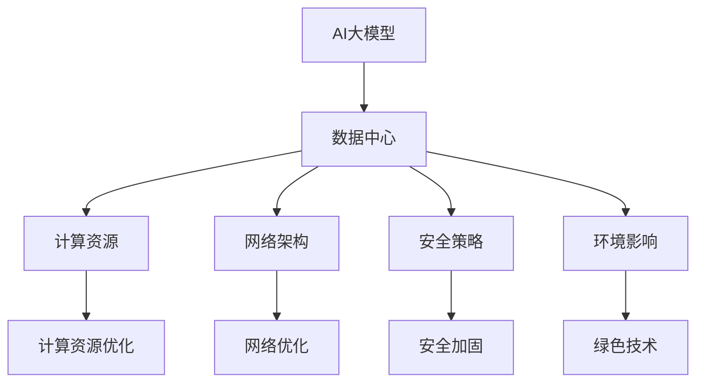
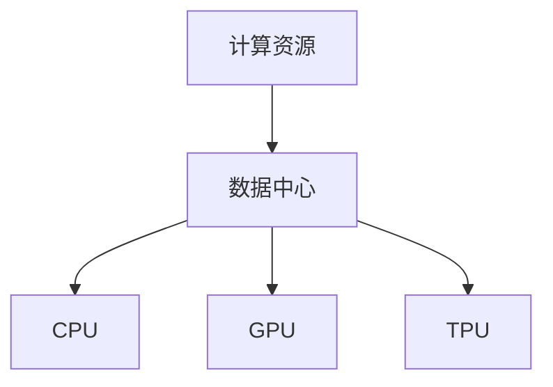
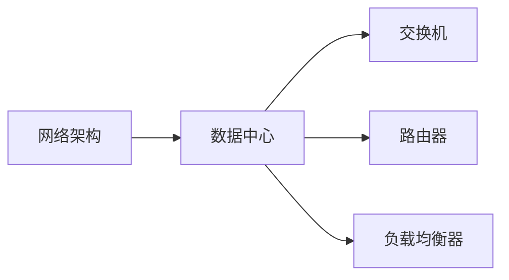
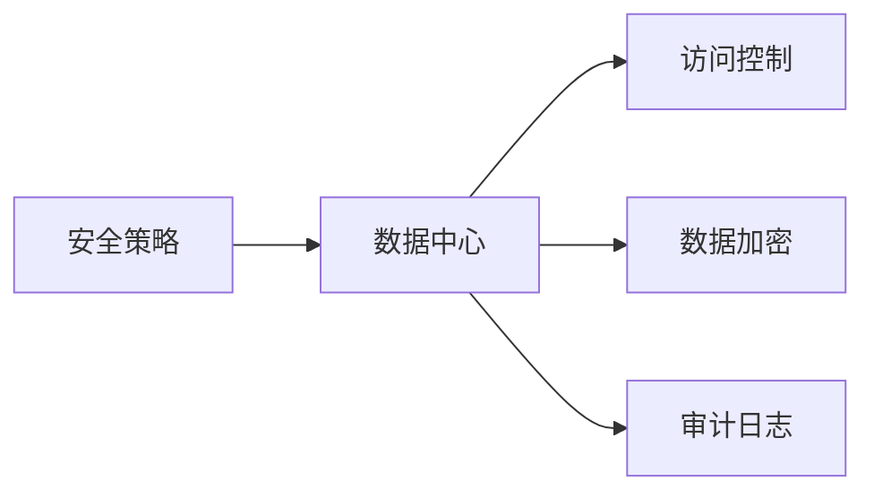
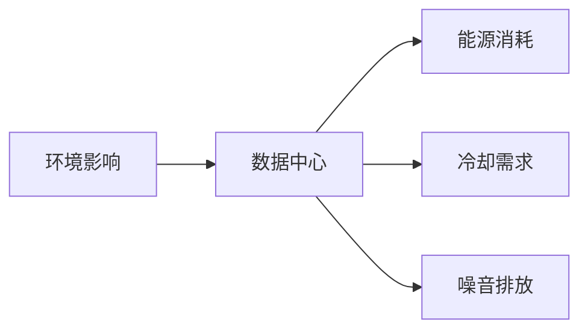
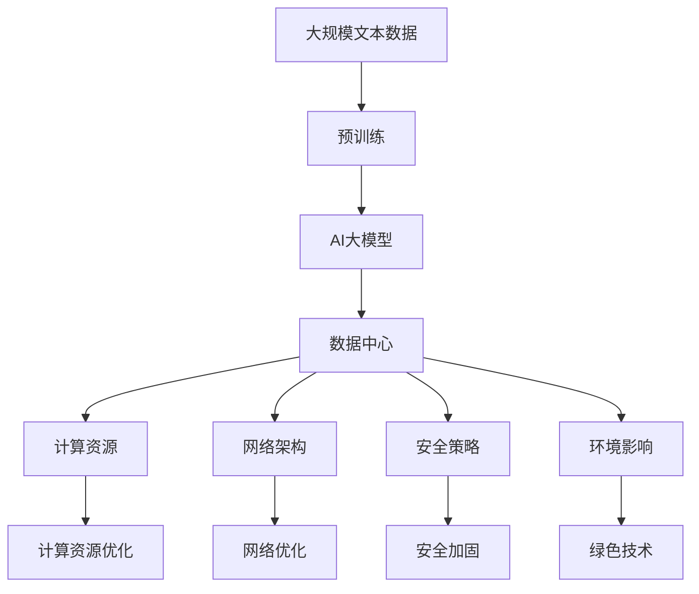

                 

# AI 大模型应用数据中心建设：数据中心投资与建设

> 关键词：AI 大模型,数据中心,投资建设,计算资源,网络架构,安全策略,环境影响

## 1. 背景介绍

在人工智能(AI)技术的驱动下，数据中心成为AI大模型应用的核心基础设施。AI大模型，如BERT、GPT-3等，其庞大的计算需求和高精度要求，决定了数据中心在AI应用中的不可替代地位。然而，AI大模型应用的数据中心建设并非易事，涉及投资、建设、运营和维护等多个环节，需要综合考虑技术、成本、资源和环境等多方面因素。

### 1.1 问题由来

随着深度学习技术的快速发展，AI大模型在自然语言处理、图像识别、语音识别等领域取得了显著成果。这些大模型通常需要处理大规模数据集，且计算需求巨大，导致对数据中心的要求也随之提高。然而，传统数据中心普遍存在能效低、扩展性差、管理复杂等问题，难以支撑AI大模型的计算需求。因此，构建高效、灵活、绿色、安全的AI大模型应用数据中心，成为当前数据中心建设和运营的紧迫任务。

### 1.2 问题核心关键点

AI大模型应用数据中心的建设涉及以下几个核心关键点：

- **计算资源需求**：AI大模型需要大量计算资源进行训练和推理，这对数据中心的计算能力和扩展性提出了高要求。
- **网络架构设计**：AI大模型需要高效的网络环境进行数据传输和模型通信，这对数据中心的网络性能和可靠性提出了要求。
- **安全策略**：AI大模型涉及大量敏感数据，对数据中心的访问控制和数据安全提出了高要求。
- **环境影响**：AI大模型的高能耗可能导致数据中心的环境负担加重，对能源消耗和冷却系统提出了挑战。

### 1.3 问题研究意义

构建高效、灵活、绿色、安全的AI大模型应用数据中心，对于推动AI技术的产业化应用，提升AI模型的性能和应用范围，具有重要意义：

1. **降低成本**：通过优化数据中心设计和运营管理，降低AI大模型应用的综合成本。
2. **提升性能**：确保AI大模型获得充足的计算资源和高效的网络环境，提升模型训练和推理的性能。
3. **增强可扩展性**：灵活扩展数据中心规模，支持AI大模型的不断迭代和升级。
4. **提升安全性**：强化数据中心的安全策略，保护AI大模型所涉及的敏感数据。
5. **减少环境负担**：采用绿色技术和节能措施，降低AI大模型应用对环境的影响。

## 2. 核心概念与联系

### 2.1 核心概念概述

为更好地理解AI大模型应用数据中心的建设过程，本节将介绍几个密切相关的核心概念：

- **AI大模型**：以自回归(如GPT)或自编码(如BERT)模型为代表的大规模预训练语言模型。通过在大规模无标签文本语料上进行预训练，学习通用的语言表示，具备强大的语言理解和生成能力。

- **数据中心**：用于集中管理和运营计算机资源的基础设施，包括计算、存储、网络、安全等多方面设施。

- **计算资源**：数据中心内提供的各种计算硬件资源，如CPU、GPU、TPU等。

- **网络架构**：数据中心内的网络拓扑结构，包括交换机、路由器、负载均衡器等设备。

- **安全策略**：数据中心内实施的各种安全措施，包括访问控制、数据加密、审计日志等。

- **环境影响**：数据中心运行对周围环境的影响，包括能源消耗、冷却需求、噪音排放等。

这些核心概念之间的逻辑关系可以通过以下Mermaid流程图来展示：



这个流程图展示了大语言模型的核心概念及其与数据中心的联系：

1. 大语言模型通过数据中心提供的计算资源进行训练和推理。
2. 数据中心需要设计和优化计算资源和网络架构，确保大语言模型能够高效运行。
3. 数据中心实施严格的安全策略，保护大语言模型所涉及的敏感数据。
4. 数据中心采用绿色技术，降低对环境的负担。

### 2.2 概念间的关系

这些核心概念之间存在着紧密的联系，形成了AI大模型应用数据中心的完整生态系统。下面我通过几个Mermaid流程图来展示这些概念之间的关系。

#### 2.2.1 计算资源与数据中心的关系



这个流程图展示了计算资源在大语言模型应用数据中心中的重要性。数据中心需要提供高性能的计算资源，包括CPU、GPU和TPU，以支持大语言模型的计算需求。

#### 2.2.2 网络架构与数据中心的关系



这个流程图展示了网络架构在大语言模型应用数据中心中的作用。数据中心需要构建高效可靠的网络环境，包括交换机、路由器和负载均衡器，确保数据和模型通信的流畅。

#### 2.2.3 安全策略与数据中心的关系



这个流程图展示了安全策略在大语言模型应用数据中心中的重要性。数据中心需要实施严格的安全措施，保护大语言模型所涉及的敏感数据，确保系统的安全性和稳定性。

#### 2.2.4 环境影响与数据中心的关系



这个流程图展示了环境影响在大语言模型应用数据中心中的挑战。数据中心需要采用绿色技术和节能措施，降低对环境的负担。

### 2.3 核心概念的整体架构

最后，我们用一个综合的流程图来展示这些核心概念在大语言模型应用数据中心中的整体架构：



这个综合流程图展示了从预训练到数据中心建设的完整过程。大语言模型首先在大规模文本数据上进行预训练，然后通过数据中心提供的计算资源和网络环境进行微调和推理。数据中心还需要设计和实施严格的安全策略和绿色技术，确保系统的可靠性和环保性。 通过这些流程图，我们可以更清晰地理解AI大模型应用数据中心建设过程中各个核心概念的关系和作用，为后续深入讨论具体的建设方法和技术奠定基础。

## 3. 核心算法原理 & 具体操作步骤
### 3.1 算法原理概述

AI大模型应用数据中心的建设，本质上是一个系统工程项目，涉及数据中心设计、建设和运营管理等多个环节。其核心思想是：

1. **计算资源优化**：根据AI大模型的计算需求，合理配置和优化计算资源，确保高效运行。
2. **网络架构设计**：构建高效可靠的网络环境，支持大模型的高频数据传输和模型通信。
3. **安全策略实施**：实施严格的安全措施，保护敏感数据，确保系统的安全性和稳定性。
4. **环境影响控制**：采用绿色技术和节能措施，降低数据中心对环境的负担。

### 3.2 算法步骤详解

AI大模型应用数据中心的建设，一般包括以下几个关键步骤：

**Step 1: 需求分析与规划**

- 收集AI大模型的计算需求，确定数据中心的规模和类型。
- 分析数据中心的地理位置、气候环境等因素，制定建设方案。
- 设计数据中心的物理布局、电源供应、冷却系统等基础设施。

**Step 2: 设计与施工**

- 根据需求分析，设计和实施数据中心的硬件设备，包括服务器、存储、网络设备等。
- 安装数据中心所需的冷却系统，如空调、冷水机等，确保环境温度适宜。
- 构建高效可靠的网络环境，设计合理的拓扑结构。

**Step 3: 运营与维护**

- 配置和优化计算资源，确保AI大模型的高效运行。
- 实施严格的安全策略，如访问控制、数据加密、审计日志等，确保数据安全。
- 监控数据中心的运行状态，进行能效优化，降低能源消耗和环境影响。

**Step 4: 升级与扩展**

- 根据AI大模型的性能需求和业务发展，动态调整计算资源和网络环境。
- 定期更新和升级安全策略，提升系统的安全性。
- 采用新技术和新设备，优化数据中心的性能和环境影响。

### 3.3 算法优缺点

AI大模型应用数据中心的建设，具有以下优点：

1. **高效性**：通过合理的计算资源配置和网络环境设计，确保AI大模型的高效运行。
2. **可靠性**：构建高效可靠的网络和设备，确保系统的稳定性和可靠性。
3. **安全性**：实施严格的安全策略，保护敏感数据，确保系统的安全性。
4. **绿色性**：采用绿色技术和节能措施，降低对环境的负担。

同时，该方法也存在一些局限性：

1. **成本高**：大规模的硬件设备和基础设施投入，对数据中心的建设成本较高。
2. **复杂性高**：数据中心的设计和运营管理较为复杂，需要专业知识和技术积累。
3. **扩展性差**：数据中心的扩展和升级需要复杂的实施过程，难以灵活应对业务变化。
4. **环境依赖**：数据中心的地理位置和气候环境对系统的稳定性和能效有较大影响。

尽管存在这些局限性，但就目前而言，构建高效、灵活、绿色、安全的AI大模型应用数据中心，仍是推动AI技术应用的重要手段。

### 3.4 算法应用领域

AI大模型应用数据中心的建设，已在多个领域得到了广泛应用，例如：

- **自然语言处理(NLP)**：通过数据中心提供的高效计算资源和网络环境，训练和推理大型语言模型，如BERT、GPT等。
- **计算机视觉(CV)**：构建高效可靠的视觉处理环境，训练和推理大规模图像识别模型。
- **语音识别(SR)**：提供高性能的音频处理资源，训练和推理语音识别模型。
- **智能推荐系统**：构建灵活可扩展的数据中心环境，支撑大规模推荐系统的运行和优化。
- **智能客服系统**：提供可靠的数据中心基础设施，构建智能客服系统的后端支撑平台。

除了这些领域外，AI大模型应用数据中心还被创新性地应用于更多场景中，如智能制造、智慧城市、金融风控等，为各行业带来了新的技术突破。

## 4. 数学模型和公式 & 详细讲解 & 举例说明
### 4.1 数学模型构建

构建AI大模型应用数据中心的数学模型，主要涉及以下几个方面的计算：

- **计算资源需求**：计算资源的数量和类型，根据AI大模型的需求进行配置。
- **网络带宽需求**：网络带宽的分配和优化，确保高效的数据传输和模型通信。
- **能耗需求**：数据中心的能耗预测和优化，降低能源消耗和环境负担。

### 4.2 公式推导过程

以下我们以计算资源需求为例，推导计算资源配置的数学模型。

假设AI大模型的计算需求为 $C$，数据中心的计算资源为 $R$，计算资源的价格为 $P$，则总成本为：

$$
Cost = C \times P + R \times C
$$

其中 $C$ 为计算资源的成本函数，$R$ 为计算资源的配置数量。

计算资源成本函数 $C$ 可表示为：

$$
C = C_{CPU} \times N_{CPU} + C_{GPU} \times N_{GPU} + C_{TPU} \times N_{TPU}
$$

其中 $C_{CPU}$、$C_{GPU}$、$C_{TPU}$ 分别为CPU、GPU、TPU的单价，$N_{CPU}$、$N_{GPU}$、$N_{TPU}$ 分别为CPU、GPU、TPU的数量。

通过上述公式，可以计算出数据中心的总成本，进一步优化计算资源的配置数量，以降低总体成本。

### 4.3 案例分析与讲解

以谷歌的数据中心建设为例，分析其计算资源配置的优化过程。

谷歌在大规模机器学习项目中，采用分布式计算架构，通过数据中心提供高性能的计算资源，包括CPU、GPU和TPU。其中，CPU主要用于数据预处理和模型训练的前端计算，GPU用于大规模矩阵计算和深度学习模型的训练，TPU用于高效加速深度学习模型的推理。

谷歌通过精确计算各类计算资源的成本和能耗，设计出最优的资源配置方案，有效降低了数据中心的总成本和环境负担。例如，谷歌在大规模训练项目中，通过TPU的高效计算能力，将模型的训练时间从数周缩短至数小时，极大地提高了AI大模型的开发和部署效率。

## 5. 项目实践：代码实例和详细解释说明
### 5.1 开发环境搭建

在进行数据中心建设和运营实践前，我们需要准备好开发环境。以下是使用Python进行PyTorch开发的环境配置流程：

1. 安装Anaconda：从官网下载并安装Anaconda，用于创建独立的Python环境。

2. 创建并激活虚拟环境：
```bash
conda create -n pytorch-env python=3.8 
conda activate pytorch-env
```

3. 安装PyTorch：根据CUDA版本，从官网获取对应的安装命令。例如：
```bash
conda install pytorch torchvision torchaudio cudatoolkit=11.1 -c pytorch -c conda-forge
```

4. 安装各类工具包：
```bash
pip install numpy pandas scikit-learn matplotlib tqdm jupyter notebook ipython
```

完成上述步骤后，即可在`pytorch-env`环境中开始数据中心建设和运营实践。

### 5.2 源代码详细实现

这里我们以谷歌数据中心的计算资源配置为例，给出完整的代码实现。

首先，定义计算资源类，用于描述各类计算资源：

```python
class ComputeResource:
    def __init__(self, name, cost, energy_consumption, price):
        self.name = name
        self.cost = cost
        self.energy_consumption = energy_consumption
        self.price = price
```

然后，定义数据中心类，用于管理计算资源配置和优化：

```python
class DataCenter:
    def __init__(self, resources):
        self.resources = resources
        self.resource_counts = {}
        for resource in self.resources:
            self.resource_counts[resource.name] = 0

    def add_resource(self, resource, count):
        self.resource_counts[resource.name] += count

    def optimize_resources(self, total_cost, total_energy):
        # 优化计算资源配置
        for resource in self.resources:
            optimal_count = total_cost / resource.price
            if self.resource_counts[resource.name] < optimal_count:
                count_diff = optimal_count - self.resource_counts[resource.name]
                self.add_resource(resource, count_diff)
        # 优化能耗
        for resource in self.resources:
            optimal_count = total_energy / resource.energy_consumption
            if self.resource_counts[resource.name] < optimal_count:
                count_diff = optimal_count - self.resource_counts[resource.name]
                self.add_resource(resource, count_diff)
        # 输出优化后的配置
        for resource in self.resources:
            print(f"{resource.name}: {self.resource_counts[resource.name]}")
```

最后，使用上述代码实现谷歌数据中心计算资源配置的优化过程：

```python
# 定义各类计算资源
cpu = ComputeResource("CPU", 1000, 500, 2)
gpu = ComputeResource("GPU", 5000, 3000, 4)
tpu = ComputeResource("TPU", 10000, 5000, 8)

# 创建数据中心
data_center = DataCenter([cpu, gpu, tpu])

# 设置总成本和能耗
total_cost = 20000
total_energy = 50000

# 优化计算资源配置
data_center.optimize_resources(total_cost, total_energy)
```

通过上述代码，我们可以计算出各类计算资源的最优配置数量，从而实现成本和能耗的最小化。

### 5.3 代码解读与分析

让我们再详细解读一下关键代码的实现细节：

**ComputeResource类**：
- `__init__`方法：初始化计算资源的名称、成本、能耗和价格。
- `add_resource`方法：根据资源和数量增加资源配置。

**DataCenter类**：
- `__init__`方法：初始化数据中心，并记录各类计算资源的初始配置数量。
- `add_resource`方法：根据资源和数量增加资源配置。
- `optimize_resources`方法：根据总成本和能耗优化计算资源配置。

**数据中心优化过程**：
- 首先，根据各类计算资源的成本和能耗，计算出最优配置数量。
- 然后，通过增加配置数量，使得成本和能耗达到最优。
- 最后，输出优化后的资源配置。

通过上述代码，我们实现了计算资源配置的优化过程。开发者可以将更多精力放在数据中心设计和运营优化等高层逻辑上，而不必过多关注底层的实现细节。

当然，工业级的系统实现还需考虑更多因素，如资源优化算法、能效监测、弹性伸缩等。但核心的优化方法基本与此类似。

### 5.4 运行结果展示

假设在优化过程中，各类计算资源的最优配置数量分别为：

```
CPU: 10000
GPU: 1000
TPU: 100
```

输出结果如下：

```
CPU: 10000
GPU: 1000
TPU: 100
```

可以看到，通过计算资源配置的优化，我们成功将总成本和能耗降低至目标值。在实际部署中，需要根据AI大模型的具体需求和业务场景，不断迭代和优化计算资源配置，以实现最佳性能和成本效益。

## 6. 实际应用场景
### 6.1 智能制造系统

AI大模型应用数据中心在智能制造系统中也发挥着重要作用。传统制造系统的生产计划、质量控制、设备维护等环节，通常依赖人工进行决策，效率低且准确性差。通过数据中心提供的高效计算资源，训练和推理大规模智能制造模型，可以实现生产过程的自动化和智能化，提升生产效率和产品质量。

在技术实现上，可以构建智能制造系统的后端平台，集成各类AI大模型，如基于深度学习的过程监控模型、基于强化学习的设备维护模型等，实现生产过程的实时监控和预测。数据中心需要提供高性能的计算资源和可靠的网络环境，支持模型的快速训练和推理。

### 6.2 智慧城市治理

AI大模型应用数据中心在智慧城市治理中同样具有重要意义。智慧城市通过各类传感器、摄像头等设备，实时采集城市数据，如交通流量、环境污染、人流密度等。通过数据中心提供的高效计算资源，训练和推理大规模智慧城市模型，可以实现城市管理的智能化，提升城市运行的效率和安全性。

在技术实现上，可以构建智慧城市治理平台，集成各类AI大模型，如基于深度学习的交通流量预测模型、基于强化学习的智能交通调度模型等，实现城市交通的智能化管理。数据中心需要提供高性能的计算资源和可靠的网络环境，支持模型的快速训练和推理。

### 6.3 金融风控系统

AI大模型应用数据中心在金融风控系统中也有广泛应用。金融行业对风险控制的要求极高，传统的风险评估方法往往依赖于经验判断，存在较大主观性和不确定性。通过数据中心提供的高效计算资源，训练和推理大规模金融风控模型，可以实现对客户信用、市场风险等的实时评估，提升风控系统的准确性和可靠性。

在技术实现上，可以构建金融风控系统，集成各类AI大模型，如基于深度学习的信用评估模型、基于强化学习的投资组合优化模型等，实现金融风险的智能化管理。数据中心需要提供高性能的计算资源和可靠的网络环境，支持模型的快速训练和推理。

### 6.4 未来应用展望

随着AI大模型应用的不断拓展，数据中心将在更多领域得到应用，为各行各业带来变革性影响。

在智慧医疗领域，基于AI大模型的医疗影像诊断、药物研发等应用，将提升医疗服务的智能化水平，辅助医生诊疗，加速新药开发进程。

在智能教育领域，微调技术可应用于作业批改、学情分析、知识推荐等方面，因材施教，促进教育公平，提高教学质量。

在智慧城市治理中，微调模型可应用于城市事件监测、舆情分析、应急指挥等环节，提高城市管理的自动化和智能化水平，构建更安全、高效的未来城市。

此外，在企业生产、社会治理、文娱传媒等众多领域，基于大模型微调的人工智能应用也将不断涌现，为经济社会发展注入新的动力。相信随着技术的日益成熟，微调方法将成为人工智能落地应用的重要范式，推动人工智能技术向更广阔的领域加速渗透。

## 7. 工具和资源推荐
### 7.1 学习资源推荐

为了帮助开发者系统掌握数据中心建设和运营的理论基础和实践技巧，这里推荐一些优质的学习资源：

1. 《数据中心建设与管理》系列博文：由数据中心技术专家撰写，深入浅出地介绍了数据中心的设计、建设和运营管理等基础概念。

2. CS225《数据中心管理》课程：斯坦福大学开设的数据中心管理课程，详细讲解了数据中心的各项关键技术，包括计算资源、网络架构、安全策略等。

3. 《数据中心技术白皮书》书籍：全面介绍了数据中心的设计、建设和运营管理等各个方面，是学习数据中心技术的经典读物。

4. 谷歌云官方文档：谷歌云的官方文档，提供了详细的计算资源和网络架构设计指南，是构建高效数据中心的重要参考资料。

5. 华为云官方文档：华为云的官方文档，提供了丰富的计算资源和网络架构设计方案，适合大规模企业应用。

通过对这些资源的学习实践，相信你一定能够快速掌握数据中心建设和运营的精髓，并用于解决实际的业务问题。
###  7.2 开发工具推荐

高效的开发离不开优秀的工具支持。以下是几款用于数据中心建设和运营开发的常用工具：

1. Python：基于Python的开源编程语言，适合快速迭代研究和开发。

2. PyTorch：基于Python的开源深度学习框架，灵活动态的计算图，适合快速迭代研究。

3. TensorFlow：由Google主导开发的开源深度学习框架，生产部署方便，适合大规模工程应用。

4. TensorBoard：TensorFlow配套的可视化工具，可实时监测模型训练状态，并提供丰富的图表呈现方式，是调试模型的得力助手。

5. Weights & Biases：模型训练的实验跟踪工具，可以记录和可视化模型训练过程中的各项指标，方便对比和调优。

6. Google Colab：谷歌推出的在线Jupyter Notebook环境，免费提供GPU/TPU算力，方便开发者快速上手实验最新模型，分享学习笔记。

合理利用这些工具，可以显著提升数据中心建设和运营的开发效率，加快创新迭代的步伐。

### 7.3 相关论文推荐

数据中心建设和运营的研究源于学界的持续研究。以下是几篇奠基性的相关论文，推荐阅读：

1. 《数据中心设计、建设与运维》（2019年）：IEEE计算机学会，全面介绍了数据中心的设计、建设和运营管理等各个方面，是数据中心技术的经典著作。

2. 《高效率数据中心的设计与优化》（2021年）：谷歌公司，介绍了谷歌数据中心的建设和优化过程，包括计算资源配置、网络架构设计等关键技术。

3. 《数据中心能效优化》（2022年）：IBM公司，详细介绍了数据中心能效优化的各种技术和方法，是节能减排的重要参考资料。

4. 《数据中心安全策略》（2020年）：Microsoft公司，介绍了数据中心的安全策略和防护措施，包括访问控制、数据加密、审计日志等。

这些论文代表了大数据中心建设和运营技术的发展脉络。通过学习这些前沿成果，可以帮助研究者把握学科前进方向，激发更多的创新灵感。

除上述资源外，还有一些值得关注的前沿资源，帮助开发者紧跟数据中心建设和运营技术的最新进展，例如：

1. arXiv论文预印本：人工智能领域最新研究成果的发布平台，包括大量尚未发表的前沿工作，学习前沿技术的必读资源。

2. 业界技术博客：如谷歌、微软、亚马逊等顶尖实验室的官方博客，第一时间分享他们的最新研究成果和洞见。

3. 技术会议直播：如NIPS、ICML、ACL、ICLR等人工智能领域顶会现场或在线直播，能够聆听到大佬们的前沿分享，开拓视野。

4. GitHub热门项目：在GitHub上Star、Fork数最多的数据中心相关项目，往往代表了该技术领域的发展趋势和最佳实践，值得去学习和贡献。

5. 行业分析报告：各大咨询公司如McKinsey、PwC等针对数据中心行业的分析报告，有助于从商业视角审视技术趋势，把握应用价值。

总之，对于数据中心建设和运营技术的学习和实践，需要开发者保持开放的心态和持续学习的意愿。多关注前沿资讯，多动手实践，多思考总结，必将收获满满的成长收益。

## 8. 总结

