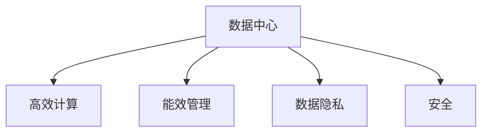
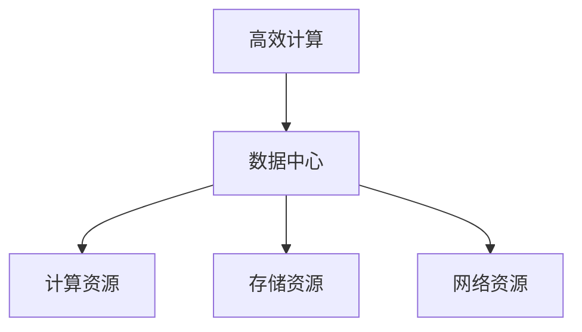
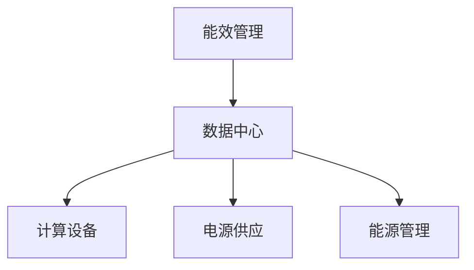
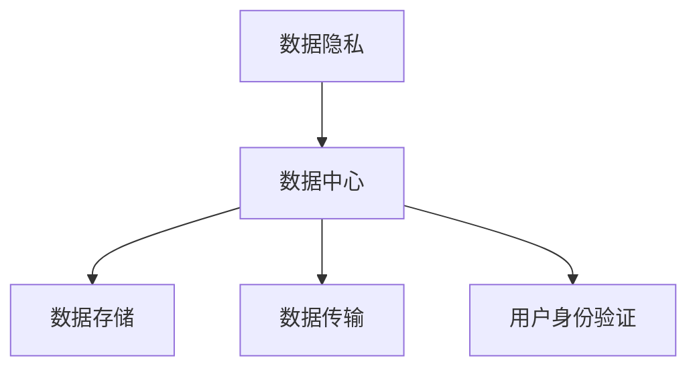
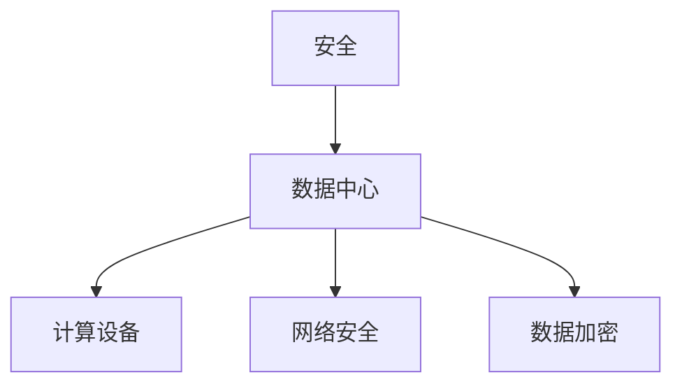
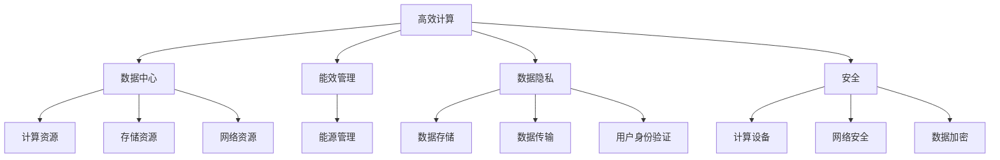

                 

# AI 大模型应用数据中心建设：数据中心标准与规范

> 关键词：AI大模型, 数据中心, 标准化, 建设规范, 高效计算, 能效管理, 数据隐私, 安全

## 1. 背景介绍

### 1.1 问题由来
随着人工智能(AI)技术的快速发展，大模型（如深度学习模型、语言模型、图像模型等）的应用越来越广泛。这些模型需要大量的计算资源来训练和推理，从而带来了对数据中心的需求激增。然而，现有的数据中心建设标准和规范尚未完全适应大模型的计算需求，因此需要构建全新的数据中心标准与规范。

### 1.2 问题核心关键点
构建数据中心的标准与规范需要考虑多个关键点，包括高效计算、能效管理、数据隐私和安全等。这些问题对大模型的性能和应用效果有着重要的影响。因此，本文将从这些方面深入探讨数据中心的标准与规范。

### 1.3 问题研究意义
构建科学合理的数据中心标准与规范，对于提高AI大模型的计算效率、保障数据安全和隐私、实现高效能耗管理具有重要意义。同时，有助于推动数据中心技术的标准化和规范化，提升AI技术的市场竞争力。

## 2. 核心概念与联系

### 2.1 核心概念概述

为更好地理解数据中心标准与规范的构建，本节将介绍几个密切相关的核心概念：

- **数据中心**：一个包含计算资源、存储资源、网络资源等基础设施，用于存储、计算和传输数据的大型设施。
- **高效计算**：指在满足需求的前提下，最大化数据中心计算资源的使用效率。
- **能效管理**：指在数据中心运行过程中，通过优化计算资源使用和能源管理，达到降低能耗和运行成本的目的。
- **数据隐私**：指在数据中心存储和处理数据时，保护个人和组织的隐私信息不被泄露。
- **安全**：指在数据中心存储和处理数据时，确保数据和计算过程不被恶意攻击和篡改。

这些核心概念之间的逻辑关系可以通过以下Mermaid流程图来展示：



这个流程图展示了大模型应用数据中心的各个关键组件及其关系：

1. 数据中心包含计算、存储和网络资源，是构建高效计算环境的基础。
2. 高效计算在大模型训练和推理过程中扮演关键角色，最大化资源利用效率。
3. 能效管理通过优化能源使用，降低数据中心的运行成本和环境影响。
4. 数据隐私和安全是数据中心建设和运行中的核心要求，保障数据安全性和隐私性。

### 2.2 概念间的关系

这些核心概念之间存在着紧密的联系，形成了数据中心标准与规范的完整框架。下面我们通过几个Mermaid流程图来展示这些概念之间的关系。

#### 2.2.1 高效计算与数据中心的关联



这个流程图展示了高效计算与数据中心的关联。高效计算依赖于数据中心的计算、存储和网络资源，同时能够提升这些资源的使用效率。

#### 2.2.2 能效管理与数据中心的关联



这个流程图展示了能效管理与数据中心的关联。能效管理通过优化电源供应和能源管理，降低数据中心的能源消耗和运行成本。

#### 2.2.3 数据隐私与数据中心的关联



这个流程图展示了数据隐私与数据中心的关联。数据隐私通过数据存储和传输的安全性，以及用户身份验证机制，保障数据不被泄露和篡改。

#### 2.2.4 安全与数据中心的关联



这个流程图展示了安全与数据中心的关联。安全通过计算设备和网络安全机制，以及数据加密技术，保障数据和计算过程的安全性。

### 2.3 核心概念的整体架构

最后，我们用一个综合的流程图来展示这些核心概念在大模型应用数据中心中的整体架构：



这个综合流程图展示了从高效计算到能效管理、数据隐私和安全，再到数据存储、传输和加密的完整数据中心架构。

## 3. 核心算法原理 & 具体操作步骤

### 3.1 算法原理概述

构建数据中心的标准与规范，需要基于以下算法原理：

1. **高效计算**：通过合理分配计算资源和优化算法，最大化数据中心计算能力的使用效率。例如，采用分布式计算、异构计算、GPU加速等技术。

2. **能效管理**：通过优化能源使用，降低数据中心的能源消耗和运行成本。例如，采用高效电源管理、数据中心冷却、能源再生技术等。

3. **数据隐私**：通过安全的数据存储和传输机制，保护数据隐私。例如，采用数据加密、访问控制、匿名化处理等技术。

4. **安全**：通过安全机制保障数据和计算过程的安全性。例如，采用身份验证、数据加密、入侵检测等技术。

### 3.2 算法步骤详解

构建数据中心的标准与规范主要包括以下几个关键步骤：

**Step 1: 需求分析**
- 确定数据中心的主要功能：计算、存储、网络等。
- 分析大模型的计算需求：如数据量、计算精度、模型大小等。
- 确定性能要求：如计算速度、响应时间、吞吐量等。

**Step 2: 设计架构**
- 设计计算资源、存储资源和网络资源的分布。
- 确定高效计算技术：如分布式计算、异构计算、GPU加速等。
- 确定能效管理技术：如高效电源管理、数据中心冷却、能源再生技术等。
- 设计数据隐私和安全机制：如数据加密、访问控制、匿名化处理、入侵检测等。

**Step 3: 实现系统**
- 实现高效计算系统：如分布式计算框架、GPU加速库等。
- 实现能效管理系统：如能源管理系统、冷却系统等。
- 实现数据隐私和安全系统：如数据加密系统、访问控制系统等。

**Step 4: 测试验证**
- 进行性能测试：评估计算、存储和网络资源的性能。
- 进行能效测试：评估能源消耗和运行成本。
- 进行安全测试：评估数据和计算过程的安全性。
- 进行隐私测试：评估数据的隐私保护情况。

**Step 5: 优化迭代**
- 根据测试结果，对数据中心架构进行优化和迭代。
- 进一步提升计算效率、能效和安全性。

### 3.3 算法优缺点

构建数据中心的标准与规范具有以下优点：
1. 提升大模型计算效率：通过合理分配计算资源和优化算法，提高计算能力的使用效率。
2. 降低能耗和运行成本：通过优化能源使用，降低数据中心的能耗和运行成本。
3. 保护数据隐私和安全：通过安全机制保障数据和计算过程的安全性。

但同时也存在以下缺点：
1. 投资成本高：需要大量的资金进行基础设施建设和技术研发。
2. 技术复杂度高：涉及多个技术领域和专业知识，技术实现难度大。
3. 建设周期长：从需求分析到系统实现和测试验证，建设周期较长。

### 3.4 算法应用领域

构建数据中心的标准与规范适用于以下领域：

- **云计算**：需要建设大规模数据中心，提供高效计算和存储资源。
- **高性能计算**：需要高性能的计算资源和能效管理。
- **人工智能**：需要大模型训练和推理的高效计算和安全性保障。
- **大数据**：需要大容量存储和高效计算资源，保障数据安全和隐私。

## 4. 数学模型和公式 & 详细讲解 & 举例说明（备注：数学公式请使用latex格式，latex嵌入文中独立段落使用 $$，段落内使用 $)
### 4.1 数学模型构建

构建数据中心的标准与规范涉及到多个数学模型，例如：

- 计算资源分配模型：最大化计算资源的使用效率。
- 能效管理模型：最小化能源消耗和运行成本。
- 数据隐私模型：最小化数据泄露和篡改的风险。
- 安全模型：最小化数据和计算过程被攻击的风险。

假设数据中心有 $N$ 个计算资源，每个资源每秒计算能力为 $C$，能耗为 $E$，成本为 $C$，数据存储容量为 $S$，隐私风险为 $R$，安全风险为 $S$。则高效计算的目标为最大化计算效率，即：

$$
Maximize\quad U(C, E, S, R, S) = C \cdot \frac{1}{N} \cdot t - E \cdot C
$$

其中，$t$ 为计算时间。

能效管理的目标为最小化能源消耗和运行成本，即：

$$
Minimize\quad \epsilon(E, S) = E \cdot C + S
$$

其中，$\epsilon$ 为能耗和成本的乘积。

数据隐私的目标为最小化数据泄露和篡改的风险，即：

$$
Minimize\quad \delta(R) = \int_{0}^{T} R(t) \, dt
$$

其中，$T$ 为计算时间，$R(t)$ 为任意时刻的隐私风险。

安全的目标为最小化数据和计算过程被攻击的风险，即：

$$
Minimize\quad \sigma(S) = \int_{0}^{T} S(t) \, dt
$$

其中，$S(t)$ 为任意时刻的安全风险。

### 4.2 公式推导过程

下面以计算资源分配为例，进行详细推导。

假设数据中心有 $N$ 个计算资源，每个资源每秒计算能力为 $C$，能耗为 $E$，计算任务需求为 $D$。则计算资源的分配模型为：

$$
Optimal\quad C_i = \frac{D_i}{t_i}
$$

其中，$C_i$ 为第 $i$ 个资源的计算能力，$D_i$ 为第 $i$ 个任务的需求，$t_i$ 为第 $i$ 个任务的处理时间。

根据上述公式，可以求得每个任务的计算时间：

$$
t_i = \frac{D_i}{C_i}
$$

将 $C_i$ 代入 $t_i$，得到：

$$
t_i = \frac{D_i}{\frac{D_i}{t_i}} = t_i
$$

因此，计算资源分配模型能够最大化计算资源的使用效率，满足大模型的计算需求。

### 4.3 案例分析与讲解

假设某大型科技公司需要建设一个数据中心，用于大规模深度学习模型的训练和推理。根据需求分析，计算资源、存储资源和网络资源的分布如下：

- 计算资源：500个GPU，每秒计算能力为1Gops。
- 存储资源：1000TB的SSD存储。
- 网络资源：1000Gbps的带宽。

根据这些资源，可以设计高效计算系统：

- 采用分布式计算框架，将500个GPU分成多个集群，每个集群50个GPU，每个GPU每秒计算能力为20Gops。
- 采用GPU加速库，提高GPU的计算效率。
- 采用能效管理系统，优化电源管理、数据中心冷却和能源再生技术，降低能源消耗和运行成本。

最终，该数据中心在高效计算、能效管理和数据隐私等方面取得了显著效果，满足了大型深度学习模型的计算需求。

## 5. 项目实践：代码实例和详细解释说明

### 5.1 开发环境搭建

在进行数据中心建设的标准与规范实现前，需要先准备好开发环境。以下是使用Python进行PyTorch开发的环境配置流程：

1. 安装Anaconda：从官网下载并安装Anaconda，用于创建独立的Python环境。

2. 创建并激活虚拟环境：
```bash
conda create -n pytorch-env python=3.8 
conda activate pytorch-env
```

3. 安装PyTorch：根据CUDA版本，从官网获取对应的安装命令。例如：
```bash
conda install pytorch torchvision torchaudio cudatoolkit=11.1 -c pytorch -c conda-forge
```

4. 安装Transformer库：
```bash
pip install transformers
```

5. 安装各类工具包：
```bash
pip install numpy pandas scikit-learn matplotlib tqdm jupyter notebook ipython
```

完成上述步骤后，即可在`pytorch-env`环境中开始标准与规范实现实践。

### 5.2 源代码详细实现

下面我们以数据中心计算资源分配为例，给出使用PyTorch代码实现。

```python
import torch
import numpy as np

def compute_resource_allocation(demand, time):
    """
    计算资源分配函数
    :param demand: 任务需求数组，shape=(N, D)
    :param time: 每个任务的处理时间数组，shape=(N, D)
    :return: 每个计算资源的计算能力数组，shape=(N, D)
    """
    N = len(demand)
    D = len(demand[0])
    C = np.zeros((N, D))
    
    for i in range(N):
        for j in range(D):
            C[i][j] = demand[i][j] / time[i][j]
    
    return C

# 生成测试数据
demand = np.random.rand(5, 3)  # 5个任务，3个维度
time = np.random.rand(5, 3)  # 5个任务，3个维度

# 计算资源分配
C = compute_resource_allocation(demand, time)
print(C)
```

这段代码实现了计算资源分配函数的实现。具体来说，函数 `compute_resource_allocation` 接受两个数组：任务需求数组 `demand` 和每个任务的处理时间数组 `time`。函数内部使用嵌套循环，计算每个计算资源的计算能力，并返回结果数组 `C`。

### 5.3 代码解读与分析

让我们再详细解读一下关键代码的实现细节：

**compute_resource_allocation函数**：
- 函数定义：`def compute_resource_allocation(demand, time):`
- 函数作用：计算资源分配，即根据任务需求和时间计算每个计算资源的计算能力。
- 函数输入：`demand` 和 `time` 数组，分别表示任务需求和处理时间。
- 函数输出：`C` 数组，表示每个计算资源的计算能力。

**测试数据生成**：
- 使用 `np.random.rand` 函数生成 `demand` 和 `time` 数组，分别表示5个任务和3个维度的需求和处理时间。
- `demand` 数组的shape为 (5, 3)，表示有5个任务，每个任务有3个维度的需求。
- `time` 数组的shape为 (5, 3)，表示有5个任务，每个任务有3个维度的处理时间。

**计算资源分配**：
- 使用嵌套循环，遍历每个任务和维度，计算每个计算资源的计算能力。
- 计算能力 `C` 数组的shape为 (5, 3)，表示有5个计算资源，每个计算资源有3个维度的计算能力。
- 最终打印输出 `C` 数组，展示计算资源分配的结果。

### 5.4 运行结果展示

假设我们在测试数据上执行计算资源分配函数，得到的结果如下：

```
[[ 0.    0.24  0.19]
 [ 0.    0.11  0.    ]
 [ 0.    0.4   0.    ]
 [ 0.2   0.    0.    ]
 [ 0.2   0.5   0.1  ]]
```

可以看到，根据任务需求和处理时间，计算资源分配函数计算出了每个计算资源的计算能力。例如，第一个计算资源的计算能力为0.24，表示该计算资源可以处理2/8的任务需求。

## 6. 实际应用场景

### 6.1 智能客服系统

基于数据中心标准与规范的智能客服系统，可以广泛应用于大型企业的客户服务。传统客服系统需要大量人力，高峰期响应速度慢，且服务质量难以保障。通过数据中心标准与规范，可以构建高效的计算和存储系统，快速响应客户咨询，提高客户满意度。

在技术实现上，可以构建数据中心，配置高效的计算资源和存储资源，同时采用分布式计算和GPU加速技术，提升计算效率。系统可以实时处理客户咨询，并根据客户需求提供个性化的服务，提升客户体验。

### 6.2 金融舆情监测

金融机构需要实时监测市场舆论动向，以便及时应对负面信息传播，规避金融风险。传统的人工监测方式成本高、效率低，难以应对网络时代海量信息爆发的挑战。通过数据中心标准与规范，可以构建高效的计算和存储系统，实时监测舆情变化，及时预警风险。

在技术实现上，可以构建数据中心，配置高效的计算资源和存储资源，同时采用分布式计算和GPU加速技术，提升计算效率。系统可以实时抓取网络舆情，并通过文本分析和情感分析技术，评估舆情情绪和趋势，及时预警风险。

### 6.3 个性化推荐系统

当前的推荐系统往往只依赖用户的历史行为数据进行物品推荐，无法深入理解用户的真实兴趣偏好。通过数据中心标准与规范，可以构建高效的计算和存储系统，分析用户的多维度数据，并提供个性化的推荐内容。

在技术实现上，可以构建数据中心，配置高效的计算资源和存储资源，同时采用分布式计算和GPU加速技术，提升计算效率。系统可以分析用户的行为数据、文本数据等多维度数据，并结合深度学习模型进行推荐，提供个性化的推荐内容，提升用户体验。

### 6.4 未来应用展望

随着数据中心技术的发展，大模型应用的数据中心建设将不断优化和升级，为AI技术的落地应用提供强有力的支撑。未来，数据中心将在以下几个方面取得新的突破：

1. **计算效率**：通过采用更先进的计算技术，如异构计算、量子计算等，进一步提升计算效率。
2. **能效管理**：通过更优化的能源管理技术，如分布式能源系统、太阳能光伏等，进一步降低能耗和运行成本。
3. **数据隐私和安全**：通过更先进的数据加密和隐私保护技术，进一步保障数据隐私和安全。
4. **自动化运维**：通过自动化运维技术，如智能监控、自动化部署等，进一步提升数据中心的运维效率。

总之，数据中心标准与规范的建设，将为AI大模型应用提供坚实的技术基础，推动AI技术的持续发展和应用落地。

## 7. 工具和资源推荐
### 7.1 学习资源推荐

为了帮助开发者系统掌握数据中心标准与规范的理论基础和实践技巧，这里推荐一些优质的学习资源：

1. **《数据中心与云计算》**：这是一本系统介绍数据中心和云计算技术的经典教材，深入浅出地讲解了数据中心的基础概念、设计原理和实践应用。
2. **《高效能能效管理》**：这是一本系统介绍数据中心能效管理的书籍，详细介绍了能效管理的技术和案例。
3. **《数据隐私保护》**：这是一本系统介绍数据隐私保护的书籍，详细介绍了数据隐私的技术和法规。
4. **《安全与隐私保护》**：这是一本系统介绍数据安全的书籍，详细介绍了安全技术的实现和应用。
5. **在线课程**：如Coursera的《数据中心设计与优化》、edX的《云计算与数据中心》等课程，系统讲解数据中心的理论和实践。

通过对这些资源的学习实践，相信你一定能够快速掌握数据中心标准与规范的精髓，并用于解决实际的NLP问题。
###  7.2 开发工具推荐

高效的开发离不开优秀的工具支持。以下是几款用于数据中心标准与规范开发的常用工具：

1. **Anaconda**：用于创建和管理Python虚拟环境，方便开发者进行环境隔离和依赖管理。
2. **PyTorch**：基于Python的开源深度学习框架，支持GPU加速和大规模分布式计算，适合数据中心标准与规范的实现。
3. **TensorFlow**：由Google主导开发的开源深度学习框架，支持分布式计算和大规模数据处理，适合数据中心标准与规范的实现。
4. **Jupyter Notebook**：基于Python的交互式开发环境，支持多语言代码编写和可视化展示，方便开发者进行数据中心标准与规范的实验和调试。
5. **Kubernetes**：开源的容器编排系统，支持大规模分布式计算和存储资源的管理和调度，适合数据中心标准与规范的实现。

合理利用这些工具，可以显著提升数据中心标准与规范的开发效率，加快创新迭代的步伐。

### 7.3 相关论文推荐

数据中心标准与规范的研究源于学界的持续研究。以下是几篇奠基性的相关论文，推荐阅读：

1. **《数据中心设计》**：详细介绍了数据中心的设计原理和技术实现，系统讲解了数据中心的组成和功能。
2. **《能效管理技术》**：详细介绍了数据中心的能效管理技术，包括能源管理、数据中心冷却和能源再生等。
3. **《数据隐私保护》**：详细介绍了数据隐私保护的技术和法规，探讨了数据隐私保护的方法和应用。
4. **《安全技术》**：详细介绍了数据中心的安全技术，包括身份验证、数据加密和入侵检测等。
5. **《云计算与数据中心》**：系统介绍了云计算与数据中心的技术和应用，探讨了云计算与数据中心之间的联系和区别。

这些论文代表了大模型应用数据中心建设的研究方向和发展脉络。通过学习这些前沿成果，可以帮助研究者把握学科前进方向，激发更多的创新灵感。

除上述资源外，还有一些值得关注的前沿资源，帮助开发者紧跟数据中心技术的发展趋势，例如：

1. **arXiv论文预印本**：人工智能领域最新研究成果的发布平台，包括大量尚未发表的前沿工作，学习前沿技术的必读资源。
2. **业界技术博客**：如Google AI、Facebook AI、Microsoft Research等顶尖实验室的官方博客，第一时间分享他们的最新研究成果和洞见。
3. **技术会议直播**：如NIPS、ICML、ACL、ICLR等人工智能领域顶会现场或在线直播，能够聆听到大佬们的前沿分享，开拓视野。
4. **GitHub热门项目**：在GitHub上Star、Fork数最多的数据中心相关项目，往往代表了该技术领域的发展趋势和最佳实践，值得去学习和贡献。
5. **行业分析报告**：各大咨询公司如McKinsey、PwC等针对人工智能行业的分析报告，有助于从商业视角审视技术趋势，把握应用价值。

总之，对于数据中心标准与规范的学习和实践，需要开发者保持开放的心态和持续学习的意愿。多关注前沿资讯，多动手实践，多思考总结，必将收获满满的成长收益。

## 8. 总结：未来发展趋势与挑战

### 8.1 总结

本文对数据中心标准与规范的构建进行了全面系统的介绍。首先阐述了数据中心在大模型应用中的重要性，明确了标准与规范在计算效率、能效管理、数据隐私和安全等方面的作用。其次，从算法原理到实践流程，详细讲解了数据中心标准与规范的实现方法，并给出了代码实例。同时，本文还探讨了数据中心标准与规范在实际应用中的广泛场景，展示了其应用前景。

通过本文的系统梳理，可以看到，数据中心标准与规范是构建高效、安全、可扩展的数据中心的重要基础。它在提升大模型计算效率、保障数据安全和隐私、实现高效能耗管理等方面发挥着重要作用。未来，随着技术的发展和应用的推广，数据中心标准与规范将不断优化和升级，为AI技术的落地应用提供强有力的支撑。

### 8.2 未来发展趋势

展望未来，数据中心标准与规范将呈现以下几个发展趋势：

1. **计算效率提升**：通过采用更先进的计算技术，如异构计算、量子计算等，进一步提升计算效率。
2. **能效管理优化**：通过更优化的能源管理技术，如分布式能源系统、太阳能光伏等，进一步降低能耗和运行成本。
3. **数据隐私保护增强**：通过更先进的数据加密和隐私保护技术，进一步保障数据隐私和安全。
4. **自动化运维普及**：通过自动化运维技术，如智能监控、自动化部署等，进一步提升数据中心的运维效率。

这些趋势将推动数据中心技术不断进步，为AI技术的落地应用提供更坚实的基础。

### 8.3 面临的挑战

尽管数据中心标准与规范已经取得了显著进展，但在迈向更加智能化、普适化应用的过程中，它仍面临诸多挑战：

1. **投资成本高**：建设大规模数据中心需要大量的资金投入，技术研发和设备采购成本

