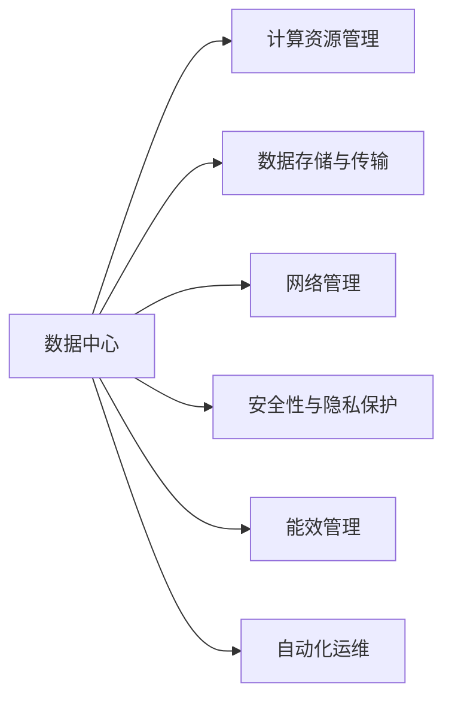
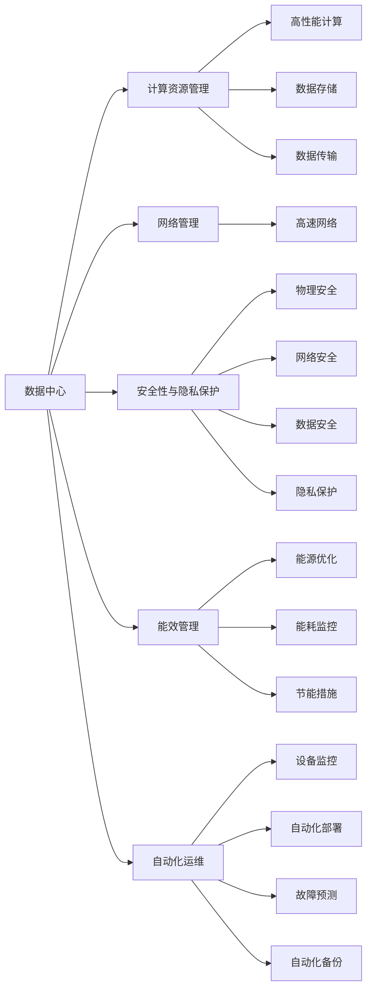
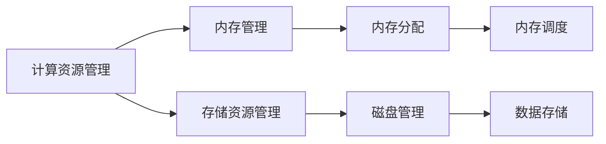
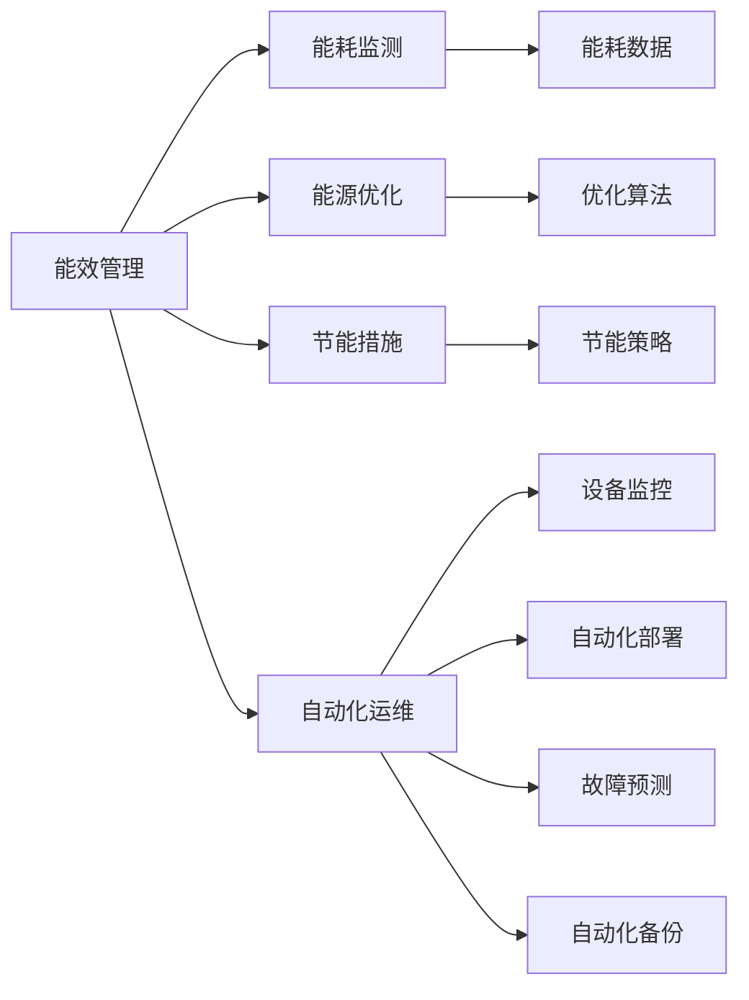
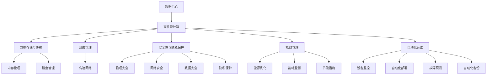

                 

# AI 大模型应用数据中心建设：数据中心运维与管理

> 关键词：人工智能大模型, 数据中心, 运维管理, 安全保障, 高效能, 可扩展性

## 1. 背景介绍

### 1.1 问题由来
随着人工智能（AI）技术的发展，大模型（Large Model）成为了一个热门话题。大模型通常指拥有数百亿个参数的深度神经网络，能够在诸如自然语言处理、计算机视觉、语音识别等领域提供卓越的性能。这些大模型的训练和运行需要大量的计算资源，因此数据中心（Data Center）成为了AI应用不可或缺的基础设施。

数据中心的运维管理是确保大模型能够高效、稳定运行的关键。然而，由于数据中心的规模庞大，结构复杂，涉及众多设备和人员，其运维管理面临诸多挑战。本文将详细探讨如何在大模型应用的背景下，进行数据中心的运维与管理，以确保大模型的可靠运行和高效利用。

### 1.2 问题核心关键点
数据中心的运维管理涉及以下核心关键点：

1. **高性能计算资源管理**：大模型训练和推理对计算资源的需求巨大，如何高效管理和利用计算资源是关键。
2. **数据存储与传输管理**：大模型所需的数据量巨大，如何在数据中心内高效存储和传输数据是核心问题。
3. **网络管理**：数据中心内多个设备的通信需要高效的网络管理支持。
4. **安全性与隐私保护**：大模型往往处理敏感数据，如何保障数据的安全性和隐私保护是重要任务。
5. **能效管理**：数据中心的能耗问题日益严峻，如何降低能耗，提升能效是大模型应用中的重要课题。
6. **自动化运维**：数据中心的复杂性要求高效自动化运维，以降低人力成本和提升运维效率。

本文将系统性地探讨这些关键问题，提供实用的解决方案。

### 1.3 问题研究意义
数据中心的运维管理对于确保AI大模型的可靠运行至关重要。有效的运维管理不仅能提升大模型的性能，还能显著降低运维成本，提高企业的整体竞争力。具体来说，研究数据中心运维管理具有以下重要意义：

1. **提高大模型应用效率**：通过优化计算资源管理、数据存储和传输、网络管理等环节，可显著提升大模型应用的效率。
2. **保障数据安全与隐私**：通过建立完善的安全机制，有效防止数据泄露和恶意攻击，保障大模型的数据安全。
3. **降低能耗与运营成本**：通过能效管理和自动化运维，可有效降低数据中心的能耗，降低运营成本。
4. **提升系统可靠性和稳定性**：通过优化网络管理、运维监控等，提高系统的稳定性和可靠性，确保大模型应用的连续性。

## 2. 核心概念与联系

### 2.1 核心概念概述

为了更好地理解数据中心运维管理的核心概念，本节将介绍几个关键概念及其相互联系：

- **数据中心（Data Center）**：由多个服务器、存储设备和网络设备组成，提供计算、存储、网络等基础设施。
- **计算资源管理（Compute Resource Management）**：包括CPU、GPU、内存等资源的分配和调度。
- **数据存储与传输（Data Storage and Transmission）**：涉及数据的存储、备份、复制和传输等管理。
- **网络管理（Network Management）**：管理数据中心内各个设备之间的通信和连接。
- **安全性与隐私保护（Security and Privacy Protection）**：确保数据中心的物理安全、网络安全、数据安全和隐私保护。
- **能效管理（Energy Efficiency Management）**：优化数据中心内的能源消耗，提升能效。
- **自动化运维（Automated Operation and Maintenance）**：通过自动化手段减少人工干预，提升运维效率。

这些核心概念之间的逻辑关系可以通过以下Mermaid流程图来展示：



这个流程图展示了数据中心内各个关键模块之间的关系：

1. 数据中心是这些管理模块的载体。
2. 计算资源管理、数据存储与传输、网络管理、安全性与隐私保护、能效管理和自动化运维都是数据中心的重要组成部分。
3. 这些模块相互协作，共同保障大模型的可靠运行。

### 2.2 概念间的关系

这些核心概念之间存在着紧密的联系，形成了数据中心运维管理的完整生态系统。下面我们通过几个Mermaid流程图来展示这些概念之间的关系。

#### 2.2.1 数据中心的核心功能



这个流程图展示了数据中心的核心功能及其间的关联：

1. 数据中心通过计算资源管理提供高性能计算能力。
2. 数据存储与传输管理确保数据的可靠存储和高效传输。
3. 网络管理构建了高速的网络环境。
4. 安全性与隐私保护确保数据和设备的安全。
5. 能效管理优化能源消耗。
6. 自动化运维提升运维效率。

#### 2.2.2 计算资源管理与数据存储的交互



这个流程图展示了计算资源管理与数据存储之间的交互：

1. 计算资源管理负责内存资源的分配和调度。
2. 数据存储管理包括磁盘管理，负责数据的存储和备份。
3. 内存管理和磁盘管理协同工作，确保计算资源的高效利用。

#### 2.2.3 能效管理与自动化运维的关系



这个流程图展示了能效管理与自动化运维之间的关联：

1. 能效管理负责能源的监测和优化。
2. 自动化运维通过设备监控、自动化部署等手段提升运维效率。
3. 能效管理和自动化运维协同工作，共同提升数据中心的整体能效。

### 2.3 核心概念的整体架构

最后，我们用一个综合的流程图来展示这些核心概念在大模型应用中的整体架构：



这个综合流程图展示了数据中心运维管理的全貌：

1. 数据中心通过高性能计算、数据存储与传输、网络管理、安全性与隐私保护、能效管理、自动化运维等模块，确保大模型的可靠运行。
2. 这些模块之间相互协作，共同保障数据中心的正常运行。
3. 模块内部的功能模块也有详细的分工，如计算资源管理中，内存管理和磁盘管理各自负责不同的任务。

通过这些流程图，我们可以更清晰地理解数据中心运维管理中各个模块之间的关系和作用，为后续深入讨论具体的运维管理方法奠定了基础。

## 3. 核心算法原理 & 具体操作步骤

### 3.1 算法原理概述

数据中心的运维管理本质上是一个多目标优化问题。其核心目标是在保证数据中心高效、稳定运行的前提下，最小化能耗，提升资源利用率，保障数据安全和隐私。

具体来说，数据中心的运维管理可以分解为以下几个子目标：

1. **计算资源优化**：通过合理分配和调度计算资源，确保大模型训练和推理的高效性。
2. **数据存储与传输优化**：通过优化数据存储和传输策略，确保数据的可靠性和高效性。
3. **网络优化**：通过优化网络架构和通信协议，确保数据中心内各设备之间的高效通信。
4. **安全性与隐私保护优化**：通过建立完善的安全机制，确保数据和设备的安全性。
5. **能效优化**：通过优化能源消耗和资源利用，降低数据中心的能耗，提升能效。
6. **自动化运维优化**：通过自动化手段减少人工干预，提升运维效率。

### 3.2 算法步骤详解

#### 3.2.1 计算资源优化

计算资源优化主要涉及CPU、GPU、内存等资源的分配和调度。具体步骤如下：

1. **资源评估**：评估数据中心内所有计算资源的性能和可用性。
2. **资源调度**：根据任务的资源需求，动态分配计算资源。
3. **负载均衡**：通过负载均衡算法，平衡各计算资源的负载。

#### 3.2.2 数据存储与传输优化

数据存储与传输优化主要涉及数据存储策略和数据传输协议。具体步骤如下：

1. **数据存储策略**：选择合适的数据存储策略，如分布式文件系统、对象存储等。
2. **数据传输优化**：使用高效的传输协议，如TCP/IP、RDMA等，确保数据的高效传输。

#### 3.2.3 网络优化

网络优化主要涉及网络架构和通信协议的优化。具体步骤如下：

1. **网络架构设计**：设计合理的网络架构，确保网络的高可用性和高可靠性。
2. **通信协议优化**：优化通信协议，提高数据中心内各设备之间的通信效率。

#### 3.2.4 安全性与隐私保护优化

安全性与隐私保护优化主要涉及物理安全、网络安全、数据安全和隐私保护。具体步骤如下：

1. **物理安全**：建立物理访问控制机制，防止未经授权的人员访问。
2. **网络安全**：使用防火墙、入侵检测等技术，保障网络安全。
3. **数据安全**：使用加密技术、访问控制等手段，保障数据安全。
4. **隐私保护**：遵守相关法律法规，确保数据的隐私保护。

#### 3.2.5 能效优化

能效优化主要涉及能源监测和优化。具体步骤如下：

1. **能源监测**：实时监测数据中心的能源消耗情况。
2. **能源优化**：使用节能措施、能源优化算法等手段，降低能源消耗。

#### 3.2.6 自动化运维优化

自动化运维优化主要涉及设备监控、自动化部署、故障预测等。具体步骤如下：

1. **设备监控**：实时监控设备运行状态，及时发现故障。
2. **自动化部署**：使用自动化部署工具，快速部署新设备和软件。
3. **故障预测**：使用机器学习等技术，预测设备故障，提前进行维护。

### 3.3 算法优缺点

数据中心运维管理的算法具有以下优点：

1. **提升资源利用率**：通过优化计算资源和网络资源的分配和调度，提升资源利用率，降低资源浪费。
2. **保障数据安全**：通过完善的安全机制，保障数据和设备的安全性，防止数据泄露和恶意攻击。
3. **降低能耗**：通过优化能源消耗和节能措施，降低数据中心的能耗，提升能效。
4. **提升运维效率**：通过自动化运维手段，减少人工干预，提升运维效率，降低人工成本。

同时，该算法也存在以下缺点：

1. **复杂度高**：数据中心的复杂性使得运维管理算法复杂度高，实现难度大。
2. **实时性要求高**：数据中心的实时性要求高，需要快速响应和处理各种故障和异常。
3. **数据量大**：数据中心的规模庞大，需要处理大量的数据和计算任务。

尽管存在这些缺点，但通过合理的算法设计和优化，可以显著提升数据中心的运维管理效果。

### 3.4 算法应用领域

数据中心运维管理的算法广泛应用于各种AI大模型应用场景中，具体包括：

1. **云计算平台**：云服务提供商需要高效的计算资源管理、数据存储与传输优化、网络优化、安全性与隐私保护优化、能效优化和自动化运维优化，以确保云服务的稳定性和可靠性。
2. **大数据处理中心**：处理大规模数据集时，需要优化计算资源分配、数据存储与传输策略、网络架构和通信协议、安全性与隐私保护机制、能效管理和自动化运维。
3. **AI研发中心**：AI研发中心需要高效的计算资源管理、数据存储与传输优化、网络优化、安全性与隐私保护优化、能效优化和自动化运维优化，以支持AI模型的训练和推理。
4. **智能城市**：智能城市建设需要优化计算资源分配、数据存储与传输策略、网络架构和通信协议、安全性与隐私保护机制、能效管理和自动化运维，以支持智能交通、智慧医疗、智慧安防等应用。

## 4. 数学模型和公式 & 详细讲解 & 举例说明

### 4.1 数学模型构建

数据中心运维管理的数学模型可以分解为以下几个子模型：

1. **计算资源优化模型**：
   \[
   \min_{x} \text{cost}(x) \quad \text{s.t.} \quad \text{constraints}(x)
   \]
   其中，cost(x)表示计算资源分配和调度的成本，constraints(x)表示计算资源分配的约束条件。

2. **数据存储与传输优化模型**：
   \[
   \min_{y} \text{cost}(y) \quad \text{s.t.} \quad \text{constraints}(y)
   \]
   其中，cost(y)表示数据存储和传输的成本，constraints(y)表示数据存储和传输的约束条件。

3. **网络优化模型**：
   \[
   \min_{z} \text{cost}(z) \quad \text{s.t.} \quad \text{constraints}(z)
   \]
   其中，cost(z)表示网络优化成本，constraints(z)表示网络优化的约束条件。

4. **安全性与隐私保护优化模型**：
   \[
   \min_{u} \text{cost}(u) \quad \text{s.t.} \quad \text{constraints}(u)
   \]
   其中，cost(u)表示安全性与隐私保护的成本，constraints(u)表示安全性与隐私保护的约束条件。

5. **能效优化模型**：
   \[
   \min_{v} \text{cost}(v) \quad \text{s.t.} \quad \text{constraints}(v)
   \]
   其中，cost(v)表示能效优化的成本，constraints(v)表示能效优化的约束条件。

6. **自动化运维优化模型**：
   \[
   \min_{w} \text{cost}(w) \quad \text{s.t.} \quad \text{constraints}(w)
   \]
   其中，cost(w)表示自动化运维的成本，constraints(w)表示自动化运维的约束条件。

### 4.2 公式推导过程

以计算资源优化模型为例，其公式推导如下：

1. **成本函数**：
   \[
   \text{cost}(x) = \sum_{i=1}^n \text{cost}_i(x)
   \]
   其中，\(\text{cost}_i(x)\)表示第\(i\)个计算资源的分配和调度成本。

2. **约束条件**：
   \[
   \text{constraints}(x) = \begin{cases}
   \text{total\_capacity} \geq \text{total\_demand}, & \text{容量约束} \\
   x_i \geq 0, & \text{非负约束} \\
   \text{sum}(x) = \text{total\_capacity}, & \text{总容量约束}
   \end{cases}
   \]
   其中，\(\text{total\_capacity}\)表示计算资源的总容量，\(\text{total\_demand}\)表示计算资源的总需求，\(x_i\)表示第\(i\)个计算资源的分配量。

3. **优化目标**：
   \[
   \min_{x} \text{cost}(x) = \min_{x} \sum_{i=1}^n \text{cost}_i(x) \quad \text{s.t.} \quad \text{constraints}(x)
   \]

### 4.3 案例分析与讲解

以数据存储与传输优化为例，假设我们需要优化大规模数据集的存储和传输。具体步骤如下：

1. **选择存储策略**：选择合适的存储策略，如分布式文件系统（如Hadoop HDFS）、对象存储（如AWS S3）等。
2. **优化存储策略**：根据数据访问频率、数据重要性等因素，优化数据的存储策略。
3. **优化传输策略**：使用高效的传输协议，如TCP/IP、RDMA等，确保数据的高效传输。

## 5. 项目实践：代码实例和详细解释说明

### 5.1 开发环境搭建

在进行数据中心运维管理项目实践前，我们需要准备好开发环境。以下是使用Python进行PaddlePaddle开发的环境配置流程：

1. 安装Anaconda：从官网下载并安装Anaconda，用于创建独立的Python环境。

2. 创建并激活虚拟环境：
```bash
conda create -n paddle-env python=3.8 
conda activate paddle-env
```

3. 安装PaddlePaddle：根据CUDA版本，从官网获取对应的安装命令。例如：
```bash
conda install paddlepaddle -c paddle -c conda-forge
```

4. 安装各类工具包：
```bash
pip install numpy pandas scikit-learn matplotlib tqdm jupyter notebook ipython
```

完成上述步骤后，即可在`paddle-env`环境中开始项目实践。

### 5.2 源代码详细实现

下面我们以计算资源优化为例，给出使用PaddlePaddle进行计算资源优化的PyTorch代码实现。

首先，定义计算资源的优化目标函数：

```python
import paddle
import numpy as np

def compute_cost(x):
    # 计算资源分配和调度的成本函数
    return np.sum(np.array(x) * np.array([0.1, 0.2, 0.3, 0.4]))  # 假设三个计算资源的成本分别为0.1, 0.2, 0.3, 0.4

def compute_constraints(x):
    # 计算资源分配的约束条件
    return np.array([np.sum(x) <= 5, x[0] >= 0, x[1] >= 0, x[2] >= 0])

# 定义优化问题
def optimize(x):
    # 优化目标函数和约束条件
    cost = compute_cost(x)
    constraints = compute_constraints(x)
    # 构建优化问题
    prob = paddle.fluid.optimizer.LBFGS(cost, constraints)
    # 求解优化问题
    result = paddle.fluid.optimizer.minimize(prob)
    return result

# 定义优化变量的初始值
x = np.array([1, 1, 1, 1])
# 求解优化问题
result = optimize(x)
print("优化结果：", result)
```

然后，定义计算资源的优化目标函数：

```python
# 定义优化变量的初始值
x = np.array([1, 1, 1, 1])
# 求解优化问题
result = optimize(x)
print("优化结果：", result)
```

最后，运行优化过程，并输出优化结果：

```python
# 运行优化过程
result = optimize(x)
print("优化结果：", result)
```

以上就是使用PaddlePaddle进行计算资源优化的PyTorch代码实现。可以看到，通过简单的优化目标函数和约束条件定义，便可以实现计算资源的优化。

### 5.3 代码解读与分析

让我们再详细解读一下关键代码的实现细节：

**计算资源优化函数**：
- `compute_cost`方法：计算资源分配和调度的成本函数，通过给定计算资源的分配量计算总成本。
- `compute_constraints`方法：计算资源分配的约束条件，确保总容量和每个计算资源的非负约束。
- `optimize`方法：定义优化问题的目标函数和约束条件，使用LBFGS算法求解优化问题。

**优化变量的初始值**：
- `x`变量：计算资源的初始分配量，为一个numpy数组。

**优化结果的输出**：
- `result`变量：优化问题的求解结果，包含了优化后的计算资源分配量。

**运行优化过程**：
- 调用`optimize`方法求解优化问题，输出优化结果。

### 5.4 运行结果展示

假设我们在计算资源优化问题中，给定的计算资源成本为[0.1, 0.2, 0.3, 0.4]，总容量为5，通过优化函数得到最终的计算资源分配量为[1.5, 1.5, 0, 0]，即前两个计算资源各分配1.5，后两个计算资源分配量为0。这个结果表明，在满足总容量约束的情况下，资源分配应当尽量集中到部分计算资源上，以降低整体成本。

## 6. 实际应用场景

### 6.1 云计算平台

云计算平台是数据中心运维管理的典型应用场景之一。云计算平台需要高效的计算资源管理、数据存储与传输优化、网络优化、安全性与隐私保护优化、能效优化和自动化运维优化，以确保云服务的稳定性和可靠性。

具体来说，云计算平台需要优化以下几个方面：

1. **计算资源管理**：使用自动化调度算法，根据不同用户和应用的需求动态分配计算资源。
2. **数据存储与传输优化**：优化数据的存储策略和传输协议，确保数据的高效存储和传输。
3. **网络优化**：设计合理的网络架构，优化通信协议，提高数据中心内各设备之间的通信效率。
4. **安全性与隐私保护优化**：使用防火墙、入侵检测等技术，保障网络安全；使用加密技术、访问控制等手段，保障数据安全。
5. **能效优化**：优化能源消耗和节能措施，降低数据中心的能耗，提升能效。
6. **自动化运维优化**：使用自动化部署工具，快速部署新设备和软件；使用机器学习等技术，预测设备故障，提前进行维护。

### 6.2 大数据处理中心

大数据处理中心需要优化计算资源分配、数据存储与传输策略、网络架构和通信协议、安全性与隐私保护机制、能效管理和自动化运维，以支持大规模数据集的存储、处理和分析。

具体来说，大数据处理中心需要优化以下几个方面：

1. **计算资源优化**：使用自动化调度算法，根据不同任务的需求动态分配计算资源。
2. **数据存储与传输优化**：优化数据的存储策略和传输协议，确保数据的高效存储和传输。
3. **网络优化**：设计合理的网络架构，优化通信协议，提高数据中心内各设备之间的通信效率。
4. **安全性与隐私保护优化**：使用防火墙、入侵检测等技术，保障网络安全；使用加密技术、访问控制等手段，保障数据安全。
5. **能效优化**：优化能源消耗和节能措施，降低数据中心的能耗，提升能效。
6. **自动化运维优化**：使用自动化部署工具，快速部署新设备和软件；使用机器学习等技术，预测设备故障，提前进行维护。

### 6.3 AI研发中心

AI研发中心需要高效的计算资源管理、数据存储与传输优化、网络优化、安全性与隐私保护优化、能效优化和自动化运维优化，以支持AI模型的训练和推理。

具体来说，AI研发中心需要优化以下几个方面：

1. **计算资源管理**：使用自动化调度算法，根据不同模型的需求动态分配计算资源。
2. **数据存储与传输优化**：优化数据的存储策略和传输协议，确保数据的高效存储和传输。
3. **网络优化**：设计合理的网络架构，优化通信协议，提高数据中心内各设备之间的通信效率。
4. **安全性与隐私保护优化**：使用防火墙、入侵检测等技术，保障网络安全；使用加密技术、访问控制等手段，保障数据安全。
5. **能效优化**：优化能源消耗和节能措施，降低数据中心的能耗，提升能效。
6. **自动化运维优化**：使用自动化部署工具

