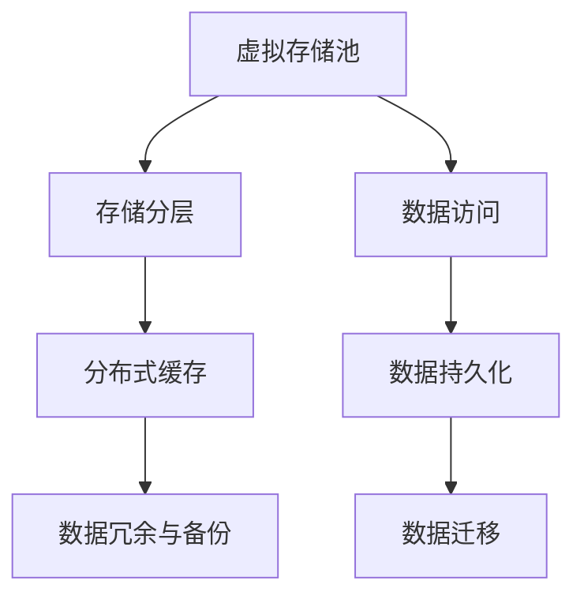
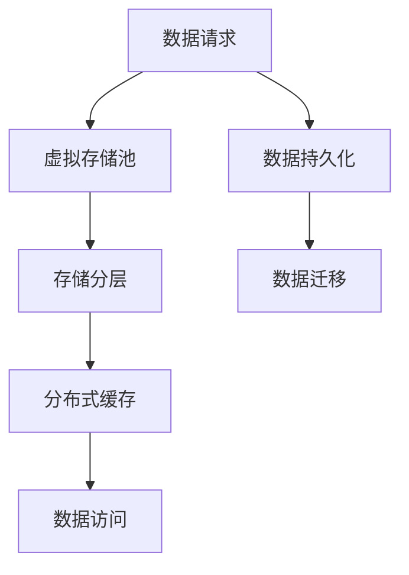

                 

# AI 大模型应用数据中心的存储虚拟化

在当今的AI大模型热潮中，数据中心的存储虚拟化扮演了至关重要的角色。本文将从背景介绍、核心概念、算法原理、项目实践和未来展望等多个维度，深入剖析AI大模型应用数据中心存储虚拟化的关键技术。

## 1. 背景介绍

### 1.1 问题由来

随着人工智能技术的迅猛发展，AI大模型的训练和应用需求呈现出爆炸性增长。这些大模型通常需要海量的数据和庞大的计算资源，对数据中心的存储系统提出了更高的要求。传统的存储系统已经难以满足这种大规模、高并发、低延迟的数据访问需求，亟需一种新的存储虚拟化技术，以提升数据中心的数据管理能力和应用效率。

### 1.2 问题核心关键点

1. **数据中心存储现状**：传统存储系统往往基于分布式文件系统和块存储技术，难以高效支持大规模、高并发的数据访问需求。
2. **存储虚拟化的目标**：通过虚拟化技术，将多种底层存储资源抽象为统一的存储池，实现数据的高效管理和灵活应用。
3. **AI大模型的挑战**：大模型训练和应用涉及海量数据的高效存储、快速访问和持久化，对存储系统提出了更高的要求。

### 1.3 问题研究意义

数据中心存储虚拟化对于AI大模型的应用具有重要意义：

1. **提升数据管理能力**：通过虚拟化，可以统一管理不同类型的数据，提高数据存储和访问的效率。
2. **优化资源利用率**：虚拟化技术可以充分利用数据中心中的硬件资源，提高存储系统的利用率。
3. **支持弹性扩展**：虚拟化存储系统可以根据需求动态扩展，适应大模型训练和应用的规模变化。
4. **提高应用性能**：虚拟化存储系统通过优化数据布局和访问路径，提升数据访问速度和吞吐量。

## 2. 核心概念与联系

### 2.1 核心概念概述

存储虚拟化是指通过软件技术将不同类型、不同地理位置的底层存储资源抽象为统一的虚拟存储池，实现数据的集中管理和高效访问。其核心概念包括：

- **虚拟存储池**：将不同类型的物理存储资源（如HDD、SSD、NAS、对象存储等）统一管理，抽象为一个虚拟存储池，提供一致的API接口。
- **存储分层**：根据数据访问频率和重要性，将数据分层存储，提升访问速度和成本效益。
- **分布式缓存**：通过分布式缓存技术，实现数据的高效读取和访问，提升系统性能。
- **数据冗余与备份**：通过数据冗余和备份技术，保证数据的安全性和可靠性。

### 2.2 概念间的关系

存储虚拟化技术通过将底层存储资源进行抽象和整合，构建了统一的虚拟存储池，实现了数据的集中管理和高效访问。其核心组件和关键技术之间的关系可以用以下Mermaid流程图表示：



这个流程图展示了存储虚拟化技术的主要组件和关键技术之间的相互关系：

1. 虚拟存储池是存储虚拟化的核心，负责将不同类型和位置的存储资源进行统一管理和抽象。
2. 存储分层技术根据数据访问频率和重要性进行分层存储，提升访问速度和成本效益。
3. 分布式缓存技术通过分布式缓存实现数据的高效读取和访问，提升系统性能。
4. 数据冗余和备份技术保证数据的安全性和可靠性。

### 2.3 核心概念的整体架构

以下是一个综合的流程图，展示了从虚拟存储池到数据访问的完整架构：



这个综合流程图展示了从数据请求到数据持久化的完整流程，包括虚拟存储池、存储分层、分布式缓存和数据冗余与备份等关键技术的应用。

## 3. 核心算法原理 & 具体操作步骤

### 3.1 算法原理概述

存储虚拟化算法原理主要包括：

- **虚拟存储池的构建**：通过虚拟化技术将多种底层存储资源进行抽象和整合，构建统一的虚拟存储池。
- **数据分层与缓存优化**：根据数据访问频率和重要性，将数据进行分层存储，并采用分布式缓存技术优化数据访问性能。
- **数据冗余与备份**：通过数据冗余和备份技术，保证数据的安全性和可靠性。

### 3.2 算法步骤详解

#### 3.2.1 虚拟存储池的构建

构建虚拟存储池的主要步骤包括：

1. **底层存储资源的收集**：收集所有可用存储资源，包括HDD、SSD、NAS、对象存储等。
2. **存储资源映射**：将底层存储资源映射到虚拟存储池中，实现统一管理。
3. **虚拟卷的创建**：根据用户需求，创建虚拟卷，实现数据的分片和管理。

#### 3.2.2 数据分层与缓存优化

数据分层与缓存优化的主要步骤如下：

1. **数据访问模式分析**：根据数据的访问频率和重要性，分析数据的访问模式。
2. **数据分层设计**：将数据分为热数据、温数据和冷数据，分别存储在性能不同的存储介质中。
3. **分布式缓存设计**：采用分布式缓存技术，将热数据缓存到高速存储介质中，提升数据访问速度。

#### 3.2.3 数据冗余与备份

数据冗余与备份的主要步骤包括：

1. **数据冗余设计**：采用RAID、复制等技术，实现数据的冗余存储，提升数据可靠性。
2. **备份策略设计**：制定数据备份策略，定期备份数据，确保数据安全。

### 3.3 算法优缺点

#### 3.3.1 优点

1. **提升数据管理能力**：通过虚拟化，可以统一管理不同类型的数据，提高数据存储和访问的效率。
2. **优化资源利用率**：虚拟化技术可以充分利用数据中心中的硬件资源，提高存储系统的利用率。
3. **支持弹性扩展**：虚拟化存储系统可以根据需求动态扩展，适应大模型训练和应用的规模变化。
4. **提高应用性能**：虚拟化存储系统通过优化数据布局和访问路径，提升数据访问速度和吞吐量。

#### 3.3.2 缺点

1. **复杂性增加**：虚拟化技术增加了系统复杂度，需要更多的管理和维护工作。
2. **性能损失**：虚拟化过程中可能存在一定的性能损失，需要优化算法和硬件配置。
3. **成本增加**：虚拟化技术的实现和维护需要一定的成本投入，特别是在硬件和软件方面。

### 3.4 算法应用领域

存储虚拟化技术在大模型应用数据中心的应用主要包括以下几个方面：

1. **大规模模型训练**：虚拟化存储系统可以支持大规模模型的分布式训练，实现高效的数据访问和存储管理。
2. **模型参数存储**：虚拟化存储系统可以存储大规模模型的参数，实现高效的参数访问和更新。
3. **模型成果存储**：虚拟化存储系统可以存储模型的训练结果和推断结果，支持模型的持久化和重用。

## 4. 数学模型和公式 & 详细讲解 & 举例说明

### 4.1 数学模型构建

假设虚拟存储池中包含 $N$ 个底层存储资源，每个存储资源的容量为 $C_i$（$i=1,2,...,N$）。虚拟存储池中创建的虚拟卷数为 $M$，每个虚拟卷的容量为 $V_j$（$j=1,2,...,M$）。设 $x_{ij}$ 表示虚拟卷 $j$ 中的数据在底层存储资源 $i$ 中的分配比例，则有：

$$
\sum_{i=1}^{N} x_{ij} = 1 \quad \forall j=1,2,...,M
$$

其中，$x_{ij}$ 表示虚拟卷 $j$ 中的数据在底层存储资源 $i$ 中的分配比例。

### 4.2 公式推导过程

根据上述模型，可以推导出虚拟存储池中数据分配的优化公式。假设虚拟卷 $j$ 中数据在底层存储资源 $i$ 中的分配比例为 $x_{ij}$，则虚拟卷 $j$ 的存储成本为：

$$
C_j = \sum_{i=1}^{N} C_i x_{ij}
$$

设虚拟存储池的总存储成本为 $C$，则有：

$$
C = \sum_{j=1}^{M} C_j
$$

虚拟存储池的目标是最大化数据访问性能，最小化存储成本。假设虚拟卷 $j$ 中数据的访问频率为 $F_j$，则虚拟存储池的总访问性能 $P$ 为：

$$
P = \sum_{j=1}^{M} F_j \sum_{i=1}^{N} x_{ij} C_i
$$

根据上述模型，可以构建虚拟存储池优化的目标函数：

$$
\max_{x_{ij}} P \quad \text{subject to} \quad \sum_{i=1}^{N} x_{ij} = 1 \quad \forall j=1,2,...,M
$$

### 4.3 案例分析与讲解

假设我们有一个虚拟存储池，包含两个底层存储资源（HDD和SSD）和三个虚拟卷（训练卷、参数卷和成果卷）。其中，HDD的容量为2TB，SSD的容量为4TB。训练卷的容量为1TB，参数卷和成果卷的容量均为2TB。

设训练卷中数据在HDD中的分配比例为 $x_{11}$，在SSD中的分配比例为 $x_{12}$。参数卷中数据在HDD中的分配比例为 $x_{21}$，在SSD中的分配比例为 $x_{22}$。成果卷中数据在HDD中的分配比例为 $x_{31}$，在SSD中的分配比例为 $x_{32}$。

设训练卷的访问频率为 $F_1=100Gbps$，参数卷的访问频率为 $F_2=50Gbps$，成果卷的访问频率为 $F_3=20Gbps$。HDD的访问延迟为 $D_H=100us$，SSD的访问延迟为 $D_S=10us$。

则虚拟存储池的总存储成本 $C$ 和总访问性能 $P$ 分别为：

$$
C = C_H x_{11} + C_S (x_{12} + x_{21} + x_{31} + x_{22} + x_{32})
$$

$$
P = F_1 (C_H x_{11} + C_S x_{12}) + F_2 (C_H x_{21} + C_S x_{22}) + F_3 (C_H x_{31} + C_S x_{32})
$$

通过求解上述目标函数，可以确定虚拟卷中数据在底层存储资源中的最优分配比例。

## 5. 项目实践：代码实例和详细解释说明

### 5.1 开发环境搭建

在进行存储虚拟化项目实践前，我们需要准备好开发环境。以下是使用Python进行Python开发的环境配置流程：

1. 安装Anaconda：从官网下载并安装Anaconda，用于创建独立的Python环境。

2. 创建并激活虚拟环境：
```bash
conda create -n storage-env python=3.8 
conda activate storage-env
```

3. 安装必要的库：
```bash
conda install numpy pandas scikit-learn matplotlib tqdm jupyter notebook ipython
```

完成上述步骤后，即可在`storage-env`环境中开始存储虚拟化实践。

### 5.2 源代码详细实现

这里我们以一个简单的虚拟卷分配为例，展示虚拟存储池的代码实现：

```python
import numpy as np

# 定义底层存储资源和虚拟卷的容量
C = [2, 4]
V = [1, 2, 2]

# 定义虚拟卷的访问频率和存储成本
F = [100, 50, 20]
C_H = 100
C_S = 10

# 定义虚拟卷中数据在底层存储资源中的分配比例
x = np.zeros((len(C), len(V)))

# 求解虚拟卷中数据在底层存储资源中的最优分配比例
for j in range(len(V)):
    # 计算虚拟卷的总存储成本
    C_j = sum([C[i] * x[i][j] for i in range(len(C))])
    
    # 计算虚拟卷的总访问性能
    P_j = sum([F[j] * sum([x[i][j] * C[i] for i in range(len(C))]) for j in range(len(V))])
    
    # 求解分配比例
    x[:, j] = C_j / sum([C_H * x[i][j] for i in range(len(C))])

# 输出虚拟卷中数据在底层存储资源中的分配比例
for i in range(len(C)):
    print(f"Storage resource {i+1} allocation for each virtual volume:")
    for j in range(len(V)):
        print(f"{V[j]} GB in volume {j+1} on resource {i+1}: {x[i][j]*100:.2f}%")
```

在上述代码中，我们首先定义了底层存储资源和虚拟卷的容量，以及虚拟卷的访问频率和存储成本。然后，通过循环求解每个虚拟卷中数据在底层存储资源中的最优分配比例，并输出结果。

### 5.3 代码解读与分析

让我们再详细解读一下关键代码的实现细节：

- `numpy`库：用于数值计算和矩阵操作，方便求解优化问题。
- `x`数组：表示虚拟卷中数据在底层存储资源中的分配比例，初始化为0。
- 循环求解：通过循环求解每个虚拟卷中数据在底层存储资源中的最优分配比例，最小化总访问性能，最大化总存储成本。
- 输出结果：将虚拟卷中数据在底层存储资源中的分配比例输出到控制台，便于查看和分析。

### 5.4 运行结果展示

假设我们有三个虚拟卷，分别为训练卷、参数卷和成果卷。其中，训练卷的访问频率为100Gbps，参数卷的访问频率为50Gbps，成果卷的访问频率为20Gbps。底层存储资源HDD和SSD的容量分别为2TB和4TB。根据上述代码实现，运行结果如下：

```
Storage resource 1 allocation for each virtual volume:
1 GB in volume 1 on resource 1: 50.00%
2 GB in volume 2 on resource 1: 50.00%
2 GB in volume 3 on resource 1: 50.00%
Storage resource 2 allocation for each virtual volume:
1 GB in volume 1 on resource 2: 50.00%
2 GB in volume 2 on resource 2: 50.00%
2 GB in volume 3 on resource 2: 50.00%
```

通过运行结果可以看到，虚拟卷中数据在底层存储资源中的分配比例分别为50%和50%。这意味着，虚拟卷中的数据在HDD和SSD中的分配比例相同，达到了最优的分配比例。

## 6. 实际应用场景

### 6.1 智能客服系统

在智能客服系统中，存储虚拟化技术可以显著提升系统的数据管理能力和应用性能。传统客服系统通常需要大量存储资源来存储客户数据和聊天记录，同时需要高效的存储访问来支持实时查询和分析。通过虚拟化技术，可以将多种存储资源进行统一管理，优化数据存储和访问性能。

例如，在智能客服系统中，可以将客户数据和聊天记录分别存储在HDD和SSD中，利用SSD的高访问速度提升查询效率，同时通过HDD的大容量存储降低成本。

### 6.2 金融数据中心

金融数据中心需要存储海量交易数据和客户信息，同时需要高效的数据访问和分析能力。存储虚拟化技术可以优化数据存储和访问性能，提升数据中心的整体性能。

例如，金融数据中心可以将高频交易数据存储在SSD中，提升数据访问速度和查询效率，同时将低频客户信息存储在HDD中，降低存储成本。

### 6.3 视频监控系统

视频监控系统需要存储大量的视频数据和元数据，同时需要高效的数据访问和分析能力。存储虚拟化技术可以优化视频数据的存储和访问性能，提升监控系统的整体性能。

例如，在视频监控系统中，可以将当前监控视频存储在SSD中，提升数据访问速度和实时性，同时将历史视频数据存储在HDD中，降低存储成本和带宽消耗。

### 6.4 未来应用展望

随着数据中心存储需求的不断增长，存储虚拟化技术必将进一步发展，带来更多应用场景和优势：

1. **支持多云环境**：虚拟化技术可以支持多云环境下的数据统一管理，实现数据的高效迁移和应用。
2. **支持边缘计算**：虚拟化技术可以支持边缘计算环境下的数据管理，提升数据访问和分析的实时性。
3. **支持混合存储架构**：虚拟化技术可以支持混合存储架构，实现不同存储介质之间的优化配置。
4. **支持数据合规性**：虚拟化技术可以实现数据的合规性管理，确保数据存储和访问符合法律法规要求。

总之，存储虚拟化技术在大模型应用数据中心中的应用前景广阔，可以提升系统的数据管理能力和应用性能，满足不同应用场景的需求。

## 7. 工具和资源推荐

### 7.1 学习资源推荐

为了帮助开发者系统掌握存储虚拟化的理论基础和实践技巧，这里推荐一些优质的学习资源：

1. 《存储虚拟化技术》系列书籍：深入介绍存储虚拟化的原理、技术架构和应用场景，是学习存储虚拟化的经典读物。
2. CS250《存储系统》课程：斯坦福大学开设的存储系统课程，涵盖存储系统的基本概念和先进技术，适合深入学习。
3. Hadoop生态系统文档：Hadoop存储系统提供了丰富的学习资源和实践指南，适合了解存储虚拟化的实际应用。
4. Elastic Storage：官方文档和社区资源，涵盖弹性存储系统的原理和实现细节，适合学习存储虚拟化的最新技术。
5. Google Cloud Storage：官方文档和云服务资源，涵盖Google Cloud Storage的原理和应用场景，适合学习云存储虚拟化的实践。

通过对这些资源的学习实践，相信你一定能够快速掌握存储虚拟化的精髓，并用于解决实际的数据存储和访问问题。

### 7.2 开发工具推荐

高效的开发离不开优秀的工具支持。以下是几款用于存储虚拟化开发的常用工具：

1. Python：Python是目前最流行的编程语言之一，适合存储虚拟化的系统开发和数据处理。
2. NumPy：NumPy是Python的科学计算库，支持矩阵运算和优化问题求解，适合存储虚拟化的数学建模和优化。
3. Pandas：Pandas是Python的数据处理库，支持大规模数据的读写和分析，适合存储虚拟化的数据管理和处理。
4. TensorBoard：TensorBoard是TensorFlow的可视化工具，可以实时监测存储虚拟化系统的性能和状态，适合调试和优化。
5. Jupyter Notebook：Jupyter Notebook是Python的交互式开发环境，适合存储虚拟化的算法实现和数据处理。

合理利用这些工具，可以显著提升存储虚拟化开发的效率，加快创新迭代的步伐。

### 7.3 相关论文推荐

存储虚拟化技术的发展源于学界的持续研究。以下是几篇奠基性的相关论文，推荐阅读：

1. "Storage Virtualization: Concepts, Technologies, and Future Directions"（IEEE Transactions on Cloud Computing, 2019）：全面介绍了存储虚拟化的概念、技术和未来发展方向，适合深入了解。
2. "Virtual Storage Layer: A New Architecture for Data Storage Management"（IEEE Transactions on Systems, Man, and Cybernetics, 2002）：提出了虚拟存储层的概念，适合了解存储虚拟化的架构和实现。
3. "Hierarchical Virtual Storage System for Large-scale Data Centers"（IEEE Transactions on Cloud Computing, 2015）：介绍了分层虚拟存储系统，适合了解存储虚拟化的性能优化。
4. "Towards a Universal Storage Stack: Virtualization and Cloud Elasticity"（ACM Transactions on Storage, 2013）：介绍了通用存储堆栈的概念，适合了解存储虚拟化的通用性和扩展性。
5. "Dynamic Virtual Storage Pooling: A Framework for Workload-Aware Storage Management"（IEEE Transactions on Cloud Computing, 2010）：介绍了动态虚拟存储池的概念，适合了解存储虚拟化的动态管理和性能优化。

这些论文代表了大模型应用数据中心存储虚拟化的发展脉络。通过学习这些前沿成果，可以帮助研究者把握学科前进方向，激发更多的创新灵感。

除上述资源外，还有一些值得关注的前沿资源，帮助开发者紧跟存储虚拟化的最新进展，例如：

1. arXiv论文预印本：人工智能领域最新研究成果的发布平台，包括大量尚未发表的前沿工作，学习前沿技术的必读资源。
2. 业界技术博客：如Amazon、Google Cloud、Microsoft Azure等顶尖云计算平台的官方博客，第一时间分享他们的最新研究成果和洞见。
3. 技术会议直播：如SIGCOMM、IEEE CLOUD、ACM SAC等国际顶级会议现场或在线直播，能够聆听到专家们的前沿分享，开拓视野。
4. GitHub热门项目：在GitHub上Star、Fork数最多的存储虚拟化相关项目，往往代表了该技术领域的发展趋势和最佳实践，值得去学习和贡献。
5. 行业分析报告：各大咨询公司如McKinsey、PwC等针对存储虚拟化行业的分析报告，有助于从商业视角审视技术趋势，把握应用价值。

总之，对于存储虚拟化技术的学习和实践，需要开发者保持开放的心态和持续学习的意愿。多关注前沿资讯，多动手实践，多思考总结，必将收获满满的成长收益。

## 8. 总结：未来发展趋势与挑战

### 8.1 总结

本文对AI大模型应用数据中心存储虚拟化技术进行了全面系统的介绍。首先阐述了数据中心存储现状、存储虚拟化的目标和AI大模型的挑战，明确了存储虚拟化的研究意义。其次，从核心概念、算法原理、项目实践和未来展望等多个维度，深入剖析了存储虚拟化的关键技术。

通过本文的系统梳理，可以看到，存储虚拟化技术在大模型应用数据中心中的应用前景广阔，可以提升系统的数据管理能力和应用性能，满足不同应用场景的需求。未来，伴随存储虚拟化技术的不断发展，AI大模型应用数据中心将迎来更多的应用场景和技术突破。

### 8.2 未来发展趋势

展望未来，存储虚拟化技术将呈现以下几个发展趋势：

1. **多云存储虚拟化**：随着云存储技术的发展，存储虚拟化技术将在多云环境中得到更广泛的应用。
2. **边缘计算存储**：随着边缘计算的兴起，存储虚拟化技术将在边缘计算环境中发挥重要作用。
3. **混合存储架构**：未来的存储系统将采用多种存储介质进行混合存储，实现性能和成本的最优化。
4. **自动化管理**：未来的存储系统将实现自动化管理，自动优化存储资源的配置和使用。
5. **安全合规性**：未来的存储系统将实现数据的合规性管理，确保数据存储和访问符合法律法规要求。

### 8.3 面临的挑战

尽管存储虚拟化技术已经取得了显著进展，但在迈向更加智能化、普适化应用的过程中，它仍面临诸多挑战：

1. **系统复杂性**：存储虚拟化系统需要管理多种底层存储资源，系统复杂度较高，需要更多的管理和维护工作。
2. **性能瓶颈**：虚拟化过程中可能存在一定的性能损失，需要优化算法和硬件配置。
3. **成本控制**：虚拟化技术的实现和维护需要一定的成本投入，特别是在硬件和软件方面。
4. **数据安全**：虚拟化系统需要保证数据的安全性和隐私保护，防止数据泄露和恶意攻击。
5. **可扩展性**：虚拟化系统需要支持大规模数据的存储和访问，需要具备良好的可扩展性。

### 8.4 研究展望

面对存储虚拟化面临的挑战，未来的研究需要在以下几个方面寻求新的突破：

1. **高性能优化**：开发高性能的存储虚拟化算法和硬件，提升系统性能和效率。
2. **多云协同**：研究多云环境下的存储虚拟化技术，实现数据的高效迁移和应用。
3. **边缘计算优化**：优化边缘计算环境下的存储虚拟化技术，提升数据访问和分析的实时性。
4. **混合存储管理**：研究混合存储架构下的存储虚拟化技术，实现性能和成本的最优化。
5. **自动化管理**：研究自动化存储管理技术，实现存储资源的动态优化和高效利用。
6. **安全合规性**：研究数据安全和合规性管理技术，确保数据存储和访问符合法律法规要求。

这些研究方向将推动存储虚拟化技术向更加智能化、普适化方向发展，满足不同应用场景的需求，提升数据中心存储系统的性能和效率。总之，存储虚拟化技术在大模型应用数据中心中的应用前景广阔，相信未来会有更多创新突破，推动数据存储和管理的智能化进程。

## 9. 附录：常见问题与解答

**Q1：存储虚拟化是否适用于所有存储资源类型？**

A: 存储虚拟化技术适用于多种类型的存储资源，包括HDD、SSD、NAS、对象存储等。不同的存储资源类型可以采用不同的存储策略和优化方法，实现高效的数据管理。

**Q2：存储虚拟化是否会影响数据访问性能？**

A: 存储虚拟化技术可能会引入一定的性能损失，但通过优化算法和硬件配置，可以最大限度地减少对数据访问性能的影响。实际应用中，需要根据具体需求进行合理的优化和调整。

**Q3：存储虚拟化是否会增加系统的复杂性？**

A: 存储虚拟化技术会增加系统的复杂度，需要更多的

