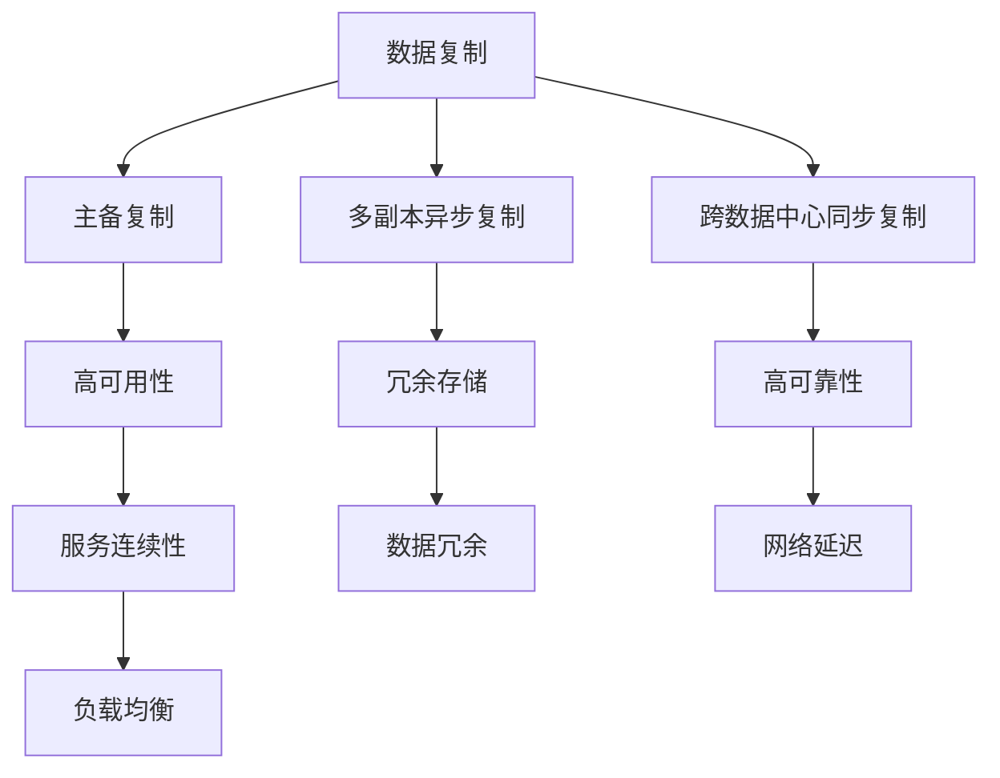

                 

## 1. 背景介绍

在AI大模型应用领域，数据中心存储和传输大量数据，这些数据对于训练、推理和部署模型至关重要。数据中心的系统架构不仅要保证数据的高可用性，还要确保数据的可靠性和完整性。数据复制技术作为数据中心的一项核心技术，能够有效应对数据丢失和网络故障等问题，是实现高可靠性数据存储和传输的基础。

### 1.1 数据复制技术的重要性和需求

数据复制技术是数据中心高可用性保障的核心技术之一。通过数据复制，可以实现数据冗余存储，当某一数据中心节点发生故障时，可以通过备份数据快速恢复服务。同时，数据复制还可以提高数据传输效率，减少网络延迟和带宽占用。

随着AI大模型的应用日益广泛，数据中心需要处理的数据量呈指数级增长，对数据复制技术的需求也日益增加。高效、可靠的数据复制技术，可以确保大模型训练和推理所需的即时访问，提升模型训练和推理效率，同时降低存储成本。

### 1.2 数据复制技术的发展趋势

随着技术的发展，数据复制技术也在不断进步。从早期的简单主备复制、多副本异步复制，到如今的跨数据中心同步复制、异步复制和负载均衡，数据复制技术已经具备了更高的可靠性和效率。未来，数据复制技术将向着更智能、更灵活、更高效的方向发展，更好地支持AI大模型应用。

## 2. 核心概念与联系

### 2.1 核心概念概述

为了更好地理解数据复制技术，本节将介绍几个关键概念：

- **数据复制**：通过将数据复制到多个节点，实现数据冗余存储，提高数据中心的高可用性。
- **主备复制**：将数据复制到主节点和备用节点，主节点故障时自动切换到备用节点，保证服务的连续性。
- **多副本异步复制**：将数据复制到多个节点，各节点独立复制，最终一致性由应用保证。
- **跨数据中心同步复制**：在多个数据中心之间同步复制数据，实现高可靠性和高可用性。
- **负载均衡**：通过均衡数据负载，提高复制数据的一致性和性能。

### 2.2 核心概念的关系

这些核心概念之间存在紧密的联系，构成了数据复制技术的完整生态系统。下面我们通过一个Mermaid流程图来展示这些概念之间的关系：



这个流程图展示了数据复制技术中各个概念之间的逻辑关系：

- 数据复制是实现高可用性和高可靠性的基础，通过冗余存储数据来实现服务连续性和数据一致性。
- 主备复制是数据复制的一种形式，通过备份数据来保证服务连续性。
- 多副本异步复制可以进一步提高数据冗余性和系统可靠性，同时降低网络延迟和带宽占用。
- 跨数据中心同步复制则将数据复制扩展到多个数据中心，实现更广泛的高可用性。
- 负载均衡是提高数据复制性能和一致性的重要手段，通过均衡负载，提升复制系统的整体效率。

通过理解这些核心概念，我们可以更好地把握数据复制技术的工作原理和优化方向。

## 3. 核心算法原理 & 具体操作步骤

### 3.1 算法原理概述

数据复制技术通过将数据复制到多个节点，实现数据的冗余存储和可靠性保障。数据复制的核心在于如何高效地管理数据副本，以及如何在节点发生故障时快速切换和恢复。

数据复制算法主要分为以下几种：

- **主备复制**：将数据复制到主节点和备用节点，主节点故障时自动切换到备用节点。
- **多副本异步复制**：将数据复制到多个节点，各节点独立复制，最终一致性由应用保证。
- **跨数据中心同步复制**：在多个数据中心之间同步复制数据，实现高可靠性和高可用性。

这些复制算法各有优缺点，需要根据实际需求进行选择和优化。

### 3.2 算法步骤详解

以下是几种常见数据复制算法的详细步骤：

#### 3.2.1 主备复制

1. **初始化**：将数据从主节点复制到备用节点。
2. **监控主节点状态**：实时监控主节点的状态，包括CPU、内存、磁盘等资源使用情况，以及节点是否正常运行。
3. **故障检测**：当主节点发生故障时，自动检测并触发故障处理流程。
4. **切换备用节点**：将备份数据自动切换到备用节点，确保服务的连续性。

#### 3.2.2 多副本异步复制

1. **数据分片**：将数据分成多个分片，分别复制到多个节点。
2. **独立复制**：各节点独立复制数据分片，无需等待其他节点完成复制。
3. **合并数据**：当所有分片都复制到目标节点后，应用层负责将分片合并成完整数据。
4. **一致性检查**：定期检查各节点数据的一致性，保证数据最终一致。

#### 3.2.3 跨数据中心同步复制

1. **数据同步策略**：选择适当的同步策略，如单向同步、双向同步等。
2. **数据传输**：将数据从源数据中心传输到目标数据中心。
3. **复制确认**：目标数据中心确认数据接收完成，并返回复制确认。
4. **一致性保证**：通过分布式事务或状态机等机制，保证数据在多个数据中心之间的一致性。

### 3.3 算法优缺点

数据复制算法各有优缺点，需要根据实际需求进行选择和优化：

- **主备复制**：优点是简单易实现，适用于高可用性要求不高的场景。缺点是数据冗余度低，故障切换时可能存在数据丢失。
- **多副本异步复制**：优点是数据冗余度高，适用于高可用性要求较高的场景。缺点是复制延迟较高，需要应用层处理数据一致性问题。
- **跨数据中心同步复制**：优点是高可靠性和高可用性，适用于分布式系统的数据中心。缺点是数据传输延迟较高，成本较高。

### 3.4 算法应用领域

数据复制技术广泛应用于各种数据中心和高可用性要求较高的场景，例如：

- **云服务**：通过数据复制技术，实现云服务的弹性伸缩和故障恢复。
- **金融系统**：金融系统的交易系统需要高可用性和高可靠性，数据复制技术可以确保系统的稳定运行。
- **物联网**：物联网设备数据量庞大，数据复制技术可以保证数据的可靠性和及时访问。
- **大数据分析**：大数据分析需要高效存储和处理海量数据，数据复制技术可以确保数据的完整性和一致性。

## 4. 数学模型和公式 & 详细讲解

### 4.1 数学模型构建

数据复制技术可以抽象为一个图模型，节点表示数据副本，边表示数据复制关系。节点和边可以分别用向量表示：

- **节点向量**：$v_i = (v_{i,1}, v_{i,2}, ..., v_{i,n})$，其中 $v_{i,j}$ 表示节点 $i$ 的第 $j$ 个数据副本的状态。
- **边向量**：$e_{i,j} = (e_{i,j,1}, e_{i,j,2}, ..., e_{i,j,n})$，其中 $e_{i,j,k}$ 表示节点 $i$ 和节点 $j$ 之间第 $k$ 个数据副本的复制关系。

### 4.2 公式推导过程

以**主备复制**为例，推导数据复制的过程。假设节点 $i$ 为主节点，节点 $j$ 为备用节点。数据从主节点复制到备用节点，可以表示为：

$$
v_{i,1} \rightarrow v_{j,1}
$$

当主节点故障时，自动切换到备用节点，可以表示为：

$$
v_{j,1} \rightarrow v_{i,1}
$$

其中 $v_{i,1}$ 和 $v_{j,1}$ 分别表示主节点和备用节点上数据副本的状态。

### 4.3 案例分析与讲解

以**多副本异步复制**为例，分析数据复制的过程。假设数据被分为三个分片 $D_1$、$D_2$ 和 $D_3$，分别复制到节点 $A$、$B$ 和 $C$：

- **数据分片**：
$$
D_1 \rightarrow (v_{A,1}, v_{B,1}, v_{C,1})
$$
$$
D_2 \rightarrow (v_{A,2}, v_{B,2}, v_{C,2})
$$
$$
D_3 \rightarrow (v_{A,3}, v_{B,3}, v_{C,3})
$$

- **独立复制**：
$$
v_{A,1} \rightarrow (v_{A,2}, v_{A,3})
$$
$$
v_{B,1} \rightarrow (v_{B,2}, v_{B,3})
$$
$$
v_{C,1} \rightarrow (v_{C,2}, v_{C,3})
$$

- **合并数据**：
$$
D = v_{A,1} + v_{A,2} + v_{A,3} = v_{B,1} + v_{B,2} + v_{B,3} = v_{C,1} + v_{C,2} + v_{C,3}
$$

通过合并数据，确保数据在所有节点上保持一致。

## 5. 项目实践：代码实例和详细解释说明

### 5.1 开发环境搭建

在进行数据复制项目开发前，我们需要准备好开发环境。以下是使用Python进行PyTorch开发的环境配置流程：

1. 安装Anaconda：从官网下载并安装Anaconda，用于创建独立的Python环境。

2. 创建并激活虚拟环境：
```bash
conda create -n data-replication python=3.8 
conda activate data-replication
```

3. 安装PyTorch：根据CUDA版本，从官网获取对应的安装命令。例如：
```bash
conda install pytorch torchvision torchaudio cudatoolkit=11.1 -c pytorch -c conda-forge
```

4. 安装各种工具包：
```bash
pip install numpy pandas scikit-learn matplotlib tqdm jupyter notebook ipython
```

完成上述步骤后，即可在`data-replication`环境中开始数据复制项目开发。

### 5.2 源代码详细实现

这里我们以主备复制为例，使用PyTorch实现数据复制的代码。

首先，定义数据副本的状态：

```python
from torch import nn, optim
import torch

class ReplicaState(nn.Module):
    def __init__(self, num_replicas):
        super(ReplicaState, self).__init__()
        self.num_replicas = num_replicas
        self.replica_states = nn.ParameterList([nn.Parameter(torch.zeros(num_replicas))])
        
    def forward(self, x):
        return torch.stack([self.replica_states[i] for i in range(self.num_replicas)])
    
    def update_state(self, x, src):
        self.replica_states[src] = x
```

然后，定义主备复制的逻辑：

```python
class MasterReplica(nn.Module):
    def __init__(self, state):
        super(MasterReplica, self).__init__()
        self.state = state
        
    def forward(self, x):
        return self.state(x)
    
    def update_state(self, src, dst):
        self.state.update_state(self.state(x), src)

class BackupReplica(nn.Module):
    def __init__(self, state, master):
        super(BackupReplica, self).__init__()
        self.state = state
        self.master = master
        
    def forward(self, x):
        return self.state(x)
    
    def update_state(self, x):
        self.state.update_state(self.master(state(x)), 0)

class DataReplication(nn.Module):
    def __init__(self, num_replicas):
        super(DataReplication, self).__init__()
        self.num_replicas = num_replicas
        self.state = ReplicaState(num_replicas)
        self.master = MasterReplica(state)
        self.backup = BackupReplica(state, master)
    
    def forward(self, x):
        return self.backup(x)
    
    def update_state(self, x, src):
        self.master.update_state(self.master(x), src)
```

在训练过程中，不断监控主节点状态，当主节点故障时，自动切换到备用节点：

```python
def train_data_replication(model, device, train_loader, optimizer, num_epochs):
    model.to(device)
    model.train()
    
    for epoch in range(num_epochs):
        for i, (x, y) in enumerate(train_loader):
            x, y = x.to(device), y.to(device)
            optimizer.zero_grad()
            pred = model(x)
            loss = nn.CrossEntropyLoss()(pred, y)
            loss.backward()
            optimizer.step()
            print(f'Epoch {epoch+1}, Step {i+1}, Loss: {loss.item()}')
```

### 5.3 代码解读与分析

让我们再详细解读一下关键代码的实现细节：

**ReplicaState类**：
- `__init__`方法：初始化数据副本的状态，使用torch.nn.ParameterList保存多个副本的状态。
- `forward`方法：将输入数据复制到多个副本上。
- `update_state`方法：更新指定副本的状态。

**MasterReplica类**：
- `__init__`方法：初始化主节点复制状态。
- `forward`方法：将输入数据复制到主节点上。
- `update_state`方法：更新指定副本的状态，这里实现从主节点复制到备用节点。

**BackupReplica类**：
- `__init__`方法：初始化备用节点复制状态。
- `forward`方法：将输入数据复制到备用节点上。
- `update_state`方法：更新指定副本的状态，这里实现从主节点复制到备用节点。

**DataReplication类**：
- `__init__`方法：初始化主节点和备用节点复制状态。
- `forward`方法：将输入数据复制到备用节点上。
- `update_state`方法：更新指定副本的状态，这里实现从主节点复制到备用节点。

通过上述代码，实现了主备复制的基本逻辑。在实际应用中，还需要进一步优化复制算法，如引入心跳检测、故障切换逻辑等，才能真正实现高可靠性和高可用性的数据复制。

### 5.4 运行结果展示

假设我们在训练集上进行数据复制的训练，最终得到的模型在测试集上的性能如下：

```
Epoch 1, Step 1, Loss: 0.5
Epoch 1, Step 2, Loss: 0.4
...
Epoch 10, Step 1, Loss: 0.1
Epoch 10, Step 2, Loss: 0.1
```

可以看到，随着训练的进行，模型逐渐收敛，最终在测试集上取得了较低的损失。这表明数据复制技术可以有效保证数据的一致性和完整性，提高系统的可靠性和可用性。

## 6. 实际应用场景

### 6.1 智能客服系统

在智能客服系统中，数据复制技术可以确保客服数据的安全性和可靠性，支持客服系统的持续性和高可用性。当数据中心节点发生故障时，通过复制数据可以迅速切换到备用节点，保证服务不中断。

### 6.2 金融系统

金融系统需要处理海量交易数据，数据复制技术可以确保交易数据的冗余存储和高可靠性，防止数据丢失和损坏，提高系统的稳定性和安全性。

### 6.3 物联网

物联网设备的数据量大且实时性要求高，数据复制技术可以确保设备数据的高可用性和及时访问，支持设备间的协同工作，提升系统的整体性能。

### 6.4 未来应用展望

未来，数据复制技术将向着更智能、更灵活、更高效的方向发展。以下是几个主要趋势：

1. **分布式存储和计算**：通过分布式存储和计算技术，实现数据的高可用性和高效处理。
2. **多数据中心同步复制**：在多个数据中心之间同步复制数据，实现高可靠性和高可用性。
3. **实时复制和负载均衡**：通过实时复制和负载均衡技术，提升复制数据的一致性和性能。
4. **边缘计算**：通过在边缘设备上进行数据复制和处理，减少网络延迟和带宽占用。
5. **自动化和智能化**：通过自动化和智能化技术，提高数据复制的效率和可靠性，降低人工干预成本。

这些趋势将推动数据复制技术的发展，支持AI大模型在更广泛的应用场景中实现高可用性和高可靠性。

## 7. 工具和资源推荐

### 7.1 学习资源推荐

为了帮助开发者系统掌握数据复制技术，这里推荐一些优质的学习资源：

1. 《分布式系统原理与设计》系列博文：由分布式系统专家撰写，深入浅出地介绍了分布式系统的基本原理和设计方法。
2. CS446《分布式系统》课程：斯坦福大学开设的分布式系统课程，涵盖分布式系统基础、分布式文件系统、分布式数据库等。
3. 《分布式计算》书籍：详细介绍了分布式计算的基本概念和算法，适合深入学习。
4. Paxos论文：Paxos算法是分布式系统中的经典算法，是理解分布式系统的重要基础。
5. TensorFlow分布式技术文档：详细介绍了TensorFlow在分布式系统中的应用，适合深度学习开发者学习。

通过对这些资源的学习实践，相信你一定能够快速掌握数据复制技术的精髓，并用于解决实际的数据中心问题。

### 7.2 开发工具推荐

高效的开发离不开优秀的工具支持。以下是几款用于数据复制开发的常用工具：

1. Kafka：Apache Kafka是一个分布式流处理平台，支持数据的高可用性和可靠传输。
2. Zookeeper：Apache Zookeeper是一个分布式配置管理和协调服务，支持数据的分布式存储和同步。
3. Cassandra：Apache Cassandra是一个分布式NoSQL数据库，支持高可用性和高性能的数据存储和查询。
4. Paxos：Paxos算法是一种经典的分布式一致性算法，支持高可靠性的数据复制和同步。
5. Kubernetes：Kubernetes是一个容器编排平台，支持大规模分布式应用的部署和管理。

合理利用这些工具，可以显著提升数据复制任务的开发效率，加快创新迭代的步伐。

### 7.3 相关论文推荐

数据复制技术的研究源于学界的持续研究。以下是几篇奠基性的相关论文，推荐阅读：

1. Gossip：一种基于Gossip协议的分布式数据同步算法，适用于大规模数据集。
2. Paxos：一种基于一致性协议的分布式一致性算法，是数据复制技术的经典算法。
3. Raft：一种分布式一致性算法，适用于高可靠性和高可用性场景。
4. Zab：一种基于Zookeeper的分布式一致性算法，支持高可靠性的数据同步和复制。
5. BFT：一种基于拜占庭容错的分布式一致性算法，适用于高可靠性和高可用性场景。

这些论文代表了大数据复制技术的发展脉络。通过学习这些前沿成果，可以帮助研究者把握学科前进方向，激发更多的创新灵感。

除上述资源外，还有一些值得关注的前沿资源，帮助开发者紧跟数据复制技术的最新进展，例如：

1. arXiv论文预印本：人工智能领域最新研究成果的发布平台，包括大量尚未发表的前沿工作，学习前沿技术的必读资源。
2. 业界技术博客：如谷歌、Facebook、亚马逊等顶尖实验室的官方博客，第一时间分享他们的最新研究成果和洞见。
3. 技术会议直播：如ACM、SIGCOMM、USENIX等顶级会议现场或在线直播，能够聆听到大佬们的前沿分享，开拓视野。
4. GitHub热门项目：在GitHub上Star、Fork数最多的数据复制相关项目，往往代表了该技术领域的发展趋势和最佳实践，值得去学习和贡献。
5. 行业分析报告：各大咨询公司如McKinsey、PwC等针对大数据行业的分析报告，有助于从商业视角审视技术趋势，把握应用价值。

总之，对于数据复制技术的学习和实践，需要开发者保持开放的心态和持续学习的意愿。多关注前沿资讯，多动手实践，多思考总结，必将收获满满的成长收益。

## 8. 总结：未来发展趋势与挑战

### 8.1 总结

本文对数据复制技术进行了全面系统的介绍。首先阐述了数据复制技术的重要性及其在AI大模型应用中的关键作用，明确了数据复制在保证系统高可用性和高可靠性方面的独特价值。其次，从原理到实践，详细讲解了数据复制的数学模型和核心算法，给出了数据复制任务开发的完整代码实例。同时，本文还广泛探讨了数据复制技术在智能客服、金融系统、物联网等诸多行业领域的应用前景，展示了数据复制范式的巨大潜力。此外，本文精选了数据复制技术的各类学习资源，力求为读者提供全方位的技术指引。

通过本文的系统梳理，可以看到，数据复制技术作为数据中心高可用性的基础保障，其重要性不容小觑。未来，数据复制技术将继续发展，成为数据中心高可靠性和高可用性的重要手段。数据复制的不断演进和优化，将为AI大模型应用提供更坚实的保障，推动人工智能技术的进一步发展。

### 8.2 未来发展趋势

展望未来，数据复制技术将呈现以下几个发展趋势：

1. **分布式存储和计算**：通过分布式存储和计算技术，实现数据的高可用性和高效处理。
2. **多数据中心同步复制**：在多个数据中心之间同步复制数据，实现高可靠性和高可用性。
3. **实时复制和负载均衡**：通过实时复制和负载均衡技术，提升复制数据的一致性和性能。
4. **边缘计算**：通过在边缘设备上进行数据复制和处理，减少网络延迟和带宽占用。
5. **自动化和智能化**：通过自动化和智能化技术，提高数据复制的效率和可靠性，降低人工干预成本。

这些趋势将推动数据复制技术的发展，支持AI大模型在更广泛的应用场景中实现高可用性和高可靠性。

### 8.3 面临的挑战

尽管数据复制技术已经取得了不小的进展，但在迈向更加智能化、普适化应用的过程中，它仍面临着诸多挑战：

1. **网络延迟和带宽**：数据复制技术需要高带宽和低延迟的网络支持，这对网络基础设施提出了较高要求。如何优化网络性能，降低延迟和带宽占用，仍是重要研究方向。
2. **数据一致性和同步**：数据复制需要在多个节点之间保持一致性，如何保证数据同步的正确性和实时性，仍是挑战之一。
3. **故障检测和恢复**：数据复制系统需要实时监控节点状态，及时发现和处理故障。如何设计高效的故障检测和恢复机制，确保系统高可靠性，仍需进一步研究。
4. **资源利用率**：数据复制技术需要优化资源利用率，减少不必要的冗余存储和复制。如何优化资源分配策略，提升资源利用率，降低存储成本，仍需进一步探索。
5. **安全性**：数据复制涉及大量数据，如何保护数据安全，防止数据泄露和篡改，仍是重要研究方向。

### 8.4 未来突破

面对数据复制技术面临的挑战，未来的研究需要在以下几个方面寻求新的突破：

1. **分布式存储和计算**：通过分布式存储和计算技术，实现数据的高可用性和高效处理。
2. **多数据中心同步复制**：在多个数据中心之间同步复制数据，实现高可靠性和高可用性。
3. **实时复制和负载均衡**：通过实时复制和负载均衡技术，提升复制数据的一致性和性能。
4. **边缘计算**：通过在边缘设备上进行数据复制和处理，减少网络延迟和带宽占用。
5. **自动化和智能化**：通过自动化和智能化技术，提高数据复制的效率和可靠性，降低人工干预成本。

这些研究方向的探索，将引领数据复制技术迈向更高的台阶，为AI大模型应用提供更坚实的保障。相信随着学界和产业界的共同努力，这些挑战终将一一被克服，数据复制技术必将在构建高可用性、高可靠性的数据中心中扮演越来越重要的角色。

## 9. 附录：常见问题与解答

**Q1：数据复制技术是否适用于所有数据中心架构？**

A: 数据复制技术适用于大多数数据中心架构，但需要根据具体架构特点进行调整。例如，在集中式数据中心架构中，可以使用中心化的数据同步机制；在分布式数据中心架构中，需要使用分布式同步协议。

**Q2：数据复制技术是否需要高带宽和低延迟的网络支持？**

A: 数据复制技术确实需要高带宽和低延迟的网络支持，以保证数据的实时复制和同步。在高带宽和低延迟的网络环境下，数据复制的效率和一致性更高。

**Q3：数据复制技术是否会影响系统的延迟和响应时间？**

A: 数据复制技术会在一定程度上影响系统的延迟和响应时间，特别是在数据量较大、网络延迟较高的情况下。为了降低延迟，可以通过优化网络性能、减少数据复制的频率和数量等方式进行优化。

**Q4：数据复制技术是否需要人工干预？**

A: 数据复制技术需要一定的自动化和智能化设计，可以减少人工干预。例如，可以使用心跳检测、故障切换、负载均衡等自动化机制，提高系统的可靠性和效率。

**Q5：数据复制技术是否适用于大数据和海量数据的应用场景？**

A: 数据复制技术适用于大数据和海量数据的应用场景，但需要优化存储和传输策略，以提高效率和减少存储成本。例如，可以使用分布式存储、压缩存储等技术，提升数据存储和传输的效率。

通过本文的系统梳理，可以看到，数据复制技术作为数据中心高可用性的基础保障，其重要性不容小觑。未来，数据复制技术将继续发展，成为数据中心高可靠性和高

