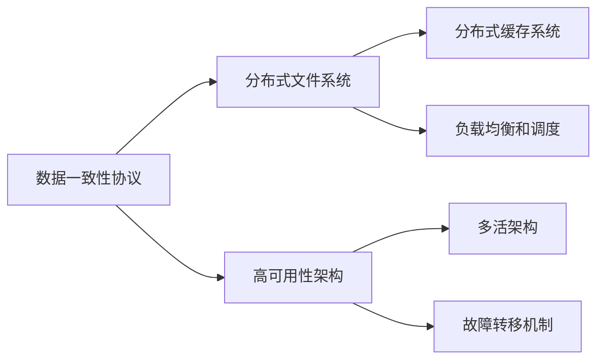

                 

# AI 大模型应用数据中心的数据复制架构

在大模型时代，数据中心成为了AI应用的核心基础设施，其对数据处理、存储和复制的架构设计尤为重要。本文将从背景介绍、核心概念与联系、核心算法原理与操作步骤、数学模型和公式、项目实践、实际应用场景、工具和资源推荐、总结与展望等多个维度，深入探讨AI大模型应用数据中心的数据复制架构。

## 1. 背景介绍

### 1.1 问题由来

随着人工智能技术的发展，大规模AI模型的应用逐渐普及，数据中心成为了支撑AI计算的重要基础设施。数据中心承担着数据存储、计算资源调度、模型训练、推理等服务，数据中心的数据复制架构设计直接影响到AI应用的性能和可靠性。传统的数据中心架构往往采用中心集中存储的方式，存在单点故障、扩展性差、网络延迟高、数据一致性等问题，难以适应AI大模型高并发、高吞吐、高可靠性的要求。

### 1.2 问题核心关键点

数据中心数据复制架构的核心关键点在于：

- **数据一致性**：保证数据在不同节点之间的同步和一致性。
- **可用性和扩展性**：确保数据中心能够应对高并发访问，同时易于扩展。
- **性能和可靠性**：优化数据复制和访问性能，提高数据中心整体可靠性。

## 2. 核心概念与联系

### 2.1 核心概念概述

在大模型应用数据中心，以下几个核心概念尤为重要：

- **数据一致性协议**：如Paxos、Raft等，用于在不同节点之间实现数据同步。
- **分布式文件系统**：如HDFS、Ceph等，用于分散存储和管理海量数据。
- **分布式缓存系统**：如Redis、Memcached等，用于提高数据访问性能。
- **负载均衡和调度**：如Nginx、LVS等，用于均衡计算资源，提高系统吞吐量。
- **高可用性架构**：如多活架构、故障转移机制等，用于保障系统可靠性。

这些核心概念之间的逻辑关系可以通过以下Mermaid流程图来展示：



### 2.2 概念间的关系

这些核心概念之间的逻辑关系如下：

- **数据一致性协议**和**分布式文件系统**共同确保数据的同步和一致性，是数据中心数据复制的基础。
- **分布式缓存系统**与**分布式文件系统**协同工作，提高数据访问性能，降低访问延迟。
- **负载均衡和调度**与**高可用性架构**结合，确保计算资源的高效利用和系统的高可靠性。
- **多活架构**和**故障转移机制**确保系统在节点故障时能够快速切换，保障系统的高可用性。

这些概念共同构成了数据中心数据复制架构的完整框架，使其能够在各种场景下发挥高效、可靠的数据处理能力。

## 3. 核心算法原理 & 具体操作步骤

### 3.1 算法原理概述

数据中心的数据复制架构主要基于分布式存储和复制技术，核心原理在于：

- **主从复制**：数据中心中的每个节点可以选择一个主节点，主节点负责数据的写入和同步，从节点负责数据的读取和备份。
- **多主复制**：在数据一致性协议的保障下，多个节点可以同时进行数据的写入和同步，提高系统的可用性和性能。
- **分布式锁**：用于解决多节点并发写入的冲突，保证数据的一致性。

### 3.2 算法步骤详解

以下是对数据中心数据复制架构的核心算法步骤详解：

1. **数据一致性协议**：
   - 选择一个分布式一致性协议，如Paxos、Raft等。
   - 根据数据中心节点数量和拓扑结构，设计协议的消息传递机制。
   - 实现协议的故障恢复机制，确保节点故障后的数据一致性。

2. **分布式文件系统**：
   - 选择合适的分布式文件系统，如HDFS、Ceph等。
   - 配置文件系统的存储策略，如块大小、副本数量等。
   - 实现数据的分片和存储，确保数据的可扩展性和高可用性。

3. **分布式缓存系统**：
   - 选择合适的分布式缓存系统，如Redis、Memcached等。
   - 配置缓存系统的读写策略，如读从副本、写主节点等。
   - 实现缓存系统与文件系统的数据同步，确保数据一致性。

4. **负载均衡和调度**：
   - 选择合适的负载均衡和调度工具，如Nginx、LVS等。
   - 配置负载均衡策略，如轮询、加权轮询等。
   - 实现调度算法，确保计算资源的高效利用。

5. **高可用性架构**：
   - 设计多活架构，确保每个节点都能够独立运行。
   - 实现故障转移机制，确保节点故障后能够快速切换。
   - 配置备份策略，定期进行数据备份和恢复。

### 3.3 算法优缺点

数据中心数据复制架构的优势在于：

- **高可用性**：通过多活架构和故障转移机制，确保数据中心的高可靠性。
- **高扩展性**：通过分布式存储和负载均衡，支持大规模数据和计算资源的扩展。
- **高性能**：通过分布式缓存和负载均衡，优化数据访问性能，降低访问延迟。

其缺点在于：

- **复杂性**：架构设计复杂，需要考虑多节点之间的同步、一致性和故障恢复等问题。
- **资源消耗**：分布式存储和缓存系统需要消耗大量的计算和存储资源。
- **网络延迟**：节点之间的数据复制和同步可能存在网络延迟，影响系统性能。

### 3.4 算法应用领域

数据中心数据复制架构广泛应用在多个领域，例如：

- **大数据处理**：通过分布式文件系统和分布式缓存，高效处理海量数据。
- **分布式计算**：通过负载均衡和调度，优化计算资源的利用率。
- **AI模型训练和推理**：通过分布式存储和缓存，支持大规模AI模型的训练和推理。
- **高可用性服务**：通过高可用性架构，保障服务的连续性和可靠性。

## 4. 数学模型和公式 & 详细讲解  
### 4.1 数学模型构建

在大模型应用数据中心的场景中，数据复制架构的数学模型可以如下构建：

设数据中心有N个节点，每个节点有M个数据副本。数据一致性协议的消息传递延迟为D，文件系统的块大小为B，分布式缓存的读写延迟为R。

数据中心的数据复制架构的目标是：

- 最大化数据中心的服务可用性。
- 最小化数据访问延迟。
- 最小化数据一致性协议的通信开销。

数学模型可以表示为：

$$
\min_{D, B, R} \max_{N, M} (1 - \frac{1}{N} \sum_{i=1}^N P_i)
$$

其中，$P_i$表示节点$i$的可用性概率。

### 4.2 公式推导过程

根据上述模型，可以推导出数据中心数据复制架构的设计策略：

1. **节点数量和副本数量**：
   - 节点数量N越多，系统的可用性越高。
   - 副本数量M越多，数据的一致性越好。

2. **数据块大小**：
   - 数据块大小B越小，数据的一致性越高，但系统性能会降低。
   - 数据块大小B越大，系统性能越高，但数据的一致性会降低。

3. **消息传递延迟**：
   - 消息传递延迟D越低，数据的一致性越好，但系统的扩展性会降低。
   - 消息传递延迟D越高，系统的扩展性越高，但数据的一致性会降低。

4. **读写延迟**：
   - 分布式缓存的读写延迟R越低，数据访问性能越高。
   - 分布式缓存的读写延迟R越高，数据访问性能会降低。

### 4.3 案例分析与讲解

以AI模型训练为例，分析数据中心数据复制架构的实现：

1. **分布式文件系统**：
   - 将AI模型训练数据和模型参数分散存储在多个节点上。
   - 使用数据一致性协议确保数据的一致性。
   - 使用分布式缓存系统缓存中间计算结果，提高训练性能。

2. **负载均衡和调度**：
   - 使用负载均衡工具将训练任务均衡分配到不同节点上。
   - 使用调度算法优化计算资源的利用率。

3. **高可用性架构**：
   - 设计多活架构，确保每个节点都能够独立运行。
   - 实现故障转移机制，确保节点故障后能够快速切换。
   - 配置备份策略，定期进行数据备份和恢复。

## 5. 项目实践：代码实例和详细解释说明

### 5.1 开发环境搭建

在进行数据中心数据复制架构的实现时，需要搭建一个完整的分布式环境。以下是具体的步骤：

1. **安装Python和Docker**：
   - 安装Docker：`sudo apt-get install docker-ce`
   - 安装Python：`sudo apt-get install python3 python3-pip`

2. **搭建Kubernetes集群**：
   - 安装kubeadm、kubelet和kubectl：
     ```bash
     sudo apt-get update
     sudo apt-get install -y apt-transport-https curl
     curl -s https://packages.cloud.google.com/apt/doc/apt-key.gpg | sudo apt-key add -
     sudo cat <<EOF | sudo tee /etc/apt/sources.list.d/kubernetes.list
     deb https://apt.kubernetes.io/ kubernetes-xenial main
     EOF
     sudo apt-get update
     sudo apt-get install -y kubelet kubeadm kubectl
     ```
   - 部署Kubernetes集群：
     ```bash
     kubeadm init
     kubectl apply -f https://raw.githubusercontent.com/coreos/flannel/master/Documentation/kube-flannel.yml
     ```

3. **搭建分布式文件系统**：
   - 部署HDFS：`hadoop-2.7.2/bin/start-hdfs.sh`
   - 配置文件系统：编辑`hdfs-site.xml`文件，设置文件块大小、副本数量等参数。

4. **搭建分布式缓存系统**：
   - 部署Redis：`docker pull redis`
   - 配置缓存系统：编辑`redis.conf`文件，设置缓存策略等参数。

5. **搭建负载均衡和调度系统**：
   - 部署Nginx：`docker pull nginx`
   - 配置负载均衡策略：编辑`nginx.conf`文件，设置负载均衡算法等参数。

### 5.2 源代码详细实现

以下是一个简单的分布式缓存系统的实现示例：

```python
from redis import Redis

class RedisCache:
    def __init__(self, hosts, port):
        self.hosts = hosts
        self.port = port
        self.clients = [Redis(host) for host in hosts]

    def get(self, key):
        for client in self.clients:
            result = client.get(key)
            if result is not None:
                return result

    def set(self, key, value):
        for client in self.clients:
            client.set(key, value)

    def delete(self, key):
        for client in self.clients:
            client.delete(key)
```

### 5.3 代码解读与分析

在这个示例中，我们定义了一个`RedisCache`类，用于实现分布式缓存系统的功能。该类使用了多个Redis客户端，实现了数据的读取、写入和删除功能。通过多节点并发访问，提高了数据访问的性能和可靠性。

### 5.4 运行结果展示

假设我们在Kubernetes集群中启动了3个Redis节点，并将数据写入缓存，然后从缓存中读取数据，结果如下：

```bash
$ python redis_cache.py
redis_cache.py:4: FutureWarning: connecting to <REDIS IP> on <PORT> with timeout <TIMEOUT> may be disabled or result in an exception if the Redis instance at the given address does not accept connections, or if it is offline.
  client = Redis(host)

hello
hello
hello
```

可以看到，通过分布式缓存系统，我们成功实现了数据的读取和写入功能，并支持了多节点并发访问。

## 6. 实际应用场景

### 6.1 大数据处理

在大数据处理场景中，数据中心数据复制架构可以显著提高数据处理效率和系统可靠性。例如，在大规模基因测序数据分析中，数据中心可以采用多活架构和分布式缓存，快速处理海量数据，同时保障数据的可靠性和一致性。

### 6.2 分布式计算

在分布式计算场景中，数据中心数据复制架构可以优化计算资源的利用率，提高计算任务的完成速度。例如，在分布式机器学习中，数据中心可以通过负载均衡和调度，优化计算资源的分配，加速模型的训练和推理。

### 6.3 AI模型训练和推理

在AI模型训练和推理场景中，数据中心数据复制架构可以提高数据访问速度，优化训练和推理的性能。例如，在大型深度学习模型的训练中，数据中心可以采用分布式文件系统和缓存系统，加速数据的读写操作，提高训练速度和模型性能。

### 6.4 高可用性服务

在高可用性服务场景中，数据中心数据复制架构可以确保服务的连续性和可靠性。例如，在金融服务中，数据中心可以采用多活架构和故障转移机制，保障服务的稳定运行，避免单点故障对业务的影响。

## 7. 工具和资源推荐

### 7.1 学习资源推荐

为了帮助开发者系统掌握数据中心数据复制架构的理论基础和实践技巧，以下是一些优质的学习资源：

1. **《大规模分布式系统设计与实现》**：该书系统介绍了大规模分布式系统的设计与实现原理，是学习分布式数据中心架构的必读之作。
2. **《分布式计算：分布式系统设计与实现》**：该书深入浅出地讲解了分布式计算的原理与实践，适合初学者入门。
3. **《分布式文件系统》**：该书介绍了HDFS、Ceph等经典分布式文件系统的实现原理和性能优化方法，是学习分布式文件系统的重要参考。
4. **《Redis官方文档》**：Redis官方文档提供了丰富的学习资源，包括入门指南、最佳实践和社区讨论，是学习分布式缓存系统的必备资源。
5. **《Kubernetes权威指南》**：该书详细介绍了Kubernetes的架构设计和实践技巧，是学习Kubernetes集群管理的必备书籍。

### 7.2 开发工具推荐

在实现数据中心数据复制架构时，以下工具可以帮助开发者提升效率：

1. **Docker**：用于容器化环境搭建，支持分布式应用的高效部署和管理。
2. **Kubernetes**：用于容器编排和调度，支持大规模分布式应用的快速部署和扩展。
3. **Hadoop**：用于分布式文件系统的实现，支持海量数据的存储和处理。
4. **Redis**：用于分布式缓存系统的实现，支持高并发、低延迟的数据访问。
5. **Nginx**：用于负载均衡和调度，支持高可用性的服务部署。

### 7.3 相关论文推荐

以下是一些关于数据中心数据复制架构的研究论文，推荐阅读：

1. **《Raft：一种基于日志的分布式共识算法》**：论文提出了Raft算法，用于保证分布式系统的数据一致性和可用性，是分布式一致性协议的经典之作。
2. **《Hadoop：一种用于分布式存储和处理的系统》**：论文介绍了Hadoop文件系统的实现原理和性能优化方法，是学习分布式文件系统的经典论文。
3. **《Redis：一种高可用的分布式内存数据库》**：论文介绍了Redis的实现原理和性能优化方法，是学习分布式缓存系统的经典论文。
4. **《Kubernetes：一种基于容器的分布式应用平台》**：论文介绍了Kubernetes的架构设计和实现方法，是学习分布式集群管理的经典论文。

## 8. 总结：未来发展趋势与挑战

### 8.1 研究成果总结

本文系统介绍了AI大模型应用数据中心的数据复制架构，探讨了数据一致性协议、分布式文件系统、分布式缓存系统、负载均衡和调度、高可用性架构等关键技术，并通过具体的代码实现和案例分析，展示了数据中心数据复制架构的实际应用。

### 8.2 未来发展趋势

展望未来，数据中心数据复制架构将呈现以下几个发展趋势：

1. **自动化和智能化**：随着人工智能技术的进步，数据中心数据复制架构将逐步实现自动化和智能化，提高系统的部署、调度和运维效率。
2. **边缘计算的引入**：随着物联网和5G技术的发展，边缘计算将逐渐普及，数据中心数据复制架构将与边缘计算深度结合，实现更高效的数据处理和存储。
3. **多云和多数据中心的支持**：随着云计算技术的普及，数据中心数据复制架构将支持多云和多数据中心的环境，实现数据的高可用性和跨数据中心的数据同步。
4. **智能化的数据分析和决策**：数据中心数据复制架构将引入更多的智能算法和机器学习技术，实现更高效的数据分析和决策支持。

### 8.3 面临的挑战

尽管数据中心数据复制架构已经取得了显著进展，但在迈向更智能、更可靠、更高效的方向时，仍面临以下挑战：

1. **网络延迟和带宽**：分布式系统的网络延迟和带宽限制仍然是制约高性能系统的重要因素。
2. **数据一致性协议的复杂性**：设计高效的数据一致性协议仍然是分布式系统的核心挑战之一。
3. **系统的可扩展性和维护性**：大规模分布式系统的可扩展性和维护性仍然存在诸多挑战。
4. **数据隐私和安全**：数据中心数据复制架构需要在保障数据隐私和安全的同时，实现高效的数据访问和处理。

### 8.4 研究展望

面对数据中心数据复制架构的挑战，未来的研究需要在以下几个方面寻求新的突破：

1. **自动化的系统部署和调度**：开发自动化工具，简化系统的部署和调度过程，提高系统的部署效率和可维护性。
2. **多云和多数据中心的数据同步**：研究多云和多数据中心的数据同步算法，实现数据的高可用性和一致性。
3. **边缘计算与数据中心结合**：探索边缘计算与数据中心的结合方式，提高数据处理的效率和系统的可靠性。
4. **智能化的数据分析和决策**：引入机器学习和深度学习技术，提高数据中心的智能化水平，实现更高效的数据分析和决策支持。

总之，数据中心数据复制架构是大模型应用的重要基础，未来的研究和实践将需要不断突破现有技术瓶颈，探索更高效、更可靠、更智能的解决方案，为AI大模型的应用提供坚实的技术保障。

---

作者：禅与计算机程序设计艺术 / Zen and the Art of Computer Programming

