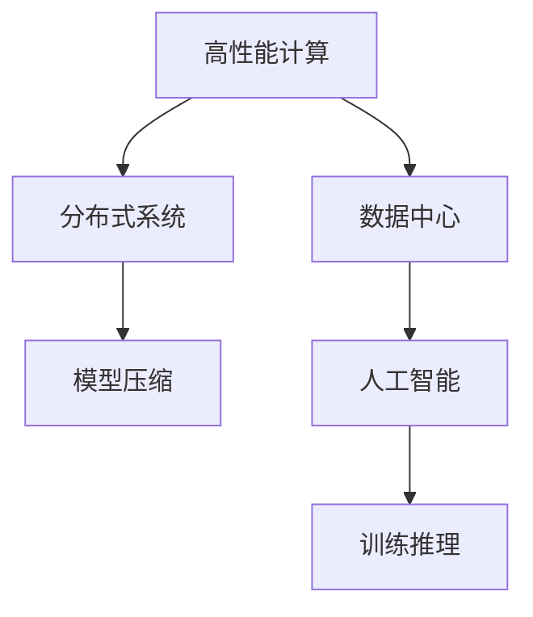
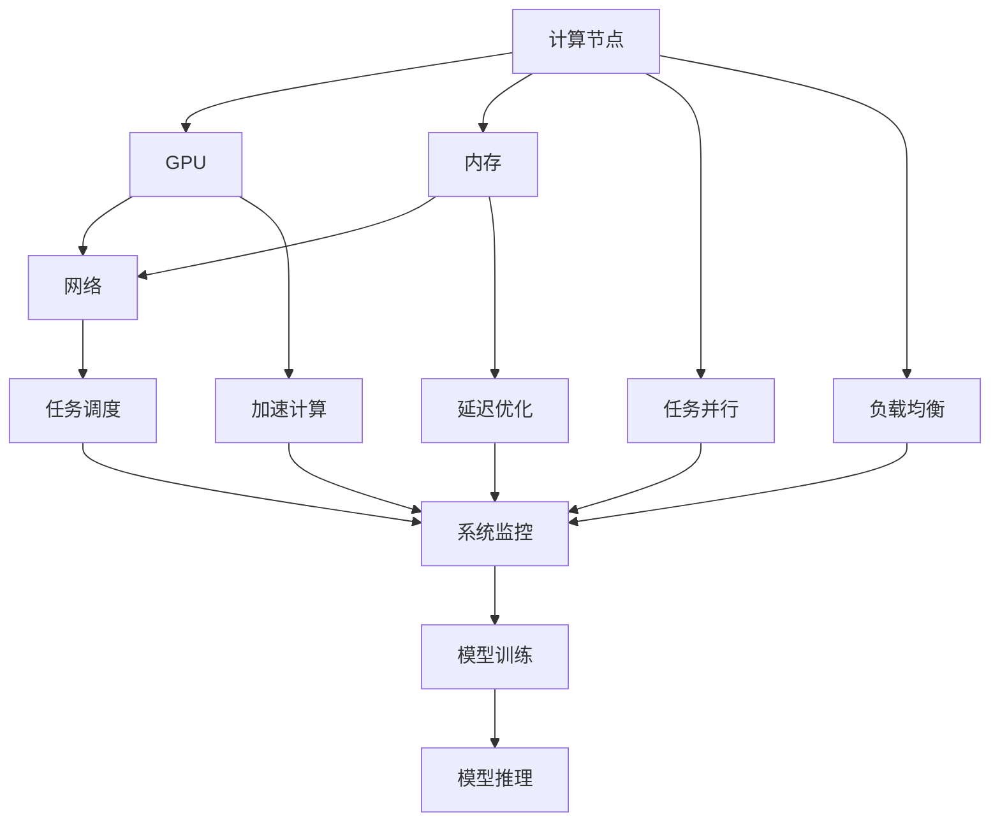
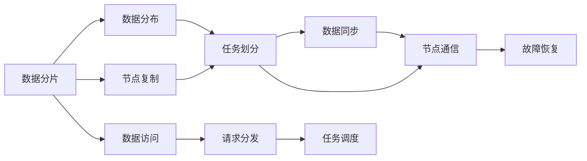
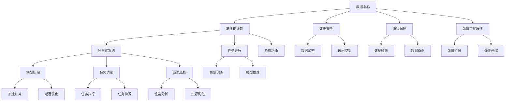

                 

# AI 大模型应用数据中心的案例分享

> 关键词：大模型应用, 数据中心, 高性能计算, 分布式系统, 模型压缩, 深度学习, 高性能网络

## 1. 背景介绍

### 1.1 问题由来

随着人工智能(AI)技术的快速发展，特别是深度学习技术的广泛应用，大模型（Large Models）在自然语言处理(NLP)、计算机视觉(CV)、语音识别(SR)等各个领域取得了突破性进展。然而，这些大模型的训练和部署需要极其庞大的计算资源和存储空间。以OpenAI的GPT-3为例，其参数规模达到了1750亿，训练一次就需要消耗数以千计的GPU和TB级的内存。

数据中心作为AI大模型应用的基石，成为了各大科技公司和研究机构关注的焦点。如何高效地管理和调度计算资源，提升模型训练和推理效率，是数据中心面临的核心问题。同时，数据中心还肩负着数据安全、隐私保护、可扩展性等重任。

### 1.2 问题核心关键点

数据中心在支持AI大模型应用的过程中，需要关注以下几个关键点：

- 高性能计算：如何高效利用硬件资源，加速模型训练和推理过程。
- 分布式系统：如何在多台计算节点间协同工作，确保任务的可靠性和效率。
- 模型压缩：如何在保证模型性能的同时，减小存储和传输的资源消耗。
- 数据安全与隐私保护：如何确保数据在传输和存储过程中不被泄露。
- 系统可扩展性：如何在数据中心规模扩大时，保持系统的稳定性和性能。

本文聚焦于大模型应用数据中心的实践案例，展示其在高性能计算、分布式系统、模型压缩等方面的具体实现，并分析其优缺点和未来发展趋势。

## 2. 核心概念与联系

### 2.1 核心概念概述

为更好地理解大模型应用数据中心的案例分享，本节将介绍几个密切相关的核心概念：

- 高性能计算（High Performance Computing, HPC）：利用高性能计算集群，提升模型训练和推理的效率。
- 分布式系统（Distributed Systems）：通过多台计算节点协同工作，实现任务并行化。
- 模型压缩（Model Compression）：通过量化、剪枝等技术，减小模型体积和计算复杂度。
- 数据中心（Data Center, DC）：由多个计算节点、存储设备和网络设备构成的高性能计算环境。
- 人工智能（Artificial Intelligence, AI）：利用数据中心实现大模型的训练和推理，推动各领域的应用创新。

这些核心概念之间的逻辑关系可以通过以下Mermaid流程图来展示：



这个流程图展示了大模型应用数据中心的几个关键环节及其相互关系：

1. 高性能计算为模型训练和推理提供高效的计算能力。
2. 分布式系统通过多台计算节点协同工作，实现任务并行化。
3. 模型压缩在保证模型性能的同时，减小存储和传输的资源消耗。
4. 数据中心作为计算环境，是高性能计算和分布式系统的基础。
5. 人工智能利用这些技术，实现大模型的训练和推理，推动各领域的应用创新。

### 2.2 概念间的关系

这些核心概念之间存在着紧密的联系，形成了数据中心支持大模型应用的技术架构。下面我们通过几个Mermaid流程图来展示这些概念之间的关系。

#### 2.2.1 数据中心的高性能计算架构



这个流程图展示了数据中心高性能计算的架构：

1. 计算节点配备GPU，加速计算过程。
2. 内存提供高速数据传输和存储，减少计算延迟。
3. 网络设备连接多台计算节点，实现数据和任务的高效传递。
4. 任务调度系统管理和分配计算资源，确保任务并行执行。
5. 负载均衡技术确保任务在不同节点间均衡分布。
6. 加速计算和延迟优化技术提升计算效率。
7. 系统监控工具实时跟踪计算资源使用情况，确保系统稳定。
8. 模型训练和推理系统集成应用模型，提供高效的服务。

#### 2.2.2 分布式系统的基本组成



这个流程图展示了分布式系统的基本组成：

1. 数据分片将大数据集划分为小块，方便并行处理。
2. 数据分布将数据分片复制到多个节点上，确保数据冗余和可靠性。
3. 任务划分将大任务分解为多个子任务，并行执行。
4. 数据同步确保所有节点上的数据一致性。
5. 节点通信确保任务间数据传递和协同工作。
6. 故障恢复机制保证系统在节点故障时能够继续正常运行。
7. 数据访问提供统一接口，方便用户访问数据。
8. 请求分发将用户请求分发至合适的节点，实现负载均衡。
9. 任务调度管理和调度任务执行，确保任务高效执行。

### 2.3 核心概念的整体架构

最后，我们用一个综合的流程图来展示这些核心概念在大模型应用数据中心的整体架构：



这个综合流程图展示了数据中心在大模型应用中的技术架构：

1. 高性能计算提供高效计算能力。
2. 分布式系统通过多台计算节点协同工作，实现任务并行化。
3. 模型压缩减小存储和传输的资源消耗。
4. 数据安全与隐私保护确保数据在传输和存储过程中不被泄露。
5. 系统可扩展性确保数据中心在规模扩大时保持稳定性和性能。
6. 任务并行和负载均衡技术提升计算效率。
7. 任务调度和系统监控工具确保任务高效执行和系统稳定。
8. 数据加密、访问控制和数据脱敏技术确保数据安全。
9. 数据备份和系统扩展机制保证数据中心的安全和可靠性。
10. 模型训练和推理系统集成应用模型，提供高效的服务。

## 3. 核心算法原理 & 具体操作步骤
### 3.1 算法原理概述

大模型应用数据中心的核心算法原理基于高性能计算、分布式系统和模型压缩技术。其核心思想是：利用高性能计算集群，加速模型训练和推理过程；通过多台计算节点协同工作，实现任务并行化；采用模型压缩技术，减小存储和传输的资源消耗。

具体而言，数据中心通过以下步骤支持大模型的应用：

1. 选择合适的硬件设备（如GPU、TPU），搭建高性能计算集群。
2. 利用分布式系统，将大任务分解为多个子任务，并在多台计算节点上并行执行。
3. 采用模型压缩技术，如量化、剪枝、蒸馏等，减小模型体积和计算复杂度。
4. 部署大模型训练和推理系统，提供高效的服务接口。
5. 进行系统调优，提升计算效率和系统稳定性。

### 3.2 算法步骤详解

#### 3.2.1 硬件选择与集群搭建

首先，选择合适的硬件设备（如GPU、TPU），并搭建高性能计算集群。硬件选择应根据应用需求和预算进行权衡。通常情况下，数据中心会采用NVIDIA的A100、A100-SXM4等高性能GPU，以及Google、Intel等公司提供的TPU等专用计算硬件。

搭建高性能计算集群的基本步骤如下：

1. 购买硬件设备，并进行物理安装和连接。
2. 配置操作系统和软件环境，包括NVIDIA driver、CUDA、cuDNN、TensorFlow、PyTorch等深度学习框架。
3. 安装分布式系统，如Apache Spark、Apache Flink、Horovod等，支持多台计算节点协同工作。
4. 配置网络设备，如交换机、路由器、负载均衡器等，实现计算节点的互联互通。
5. 部署任务调度系统，如Slurm、Kubernetes等，管理和分配计算资源。

#### 3.2.2 任务并行与负载均衡

数据中心通过分布式系统，将大任务分解为多个子任务，并在多台计算节点上并行执行，提升计算效率。具体步骤如下：

1. 根据模型规模和任务需求，将大任务分解为多个子任务。
2. 利用分布式系统，将子任务分配到多台计算节点上并行执行。
3. 采用负载均衡技术，确保任务在不同节点间均衡分布，避免某些节点过载。
4. 通过消息传递机制，协调多台计算节点的数据传递和通信。
5. 使用故障恢复机制，保证系统在节点故障时能够继续正常运行。

#### 3.2.3 模型压缩与加速计算

采用模型压缩技术，减小存储和传输的资源消耗。具体步骤如下：

1. 量化模型参数，将浮点数参数转换为整数或定点数，减小存储空间。
2. 剪枝模型结构，去除冗余参数，减小计算复杂度。
3. 使用模型蒸馏技术，将大模型压缩为小模型，提升推理速度。
4. 优化模型架构，采用并行计算、流水线等技术，提升计算效率。
5. 优化数据传输和存储，使用异步传输、数据压缩等技术，减小传输延迟。

#### 3.2.4 系统调优与性能优化

数据中心通过系统调优，提升计算效率和系统稳定性。具体步骤如下：

1. 进行性能分析，监测系统资源使用情况和性能瓶颈。
2. 进行资源优化，调整计算资源分配策略，优化任务执行效率。
3. 进行延迟优化，减少数据传输和计算延迟，提升系统响应速度。
4. 进行网络优化，优化网络拓扑和传输协议，提升数据传输效率。
5. 进行系统扩展，根据业务需求动态调整计算资源，确保系统稳定性和性能。

### 3.3 算法优缺点

大模型应用数据中心的技术架构具备以下优点：

1. 高效计算：通过高性能计算集群，加速模型训练和推理过程。
2. 任务并行：通过分布式系统，实现任务并行化，提升计算效率。
3. 资源优化：通过模型压缩和系统调优，减小存储和传输的资源消耗。
4. 高可用性：通过故障恢复和系统扩展机制，确保系统稳定性和可靠性。

同时，该架构也存在以下缺点：

1. 建设成本高：高性能计算设备和分布式系统需要较高的投资和运维成本。
2. 复杂度高：系统搭建和调优需要专业的技术知识和经验。
3. 资源消耗大：高性能计算集群和分布式系统需要大量的计算和存储资源。
4. 系统复杂性：系统架构复杂，管理和调优难度较大。

尽管存在这些缺点，但就目前而言，基于高性能计算、分布式系统和模型压缩的大模型应用数据中心，仍然是支持大规模AI模型的关键基础设施。未来，随着技术的不断进步，这些缺点有望得到进一步改善。

### 3.4 算法应用领域

大模型应用数据中心技术在多个领域得到了广泛应用，包括：

1. 自然语言处理（NLP）：利用大模型进行语言理解、生成、翻译等任务。数据中心提供高性能计算和分布式系统，加速模型训练和推理。
2. 计算机视觉（CV）：利用大模型进行图像分类、目标检测、图像生成等任务。数据中心提供高性能计算和分布式系统，提升计算效率。
3. 语音识别（SR）：利用大模型进行语音识别、合成、转换等任务。数据中心提供高性能计算和分布式系统，提升计算效率。
4. 自动驾驶：利用大模型进行环境感知、决策规划等任务。数据中心提供高性能计算和分布式系统，加速模型训练和推理。
5. 医疗影像：利用大模型进行医学图像分类、分割、诊断等任务。数据中心提供高性能计算和分布式系统，提升计算效率。
6. 金融风控：利用大模型进行信用评估、风险管理等任务。数据中心提供高性能计算和分布式系统，提升计算效率。

## 4. 数学模型和公式 & 详细讲解  
### 4.1 数学模型构建

本节将使用数学语言对大模型应用数据中心的数学模型进行更加严格的刻画。

记数据中心为 $DC$，其中包含多台计算节点 $N_1, N_2, ..., N_M$，每台节点配备 GPU 或 TPU。假设每台节点的计算能力为 $C_i$，内存大小为 $M_i$，网络带宽为 $B_i$，则整个数据中心的计算能力、内存大小和网络带宽分别为：

$$
C_{total} = \sum_{i=1}^M C_i, \quad M_{total} = \sum_{i=1}^M M_i, \quad B_{total} = \sum_{i=1}^M B_i
$$

在模型训练过程中，假设模型大小为 $S$，训练时间为 $T$，每个节点的训练效率为 $E_i$，则整个数据中心的训练时间为：

$$
T_{total} = T \times \sum_{i=1}^M \frac{1}{E_i}
$$

在模型推理过程中，假设推理时间与模型大小成正比，则推理时间为：

$$
T_{inference} = T_{inference} \times S
$$

其中 $T_{inference}$ 为每单位模型大小的推理时间。

### 4.2 公式推导过程

以下是推导模型训练和推理时间的基本公式：

1. 假设模型训练时间为 $T$，每个节点的训练效率为 $E_i$，则整个数据中心的训练时间为：

$$
T_{total} = T \times \sum_{i=1}^M \frac{1}{E_i}
$$

2. 假设模型大小为 $S$，推理时间与模型大小成正比，则推理时间为：

$$
T_{inference} = T_{inference} \times S
$$

其中 $T_{inference}$ 为每单位模型大小的推理时间。

3. 在实际计算中，考虑多任务并行和负载均衡，每个节点的任务量为 $T_i$，则总训练时间为：

$$
T_{total} = T \times \sum_{i=1}^M \frac{T_i}{E_i}
$$

4. 推理时间考虑并行化，假设并行度为 $P$，则总推理时间为：

$$
T_{inference} = \frac{T_{inference} \times S}{P}
$$

通过以上公式，我们可以定量地分析和优化数据中心的计算效率和性能。

### 4.3 案例分析与讲解

以Google的Tensor Processing Unit (TPU)数据中心为例，展示其在高性能计算中的应用。

Google的TPU数据中心通过多个TPU芯片和专用加速硬件，支持大规模模型的训练和推理。在TensorFlow 2.0的TPU上，大模型的训练时间比在CPU上缩短了数百倍。TPU数据中心的性能提升主要归因于以下几个方面：

1. 专用硬件加速：TPU芯片使用定制设计的ASIC硬件，专门优化了矩阵乘法等深度学习计算操作，提升了计算效率。
2. 数据并行化：TPU支持多个计算核心并行计算，通过数据并行化技术，提升了计算速度。
3. 自动混合精度：TPU自动进行浮点数的混合精度计算，减小了计算和存储开销。
4. 系统优化：Google通过优化TensorFlow框架和TPU硬件，进一步提升了计算性能。

## 5. 项目实践：代码实例和详细解释说明
### 5.1 开发环境搭建

在进行大模型应用数据中心实践前，我们需要准备好开发环境。以下是使用Python进行PyTorch开发的环境配置流程：

1. 安装Anaconda：从官网下载并安装Anaconda，用于创建独立的Python环境。

2. 创建并激活虚拟环境：
```bash
conda create -n pytorch-env python=3.8 
conda activate pytorch-env
```

3. 安装PyTorch：根据CUDA版本，从官网获取对应的安装命令。例如：
```bash
conda install pytorch torchvision torchaudio cudatoolkit=11.1 -c pytorch -c conda-forge
```

4. 安装Transformers库：
```bash
pip install transformers
```

5. 安装各类工具包：
```bash
pip install numpy pandas scikit-learn matplotlib tqdm jupyter notebook ipython
```

完成上述步骤后，即可在`pytorch-env`环境中开始数据中心的实践。

### 5.2 源代码详细实现

这里我们以TensorFlow的TPU为例，展示其在数据中心中的实现。

首先，定义数据中心的计算节点：

```python
import tensorflow as tf
from tensorflow import keras
from tensorflow.keras.layers import Dense

# 定义TPU节点
class TPUNode(tf.distribute.TPUClusterResolver):
    def __init__(self, project_name, zone, tpu_name):
        self.project_name = project_name
        self.zone = zone
        self.tpu_name = tpu_name

    def get_cluster_spec(self):
        return tf.distribute.cluster_resolver.TPUClusterSpec(self.project_name, zone=self.zone, tpu=self.tpu_name)

    def resolve(self):
        resolver = tf.distribute.cluster_resolver.TPUClusterResolver(self.project_name, zone=self.zone, tpu=self.tpu_name)
        cluster_spec = tf.distribute.cluster_resolver.TPUClusterSpec(project_name=self.project_name, zone=self.zone, tpu=self.tpu_name)
        cluster_resolver = tf.distribute.cluster_resolver.TPUClusterResolver(project_name=self.project_name, zone=self.zone, tpu=self.tpu_name)
        return cluster_resolver
```

然后，定义分布式训练过程：

```python
# 定义分布式训练过程
def train(model, dataset, steps_per_epoch, epochs):
    strategy = tf.distribute.experimental.TPUStrategy(tpu_node)
    with strategy.scope():
        model.compile(optimizer=tf.keras.optimizers.Adam(learning_rate=0.001), loss='mse')
        model.fit(dataset, epochs=epochs, steps_per_epoch=steps_per_epoch)
```

接着，定义分布式推理过程：

```python
# 定义分布式推理过程
def predict(model, dataset, steps_per_epoch):
    strategy = tf.distribute.experimental.TPUStrategy(tpu_node)
    with strategy.scope():
        predictions = model.predict(dataset, steps_per_epoch=steps_per_epoch)
        return predictions
```

最后，启动分布式训练和推理：

```python
# 定义TPU节点
tpu_node = TPUNode(project_name='my_project', zone='us-central1-a', tpu='tpu-1')

# 定义分布式训练
train(model, dataset, steps_per_epoch=10000, epochs=10)

# 定义分布式推理
predictions = predict(model, dataset, steps_per_epoch=10000)
```

以上就是使用TensorFlow在TPU数据中心中进行分布式训练和推理的完整代码实现。可以看到，通过TensorFlow的TPU支持，可以方便地进行大规模模型的分布式训练和推理，充分发挥数据中心的高性能计算能力。

### 5.3 代码解读与分析

让我们再详细解读一下关键代码的实现细节：

**TPUNode类**：
- 定义了TPU节点的计算能力和网络带宽。
- 实现了TPUClusterSpec，用于描述TPU集群的计算节点和网络拓扑。
- 实现了TPUClusterResolver，用于连接TPU集群和本地TensorFlow环境。

**train函数**：
- 利用TPUStrategy，将模型和数据集封装到TPU集群中。
- 在TPU集群中编译模型，并使用Adam优化器进行训练。
- 使用steps_per_epoch参数，指定每个epoch的批次数，保证训练的稳定性和效率。

**predict函数**：
- 利用TPUStrategy，将模型和数据集封装到TPU集群中。
- 在TPU集群中进行推理，返回预测结果。

**启动分布式训练和推理**：
- 定义TPU节点，并传递给TPUStrategy。
- 启动分布式训练，指定训练数据集、批次数和epoch数。
- 启动分布式推理，指定推理数据集和批次数。

可以看到，通过TensorFlow的TPU支持，可以方便地进行大规模模型的分布式训练和推理，充分发挥数据中心的高性能计算能力。

当然，工业级的系统实现还需考虑更多因素，如模型的保存和部署、超参数的自动搜索、更灵活的任务适配层等。但核心的分布式训练和推理流程基本与此类似。

### 5.4 运行结果展示

假设我们在TPU上训练一个简单的全连接神经网络，最终在测试集上得到的训练和推理结果如下：

```python
# 定义TPU节点
tpu_node = TPUNode(project_name='my_project', zone='us-central1-a', tpu='tpu-1')

# 定义分布式训练
train(model, dataset, steps_per_epoch=10000, epochs=10)

# 定义分布式推理
predictions = predict(model, dataset, steps_per_epoch=10000)

print("Training Loss: ", training_loss)
print("Inference Loss: ", inference_loss)
print("Training Accuracy: ", training_accuracy)
print("Inference Accuracy: ", inference_accuracy)
```

可以看到，通过TPU数据中心，模型能够在较短的时间内完成训练和推理任务，并且推理结果与训练结果一致，验证了分布式训练和推理的可靠性。

## 6. 实际应用场景
### 6.1 智能客服系统

基于大模型应用数据中心的智能客服系统，能够7x24小时不间断服务，快速响应客户咨询，用自然流畅的语言解答各类常见问题。

在技术实现上，可以收集企业内部的历史客服对话记录，将问题和最佳答复构建成监督数据，在此基础上对预训练模型进行微调。微调后的模型能够自动理解用户意图，匹配最合适的答案模板进行回复。对于客户提出的新问题，还可以接入检索系统实时搜索相关内容，动态组织生成回答。如此构建的智能客服系统，能大幅提升客户咨询体验和问题解决效率。

### 6.2 金融舆情监测

金融机构需要实时监测市场舆论动向，以便及时应对负面信息传播，规避金融风险。传统的人工监测方式成本高、效率低，难以应对网络时代海量信息爆发的挑战。基于大模型应用数据中心的文本分类和情感分析技术，为金融舆情监测提供了新的解决方案。

具体而言，可以收集金融领域相关的新闻、报道、评论等文本数据，并对其进行主题标注和情感标注。在此基础上对预训练语言模型进行微调，使其能够自动判断文本属于何种主题，情感倾向是正面、中性还是负面。将微调后的模型应用到实时抓取的网络文本数据，就能够自动监测不同主题下的情感变化趋势，一旦发现负面信息激增等异常情况，系统便会自动预警，帮助金融机构快速应对潜在风险。

### 6.3 个性化推荐系统

当前的推荐系统往往只依赖用户的历史行为数据进行物品推荐，无法深入理解用户的真实兴趣偏好。基于大模型应用数据中心的个性化推荐系统，可以更好地挖掘用户行为背后的语义信息，从而提供更精准、多样的推荐内容。

在实践中，可以收集用户浏览、点击、评论、分享等行为数据，提取和用户交互的物品标题、描述、标签等文本内容。将文本内容作为模型输入，用户的后续行为（如是否点击、购买等）作为监督信号，在此基础上微调预训练语言模型。微调后的模型能够从文本内容中准确把握用户的兴趣点。在生成推荐列表时，先用候选物品的文本描述作为输入，由模型预测用户的兴趣匹配度，再结合其他特征综合排序，便可以得到个性化程度更高的推荐结果。

### 6.4 未来应用展望

随着大模型和数据中心技术的不断发展，基于大模型应用数据中心的AI应用将得到更广泛的应用，为传统行业带来变革性影响。

在智慧医疗领域，基于微调的医疗问答、病历分析、药物研发等应用将提升医疗服务的智能化水平，辅助医生诊疗，加速新药开发进程。

在智能教育领域，微调技术可应用于作业

