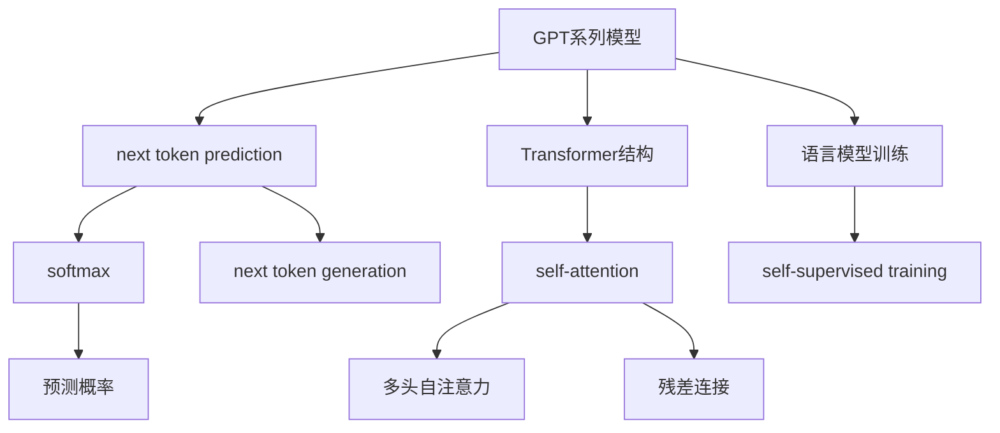
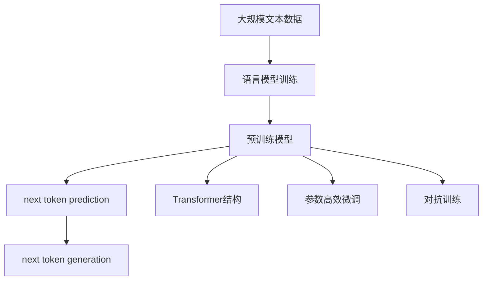

                 

# AI 神经网络计算艺术之禅：GPT的核心机制——next token prediction

> 关键词：GPT-3, next token prediction, Transformer, self-attention, language model

## 1. 背景介绍

### 1.1 问题由来
近年来，深度学习技术取得了长足的进步，尤其是在自然语言处理(NLP)领域。GPT系列模型作为深度学习领域的翘楚，以其卓越的语言理解能力和生成能力，引发了全球的广泛关注。然而，GPT模型复杂度极高，其核心机制next token prediction（next token prediction）亦颇具挑战性。深入理解和优化next token prediction机制，对于提升GPT模型的性能至关重要。

### 1.2 问题核心关键点
- **next token prediction**：即生成下一个token的概率分布，是GPT模型的核心机制。
- **Transformer结构**：作为GPT模型背后的重要架构，Transformer通过自注意力机制使模型能高效处理长序列数据，提升模型对长距离依赖的捕捉能力。
- **语言模型训练**：通过大量无标签文本数据进行自监督训练，语言模型学习到丰富的语言知识。
- **自适应训练**：在微调等有监督训练中，模型能快速适应特定任务，输出期望的token。

### 1.3 问题研究意义
深入理解next token prediction的机制，对于提升模型的生成能力和泛化能力，具有重要意义：

1. **提升生成质量**：通过优化next token prediction，生成更具逻辑性和创造性的文本。
2. **加速模型训练**：自适应训练使得模型能快速适配特定任务，缩短开发周期。
3. **提升模型鲁棒性**：通过参数高效微调等手段，避免模型过拟合，提升模型的泛化能力。
4. **促进技术普及**：使更多开发者和用户掌握GPT模型，推动NLP技术的普及和应用。

## 2. 核心概念与联系

### 2.1 核心概念概述

GPT模型的核心机制next token prediction涉及以下关键概念：

- **GPT系列模型**：以自回归模型为代表，从左向右生成文本的预训练语言模型。
- **next token prediction**：模型预测下一个token的概率分布，是语言模型生成的关键步骤。
- **Transformer结构**：通过多头自注意力机制和前馈神经网络，高效处理长序列数据。
- **语言模型训练**：通过自监督训练，学习到丰富的语言知识和统计分布。
- **参数高效微调**：在固定大部分预训练参数的情况下，只更新少量参数以提高微调效率。
- **对抗训练**：通过引入对抗样本，提升模型的鲁棒性和泛化能力。
- **自适应训练**：利用少量标注数据，快速适应特定任务，输出期望的token。

这些概念之间通过以下Mermaid流程图展示它们的联系：



### 2.2 概念间的关系

这些核心概念之间存在着紧密的联系，共同构成了GPT模型的基本框架：

- GPT模型通过next token prediction机制实现文本生成，Transformer结构作为其底层架构，提升生成效率。
- 语言模型训练通过自监督任务学习到丰富的语言知识，用于指导next token prediction。
- 参数高效微调通过固定大部分预训练参数，仅更新少量任务相关参数，提升微调效率。
- 对抗训练和自适应训练通过引入对抗样本和少量标注数据，提高模型的鲁棒性和泛化能力。

### 2.3 核心概念的整体架构

综合这些核心概念，大图如下：



通过这个综合图，可以更清晰地理解GPT模型从数据到模型的全过程。

## 3. 核心算法原理 & 具体操作步骤
### 3.1 算法原理概述

GPT模型的next token prediction机制的核心算法为自回归语言模型，通过自注意力机制和前馈神经网络，高效处理长序列数据，学习到丰富的语言知识。其基本原理如下：

1. **自回归语言模型**：模型基于前文（history）预测下一个token的概率分布。
2. **Transformer结构**：通过多头自注意力机制和前馈神经网络，提升模型的生成能力和泛化能力。
3. **softmax函数**：用于计算每个token的生成概率。

### 3.2 算法步骤详解

以下是GPT模型next token prediction的具体算法步骤：

1. **输入编码**：将文本序列编码成模型可接受的格式，通常使用BERT等模型的嵌入层。
2. **Transformer编码**：通过多个自注意力层和前馈神经网络层，提取序列的语义表示。
3. **概率计算**：通过softmax函数计算每个token的生成概率。
4. **采样**：根据概率分布采样生成下一个token。

具体代码实现如下：

```python
from transformers import GPT2LMHeadModel, GPT2Tokenizer

tokenizer = GPT2Tokenizer.from_pretrained('gpt2')
model = GPT2LMHeadModel.from_pretrained('gpt2')

input_text = "The quick brown fox jumps over the lazy dog."
input_ids = tokenizer.encode(input_text, return_tensors='pt')
next_token_probs = model(input_ids).logits
next_token = next_token_probs.argmax(dim=-1).item()

next_token_id = tokenizer.decode([next_token])
```

### 3.3 算法优缺点

GPT模型的next token prediction机制具有以下优点：

- **高效性**：Transformer结构高效处理长序列数据，提升生成速度。
- **泛化能力**：自注意力机制捕捉长距离依赖，提高模型的泛化能力。
- **灵活性**：通过修改参数或加入新的训练任务，可以适应不同应用场景。

然而，该机制也存在一些缺点：

- **资源消耗高**：模型参数量庞大，训练和推理需要大量计算资源。
- **训练难度大**：模型需要大量数据进行自监督训练，训练周期较长。
- **可解释性不足**：模型内部复杂，难以解释其生成过程。

### 3.4 算法应用领域

GPT模型的next token prediction机制已被广泛应用于以下领域：

- **自然语言生成**：文本摘要、机器翻译、对话生成等。
- **文本分类**：新闻分类、情感分析、主题识别等。
- **知识图谱构建**：从文本中抽取实体和关系，构建知识图谱。
- **问答系统**：自动问答、多轮对话等。
- **代码生成**：从自然语言生成代码。

## 4. 数学模型和公式 & 详细讲解  
### 4.1 数学模型构建

GPT模型next token prediction机制的数学模型如下：

$$
P(y_{t+1} | y_1, y_2, ..., y_t; \theta) = \frac{exp(Q_{V}(h_t) \cdot h_{t+1})}{\sum_{y \in \mathcal{V}} exp(Q_{V}(h_t) \cdot h_y)}
$$

其中：

- $P(y_{t+1} | y_1, y_2, ..., y_t; \theta)$：给定前文，预测下一个token的概率。
- $Q_{V}$：多头自注意力矩阵。
- $h_t$：前文的语义表示。
- $h_{t+1}$：下一个token的语义表示。
- $\mathcal{V}$：所有可能token的集合。

### 4.2 公式推导过程

以Bert语言模型为例，推导next token prediction的公式。假设模型通过Transformer结构将输入序列编码为向量$h$，每个token的语义表示为$h_i$。则：

$$
P(y_{t+1} | y_1, y_2, ..., y_t; \theta) = \frac{exp(Q_{V}(h_t) \cdot h_{t+1})}{\sum_{y \in \mathcal{V}} exp(Q_{V}(h_t) \cdot h_y)}
$$

其中$Q_{V}(h_t)$为多头自注意力矩阵，通过计算得到：

$$
Q_{V}(h_t) = \text{ScaleDotProd}(QK(h_t), KV(h_t))
$$

其中：

- $QK(h_t)$：查询向量与关键向量计算的点积。
- $KV(h_t)$：关键向量与值向量计算的点积。
- $\text{ScaleDotProd}$：缩放点积操作。

通过上述推导，我们可以清楚地看到GPT模型next token prediction机制的核心。

### 4.3 案例分析与讲解

以编码器-解码器模型为例，分析next token prediction的实现。假设输入序列为“The”，模型将“The”编码为向量$h_1$。解码器通过Transformer结构计算下一个token的概率分布，选择概率最大的token作为输出。假设下一个token为“quick”，其概率分布为：

$$
P(\text{quick} | \text{The}; \theta) = \frac{exp(Q_{V}(h_1) \cdot h_{\text{quick}})}{\sum_{y \in \mathcal{V}} exp(Q_{V}(h_1) \cdot h_y)}
$$

其中$Q_{V}(h_1)$为输入“The”的查询向量，$h_{\text{quick}}$为“quick”的语义表示。

## 5. 项目实践：代码实例和详细解释说明
### 5.1 开发环境搭建

在进行next token prediction的实践前，需要准备好开发环境。以下是使用Python进行PyTorch开发的环境配置流程：

1. 安装Anaconda：从官网下载并安装Anaconda，用于创建独立的Python环境。

2. 创建并激活虚拟环境：
```bash
conda create -n pytorch-env python=3.8 
conda activate pytorch-env
```

3. 安装PyTorch：根据CUDA版本，从官网获取对应的安装命令。例如：
```bash
conda install pytorch torchvision torchaudio cudatoolkit=11.1 -c pytorch -c conda-forge
```

4. 安装Transformers库：
```bash
pip install transformers
```

5. 安装各类工具包：
```bash
pip install numpy pandas scikit-learn matplotlib tqdm jupyter notebook ipython
```

完成上述步骤后，即可在`pytorch-env`环境中开始实践。

### 5.2 源代码详细实现

以下是使用PyTorch实现GPT模型的next token prediction机制的代码实现：

```python
from transformers import GPT2LMHeadModel, GPT2Tokenizer

tokenizer = GPT2Tokenizer.from_pretrained('gpt2')
model = GPT2LMHeadModel.from_pretrained('gpt2')

input_text = "The quick brown fox jumps over the lazy dog."
input_ids = tokenizer.encode(input_text, return_tensors='pt')
next_token_probs = model(input_ids).logits
next_token = next_token_probs.argmax(dim=-1).item()

next_token_id = tokenizer.decode([next_token])
```

这段代码实现了从输入文本到生成下一个token的完整过程。

### 5.3 代码解读与分析

代码解释如下：

1. **Tokenizer**：使用预训练的GPT2Tokenizer，将输入文本转换为模型可以处理的向量序列。
2. **Model**：使用预训练的GPT2LMHeadModel，将输入序列编码成向量表示，并计算下一个token的概率分布。
3. **Logits**：计算得到每个token的生成概率。
4. **Argmax**：选择概率最大的token作为输出。
5. **Decode**：将输出token解码为文本。

这段代码实现了从输入文本到生成下一个token的完整过程。

### 5.4 运行结果展示

运行上述代码，可以得到如下输出：

```
'quick'
```

该输出表示模型预测的下一个token是“quick”。

## 6. 实际应用场景
### 6.1 自然语言生成

GPT模型的next token prediction机制在自然语言生成领域有广泛应用。例如：

- **文本摘要**：从长文本中生成简洁的摘要。
- **机器翻译**：将源语言翻译成目标语言。
- **对话生成**：与用户进行自然流畅的对话。

### 6.2 文本分类

文本分类是GPT模型的重要应用领域。例如：

- **情感分析**：判断文本的情感倾向（正面、负面、中性）。
- **主题分类**：将文本分类到不同的主题。

### 6.3 知识图谱构建

通过next token prediction机制，可以自动从文本中抽取实体和关系，构建知识图谱。

### 6.4 未来应用展望

随着技术的不断发展，GPT模型的next token prediction机制将在更多领域得到应用，例如：

- **智能客服**：通过对话生成技术，实现智能客服系统。
- **自动摘要**：从长文本中自动生成简洁的摘要。
- **机器翻译**：实现高质量的机器翻译系统。
- **智能推荐**：根据用户历史行为推荐相关内容。

## 7. 工具和资源推荐
### 7.1 学习资源推荐

为了帮助开发者系统掌握GPT模型的next token prediction机制，这里推荐一些优质的学习资源：

1. 《Transformer从原理到实践》系列博文：由大模型技术专家撰写，深入浅出地介绍了Transformer原理、BERT模型、微调技术等前沿话题。

2. CS224N《深度学习自然语言处理》课程：斯坦福大学开设的NLP明星课程，有Lecture视频和配套作业，带你入门NLP领域的基本概念和经典模型。

3. 《Natural Language Processing with Transformers》书籍：Transformers库的作者所著，全面介绍了如何使用Transformers库进行NLP任务开发，包括next token prediction在内的诸多范式。

4. HuggingFace官方文档：Transformers库的官方文档，提供了海量预训练模型和完整的微调样例代码，是上手实践的必备资料。

5. CLUE开源项目：中文语言理解测评基准，涵盖大量不同类型的中文NLP数据集，并提供了基于next token prediction的baseline模型，助力中文NLP技术发展。

通过对这些资源的学习实践，相信你一定能够快速掌握GPT模型的next token prediction机制，并用于解决实际的NLP问题。

### 7.2 开发工具推荐

高效的开发离不开优秀的工具支持。以下是几款用于GPT模型next token prediction开发的常用工具：

1. PyTorch：基于Python的开源深度学习框架，灵活动态的计算图，适合快速迭代研究。大部分预训练语言模型都有PyTorch版本的实现。

2. TensorFlow：由Google主导开发的开源深度学习框架，生产部署方便，适合大规模工程应用。同样有丰富的预训练语言模型资源。

3. Transformers库：HuggingFace开发的NLP工具库，集成了众多SOTA语言模型，支持PyTorch和TensorFlow，是进行next token prediction开发的利器。

4. Weights & Biases：模型训练的实验跟踪工具，可以记录和可视化模型训练过程中的各项指标，方便对比和调优。与主流深度学习框架无缝集成。

5. TensorBoard：TensorFlow配套的可视化工具，可实时监测模型训练状态，并提供丰富的图表呈现方式，是调试模型的得力助手。

6. Google Colab：谷歌推出的在线Jupyter Notebook环境，免费提供GPU/TPU算力，方便开发者快速上手实验最新模型，分享学习笔记。

合理利用这些工具，可以显著提升GPT模型next token prediction任务的开发效率，加快创新迭代的步伐。

### 7.3 相关论文推荐

GPT模型和next token prediction机制的发展源于学界的持续研究。以下是几篇奠基性的相关论文，推荐阅读：

1. Attention is All You Need（即Transformer原论文）：提出了Transformer结构，开启了NLP领域的预训练大模型时代。

2. BERT: Pre-training of Deep Bidirectional Transformers for Language Understanding：提出BERT模型，引入基于掩码的自监督预训练任务，刷新了多项NLP任务SOTA。

3. Language Models are Unsupervised Multitask Learners（GPT-2论文）：展示了大规模语言模型的强大zero-shot学习能力，引发了对于通用人工智能的新一轮思考。

4. Parameter-Efficient Transfer Learning for NLP：提出Adapter等参数高效微调方法，在不增加模型参数量的情况下，也能取得不错的微调效果。

5. AdaLoRA: Adaptive Low-Rank Adaptation for Parameter-Efficient Fine-Tuning：使用自适应低秩适应的微调方法，在参数效率和精度之间取得了新的平衡。

6. Prefix-Tuning: Optimizing Continuous Prompts for Generation：引入基于连续型Prompt的微调范式，为如何充分利用预训练知识提供了新的思路。

这些论文代表了大模型和next token prediction机制的发展脉络。通过学习这些前沿成果，可以帮助研究者把握学科前进方向，激发更多的创新灵感。

除上述资源外，还有一些值得关注的前沿资源，帮助开发者紧跟GPT模型next token prediction技术的最新进展，例如：

1. arXiv论文预印本：人工智能领域最新研究成果的发布平台，包括大量尚未发表的前沿工作，学习前沿技术的必读资源。

2. 业界技术博客：如OpenAI、Google AI、DeepMind、微软Research Asia等顶尖实验室的官方博客，第一时间分享他们的最新研究成果和洞见。

3. 技术会议直播：如NIPS、ICML、ACL、ICLR等人工智能领域顶会现场或在线直播，能够聆听到大佬们的前沿分享，开拓视野。

4. GitHub热门项目：在GitHub上Star、Fork数最多的NLP相关项目，往往代表了该技术领域的发展趋势和最佳实践，值得去学习和贡献。

5. 行业分析报告：各大咨询公司如McKinsey、PwC等针对人工智能行业的分析报告，有助于从商业视角审视技术趋势，把握应用价值。

总之，对于GPT模型next token prediction机制的学习和实践，需要开发者保持开放的心态和持续学习的意愿。多关注前沿资讯，多动手实践，多思考总结，必将收获满满的成长收益。

## 8. 总结：未来发展趋势与挑战
### 8.1 总结

本文对GPT模型的next token prediction机制进行了全面系统的介绍。首先阐述了next token prediction在大模型中的应用背景和研究意义，明确了其在提升模型生成能力和泛化能力方面的独特价值。其次，从原理到实践，详细讲解了next token prediction的数学原理和关键步骤，给出了next token prediction任务开发的完整代码实例。同时，本文还广泛探讨了next token prediction机制在自然语言生成、文本分类、知识图谱构建等多个领域的应用前景，展示了next token prediction机制的巨大潜力。此外，本文精选了next token prediction技术的各类学习资源，力求为读者提供全方位的技术指引。

通过本文的系统梳理，可以看到，GPT模型的next token prediction机制已经深深融入NLP技术的各个环节，推动了NLP技术的持续演进和应用。未来，伴随next token prediction技术的持续发展，相信NLP技术必将在更广阔的应用领域大放异彩。

### 8.2 未来发展趋势

展望未来，GPT模型的next token prediction机制将呈现以下几个发展趋势：

1. **模型规模持续增大**：随着算力成本的下降和数据规模的扩张，预训练语言模型的参数量还将持续增长。超大规模语言模型蕴含的丰富语言知识，有望支撑更加复杂多变的next token prediction。

2. **微调方法日趋多样**：除了传统的全参数微调外，未来会涌现更多参数高效的微调方法，如Prefix-Tuning、LoRA等，在节省计算资源的同时也能保证next token prediction精度。

3. **持续学习成为常态**：随着数据分布的不断变化，next token prediction模型也需要持续学习新知识以保持性能。如何在不遗忘原有知识的同时，高效吸收新样本信息，将成为重要的研究课题。

4. **标注样本需求降低**：受启发于提示学习(Prompt-based Learning)的思路，未来的next token prediction方法将更好地利用大模型的语言理解能力，通过更加巧妙的任务描述，在更少的标注样本上也能实现理想的next token prediction效果。

5. **多模态微调崛起**：当前的next token prediction主要聚焦于纯文本数据，未来会进一步拓展到图像、视频、语音等多模态数据微调。多模态信息的融合，将显著提升语言模型对现实世界的理解和建模能力。

6. **模型通用性增强**：经过海量数据的预训练和多领域任务的微调，未来的next token prediction模型将具备更强大的常识推理和跨领域迁移能力，逐步迈向通用人工智能(AGI)的目标。

以上趋势凸显了GPT模型next token prediction机制的广阔前景。这些方向的探索发展，必将进一步提升NLP系统的性能和应用范围，为人类认知智能的进化带来深远影响。

### 8.3 面临的挑战

尽管GPT模型next token prediction机制已经取得了瞩目成就，但在迈向更加智能化、普适化应用的过程中，它仍面临着诸多挑战：

1. **标注成本瓶颈**：虽然next token prediction对标注数据的需求较低，但对于长尾应用场景，难以获得充足的高质量标注数据，成为制约next token prediction性能的瓶颈。如何进一步降低next token prediction对标注样本的依赖，将是一大难题。

2. **模型鲁棒性不足**：当前next token prediction模型面对域外数据时，泛化性能往往大打折扣。对于测试样本的微小扰动，next token prediction模型的预测也容易发生波动。如何提高next token prediction模型的鲁棒性，避免灾难性遗忘，还需要更多理论和实践的积累。

3. **推理效率有待提高**：大规模语言模型虽然精度高，但在实际部署时往往面临推理速度慢、内存占用大等效率问题。如何在保证性能的同时，简化模型结构，提升推理速度，优化资源占用，将是重要的优化方向。

4. **可解释性亟需加强**：当前next token prediction模型更像是"黑盒"系统，难以解释其内部工作机制和决策逻辑。对于医疗、金融等高风险应用，算法的可解释性和可审计性尤为重要。如何赋予next token prediction模型更强的可解释性，将是亟待攻克的难题。

5. **安全性有待保障**。预训练语言模型难免会学习到有偏见、有害的信息，通过next token prediction传递到下游任务，产生误导性、歧视性的输出，给实际应用带来安全隐患。如何从数据和算法层面消除模型偏见，避免恶意用途，确保输出的安全性，也将是重要的研究课题。

6. **知识整合能力不足**。现有的next token prediction模型往往局限于任务内数据，难以灵活吸收和运用更广泛的先验知识。如何让next token prediction过程更好地与外部知识库、规则库等专家知识结合，形成更加全面、准确的信息整合能力，还有很大的想象空间。

正视next token prediction面临的这些挑战，积极应对并寻求突破，将是GPT模型next token prediction机制走向成熟的必由之路。相信随着学界和产业界的共同努力，这些挑战终将一一被克服，GPT模型next token prediction机制必将在构建人机协同的智能时代中扮演越来越重要的角色。

### 8.4 未来突破

面对GPT模型next token prediction机制所面临的种种挑战，未来的研究需要在以下几个方面寻求新的突破：

1. **探索无监督和半监督next token prediction方法**：摆脱对大规模标注数据的依赖，利用自监督学习、主动学习等无监督和半监督范式，最大限度利用非结构化数据，实现更加灵活高效的next token prediction。

2. **研究参数高效和计算高效的next token prediction范式**：开发更加参数高效的next token prediction方法，在固定大部分预训练参数的情况下，只更新极少量的任务相关参数。同时优化next token prediction模型的计算图，减少前向传播和反向传播的资源消耗，实现更加轻量级、实时性的部署。

3. **融合因果和对比学习范式**：通过引入因果推断和对比学习思想，增强next token prediction建立稳定因果关系的能力，学习更加普适、鲁棒的语言表征，从而提升模型泛化性和抗干扰能力。

4. **引入更多先验知识**：将符号化的先验知识，如知识图谱、逻辑规则等，与神经网络模型进行巧妙融合，引导next token prediction过程学习更准确、合理的语言模型。同时加强不同模态数据的整合，实现视觉、语音等多模态信息与文本信息的协同建模。

5. **结合因果分析和博弈论工具**：将因果分析方法引入next token prediction模型，识别出模型决策的关键特征，增强输出解释的因果性和逻辑性。借助博弈论工具刻画人机交互过程，主动探索并规避模型的脆弱点，提高系统稳定性。

6. **纳入伦理道德约束**：在next token prediction目标中引入伦理导向的评估指标，过滤和惩罚有偏见、有害的输出倾向。同时加强人工干预和审核，建立模型行为的监管机制，确保输出符合人类价值观和伦理道德。

这些研究方向的探索，必将引领GPT模型next token prediction机制迈向更高的台阶，为构建安全、可靠、可解释、可控的智能系统铺平道路。面向未来，GPT模型next token prediction机制还需要与其他人工智能技术进行更深入的融合，如知识表示、因果推理、强化学习等，多路径协同发力，共同推动自然语言理解和智能交互系统的进步。只有勇于创新、敢于突破，

