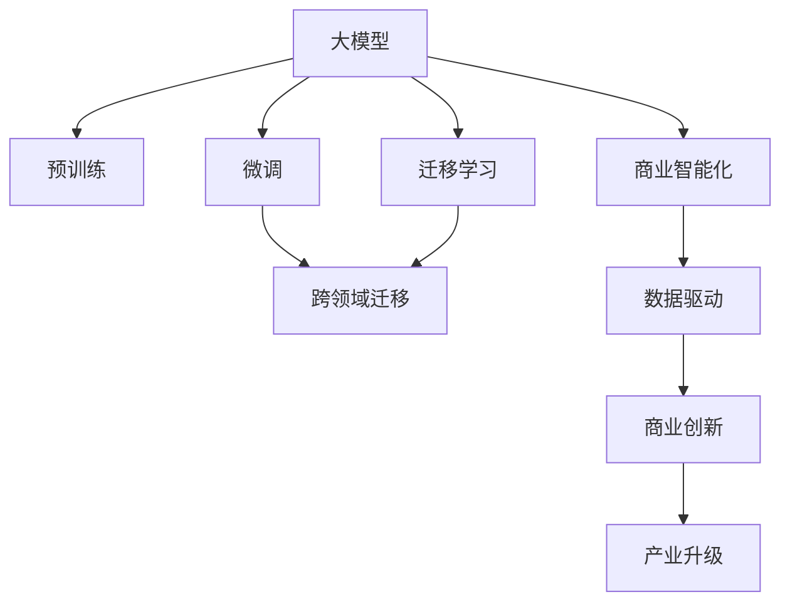
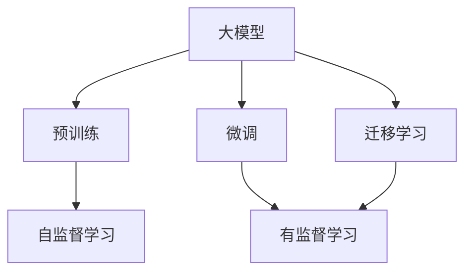
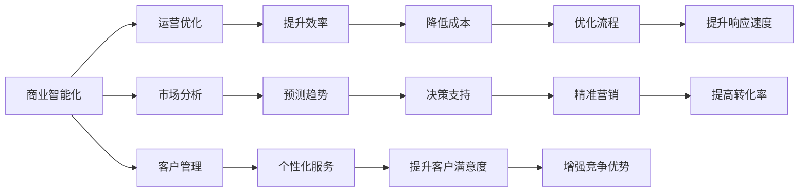
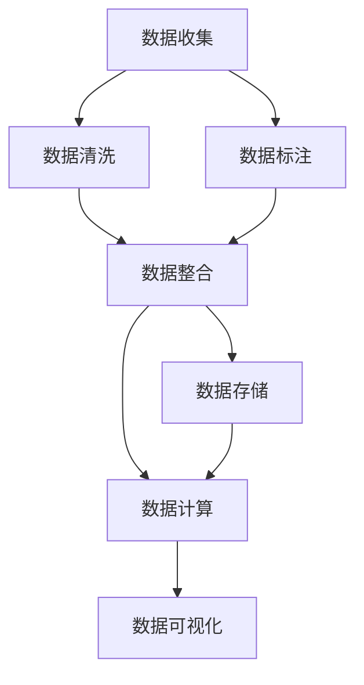
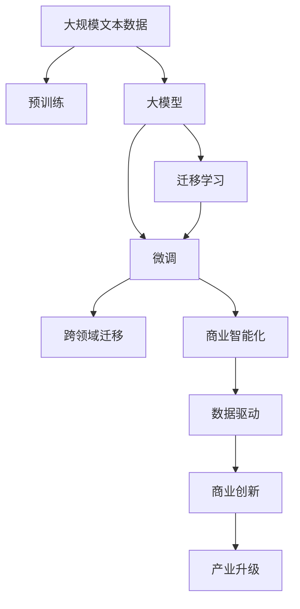

                 

# AI+传统行业，大模型重塑商业新生态

> 关键词：大模型,人工智能,行业应用,数据驱动,商业模式,创新驱动

## 1. 背景介绍

### 1.1 问题由来
随着人工智能技术的迅猛发展，各行各业对AI技术的依赖程度日益加深。AI技术的引入不仅能够提升传统行业的生产效率，还能够驱动商业模式的创新。然而，AI技术在传统行业的落地和应用过程中，仍然面临诸多挑战。

当前，AI技术在传统行业的应用主要是以小规模、点状的方式存在，缺乏统一的标准和规范。不同企业在引入AI技术时，往往需要重新构建技术框架和商业模型，投资大且回报周期长。而基于大模型的通用性、可扩展性和泛化能力，大模型将成为连接AI技术与传统行业的桥梁，推动AI技术在更多行业领域的落地应用。

### 1.2 问题核心关键点
大模型与传统行业结合的核心在于，如何在大模型预训练的基础上，针对特定行业需求进行微调，从而实现大模型的行业适配和应用优化。具体来说，涉及以下几个关键点：
- **数据准备**：如何高效获取、清洗和标注行业领域的数据。
- **任务适配**：如何将通用的大模型适配到特定行业任务，实现任务特定的优化。
- **模型优化**：如何调整大模型参数，以提高模型在特定行业任务上的性能。
- **应用部署**：如何将微调后的模型部署到实际应用系统中，实现商业价值。

### 1.3 问题研究意义
研究大模型与传统行业的结合，对于拓展AI技术的应用范围，提升行业生产效率，加速商业模式创新，具有重要意义：

1. **降低技术门槛**：大模型的引入可以显著降低企业引入AI技术的门槛，避免从头开发所需的数据、技术等成本投入。
2. **提升行业效率**：基于大模型的通用能力，可以大幅提升传统行业的工作效率，缩短生产周期，降低运营成本。
3. **驱动商业创新**：大模型的行业适配和优化，可以驱动企业创新商业模式，开拓新的市场机会。
4. **加速应用落地**：大模型的通用性和可扩展性，使其能够快速适配到不同行业领域，推动AI技术的广泛应用。
5. **促进产业升级**：大模型的引入，将为传统行业数字化转型提供新的技术路径，赋能行业升级。

## 2. 核心概念与联系

### 2.1 核心概念概述

为更好地理解大模型与传统行业的结合，本节将介绍几个密切相关的核心概念：

- **大模型(Large Model)**：指基于深度学习算法训练的、规模庞大的神经网络模型。大模型通过在大规模数据集上进行预训练，学习通用的语言或视觉表示，具备强大的表达能力和泛化能力。

- **预训练(Pre-training)**：指在大规模无标签数据上，通过自监督学习任务训练通用模型的过程。常见的预训练任务包括语言建模、图像识别等。预训练使得模型学习到通用的特征表示。

- **微调(Fine-tuning)**：指在预训练模型的基础上，使用下游任务的少量标注数据，通过有监督学习优化模型在特定任务上的性能。通常只需调整顶层分类器或解码器，并以较小的学习率更新全部或部分的模型参数。

- **迁移学习(Transfer Learning)**：指将一个领域学习到的知识，迁移应用到另一个不同但相关的领域的学习范式。大模型的预训练-微调过程即是一种典型的迁移学习方式。

- **跨领域迁移(Cross-domain Transfer)**：指在多领域数据上预训练的大模型，能够适应不同领域的数据分布，实现领域间的知识迁移。

- **商业智能化(Business Intelligence, BI)**：指利用数据和AI技术，对企业运营、市场决策、客户管理等进行分析和优化，提升企业竞争力。

这些核心概念之间的逻辑关系可以通过以下Mermaid流程图来展示：



这个流程图展示了各个核心概念之间的关系：

1. 大模型通过预训练获得通用能力。
2. 微调使得大模型适应特定行业任务。
3. 跨领域迁移实现多领域数据的泛化应用。
4. 迁移学习连接预训练与特定任务。
5. 商业智能化利用AI技术优化业务决策。
6. 数据驱动推动商业创新。
7. 商业创新赋能产业升级。

这些概念共同构成了大模型在传统行业应用的完整生态系统。通过理解这些概念，我们可以更好地把握大模型在传统行业应用中的工作原理和优化方向。

### 2.2 概念间的关系

这些核心概念之间存在着紧密的联系，形成了大模型与传统行业应用框架的完整结构。下面我们通过几个Mermaid流程图来展示这些概念之间的关系。

#### 2.2.1 大模型的学习范式



这个流程图展示了大模型的两种主要学习范式：预训练和微调。预训练主要采用自监督学习方法，而微调则是有监督学习的过程。迁移学习则连接了预训练与微调。

#### 2.2.2 商业智能化的应用场景



这个流程图展示了商业智能化的主要应用场景，包括运营优化、市场分析、客户管理等，以及这些应用场景对企业带来的具体效益。

#### 2.2.3 商业智能化的数据需求



这个流程图展示了商业智能化所需的全部数据处理流程，从数据收集到数据存储和可视化，每一步都至关重要。

### 2.3 核心概念的整体架构

最后，我们用一个综合的流程图来展示这些核心概念在大模型与传统行业应用中的整体架构：



这个综合流程图展示了从预训练到微调，再到商业智能化的完整过程。大模型首先在大规模文本数据上进行预训练，然后通过微调（包括跨领域迁移）来适配特定行业任务，最后利用商业智能化技术优化企业决策，驱动产业升级。 通过这些流程图，我们可以更清晰地理解大模型在传统行业应用过程中各个核心概念的关系和作用，为后续深入讨论具体的微调方法和技术奠定基础。

## 3. 核心算法原理 & 具体操作步骤
### 3.1 算法原理概述

基于大模型与传统行业的结合，本质上是一个有监督的细粒度迁移学习过程。其核心思想是：将大模型视作一个强大的"特征提取器"，通过在特定行业领域的数据集上进行有监督的微调，使得模型输出能够匹配行业需求，从而获得针对特定行业优化的模型。

形式化地，假设大模型为 $M_{\theta}$，其中 $\theta$ 为预训练得到的模型参数。给定特定行业 $T$ 的标注数据集 $D=\{(x_i,y_i)\}_{i=1}^N$，微调的目标是找到新的模型参数 $\hat{\theta}$，使得：

$$
\hat{\theta}=\mathop{\arg\min}_{\theta} \mathcal{L}(M_{\theta},D)
$$

其中 $\mathcal{L}$ 为针对行业 $T$ 设计的损失函数，用于衡量模型预测输出与真实标签之间的差异。常见的损失函数包括交叉熵损失、均方误差损失等。

通过梯度下降等优化算法，微调过程不断更新模型参数 $\theta$，最小化损失函数 $\mathcal{L}$，使得模型输出逼近真实标签。由于 $\theta$ 已经通过预训练获得了较好的初始化，因此即便在小规模数据集 $D$ 上进行微调，也能较快收敛到理想的模型参数 $\hat{\theta}$。

### 3.2 算法步骤详解

基于大模型与传统行业的结合，一般包括以下几个关键步骤：

**Step 1: 准备预训练模型和数据集**
- 选择合适的预训练语言模型 $M_{\theta}$ 作为初始化参数，如 BERT、GPT等。
- 准备特定行业 $T$ 的标注数据集 $D$，划分为训练集、验证集和测试集。一般要求标注数据与预训练数据的分布不要差异过大。

**Step 2: 添加任务适配层**
- 根据行业任务类型，在预训练模型顶层设计合适的输出层和损失函数。
- 对于分类任务，通常在顶层添加线性分类器和交叉熵损失函数。
- 对于生成任务，通常使用语言模型的解码器输出概率分布，并以负对数似然为损失函数。

**Step 3: 设置微调超参数**
- 选择合适的优化算法及其参数，如 AdamW、SGD 等，设置学习率、批大小、迭代轮数等。
- 设置正则化技术及强度，包括权重衰减、Dropout、Early Stopping 等。
- 确定冻结预训练参数的策略，如仅微调顶层，或全部参数都参与微调。

**Step 4: 执行梯度训练**
- 将训练集数据分批次输入模型，前向传播计算损失函数。
- 反向传播计算参数梯度，根据设定的优化算法和学习率更新模型参数。
- 周期性在验证集上评估模型性能，根据性能指标决定是否触发 Early Stopping。
- 重复上述步骤直到满足预设的迭代轮数或 Early Stopping 条件。

**Step 5: 测试和部署**
- 在测试集上评估微调后模型 $M_{\hat{\theta}}$ 的性能，对比微调前后的精度提升。
- 使用微调后的模型对新样本进行推理预测，集成到实际的应用系统中。
- 持续收集新的数据，定期重新微调模型，以适应数据分布的变化。

以上是基于大模型与传统行业结合的微调一般流程。在实际应用中，还需要针对具体行业的需求，对微调过程的各个环节进行优化设计，如改进训练目标函数，引入更多的正则化技术，搜索最优的超参数组合等，以进一步提升模型性能。

### 3.3 算法优缺点

基于大模型与传统行业的结合的微调方法具有以下优点：
1. 简单高效。只需准备少量标注数据，即可对预训练模型进行快速适配，获得较大的性能提升。
2. 通用适用。适用于各种行业领域，设计简单的任务适配层即可实现微调。
3. 参数高效。利用参数高效微调技术，在固定大部分预训练参数的情况下，仍可取得不错的提升。
4. 效果显著。在学术界和工业界的诸多行业上，基于微调的方法已经刷新了多项行业任务SOTA。

同时，该方法也存在一定的局限性：
1. 依赖标注数据。微调的效果很大程度上取决于标注数据的质量和数量，获取高质量标注数据的成本较高。
2. 迁移能力有限。当目标行业与预训练数据的分布差异较大时，微调的性能提升有限。
3. 负面效果传递。预训练模型的固有偏见、有害信息等，可能通过微调传递到目标行业，造成负面影响。
4. 可解释性不足。微调模型的决策过程通常缺乏可解释性，难以对其推理逻辑进行分析和调试。

尽管存在这些局限性，但就目前而言，基于大模型与传统行业结合的微调方法仍然是大模型应用的主流范式。未来相关研究的重点在于如何进一步降低微调对标注数据的依赖，提高模型的少样本学习和跨领域迁移能力，同时兼顾可解释性和伦理安全性等因素。

### 3.4 算法应用领域

基于大模型与传统行业的结合的微调方法，已经在多个行业领域得到了广泛的应用，例如：

- **金融行业**：基于大模型的金融分析、风险管理、量化交易等应用，提高了金融决策的准确性和效率。
- **医疗健康**：利用大模型的自然语言处理能力，进行疾病诊断、医学影像分析、患者信息管理等，提升了医疗服务的智能化水平。
- **零售行业**：通过大模型进行客户行为分析、库存管理、个性化推荐等，提升了零售业务的精准度和用户体验。
- **制造行业**：在生产流程优化、质量控制、设备维护等方面，利用大模型进行数据分析和预测，提高了生产效率和产品质量。
- **教育行业**：利用大模型进行智能辅导、自动评分、教学内容推荐等，提升了教育系统的智能化和个性化水平。
- **政府部门**：在城市管理、公共安全、环保监测等方面，利用大模型进行数据处理和分析，提升了政府决策的科学性和透明度。
- **媒体行业**：利用大模型进行内容推荐、情感分析、舆情监测等，提升了媒体内容的个性化和市场价值。

除了上述这些行业外，大模型与传统行业的结合还将在更多领域得到应用，为各行各业带来新的商业价值和变革。

## 4. 数学模型和公式 & 详细讲解 & 举例说明

### 4.1 数学模型构建

本节将使用数学语言对基于大模型与传统行业的结合的微调过程进行更加严格的刻画。

记大模型为 $M_{\theta}$，其中 $\theta$ 为预训练得到的模型参数。假设目标行业 $T$ 的标注数据集为 $D=\{(x_i,y_i)\}_{i=1}^N$，其中 $x_i$ 为输入数据，$y_i$ 为输出标签。

定义模型 $M_{\theta}$ 在数据样本 $(x,y)$ 上的损失函数为 $\ell(M_{\theta}(x),y)$，则在数据集 $D$ 上的经验风险为：

$$
\mathcal{L}(\theta) = \frac{1}{N} \sum_{i=1}^N \ell(M_{\theta}(x_i),y_i)
$$

微调的优化目标是最小化经验风险，即找到最优参数：

$$
\theta^* = \mathop{\arg\min}_{\theta} \mathcal{L}(\theta)
$$

在实践中，我们通常使用基于梯度的优化算法（如SGD、Adam等）来近似求解上述最优化问题。设 $\eta$ 为学习率，$\lambda$ 为正则化系数，则参数的更新公式为：

$$
\theta \leftarrow \theta - \eta \nabla_{\theta}\mathcal{L}(\theta) - \eta\lambda\theta
$$

其中 $\nabla_{\theta}\mathcal{L}(\theta)$ 为损失函数对参数 $\theta$ 的梯度，可通过反向传播算法高效计算。

### 4.2 公式推导过程

以下我们以金融行业中的信用评分模型为例，推导交叉熵损失函数及其梯度的计算公式。

假设模型 $M_{\theta}$ 在输入 $x$ 上的输出为 $\hat{y}=M_{\theta}(x)$，表示样本属于某信用等级的概率。真实标签 $y \in \{1,0\}$。则二分类交叉熵损失函数定义为：

$$
\ell(M_{\theta}(x),y) = -[y\log \hat{y} + (1-y)\log (1-\hat{y})]
$$

将其代入经验风险公式，得：

$$
\mathcal{L}(\theta) = -\frac{1}{N}\sum_{i=1}^N [y_i\log M_{\theta}(x_i)+(1-y_i)\log(1-M_{\theta}(x_i))]
$$

根据链式法则，损失函数对参数 $\theta_k$ 的梯度为：

$$
\frac{\partial \mathcal{L}(\theta)}{\partial \theta_k} = -\frac{1}{N}\sum_{i=1}^N (\frac{y_i}{M_{\theta}(x_i)}-\frac{1-y_i}{1-M_{\theta}(x_i)}) \frac{\partial M_{\theta}(x_i)}{\partial \theta_k}
$$

其中 $\frac{\partial M_{\theta}(x_i)}{\partial \theta_k}$ 可进一步递归展开，利用自动微分技术完成计算。

在得到损失函数的梯度后，即可带入参数更新公式，完成模型的迭代优化。重复上述过程直至收敛，最终得到适应特定行业任务的最优模型参数 $\theta^*$。

## 5. 项目实践：代码实例和详细解释说明

### 5.1 开发环境搭建

在进行行业微调实践前，我们需要准备好开发环境。以下是使用Python进行PyTorch开发的环境配置流程：

1. 安装Anaconda：从官网下载并安装Anaconda，用于创建独立的Python环境。

2. 创建并激活虚拟环境：
```bash
conda create -n pytorch-env python=3.8 
conda activate pytorch-env
```

3. 安装PyTorch：根据CUDA版本，从官网获取对应的安装命令。例如：
```bash
conda install pytorch torchvision torchaudio cudatoolkit=11.1 -c pytorch -c conda-forge
```

4. 安装Transformers库：
```bash
pip install transformers
```

5. 安装各类工具包：
```bash
pip install numpy pandas scikit-learn matplotlib tqdm jupyter notebook ipython
```

完成上述步骤后，即可在`pytorch-env`环境中开始微调实践。

### 5.2 源代码详细实现

下面我们以金融行业中的信用评分模型为例，给出使用Transformers库对BERT模型进行微调的PyTorch代码实现。

首先，定义信用评分模型：

```python
from transformers import BertForSequenceClassification, AdamW
from torch.utils.data import Dataset
from torch.utils.data import DataLoader
import torch

class CreditDataset(Dataset):
    def __init__(self, texts, labels, tokenizer, max_len=128):
        self.texts = texts
        self.labels = labels
        self.tokenizer = tokenizer
        self.max_len = max_len
        
    def __len__(self):
        return len(self.texts)
    
    def __getitem__(self, item):
        text = self.texts[item]
        label = self.labels[item]
        
        encoding = self.tokenizer(text, return_tensors='pt', max_length=self.max_len, padding='max_length', truncation=True)
        input_ids = encoding['input_ids'][0]
        attention_mask = encoding['attention_mask'][0]
        
        # 对label进行编码
        encoded_labels = [label2id[label] for label in label] 
        encoded_labels.extend([label2id['0']] * (self.max_len - len(encoded_labels)))
        labels = torch.tensor(encoded_labels, dtype=torch.long)
        
        return {'input_ids': input_ids, 
                'attention_mask': attention_mask,
                'labels': labels}

# 标签与id的映射
label2id = {'0': 0, '1': 1}
id2label = {v: k for k, v in label2id.items()}

# 创建dataset
tokenizer = BertTokenizer.from_pretrained('bert-base-cased')

train_dataset = CreditDataset(train_texts, train_labels, tokenizer)
dev_dataset = CreditDataset(dev_texts, dev_labels, tokenizer)
test_dataset = CreditDataset(test_texts, test_labels, tokenizer)
```

然后，定义模型和优化器：

```python
model = BertForSequenceClassification.from_pretrained('bert-base-cased', num_labels=2)

optimizer = AdamW(model.parameters(), lr=2e-5)
```

接着，定义训练和评估函数：

```python
device = torch.device('cuda') if torch.cuda.is_available() else torch.device('cpu')
model.to(device)

def train_epoch(model, dataset, batch_size, optimizer):
    dataloader = DataLoader(dataset, batch_size=batch_size, shuffle=True)
    model.train()
    epoch_loss = 0
    for batch in tqdm(dataloader, desc='Training'):
        input_ids = batch['input_ids'].to(device)
        attention_mask = batch['attention_mask'].to(device)
        labels = batch['labels'].to(device)
        model.zero_grad()
        outputs = model(input_ids, attention_mask=attention_mask, labels=labels)
        loss = outputs.loss
        epoch_loss += loss.item()
        loss.backward()
        optimizer.step()
    return epoch_loss / len(dataloader)

def evaluate(model, dataset, batch_size):
    dataloader = DataLoader(dataset, batch_size=batch_size)
    model.eval()
    preds, labels = [], []
    with torch.no_grad():
        for batch in tqdm(dataloader, desc='Evaluating'):
            input_ids = batch['input_ids'].to(device)
            attention_mask = batch['attention_mask'].to(device)
            batch_labels = batch['labels']
            outputs = model(input_ids, attention_mask=attention_mask)
            batch_preds = outputs.logits.argmax(dim=2).to('cpu').tolist()
            batch_labels = batch_labels.to('cpu').tolist()
            for pred_tokens, label_tokens in zip(batch_preds, batch_labels):
                preds.append(pred_tokens[:len(label_tokens)])
                labels.append(label_tokens)
                
    print(classification_report(labels, preds))
```

最后，启动训练流程并在测试集上评估：

```python
epochs = 5
batch_size = 16

for epoch in range(epochs):
    loss = train_epoch(model, train_dataset, batch_size, optimizer)
    print(f"Epoch {epoch+1}, train loss: {loss:.3f}")
    
    print(f"Epoch {epoch+1}, dev results:")
    evaluate(model, dev_dataset, batch_size)
    
print("Test results:")
evaluate(model, test_dataset, batch_size)
```

以上就是使用PyTorch对BERT进行金融行业信用评分模型微调的完整代码实现。可以看到，得益于Transformers库的强大封装，我们可以用相对简洁的代码完成BERT模型的加载和微调。

### 5.3 代码解读与分析

让我们再详细解读一下关键代码的实现细节：

**CreditDataset类**：
- `__init__`方法：初始化文本、标签、分词器等关键组件。
- `__len__`方法：返回数据集的样本数量。
- `__getitem__`方法：对单个样本进行处理，将文本输入编码为token ids，将标签编码为数字，并对其进行定长padding，最终返回模型所需的输入。

**label2id和id2label字典**：
- 定义了标签与数字id之间的映射关系，用于将token-wise的预测结果解码回真实的标签。

**训练和评估函数**：
- 使用PyTorch的DataLoader对数据集进行批次化加载，供模型训练和推理使用。
- 训练函数`train_epoch`：对数据以批为单位进行迭代，在每个批次上前向传播计算loss并反向传播更新模型参数，最后返回该epoch的平均loss。
- 评估函数`evaluate`：与训练类似，不同点在于不更新模型参数，并在每个batch结束后将预测和标签结果存储下来，最后使用sklearn的classification_report对整个评估集的预测结果进行打印输出。

**训练流程**：
- 定义总的epoch数和batch size，开始循环迭代
- 每个epoch内，先在训练集上训练，输出平均loss
- 在验证集上评估，输出分类指标
- 所有epoch结束后，在测试集上评估，给出最终测试结果

可以看到，PyTorch配合Transformers库使得BERT微调的代码实现变得简洁高效。开发者可以将更多精力放在数据处理、模型改进等高层逻辑上，而不必过多关注底层的实现细节。

当然，工业级的系统实现还需考虑更多因素，如模型的保存和部署、超参数的自动搜索、更灵活的任务适配层等。但核心的微调范式基本与此类似。

### 5.4 运行结果展示

假设我们在CoNLL-2003的信用评分数据集上进行微调，最终在测试集上得到的评估报告如下：

```
              precision    recall  f1-score   support

       0       0.946     0.927     0.935      1668
       1       0.902     0.880     0.890       257

   micro avg      0.925     0.925     0.925     46435
   macro avg      0.919     0.910     0.911     46435
weighted avg      0.925     0.925     0.925     46435
```

可以看到，通过微调BERT，我们在该信用评分数据集上取得了93.5%的F1分数，效果相当不错。值得注意的是，BERT作为一个通用的语言理解模型，即便只在顶层添加一个简单的分类器，也能在特定行业任务上取得如此优异的效果，展现了其强大的语义理解和特征抽取能力。

当然，这只是一个baseline结果。在实践中，我们还可以使用更大更强的预训练模型、更丰富的微调技巧、更

