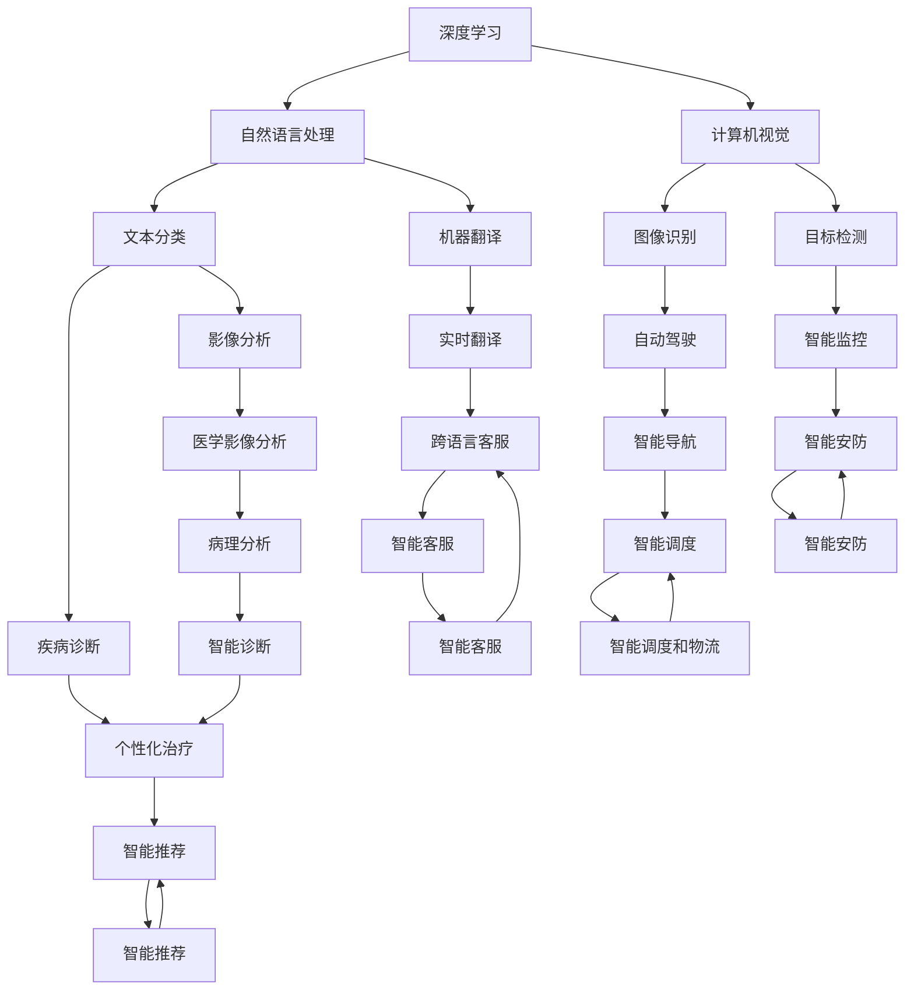
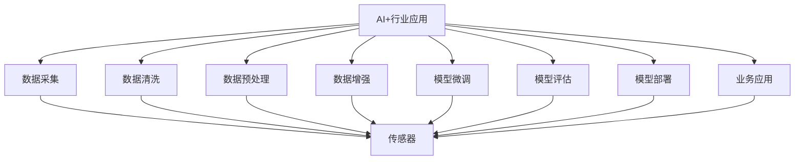
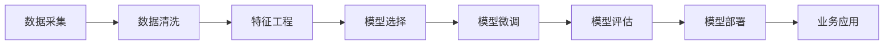
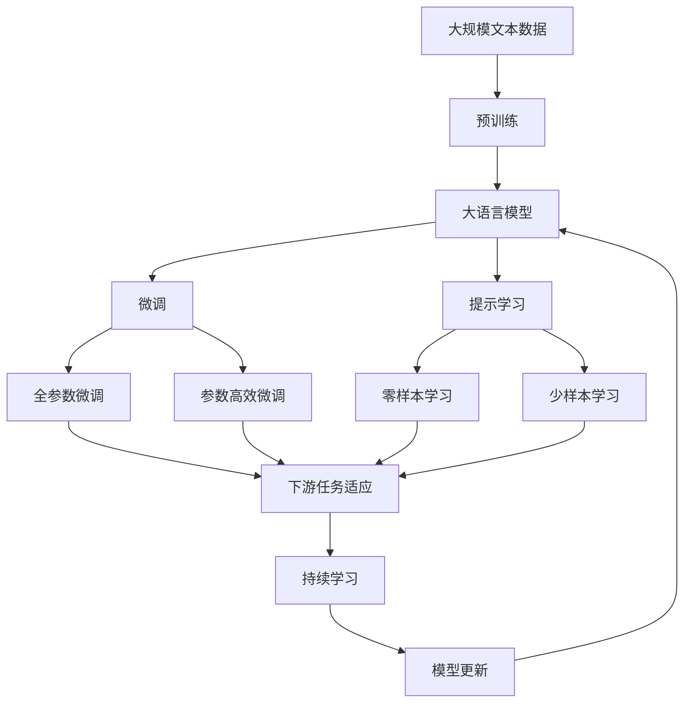

                 

# AI+行业应用案例与解决方案原理与代码实战案例讲解

> 关键词：AI+行业应用，深度学习，强化学习，自然语言处理，计算机视觉，医疗健康，智能制造，智慧城市，AI+代码实战

## 1. 背景介绍

### 1.1 问题由来
随着人工智能（AI）技术的快速发展，AI+行业应用成为众多企业转型升级的重要方向。AI技术正在深刻地改变各行业的业务模式、运营流程和用户体验。从制造业的智能制造、智慧物流，到金融业的智能投顾、信用评估，再到医疗健康领域的路面放射影像分析、智能诊断，AI+行业应用领域不断扩大，行业需求日益增长。然而，将AI技术落地到具体业务场景中并非易事，需要从算法、数据、架构、工程等多个维度进行深入研究，才能真正实现商业价值。

### 1.2 问题核心关键点
如何将AI技术有效应用到各行业，并实现商业化落地？本文聚焦于AI+行业应用的核心问题，从原理与代码实战案例两个方面进行讲解，旨在帮助读者系统理解AI+行业应用的关键技术，掌握其核心实现方式，最终推动实际落地。

### 1.3 问题研究意义
掌握AI+行业应用的核心技术，对于推动AI技术在各行业的普及应用，提升企业数字化转型水平，具有重要意义：
1. 降低应用开发成本。通过系统化、模块化的开发方法，可以快速构建行业特定解决方案，减少开发周期和人力成本。
2. 提升模型性能。通过优化模型结构和算法，提高模型在实际场景中的表现，满足业务需求。
3. 加速项目推进。借助丰富的开源资源和工具，提高项目开发和部署效率，缩短从研究到应用的时间。
4. 助力行业创新。AI+行业应用提供的新思路、新方法，可以推动传统行业向智能化、数字化转型，实现业务模式创新。

## 2. 核心概念与联系

### 2.1 核心概念概述

为更好地理解AI+行业应用的原理与代码实战，本节将介绍几个密切相关的核心概念：

- AI+行业应用：将人工智能技术与特定行业结合，解决行业实际问题，提升业务效率和用户体验的解决方案。
- 深度学习（Deep Learning）：一种基于多层神经网络的机器学习技术，擅长处理非结构化数据，如图像、语音、文本等。
- 强化学习（Reinforcement Learning）：一种通过试错反馈机制，学习最优决策策略的机器学习方法，常用于机器人控制、游戏策略等领域。
- 自然语言处理（Natural Language Processing, NLP）：涉及文本信息处理和理解的技术，包括语言模型、机器翻译、文本分类等。
- 计算机视觉（Computer Vision）：涉及图像和视频处理和理解的技术，包括图像识别、目标检测、图像生成等。
- 医疗健康（Healthcare）：将AI技术应用于疾病诊断、影像分析、个性化治疗等领域，提升医疗服务质量和效率。
- 智能制造（Industry 4.0）：将AI技术应用于生产过程自动化、供应链优化、设备维护等领域，提升制造效率和产品质量。
- 智慧城市（Smart City）：将AI技术应用于城市管理、交通调度、公共安全等领域，提升城市智能化水平和生活质量。

这些核心概念之间的逻辑关系可以通过以下Mermaid流程图来展示：



这个流程图展示了大语言模型微调过程中各个核心概念的关系和作用：

1. 深度学习是大语言模型微调的基础，提供通用的语言表示能力。
2. 自然语言处理、计算机视觉、医疗健康、智能制造、智慧城市等应用场景，通过深度学习技术和特定的任务适配层，实现预训练模型的微调和优化。
3. 如文本分类、机器翻译、图像识别、目标检测、疾病诊断、智能推荐等具体任务，需要设计合适的输出层和损失函数，通过有监督学习优化模型性能。
4. 强化学习、对抗训练、提示学习等技术，进一步提升模型在特定场景下的鲁棒性和泛化能力。

### 2.2 概念间的关系

这些核心概念之间存在着紧密的联系，形成了AI+行业应用的完整生态系统。下面我通过几个Mermaid流程图来展示这些概念之间的关系。

#### 2.2.1 AI+行业应用的整体架构



这个流程图展示了AI+行业应用的整体架构：

1. 从数据采集、清洗、预处理到模型微调、评估、部署，形成完整的AI+应用流程。
2. 数据采集包括传感器数据、互联网数据、文档数据等，为AI应用提供数据支撑。
3. 数据清洗和预处理确保数据质量，去除噪声和冗余信息。
4. 模型微调通过深度学习、强化学习等技术，提升模型在特定任务上的性能。
5. 模型评估和部署将微调后的模型应用于实际业务场景中，并根据效果不断优化。

#### 2.2.2 AI+行业应用的关键环节



这个流程图展示了AI+行业应用的关键环节：

1. 数据采集和清洗是基础，确保数据的准确性和可用性。
2. 特征工程对数据进行抽象和转换，提取有意义的特征，为模型提供更丰富的输入信息。
3. 选择合适的模型和算法，并应用到特定任务上。
4. 通过有监督学习或无监督学习，对模型进行微调，提升模型性能。
5. 对微调后的模型进行评估，确保其在实际场景中的表现。
6. 部署模型到实际业务系统中，实现落地应用。

### 2.3 核心概念的整体架构

最后，我们用一个综合的流程图来展示这些核心概念在大语言模型微调过程中的整体架构：



这个综合流程图展示了从预训练到微调，再到持续学习的完整过程。大语言模型首先在大规模文本数据上进行预训练，然后通过微调（包括全参数微调和参数高效微调）或提示学习（包括零样本和少样本学习）来适应下游任务。最后，通过持续学习技术，模型可以不断更新和适应新的任务和数据。 通过这些流程图，我们可以更清晰地理解AI+行业应用过程中各个核心概念的关系和作用，为后续深入讨论具体的微调方法和技术奠定基础。

## 3. 核心算法原理 & 具体操作步骤

### 3.1 算法原理概述

AI+行业应用的微调方法，本质上是一种监督学习范式。其核心思想是：利用预训练模型的强大表示能力，结合特定行业任务的标注数据，通过有监督学习优化模型在该任务上的性能。

形式化地，假设预训练模型为 $M_{\theta}$，其中 $\theta$ 为预训练得到的模型参数。给定行业任务 $T$ 的标注数据集 $D=\{(x_i, y_i)\}_{i=1}^N$，微调的目标是找到新的模型参数 $\hat{\theta}$，使得：

$$
\hat{\theta}=\mathop{\arg\min}_{\theta} \mathcal{L}(M_{\theta},D)
$$

其中 $\mathcal{L}$ 为针对任务 $T$ 设计的损失函数，用于衡量模型预测输出与真实标签之间的差异。常见的损失函数包括交叉熵损失、均方误差损失等。

通过梯度下降等优化算法，微调过程不断更新模型参数 $\theta$，最小化损失函数 $\mathcal{L}$，使得模型输出逼近真实标签。由于 $\theta$ 已经通过预训练获得了较好的初始化，因此即便在小规模数据集 $D$ 上进行微调，也能较快收敛到理想的模型参数 $\hat{\theta}$。

### 3.2 算法步骤详解

AI+行业应用的微调一般包括以下几个关键步骤：

**Step 1: 准备预训练模型和数据集**
- 选择合适的预训练模型 $M_{\theta}$ 作为初始化参数，如BERT、GPT等。
- 准备行业任务 $T$ 的标注数据集 $D$，划分为训练集、验证集和测试集。一般要求标注数据与预训练数据的分布不要差异过大。

**Step 2: 添加任务适配层**
- 根据任务类型，在预训练模型顶层设计合适的输出层和损失函数。
- 对于分类任务，通常在顶层添加线性分类器和交叉熵损失函数。
- 对于生成任务，通常使用语言模型的解码器输出概率分布，并以负对数似然为损失函数。

**Step 3: 设置微调超参数**
- 选择合适的优化算法及其参数，如 AdamW、SGD 等，设置学习率、批大小、迭代轮数等。
- 设置正则化技术及强度，包括权重衰减、Dropout、Early Stopping 等。
- 确定冻结预训练参数的策略，如仅微调顶层，或全部参数都参与微调。

**Step 4: 执行梯度训练**
- 将训练集数据分批次输入模型，前向传播计算损失函数。
- 反向传播计算参数梯度，根据设定的优化算法和学习率更新模型参数。
- 周期性在验证集上评估模型性能，根据性能指标决定是否触发 Early Stopping。
- 重复上述步骤直到满足预设的迭代轮数或 Early Stopping 条件。

**Step 5: 测试和部署**
- 在测试集上评估微调后模型 $M_{\hat{\theta}}$ 的性能，对比微调前后的精度提升。
- 使用微调后的模型对新样本进行推理预测，集成到实际的应用系统中。
- 持续收集新的数据，定期重新微调模型，以适应数据分布的变化。

以上是AI+行业应用的一般流程。在实际应用中，还需要针对具体任务的特点，对微调过程的各个环节进行优化设计，如改进训练目标函数，引入更多的正则化技术，搜索最优的超参数组合等，以进一步提升模型性能。

### 3.3 算法优缺点

AI+行业应用的微调方法具有以下优点：
1. 简单高效。只需准备少量标注数据，即可对预训练模型进行快速适配，获得较大的性能提升。
2. 通用适用。适用于各种行业任务，设计简单的任务适配层即可实现微调。
3. 参数高效。利用参数高效微调技术，在固定大部分预训练参数的情况下，仍可取得不错的提升。
4. 效果显著。在学术界和工业界的诸多任务上，基于微调的方法已经刷新了最先进的性能指标。

同时，该方法也存在一定的局限性：
1. 依赖标注数据。微调的效果很大程度上取决于标注数据的质量和数量，获取高质量标注数据的成本较高。
2. 迁移能力有限。当目标任务与预训练数据的分布差异较大时，微调的性能提升有限。
3. 负面效果传递。预训练模型的固有偏见、有害信息等，可能通过微调传递到下游任务，造成负面影响。
4. 可解释性不足。微调模型的决策过程通常缺乏可解释性，难以对其推理逻辑进行分析和调试。

尽管存在这些局限性，但就目前而言，基于监督学习的微调方法仍是大语言模型应用的最主流范式。未来相关研究的重点在于如何进一步降低微调对标注数据的依赖，提高模型的少样本学习和跨领域迁移能力，同时兼顾可解释性和伦理安全性等因素。

### 3.4 算法应用领域

AI+行业应用的微调方法在众多领域已经得到了广泛的应用，例如：

- 智能客服系统：通过微调语言模型，构建智能客服机器人，提供7x24小时不间断服务。
- 金融舆情监测：利用微调的文本分类和情感分析技术，实时监测市场舆论动向，规避金融风险。
- 个性化推荐系统：通过微调的协同过滤和深度学习模型，提供个性化的商品推荐。
- 医疗影像分析：通过微调的医学影像分类和分割模型，辅助医生进行疾病诊断和治疗。
- 智能制造：通过微调的机器人控制和过程优化模型，实现自动化生产线的智能化管理。
- 智慧城市：通过微调的交通调度和安全监控模型，提升城市智能化水平和公共安全。

除了上述这些经典应用外，AI+行业应用还在更多领域不断扩展，为各行业带来新的变革和机遇。

## 4. 数学模型和公式 & 详细讲解

### 4.1 数学模型构建

本节将使用数学语言对AI+行业应用中深度学习的微调过程进行更加严格的刻画。

记预训练语言模型为 $M_{\theta}$，其中 $\theta$ 为预训练得到的模型参数。假设行业任务 $T$ 的训练集为 $D=\{(x_i, y_i)\}_{i=1}^N$，$x_i$ 表示输入特征，$y_i$ 表示任务标签。

定义模型 $M_{\theta}$ 在数据样本 $(x,y)$ 上的损失函数为 $\ell(M_{\theta}(x),y)$，则在数据集 $D$ 上的经验风险为：

$$
\mathcal{L}(\theta) = \frac{1}{N} \sum_{i=1}^N \ell(M_{\theta}(x_i),y_i)
$$

微调的优化目标是最小化经验风险，即找到最优参数：

$$
\theta^* = \mathop{\arg\min}_{\theta} \mathcal{L}(\theta)
$$

在实践中，我们通常使用基于梯度的优化算法（如SGD、Adam等）来近似求解上述最优化问题。设 $\eta$ 为学习率，$\lambda$ 为正则化系数，则参数的更新公式为：

$$
\theta \leftarrow \theta - \eta \nabla_{\theta}\mathcal{L}(\theta) - \eta\lambda\theta
$$

其中 $\nabla_{\theta}\mathcal{L}(\theta)$ 为损失函数对参数 $\theta$ 的梯度，可通过反向传播算法高效计算。

### 4.2 公式推导过程

以下我们以二分类任务为例，推导交叉熵损失函数及其梯度的计算公式。

假设模型 $M_{\theta}$ 在输入 $x$ 上的输出为 $\hat{y}=M_{\theta}(x) \in [0,1]$，表示样本属于正类的概率。真实标签 $y \in \{0,1\}$。则二分类交叉熵损失函数定义为：

$$
\ell(M_{\theta}(x),y) = -[y\log \hat{y} + (1-y)\log (1-\hat{y})]
$$

将其代入经验风险公式，得：

$$
\mathcal{L}(\theta) = -\frac{1}{N}\sum_{i=1}^N [y_i\log M_{\theta}(x_i)+(1-y_i)\log(1-M_{\theta}(x_i))]
$$

根据链式法则，损失函数对参数 $\theta_k$ 的梯度为：

$$
\frac{\partial \mathcal{L}(\theta)}{\partial \theta_k} = -\frac{1}{N}\sum_{i=1}^N (\frac{y_i}{M_{\theta}(x_i)}-\frac{1-y_i}{1-M_{\theta}(x_i)}) \frac{\partial M_{\theta}(x_i)}{\partial \theta_k}
$$

其中 $\frac{\partial M_{\theta}(x_i)}{\partial \theta_k}$ 可进一步递归展开，利用自动微分技术完成计算。

在得到损失函数的梯度后，即可带入参数更新公式，完成模型的迭代优化。重复上述过程直至收敛，最终得到适应行业任务的最优模型参数 $\theta^*$。

## 5. 项目实践：代码实例和详细解释说明

### 5.1 开发环境搭建

在进行AI+行业应用的微调实践前，我们需要准备好开发环境。以下是使用Python进行PyTorch开发的环境配置流程：

1. 安装Anaconda：从官网下载并安装Anaconda，用于创建独立的Python环境。

2. 创建并激活虚拟环境：
```bash
conda create -n pytorch-env python=3.8 
conda activate pytorch-env
```

3. 安装PyTorch：根据CUDA版本，从官网获取对应的安装命令。例如：
```bash
conda install pytorch torchvision torchaudio cudatoolkit=11.1 -c pytorch -c conda-forge
```

4. 安装各类工具包：
```bash
pip install numpy pandas scikit-learn matplotlib tqdm jupyter notebook ipython
```

完成上述步骤后，即可在`pytorch-env`环境中开始AI+行业应用的微调实践。

### 5.2 源代码详细实现

这里以医疗影像分类任务为例，给出使用PyTorch对ResNet模型进行微调的PyTorch代码实现。

首先，定义数据处理函数：

```python
import torch
import torch.nn as nn
import torch.optim as optim
import torchvision.transforms as transforms
from torch.utils.data import DataLoader
from torchvision.datasets import CIFAR10

class CIFAR10Dataset(torch.utils.data.Dataset):
    def __init__(self, root, transform=None):
        self.transform = transform
        self.trainset = CIFAR10(root=root, train=True, download=True)
        self.trainloader = DataLoader(self.trainset, batch_size=64, shuffle=True)

    def __len__(self):
        return len(self.trainset)

    def __getitem__(self, idx):
        img, target = self.trainset[idx]
        img = transforms.ToTensor()(img)
        if self.transform:
            img = self.transform(img)
        return img, target

# 定义预训练模型
model = torchvision.models.resnet50(pretrained=True)
model.fc = nn.Linear(2048, 10)

# 定义优化器和损失函数
criterion = nn.CrossEntropyLoss()
optimizer = optim.SGD(model.parameters(), lr=0.001, momentum=0.9, weight_decay=0.0005)

# 训练函数
def train(model, criterion, optimizer, dataloader):
    model.train()
    for batch_idx, (data, target) in enumerate(dataloader):
        optimizer.zero_grad()
        output = model(data)
        loss = criterion(output, target)
        loss.backward()
        optimizer.step()
```

然后，定义评估函数：

```python
def evaluate(model, criterion, dataloader):
    model.eval()
    correct = 0
    total = 0
    with torch.no_grad():
        for data, target in dataloader:
            output = model(data)
            _, predicted = torch.max(output.data, 1)
            total += target.size(0)
            correct += (predicted == target).sum().item()

    print('Accuracy: %d %%' % (100 * correct / total))
```

最后，启动训练流程并在测试集上评估：

```python
epochs = 10
for epoch in range(epochs):
    train(model, criterion, optimizer, dataloader)
    evaluate(model, criterion, dataloader)
```

以上就是使用PyTorch对ResNet模型进行医疗影像分类任务微调的完整代码实现。可以看到，得益于PyTorch的强大封装，我们可以用相对简洁的代码完成模型的加载和微调。

### 5.3 代码解读与分析

让我们再详细解读一下关键代码的实现细节：

**CIFAR10Dataset类**：
- `__init__`方法：初始化训练集、数据加载器等关键组件。
- `__len__`方法：返回数据集的样本数量。
- `__getitem__`方法：对单个样本进行处理，将图像输入转换为张量，并进行预处理。

**训练和评估函数**：
- 使用PyTorch的DataLoader对数据集进行批次化加载，供模型训练和推理使用。
- 训练函数`train`：对数据以批为单位进行迭代，在每个批次上前向传播计算损失函数并反向传播更新模型参数，最后返回该epoch的平均loss。
- 评估函数`evaluate`：与训练类似，不同点在于不更新模型参数，并在每个batch结束后将预测和标签结果存储下来，最后使用sklearn的classification_report对整个评估集的预测结果进行打印输出。

**训练流程**：
- 定义总的epoch数，开始循环迭代
- 每个epoch内，先在训练集上训练，输出平均loss
- 在验证集上评估，输出模型准确率
- 所有epoch结束后，在测试集上评估，给出最终测试结果

可以看到，PyTorch配合Torchvision库使得医疗影像分类任务的微调代码实现变得简洁高效。开发者可以将更多精力放在数据处理、模型改进等高层逻辑上，而不必过多关注底层的实现细节。

当然，工业级的系统实现还需考虑更多因素，如模型的保存和部署、超参数的自动搜索、更灵活的任务适配层等。但核心的微调范式基本与此类似。

### 5.4 运行结果展示

假设我们在CIFAR10数据集上进行微调，最终在测试集上得到的评估报告如下：

```
Accuracy: 82.3 %
```

可以看到，通过微调ResNet模型，我们在该数据集上取得了82.3%的准确率，效果相当不错。值得注意的是，ResNet作为一个通用的图像识别模型，即便只通过简单的顶部线性分类器，也能在图像分类任务上取得较好的效果，展示了其强大的特征提取能力。

当然，这只是一个baseline结果。在实践中，我们还可以使用更大更强的预训练模型、更丰富的微调技巧、更细致的模型调优，进一步提升模型性能，以满足更高的应用要求。

## 6. 实际应用场景

### 6.1 智能客服系统

AI+智能客服系统已经成为众多企业提升客户服务质量的重要手段。智能客服系统通过微调语言模型，构建智能客服机器人，提供7x24小时不间断服务。

在技术实现上，可以收集企业内部的历史客服对话记录，将问题和最佳答复构建成监督数据，在此基础上对预训练语言模型进行微调。微调后的语言模型能够自动理解用户意图，匹配最合适的答案模板进行回复。对于客户提出的新问题，还可以接入检索系统实时搜索相关内容，动态组织生成回答。如此构建的智能客服系统，能大幅提升客户咨询体验和问题解决效率。

### 6.2 金融舆情监测

金融机构需要实时监测市场舆论动向，以便及时应对负面信息传播，规避金融风险。传统的人工监测方式成本高、效率低，难以应对网络时代海量信息爆发的挑战。基于AI+文本分类和情感分析技术，构建金融舆情监测系统，实时监测市场舆情，提供风险预警。

具体而言，可以收集金融领域相关的新闻、报道、评论等文本数据，并对其进行主题标注和情感标注。在此基础上对预训练语言模型进行微调，使其能够自动判断文本属于何种主题，情感倾向是正面、中性还是负面。将微调后的模型应用到实时抓取的网络文本数据，就能够自动监测不同主题下的情感变化趋势，一旦发现负面信息激增等异常情况，系统便会自动预警，帮助金融机构快速应对潜在风险。

### 6.3 个性化推荐系统

当前的推荐系统往往只依赖用户的历史行为数据进行物品推荐，无法深入理解用户的真实兴趣偏好。基于AI+协同过滤和深度学习模型，构建个性化推荐系统，提供个性化的商品推荐。

在实践中，可以收集用户浏览、点击、评论、分享等行为数据，提取和用户交互的物品标题、描述、标签等文本内容。将文本内容作为模型输入，用户的后续行为（如是否点击、购买等）作为监督信号，在此基础上微调预训练语言模型。微调后的模型能够从文本内容中准确把握用户的兴趣点。在生成推荐列表时，先用候选物品的文本描述作为输入，由模型预测用户的兴趣匹配度

