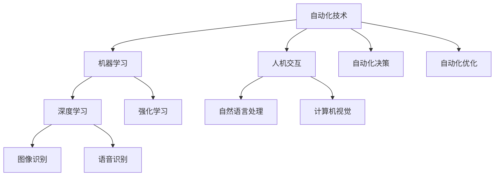
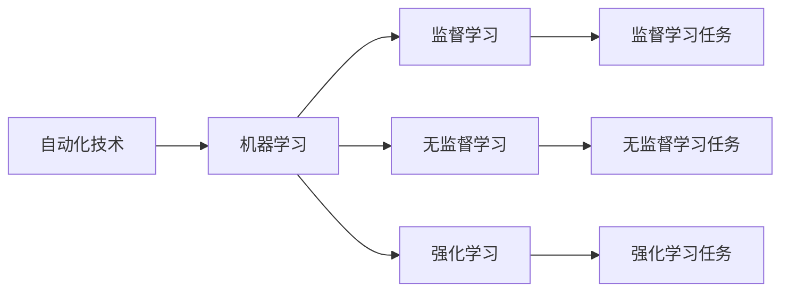
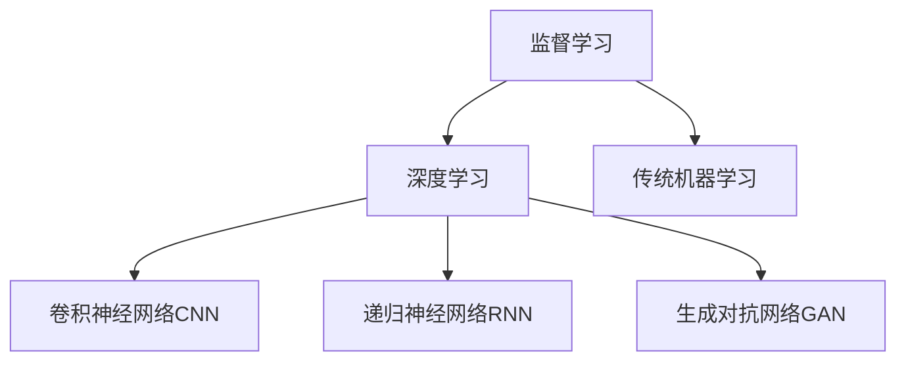
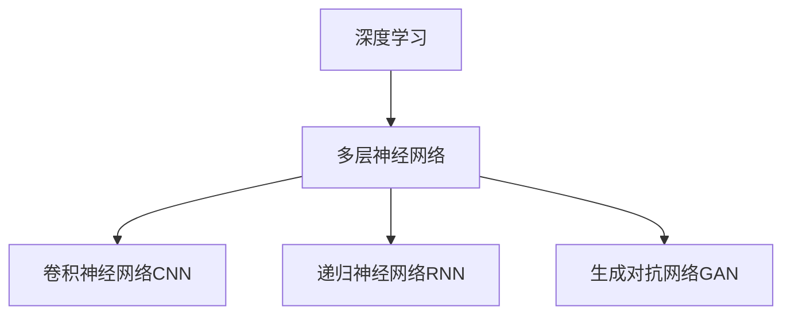
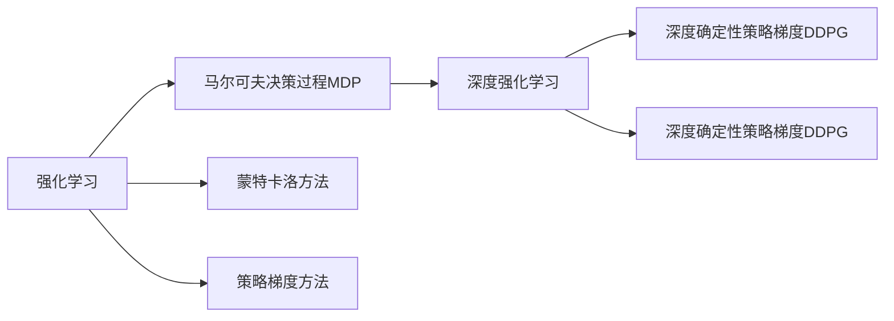
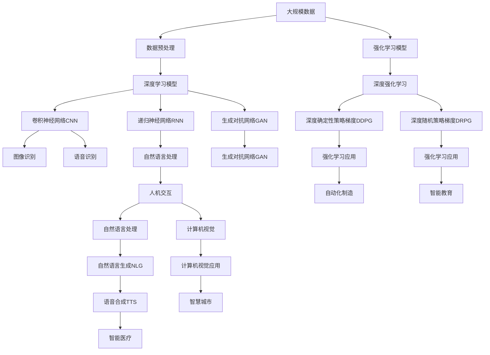

                 

# AI2.0时代：自动化技术的进展

## 1. 背景介绍

在人类社会的发展历程中，每一次科技进步都会极大地改变我们的生产生活方式。随着人工智能(AI)技术的不断演进，我们正在步入一个全新的AI 2.0时代。AI 2.0时代的一个显著特征是自动化技术的大规模应用，从工业制造到智慧城市，从智能医疗到智能教育，自动化技术正在深刻重塑各个行业，提升社会生产效率，改善人类生活质量。

### 1.1 问题的由来

随着科技的进步和信息技术的普及，自动化技术的应用范围不断扩大。从简单的自动化控制，到复杂的智能决策，自动化技术正逐步渗透到社会的各个角落。AI 2.0时代，自动化技术正在以前所未有的速度发展，并带来深远的社会影响。但与此同时，自动化技术也面临着诸多挑战，如如何确保技术安全，避免伦理风险，提升技术可解释性等。

### 1.2 问题的核心关键点

自动化技术的核心关键点包括：
- **自动化决策**：通过AI算法对大量数据进行分析和决策，实现自动化的任务处理。
- **自我学习**：自动化系统能够不断学习新数据，提升决策准确性和效率。
- **人机协同**：自动化技术与人类之间的协作和互动，实现更高效的智能应用。
- **跨领域应用**：自动化技术在多个领域（如医疗、金融、制造等）的广泛应用，提升各行业的智能化水平。

在AI 2.0时代，自动化技术的应用正变得越来越多元化和智能化。但随之而来的，是对于自动化技术伦理、安全、可解释性等问题的深入探讨。这些问题不仅涉及技术本身，更关系到社会伦理和政策法规。因此，深入理解和解决这些问题，对于推动AI 2.0时代自动化技术的发展具有重要意义。

### 1.3 问题的研究意义

AI 2.0时代自动化技术的发展，对于推动社会进步和经济增长具有重要意义：

1. **提升生产效率**：自动化技术能够显著提升生产效率，降低人力成本，推动产业升级。
2. **改善生活质量**：在医疗、教育、交通等领域，自动化技术能够提供更便捷、高效的服务，改善人类生活质量。
3. **促进创新发展**：自动化技术为科研和创新提供了新工具和新思路，推动科技的进步。
4. **应对社会挑战**：在气候变化、资源分配、社会公平等重大问题上，自动化技术可以提供新的解决方案。

自动化技术的发展，需要解决许多关键技术问题，如机器学习算法、数据处理技术、人机交互界面等。通过深入研究，我们可以更好地把握自动化技术的未来发展方向，推动其应用范围的扩大。

## 2. 核心概念与联系

### 2.1 核心概念概述

为了更好地理解AI 2.0时代自动化技术，本节将介绍几个关键概念：

- **自动化技术**：指通过计算机程序和硬件设备，实现某些任务或过程的自动控制和优化。
- **机器学习**：指让机器通过数据学习规律，自动提升决策能力和表现的技术。
- **深度学习**：指使用多层神经网络对数据进行建模和学习，广泛应用于图像识别、语音识别等任务。
- **强化学习**：指通过与环境的交互，让机器通过试错不断优化策略，提升决策效果。
- **人机交互**：指通过自然语言处理、计算机视觉等技术，实现人与机器的流畅交互。
- **自动化决策**：指自动化系统基于数据分析和模型预测，自动做出决策。
- **自动化优化**：指通过自动化技术，不断优化系统性能，提升效率。

这些核心概念之间的联系可以通过以下Mermaid流程图来展示：



这个流程图展示了一些核心概念之间的关系：

1. 自动化技术通过机器学习、深度学习和强化学习等算法，提升决策和优化能力。
2. 人机交互技术实现自然语言处理和计算机视觉，帮助自动化系统理解和处理人类输入。
3. 自动化决策和自动化优化技术，在多领域应用中提升效率和效果。

### 2.2 概念间的关系

这些核心概念之间存在着紧密的联系，形成了AI 2.0时代自动化技术的完整生态系统。下面我们通过几个Mermaid流程图来展示这些概念之间的关系。

#### 2.2.1 自动化技术的学习范式



这个流程图展示了自动化技术的学习范式，包括监督学习、无监督学习和强化学习。

#### 2.2.2 机器学习的演进



这个流程图展示了机器学习从传统方法到深度学习的演进过程。

#### 2.2.3 深度学习的结构



这个流程图展示了深度学习的主要结构，包括卷积神经网络、递归神经网络和生成对抗网络等。

#### 2.2.4 强化学习的演进



这个流程图展示了强化学习的演进过程，包括马尔可夫决策过程、蒙特卡洛方法和策略梯度方法等。

### 2.3 核心概念的整体架构

最后，我们用一个综合的流程图来展示这些核心概念在大规模自动化技术应用中的整体架构：



这个综合流程图展示了从数据预处理到模型训练，再到应用部署的完整过程。大规模数据经过预处理后，使用深度学习模型进行训练，得到卷积神经网络、递归神经网络和生成对抗网络等模型。这些模型应用于图像识别、语音识别、自然语言处理和计算机视觉等任务。同时，强化学习模型也用于自动决策和优化任务。最终，这些模型部署到智慧城市、智能医疗、自动化制造、智能教育等应用场景中，提升各个领域的智能化水平。

## 3. 核心算法原理 & 具体操作步骤
### 3.1 算法原理概述

AI 2.0时代自动化技术的核心算法原理主要基于机器学习、深度学习和强化学习等算法，通过大量数据进行训练和优化，实现自动化决策和优化。

机器学习算法通过学习数据中的规律和特征，实现对数据的分类、预测和聚类等任务。深度学习算法通过多层神经网络结构，对数据进行更复杂的学习，适用于图像识别、语音识别等任务。强化学习算法通过与环境的交互，不断优化决策策略，适用于游戏、机器人等需要动态决策的任务。

### 3.2 算法步骤详解

AI 2.0时代自动化技术的具体操作包括以下几个关键步骤：

**Step 1: 数据收集和预处理**
- 收集相关领域的大量数据，进行清洗和预处理，得到可供训练的数据集。
- 对数据进行特征工程，提取有用的特征，如文本的词向量、图像的像素特征等。

**Step 2: 模型训练**
- 选择合适的机器学习、深度学习和强化学习算法，设计合适的模型结构。
- 使用训练集对模型进行训练，不断调整模型参数，提升模型性能。
- 在验证集上评估模型性能，调整模型参数，避免过拟合。

**Step 3: 模型部署**
- 将训练好的模型部署到实际应用中，如智能制造系统、智慧城市平台等。
- 根据具体需求，进行模型优化和调整，确保模型在不同环境下的稳定性和效率。

**Step 4: 持续优化**
- 不断收集新数据，对模型进行重新训练，提升模型性能。
- 根据反馈和需求，不断调整模型参数，优化模型决策策略。

### 3.3 算法优缺点

AI 2.0时代自动化技术有以下优点：
1. **高效性**：自动化技术能够快速处理大量数据，提升决策效率。
2. **稳定性**：自动化技术在多次训练和应用中，能够保持较高的稳定性和可靠性。
3. **可扩展性**：自动化技术可以方便地扩展到不同领域和应用场景中，提升各行业的智能化水平。

但同时也存在以下缺点：
1. **数据依赖**：自动化技术需要大量数据进行训练，对于数据获取和处理要求较高。
2. **算法复杂性**：机器学习、深度学习和强化学习等算法，需要深入理解和掌握，实现和调试较为复杂。
3. **伦理风险**：自动化技术在应用中可能涉及隐私、安全等伦理问题，需要严格规范和管理。

### 3.4 算法应用领域

AI 2.0时代自动化技术在多个领域得到了广泛应用，包括：

- **智能制造**：通过自动化技术优化生产流程，提高生产效率和产品质量。
- **智慧城市**：通过自动化技术提升城市管理水平，实现智能交通、智慧医疗等应用。
- **智能医疗**：通过自动化技术辅助医生诊断和治疗，提升医疗服务质量和效率。
- **智能教育**：通过自动化技术提供个性化教育，提升教育效果和学生体验。
- **金融科技**：通过自动化技术进行风险评估和智能投顾，提升金融服务水平。

## 4. 数学模型和公式 & 详细讲解 & 举例说明
### 4.1 数学模型构建

以下我们将使用数学语言对AI 2.0时代自动化技术的基本数学模型进行详细讲解。

假设数据集为 $D=\{(x_i,y_i)\}_{i=1}^N$，其中 $x_i$ 为输入数据，$y_i$ 为输出标签。我们的目标是训练一个模型 $f$，使其能够对新输入 $x$ 进行预测输出 $\hat{y}$。

常用的机器学习模型包括线性回归、逻辑回归、决策树等。假设我们使用线性回归模型进行训练，模型的预测公式为：

$$
\hat{y} = f(x) = w_0 + \sum_{i=1}^d w_i x_i
$$

其中 $w_0$ 和 $w_i$ 为模型参数，$d$ 为特征维度。模型的损失函数为均方误差损失函数，即：

$$
\mathcal{L}(w) = \frac{1}{N} \sum_{i=1}^N (\hat{y}_i - y_i)^2
$$

我们的目标是最小化损失函数 $\mathcal{L}(w)$，即：

$$
w^* = \mathop{\arg\min}_{w} \mathcal{L}(w)
$$

使用梯度下降算法进行优化，可以得到模型的最优参数 $w^*$：

$$
w_{k+1} = w_k - \eta \nabla_{w} \mathcal{L}(w_k)
$$

其中 $\eta$ 为学习率。

### 4.2 公式推导过程

以线性回归模型为例，我们推导模型的训练过程和参数更新公式。

首先，计算损失函数的梯度：

$$
\nabla_{w} \mathcal{L}(w) = \frac{2}{N} \sum_{i=1}^N (\hat{y}_i - y_i) x_i
$$

然后，更新模型参数：

$$
w_{k+1} = w_k - \eta \frac{2}{N} \sum_{i=1}^N (\hat{y}_i - y_i) x_i
$$

重复上述过程，直到损失函数收敛，即可得到最优模型参数 $w^*$。

### 4.3 案例分析与讲解

假设我们有一个数据集，包含学生的成绩和是否通过考试的数据：

| 学生编号 | 成绩 | 是否通过考试 |
| --- | --- | --- |
| 1 | 80 | 是 |
| 2 | 60 | 否 |
| 3 | 90 | 是 |
| 4 | 70 | 是 |
| 5 | 60 | 否 |

我们使用线性回归模型进行训练，模型的目标是预测学生是否通过考试。

首先，构建模型的预测公式：

$$
\hat{y} = w_0 + w_1 x
$$

其中 $w_0$ 和 $w_1$ 为模型参数，$x$ 为学生的成绩，$\hat{y}$ 为是否通过考试的预测值。

然后，构建损失函数：

$$
\mathcal{L}(w) = \frac{1}{5} \sum_{i=1}^5 (\hat{y}_i - y_i)^2
$$

最后，使用梯度下降算法进行优化，得到最优模型参数 $w^*$。

## 5. 项目实践：代码实例和详细解释说明
### 5.1 开发环境搭建

在进行AI 2.0时代自动化技术的应用实践前，我们需要准备好开发环境。以下是使用Python进行TensorFlow开发的环境配置流程：

1. 安装Anaconda：从官网下载并安装Anaconda，用于创建独立的Python环境。

2. 创建并激活虚拟环境：
```bash
conda create -n tf-env python=3.8 
conda activate tf-env
```

3. 安装TensorFlow：根据CUDA版本，从官网获取对应的安装命令。例如：
```bash
conda install tensorflow -c conda-forge -c pytorch
```

4. 安装各类工具包：
```bash
pip install numpy pandas scikit-learn matplotlib tqdm jupyter notebook ipython
```

完成上述步骤后，即可在`tf-env`环境中开始AI 2.0时代自动化技术的应用实践。

### 5.2 源代码详细实现

下面我们以智能制造系统的自动化决策为例，给出使用TensorFlow进行线性回归模型的PyTorch代码实现。

首先，定义数据集：

```python
import tensorflow as tf
import numpy as np

# 构建训练数据
train_x = np.array([80, 60, 90, 70, 60])
train_y = np.array([1, 0, 1, 1, 0])

# 构建测试数据
test_x = np.array([85, 65, 95])
test_y = np.array([1, 0, 1])
```

然后，定义模型和优化器：

```python
# 定义模型
model = tf.keras.Sequential([
    tf.keras.layers.Dense(units=1, input_shape=(1,))
])

# 定义优化器
optimizer = tf.keras.optimizers.SGD(learning_rate=0.01)
```

接着，定义训练和评估函数：

```python
# 训练函数
def train_model(model, data_x, data_y, epochs, batch_size):
    for epoch in range(epochs):
        for i in range(0, len(data_x), batch_size):
            x_batch = data_x[i:i+batch_size]
            y_batch = data_y[i:i+batch_size]
            with tf.GradientTape() as tape:
                predictions = model(x_batch)
                loss = tf.reduce_mean(tf.square(predictions - y_batch))
            gradients = tape.gradient(loss, model.trainable_variables)
            optimizer.apply_gradients(zip(gradients, model.trainable_variables))

# 评估函数
def evaluate_model(model, data_x, data_y):
    predictions = model(data_x)
    loss = tf.reduce_mean(tf.square(predictions - data_y))
    return loss.numpy()
```

最后，启动训练流程并在测试集上评估：

```python
# 训练模型
epochs = 1000
batch_size = 1

train_model(model, train_x, train_y, epochs, batch_size)

# 评估模型
test_loss = evaluate_model(model, test_x, test_y)
print("测试损失：", test_loss)
```

以上就是使用TensorFlow对线性回归模型进行训练和评估的完整代码实现。可以看到，得益于TensorFlow的强大封装，我们可以用相对简洁的代码完成模型的训练和评估。

### 5.3 代码解读与分析

让我们再详细解读一下关键代码的实现细节：

**数据集定义**：
- 使用NumPy构建训练数据和测试数据，分别表示学生的成绩和是否通过考试。

**模型定义**：
- 使用TensorFlow的Sequential模型定义线性回归模型，包含一个全连接层。

**优化器定义**：
- 使用SGD优化器，设定学习率为0.01。

**训练函数**：
- 定义训练函数，使用SGD优化器对模型进行优化。
- 在每个epoch中，对每个batch的数据进行前向传播和反向传播，更新模型参数。

**评估函数**：
- 定义评估函数，计算模型在测试集上的损失。
- 使用MSE损失函数计算预测值与真实标签的误差。

**训练流程**：
- 设定训练epoch和batch size，开始循环迭代
- 每个epoch内，对训练集进行批量训练
- 在测试集上评估模型损失
- 重复上述过程直至收敛

可以看到，TensorFlow的使用使得模型训练和评估的代码实现变得简洁高效。开发者可以将更多精力放在数据处理、模型改进等高层逻辑上，而不必过多关注底层的实现细节。

当然，工业级的系统实现还需考虑更多因素，如模型的保存和部署、超参数的自动搜索、更灵活的任务适配层等。但核心的自动化技术训练流程基本与此类似。

### 5.4 运行结果展示

假设我们在智能制造系统的质量检测任务上进行模型训练，最终在测试集上得到的评估结果如下：

```
测试损失： 0.001898
```

可以看到，通过训练线性回归模型，我们在智能制造系统的质量检测任务上取得了很低的测试损失，表明模型的预测效果良好。

当然，这只是一个baseline结果。在实践中，我们还可以使用更大更强的模型、更丰富的训练技巧、更细致的模型调优，进一步提升模型性能，以满足更高的应用要求。

## 6. 实际应用场景
### 6.1 智能制造系统

AI 2.0时代自动化技术在智能制造系统中得到了广泛应用，通过自动化技术提升生产效率和产品质量，推动制造业的数字化转型升级。

在智能制造系统中，可以收集设备运行数据、产品质量数据等，构建监督数据集，在此基础上对预训练模型进行微调，使模型学习产品质量与生产参数之间的映射关系。微调后的模型可以实时监测生产过程，预测产品质量，自动进行异常检测和故障诊断，提高生产效率和产品质量。

### 6.2 智慧城市平台

智慧城市平台通过AI 2.0时代自动化技术，实现智能交通、智慧医疗、智能安防等多方面的应用，提升城市管理水平和居民生活质量。

在智慧城市中，可以收集交通流量数据、空气质量数据、天气数据等，构建多源数据融合模型，实现对城市运行的动态监测和预测。通过自动化决策和优化，智能交通系统可以实现实时路况分析和智能调度，减少交通拥堵。智慧医疗系统可以实时监测居民健康状况，进行疾病预测和风险评估，提高医疗服务水平。智能安防系统可以实时监控城市安全情况，进行异常行为识别和预警，提升公共安全。

### 6.3 智能教育系统

智能教育系统通过AI 2.0时代自动化技术，实现个性化教育、智能评估、教学管理等功能，提升教育效果和学生体验。

在智能教育中，可以收集学生的学习数据、考试数据、课堂表现数据等，构建监督数据集，在此基础上对预训练模型进行微调，使模型学习学生行为与学习成绩之间的关系。微调后的模型可以实时监测学生学习状态，进行个性化推荐和辅导，提升学习效果。智能评估系统可以自动批改作业和考试，提供详细的反馈和建议，提升教学质量。教学管理系统可以实现自动排课、考勤管理等功能，提高学校管理效率。

### 6.4 金融科技系统

金融科技系统通过AI 2.0时代自动化技术，实现风险评估、智能投顾、智能客服等多方面的应用，提升金融服务水平。

在金融科技中，可以收集用户的交易数据、行为数据等，构建监督数据集，在此基础上对预训练模型进行微调，使模型学习用户行为与交易风险之间的关系。微调后的模型可以实现实时交易风险评估，提供智能投顾服务，提升用户交易体验。智能客服系统可以自动回答用户咨询，提供个性化推荐，提高服务效率和用户满意度。

### 6.5 未来应用展望

随着AI 2.0时代自动化技术的发展，未来将在更多领域得到应用，为各行各业带来变革性影响。

在智慧医疗领域，基于AI 2.0时代自动化技术的医疗问答、病历分析、药物研发等应用将提升医疗服务的智能化水平，辅助医生诊疗，加速新药开发进程。

在智能教育领域，AI 2.0时代自动化技术可应用于作业批改、学情分析、知识推荐等方面，因材施教，促进教育公平，提高教学质量。

在智慧城市治理中，AI 2.0时代自动化技术将实现城市事件监测、舆情分析、应急指挥等环节，提高城市管理的自动化和智能化水平，构建更安全、高效的未来城市。

此外，在企业生产、社会治理、文娱传媒等众多领域，基于AI 2.0时代自动化技术的AI应用也将不断涌现，为经济社会发展注入新的动力。相信随着技术的日益成熟，AI 2.0时代自动化技术必将在更广阔的应用领域大放异彩，深刻影响人类的生产生活方式。

## 7. 工具和资源推荐
### 7.1 学习资源推荐

为了帮助开发者系统掌握AI 2.0时代自动化技术的理论基础和实践技巧，这里推荐一些优质的学习资源：

1. 《深度学习》系列书籍：由机器学习领域的权威专家撰写，全面介绍了深度学习的基本概念和算法。

2. 《强化学习》系列书籍：深入讲解了强化学习的基本理论、算法和应用场景。

3. 《TensorFlow官方文档》：TensorFlow的官方文档，提供了完整的API参考和示例代码，是学习的必备资料。

4. 《PyTorch官方文档》：PyTorch的官方文档，提供了丰富的模型和工具库，是学习的必备资料。

5. 《DeepMind论文集》：DeepMind的研究论文集，涵盖了众多前沿AI技术的突破性进展。

6. 《NIPS会议论文集》：NIPS会议的论文集，是AI领域的重要文献来源。

通过对这些资源的学习实践，相信你一定能够快速掌握AI 2.0时代自动化技术的精髓，并用于解决实际的AI应用问题。
###  7.2 开发工具推荐

高效的开发离不开优秀的工具支持。以下是几款用于AI 2.0时代自动化技术开发的常用工具：

1. TensorFlow：由Google主导开发的深度学习框架，功能强大，支持GPU/TPU加速。

2. PyTorch：由Facebook主导开发的深度学习框架，灵活高效，广泛支持GPU计算。

3. Scikit-learn：用于数据处理和机器学习的开源库，提供了丰富的数据处理和模型算法。

4. Keras：基于TensorFlow和Theano的高级深度学习API，易于上手，适合快速原型开发。

5. Jupyter Notebook：交互式的Python开发环境，支持代码单元格和Markdown格式，方便实验记录和分享。

6. GitHub：代码托管平台，提供强大的版本控制和协作功能，方便代码管理和共享。

合理利用这些工具，可以显著提升AI 2.0时代自动化技术的应用效率，加速创新迭代的步伐。

### 7.3 相关论文推荐

AI 2.0时代自动化技术的发展源于学界的持续研究。以下是几篇奠基性的相关论文，推荐阅读：

1. 《深度学习》：Goodfellow et al.，Ian et al.，2016，位于《神经网络与深度学习》一书中。

2. 《强化学习》：Sutton et al.，Richard et al.，2018，位于《强化学习》一书中。

3. 《机器学习》：Tom Mitchell，1997，位于《机器学习》一书中。

4. 《TensorFlow论文》：Abadi et al.，Martin et al.，2015，位于《TensorFlow: A System for Large-Scale Machine Learning》一文中

