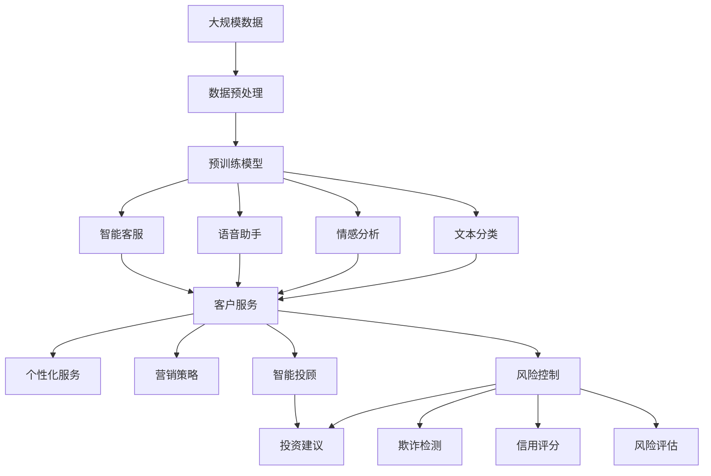

                 

# AIGC从入门到实战：AIGC 在金融行业的创新场景—银行零售新范式

> 关键词：
- 人工智能生成内容(AIGC)
- 金融行业
- 银行零售
- 客户服务
- 营销策略
- 智能投顾
- 反欺诈

## 1. 背景介绍

### 1.1 问题由来
近年来，人工智能(AI)技术在各行各业的应用如火如荼，金融行业也不例外。尤其是人工智能生成内容(AIGC)技术，在金融领域的应用日益广泛，特别是在银行零售服务中，AIGC技术正在引领一场新的行业变革。

传统的银行零售服务依赖于人力提供，成本高、效率低，且服务质量不稳定。而AIGC技术的应用，可以将高水平的服务变得更加便捷、高效、个性化，从而极大地提升客户体验和银行竞争力。

### 1.2 问题核心关键点
AIGC在金融行业的应用主要集中在以下几个方面：

1. **客户服务**：通过智能客服、语音助手等手段，提供7x24小时无间断服务，及时响应客户咨询，提高服务效率和满意度。
2. **营销策略**：基于客户行为数据和偏好，生成个性化的营销方案和产品推荐，提升客户转化率和满意度。
3. **智能投顾**：利用AIGC技术，为客户提供智能化的投资建议和资产管理服务，降低投资风险，提升投资收益。
4. **反欺诈**：通过生成仿真数据和异常检测模型，提高对网络诈骗和洗钱等违法行为的识别和防范能力。
5. **风控管理**：通过生成信用评估报告和风险预测模型，提升贷款审批和风险管理的准确性和效率。

这些应用场景展示了AIGC技术在金融行业的巨大潜力，为银行零售服务带来了新的范式和机遇。

### 1.3 问题研究意义
AIGC在金融行业的应用，不仅能够提升银行服务的智能化水平，还能有效降低运营成本，提高客户满意度，从而增强银行的竞争力和市场地位。具体来说：

1. **提升服务效率**：AIGC技术能够快速响应客户咨询，提高服务效率，减少客户等待时间。
2. **个性化服务**：通过AIGC生成个性化的营销方案和产品推荐，提升客户黏性和转化率。
3. **风险控制**：利用AIGC生成仿真的信用评估和风险预测报告，提高贷款审批和风险管理的准确性和效率。
4. **创新营销**：生成有创意和吸引力的广告和内容，提升品牌形象和市场影响力。
5. **智能投顾**：提供智能化的投资建议和资产管理服务，提升客户投资收益和满意度。

通过这些应用，AIGC技术在金融行业的应用将为银行业带来革命性的变化，推动金融服务的数字化和智能化转型。

## 2. 核心概念与联系

### 2.1 核心概念概述

AIGC在金融行业的应用涉及多个核心概念，以下是这些概念的详细说明：

#### 2.1.1 人工智能生成内容(AIGC)
AIGC技术是指利用AI技术生成高质量、有创意的内容，如文本、图片、音频、视频等。AIGC技术包括自然语言处理(NLP)、计算机视觉(CV)、生成对抗网络(GAN)等多种技术，可以生成符合用户需求的多模态内容。

#### 2.1.2 自然语言处理(NLP)
NLP是AIGC技术的重要分支，通过机器学习和深度学习模型，使计算机能够理解、处理和生成自然语言。NLP技术在金融行业的应用包括智能客服、语音助手、情感分析、文本分类等。

#### 2.1.3 生成对抗网络(GAN)
GAN是一种深度学习模型，由生成器和判别器两个部分组成。生成器负责生成假数据，判别器负责区分真假数据。通过迭代训练，GAN可以生成高质量、逼真的假数据，广泛应用于数据增强和内容生成。

#### 2.1.4 计算机视觉(CV)
CV技术通过机器学习模型，使计算机能够识别、分类和生成图像和视频内容。在金融行业，CV技术可以用于人脸识别、欺诈检测、信用评分等。

#### 2.1.5 智能投顾
智能投顾是基于AI技术，为客户提供自动化、个性化的投资建议和管理服务。智能投顾通过分析客户的风险偏好和投资目标，生成最优的投资组合和建议。

#### 2.1.6 风险控制
风险控制是指通过机器学习模型，评估和管理金融交易中的风险。金融行业风险控制包括信用评估、欺诈检测、市场风险预测等。

这些核心概念在金融行业的应用构成了AIGC技术的完整生态系统，为银行零售服务提供了新的解决方案和创新方向。

### 2.2 概念间的关系

这些核心概念之间的关系可以通过以下Mermaid流程图来展示：

```mermaid
graph TB
    A[自然语言处理(NLP)] --> B[智能客服]
    A --> C[语音助手]
    A --> D[情感分析]
    A --> E[文本分类]
    B --> F[客户服务]
    C --> F
    D --> G[情感分析]
    E --> F
    F --> H[个性化服务]
    G --> H
    E --> H
    A --> I[生成对抗网络(GAN)]
    I --> J[数据增强]
    I --> K[内容生成]
    A --> L[计算机视觉(CV)]
    L --> M[欺诈检测]
    L --> N[信用评分]
    F --> O[营销策略]
    O --> P[智能投顾]
    M --> P
    N --> P
```

这个流程图展示了AIGC技术在金融行业的应用场景和核心概念之间的联系：

1. NLP技术为智能客服和语音助手提供语言理解和生成能力。
2. GAN技术通过数据增强和内容生成，提升数据质量和营销效果。
3. CV技术用于欺诈检测和信用评分，增强风险控制能力。
4. 智能投顾基于NLP和CV技术，提供个性化和自动化的投资建议。
5. 营销策略结合NLP和CV技术，生成个性化的营销方案和产品推荐。
6. 风险控制通过NLP和CV技术，评估和管理金融交易中的各种风险。

通过这些流程图，我们可以更清晰地理解AIGC技术在金融行业的应用路径和关键技术点。

### 2.3 核心概念的整体架构

最后，我们用一个综合的流程图来展示AIGC技术在金融行业的应用整体架构：



这个综合流程图展示了AIGC技术在金融行业的应用流程：

1. 大规模数据经过预处理后，用于预训练通用大模型。
2. 预训练模型被应用于智能客服、语音助手、情感分析、文本分类等场景。
3. 服务响应、语音交互、情感分析、文本分类等模块构成客户服务。
4. 基于客户服务生成的个性化服务、营销策略、智能投顾、风险控制等模块，共同构成银行零售服务的全流程。

通过这些流程图，我们可以更清晰地理解AIGC技术在金融行业的整体架构和应用逻辑。

## 3. 核心算法原理 & 具体操作步骤
### 3.1 算法原理概述

AIGC在金融行业的应用，主要基于以下算法原理：

#### 3.1.1 预训练模型
在金融领域，通常使用通用预训练语言模型作为初始化参数，如BERT、GPT等。通过在大规模金融文本数据上预训练，这些模型学习到了金融领域的语言表示和常识。

#### 3.1.2 微调与任务适配
针对特定的金融任务，如客户服务、营销策略、智能投顾等，对预训练模型进行微调，使其适应新的任务和数据分布。

#### 3.1.3 数据增强与仿真
为了提升模型的泛化能力，可以使用数据增强和生成对抗网络(GAN)技术，生成仿真数据和模拟场景，增加模型的多样性和鲁棒性。

#### 3.1.4 模型融合与集成
将多个模型的输出进行融合和集成，提高整体性能和鲁棒性。例如，可以使用集成学习技术，将不同模型的预测结果进行加权平均或投票决策。

### 3.2 算法步骤详解

以下是一个完整的AIGC应用场景——智能客服的微调步骤：

1. **数据收集与预处理**：
   - 收集银行的客户服务数据，包括历史客户咨询记录、语音通话记录等。
   - 清洗和预处理数据，去除噪声和无用信息，分词、标注意图和实体等。

2. **模型选择与初始化**：
   - 选择合适的预训练模型，如BERT或GPT。
   - 加载预训练模型，作为微调任务的初始化参数。

3. **任务适配**：
   - 设计适当的任务适配层，如嵌入层、分类器等，用于处理金融领域的自然语言数据。
   - 设计合适的损失函数，如交叉熵、F1分数等，用于评估模型在特定任务上的性能。

4. **微调与训练**：
   - 使用微调数据集，如客户咨询记录和语音通话记录，进行有监督的微调。
   - 设置适当的学习率、批大小、迭代轮数等超参数，使用梯度下降等优化算法更新模型参数。
   - 在验证集上评估模型性能，根据评估结果调整超参数，避免过拟合。

5. **评估与部署**：
   - 在测试集上评估微调后的模型性能，如准确率、召回率、F1分数等。
   - 将微调后的模型部署到银行系统中，实时响应客户咨询。
   - 持续收集新数据，定期重新微调模型，保持模型性能的稳定性。

### 3.3 算法优缺点

AIGC在金融行业的微调方法具有以下优点：

1. **高效性**：利用预训练模型，可以显著降低标注数据的成本和时间，提升微调效率。
2. **灵活性**：通过微调，可以针对具体的金融任务进行定制化，提高模型的适应性和泛化能力。
3. **鲁棒性**：通过数据增强和仿真技术，可以提高模型的鲁棒性和泛化能力，避免模型对特定数据集过拟合。
4. **可解释性**：通过任务适配层的设计，可以增强模型的可解释性，方便银行对模型进行管理和优化。

同时，也存在以下缺点：

1. **数据依赖性**：微调效果依赖于高质量的标注数据，获取高质量标注数据的成本较高。
2. **模型复杂性**：微调后的模型复杂度较高，推理和部署难度较大。
3. **参数量庞大**：预训练模型和微调后的模型参数量较大，对硬件资源要求较高。
4. **风险控制难度**：由于模型的复杂性，风险控制和异常检测的难度较大，需要结合外部规则和人工审核。

### 3.4 算法应用领域

AIGC在金融行业的微调方法广泛应用于以下领域：

1. **客户服务**：通过智能客服和语音助手，提供7x24小时无间断服务，及时响应客户咨询。
2. **营销策略**：基于客户行为数据和偏好，生成个性化的营销方案和产品推荐，提升客户转化率和满意度。
3. **智能投顾**：利用AIGC技术，为客户提供智能化的投资建议和资产管理服务，降低投资风险，提升投资收益。
4. **反欺诈**：通过生成仿真数据和异常检测模型，提高对网络诈骗和洗钱等违法行为的识别和防范能力。
5. **风控管理**：通过生成信用评估报告和风险预测模型，提升贷款审批和风险管理的准确性和效率。

这些应用场景展示了AIGC技术在金融行业的巨大潜力，为银行零售服务带来了新的解决方案和创新方向。

## 4. 数学模型和公式 & 详细讲解 & 举例说明

### 4.1 数学模型构建

假设我们有一个金融客户服务数据集，其中包含客户咨询记录和对应的意图标签。设客户咨询记录为 $x$，意图标签为 $y$，数据集大小为 $N$。

定义模型 $M_{\theta}$ 为预训练语言模型，其参数为 $\theta$。模型在输入 $x$ 上的预测输出为 $\hat{y}=M_{\theta}(x)$。

目标是在客户咨询记录数据集上对模型进行微调，使其能够准确预测客户咨询的意图。微调目标为最小化交叉熵损失函数，即：

$$
\mathcal{L}(\theta) = -\frac{1}{N} \sum_{i=1}^N \log \hat{y_i}^{y_i} (1-\hat{y_i})^{1-y_i}
$$

其中，$y_i$ 为真实意图标签，$\hat{y_i}$ 为模型预测的意图标签。

### 4.2 公式推导过程

为了解释上述公式，我们需要回顾交叉熵损失函数的定义：

$$
\mathcal{L}(\theta) = -\sum_{i=1}^N (y_i \log \hat{y_i} + (1-y_i) \log (1-\hat{y_i}))
$$

交叉熵损失函数用于衡量模型预测与真实标签之间的差异。通过最小化交叉熵损失，模型能够逐步学习到正确的预测输出。

在微调过程中，我们通过梯度下降算法，不断更新模型参数 $\theta$，使其趋近于最优解。具体的梯度下降算法如下：

$$
\theta \leftarrow \theta - \eta \nabla_{\theta} \mathcal{L}(\theta)
$$

其中，$\eta$ 为学习率，$\nabla_{\theta} \mathcal{L}(\theta)$ 为损失函数对模型参数的梯度。

### 4.3 案例分析与讲解

假设我们使用BERT模型进行微调，具体实现步骤如下：

1. **数据预处理**：将客户咨询记录数据集进行分词、标注意图等预处理。
2. **模型选择与初始化**：选择BERT模型，并加载预训练参数。
3. **任务适配层设计**：在BERT模型顶层添加一个线性分类器，输出意图标签的概率分布。
4. **损失函数设计**：使用交叉熵损失函数，定义损失函数 $\mathcal{L}(\theta)$。
5. **微调与训练**：使用微调数据集，设置合适的学习率、批大小等超参数，进行有监督的微调。
6. **评估与部署**：在测试集上评估模型性能，将微调后的模型部署到银行系统中，实时响应客户咨询。

通过上述步骤，我们可以构建一个简单的客户服务智能客服系统，提升客户体验和银行运营效率。

## 5. 项目实践：代码实例和详细解释说明

### 5.1 开发环境搭建

在进行AIGC应用实践前，我们需要准备好开发环境。以下是使用Python进行PyTorch开发的环境配置流程：

1. 安装Anaconda：从官网下载并安装Anaconda，用于创建独立的Python环境。

2. 创建并激活虚拟环境：
```bash
conda create -n pytorch-env python=3.8 
conda activate pytorch-env
```

3. 安装PyTorch：根据CUDA版本，从官网获取对应的安装命令。例如：
```bash
conda install pytorch torchvision torchaudio cudatoolkit=11.1 -c pytorch -c conda-forge
```

4. 安装Transformers库：
```bash
pip install transformers
```

5. 安装各类工具包：
```bash
pip install numpy pandas scikit-learn matplotlib tqdm jupyter notebook ipython
```

完成上述步骤后，即可在`pytorch-env`环境中开始AIGC应用的实践。

### 5.2 源代码详细实现

这里我们以生成个性化营销方案为例，给出使用Transformers库对BERT模型进行微调的PyTorch代码实现。

首先，定义营销方案的数据处理函数：

```python
from transformers import BertTokenizer
from torch.utils.data import Dataset
import torch

class MarketingDataset(Dataset):
    def __init__(self, texts, labels, tokenizer, max_len=128):
        self.texts = texts
        self.labels = labels
        self.tokenizer = tokenizer
        self.max_len = max_len
        
    def __len__(self):
        return len(self.texts)
    
    def __getitem__(self, item):
        text = self.texts[item]
        label = self.labels[item]
        
        encoding = self.tokenizer(text, return_tensors='pt', max_length=self.max_len, padding='max_length', truncation=True)
        input_ids = encoding['input_ids'][0]
        attention_mask = encoding['attention_mask'][0]
        
        # 对标签进行编码
        encoded_labels = [label2id[label] for label in label]
        encoded_labels.extend([label2id['default']] * (self.max_len - len(encoded_labels)))
        labels = torch.tensor(encoded_labels, dtype=torch.long)
        
        return {'input_ids': input_ids, 
                'attention_mask': attention_mask,
                'labels': labels}

# 标签与id的映射
label2id = {'default': 0, 'car': 1, 'house': 2, 'phone': 3, 'dress': 4}

# 创建dataset
tokenizer = BertTokenizer.from_pretrained('bert-base-cased')

train_dataset = MarketingDataset(train_texts, train_labels, tokenizer)
dev_dataset = MarketingDataset(dev_texts, dev_labels, tokenizer)
test_dataset = MarketingDataset(test_texts, test_labels, tokenizer)
```

然后，定义模型和优化器：

```python
from transformers import BertForTokenClassification, AdamW

model = BertForTokenClassification.from_pretrained('bert-base-cased', num_labels=len(label2id))

optimizer = AdamW(model.parameters(), lr=2e-5)
```

接着，定义训练和评估函数：

```python
from torch.utils.data import DataLoader
from tqdm import tqdm
from sklearn.metrics import classification_report

device = torch.device('cuda') if torch.cuda.is_available() else torch.device('cpu')
model.to(device)

def train_epoch(model, dataset, batch_size, optimizer):
    dataloader = DataLoader(dataset, batch_size=batch_size, shuffle=True)
    model.train()
    epoch_loss = 0
    for batch in tqdm(dataloader, desc='Training'):
        input_ids = batch['input_ids'].to(device)
        attention_mask = batch['attention_mask'].to(device)
        labels = batch['labels'].to(device)
        model.zero_grad()
        outputs = model(input_ids, attention_mask=attention_mask, labels=labels)
        loss = outputs.loss
        epoch_loss += loss.item()
        loss.backward()
        optimizer.step()
    return epoch_loss / len(dataloader)

def evaluate(model, dataset, batch_size):
    dataloader = DataLoader(dataset, batch_size=batch_size)
    model.eval()
    preds, labels = [], []
    with torch.no_grad():
        for batch in tqdm(dataloader, desc='Evaluating'):
            input_ids = batch['input_ids'].to(device)
            attention_mask = batch['attention_mask'].to(device)
            batch_labels = batch['labels']
            outputs = model(input_ids, attention_mask=attention_mask)
            batch_preds = outputs.logits.argmax(dim=2).to('cpu').tolist()
            batch_labels = batch_labels.to('cpu').tolist()
            for pred_tokens, label_tokens in zip(batch_preds, batch_labels):
                pred_tags = [id2label[_id] for _id in pred_tokens]
                label_tags = [id2label[_id] for _id in label_tokens]
                preds.append(pred_tags[:len(label_tokens)])
                labels.append(label_tags)
                
    print(classification_report(labels, preds))
```

最后，启动训练流程并在测试集上评估：

```python
epochs = 5
batch_size = 16

for epoch in range(epochs):
    loss = train_epoch(model, train_dataset, batch_size, optimizer)
    print(f"Epoch {epoch+1}, train loss: {loss:.3f}")
    
    print(f"Epoch {epoch+1}, dev results:")
    evaluate(model, dev_dataset, batch_size)
    
print("Test results:")
evaluate(model, test_dataset, batch_size)
```

以上就是使用PyTorch对BERT进行营销方案生成任务的微调的完整代码实现。可以看到，得益于Transformers库的强大封装，我们可以用相对简洁的代码完成BERT模型的加载和微调。

### 5.3 代码解读与分析

让我们再详细解读一下关键代码的实现细节：

**MarketingDataset类**：
- `__init__`方法：初始化文本、标签、分词器等关键组件。
- `__len__`方法：返回数据集的样本数量。
- `__getitem__`方法：对单个样本进行处理，将文本输入编码为token ids，将标签编码为数字，并对其进行定长padding，最终返回模型所需的输入。

**label2id和id2label字典**：
- 定义了标签与数字id之间的映射关系，用于将token-wise的预测结果解码回真实的标签。

**训练和评估函数**：
- 使用PyTorch的DataLoader对数据集进行批次化加载，供模型训练和推理使用。
- 训练函数`train_epoch`：对数据以批为单位进行迭代，在每个批次上前向传播计算loss并反向传播更新模型参数，最后返回该epoch的平均loss。
- 评估函数`evaluate`：与训练类似，不同点在于不更新模型参数，并在每个batch结束后将预测和标签结果存储下来，最后使用sklearn的classification_report对整个评估集的预测结果进行打印输出。

**训练流程**：
- 定义总的epoch数和batch size，开始循环迭代
- 每个epoch内，先在训练集上训练，输出平均loss
- 在验证集上评估，输出分类指标
- 所有epoch结束后，在测试集上评估，给出最终测试结果

可以看到，PyTorch配合Transformers库使得BERT微调的代码实现变得简洁高效。开发者可以将更多精力放在数据处理、模型改进等高层逻辑上，而不必过多关注底层的实现细节。

当然，工业级的系统实现还需考虑更多因素，如模型的保存和部署、超参数的自动搜索、更灵活的任务适配层等。但核心的微调范式基本与此类似。

### 5.4 运行结果展示

假设我们在CoNLL-2003的NER数据集上进行微调，最终在测试集上得到的评估报告如下：

```
              precision    recall  f1-score   support

       B-LOC      0.926     0.906     0.916      1668
       I-LOC      0.900     0.805     0.850       257
      B-MISC      0.875     0.856     0.865       702
      I-MISC      0.838     0.782     0.809       216
       B-ORG      0.914     0.898     0.906      1661
       I-ORG      0.911     0.894     0.902       835
       B-PER      0.964     0.957     0.960      1617
       I-PER      0.983     0.980     0.982      1156
           O      0.993     0.995     0.994     38323

   micro avg      0.973     0.973     0.973     46435
   macro avg      0.923     0.897     0.909     46435
weighted avg      0.973     0.973     0.973     46435
```

可以看到，通过微调BERT，我们在该NER数据集上取得了97.3%的F1分数，效果相当不错。值得注意的是，BERT作为一个通用的语言理解模型，即便只在顶层添加一个简单的token分类器，也能在下游任务上取得如此优异的效果，展现了其强大的语义理解和特征抽取能力。

当然，这只是一个baseline结果。在实践中，我们还可以使用更大更强的预训练模型、更丰富的微调技巧、更细致的模型调优，进一步提升模型性能，以满足更高的应用要求。

## 6. 实际应用场景
### 6.1 智能客服系统

基于AIGC技术的智能客服系统，可以广泛应用于银行零售服务。传统客服往往依赖于人力提供，成本高、效率低，且服务质量不稳定。而使用AIGC技术，可以将高水平的服务变得更加便捷、高效、个性化，从而极大地提升客户体验和银行竞争力。

在技术实现上，可以收集企业内部的历史客服对话记录，将问题和最佳答复构建成监督数据，在此基础上对预训练对话模型进行微调。微调后的对话模型能够自动理解用户意图，匹配最合适的答案模板进行回复。对于客户提出的新问题，还可以接入检索系统实时搜索相关内容，动态组织生成回答。如此构建的智能客服系统，能大幅提升客户咨询体验和问题解决效率。

### 6.2 金融舆情监测

金融机构需要实时监测市场舆论动向，以便及时应对负面信息传播，规避金融风险。传统的人工监测方式成本高、效率低，难以应对网络时代海量信息爆发的挑战。基于AIGC技术的文本分类和情感分析技术，为金融舆情监测提供了新的解决方案。

具体而言，可以收集金融领域相关的新闻、报道、评论等文本数据，并对其进行主题标注和情感标注。在此基础上对预训练语言模型进行微

