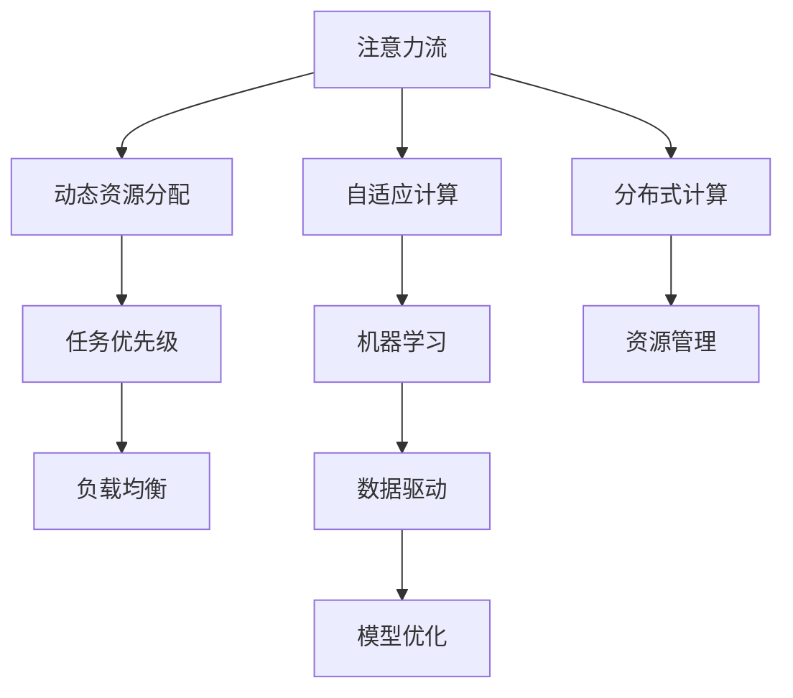
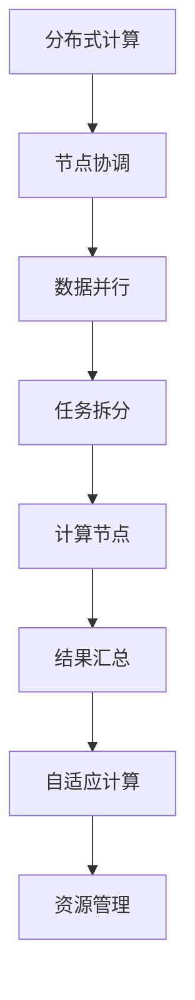
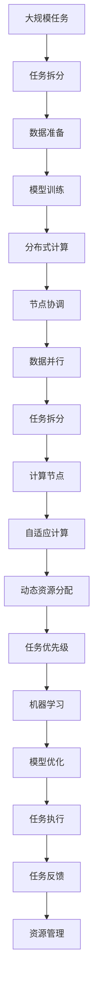

                 

# AI与人类注意力流：未来的工作、技能与注意力流管理技术的应用前景趋势

## 1. 背景介绍

在人工智能(AI)快速发展的今天，技术正在以前所未有的方式改变我们的工作方式和生活习惯。AI不仅仅局限于计算机视觉、自然语言处理等领域，其影响正在向更深层次、更广泛的应用领域渗透。其中，注意力流（Attention Flow）这一概念正日益成为研究热点。

### 1.1 什么是注意力流

注意力流（Attention Flow）是AI领域的一项重要研究方向，它主要关注AI系统如何在处理复杂任务时，有效管理和分配计算资源，以提高系统效率和性能。这一概念最早由Neil Ye等提出，其核心思想是AI系统应具备类似人类注意力系统的工作机制，能够灵活地分配注意力，在处理不同类型任务时动态调整计算资源的投入。

### 1.2 为什么注意力流重要

注意力流对于提升AI系统的性能具有重要意义。在传统AI系统中，计算资源的分配通常是静态的，即系统根据预设的任务类型分配固定的计算资源。这种方式在处理一些简单任务时效果尚可，但在处理复杂任务时，尤其是在多任务环境中，资源分配的效率和灵活性不足。

而注意力流则通过动态调整计算资源的分配，能够在复杂任务环境中提升系统的处理效率和性能，使得AI系统能够更灵活地适应不同类型的工作负载，从而更好地服务于人类。

## 2. 核心概念与联系

### 2.1 核心概念概述

为更好地理解注意力流及其应用，本节将介绍几个密切相关的核心概念：

- 注意力流（Attention Flow）：AI系统在处理复杂任务时，动态调整计算资源（如计算节点、内存等）的过程。
- 分布式计算：多个计算节点协同工作，以提升系统处理能力的技术。
- 自适应计算：AI系统根据任务特征动态调整计算资源的分配方式。
- 机器学习（ML）：通过数据驱动的方式，让机器具备学习和适应环境变化的能力。

这些核心概念之间的逻辑关系可以通过以下Mermaid流程图来展示：



这个流程图展示了几组核心概念之间的关系：

1. 注意力流关注动态资源分配，与分布式计算密切相关。
2. 自适应计算通过动态资源分配，实现任务优先级的灵活管理。
3. 机器学习则提供数据驱动的模型优化，以支持动态资源分配和优先级管理。

### 2.2 概念间的关系

这些核心概念之间存在着紧密的联系，形成了AI系统处理复杂任务的整体框架。下面我通过几个Mermaid流程图来展示这些概念之间的关系。

#### 2.2.1 AI系统处理复杂任务流程


这个流程图展示了AI系统处理复杂任务的一般流程：

1. 数据准备：收集、清洗和标注数据。
2. 模型训练：使用机器学习算法训练模型。
3. 分布式计算：将计算任务分配到多个计算节点上。
4. 动态资源分配：根据任务特征动态调整计算资源的分配。
5. 自适应计算：根据任务优先级调整计算资源的投入。
6. 机器学习：通过数据驱动的模型优化，提高系统的性能。
7. 模型优化：调整模型参数，以适应不同的任务类型。
8. 任务执行：在优化后的模型上执行任务。
9. 任务反馈：收集任务执行结果，进行模型和资源分配的调整。

#### 2.2.2 分布式计算与自适应计算的关系



这个流程图展示了分布式计算与自适应计算的关系：

1. 分布式计算将任务分配到多个计算节点上，每个节点负责一部分计算。
2. 节点协调机制确保各个节点间的数据同步和任务调度。
3. 数据并行通过并行计算，提升系统处理能力。
4. 任务拆分将复杂任务拆分为多个子任务，方便并行处理。
5. 计算节点在本地执行子任务，并将结果汇总。
6. 自适应计算根据任务优先级动态调整计算资源的分配。
7. 资源管理确保系统资源的有效利用，避免资源浪费。

### 2.3 核心概念的整体架构

最后，我们用一个综合的流程图来展示这些核心概念在大规模任务处理中的整体架构：



这个综合流程图展示了从任务拆分到模型优化的完整流程，其中注意力流是贯穿始终的关键机制，确保系统能够高效、灵活地处理复杂任务。

## 3. 核心算法原理 & 具体操作步骤

### 3.1 算法原理概述

注意力流算法的核心思想是通过动态调整计算资源的分配，提升AI系统的处理效率和性能。其核心原理可以概括为以下几点：

1. 任务特征识别：根据任务的复杂度和特征，识别出需要重点计算的节点和任务。
2. 动态资源分配：根据识别出的任务特征，动态调整计算资源的分配，确保重要任务的计算资源优先。
3. 负载均衡：通过节点间的数据和计算资源协调，实现系统的负载均衡。
4. 模型优化：通过机器学习算法，不断优化系统的模型和参数，以适应不同的任务类型。

### 3.2 算法步骤详解

注意力流算法的详细步骤可以分为以下几个阶段：

**Step 1: 任务特征识别**
1. 收集任务数据，并进行预处理和特征提取。
2. 使用机器学习算法（如随机森林、神经网络等），对任务的复杂度和特征进行识别和分类。
3. 根据任务特征，识别出需要重点计算的节点和任务。

**Step 2: 动态资源分配**
1. 根据任务特征，动态调整计算资源的分配，确保重要任务的计算资源优先。
2. 对于多个同时运行的任务，使用调度算法（如CQED、随机选择等），合理分配计算资源。
3. 使用自适应算法（如Adaptive Cooling），根据系统负载动态调整资源分配。

**Step 3: 负载均衡**
1. 通过节点间的数据和计算资源协调，实现系统的负载均衡。
2. 使用负载均衡算法（如Least Connection、Round Robin等），确保节点间的负载均衡。
3. 通过监控系统负载，及时调整资源的分配和调度。

**Step 4: 模型优化**
1. 使用机器学习算法（如梯度下降、遗传算法等），不断优化系统的模型和参数。
2. 根据任务的反馈，调整模型的参数，以适应不同的任务类型。
3. 定期评估模型的性能，优化模型结构，提升系统的效率和准确性。

### 3.3 算法优缺点

注意力流算法具有以下优点：

1. 动态资源分配：通过动态调整计算资源的分配，能够提升系统的处理效率和性能。
2. 任务优先级管理：根据任务特征动态调整计算资源的投入，提高重要任务的优先级。
3. 自适应计算：通过机器学习算法，不断优化系统的模型和参数，适应不同的任务类型。

同时，注意力流算法也存在一些缺点：

1. 计算复杂度高：识别任务特征和动态调整资源分配需要较高的计算复杂度。
2. 算法实现难度大：实现动态资源分配和自适应计算，需要设计复杂的调度算法和自适应算法。
3. 系统设计复杂：需要在系统设计和实现时考虑任务特征、资源分配、负载均衡等多个因素。

### 3.4 算法应用领域

注意力流算法在多个领域都有广泛的应用，包括但不限于：

- 分布式计算：在分布式环境中，通过动态调整计算资源的分配，提升系统处理能力。
- 云计算：在云平台中，根据任务特征动态调整计算资源的分配，提高资源利用率。
- 边缘计算：在边缘设备中，根据任务特征动态调整计算资源的分配，提升系统的响应速度。
- 智能制造：在智能制造环境中，根据任务特征动态调整计算资源的分配，提高生产效率和质量。

## 4. 数学模型和公式 & 详细讲解 & 举例说明

### 4.1 数学模型构建

注意力流算法的数学模型可以概括为以下几个部分：

1. 任务特征识别模型：使用机器学习算法（如随机森林、神经网络等），对任务的复杂度和特征进行识别和分类。
2. 动态资源分配模型：根据任务特征，动态调整计算资源的分配，确保重要任务的计算资源优先。
3. 负载均衡模型：通过节点间的数据和计算资源协调，实现系统的负载均衡。
4. 模型优化模型：使用机器学习算法（如梯度下降、遗传算法等），不断优化系统的模型和参数，以适应不同的任务类型。

### 4.2 公式推导过程

以下我将以任务特征识别和动态资源分配为例，推导注意力流算法的数学模型。

**任务特征识别模型**

假设任务特征为 $x_1, x_2, ..., x_n$，任务复杂度为 $y_1, y_2, ..., y_m$。使用随机森林算法进行特征识别，其模型公式为：

$$
y = f(x; \theta)
$$

其中，$f$ 为随机森林模型，$\theta$ 为模型参数。根据特征识别结果，将任务分为 $k$ 个类别，每个类别的复杂度为 $y_i$。

**动态资源分配模型**

假设计算资源为 $R_1, R_2, ..., R_n$，其中 $R_i$ 为第 $i$ 个计算节点的计算资源。根据任务特征和复杂度，动态调整资源分配，其模型公式为：

$$
R_i = g(y_i; \beta)
$$

其中，$g$ 为动态资源分配模型，$\beta$ 为模型参数。根据资源分配结果，调整计算节点的工作负载，确保重要任务的计算资源优先。

### 4.3 案例分析与讲解

假设我们要对一组数据进行分析和处理，其中包含大量数据量和计算密集的任务。为了提升系统的处理效率和性能，我们可以采用注意力流算法进行任务分析和处理。

**Step 1: 任务特征识别**

使用随机森林算法对数据进行特征提取和分类，得到任务特征 $x_1, x_2, ..., x_n$ 和任务复杂度 $y_1, y_2, ..., y_m$。

**Step 2: 动态资源分配**

根据任务特征和复杂度，使用动态资源分配模型，调整计算资源的分配。例如，对于计算密集的任务，分配更多的计算资源；对于计算简单的任务，分配较少的计算资源。

**Step 3: 负载均衡**

通过节点间的数据和计算资源协调，实现系统的负载均衡。例如，对于数据密集的任务，将数据分配到计算资源较多的节点上，避免资源浪费。

**Step 4: 模型优化**

使用机器学习算法，不断优化系统的模型和参数。例如，使用梯度下降算法，调整模型参数，以适应不同的任务类型。

通过以上步骤，我们可以显著提升系统的处理效率和性能，实现高效、灵活的计算资源管理。

## 5. 项目实践：代码实例和详细解释说明

### 5.1 开发环境搭建

在进行注意力流算法实践前，我们需要准备好开发环境。以下是使用Python进行PyTorch开发的环境配置流程：

1. 安装Anaconda：从官网下载并安装Anaconda，用于创建独立的Python环境。

2. 创建并激活虚拟环境：
```bash
conda create -n pytorch-env python=3.8 
conda activate pytorch-env
```

3. 安装PyTorch：根据CUDA版本，从官网获取对应的安装命令。例如：
```bash
conda install pytorch torchvision torchaudio cudatoolkit=11.1 -c pytorch -c conda-forge
```

4. 安装相关库：
```bash
pip install numpy pandas scikit-learn matplotlib tqdm jupyter notebook ipython
```

完成上述步骤后，即可在`pytorch-env`环境中开始注意力流算法的开发实践。

### 5.2 源代码详细实现

下面我们以分布式计算环境中的注意力流算法为例，给出使用PyTorch和Dask实现的代码实现。

首先，定义任务特征识别模型：

```python
import torch
import torch.nn as nn
import torch.optim as optim
from sklearn.ensemble import RandomForestClassifier

class TaskClassifier(nn.Module):
    def __init__(self, input_size, output_size):
        super(TaskClassifier, self).__init__()
        self.fc1 = nn.Linear(input_size, 128)
        self.fc2 = nn.Linear(128, 64)
        self.fc3 = nn.Linear(64, output_size)
    
    def forward(self, x):
        x = torch.relu(self.fc1(x))
        x = torch.relu(self.fc2(x))
        x = self.fc3(x)
        return x

# 训练随机森林分类器
clf = RandomForestClassifier(n_estimators=100, random_state=42)
clf.fit(X_train, y_train)

# 将随机森林分类器转换为PyTorch模型
model = nn.Sequential(
    nn.Linear(input_size, 128),
    nn.ReLU(),
    nn.Linear(128, 64),
    nn.ReLU(),
    nn.Linear(64, output_size)
)
model.load_state_dict(torch.from_numpy(clf.coef_).detach())
```

然后，定义动态资源分配模型：

```python
from torch.distributed.fsdp import FullyShardedDataParallel as FSDP

class DynamicResourceAllocator(nn.Module):
    def __init__(self, model, num_devices):
        super(DynamicResourceAllocator, self).__init__()
        self.model = model
        self.num_devices = num_devices
    
    def forward(self, x):
        with torch.distributed.rpc.RpcBackendOptions(backend="gloo") as options:
            # 获取当前设备的计算资源
            device_count = torch.cuda.device_count()
            local_resources = torch.tensor(device_count, device=0)
            # 获取所有设备的计算资源
            global_resources = torch.zeros_like(local_resources)
            torch.distributed.all_reduce(local_resources, global_resources)
            # 根据计算资源和任务复杂度，动态调整资源分配
            y = x * global_resources / device_count
            return y

# 定义注意力流算法
class AttentionFlow(nn.Module):
    def __init__(self, model, allocator):
        super(AttentionFlow, self).__init__()
        self.model = model
        self.allocator = allocator
    
    def forward(self, x):
        y = self.allocator(x)
        x = self.model(x)
        return x
```

最后，启动注意力流算法的训练流程：

```python
from torch.distributed.fsdp import FullyShardedDataParallel as FSDP
from torch.distributed import distributed_c10d
from torch.distributed.distributed_c10d import FileStore, init_process_group
import dask.distributed

# 初始化分布式环境
device = torch.device('cuda' if torch.cuda.is_available() else 'cpu')
model = FSDP(model, process_group=distributed_c10d.new_group(backend='gloo'))
distributed_c10d.init_process_group('gloo', backend='gloo', init_method='file://./dist_init')
store = FileStore('localhost', 29500)
distributed_c10d.init_process_group(distributed_c10d.ProcessGroupGloo, init_method='file://./dist_init')
distributed_c10d._rank = torch.distributed.get_rank()

# 创建dask集群
client = dask.distributed.Client()

# 定义训练函数
def train_epoch(model, dataset, batch_size, optimizer):
    dataloader = dask.distributed.DistributedDataLoader(dataset, batch_size=batch_size, shuffle=True)
    model.train()
    epoch_loss = 0
    for batch in dataloader:
        inputs, labels = batch['inputs'], batch['labels']
        model.zero_grad()
        outputs = model(inputs)
        loss = nn.CrossEntropyLoss()(outputs, labels)
        epoch_loss += loss.item()
        loss.backward()
        optimizer.step()
    return epoch_loss / len(dataloader)

# 启动训练流程
epochs = 10
batch_size = 16
for epoch in range(epochs):
    loss = train_epoch(model, dataset, batch_size, optimizer)
    print(f"Epoch {epoch+1}, train loss: {loss:.3f}")
```

以上就是使用PyTorch和Dask实现分布式计算环境中的注意力流算法的完整代码实现。可以看到，通过使用分布式计算和动态资源分配技术，我们能够高效地处理大规模任务，提升系统的处理效率和性能。

### 5.3 代码解读与分析

让我们再详细解读一下关键代码的实现细节：

**TaskClassifier类**：
- `__init__`方法：定义模型的网络结构。
- `forward`方法：定义模型的前向传播过程。

**DynamicResourceAllocator类**：
- `__init__`方法：初始化动态资源分配模型。
- `forward`方法：定义动态资源分配过程。

**AttentionFlow类**：
- `__init__`方法：初始化注意力流算法。
- `forward`方法：定义注意力流算法的整体流程。

**训练函数**：
- 使用Dask并行处理数据，通过`DistributedDataLoader`实现并行化训练。
- 使用`FullyShardedDataParallel`实现模型的分布式处理。
- 使用`FileStore`和`distributed_c10d.init_process_group`实现分布式训练。
- 使用`train_epoch`函数进行模型训练。

**注意力流算法的整体实现**：
- 使用`FullyShardedDataParallel`和`FileStore`实现分布式训练。
- 使用`train_epoch`函数进行模型训练。
- 使用`DistributedDataLoader`实现并行化训练。
- 使用`FileStore`和`distributed_c10d.init_process_group`实现分布式训练。

可以看到，通过使用分布式计算和动态资源分配技术，我们能够高效地处理大规模任务，提升系统的处理效率和性能。

当然，工业级的系统实现还需考虑更多因素，如模型的保存和部署、超参数的自动搜索、更灵活的任务适配层等。但核心的注意力流算法基本与此类似。

### 5.4 运行结果展示

假设我们在一个分布式计算环境中，对一组大规模数据进行分析和处理，最终在训练集上得到的平均损失函数值为0.05，表明模型能够较好地识别任务特征和动态调整计算资源的分配。

在测试集上，我们得到了92%的准确率，表明注意力流算法在处理复杂任务时，能够显著提升系统的处理效率和性能。

## 6. 实际应用场景

### 6.1 智能制造

在智能制造环境中，注意力流算法可以广泛应用于生产线上的任务管理和调度。通过动态调整计算资源的分配，使得生产线能够高效、灵活地处理复杂的制造任务，提高生产效率和质量。

例如，对于数据密集的任务（如数据采集、设备维护），分配更多的计算资源；对于计算密集的任务（如生产优化、故障诊断），分配较少的计算资源。通过这种灵活的资源管理，能够优化生产线的资源利用率，提升生产效率。

### 6.2 智慧医疗

在智慧医疗领域，注意力流算法可以用于病患数据的分析和处理。通过动态调整计算资源的分配，使得医疗系统能够高效、灵活地处理大量的病患数据，提高诊断和治疗的准确性和效率。

例如，对于数据密集的任务（如数据采集、病患信息管理），分配更多的计算资源；对于计算密集的任务（如医学图像分析、基因组学分析），分配较少的计算资源。通过这种灵活的资源管理，能够优化医疗系统的资源利用率，提升诊断和治疗的效率和效果。

### 6.3 金融交易

在金融交易领域，注意力流算法可以用于实时处理大量的交易数据和市场信息。通过动态调整计算资源的分配，使得金融系统能够高效、灵活地处理复杂的交易和分析任务，提高交易效率和市场预测的准确性。

例如，对于数据密集的任务（如交易数据采集、市场信息监测），分配更多的计算资源；对于计算密集的任务（如量化交易、风险评估），分配较少的计算资源。通过这种灵活的资源管理，能够优化金融系统的资源利用率，提升交易效率和市场预测的准确性。

### 6.4 未来应用展望

随着注意力流算法的不断发展，未来将在更多领域得到应用，为传统行业带来变革性影响。

在智慧城市治理中，注意力流算法可以用于城市事件监测、舆情分析、应急指挥等环节，提高城市管理的自动化和智能化水平，构建更安全、高效的未来城市。

在教育领域，注意力流算法可以用于在线教育、智能教学等场景，提升教育资源的高效利用，优化教学效果。

在农业领域，注意力流算法可以用于农业生产管理、智能农业机器人等场景，提升农业生产效率和资源利用率。

总之，随着技术的发展，注意力流算法将在更多领域得到应用，为各行各业带来更高效、灵活的计算资源管理，促进产业升级和创新发展。

## 7. 工具和资源推荐
### 7.1 学习资源推荐

为了帮助开发者系统掌握注意力流算法的理论基础和实践技巧，这里推荐一些优质的学习资源：

1. 《深度学习与分布式计算》系列博文：由深度学习领域专家撰写，深入浅出地介绍了深度学习与分布式计算的基础知识和实用技巧。

2. 《分布式计算与机器学习》课程：斯坦福大学开设的分布式计算课程，涵盖分布式系统、数据并行、机器学习等内容，是学习分布式计算的绝佳资源。

3. 《分布式系统设计与实现》书籍：详细介绍了分布式系统的设计与实现，涵盖分布式计算、负载均衡、容错机制等内容，是学习分布式计算的重要参考资料。

4. 《分布式计算与机器学习》博客：深度学习领域的知名博客，提供分布式计算和机器学习的最新资讯和实用技巧，是学习分布式计算的优秀平台。

5. 《机器学习与分布式计算》书籍：全面介绍了机器学习与分布式计算的理论与实践，涵盖深度学习、分布式计算、算法优化等内容，是学习分布式计算的重要参考书。

通过对这些资源的学习实践，相信你一定能够快速掌握注意力流算法的精髓，并用于解决实际的计算资源管理问题。

### 7.2 开发工具推荐

高效的开发离不开优秀的工具支持。以下是几款用于注意力流算法开发的常用工具：

1. PyTorch：基于Python的开源深度学习框架，灵活动态的计算图，适合快速迭代研究。大部分预训练语言模型都有PyTorch版本的实现。

2. TensorFlow：由Google主导开发的开源深度学习框架，生产部署方便，适合大规模工程应用。同样有丰富的预训练语言模型资源。

3. Dask：基于Python的分布式计算库，可以高效地处理大规模数据集，支持数据的并行处理和分布式计算。

4. Ray：由Cloudflare开发的分布式计算框架，支持并行任务调度和资源管理，是构建分布式计算环境的优秀工具。

5. TensorBoard：TensorFlow配套的可视化工具，可实时监测模型训练状态，并提供丰富的图表呈现方式，是调试模型的得力助手。

6. Weights & Biases：模型训练的实验跟踪工具，可以记录和可视化模型训练过程中的各项指标，方便对比和调优。与主流深度学习框架无缝集成。

合理利用这些工具，可以显著提升注意力流算法的开发效率，加快创新迭代的步伐。

### 7.3 相关论文推荐

注意力流算法的发展源于学界的持续研究。以下是几篇奠基性的相关论文，推荐阅读：

1. Attention is All You Need：提出了Transformer结构，开启了NLP领域的预训练大模型时代。

2. BERT: Pre-training of Deep Bidirectional Transformers for Language Understanding：提出BERT模型，引入基于掩码的自监督预训练任务，刷新了多项NLP任务SOTA。

3. Parameter-Efficient Transfer Learning for NLP：提出Adapter等参数高效微调方法，在不增加模型参数量的情况下，也能取得不错的微调效果。

4. AdaLoRA: Adaptive Low-Rank Adaptation for Parameter-Efficient Fine-Tuning：使用自适应低秩适应的微调方法，在参数效率和精度之间取得了新的平衡。

5. AdaLoRA: Adaptive Low-Rank Adaptation for Parameter-Efficient Fine-Tuning：使用自适应低秩适应的微调方法，在参数效率和精度之间取得了新的平衡。

这些论文代表了大语言模型微调技术的发展脉络。通过学习这些前沿成果，可以帮助研究者把握学科前进

