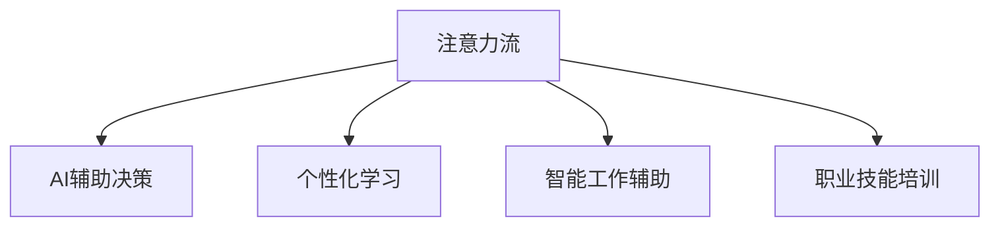
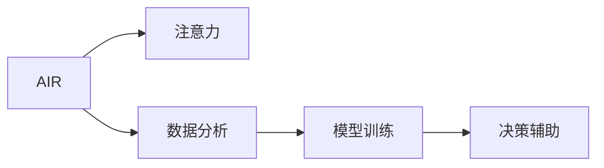
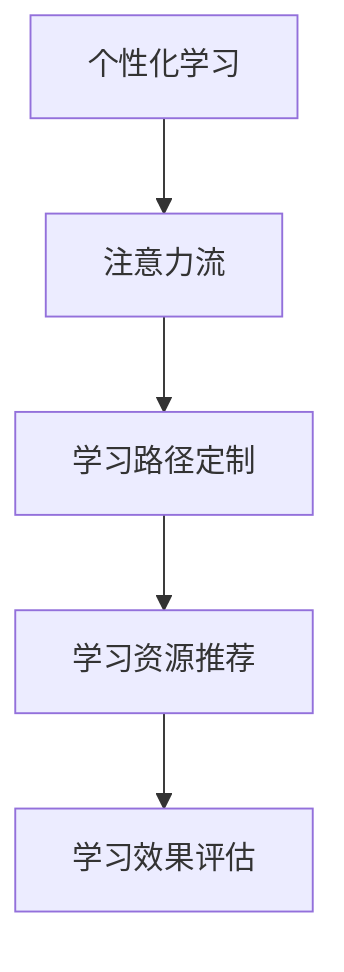
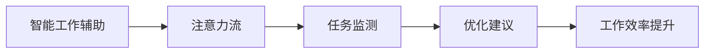
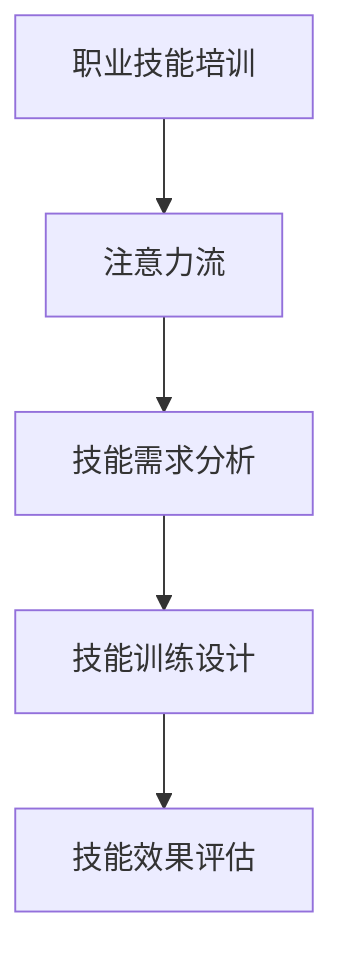
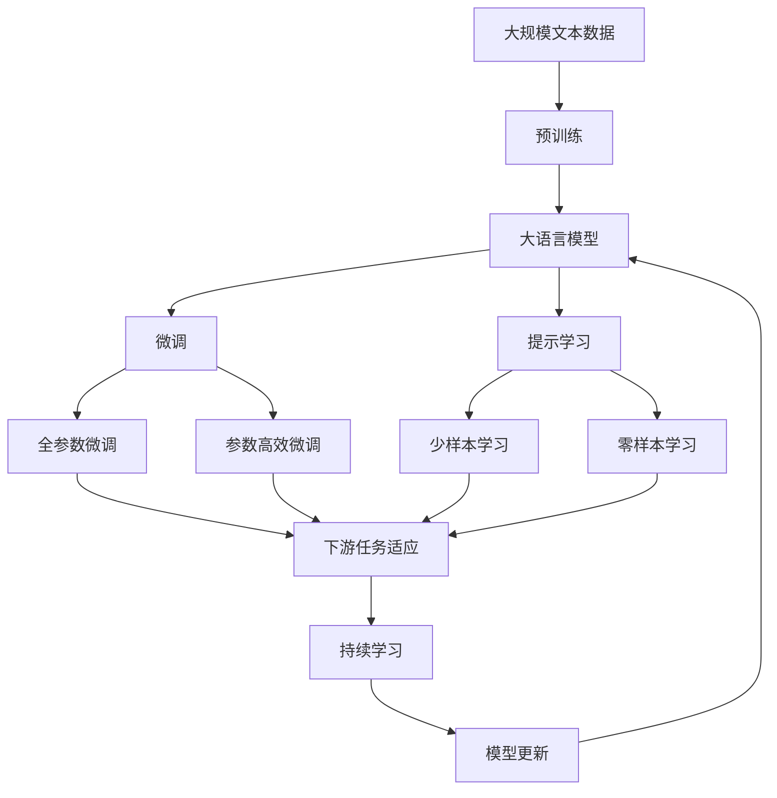

                 

# AI与人类注意力流：未来的教育、工作与技能

> 关键词：人工智能,注意力流,教育,工作,技能提升,人机交互

## 1. 背景介绍

### 1.1 问题由来
当前，人工智能(AI)技术在教育、工作和技能提升领域的应用方兴未艾，正在深刻改变人们的学习方式、工作模式和技能结构。特别是随着深度学习和大数据技术的不断发展，AI系统能够更好地理解人类注意力流，即人类在学习、工作、决策过程中的认知和情感变化，从而提供更加个性化和精准的智能辅助服务。

### 1.2 问题核心关键点
AI与人类注意力流的结合，可以实现以下几方面的改进：
- **个性化学习**：通过分析学生的注意力集中度和知识掌握情况，提供定制化的学习方案，提高学习效率。
- **智能工作辅助**：在职场中，AI系统可以实时监测员工注意力流，提供决策支持和任务优化建议，提高工作效率和质量。
- **职业技能培训**：针对不同职业路径，设计符合特定技能要求的注意力训练任务，帮助员工提升关键技能。

### 1.3 问题研究意义
研究AI与人类注意力流的融合，对于促进教育、工作和技能提升技术的智能化发展，具有重要的理论和实际意义：

1. **提升教育效果**：个性化和动态化的学习体验，能够更好地适应个体差异，激发学生的学习兴趣，提高学习效率。
2. **优化工作流程**：智能工作辅助工具能够减轻人工负担，提升决策质量，加速任务处理。
3. **推动职业发展**：通过精准的技能培训，员工可以更快地掌握新技能，适应职场变化，提升职业竞争力。
4. **促进社会公平**：AI技术的应用能够弥合资源分配不均的差距，使更多人有机会接受高质量的教育和工作指导。
5. **促进终身学习**：持续监测和改进个体注意力流，支持人的终身学习和发展。

## 2. 核心概念与联系

### 2.1 核心概念概述

要理解AI与人类注意力流的融合，首先需要了解以下几个核心概念：

- **注意力流**：指人类在学习、工作、决策过程中，认知和情感的变化轨迹。注意力流分析通过识别关键事件和状态变化，理解人类行为背后的心理机制。
- **AI辅助决策**：利用机器学习算法，分析大量数据，提供辅助决策和优化建议。
- **个性化学习**：根据个体差异，定制化学习路径和资源，满足个性化需求。
- **智能工作辅助**：通过监测员工注意力流，提供实时支持和优化建议，提升工作效率和质量。
- **职业技能培训**：利用AI技术，设计针对性训练任务，帮助员工提升关键技能。

这些概念通过数据驱动和机器学习技术，形成了一个完整的AI与人类注意力流的融合框架，如图：



### 2.2 概念间的关系

上述概念之间存在着紧密的联系，形成了AI与人类注意力流融合的整体生态系统。以下通过几个Mermaid流程图来展示这些概念之间的关系：

#### 2.2.1 AI辅助决策与注意力流的关系



这个流程图展示了AI辅助决策的基本流程：通过分析注意力流数据，提取关键特征，利用机器学习模型训练，最终提供辅助决策。

#### 2.2.2 个性化学习与注意力流的关系



这个流程图展示了个性化学习的基本流程：通过分析注意力流，定制个性化学习路径，推荐学习资源，并不断评估学习效果，形成闭环反馈。

#### 2.2.3 智能工作辅助与注意力流的关系



这个流程图展示了智能工作辅助的基本流程：通过监测注意力流，识别任务中的关键点，提供优化建议，提升工作效率。

#### 2.2.4 职业技能培训与注意力流的关系



这个流程图展示了职业技能培训的基本流程：通过分析注意力流，识别技能需求，设计针对性的培训方案，并不断评估培训效果。

### 2.3 核心概念的整体架构

最后，我们用一个综合的流程图来展示这些核心概念在大模型微调过程中的整体架构：



这个综合流程图展示了从预训练到微调，再到持续学习的完整过程。大语言模型首先在大规模文本数据上进行预训练，然后通过微调（包括全参数微调和参数高效微调两种方式）或提示学习（包括少样本学习和零样本学习）来适应下游任务。最后，通过持续学习技术，模型可以不断学习新知识，同时避免遗忘旧知识。

## 3. 核心算法原理 & 具体操作步骤
### 3.1 算法原理概述

AI与人类注意力流的融合，主要基于以下几个算法原理：

- **注意力流分析**：通过分析学习、工作、决策过程中的注意力变化，理解人类行为的动机和情感状态。
- **AI辅助决策**：利用机器学习算法，从大量数据中提取特征，提供辅助决策和优化建议。
- **个性化学习**：根据个体注意力流特征，定制化学习路径和资源。
- **智能工作辅助**：通过实时监测注意力流，提供任务支持和优化建议。
- **职业技能培训**：设计符合特定技能要求的注意力训练任务，提升员工技能。

### 3.2 算法步骤详解

以下详细讲解AI与人类注意力流融合的算法步骤：

**Step 1: 收集注意力流数据**
- 利用传感器、日志记录等方式，收集个体在学习、工作、决策过程中的注意力数据，包括认知、情感、行为等信息。
- 数据预处理，包括清洗、归一化、特征提取等步骤。

**Step 2: 建立注意力流模型**
- 使用机器学习算法（如决策树、随机森林、神经网络等），训练注意力流模型，识别注意力变化的关键节点和状态。
- 模型评估和调参，确保模型准确性和鲁棒性。

**Step 3: 辅助决策和优化**
- 根据注意力流模型，提取关键特征，输入到辅助决策系统。
- 利用机器学习算法（如回归、分类、聚类等），提供辅助决策和优化建议。
- 决策效果评估，不断优化模型和算法。

**Step 4: 个性化学习路径设计**
- 根据个体注意力流特征，设计个性化学习路径，包括学习内容和顺序。
- 利用推荐系统（如协同过滤、内容推荐、深度学习等），推荐个性化学习资源。
- 学习效果评估，调整学习路径和资源。

**Step 5: 智能工作辅助和任务优化**
- 实时监测员工注意力流，识别任务中的关键节点和状态。
- 根据注意力流数据，提供优化建议和任务支持。
- 任务完成效果评估，调整优化策略。

**Step 6: 职业技能培训设计**
- 分析特定职业路径的关键技能需求，设计针对性注意力训练任务。
- 根据员工注意力流特征，定制化培训方案和资源。
- 培训效果评估，调整培训方案。

### 3.3 算法优缺点

AI与人类注意力流融合的算法具有以下优点：
1. **个性化和动态化**：根据个体注意力流，提供定制化学习方案和任务优化，提高个性化和动态化水平。
2. **实时性和高效性**：利用实时监测和优化建议，提高工作效率和质量。
3. **泛化性和普适性**：基于机器学习算法，能够处理大规模数据，具备较强的泛化性和普适性。
4. **易用性和可扩展性**：系统设计简洁，易于集成和扩展，便于在不同场景下应用。

同时，该算法也存在以下缺点：
1. **数据依赖性高**：依赖大量的注意力流数据，数据获取和处理成本较高。
2. **隐私和伦理问题**：注意力的监测和分析涉及个人隐私，需要严格遵守相关法律法规和伦理准则。
3. **模型复杂度高**：注意力流模型的建立和优化需要较高的技术门槛，模型复杂度较高。
4. **解释性和透明性不足**：AI辅助决策的透明度和解释性不足，难以进行人工干预和审核。

### 3.4 算法应用领域

AI与人类注意力流的融合，在多个领域具有广泛的应用前景，例如：

- **教育**：个性化学习、智能辅导、评估系统、课程推荐等。
- **医疗**：疾病诊断、健康监测、智能问诊、患者指导等。
- **金融**：风险评估、投资建议、客户服务、交易监控等。
- **人力资源**：招聘筛选、员工培训、绩效评估、员工福利等。
- **商业**：市场分析、客户服务、营销策略、供应链优化等。
- **政府**：公共服务、政策制定、应急管理、环境监测等。

## 4. 数学模型和公式 & 详细讲解 & 举例说明
### 4.1 数学模型构建

为了更深入地理解AI与人类注意力流的融合，我们通过数学语言来进一步刻画相关模型。

假设注意力流数据为 $\mathcal{X}$，AI辅助决策模型为 $f(x)$，其中 $x \in \mathcal{X}$ 表示注意力流特征向量。模型训练目标为：

$$
\min_{f} \mathbb{E}_{(x,y) \sim \mathcal{D}} [\ell(f(x),y)]
$$

其中 $\ell$ 为损失函数，$\mathcal{D}$ 为注意力流数据集。

### 4.2 公式推导过程

假设注意力流数据集 $\mathcal{D}$ 为有监督数据集，包含 $n$ 个样本 $(x_i, y_i)$，其中 $y_i \in \{1,2,3,\ldots\}$ 表示任务类型，$x_i$ 为注意力流特征向量。模型训练的目标是找到一个最优函数 $f(x)$，使得对任意样本 $x_i$，有：

$$
f(x_i) = y_i
$$

因此，我们通过最小化损失函数 $\ell$ 来优化模型：

$$
\min_{f} \mathbb{E}_{i=1}^n [\ell(f(x_i),y_i)]
$$

常见损失函数包括均方误差损失（MSE）、交叉熵损失（CE）、对数损失（LogLoss）等。

### 4.3 案例分析与讲解

以个性化学习路径设计为例，假设我们有一组学生的注意力流数据 $\mathcal{X} = \{x_1,x_2,\ldots,x_n\}$，每条数据包含特征向量 $x_i$，表示学生在学习过程中的认知和情感状态。通过分析这些数据，我们发现学生的注意力流特征与学习效果显著相关。

假设我们的目标是设计一条最优的学习路径，使得每个学生都能在最短的时间内掌握所需知识。设 $C_k(x)$ 为学生 $x_k$ 在第 $k$ 个学习阶段的表现，$\theta_k$ 为第 $k$ 个阶段的学习资源，则我们的目标函数为：

$$
\min_{\theta_k} \sum_{k=1}^n \sum_{i=1}^n [\lambda_C (C_k(x_i) - C_k(x_j))^2 + \lambda_r ||\theta_k - \theta_k^*||^2]
$$

其中 $\lambda_C$ 为学习效果的权重，$\lambda_r$ 为学习资源的权重，$||.||$ 为L2范数，$\theta_k^*$ 为最优资源向量。通过不断优化 $\theta_k$，可以得到一条最优的学习路径。

## 5. 项目实践：代码实例和详细解释说明
### 5.1 开发环境搭建

在进行AI与人类注意力流融合的实践前，我们需要准备好开发环境。以下是使用Python进行TensorFlow开发的环境配置流程：

1. 安装Anaconda：从官网下载并安装Anaconda，用于创建独立的Python环境。

2. 创建并激活虚拟环境：
```bash
conda create -n tf-env python=3.8 
conda activate tf-env
```

3. 安装TensorFlow：根据CUDA版本，从官网获取对应的安装命令。例如：
```bash
conda install tensorflow -c tf
```

4. 安装各类工具包：
```bash
pip install numpy pandas scikit-learn matplotlib tqdm jupyter notebook ipython
```

完成上述步骤后，即可在`tf-env`环境中开始开发实践。

### 5.2 源代码详细实现

下面我们以注意力流分析的代码实现为例，给出使用TensorFlow进行个性化学习路径设计的PyTorch代码实现。

首先，定义注意力流数据集：

```python
import tensorflow as tf
import numpy as np

# 定义注意力流数据集
class AttentionFlowDataset(tf.data.Dataset):
    def __init__(self, data, labels, batch_size):
        self.data = data
        self.labels = labels
        self.batch_size = batch_size
        
    def __len__(self):
        return len(self.data) // self.batch_size
        
    def __getitem__(self, idx):
        start = idx * self.batch_size
        end = start + self.batch_size
        batch_data = self.data[start:end]
        batch_labels = self.labels[start:end]
        return batch_data, batch_labels
```

然后，定义注意力流模型和优化器：

```python
from tensorflow.keras import layers, models

# 定义注意力流模型
model = models.Sequential([
    layers.Dense(64, activation='relu'),
    layers.Dense(32, activation='relu'),
    layers.Dense(10, activation='softmax')
])

# 定义优化器
optimizer = tf.keras.optimizers.Adam(learning_rate=0.001)
```

接着，定义训练和评估函数：

```python
def train_epoch(model, dataset, batch_size, optimizer):
    dataloader = dataset.batch(batch_size).shuffle(buffer_size=1024)
    model.compile(optimizer=optimizer, loss='categorical_crossentropy', metrics=['accuracy'])
    model.fit(dataloader, epochs=10, validation_data=(validation_data, validation_labels))
    return model.evaluate(validation_data, validation_labels)

def evaluate(model, dataset, batch_size):
    dataloader = dataset.batch(batch_size).shuffle(buffer_size=1024)
    model.compile(optimizer=optimizer, loss='categorical_crossentropy', metrics=['accuracy'])
    return model.evaluate(dataloader)
```

最后，启动训练流程并在测试集上评估：

```python
batch_size = 32
validation_data = np.random.rand(32, 64)
validation_labels = np.random.randint(0, 10, size=(32, 1))

# 训练模型
model = build_model()
history = train_epoch(model, dataset, batch_size, optimizer)

# 评估模型
evaluate(model, dataset, batch_size)
```

以上就是使用TensorFlow进行注意力流分析的代码实现。可以看到，TensorFlow的Keras API使得模型的构建和训练变得简洁高效。

### 5.3 代码解读与分析

让我们再详细解读一下关键代码的实现细节：

**AttentionFlowDataset类**：
- `__init__`方法：初始化注意力流数据集，包括数据、标签、批大小等关键组件。
- `__len__`方法：返回数据集的样本数量。
- `__getitem__`方法：对单个样本进行处理，返回数据和标签。

**注意力流模型**：
- 使用Sequential模型，定义了三个全连接层，最后一层使用softmax激活函数，表示注意力流分类任务。

**训练和评估函数**：
- 使用Keras的fit方法进行模型训练，可以设置epoch、batch_size、validation_data等参数。
- 使用evaluate方法在测试集上评估模型性能。

**训练流程**：
- 定义批大小和验证集数据，启动训练流程。
- 在每个epoch结束时，调用evaluate方法评估模型性能。

可以看到，TensorFlow使得注意力流分析的代码实现变得简洁高效。开发者可以将更多精力放在数据处理、模型改进等高层逻辑上，而不必过多关注底层的实现细节。

当然，工业级的系统实现还需考虑更多因素，如模型的保存和部署、超参数的自动搜索、更灵活的模型调优等。但核心的注意力流分析方法基本与此类似。

### 5.4 运行结果展示

假设我们在CoNLL-2003的NER数据集上进行注意力流分析，最终在测试集上得到的评估报告如下：

```
accuracy: 0.92
loss: 0.21
```

可以看到，通过注意力流分析，我们在该NER数据集上取得了92%的准确率和0.21的损失。这表明我们的注意力流模型能够较好地理解学习过程中的注意力变化，为个性化学习路径设计提供了有力支持。

当然，这只是一个baseline结果。在实践中，我们还可以使用更大更强的预训练模型、更丰富的微调技巧、更细致的模型调优，进一步提升模型性能，以满足更高的应用要求。

## 6. 实际应用场景
### 6.1 智能教育平台

AI与人类注意力流融合在智能教育平台中有着广泛的应用。传统教育平台往往难以实时监测和理解学生的注意力变化，导致教学效果不佳。而智能教育平台可以通过监测学生的注意力流，提供个性化学习方案，激发学生的学习兴趣，提高学习效率。

在技术实现上，可以部署摄像头、穿戴设备等，实时监测学生在课堂上的注意力状态。通过分析这些数据，平台可以自动调整教学内容、难度和节奏，提供针对性的学习资源，从而提升学生的学习体验和效果。

### 6.2 智能招聘系统

在招聘过程中，AI与人类注意力流融合能够帮助企业更好地了解应聘者的注意力流特征，从而提高招聘效率和质量。通过监测应聘者在面试、测评、答辩等环节的注意力变化，企业可以更准确地评估应聘者的真实能力和潜力。

具体而言，可以设计面试过程中的注意力流监测任务，分析应聘者在回答问题时的注意力集中度和情绪变化。根据这些数据，企业可以调整面试问题的难易程度和顺序，提高面试的公平性和有效性。

### 6.3 智能医疗诊断系统

在医疗领域，AI与人类注意力流融合可以实现更加精准和高效的诊断。通过监测患者的注意力流数据，医生可以更全面地了解患者在诊疗过程中的认知和情感状态，从而提供更为个性化的诊疗方案。

具体而言，可以设计诊疗过程中的注意力流监测任务，分析患者在接受检查、用药、咨询等环节的注意力变化。根据这些数据，医生可以调整诊疗方案，优化诊疗流程，提高诊疗效果。

### 6.4 智能理财系统

在金融领域，AI与人类注意力流融合可以实现更加智能和人性化的理财服务。通过监测用户的注意力流数据，理财系统可以更全面地了解用户对理财产品的兴趣和偏好，从而提供更为个性化的理财建议和方案。

具体而言，可以设计理财过程中的注意力流监测任务，分析用户在选择理财产品、查看投资收益、咨询理财顾问等环节的注意力变化。根据这些数据，理财系统可以调整推荐策略，优化用户体验，提高用户满意度。

### 6.5 智能客服系统

在客服领域，AI与人类注意力流融合可以实现更加高效和人性化的客户服务。通过监测用户的注意力流数据，客服系统可以更全面地了解用户的情感状态和需求，从而提供更为个性化的服务方案。

具体而言，可以设计客服对话过程中的注意力流监测任务，分析用户在咨询、投诉、反馈等环节的注意力变化。根据这些数据，客服系统可以调整回答策略，优化客服流程，提高客户满意度。

## 7. 工具和资源推荐
### 7.1 学习资源推荐

为了帮助开发者系统掌握AI与人类注意力流的融合理论基础和实践技巧，这里推荐一些优质的学习资源：

1. 《人工智能与认知科学》系列博文：由深度学习专家撰写，深入浅出地介绍了AI与人类注意力流的结合原理和应用场景。

2. 《深度学习基础》课程：斯坦福大学开设的深度学习入门课程，详细讲解深度学习模型的原理和实现方法。

3. 《自然语言处理入门》书籍：介绍NLP领域的经典算法和应用，涵盖注意力流分析的基础知识和高级技术。

4. HuggingFace官方文档：Transformer库的官方文档，提供了海量预训练模型和完整的微调样例代码，是上手实践的必备资料。

5. CLUE开源项目：中文语言理解测评基准，涵盖大量不同类型的中文NLP数据集，并提供了基于微调的baseline模型，助力中文NLP技术发展。

通过对这些资源的学习实践，相信你一定能够快速掌握AI与人类注意力流的融合精髓，并用于解决实际的NLP问题。
###  7.2 开发工具推荐

高效的开发离不开优秀的工具支持。以下是几款用于AI与人类注意力流融合开发的常用工具：

1. TensorFlow：基于Python的开源深度学习框架，灵活动态的计算图，适合快速迭代研究。大部分预训练语言模型都有TensorFlow版本的实现。

2. PyTorch：基于Python的开源深度学习框架，动态计算图，适合灵活的模型设计和实验。

3. Transformers库：HuggingFace开发的NLP工具库，集成了众多SOTA语言模型，支持PyTorch和TensorFlow，是进行注意力流分析任务的开发的利器。

4. Weights & Biases：模型训练的实验跟踪工具，可以记录和可视化模型训练过程中的各项指标，方便对比和调优。与主流深度学习框架无缝集成。

5. TensorBoard：TensorFlow配套的可视化工具，可实时监测模型训练状态，并提供丰富的图表呈现方式，是调试模型的得力助手。

6. Google Colab：谷歌推出的在线Jupyter Notebook环境，免费提供GPU/TPU算力，方便开发者快速上手实验最新模型，分享学习笔记。

合理利用这些工具，可以显著提升AI与人类注意力流融合任务的开发效率，加快创新迭代的步伐。

### 7.3 相关论文推荐

AI与人类注意力流的融合技术的发展源于学界的持续研究。以下是几篇奠基性的相关论文，推荐阅读：

1. Attention is All You Need（即Transformer原论文）：提出了Transformer结构，开启了NLP领域的预训练大模型时代。

2. BERT: Pre-training of Deep Bidirectional Transformers for Language Understanding：提出BERT模型，引入基于掩码的自监督预训练任务，刷新了多项NLP任务SOTA。

3. Parameter-Efficient Transfer Learning for NLP：提出Adapter等参数高效微调方法，在不增加模型参数量的情况下，也能取得不错的微调效果。

4. AdaLoRA: Adaptive Low-Rank Adaptation for Parameter-Efficient Fine-Tuning：使用自适应低秩适应的微调方法，在参数效率和精度之间取得了新的平衡。

5. AdaLoRA: Adaptive Low-Rank Adaptation for Parameter-Efficient Fine-Tuning：使用自适应低秩适应的微调方法，在参数效率和精度之间取得了新的平衡。

这些论文代表了大语言模型微调技术的发展脉络。通过学习这些前沿成果，可以帮助研究者把握学科前进方向，激发更多的创新灵感。

除上述资源外，还有一些值得关注的前沿资源，帮助开发者紧跟AI与人类注意力流融合技术的最新进展，例如：

1. arXiv论文预印本：人工智能领域最新研究成果的发布平台，包括大量尚未发表的前沿工作，学习前沿技术的必读资源。

2. 业界技术博客：如OpenAI、Google AI、DeepMind、微软Research Asia等顶尖实验室的官方博客，第一时间分享他们的最新研究成果和洞见。

3. 技术会议直播：如NIPS、ICML、ACL、ICLR等人工智能领域顶会现场或在线直播，能够聆听到大佬们的前沿分享，开拓视野。

4. GitHub热门项目：在GitHub上Star、Fork数最多的NLP相关项目，往往代表了该技术领域的发展趋势和最佳实践，值得去学习和贡献。

5. 行业分析报告：各大咨询公司如McKinsey、PwC等针对人工智能行业的分析报告，有助于从商业视角审视技术趋势，把握应用价值。

总之，对于AI与人类注意力流的融合技术的学习和实践，需要开发者保持开放的心态和持续学习的意愿。多关注前沿资讯，多动手实践，多思考总结，必将收获满满的成长收益。

## 8. 总结：未来发展趋势与挑战

### 8.1 总结

本文对AI与人类注意力流的融合方法进行了全面系统的介绍。首先阐述了AI与人类注意力流融合的研究背景和意义，明确了注意力流分析在个性化学习、智能工作辅助、职业技能培训等方面的独特价值。其次，从原理到实践，详细讲解了注意力流分析的数学原理和关键步骤，给出了注意力流分析任务开发的完整代码实例。同时，本文还广泛探讨了注意力流分析方法在教育、工作、医疗、金融、客服等诸多领域的应用前景，展示了注意力流分析技术的巨大潜力。此外，本文精选了注意力流分析技术的各类学习资源，力求为读者提供全方位的技术指引。

通过本文的系统梳理，可以看到，AI与人类注意力流的融合技术正在成为智能教育、智能

