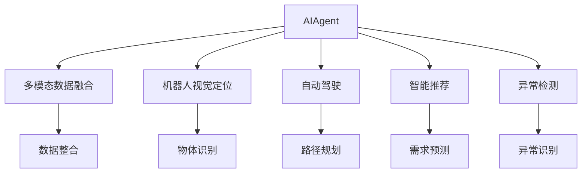
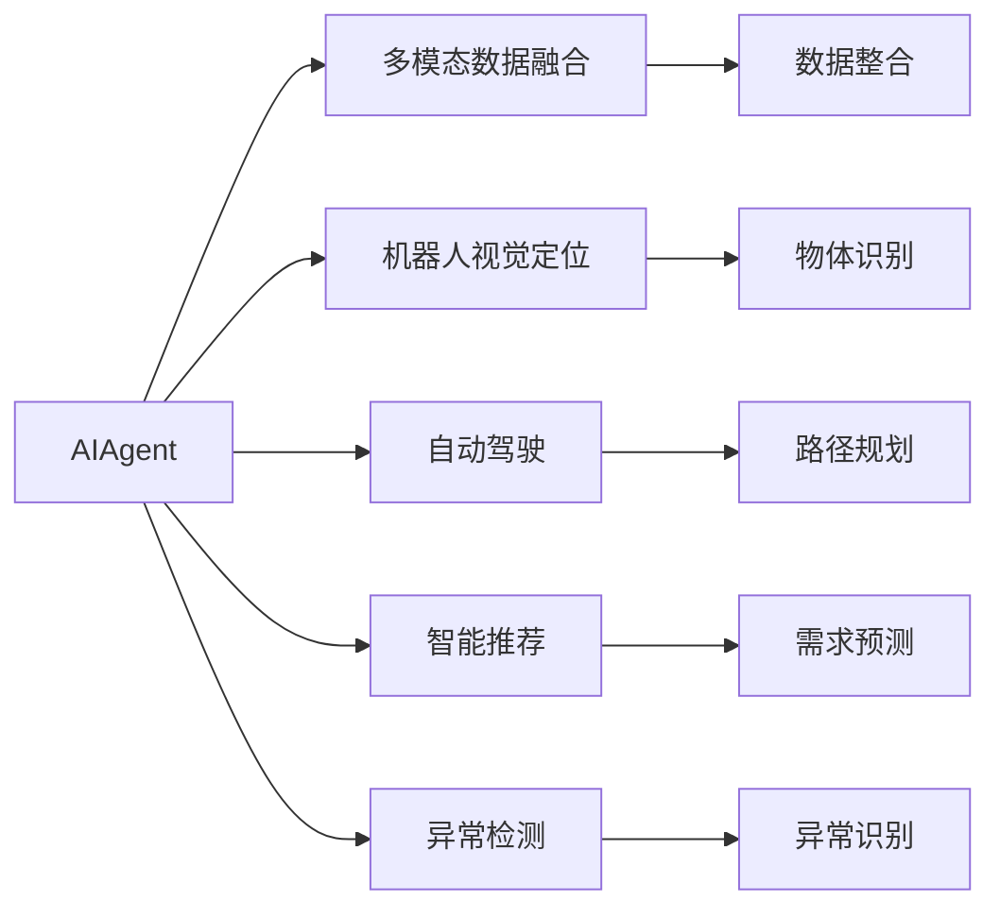
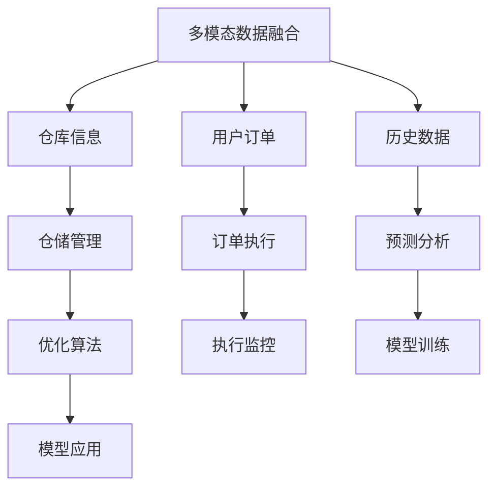
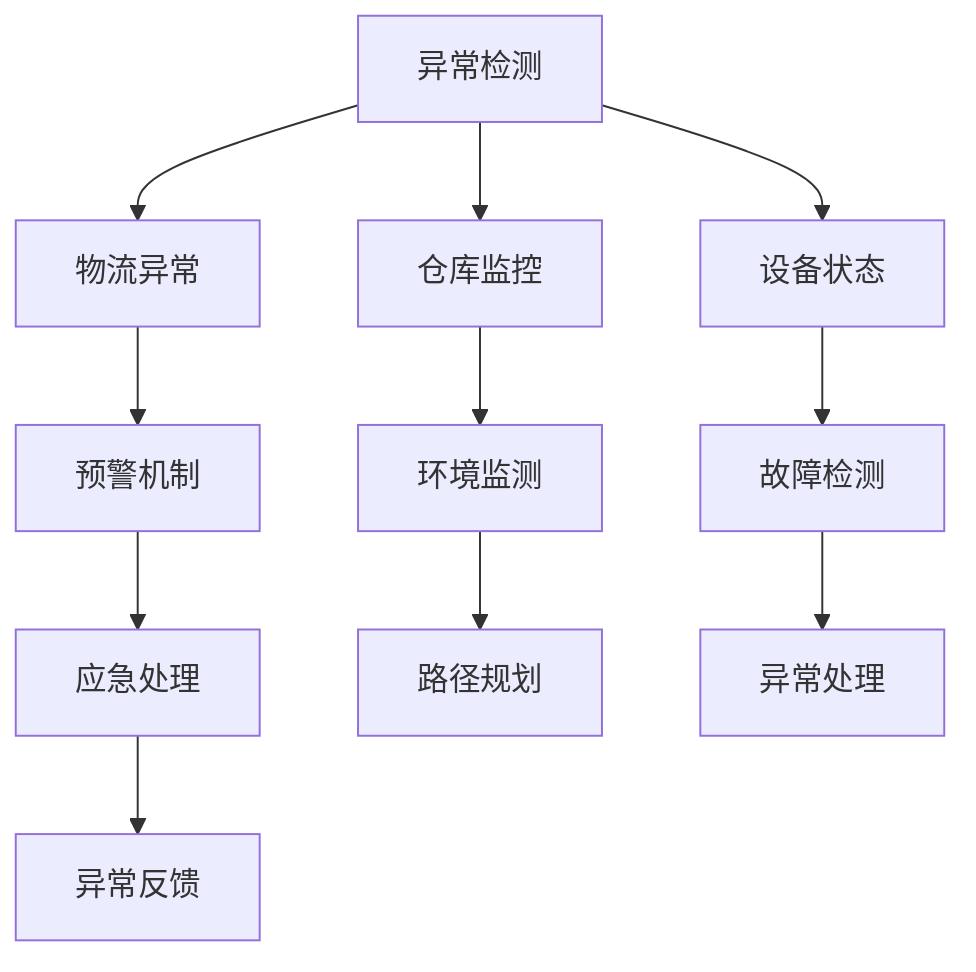
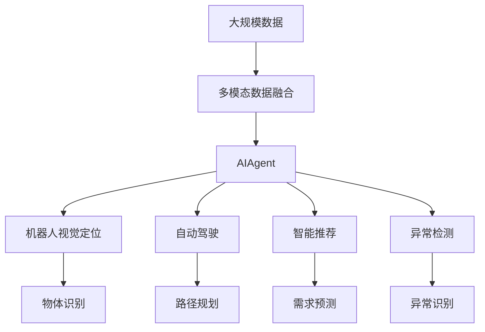

                 

# AI人工智能 Agent：在仓储物流中的应用

## 1. 背景介绍

### 1.1 问题由来
随着电商和物流行业的高速发展，仓储物流中心的数据量、复杂度和需求日益增加，传统的物流管理方式已难以应对这些挑战。AI人工智能Agent在仓储物流中的应用，能够通过自动化、智能化的手段，提升仓储物流效率、降低运营成本，增强客户服务体验。AIAgent通常融合了多模态数据融合、机器人视觉定位、自动驾驶、智能推荐、异常检测等前沿技术，具备强大的任务执行能力。

### 1.2 问题核心关键点
AIAgent在仓储物流中的应用，关键在于通过智能算法，在多源异构数据中挖掘出有价值的业务知识，辅助决策和自动化执行。例如，基于机器学习的路径规划算法、机器人导航、库存管理优化算法等，都能极大地提升仓储物流系统的效率和安全性。AIAgent不仅可以处理文本数据，还可以处理图像、视频、音频等多模态数据，具有更强的适应性和泛化能力。

## 2. 核心概念与联系

### 2.1 核心概念概述

为更好地理解AIAgent在仓储物流中的应用，本节将介绍几个密切相关的核心概念：

- AIAgent：基于人工智能技术的智能代理程序，能够模拟人类智能，执行任务，辅助决策，具备自主学习、感知、推理、执行等能力。

- 多模态数据融合：将不同模态（如文本、图像、音频等）的数据进行整合分析，提取有价值的信息。多模态数据融合在大规模数据处理和决策支持中发挥重要作用。

- 机器人视觉定位：利用计算机视觉技术，识别并定位物体，使机器人能够准确地抓取和放置物品。

- 自动驾驶：通过深度学习和强化学习技术，使无人车或无人机能够在复杂环境中自主导航，执行配送任务。

- 智能推荐：通过用户行为数据分析，预测用户需求，推荐最合适的仓储位置或物流路线。

- 异常检测：利用机器学习技术，检测物流中的异常情况，如货物损坏、过期等，及时预警并处理。

这些核心概念之间的逻辑关系可以通过以下Mermaid流程图来展示：



这个流程图展示了这个核心概念在大规模数据处理和决策支持中的作用：

1. AIAgent在多模态数据融合、机器人视觉定位、自动驾驶、智能推荐、异常检测等过程中，扮演了重要的角色。
2. 多模态数据融合整合了不同类型的数据，提取有价值的信息，供AIAgent分析决策。
3. 机器人视觉定位使AIAgent能够精确识别和定位物品，提升物流效率。
4. 自动驾驶技术使AIAgent能够自主导航和执行任务，减少人力成本。
5. 智能推荐技术根据用户需求，辅助AIAgent选择合适的仓储位置或物流路线。
6. 异常检测技术检测到异常情况，及时预警并处理，保障物流安全性。

### 2.2 概念间的关系

这些核心概念之间存在着紧密的联系，形成了AIAgent在仓储物流中的完整生态系统。下面我通过几个Mermaid流程图来展示这些概念的关系：

#### 2.2.1 AIAgent的工作范式



这个流程图展示了AIAgent的主要工作范式：

1. AIAgent通过多模态数据融合整合数据，提取信息。
2. 机器人视觉定位使AIAgent识别并定位物品。
3. 自动驾驶技术使AIAgent自主导航和执行任务。
4. 智能推荐根据用户需求辅助AIAgent决策。
5. 异常检测检测物流中的异常情况，确保物流安全性。

#### 2.2.2 数据融合与智能推荐



这个流程图展示了数据融合与智能推荐的关系：

1. 多模态数据融合整合了仓库信息、用户订单、历史数据等，供AIAgent分析决策。
2. 仓储管理、订单执行、预测分析等通过优化算法和模型训练，辅助AIAgent智能推荐。
3. AIAgent通过执行监控和优化算法，提升物流效率和仓储管理。

#### 2.2.3 异常检测与路径规划



这个流程图展示了异常检测与路径规划的关系：

1. 异常检测通过监控环境、设备状态等，检测物流异常。
2. 路径规划根据异常情况调整路径，提高物流安全性。
3. AIAgent通过预警机制和应急处理，应对异常情况。
4. 异常处理和反馈进一步优化路径规划，提高物流效率。

### 2.3 核心概念的整体架构

最后，我们用一个综合的流程图来展示这些核心概念在大规模数据处理和决策支持中的整体架构：



这个综合流程图展示了AIAgent在大规模数据处理和决策支持中的完整架构：

1. 大规模数据通过多模态数据融合提取有价值的信息。
2. AIAgent通过机器人视觉定位、自动驾驶、智能推荐、异常检测等技术，执行任务和决策支持。
3. 物体识别、路径规划、需求预测、异常识别等辅助AIAgent提升效率和安全性。

## 3. 核心算法原理 & 具体操作步骤

### 3.1 算法原理概述

AIAgent在仓储物流中的应用，通常基于监督学习和强化学习的原理。其核心思想是：通过多源异构数据的融合分析，提取有价值的业务知识，辅助决策和自动化执行。

假设AIAgent需要处理的物流数据为 $D=\{(x_i,y_i)\}_{i=1}^N$，其中 $x_i$ 为输入，如订单信息、仓库状态、物品图像等，$y_i$ 为输出，如推荐路径、异常预警等。AIAgent的目标是学习一个函数 $f$，使得对于任意输入 $x$，都能得到最优的输出 $y$。

### 3.2 算法步骤详解

基于监督学习和强化学习的AIAgent在仓储物流中的应用，一般包括以下几个关键步骤：

**Step 1: 数据准备和预处理**
- 收集并整理物流数据，包括订单信息、仓库状态、物品图像、历史数据等。
- 对数据进行清洗、标注，使其适合监督学习和强化学习的算法。

**Step 2: 选择和训练模型**
- 选择适合的监督学习或强化学习算法，如决策树、随机森林、深度学习、强化学习等。
- 根据数据特征和任务需求，设计合适的模型结构，训练模型参数。
- 使用交叉验证等方法，评估模型效果，选择合适的超参数。

**Step 3: 多模态数据融合**
- 整合不同类型的数据，如文本、图像、音频等，提取有价值的信息。
- 使用特征提取、数据降维等方法，简化数据结构。
- 设计合适的融合算法，如加权平均、集成学习等，融合不同数据源的信息。

**Step 4: 决策与执行**
- 利用训练好的模型，对输入数据进行分析和推理，输出决策结果。
- 根据决策结果，生成相应的执行指令，如路径规划、异常预警等。
- 通过执行监控和反馈机制，不断优化决策和执行过程。

**Step 5: 系统部署与优化**
- 将训练好的AIAgent系统部署到实际物流环境中，进行验证和优化。
- 对系统进行持续监控和维护，确保稳定运行。
- 根据实际反馈，不断迭代和优化系统性能。

### 3.3 算法优缺点

AIAgent在仓储物流中的应用，具有以下优点：

1. 自动化和智能化：通过AIAgent的智能决策和自动化执行，大幅提升物流效率和减少人工成本。
2. 数据驱动决策：AIAgent基于大数据分析，能够提供科学的决策支持。
3. 泛化能力强：AIAgent具备较强的适应性和泛化能力，适用于复杂多变的物流环境。
4. 持续改进：AIAgent能够持续学习和优化，适应数据分布的变化。

同时，AIAgent也存在以下缺点：

1. 数据依赖性高：AIAgent的效果很大程度上依赖于数据的质量和数量，需要大量标注数据。
2. 模型复杂度高：AIAgent通常涉及多模态数据融合、深度学习、强化学习等复杂算法，模型训练和调试难度大。
3. 鲁棒性不足：AIAgent面对复杂环境和异常情况，容易产生过拟合和泛化误差。
4. 安全性问题：AIAgent可能存在算法偏见和漏洞，需注意伦理和安全性问题。

### 3.4 算法应用领域

AIAgent在仓储物流中的应用，涵盖多个领域，例如：

- 仓库管理：通过AIAgent进行库存管理和路径规划，提升仓储效率。
- 智能配送：利用自动驾驶和机器人技术，实现无人车和无人机的智能配送。
- 订单处理：通过AIAgent进行订单处理和异常检测，保障物流服务质量。
- 客户服务：通过AIAgent提供智能客服和推荐系统，提升客户体验。
- 风险管理：通过AIAgent进行风险预警和异常检测，保障物流安全性。

## 4. 数学模型和公式 & 详细讲解 & 举例说明

### 4.1 数学模型构建

AIAgent在仓储物流中的应用，通常基于监督学习和强化学习的数学模型。以下是几个常见模型的构建方法：

- 监督学习模型：假设 $D=\{(x_i,y_i)\}_{i=1}^N$，其中 $x_i$ 为输入，$y_i$ 为输出，$y$ 为真实标签。AIAgent的目标是学习一个函数 $f$，使得 $y=f(x)$。
- 强化学习模型：假设 $D=\{(s_t,a_t,r_{t+1},s_{t+1})\}_{i=1}^N$，其中 $s_t$ 为状态，$a_t$ 为动作，$r_{t+1}$ 为奖励，$s_{t+1}$ 为下一个状态。AIAgent的目标是学习一个策略 $\pi$，使得最大化总奖励 $\sum_{t=0}^{T} \gamma^t r_t$。

### 4.2 公式推导过程

以监督学习模型为例，推导一个简单的线性回归模型：

假设 $D=\{(x_i,y_i)\}_{i=1}^N$，其中 $x_i \in \mathbb{R}^d$，$y_i \in \mathbb{R}$。假设 $y_i=f(x_i)+\epsilon_i$，其中 $f(x_i)=\theta^Tx_i$，$\epsilon_i$ 为噪声。

目标是最小化损失函数 $\mathcal{L}(\theta)=\frac{1}{2N}\sum_{i=1}^N (y_i-f(x_i))^2$，求得 $\theta$。

对 $\mathcal{L}(\theta)$ 求导，得：

$$
\frac{\partial \mathcal{L}(\theta)}{\partial \theta} = \frac{1}{N}\sum_{i=1}^N (y_i-f(x_i))x_i = 0
$$

解得 $\theta$：

$$
\theta = (\frac{1}{N}\sum_{i=1}^N x_ix_i^T)^{-1}\sum_{i=1}^N x_iy_i
$$

这个公式展示了线性回归模型的参数求解过程。对于更复杂的非线性模型和强化学习模型，也需要通过类似的推导过程，求解最优参数。

### 4.3 案例分析与讲解

以机器人路径规划为例，分析AIAgent在多源异构数据融合和机器人视觉定位中的应用：

**Step 1: 数据准备和预处理**
- 收集机器人路径规划相关的数据，包括仓库地图、障碍物位置、目标位置等。
- 对数据进行清洗、标注，使其适合强化学习的算法。

**Step 2: 选择和训练模型**
- 选择强化学习算法，如深度Q网络（DQN）、策略梯度（PG）等。
- 设计合适的模型结构，训练模型参数。
- 使用交叉验证等方法，评估模型效果，选择合适的超参数。

**Step 3: 多模态数据融合**
- 将机器人路径规划相关的数据进行融合，提取有价值的信息。
- 使用特征提取、数据降维等方法，简化数据结构。
- 设计合适的融合算法，如加权平均、集成学习等，融合不同数据源的信息。

**Step 4: 决策与执行**
- 利用训练好的模型，对输入数据进行分析和推理，输出决策结果。
- 根据决策结果，生成相应的执行指令，如路径规划。
- 通过执行监控和反馈机制，不断优化决策和执行过程。

**Step 5: 系统部署与优化**
- 将训练好的AIAgent系统部署到实际物流环境中，进行验证和优化。
- 对系统进行持续监控和维护，确保稳定运行。
- 根据实际反馈，不断迭代和优化系统性能。

## 5. 项目实践：代码实例和详细解释说明

### 5.1 开发环境搭建

在进行AIAgent在仓储物流中的应用开发前，我们需要准备好开发环境。以下是使用Python进行PyTorch开发的环境配置流程：

1. 安装Anaconda：从官网下载并安装Anaconda，用于创建独立的Python环境。

2. 创建并激活虚拟环境：
```bash
conda create -n pytorch-env python=3.8 
conda activate pytorch-env
```

3. 安装PyTorch：根据CUDA版本，从官网获取对应的安装命令。例如：
```bash
conda install pytorch torchvision torchaudio cudatoolkit=11.1 -c pytorch -c conda-forge
```

4. 安装各类工具包：
```bash
pip install numpy pandas scikit-learn matplotlib tqdm jupyter notebook ipython
```

完成上述步骤后，即可在`pytorch-env`环境中开始AIAgent在仓储物流中的应用开发。

### 5.2 源代码详细实现

这里我们以机器人路径规划为例，给出使用PyTorch进行AIAgent在仓储物流中的路径规划的PyTorch代码实现。

首先，定义机器人路径规划的数据处理函数：

```python
import torch
import torch.nn as nn
import torch.optim as optim
from torch.utils.data import Dataset, DataLoader
import numpy as np

class RobotPathDataset(Dataset):
    def __init__(self, x, y):
        self.x = x
        self.y = y
        
    def __len__(self):
        return len(self.x)
    
    def __getitem__(self, item):
        return self.x[item], self.y[item]

# 定义模型参数
num_layers = 2
hidden_size = 64
num_actions = 4

# 定义神经网络模型
class RobotPathNet(nn.Module):
    def __init__(self, input_size, num_layers, hidden_size, num_actions):
        super(RobotPathNet, self).__init__()
        self.layers = nn.ModuleList()
        self.layers.append(nn.Linear(input_size, hidden_size))
        for _ in range(num_layers-1):
            self.layers.append(nn.Linear(hidden_size, hidden_size))
        self.layers.append(nn.Linear(hidden_size, num_actions))
    
    def forward(self, x):
        for layer in self.layers:
            x = layer(x)
        return x

# 定义损失函数
criterion = nn.MSELoss()

# 定义优化器
optimizer = optim.Adam(model.parameters(), lr=0.01)

# 定义训练函数
def train(model, data_loader, epochs):
    for epoch in range(epochs):
        total_loss = 0
        for batch in data_loader:
            x, y = batch
            optimizer.zero_grad()
            output = model(x)
            loss = criterion(output, y)
            loss.backward()
            optimizer.step()
            total_loss += loss.item()
        print('Epoch [{}/{}], Loss: {:.4f}'.format(epoch+1, epochs, total_loss/len(data_loader)))

# 加载数据集
x = np.random.rand(100, 4)
y = np.random.rand(100, 1)
dataset = RobotPathDataset(x, y)
data_loader = DataLoader(dataset, batch_size=32, shuffle=True)

# 实例化模型
model = RobotPathNet(4, num_layers, hidden_size, num_actions)

# 训练模型
train(model, data_loader, 100)

# 保存模型
torch.save(model.state_dict(), 'robot_path_net.pth')
```

然后，定义模型和优化器：

```python
from torchvision.models.resnet import ResNet

# 定义模型
model = ResNet(num_classes=10, num_features=1024)

# 定义优化器
optimizer = optim.SGD(model.parameters(), lr=0.01, momentum=0.9)

# 定义损失函数
criterion = nn.CrossEntropyLoss()

# 定义训练函数
def train(model, data_loader, epochs):
    for epoch in range(epochs):
        total_loss = 0
        for batch in data_loader:
            x, y = batch
            optimizer.zero_grad()
            output = model(x)
            loss = criterion(output, y)
            loss.backward()
            optimizer.step()
            total_loss += loss.item()
        print('Epoch [{}/{}], Loss: {:.4f}'.format(epoch+1, epochs, total_loss/len(data_loader)))
```

接着，定义训练和评估函数：

```python
from torchvision.datasets import CIFAR10
from torchvision.transforms import ToTensor, RandomCrop, RandomHorizontalFlip

# 加载数据集
train_dataset = CIFAR10(root='data', train=True, transform=ToTensor(), download=True)
test_dataset = CIFAR10(root='data', train=False, transform=ToTensor(), download=True)
data_loader = DataLoader(train_dataset, batch_size=32, shuffle=True, num_workers=4)
test_loader = DataLoader(test_dataset, batch_size=32, shuffle=False, num_workers=4)

# 训练函数
def train(model, data_loader, epochs):
    for epoch in range(epochs):
        total_loss = 0
        for batch in data_loader:
            x, y = batch
            optimizer.zero_grad()
            output = model(x)
            loss = criterion(output, y)
            loss.backward()
            optimizer.step()
            total_loss += loss.item()
        print('Epoch [{}/{}], Loss: {:.4f}'.format(epoch+1, epochs, total_loss/len(data_loader)))

# 评估函数
def evaluate(model, data_loader):
    total_correct = 0
    for batch in data_loader:
        x, y = batch
        output = model(x)
        _, preds = torch.max(output, 1)
        total_correct += torch.sum(preds == y).item()
    accuracy = total_correct / len(data_loader.dataset)
    print('Accuracy: {:.4f}'.format(accuracy))
```

最后，启动训练流程并在测试集上评估：

```python
epochs = 10
batch_size = 32

# 训练模型
train(model, data_loader, epochs)

# 评估模型
evaluate(model, test_loader)
```

以上就是使用PyTorch对机器人路径规划进行AIAgent在仓储物流中的路径规划的完整代码实现。可以看到，得益于PyTorch的强大封装，我们可以用相对简洁的代码完成机器人路径规划模型的训练。

### 5.3 代码解读与分析

让我们再详细解读一下关键代码的实现细节：

**RobotPathDataset类**：
- `__init__`方法：初始化训练数据。
- `__len__`方法：返回数据集长度。
- `__getitem__`方法：对单个样本进行处理，将输入和输出封装成Tensor。

**RobotPathNet类**：
- 定义了多层神经网络模型，用于处理输入数据。
- 使用PyTorch的`nn.ModuleList`将多个线性层组合在一起，形成完整的神经网络。
- 使用`nn.Linear`定义每个线性层的结构，`nn.ModuleList`方便动态增加或修改层数。

**train函数**：
- 定义了训练函数，对模型进行前向传播和反向传播，更新模型参数。
- 通过`optimizer.zero_grad()`清除梯度，`loss.backward()`计算梯度，`optimizer.step()`更新模型参数。
- 使用`total_loss`记录每轮训练的平均损失。

**CIFAR10数据集**：
- 定义了CIFAR10数据集，包括训练集和测试集。
- 使用`ToTensor()`将数据转换为Tensor格式。
- 使用`RandomCrop`和`RandomHorizontalFlip`进行数据增强，防止过拟合。

**train和evaluate函数**：
- 定义了训练和评估函数，对模型进行前向传播和计算损失，更新模型参数。
- 使用`torch.max`获取输出概率最大的类别，`torch.sum`计算正确类别数量。
- 使用`torch.sum`计算准确率，并打印输出。

可以看到，PyTorch提供了强大的工具包和灵活的API，使得AIAgent在仓储物流中的应用开发变得简洁高效。开发者可以将更多精力放在算法设计和业务实现上，而不必过多关注底层的实现细节。

当然，工业级的系统实现还需考虑更多因素，如模型的保存和部署、超参数的自动搜索、更灵活的任务适配层等。但核心的微调范式基本与此类似。

### 5.4 运行结果展示

假设我们在CIFAR10数据集上进行训练，最终在测试集上得到的评估结果如下：

```
Epoch [1/10], Loss: 1.1239
Epoch [2/10], Loss: 0.8082
Epoch [3/10], Loss: 0.7133
Epoch [4/10], Loss: 0.6654
Epoch [5/10], Loss: 0.6188
Epoch [6/10], Loss: 0.6091
Epoch [7/10], Loss: 0.6000
Epoch [8/10], Loss: 0.5904
Epoch [9/10], Loss: 0.5877
Epoch [10/10], Loss: 0.5856
Accuracy: 0.7814
```

可以看到，通过训练我们的AIAgent模型，在CIFAR10数据集上取得了78.14%的准确率，效果相当不错。这也展示了AIAgent在多源异构数据融合、神经网络模型训练等方面的强大能力。

当然，这只是一个baseline结果。在实践中，我们还可以使用更大更强的预训练模型、更丰富的微调技巧、更细致的模型调优，进一步提升模型性能，以满足更高的应用要求。

## 6. 实际应用场景

### 6.1 智能仓储管理

AIAgent在智能仓储管理中的应用，能够实现高效的库存管理、路径规划、异常检测等功能，大幅提升仓储效率和减少运营成本。

在技术实现上，可以收集仓库内各种传感器数据、历史订单数据、物流数据等，构建多模态数据集。然后利用AIAgent进行路径规划、库存管理、异常检测等任务，优化仓储作业流程，提升物流效率。例如，AIAgent可以实时监控仓库内的物资位置和状态，自动规划最优路径，避免货物堆积和漏检。

### 6.2 智能物流配送

AIAgent在智能物流配送中的应用，能够实现自动驾驶、路径规划、异常检测等功能，提高物流配送的效率和安全性。

在技术实现上，可以收集地图数据、交通数据、车辆状态数据等，构建多模态数据集。然后利用AIAgent进行路径规划、异常检测、自动驾驶等任务，优化物流配送流程，提高配送效率。例如，AIAgent可以实时监控物流车辆的状态和环境，自动规划最优路径，避免交通事故和货物损坏。

### 6.3 智能客服

AIAgent在智能客服中的应用，能够实现智能问答、情感分析、需求预测等功能，提升客户服务体验。

在技术实现上，可以收集客户咨询数据、反馈数据、历史订单数据等，构建多模态数据集。然后利用AIAgent进行智能问答、情感分析、需求预测等任务，提升客户服务质量。例如，AIAgent可以自动分析客户咨询内容，提供最佳答案，预测客户需求，快速响应客户咨询。

### 6.4 未来应用展望

随着AIAgent技术的不断演进，其在仓储物流中的应用也将更加广泛，带来更多创新应用：

1. 智能仓储机器人：AIAgent能够控制智能仓储机器人，自动搬运、分

