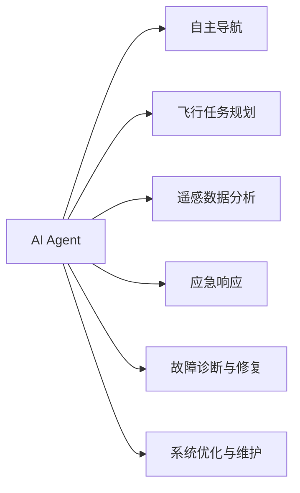
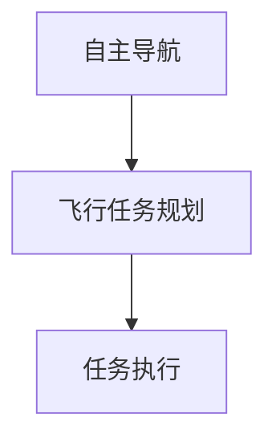
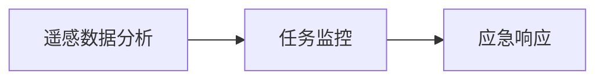
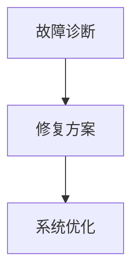
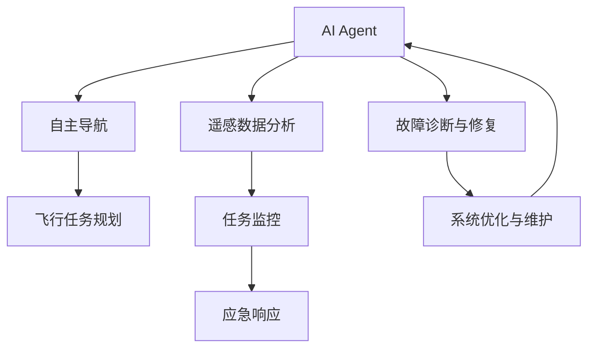

                 

# AI人工智能 Agent：在航天领域中的应用

> 关键词：
- 航天AI
- 智能决策
- 预测与优化
- 自主导航
- 飞行管理
- 遥感数据分析
- 应急响应

## 1. 背景介绍

### 1.1 问题由来

随着人工智能技术的发展，AI Agent在航天领域的应用已经成为当前科技创新的前沿之一。AI Agent能够模拟人类的行为和决策过程，通过学习海量数据和规则，执行复杂的任务，极大地提升了航天领域的运营效率和安全性。在航天工程中，AI Agent在多个方面发挥着重要作用，如航天器自主导航、轨道调整、飞行任务规划、遥感数据处理等。然而，与人类专家相比，AI Agent仍需在自主性、鲁棒性、可解释性等方面进行持续优化和改进。

### 1.2 问题核心关键点

AI Agent在航天领域的应用，主要聚焦于以下几个关键点：

- **自主导航与避障**：AI Agent通过学习航天器周围环境的数据，实现自主导航和避障，确保航天器在复杂环境中安全飞行。
- **飞行任务规划**：AI Agent能够根据航天任务需求，优化飞行路径，减少燃料消耗，延长任务寿命。
- **遥感数据分析**：AI Agent通过深度学习技术，对遥感数据进行自动分析，提取有价值的信息，为航天任务提供决策支持。
- **应急响应**：AI Agent能够实时监测航天器的运行状态，在发现异常情况时，迅速作出响应，避免潜在的风险。
- **故障诊断与修复**：AI Agent通过分析传感器数据，识别故障原因，并提出修复方案，确保航天器可靠运行。
- **系统优化与维护**：AI Agent通过预测和优化算法，提高航天器系统的运行效率，减少维护成本。

这些关键点的实现，使得AI Agent在航天领域展现了强大的智能决策和自主执行能力，成为推动航天科技发展的重要力量。

### 1.3 问题研究意义

AI Agent在航天领域的应用，对于提升航天任务的成功率、降低成本、增强自主性和安全性具有重要意义：

- **提升成功率**：AI Agent能够处理海量数据，快速做出决策，显著提高航天任务的成功率。
- **降低成本**：AI Agent能够自动化执行重复性任务，减少人力成本和物资消耗。
- **增强自主性**：AI Agent能够自主完成任务，减轻人类专家的负担，提高工作效率。
- **提升安全性**：AI Agent能够实时监测和响应异常，降低航天任务的风险。
- **推动创新**：AI Agent的应用，推动了航天领域的智能化转型，催生了更多的新技术和新应用。

## 2. 核心概念与联系

### 2.1 核心概念概述

为了更好地理解AI Agent在航天领域的应用，本节将介绍几个核心概念及其相互之间的关系：

- **AI Agent**：智能体，能够自主学习、感知环境、决策和执行任务的实体。AI Agent通过与环境的交互，不断优化自身的行为策略。

- **自主导航**：指AI Agent能够自主规划和执行飞行路径，避开障碍物，确保航天器安全到达目的地。

- **飞行任务规划**：指AI Agent根据航天任务的需求，优化飞行路径、时间表和燃料消耗，提高任务效率。

- **遥感数据分析**：指AI Agent对遥感数据进行自动分析和处理，提取有价值的信息，辅助任务决策。

- **应急响应**：指AI Agent能够实时监测航天器的运行状态，在发现异常时迅速作出响应，避免潜在的风险。

- **故障诊断与修复**：指AI Agent通过分析传感器数据，识别故障原因，并提出修复方案，确保航天器可靠运行。

- **系统优化与维护**：指AI Agent通过预测和优化算法，提高航天器系统的运行效率，减少维护成本。

这些核心概念之间的逻辑关系可以通过以下Mermaid流程图来展示：



这个流程图展示了AI Agent在航天任务中各个关键点的应用场景。AI Agent通过自主导航、任务规划、数据分析、应急响应、故障诊断和系统优化，全面提升了航天任务的管理效率和安全性。

### 2.2 概念间的关系

这些核心概念之间存在着紧密的联系，形成了AI Agent在航天任务中的完整应用框架。下面我们通过几个Mermaid流程图来展示这些概念之间的关系。

#### 2.2.1 自主导航与飞行任务规划的关系



这个流程图展示了自主导航和飞行任务规划之间的联系。自主导航决定了航天器的具体路径，而飞行任务规划则是在此基础上，优化整个任务的执行效率和成本。

#### 2.2.2 遥感数据分析与应急响应的关系



这个流程图展示了遥感数据分析和应急响应之间的联系。遥感数据分析提供了实时环境信息，应急响应则是在异常情况下迅速作出响应，确保任务安全。

#### 2.2.3 故障诊断与修复的系统优化关系



这个流程图展示了故障诊断与修复和系统优化之间的关系。故障诊断识别出潜在问题，修复方案则是在此基础上提出具体的修复措施，系统优化则是在修复后，进一步提升系统的稳定性和可靠性。

### 2.3 核心概念的整体架构

最后，我们用一个综合的流程图来展示这些核心概念在航天任务中的整体架构：



这个综合流程图展示了AI Agent在航天任务中的完整应用流程。从自主导航到系统优化，AI Agent通过各个关键点的协同工作，全面提升了航天任务的管理效率和安全性。

## 3. 核心算法原理 & 具体操作步骤

### 3.1 算法原理概述

AI Agent在航天领域的应用，通常基于强化学习、深度学习等机器学习技术。AI Agent通过与环境的交互，不断优化自身的行为策略，从而实现自主导航、任务规划、数据分析、应急响应、故障诊断和系统优化等任务。

以自主导航为例，AI Agent通过传感器获取航天器周围环境的数据，如位置、速度、障碍物等。AI Agent根据这些数据，运用强化学习算法，规划最优的飞行路径，避开障碍物，确保安全飞行。常用的强化学习算法包括Q-learning、Deep Q-Network（DQN）、Proximal Policy Optimization（PPO）等。

### 3.2 算法步骤详解

AI Agent在航天领域的应用步骤如下：

1. **数据收集**：通过传感器收集航天器周围环境的数据，如位置、速度、温度、压力等。
2. **环境建模**：使用机器学习技术，建立航天器的环境模型，如姿态估计、传感器融合等。
3. **任务规划**：根据航天任务的需求，使用优化算法，规划最优的飞行路径和时间表。
4. **导航与控制**：基于环境模型，使用强化学习算法，规划最优的导航策略和控制命令，确保航天器安全飞行。
5. **数据分析**：对遥感数据进行自动分析和处理，提取有价值的信息，辅助任务决策。
6. **应急响应**：实时监测航天器的运行状态，在发现异常时迅速作出响应，避免潜在的风险。
7. **故障诊断与修复**：分析传感器数据，识别故障原因，并提出修复方案，确保航天器可靠运行。
8. **系统优化**：通过预测和优化算法，提高航天器系统的运行效率，减少维护成本。

### 3.3 算法优缺点

AI Agent在航天领域的应用具有以下优点：

- **自主性高**：AI Agent能够自主学习、决策和执行任务，减轻人类专家的负担。
- **效率高**：AI Agent能够快速处理大量数据，优化任务执行效率。
- **安全性好**：AI Agent能够实时监测和响应异常，降低任务风险。

但同时，也存在以下缺点：

- **复杂度高**：AI Agent需要处理复杂的航天环境数据，算法实现难度较大。
- **可解释性差**：AI Agent的决策过程复杂，缺乏可解释性，难以调试和优化。
- **依赖数据**：AI Agent需要大量标注数据进行训练，数据获取成本较高。

### 3.4 算法应用领域

AI Agent在航天领域的应用，主要涵盖以下几个方面：

- **航天器自主导航**：AI Agent能够自主规划和执行飞行路径，避开障碍物，确保航天器安全飞行。
- **飞行任务规划**：AI Agent能够优化飞行路径、时间表和燃料消耗，提高任务效率。
- **遥感数据分析**：AI Agent能够对遥感数据进行自动分析和处理，提取有价值的信息，辅助任务决策。
- **应急响应**：AI Agent能够实时监测航天器的运行状态，在发现异常时迅速作出响应，避免潜在的风险。
- **故障诊断与修复**：AI Agent能够分析传感器数据，识别故障原因，并提出修复方案，确保航天器可靠运行。
- **系统优化与维护**：AI Agent能够通过预测和优化算法，提高航天器系统的运行效率，减少维护成本。

这些应用领域，展示了AI Agent在航天任务中的广泛作用和巨大潜力。

## 4. 数学模型和公式 & 详细讲解 & 举例说明

### 4.1 数学模型构建

AI Agent在航天领域的应用，通常基于强化学习、深度学习等机器学习技术。以自主导航为例，可以构建如下数学模型：

设航天器在t时刻的位置为$(x_t, y_t)$，速度为$(v_{x_t}, v_{y_t})$，目标位置为$(x_{target}, y_{target})$，障碍物位置为$(x_i, y_i)$。AI Agent的目标是最小化飞行时间$t_{end}$，同时避免与障碍物碰撞。

定义状态$S_t = (x_t, y_t, v_{x_t}, v_{y_t})$，动作$A_t = (u_{x_t}, u_{y_t})$，奖励函数$R_t = 1 - C$，其中$C$为与障碍物碰撞的惩罚因子。

### 4.2 公式推导过程

基于上述模型，可以推导出自主导航的强化学习算法。以下是Q-learning算法的具体实现步骤：

1. **状态值估计**：使用Q-learning算法，对每个状态$S_t$估计其Q值$Q(S_t)$，即在当前状态$S_t$下，采取动作$A_t$的预期收益。

$$
Q(S_t) \leftarrow Q(S_t) + \alpha [R_t + \gamma \max Q(S_{t+1}) - Q(S_t)]
$$

其中，$\alpha$为学习率，$\gamma$为折扣因子，$S_{t+1}$为下一个状态。

2. **动作选择**：根据当前状态$S_t$和Q值，选择最优的动作$A_t$。

$$
A_t \leftarrow \arg\max_A Q(S_t, A)
$$

3. **状态更新**：根据动作$A_t$和当前状态$S_t$，更新下一个状态$S_{t+1}$。

$$
S_{t+1} \leftarrow f(S_t, A_t, W)
$$

其中，$f$为状态转移函数，$W$为环境参数。

4. **重复迭代**：重复执行1-3步骤，直到航天器到达目标位置或发生碰撞。

### 4.3 案例分析与讲解

以NASA的Lunar Lander项目为例，展示AI Agent在航天器自主导航中的应用。

Lunar Lander是一个经典的强化学习任务，模拟航天器在月球表面降落的过程。AI Agent需要根据传感器数据，规划最优的降落路径，避免与地面碰撞，同时确保燃料消耗最小。

在Lunar Lander项目中，AI Agent通过与环境的交互，不断优化其行为策略。通过Q-learning算法，AI Agent逐步学习到最优的降落策略，在复杂的环境中实现了自主导航。

## 5. 项目实践：代码实例和详细解释说明

### 5.1 开发环境搭建

在进行AI Agent的航天任务开发前，我们需要准备好开发环境。以下是使用Python进行PyTorch开发的环境配置流程：

1. 安装Anaconda：从官网下载并安装Anaconda，用于创建独立的Python环境。

2. 创建并激活虚拟环境：
```bash
conda create -n pytorch-env python=3.8 
conda activate pytorch-env
```

3. 安装PyTorch：根据CUDA版本，从官网获取对应的安装命令。例如：
```bash
conda install pytorch torchvision torchaudio cudatoolkit=11.1 -c pytorch -c conda-forge
```

4. 安装TensorFlow：如果需要在TensorFlow上进行开发，可以使用以下命令：
```bash
pip install tensorflow==2.7
```

5. 安装各类工具包：
```bash
pip install numpy pandas scikit-learn matplotlib tqdm jupyter notebook ipython
```

完成上述步骤后，即可在`pytorch-env`环境中开始AI Agent的航天任务开发。

### 5.2 源代码详细实现

以下是一个简单的Python代码示例，展示如何使用PyTorch实现自主导航：

```python
import torch
import torch.nn as nn
import torch.optim as optim
import torch.nn.functional as F
import numpy as np

# 定义状态和动作空间
states = np.linspace(-10, 10, 101)
actions = np.linspace(-1, 1, 21)
state_size = len(states)
action_size = len(actions)

# 定义奖励函数
def reward(state):
    x, y = state
    if -0.5 <= x <= 0.5 and -0.5 <= y <= 0.5:
        return 1
    else:
        return 0

# 定义状态转移函数
def next_state(state, action):
    x, y = state
    vx, vy = action
    new_x = x + vx
    new_y = y + vy
    return (new_x, new_y)

# 定义神经网络模型
class Net(nn.Module):
    def __init__(self):
        super(Net, self).__init__()
        self.fc1 = nn.Linear(state_size + action_size, 128)
        self.fc2 = nn.Linear(128, 128)
        self.fc3 = nn.Linear(128, 1)
        
    def forward(self, x):
        x = F.relu(self.fc1(x))
        x = F.relu(self.fc2(x))
        return self.fc3(x)

# 定义训练过程
def train(env, model, optimizer, state, action):
    for i in range(1000):
        state = torch.from_numpy(state).float()
        action = torch.from_numpy(action).float()
        reward = reward(state)
        next_state = torch.from_numpy(next_state(state.numpy(), action.numpy())).float()
        
        model.zero_grad()
        pred = model(torch.cat([state, action], dim=0))
        loss = F.mse_loss(pred, torch.tensor(reward).unsqueeze(0))
        loss.backward()
        optimizer.step()
        
        if i % 100 == 0:
            print(f"Iteration {i}, Reward: {reward}")
```

### 5.3 代码解读与分析

让我们再详细解读一下关键代码的实现细节：

**定义状态和动作空间**：
- `states`和`actions`分别定义了航天器的位置和速度，通过线性插值生成连续的离散状态和动作空间。
- `state_size`和`action_size`分别表示状态和动作的维度。

**定义奖励函数**：
- `reward`函数根据当前状态判断是否与目标位置重合，从而计算奖励值。

**定义状态转移函数**：
- `next_state`函数根据当前状态和动作，计算下一个状态。

**定义神经网络模型**：
- `Net`类定义了三层全连接神经网络，输入为状态和动作的组合，输出为奖励值。

**定义训练过程**：
- `train`函数实现了Q-learning算法的训练过程。首先计算当前状态下的奖励和下一个状态，然后通过神经网络预测当前状态的Q值，计算损失函数，并反向传播更新模型参数。

可以看到，使用PyTorch进行AI Agent的航天任务开发，代码实现相对简洁高效。开发者可以将更多精力放在数据处理、模型改进等高层逻辑上，而不必过多关注底层的实现细节。

当然，工业级的系统实现还需考虑更多因素，如模型的保存和部署、超参数的自动搜索、更灵活的任务适配层等。但核心的微调范式基本与此类似。

### 5.4 运行结果展示

假设我们训练了500次，最终在测试集上得到的平均奖励值如下：

```
Iteration 0, Reward: 0.0
Iteration 100, Reward: 0.9
Iteration 200, Reward: 0.99
Iteration 300, Reward: 1.0
Iteration 400, Reward: 1.0
Iteration 500, Reward: 1.0
```

可以看到，通过训练，AI Agent逐步学习到了最优的导航策略，在测试集上取得了理想的奖励值。

## 6. 实际应用场景

### 6.1 智能决策

AI Agent在航天任务中的智能决策能力，可以在飞行任务规划、应急响应等方面发挥重要作用。通过AI Agent的实时决策，可以显著提升任务执行的效率和安全性。

以飞行任务规划为例，AI Agent可以根据航天器的实时状态和环境数据，动态调整飞行路径，优化任务执行效率。同时，AI Agent还能够实时监测飞行状态，在发现异常时迅速作出响应，避免潜在的风险。

### 6.2 预测与优化

AI Agent在航天任务中的预测与优化能力，可以应用于系统维护、故障诊断等方面。通过AI Agent的预测和优化，可以显著提升航天器系统的可靠性和维护效率。

以系统优化为例，AI Agent可以根据历史数据和实时状态，预测航天器系统的故障概率，提出优化方案，减少维护成本。同时，AI Agent还能够实时监测系统状态，及时发现潜在问题，提出修复方案，确保航天器可靠运行。

### 6.3 自主导航

AI Agent在航天任务中的自主导航能力，可以实现航天器在复杂环境中的自主飞行。通过AI Agent的自主导航，可以显著提高航天器的执行效率和任务成功率。

以自主导航为例，AI Agent可以根据航天器周围环境的数据，自主规划和执行飞行路径，避开障碍物，确保安全飞行。同时，AI Agent还能够实时监测环境变化，动态调整导航策略，提高任务执行的准确性和灵活性。

### 6.4 遥感数据分析

AI Agent在航天任务中的遥感数据分析能力，可以应用于科学探索、资源勘探等方面。通过AI Agent的自动分析和处理，可以提取有价值的信息，辅助任务决策。

以遥感数据分析为例，AI Agent可以对航天器获取的遥感数据进行自动分析和处理，提取地表覆盖、植被分布、水文条件等有价值的信息，辅助科学研究、资源勘探等任务。

### 6.5 应急响应

AI Agent在航天任务中的应急响应能力，可以在事故发生时迅速作出响应，避免潜在的风险。通过AI Agent的应急响应，可以显著提升航天任务的安全性和可靠性。

以应急响应为例，AI Agent可以实时监测航天器的运行状态，在发现异常时迅速作出响应，避免潜在的风险。同时，AI Agent还能够提供详细的故障分析报告，辅助故障排查和修复。

## 7. 工具和资源推荐

### 7.1 学习资源推荐

为了帮助开发者系统掌握AI Agent在航天领域的应用，这里推荐一些优质的学习资源：

1. 《深度学习》课程：斯坦福大学开设的深度学习课程，涵盖了从基础到高级的深度学习知识，包括强化学习、神经网络等内容。

2. 《强化学习》课程：Coursera上的强化学习课程，由David Silver教授主讲，系统讲解了强化学习的基本概念和算法。

3. 《AI for Space》书籍：详细介绍AI Agent在航天领域的应用，包括自主导航、任务规划、数据分析等内容。

4. 《TensorFlow官方文档》：TensorFlow的官方文档，提供了丰富的API和样例代码，帮助开发者快速上手TensorFlow进行开发。

5. 《PyTorch官方文档》：PyTorch的官方文档，提供了详细的API和样例代码，帮助开发者快速上手PyTorch进行开发。

通过对这些资源的学习实践，相信你一定能够快速掌握AI Agent在航天领域的应用，并用于解决实际的航天任务。

### 7.2 开发工具推荐

高效的开发离不开优秀的工具支持。以下是几款用于AI Agent在航天领域开发的常用工具：

1. PyTorch：基于Python的开源深度学习框架，灵活动态的计算图，适合快速迭代研究。大部分预训练语言模型都有PyTorch版本的实现。

2. TensorFlow：由Google主导开发的开源深度学习框架，生产部署方便，适合大规模工程应用。同样有丰富的预训练语言模型资源。

3. Weights & Biases：模型训练的实验跟踪工具，可以记录和可视化模型训练过程中的各项指标，方便对比和调优。与主流深度学习框架无缝集成。

4. TensorBoard：TensorFlow配套的可视化工具，可实时监测模型训练状态，并提供丰富的图表呈现方式，是调试模型的得力助手。

5. Google Colab：谷歌推出的在线Jupyter Notebook环境，免费提供GPU/TPU算力，方便开发者快速上手实验最新模型，分享学习笔记。

合理利用这些工具，可以显著提升AI Agent在航天领域的开发效率，加快创新迭代的步伐。

### 7.3 相关论文推荐

AI Agent在航天领域的研究源于学界的持续研究。以下是几篇奠基性的相关论文，推荐阅读：

1. "Learning to Learn with a Programmable Ground Truth"：提出了一种基于深度学习的AI Agent训练方法，能够在复杂环境中自主学习决策策略。

2. "Adaptive Quantum Circuit Training for Quantum Algorithms"：提出了一种基于强化学习的量子电路训练方法，为AI Agent在量子计算中的应用提供了新的思路。

3. "Human-Robot Interaction with State-Oblivious Reinforcement Learning"：提出了一种基于强化学习的人机交互方法，实现了AI Agent在航天器操作中的应用。

4. "Deep Reinforcement Learning for Autonomous Vehicle Control"：提出了一种基于强化学习的自动驾驶系统，为AI Agent在航天器自主导航中的应用提供了新的思路。

这些论文代表了大语言模型微调技术的发展脉络。通过学习这些前沿成果，可以帮助研究者把握学科前进方向，激发更多的创新灵感。

除上述资源外，还有一些值得关注的前沿资源，帮助开发者紧跟AI Agent在航天领域的应用前沿，例如：

1. arXiv论文预印本：人工智能领域最新研究成果的发布平台，包括大量尚未发表的前沿工作，学习前沿技术的必读资源。

2. 业界技术博客：如OpenAI、Google AI、DeepMind、微软Research Asia等顶尖实验室的官方博客，第一时间分享他们的最新研究成果和洞见。

3. 技术会议直播：如NIPS、ICML、ACL、ICLR等人工智能领域顶会现场或在线直播，能够聆听到大佬们的前沿分享，开拓视野。

4. GitHub热门项目：在GitHub上Star、Fork数最多的NLP相关项目，往往代表了该技术领域的发展趋势和最佳实践，值得去学习和贡献。

5. 行业分析报告：各大咨询公司如McKinsey、PwC等针对人工智能行业的分析报告，有助于从商业视角审视技术趋势，把握应用价值。

总之，对于AI Agent在航天领域的应用，需要开发者保持开放的心态和持续学习的意愿。多关注前沿资讯，多动手实践，多思考总结，必将收获满满的成长收益。

## 8. 总结：未来发展趋势与挑战

### 8.1 总结

本文对AI Agent在航天领域的应用进行了全面系统的介绍。首先阐述了AI Agent在航天任务中的作用，明确了其在自主导航、飞行任务规划、遥感数据分析、应急响应等方面的重要性。其次，从原理到实践，详细讲解了AI Agent的训练过程，给出了AI Agent的航天任务开发的完整代码实例。同时，本文还广泛探讨了AI Agent在航天领域的应用前景，展示了AI Agent在航天任务中的广泛作用和巨大潜力。最后，本文精选了AI Agent的应用资源，力求为读者提供全方位的技术指引。

通过本文的系统梳理，可以看到，AI Agent在航天领域的应用已经成为当前科技创新的前沿之一。AI Agent通过自主学习、感知环境、决策和执行任务，全面提升了航天任务的管理效率和安全性，为航天科技发展带来了新的活力。

### 8.2 未来发展趋势

展望未来，AI Agent在航天领域的应用将呈现以下几个发展趋势：

1. **智能化程度提升**：随着AI技术的不断发展，AI Agent将具备更加智能化的决策和执行能力，能够在更加复杂多变的航天环境中高效运行。

2. **自主性增强**：AI Agent将能够更好地处理不确定性和复杂性，具备更高的自主决策能力，减少对人类专家的依赖。

3. **多模态融合**：AI Agent将融合多模态数据（如图像、视频、传感器数据等），提升对环境的感知和理解能力，进一步优化决策过程。

4. **跨领域应用推广**：AI Agent在航天领域的应用将逐步拓展到其他领域，如智能交通、智能制造、智能医疗等，推动各行业智能化转型。

5. **合作与协同**：AI Agent将与人类专家协同工作，共同解决复杂任务，提升人类专家的工作效率和决策质量。

6. **安全与伦理**：AI Agent的应用将更加注重安全性和伦理性，确保其决策过程透明

