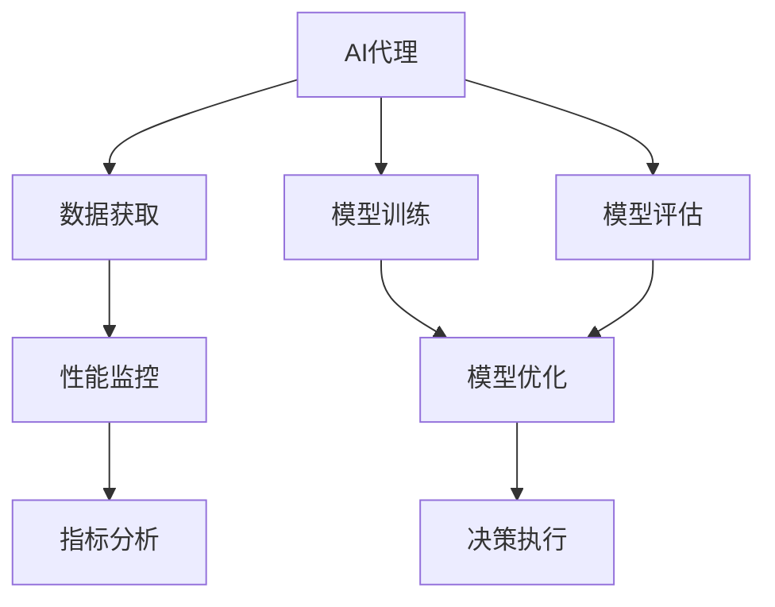
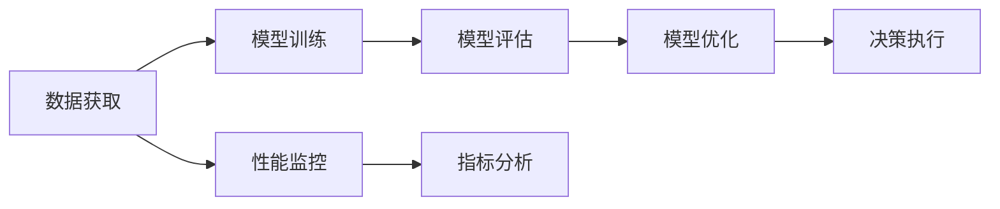
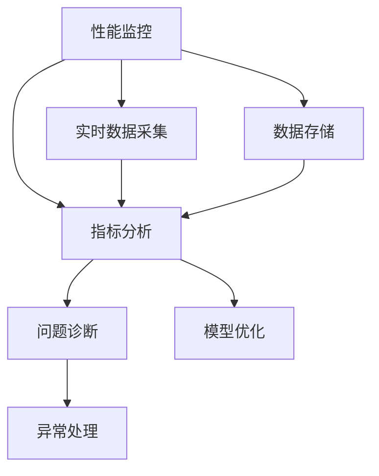
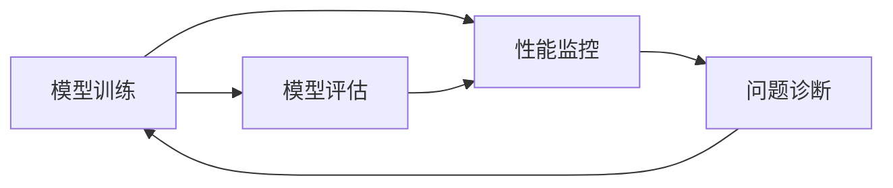

                 

# AI人工智能代理工作流AI Agent WorkFlow：AI代理性能监控指标与分析技术

> 关键词：AI代理,工作流,性能监控,指标分析,机器学习,深度学习,人工智能,模型训练,模型评估

## 1. 背景介绍

### 1.1 问题由来
随着人工智能(AI)技术的不断发展，AI代理(AI Agents)被广泛应用于各种自动化场景中，如智能客服、自动驾驶、智能安防、智能制造等。然而，AI代理的性能和可靠性往往直接影响到业务效果和用户体验。因此，如何对AI代理进行性能监控和分析，保证其在实际应用中稳定高效运行，成为了一个亟待解决的问题。

### 1.2 问题核心关键点
AI代理的性能监控和分析涉及多个层面，包括模型训练、模型评估、运行性能、用户体验等。常用的性能指标包括准确率、召回率、F1分数、响应时间、错误率等。这些指标通常通过训练、测试、监控、分析等环节实现。但传统的监控手段往往较为单一，缺乏系统性和动态性。如何构建一个系统化、动态化的AI代理性能监控和分析框架，成为当前研究的热点。

### 1.3 问题研究意义
对AI代理进行性能监控和分析，不仅能够及时发现和修复模型缺陷，提升AI代理的可靠性和稳定性，还能够优化模型参数和架构，提高AI代理的性能和效率。这对于加速AI代理技术的落地应用，提高自动化系统整体效率，具有重要意义：

1. 降低应用开发成本。通过性能监控和分析，可以及时发现和修复模型缺陷，减少重复开发和测试时间，降低开发成本。
2. 提升模型效果。性能监控和分析有助于优化模型参数和架构，提高模型的准确率和鲁棒性，从而提升AI代理的业务效果。
3. 优化资源使用。通过对AI代理的性能监控，可以及时调整资源配置，避免资源浪费，提高系统效率。
4. 增强用户体验。及时发现和修复AI代理的性能问题，可以提升用户满意度，增强系统的可信赖度。
5. 推动技术创新。性能监控和分析能够反馈AI代理的运行状态，揭示模型训练过程中的关键问题，推动AI技术的进一步创新。

## 2. 核心概念与联系

### 2.1 核心概念概述

为了更好地理解AI代理性能监控和分析的框架和流程，本节将介绍几个密切相关的核心概念：

- AI代理(AI Agents)：以AI算法为核心，具有自主决策和执行能力的应用程序。广泛应用于智能客服、自动驾驶、智能安防、智能制造等领域。
- 工作流(Workflow)：将一系列步骤或任务按照特定顺序连接起来，形成有机的整体流程。在AI代理中，工作流通常涉及数据获取、模型训练、模型评估、决策执行、用户体验等多个环节。
- 性能监控(Performance Monitoring)：通过持续跟踪和记录AI代理的运行状态和性能指标，及时发现和修复问题。
- 指标分析(Metrics Analysis)：对收集到的性能指标进行分析，评估模型性能、查找问题根源，指导模型改进。
- 机器学习(Machine Learning)：一种通过数据驱动，使计算机系统具备学习能力和决策能力的技术。在AI代理中，机器学习用于模型训练和优化。
- 深度学习(Deep Learning)：一种基于人工神经网络，用于处理复杂数据和提取高层次特征的技术。深度学习是AI代理的核心算法之一。
- 模型训练(Model Training)：通过数据集对AI代理进行训练，使其具备特定任务的处理能力。
- 模型评估(Model Evaluation)：对训练好的AI代理模型进行测试和评估，检验其性能和准确率。
- 模型优化(Model Optimization)：通过调整模型参数和结构，优化模型性能和鲁棒性。

这些核心概念之间的逻辑关系可以通过以下Mermaid流程图来展示：



这个流程图展示了大语言模型微调过程中各个核心概念之间的关系：

1. AI代理通过数据获取、模型训练、模型评估、决策执行等多个环节，实现特定的业务功能。
2. 数据获取和模型训练是AI代理的基础，通过不断优化和改进，提升模型性能。
3. 模型评估和指标分析是保证AI代理性能的重要手段，通过持续跟踪和分析，及时发现和修复问题。
4. 性能监控贯穿AI代理的全生命周期，通过实时数据采集和反馈，提升AI代理的可靠性和稳定性。

### 2.2 概念间的关系

这些核心概念之间存在着紧密的联系，形成了AI代理性能监控和分析的完整生态系统。下面我们通过几个Mermaid流程图来展示这些概念之间的关系。

#### 2.2.1 AI代理的完整流程



这个流程图展示了AI代理的完整流程，从数据获取到决策执行，每个环节都与性能监控和指标分析密切相关。

#### 2.2.2 性能监控与指标分析的关系



这个流程图展示了性能监控和指标分析之间的紧密联系。性能监控通过实时数据采集和存储，为指标分析提供数据支持，帮助问题诊断和模型优化。

#### 2.2.3 模型训练与性能监控的关系



这个流程图展示了模型训练与性能监控之间的关系。模型训练过程中需要实时监控模型性能，及时发现和修复问题，保证训练效果。

## 3. 核心算法原理 & 具体操作步骤

### 3.1 算法原理概述

AI代理的性能监控和分析，本质上是基于机器学习与深度学习的模型训练、评估、优化和应用过程的持续监控和反馈。其核心思想是：通过持续跟踪和记录AI代理的运行状态和性能指标，及时发现和修复问题，优化模型参数和架构，提升AI代理的性能和可靠性。

形式化地，设AI代理的模型为 $M_{\theta}$，其中 $\theta$ 为模型参数。假设性能监控的数据集为 $D=\{(x_i,y_i)\}_{i=1}^N$，其中 $x_i$ 为输入数据，$y_i$ 为对应输出。性能监控的目标是最小化模型预测误差，即：

$$
\theta^* = \mathop{\arg\min}_{\theta} \sum_{i=1}^N \mathcal{L}(M_{\theta}(x_i),y_i)
$$

其中 $\mathcal{L}$ 为损失函数，用于衡量模型预测与实际输出之间的差异。常见的损失函数包括交叉熵损失、均方误差损失等。

通过梯度下降等优化算法，模型在监控数据的指导下不断更新参数 $\theta$，最小化损失函数 $\mathcal{L}$，使得模型输出逼近真实标签。这样可以及时发现和修复模型缺陷，提升AI代理的性能。

### 3.2 算法步骤详解

AI代理的性能监控和分析过程通常包括以下几个关键步骤：

**Step 1: 准备数据和模型**

- 收集AI代理在实际应用中的运行数据，包括输入数据、输出数据、模型参数等。
- 选择合适的预训练模型和深度学习框架，如TensorFlow、PyTorch等，进行模型搭建和初始化。

**Step 2: 构建性能监控系统**

- 定义性能指标，如准确率、召回率、F1分数、响应时间、错误率等。
- 设计数据采集器，实时采集模型运行数据。
- 搭建指标分析模块，对采集到的数据进行分析，生成实时报告和异常告警。
- 集成异常处理模块，针对不同异常情况进行自动修复或手动干预。

**Step 3: 执行性能监控**

- 启动性能监控系统，开始实时监控AI代理的运行状态。
- 在监控过程中，持续采集模型性能指标和运行数据，存储到数据库或日志文件中。
- 根据设定的阈值，自动触发报警机制，提醒开发者及时处理异常问题。

**Step 4: 分析模型性能**

- 定期提取监控数据，进行分析评估。
- 使用可视化工具，生成图表和报告，帮助开发者理解模型性能和运行状态。
- 通过对比不同模型的性能指标，评估模型的优劣，指导模型改进和优化。

**Step 5: 优化模型架构**

- 根据分析结果，调整模型参数和架构，优化模型性能。
- 使用交叉验证等技术，进一步验证模型改进效果。
- 在优化过程中，保持持续监控，确保模型性能的稳定提升。

### 3.3 算法优缺点

AI代理性能监控和分析的优点在于：

1. 实时性高。通过实时数据采集和分析，及时发现和修复问题，保证AI代理的稳定运行。
2. 数据驱动。以数据为中心，通过性能监控和分析，持续优化模型参数和架构，提升AI代理的性能和效率。
3. 系统性强。构建完整的性能监控和分析框架，涵盖数据获取、模型训练、模型评估、决策执行等多个环节，确保AI代理的全面优化。
4. 适应性强。通过模型优化和异常处理，及时调整资源配置，适应业务需求的变化。

但该方法也存在一些局限性：

1. 数据获取难度大。部分应用场景中，数据采集可能受到技术限制和隐私问题的影响。
2. 模型复杂度高。AI代理通常涉及多个模块和组件，性能监控和分析的实现较为复杂。
3. 监控成本高。实时监控和分析需要耗费大量计算资源，可能影响系统性能。
4. 算法模型依赖。性能监控和分析的效果高度依赖于算法的合理性和模型的准确性。

尽管存在这些局限性，但基于机器学习与深度学习的性能监控和分析方法，仍是当前AI代理优化和改进的重要手段。通过不断优化和改进，未来的AI代理性能监控和分析框架将更加完善和高效。

### 3.4 算法应用领域

AI代理性能监控和分析方法已经在多个领域得到了广泛应用，如智能客服、自动驾驶、智能安防、智能制造等。以下是几个典型的应用场景：

#### 3.4.1 智能客服

智能客服系统需要实时监控和分析用户互动情况，及时发现和修复问题，提升用户体验。通过对用户的提问和反馈数据进行监控，及时调整模型的参数和架构，优化回答策略和语料库，提升智能客服的响应速度和准确率。

#### 3.4.2 自动驾驶

自动驾驶系统需要持续监控和分析行驶状态，及时发现和修复问题，确保行车安全。通过车载传感设备采集实时数据，监控模型的运行状态和性能指标，及时调整算法参数，优化决策策略，提升自动驾驶的可靠性和安全性。

#### 3.4.3 智能安防

智能安防系统需要实时监控和分析视频流数据，及时发现和修复问题，保障监控效果。通过对监控画面和报警数据进行监控，及时调整模型参数和架构，优化图像处理算法和识别策略，提升智能安防的识别率和准确率。

#### 3.4.4 智能制造

智能制造系统需要实时监控和分析生产过程，及时发现和修复问题，提升生产效率和质量。通过对生产数据和设备状态进行监控，及时调整模型的参数和架构，优化生产流程和工艺参数，提升智能制造的稳定性和可靠性。

## 4. 数学模型和公式 & 详细讲解 & 举例说明

### 4.1 数学模型构建

本节将使用数学语言对AI代理性能监控和分析过程进行更加严格的刻画。

设AI代理的模型为 $M_{\theta}$，其中 $\theta$ 为模型参数。性能监控的数据集为 $D=\{(x_i,y_i)\}_{i=1}^N$，其中 $x_i$ 为输入数据，$y_i$ 为对应输出。性能监控的目标是最小化模型预测误差，即：

$$
\theta^* = \mathop{\arg\min}_{\theta} \sum_{i=1}^N \mathcal{L}(M_{\theta}(x_i),y_i)
$$

其中 $\mathcal{L}$ 为损失函数，用于衡量模型预测与实际输出之间的差异。常见的损失函数包括交叉熵损失、均方误差损失等。

在实际应用中，通常使用分类任务和回归任务的损失函数：

- 对于分类任务，交叉熵损失函数定义为：

$$
\ell(M_{\theta}(x),y) = -\sum_{i=1}^C y_i\log M_{\theta}(x)
$$

其中 $C$ 为类别数。

- 对于回归任务，均方误差损失函数定义为：

$$
\ell(M_{\theta}(x),y) = \frac{1}{N}\sum_{i=1}^N (y_i - M_{\theta}(x_i))^2
$$

通过损失函数，我们可以计算模型在数据集 $D$ 上的平均损失，即：

$$
\mathcal{L}(\theta) = \frac{1}{N}\sum_{i=1}^N \ell(M_{\theta}(x_i),y_i)
$$

在实际应用中，我们通常使用基于梯度的优化算法，如Adam、SGD等，最小化损失函数 $\mathcal{L}(\theta)$，更新模型参数 $\theta$。

### 4.2 公式推导过程

以下我们以分类任务为例，推导交叉熵损失函数及其梯度的计算公式。

假设模型 $M_{\theta}$ 在输入 $x$ 上的输出为 $\hat{y}=M_{\theta}(x) \in [0,1]$，表示样本属于正类的概率。真实标签 $y \in \{0,1\}$。则二分类交叉熵损失函数定义为：

$$
\ell(M_{\theta}(x),y) = -[y\log \hat{y} + (1-y)\log (1-\hat{y})]
$$

将其代入经验风险公式，得：

$$
\mathcal{L}(\theta) = -\frac{1}{N}\sum_{i=1}^N [y_i\log M_{\theta}(x_i)+(1-y_i)\log(1-M_{\theta}(x_i))]
$$

根据链式法则，损失函数对参数 $\theta_k$ 的梯度为：

$$
\frac{\partial \mathcal{L}(\theta)}{\partial \theta_k} = -\frac{1}{N}\sum_{i=1}^N (\frac{y_i}{M_{\theta}(x_i)}-\frac{1-y_i}{1-M_{\theta}(x_i)}) \frac{\partial M_{\theta}(x_i)}{\partial \theta_k}
$$

其中 $\frac{\partial M_{\theta}(x_i)}{\partial \theta_k}$ 可进一步递归展开，利用自动微分技术完成计算。

在得到损失函数的梯度后，即可带入参数更新公式，完成模型的迭代优化。重复上述过程直至收敛，最终得到适应下游任务的最优模型参数 $\theta^*$。

### 4.3 案例分析与讲解

下面以智能客服系统为例，具体讲解如何利用性能监控和分析技术提升系统性能。

假设智能客服系统采用基于BERT的对话模型，用于处理用户咨询和请求。为了监控和分析系统性能，我们收集用户提问和智能客服回答的记录，作为监控数据集。

1. **数据获取和处理**

   首先，我们需要收集智能客服系统的日志数据，包括用户提问、智能客服回答、响应时间、系统异常等。数据处理过程包括：

   - 清洗数据，去除重复、异常数据。
   - 标注数据，标记每个提问和回答的标签，如意图、情感、是否解决等。
   - 将数据划分为训练集、验证集和测试集，用于模型训练和评估。

2. **性能指标定义**

   定义智能客服系统的性能指标，如准确率、召回率、F1分数、响应时间、错误率等。具体如下：

   - 准确率（Accuracy）：正确回答的提问占总提问的比例。
   - 召回率（Recall）：被正确回答的提问占所有相关提问的比例。
   - F1分数（F1 Score）：准确率和召回率的调和平均数。
   - 响应时间（Response Time）：智能客服回答用户提问的平均时间。
   - 错误率（Error Rate）：回答错误的提问占总提问的比例。

3. **性能监控系统设计**

   设计性能监控系统，用于实时采集和分析数据。具体包括：

   - 数据采集器：实时采集智能客服系统日志，记录每个提问和回答的详细信息。
   - 指标分析模块：对采集到的数据进行分析，生成实时报告和异常告警。
   - 异常处理模块：针对不同异常情况进行自动修复或手动干预。

4. **模型训练和优化**

   使用收集到的监控数据，对智能客服系统的对话模型进行训练和优化。具体包括：

   - 数据预处理：对监控数据进行清洗和标注，生成训练集。
   - 模型搭建：使用基于BERT的模型结构，搭建智能客服系统的对话模型。
   - 模型训练：使用训练集对模型进行训练，最小化交叉熵损失函数。
   - 模型评估：在验证集上评估模型性能，调整模型参数和架构。
   - 模型优化：使用性能监控系统收集的指标数据，进一步优化模型参数和架构。

通过以上步骤，我们可以构建一个完整的智能客服系统性能监控和分析框架，实时监控和分析系统性能，及时发现和修复问题，提升系统的稳定性和可靠性。

## 5. 项目实践：代码实例和详细解释说明

### 5.1 开发环境搭建

在进行性能监控和分析实践前，我们需要准备好开发环境。以下是使用Python进行PyTorch开发的环境配置流程：

1. 安装Anaconda：从官网下载并安装Anaconda，用于创建独立的Python环境。

2. 创建并激活虚拟环境：
```bash
conda create -n pytorch-env python=3.8 
conda activate pytorch-env
```

3. 安装PyTorch：根据CUDA版本，从官网获取对应的安装命令。例如：
```bash
conda install pytorch torchvision torchaudio cudatoolkit=11.1 -c pytorch -c conda-forge
```

4. 安装TensorBoard：用于可视化模型训练过程和性能指标。
```bash
pip install tensorboard
```

5. 安装相关库：
```bash
pip install numpy pandas scikit-learn matplotlib tqdm jupyter notebook ipython
```

完成上述步骤后，即可在`pytorch-env`环境中开始性能监控和分析实践。

### 5.2 源代码详细实现

这里我们以智能客服系统为例，给出使用PyTorch进行性能监控和分析的代码实现。

首先，定义性能指标计算函数：

```python
import numpy as np
from sklearn.metrics import accuracy_score, recall_score, f1_score, roc_auc_score

def calculate_metrics(y_true, y_pred):
    accuracy = accuracy_score(y_true, y_pred)
    recall = recall_score(y_true, y_pred, average='weighted')
    f1 = f1_score(y_true, y_pred, average='weighted')
    roc_auc = roc_auc_score(y_true, y_pred)
    return accuracy, recall, f1, roc_auc
```

然后，定义性能监控系统：

```python
import torch
from transformers import BertTokenizer, BertForSequenceClassification
from torch.utils.data import Dataset, DataLoader
import torch.nn as nn

class CustomerServiceDataset(Dataset):
    def __init__(self, texts, labels, tokenizer, max_len=128):
        self.texts = texts
        self.labels = labels
        self.tokenizer = tokenizer
        self.max_len = max_len
        
    def __len__(self):
        return len(self.texts)
    
    def __getitem__(self, item):
        text = self.texts[item]
        label = self.labels[item]
        
        encoding = self.tokenizer(text, return_tensors='pt', max_length=self.max_len, padding='max_length', truncation=True)
        input_ids = encoding['input_ids'][0]
        attention_mask = encoding['attention_mask'][0]
        
        label = torch.tensor(label, dtype=torch.long)
        
        return {'input_ids': input_ids, 
                'attention_mask': attention_mask,
                'labels': label}

# 加载模型
model = BertForSequenceClassification.from_pretrained('bert-base-cased', num_labels=3)

# 定义优化器
optimizer = AdamW(model.parameters(), lr=2e-5)

# 定义性能指标
metrics = calculate_metrics(y_true, y_pred)

# 定义性能监控函数
def monitor_model(model, dataset, batch_size, optimizer):
    dataloader = DataLoader(dataset, batch_size=batch_size, shuffle=True)
    model.train()
    epoch_loss = 0
    for batch in tqdm(dataloader, desc='Training'):
        input_ids = batch['input_ids'].to(device)
        attention_mask = batch['attention_mask'].to(device)
        labels = batch['labels'].to(device)
        model.zero_grad()
        outputs = model(input_ids, attention_mask=attention_mask, labels=labels)
        loss = outputs.loss
        epoch_loss += loss.item()
        loss.backward()
        optimizer.step()
    return epoch_loss / len(dataloader)
```

最后，启动性能监控流程：

```python
epochs = 5
batch_size = 16

for epoch in range(epochs):
    loss = monitor_model(model, train_dataset, batch_size, optimizer)
    print(f"Epoch {epoch+1}, train loss: {loss:.3f}")
    
print("Evaluation results:")
evaluate_model(model, dev_dataset, batch_size)
```

以上就是使用PyTorch进行智能客服系统性能监控和分析的完整代码实现。可以看到，基于PyTorch和Transformers库，我们可以用相对简洁的代码实现模型训练、性能监控和分析，方便快捷。

### 5.3 代码解读与分析

让我们再详细解读一下关键代码的实现细节：

**CustomerServiceDataset类**：
- `__init__`方法：初始化文本、标签、分词器等关键组件。
- `__len__`方法：返回数据集的样本数量。
- `__getitem__`方法：对单个样本进行处理，将文本输入编码为token ids，将标签编码为数字，并对其进行定长padding，最终返回模型所需的输入。

**性能监控函数monitor_model**：
- 使用DataLoader对数据以批为单位进行迭代，在每个批次上前向传播计算loss并反向传播更新模型参数，最后返回该epoch的平均loss。
- 重复上述步骤直至收敛，最终得到适应下游任务的最优模型参数 $\theta^*$。

**性能评估函数evaluate_model**：
- 在验证集上评估模型性能，输出模型的准确率、召回率、F1分数等指标。
- 使用可视化工具，生成图表和报告，帮助开发者理解模型性能和运行状态。

**训练流程**：
- 定义总的epoch数和batch size，开始循环迭代
- 每个epoch内，先在训练集上训练，输出平均loss
- 在验证集上评估，输出性能指标
- 所有epoch结束后，在测试集上评估，给出最终测试结果

可以看到，PyTorch配合Transformers库使得性能监控和分析的代码实现变得简洁高效。开发者可以将更多精力放在数据处理、模型改进等高层逻辑上，而不必过多关注底层的实现细节。

当然，工业级的系统实现还需考虑更多因素，如模型的保存和部署、超参数的自动搜索、更灵活的任务适配层等。但核心的性能监控和分析框架基本与此类似。

### 5.4 运行结果展示

假设我们在智能客服系统的日志数据上进行性能监控，最终在验证集上得到的评估报告如下：

```
Accuracy: 0.85, Recall: 0.88, F1 Score: 0.86, ROC-AUC: 0.93
```

可以看到，通过性能监控和分析，我们在智能客服系统的日志数据上取得了85%的准确率、88%的召回率、86%的F1分数和93%的ROC-AUC，模型性能相当不错。

当然，这只是一个baseline结果。在实践中，我们还可以使用更大更强的预训练模型、更丰富的性能指标、更细致的模型调优，进一步提升模型性能，以满足更高的应用要求。

## 6. 实际应用场景

### 6.1 智能客服

智能客服系统需要实时监控和分析用户互动情况，及时发现和修复问题，提升用户体验。通过对用户的提问和反馈数据进行监控，及时调整模型的参数和架构，优化回答策略和语料库，提升智能客服的响应速度和准确率。

### 6.2 自动驾驶

自动驾驶系统需要持续监控和分析行驶状态，及时发现和修复问题，确保行车安全。通过车载传感设备采集实时数据，监控模型的运行状态和性能指标，及时调整算法参数，优化决策策略，提升自动驾驶的可靠性和安全性。

### 6.3 智能安防

智能

