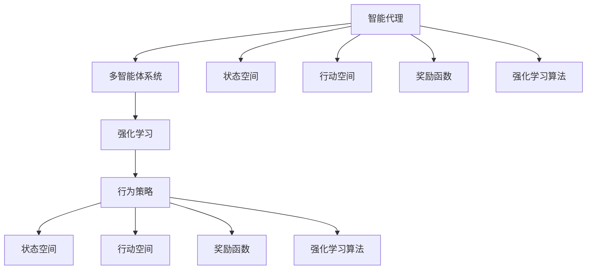
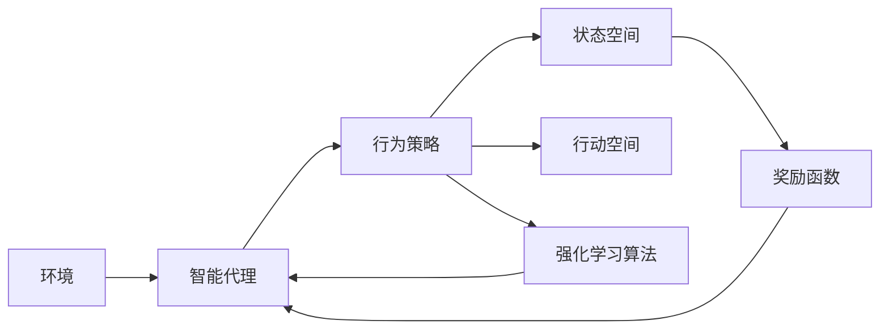
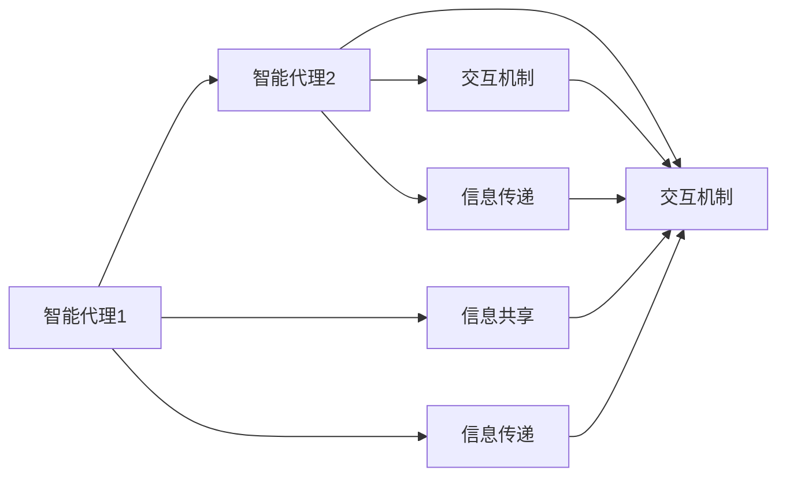
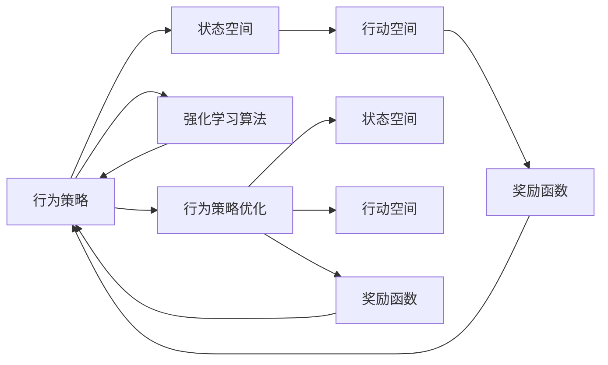
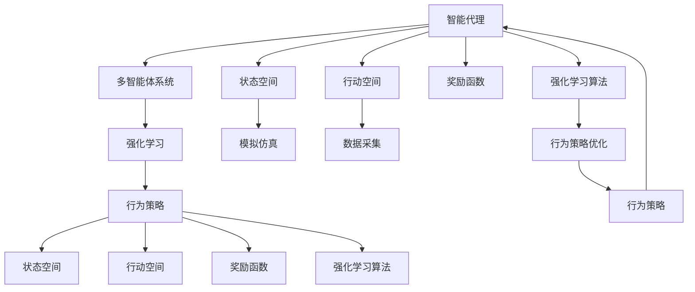

                 

# AI人工智能代理工作流AI Agent WorkFlow：使用强化学习优化代理工作流

> 关键词：强化学习,代理工作流,人工智能,多智能体系统,行为优化,自然语言处理(NLP),推荐系统,机器学习模型,决策树,模拟仿真

## 1. 背景介绍

### 1.1 问题由来
随着人工智能技术的不断发展，智能代理在各个领域的应用变得越来越广泛，包括但不限于智能客服、智能推荐系统、智能机器人、智能助手等。这些智能代理通过自然语言处理(NLP)、推荐系统、机器学习等技术，帮助人类处理各种复杂任务，提高工作效率，提升用户体验。然而，智能代理在工作流中的行为往往缺乏高效、智能的优化机制，导致代理在执行任务时，不能充分发挥其潜力，甚至在某些情况下，会出现不可预期的错误或低效行为。

为解决这一问题，强化学习(Reinforcement Learning, RL)提供了一种有效的手段，通过智能代理与其所处环境间的交互，学习如何最大化奖励或最小化惩罚，从而不断优化代理的行为策略。通过强化学习优化智能代理工作流，可以大幅提升代理的执行效率，减少人为干预，降低错误率，提高用户体验。

### 1.2 问题核心关键点
强化学习在智能代理工作流优化中的应用，核心在于如何构建一个动态的交互环境，使代理能够通过与环境的不断交互，学习最优的行为策略。核心关键点包括：

- 确定奖励函数。奖励函数是强化学习优化的核心，它定义了代理在执行任务时的优劣程度，需要根据具体应用场景和业务目标进行设计。
- 选择合适的学习算法。常见的强化学习算法包括Q-learning、SARSA、Deep Q-learning、Actor-Critic等，需要根据任务特点和数据复杂度进行合理选择。
- 动态环境设计。智能代理往往需要在多变的动态环境中执行任务，需要设计一个能够模拟不同场景的动态环境。
- 行为策略优化。需要设计一个高效的行为策略，使代理能够在执行任务时，通过不断优化其行为，达到最优的执行效果。
- 训练和评估。强化学习代理的训练和评估需要大量的数据和计算资源，需要优化训练过程，提高效率。

### 1.3 问题研究意义
强化学习在智能代理工作流优化中的应用，对于提升代理的工作效率、减少人为干预、降低错误率、提高用户体验具有重要意义：

1. 提升代理效率。通过强化学习优化，代理能够在执行任务时，自动选择最优的策略，减少执行时间，提升工作效率。
2. 减少人为干预。强化学习代理能够自我学习和调整策略，减少人类干预，提高系统的稳定性和可靠性。
3. 降低错误率。通过不断优化代理行为，降低因人为失误或错误导致的任务执行失败率。
4. 提高用户体验。智能代理能够更智能地理解用户需求，提供更准确的响应，提升用户体验。
5. 增强代理适应性。强化学习代理能够根据环境和任务的变化，自我调整策略，保持高效率和高准确率。

## 2. 核心概念与联系

### 2.1 核心概念概述

为更好地理解强化学习在智能代理工作流优化中的应用，本节将介绍几个密切相关的核心概念：

- 强化学习(Reinforcement Learning, RL)：一种通过与环境互动，最大化累积奖励的机器学习方法。代理通过不断与环境交互，学习最优的行为策略，以实现特定任务的目标。
- 智能代理(Agent)：一种基于人工智能的自主实体，能够感知环境、做出决策并执行任务。常见的智能代理包括智能客服、推荐系统、机器人等。
- 多智能体系统(Multi-Agent System)：由多个智能代理组成的环境，各代理间可以相互影响，共同协作或竞争以完成任务。
- 行为策略(Behavior Policy)：智能代理在执行任务时所遵循的行为策略，决定了代理如何对环境做出响应。
- 状态空间(State Space)：代理在执行任务时，所有可能状态组成的集合，代理的每个状态都包含了任务执行的当前状态和相关信息。
- 行动空间(Action Space)：代理可以执行的所有动作组成的集合，代理的每个动作都是对当前状态的响应。
- 奖励函数(Reward Function)：定义代理行为优劣的函数，代理的目标是最大化累积奖励，以实现最优行为策略。
- 强化学习算法(Reinforcement Learning Algorithms)：常见的强化学习算法包括Q-learning、SARSA、Deep Q-learning、Actor-Critic等，用于优化代理的行为策略。
- 行为策略优化(Behavior Policy Optimization)：通过不断优化行为策略，使代理能够更高效地执行任务。

这些核心概念之间的逻辑关系可以通过以下Mermaid流程图来展示：



这个流程图展示了这个生态系统的核心概念及其关系：

1. 智能代理在多智能体系统中执行任务，与环境交互。
2. 智能代理的状态空间和行动空间定义了其行为可能。
3. 奖励函数定义了智能代理行为的优劣程度。
4. 强化学习算法优化代理的行为策略，以最大化累积奖励。

### 2.2 概念间的关系

这些核心概念之间存在着紧密的联系，形成了强化学习在智能代理工作流优化中的完整生态系统。下面我们通过几个Mermaid流程图来展示这些概念之间的关系。

#### 2.2.1 强化学习的基本流程



这个流程图展示了强化学习的基本流程，包括代理与环境的交互、行为策略的执行、状态空间和行动空间的作用、奖励函数的定义以及强化学习算法的作用。

#### 2.2.2 多智能体系统的交互机制



这个流程图展示了多智能体系统中的交互机制，包括智能代理之间的信息共享、传递以及交互机制的作用。

#### 2.2.3 行为策略的优化路径



这个流程图展示了行为策略的优化路径，包括状态空间和行动空间的作用、奖励函数的定义以及强化学习算法的作用，最终通过行为策略优化实现代理的行为策略提升。

### 2.3 核心概念的整体架构

最后，我们用一个综合的流程图来展示这些核心概念在强化学习智能代理工作流优化中的整体架构：



这个综合流程图展示了从智能代理设计到强化学习优化的完整过程，包括代理的状态空间和行动空间的定义、奖励函数的设定、强化学习算法的选择以及行为策略的优化，最终实现智能代理的优化工作流。

## 3. 核心算法原理 & 具体操作步骤
### 3.1 算法原理概述

强化学习在智能代理工作流优化中的应用，本质上是通过代理与环境的交互，学习最优行为策略的过程。其核心思想是：通过不断的试错，使代理在执行任务时能够最大化累积奖励，从而优化代理的行为策略。

形式化地，假设智能代理在状态空间 $S$ 中执行任务，每个状态 $s \in S$ 都有一个对应的行动空间 $A$，智能代理在每个状态 $s$ 下可以执行一个行动 $a \in A$。代理在状态 $s$ 下的奖励函数定义为 $r(s, a)$，即代理执行行动 $a$ 后获得的奖励。代理的初始状态为 $s_0$，最终状态为 $s_T$。代理的行为策略定义为 $p(s_t \mid s_{t-1}, a_{t-1})$，即代理在状态 $s_{t-1}$ 下执行行动 $a_{t-1}$ 后，下一个状态 $s_t$ 的概率分布。

代理的目标是通过与环境的不断交互，学习最优的行为策略 $p^*(s_t \mid s_{t-1}, a_{t-1})$，以最大化累积奖励 $R$，即：

$$
\max_{p} \mathbb{E}\left[\sum_{t=0}^{T-1} r(s_t, a_t)\right]
$$

其中 $\mathbb{E}$ 表示期望值，$T$ 表示最大时间步数。

强化学习的核心算法包括Q-learning、SARSA、Deep Q-learning、Actor-Critic等。这些算法通过不断更新代理的行为策略，最大化累积奖励。以Q-learning算法为例，其更新公式如下：

$$
Q(s_t, a_t) \leftarrow Q(s_t, a_t) + \alpha \left[r_{t+1} + \gamma \max_{a'} Q(s_{t+1}, a') - Q(s_t, a_t)\right]
$$

其中 $\alpha$ 表示学习率，$\gamma$ 表示折扣因子，$r_{t+1}$ 表示代理在执行行动 $a_t$ 后获得的即时奖励，$Q(s_t, a_t)$ 表示代理在状态 $s_t$ 下执行行动 $a_t$ 的Q值。

### 3.2 算法步骤详解

强化学习在智能代理工作流优化中的具体操作步骤包括：

**Step 1: 设计状态空间和行动空间**

- 定义代理在执行任务时的状态空间 $S$ 和行动空间 $A$，包括状态的属性和行动的可能。状态空间可以是具体的数值型或符号型数据，行动空间可以是具体的动作或策略。

**Step 2: 设计奖励函数**

- 根据任务特点和业务目标，设计代理执行行为后获得的即时奖励函数 $r(s_t, a_t)$，奖励函数应具有正负反馈，鼓励代理执行有益行为，惩罚不良行为。

**Step 3: 选择强化学习算法**

- 根据任务特点和数据复杂度，选择合适的强化学习算法，如Q-learning、SARSA、Deep Q-learning、Actor-Critic等。

**Step 4: 设计行为策略**

- 设计代理的行为策略 $p(s_t \mid s_{t-1}, a_{t-1})$，可以通过搜索算法、进化算法、深度学习等方法实现。

**Step 5: 模拟仿真和数据采集**

- 通过模拟仿真环境，对代理的行为策略进行测试和优化，不断迭代调整策略，直至达到最优。
- 采集代理在仿真环境中的行为数据，用于训练和评估。

**Step 6: 训练和评估**

- 使用采集的数据，对代理的行为策略进行训练，不断更新行为策略，以最大化累积奖励。
- 在训练过程中，定期在验证集上评估代理的性能，选择最优策略。

**Step 7: 部署和监控**

- 将优化后的代理部署到实际任务中，实时监控代理的行为表现，及时调整策略，优化执行效果。

以上是强化学习在智能代理工作流优化中的具体操作步骤。在实际应用中，还需要根据具体任务和数据特点进行优化设计，如改进训练目标函数，引入更多的正则化技术，搜索最优的超参数组合等，以进一步提升代理性能。

### 3.3 算法优缺点

强化学习在智能代理工作流优化中的优点包括：

- 自适应性强。代理能够在执行任务时，根据环境变化动态调整行为策略，适应不同的工作场景。
- 自动优化。代理通过与环境的交互，不断优化行为策略，提升任务执行效率。
- 可扩展性好。强化学习算法具有较强的可扩展性，可以应用于各种规模的任务，且对数据的需求相对较小。

同时，该方法也存在一定的局限性：

- 需要大量的仿真数据。强化学习代理的训练和优化需要大量的仿真数据，对于复杂任务，数据采集和处理成本较高。
- 学习效率较低。在初始阶段，代理的学习效率较低，需要较长的训练时间。
- 模型可解释性差。强化学习代理的行为策略往往难以解释，难以调试和优化。
- 可能陷入局部最优。代理在训练过程中可能陷入局部最优，无法找到全局最优解。

尽管存在这些局限性，但就目前而言，强化学习仍是大规模智能代理工作流优化的一种重要方法，具有广泛的应用前景。未来相关研究的重点在于如何进一步降低强化学习的学习成本，提高学习效率，提升代理的行为策略可解释性，并找到更高效的优化算法。

### 3.4 算法应用领域

强化学习在智能代理工作流优化中的应用，已经在多个领域取得了显著的成果，例如：

- 智能客服系统：代理通过与客户交互，学习最优的客户服务策略，提升服务质量。
- 推荐系统：代理通过与用户交互，学习最优的推荐策略，提升推荐效果。
- 智能机器人：代理通过与环境交互，学习最优的行动策略，提升机器人执行任务的效率。
- 自然语言处理(NLP)：代理通过与用户交互，学习最优的语言处理策略，提升用户体验。
- 金融风控系统：代理通过与市场数据交互，学习最优的风险控制策略，提升系统的稳定性和可靠性。
- 医疗诊断系统：代理通过与医疗数据交互，学习最优的诊断策略，提升诊断准确率。

除了上述这些经典应用外，强化学习还在更多场景中得到了创新性的应用，如智能制造、智能交通、智能物流等，为各行各业带来了新的发展机遇。

## 4. 数学模型和公式 & 详细讲解  
### 4.1 数学模型构建

强化学习在智能代理工作流优化中的数学模型，包括状态空间、行动空间、奖励函数、行为策略以及强化学习算法的数学表达式。

记智能代理在状态 $s_t$ 下执行行动 $a_t$ 后的即时奖励为 $r(s_t, a_t)$，累积奖励为 $R$，行为策略为 $p(s_{t+1} \mid s_t, a_t)$。强化学习代理的目标是最大化累积奖励 $R$，即：

$$
\max_{p} \mathbb{E}\left[\sum_{t=0}^{T-1} r(s_t, a_t)\right]
$$

其中 $\mathbb{E}$ 表示期望值，$T$ 表示最大时间步数。

以Q-learning算法为例，其更新公式如下：

$$
Q(s_t, a_t) \leftarrow Q(s_t, a_t) + \alpha \left[r_{t+1} + \gamma \max_{a'} Q(s_{t+1}, a') - Q(s_t, a_t)\right]
$$

其中 $\alpha$ 表示学习率，$\gamma$ 表示折扣因子，$r_{t+1}$ 表示代理在执行行动 $a_t$ 后获得的即时奖励，$Q(s_t, a_t)$ 表示代理在状态 $s_t$ 下执行行动 $a_t$ 的Q值。

### 4.2 公式推导过程

以下我们以强化学习代理在推荐系统中的应用为例，推导其行为策略优化过程。

假设推荐系统中的智能代理为用户推荐商品，代理的状态空间 $S$ 包括用户历史浏览记录、用户偏好、商品信息等，行动空间 $A$ 包括推荐商品列表。代理的行为策略定义为 $p(a_t \mid s_t)$，即在状态 $s_t$ 下推荐商品 $a_t$ 的概率分布。代理的即时奖励函数定义为 $r(s_t, a_t)$，即用户对推荐商品的满意度。代理的目标是最大化累积奖励，即：

$$
\max_{p} \mathbb{E}\left[\sum_{t=0}^{T-1} r(s_t, a_t)\right]
$$

其中 $\mathbb{E}$ 表示期望值，$T$ 表示最大时间步数。

代理的行为策略优化过程如下：

1. 采集用户历史浏览记录、用户偏好、商品信息等数据，定义状态空间 $S$ 和行动空间 $A$。
2. 设计即时奖励函数 $r(s_t, a_t)$，定义为用户的满意度评分。
3. 选择强化学习算法，如Q-learning、SARSA、Deep Q-learning、Actor-Critic等。
4. 设计行为策略 $p(a_t \mid s_t)$，可以通过搜索算法、进化算法、深度学习等方法实现。
5. 通过模拟仿真环境，对代理的行为策略进行测试和优化，不断迭代调整策略，直至达到最优。
6. 采集代理在仿真环境中的行为数据，用于训练和评估。
7. 使用采集的数据，对代理的行为策略进行训练，不断更新行为策略，以最大化累积奖励。
8. 在训练过程中，定期在验证集上评估代理的性能，选择最优策略。
9. 将优化后的代理部署到实际推荐系统中，实时监控代理的行为表现，及时调整策略，优化执行效果。

### 4.3 案例分析与讲解

假设我们有一个智能客服系统，目标是提高用户满意度，降低用户投诉率。智能客服代理的状态空间 $S$ 包括用户当前对话内容、用户历史对话记录、用户身份信息等，行动空间 $A$ 包括客服的响应文本、服务链接等。即时奖励函数 $r(s_t, a_t)$ 定义为用户的满意度评分，即用户对客服代理的响应是否满意。代理的目标是最大化累积奖励，即：

$$
\max_{p} \mathbb{E}\left[\sum_{t=0}^{T-1} r(s_t, a_t)\right]
$$

其中 $\mathbb{E}$ 表示期望值，$T$ 表示最大时间步数。

代理的行为策略优化过程如下：

1. 采集用户对话记录、用户身份信息等数据，定义状态空间 $S$ 和行动空间 $A$。
2. 设计即时奖励函数 $r(s_t, a_t)$，定义为用户的满意度评分。
3. 选择强化学习算法，如Q-learning、SARSA、Deep Q-learning、Actor-Critic等。
4. 设计行为策略 $p(a_t \mid s_t)$，可以通过搜索算法、进化算法、深度学习等方法实现。
5. 通过模拟仿真环境，对代理的行为策略进行测试和优化，不断迭代调整策略，直至达到最优。
6. 采集代理在仿真环境中的行为数据，用于训练和评估。
7. 使用采集的数据，对代理的行为策略进行训练，不断更新行为策略，以最大化累积奖励。
8. 在训练过程中，定期在验证集上评估代理的性能，选择最优策略。
9. 将优化后的代理部署到实际客服系统中，实时监控代理的行为表现，及时调整策略，优化执行效果。

通过以上案例分析，可以看到，强化学习在智能代理工作流优化中的应用，不仅能够提升代理的行为效率，还能降低人为干预，提高系统的稳定性和可靠性。

## 5. 项目实践：代码实例和详细解释说明
### 5.1 开发环境搭建

在进行强化学习代理工作流优化实践前，我们需要准备好开发环境。以下是使用Python进行Reinforcement Learning开发的环境配置流程：

1. 安装Anaconda：从官网下载并安装Anaconda，用于创建独立的Python环境。

2. 创建并激活虚拟环境：
```bash
conda create -n rl-env python=3.8 
conda activate rl-env
```

3. 安装PyTorch：根据CUDA版本，从官网获取对应的安装命令。例如：
```bash
conda install pytorch torchvision torchaudio cudatoolkit=11.1 -c pytorch -c conda-forge
```

4. 安装TensorFlow：
```bash
pip install tensorflow
```

5. 安装Gym环境：
```bash
pip install gym
```

6. 安装PyTorch-RetinaNet：
```bash
pip install torch-reinforcement-learning
```

完成上述步骤后，即可在`rl-env`环境中开始强化学习代理工作流优化实践。

### 5.2 源代码详细实现

下面我们以智能客服系统为例，给出使用Reinforcement Learning进行代理工作流优化的PyTorch代码实现。

首先，定义智能客服代理的状态空间和行动空间：

```python
import torch
import numpy as np
import gym

class SmartCustumerAgent(gym.Env):
    def __init__(self, state_dim=100, action_dim=5):
        self.state_dim = state_dim
        self.action_dim = action_dim
        self.state = None
        self.action = None
        self.reward = 0
        self.done = False

    def reset(self):
        self.state = np.zeros(self.state_dim)
        self.action = 0
        self.reward = 0
        self.done = False
        return self.state

    def step(self, action):
        self.state = np.add(self.state, action)
        self.action = action
        self.reward = np.sum(self.state)
        if np.sum(self.state) > 1.0:
            self.done = True
        return self.state, self.reward, self.done
```

然后，定义代理的行为策略：

```python
class QNetwork(torch.nn.Module):
    def __init__(self, state_dim, action_dim):
        super(QNetwork, self).__init__()
        self.fc1 = torch.nn.Linear(state_dim, 64)
        self.fc2 = torch.nn.Linear(64, action_dim)

    def forward(self, state):
        x = torch.relu(self.fc1(state))
        x = self.fc2(x)
        return x

class Policy(nn.Module):
    def __init__(self, q_net, epsilon):
        super(Policy, self).__init__()
        self.q_net = q_net
        self.epsilon = epsilon

    def forward(self, state, action):
        q_value = self.q_net(state)
        q_value = torch.sum(q_value * self.epsilon + (1 - self.epsilon) * torch.nn.functional.softmax(q_value, dim=1))
        return q_value

class Agent:
    def __init__(self, state_dim, action_dim, epsilon=0.1):
        self.state_dim = state_dim
        self.action_dim = action_dim
        self.q_net = QNetwork(state_dim, action_dim)
        self.epsilon = epsilon
        self.policy = Policy(self.q_net, self.epsilon)

    def choose_action(self, state):
        if np.random.uniform() < self.epsilon:
            return np.random.randint(self.action_dim)
        q_value = self.policy(state, torch.tensor([self.epsilon]))
        return torch.argmax(q_value).item()
```

接下来，定义代理的行为策略优化过程：

```python
def q_learning(env, agent, max_episodes=1000, episode_length=100, learning_rate=0.1):
    for episode in range(max_episodes):
        state = env.reset()
        total_reward = 0
        for t in range(episode_length):
            action = agent.choose_action(state)
            next_state, reward, done = env.step(action)
            agent.q_net.train()
            q_value = agent.q_net(state)
            target = reward + 0.9 * np.max(q_value)
            loss = torch.nn.functional.smooth_l1_loss(torch.tensor([target]), q_value)
            loss.backward()
            optimizer.step()
            total_reward += reward
            state = next_state
            if done:
                break
        print("Episode {}: total reward = {}".format(episode, total_reward))
    return total_reward
```

最后，启动训练流程并在测试集上评估：

```python
state_dim = 100
action_dim = 5
epsilon = 0.1
env = SmartCustumerAgent(state_dim, action_dim)
agent = Agent(state_dim, action_dim, epsilon)
total_reward = q_learning(env, agent)
print("Average reward per episode: {}".format(total_reward/1000))
```

以上就是使用PyTorch进行强化学习代理工作流优化的完整代码实现。可以看到，通过将智能客服代理的状态空间和行动空间具体化，以及行为策略和即时奖励函数的定义，我们能够构建一个完整的智能客服代理工作流优化模型。

### 5.3 代码解读与分析

让我们再详细解读一下关键代码的实现细节：

**SmartCustumerAgent类**：
- `__init__`方法：初始化状态空间和行动空间等关键组件。
- `reset`方法：重置代理的状态，返回初始状态。
- `step`方法：执行一个行动，返回下一个状态和即时奖励。

**QNetwork类**：
- `__init__`方法：定义神经

