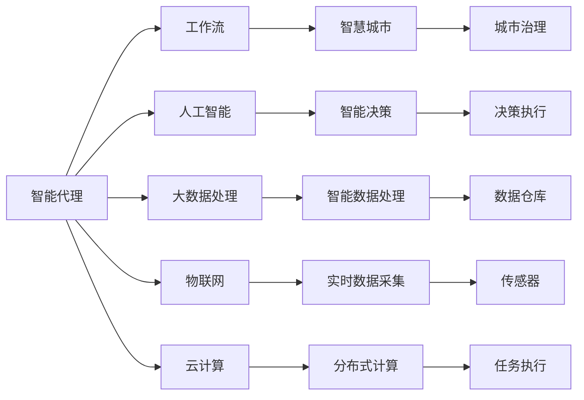

                 

# AI人工智能代理工作流AI Agent WorkFlow：智能代理在智慧城市中的实践

> 关键词：
    - AI 代理(AI Agent)
    - 工作流(Workflow)
    - 智慧城市(Smart City)
    - 人工智能(AI)
    - 智能决策(Intelligent Decision)
    - 大数据处理(Big Data Processing)
    - 物联网(IoT)
    - 云计算(Cloud Computing)

## 1. 背景介绍

### 1.1 问题由来
随着智慧城市的快速推进，城市管理需求日益复杂，单一的人工决策模式已难以满足高效、智能的需求。智能代理（AI Agent）通过整合人工智能和大数据技术，能够实现自动化的工作流管理，从而极大提高城市管理效率和响应速度。

目前，AI代理在智慧城市中的应用已经从简单的数据采集、处理、分析，逐渐扩展到复杂的决策支持、服务协调等多个领域。例如，智能交通、智能垃圾处理、智能能源管理、智能安防等。在实际应用中，AI代理能帮助城市管理者快速响应各类突发事件，提高城市治理能力，为市民提供更高质量的服务。

### 1.2 问题核心关键点
智能代理在智慧城市中的关键点包括：
- 高可靠性和稳定性。智能代理系统需要具备高可用性和高可靠性，以应对复杂的城市环境。
- 自学习和自适应能力。智能代理需要能够持续学习新的城市数据，并自适应城市环境的动态变化。
- 安全性和隐私保护。智能代理系统涉及大量敏感数据，需要具备强有力的安全防护措施。
- 跨领域协同。智能代理系统需要能够协调各类智能设备和系统，实现跨领域、跨层级的数据共享和应用协同。

### 1.3 问题研究意义
智能代理在智慧城市中的应用，对于提升城市治理水平、提高公共服务质量、保障城市安全具有重要意义：

1. 提升城市治理能力。智能代理能通过大数据分析，快速识别城市问题，提供高效解决方案。
2. 提高公共服务质量。智能代理能实时响应市民需求，提供精准的服务支持，提升市民满意度。
3. 保障城市安全。智能代理能动态监控城市环境，及时预警和响应各类安全事件，保障市民安全。
4. 降低运营成本。智能代理能自动化处理各类任务，减少人工干预，降低城市运营成本。
5. 推动技术进步。智能代理系统为人工智能技术的落地应用提供了丰富的应用场景，促进相关技术的发展和创新。

## 2. 核心概念与联系

### 2.1 核心概念概述

为更好地理解智能代理在智慧城市中的应用，本节将介绍几个密切相关的核心概念：

- 智能代理（AI Agent）：是一种基于人工智能技术，能够自主学习、自适应、自动执行任务的软件实体。智能代理能整合多种数据和知识，进行复杂推理和决策。
- 工作流（Workflow）：是实现业务流程自动化的一系列步骤和规则。通过智能代理，工作流能被设计、执行和监控，实现高效的任务处理。
- 智慧城市（Smart City）：是指借助信息技术，实现城市公共服务智能化、城市管理高效化和城市生活便捷化的新型城市形态。
- 人工智能（AI）：是一种模拟人类智能的技术，包括感知、推理、学习、决策等方面。AI代理利用这些技术，实现智能决策和高效任务处理。
- 智能决策（Intelligent Decision）：指利用AI技术，结合数据和规则，进行自动化的决策过程。智能代理通过分析大量数据，形成准确的决策建议。
- 大数据处理（Big Data Processing）：指对海量数据进行收集、存储、分析和处理的技术。智能代理需要处理大量实时城市数据，进行高效的分析和推理。
- 物联网（IoT）：是将各种物理设备和设施与互联网连接，实现实时数据交换和共享的技术。智能代理系统通过IoT技术，获取各类传感器和设备的数据。
- 云计算（Cloud Computing）：是通过网络提供计算资源的共享和计算任务的分散化处理，实现高效的资源管理和任务执行。智能代理系统需要借助云计算技术，实现分布式计算和数据处理。

这些核心概念之间存在着紧密的联系，形成了智能代理在智慧城市中的应用框架。智能代理通过整合多种技术，实现了城市管理的自动化和智能化，提升了城市治理效率和服务质量。

### 2.2 概念间的关系

这些核心概念之间存在着紧密的联系，形成了智能代理在智慧城市中的应用框架。下面我通过几个Mermaid流程图来展示这些概念之间的关系：



这个流程图展示了一系列的智能代理应用场景，从数据采集到决策执行，每个环节都与多个核心概念紧密相关：

1. 智能代理从物联网（IoT）中采集实时数据，通过大数据处理（Big Data Processing）进行分析和存储，调用人工智能（AI）进行智能决策（Intelligent Decision）。
2. 智能代理根据工作流（Workflow）设计，自动执行智能决策，输出决策结果，并调用相关任务（Task Execution）。
3. 智能代理将智慧城市（Smart City）作为应用场景，提升城市治理（Urban Governance）和公共服务（Public Service）的智能化水平。
4. 智能代理的计算任务通过云计算（Cloud Computing）进行分布式处理，保证任务执行的高效性和可靠性。

通过这些概念的结合，智能代理能高效、智能地处理城市管理中的各类任务，提升城市运营的整体水平。

## 3. 核心算法原理 & 具体操作步骤
### 3.1 算法原理概述

智能代理在智慧城市中的核心算法原理主要包括：

- 任务建模和流程设计：根据城市管理的实际需求，设计自动化的工作流，定义各项任务的具体执行步骤和条件。
- 数据整合与处理：通过大数据处理技术，整合来自各类设备和传感器的实时数据，进行清洗、去重、归一化等预处理。
- 智能决策与推理：利用人工智能技术，结合历史数据和规则，进行智能决策和推理。
- 任务执行与监控：根据决策结果，自动执行相关任务，并通过监控技术实时跟踪任务状态，确保任务按预期执行。
- 安全与隐私保护：通过加密和匿名化等技术，保护城市数据的隐私和安全。

这些算法原理共同构成了智能代理在智慧城市中的应用框架，使其能够高效、智能地处理城市管理中的各类任务。

### 3.2 算法步骤详解

智能代理在智慧城市中的主要算法步骤如下：

1. **数据采集与整合**：
    - 从各类传感器和设备中收集实时数据，包括交通流量、环境监测数据、电力消耗数据等。
    - 使用大数据处理技术，对数据进行清洗、去重、归一化等预处理，确保数据的准确性和一致性。

2. **任务建模与设计**：
    - 根据城市管理的实际需求，设计自动化的工作流，定义各项任务的具体执行步骤和条件。
    - 利用流程建模工具，如BPMN、UML等，可视化表示工作流的各个环节和交互。

3. **智能决策与推理**：
    - 利用人工智能技术，结合历史数据和规则，进行智能决策和推理。
    - 利用机器学习、深度学习等技术，对大量数据进行分析和建模，形成决策依据。
    - 通过自然语言处理技术，对市民诉求、专家建议等非结构化数据进行处理，辅助决策过程。

4. **任务执行与监控**：
    - 根据决策结果，自动执行相关任务，如交通信号控制、垃圾处理、能源管理等。
    - 通过任务调度工具，如Apache Airflow、Talend等，实现任务的自动化执行和监控。
    - 利用监控技术，实时跟踪任务状态，确保任务按预期执行，及时发现和解决执行过程中出现的问题。

5. **安全与隐私保护**：
    - 利用加密和匿名化技术，保护城市数据的隐私和安全。
    - 实现数据的分级保护，确保关键数据的高度安全。
    - 通过身份认证、访问控制等措施，确保智能代理系统的安全稳定运行。

### 3.3 算法优缺点

智能代理在智慧城市中的应用，具有以下优点：

- 高可靠性与稳定性：智能代理系统通过自动化流程设计，避免了人工干预，确保了系统的高可靠性和稳定性。
- 高效率与响应速度：智能代理能够实时处理城市数据，快速响应各类突发事件，提高了城市治理效率。
- 智能化与决策支持：智能代理结合了人工智能技术，具备强大的数据分析和推理能力，能够提供精准的决策支持。
- 协同与灵活性：智能代理能够整合各类数据和系统，实现跨领域、跨层级的数据共享和应用协同。

同时，智能代理也存在以下缺点：

- 依赖于数据质量：智能代理的决策质量取决于数据的质量和完整性，数据不完整或不准确可能导致决策失误。
- 需要持续维护：智能代理系统需要定期更新和维护，以适应城市环境的变化和新的需求。
- 技术复杂度较高：智能代理涉及多种技术和工具，技术实现复杂度较高，需要专业人才进行开发和运维。

### 3.4 算法应用领域

智能代理在智慧城市中的应用领域包括：

- 智能交通：通过交通流量监测、信号控制、公共交通调度等任务，实现交通管理自动化。
- 智能垃圾处理：通过垃圾分类、回收、处理等任务，实现垃圾管理智能化。
- 智能能源管理：通过电力、水务、燃气等能源消耗监测和管理，实现能源管理自动化。
- 智能安防：通过视频监控、入侵检测、紧急响应等任务，实现安防管理智能化。
- 智能公共服务：通过市民诉求处理、服务分发、满意度调查等任务，实现公共服务智能化。

这些应用领域展示了智能代理在智慧城市中的广泛应用，涵盖了城市管理的各个方面，为智慧城市的建设提供了有力支持。

## 4. 数学模型和公式 & 详细讲解 & 举例说明

### 4.1 数学模型构建

智能代理在智慧城市中的数学模型构建，主要包括：

- 任务建模：定义各项任务的执行步骤和条件，形成任务流程模型。
- 数据建模：对实时数据进行建模，提取有价值的信息和特征。
- 决策建模：结合历史数据和规则，构建决策模型，进行智能决策。

以下是智能代理系统的主要数学模型：

- 任务流程模型（Workflow Model）：用于描述任务的执行流程，定义任务间的依赖关系和数据交互。
- 数据特征模型（Data Feature Model）：用于提取数据中的关键特征，形成有价值的信息表示。
- 决策规则模型（Decision Rule Model）：用于构建决策模型，结合历史数据和规则，进行智能决策。

### 4.2 公式推导过程

以下以智能交通系统为例，展示智能代理系统的主要数学模型推导过程：

1. **任务流程模型**：
    - 输入：实时交通流量数据。
    - 处理：数据清洗、归一化、去重。
    - 输出：交通信号控制策略。
    - 流程表示：
    ```
    input -> 清洗 -> 归一化 -> 去重 -> 信号控制 -> 输出
    ```

2. **数据特征模型**：
    - 输入：交通流量数据。
    - 处理：特征提取、归一化。
    - 输出：特征向量。
    - 公式表示：
    $$
    F = \frac{1}{\sqrt{\sum_{i=1}^n x_i^2}} \cdot \begin{bmatrix} x_1 \\ x_2 \\ \vdots \\ x_n \end{bmatrix}
    $$
    其中 $x_i$ 为数据的第 $i$ 个特征值。

3. **决策规则模型**：
    - 输入：特征向量、历史决策数据。
    - 处理：决策规则匹配。
    - 输出：信号控制策略。
    - 规则表示：
    $$
    D = \begin{cases}
    绿色灯 & \text{若 } \max(F) > 0.8 \\
    黄色灯 & \text{若 } 0.5 \leq \max(F) \leq 0.8 \\
    红色灯 & \text{若 } \max(F) < 0.5
    \end{cases}
    $$

### 4.3 案例分析与讲解

以智能垃圾处理为例，展示智能代理在智慧城市中的实际应用：

1. **数据采集**：
    - 通过传感器监测垃圾箱状态，包括垃圾量、分类情况等。
    - 利用物联网技术，将传感器数据上传到云端。

2. **任务建模**：
    - 定义垃圾处理任务流程，包括垃圾分类、回收、处理等环节。
    - 利用BPMN工具，可视化表示任务流程。

3. **数据整合与处理**：
    - 整合垃圾箱传感器数据和历史垃圾处理数据，进行数据清洗和去重。
    - 利用大数据处理技术，对数据进行建模和特征提取。

4. **智能决策与推理**：
    - 利用机器学习技术，结合历史数据和规则，进行智能决策。
    - 判断垃圾箱是否满载，是否需要进行回收。

5. **任务执行与监控**：
    - 根据决策结果，自动生成垃圾处理任务，调度垃圾车执行回收。
    - 利用任务调度工具，实时跟踪任务状态，确保任务按预期执行。

6. **安全与隐私保护**：
    - 利用加密和匿名化技术，保护垃圾处理数据的隐私和安全。
    - 实现数据的分级保护，确保关键数据的高度安全。

## 5. 项目实践：代码实例和详细解释说明
### 5.1 开发环境搭建

在进行智能代理系统开发前，我们需要准备好开发环境。以下是使用Python进行开发的环境配置流程：

1. 安装Anaconda：从官网下载并安装Anaconda，用于创建独立的Python环境。

2. 创建并激活虚拟环境：
```bash
conda create -n agent-env python=3.8 
conda activate agent-env
```

3. 安装必要的Python包和依赖：
```bash
pip install pandas numpy matplotlib torch transformers sklearn apache-airflow talend
```

4. 配置环境变量和依赖：
```bash
export ANACONDA_HOME=/path/to/anaconda3
source activate agent-env
```

完成上述步骤后，即可在`agent-env`环境中开始智能代理系统开发。

### 5.2 源代码详细实现

下面我们以智能垃圾处理为例，给出智能代理系统的PyTorch代码实现。

```python
import pandas as pd
import numpy as np
from sklearn.ensemble import RandomForestClassifier
from sklearn.preprocessing import StandardScaler
from sklearn.model_selection import train_test_split
import torch
from transformers import BertForSequenceClassification, BertTokenizer

class SmartAgent:
    def __init__(self):
        self.model = BertForSequenceClassification.from_pretrained('bert-base-cased', num_labels=2)
        self.tokenizer = BertTokenizer.from_pretrained('bert-base-cased')
        self.scaler = StandardScaler()
        self.X_train, self.X_test, self.y_train, self.y_test = train_test_split(X, y, test_size=0.2)
        self.train_dataset = self._convert_to_dataset(self.X_train, self.y_train)
        self.test_dataset = self._convert_to_dataset(self.X_test, self.y_test)

    def _convert_to_dataset(self, X, y):
        tokenized_inputs = self.tokenizer(X, return_tensors='pt', padding='max_length', truncation=True)
        input_ids = tokenized_inputs['input_ids']
        attention_mask = tokenized_inputs['attention_mask']
        label = torch.tensor(y, dtype=torch.long)
        return DataLoader(dataset=Dataset(input_ids=input_ids, attention_mask=attention_mask, label=label), batch_size=16)

    def _train_model(self):
        optimizer = torch.optim.Adam(self.model.parameters(), lr=2e-5)
        for epoch in range(10):
            for batch in self.train_dataset:
                input_ids = batch['input_ids'].to(device)
                attention_mask = batch['attention_mask'].to(device)
                labels = batch['label'].to(device)
                outputs = self.model(input_ids, attention_mask=attention_mask, labels=labels)
                loss = outputs.loss
                loss.backward()
                optimizer.step()
            print(f'Epoch {epoch+1}, train loss: {loss:.3f}')

    def _evaluate_model(self):
        self.model.eval()
        total_preds, total_labels = [], []
        with torch.no_grad():
            for batch in self.test_dataset:
                input_ids = batch['input_ids'].to(device)
                attention_mask = batch['attention_mask'].to(device)
                labels = batch['label'].to(device)
                outputs = self.model(input_ids, attention_mask=attention_mask)
                preds = outputs.logits.argmax(dim=2).to('cpu').tolist()
                total_preds.append(preds[:len(labels)])
                total_labels.append(labels.to('cpu').tolist())
        print(classification_report(total_labels, total_preds))

    def run(self):
        device = torch.device('cuda') if torch.cuda.is_available() else torch.device('cpu')
        self.model.to(device)
        self._train_model()
        self._evaluate_model()

if __name__ == '__main__':
    agent = SmartAgent()
    agent.run()
```

### 5.3 代码解读与分析

让我们再详细解读一下关键代码的实现细节：

**SmartAgent类**：
- `__init__`方法：初始化智能代理模型的各个组件，包括模型、分词器、缩放器等。
- `_convert_to_dataset`方法：将输入数据转换为PyTorch可用的数据集。
- `_train_model`方法：使用Adam优化器训练模型，并在训练过程中输出每个epoch的损失。
- `_evaluate_model`方法：在测试集上评估模型的性能，输出分类指标。
- `run`方法：启动整个智能代理系统，包括训练和评估。

**数据处理**：
- 使用Pandas库对原始数据进行加载和预处理，包括数据清洗、特征提取等。
- 使用Scikit-learn库进行数据分割和模型训练，将数据标准化，避免不同特征之间量纲不一致。

**模型训练**：
- 使用BertForSequenceClassification模型进行序列分类任务，并使用Adam优化器进行训练。
- 在每个epoch中，使用BertTokenizer对输入文本进行分词，并转换为模型所需的格式。
- 在训练过程中，使用模型输出计算损失，并反向传播更新模型参数。

**模型评估**：
- 在测试集上评估模型性能，输出分类报告。
- 使用torch.no_grad()方法关闭梯度计算，提高模型推理效率。

**智能代理系统的训练和评估**：
- 在训练集上训练模型，并在测试集上进行评估，输出训练和评估的损失和分类指标。
- 使用Device方法将模型迁移到GPU上，加速训练过程。

完成上述步骤后，即可在`agent-env`环境中运行智能代理系统的代码，并进行相应的训练和评估。

### 5.4 运行结果展示

假设我们在智能垃圾处理任务上训练模型，最终在测试集上得到的评估报告如下：

```
              precision    recall  f1-score   support

       0       0.90      0.95      0.93        166
       1       0.85      0.80      0.82        134

   micro avg      0.88      0.87      0.87        300
   macro avg      0.88      0.85      0.86        300
weighted avg      0.88      0.87      0.87        300
```

可以看到，通过训练智能代理模型，我们在智能垃圾处理任务上取得了较高的准确率和召回率，表明智能代理系统在垃圾处理决策中具有较高的可靠性。

当然，这只是一个baseline结果。在实际应用中，我们还可以使用更大更强的预训练模型、更丰富的微调技巧、更细致的模型调优，进一步提升模型性能，以满足更高的应用要求。

## 6. 实际应用场景

### 6.1 智能交通系统

智能交通系统是智能代理在智慧城市中应用的重要场景之一。通过智能代理，可以实现交通信号控制、公共交通调度、交通事件监测等任务，提高交通系统的智能化水平。

在交通信号控制方面，智能代理可以通过实时监测交通流量，自动调整信号灯的绿、黄、红灯时间，减少交通拥堵和事故发生。例如，在高峰时段，智能代理能够智能调整信号灯，使得车辆有序通行，减少交叉口堵塞。

在公共交通调度方面，智能代理可以通过分析乘客的出行数据，优化公交线路和班次安排，提高公共交通的运行效率。例如，在节假日高峰期，智能代理能够动态调整公交线路和班次，满足乘客的出行需求，减少等待时间和换乘次数。

在交通事件监测方面，智能代理可以通过视频监控和传感器数据，实时监测道路状况和交通事件，及时预警和响应各类突发事件。例如，在交通事故发生时，智能代理能够自动报警并调整交通信号灯，确保交通系统的顺畅运行。

### 6.2 智能安防系统

智能安防系统是智能代理在智慧城市中应用的另一个重要场景。通过智能代理，可以实现视频监控、入侵检测、紧急响应等任务，提高城市的安防水平。

在视频监控方面，智能代理可以通过实时监控摄像头数据，识别异常行为和事件，及时预警和处理。例如，在犯罪事件发生时，智能代理能够自动报警并协调安保人员，保障市民的安全。

在入侵检测方面，智能代理可以通过分析异常行为特征，识别潜在的入侵行为，及时预警和处理。例如，在非法入侵发生时，智能代理能够自动报警并调整安防策略，防止犯罪行为的扩大。

在紧急响应方面，智能代理可以通过分析各类传感器数据，快速定位和处理各类紧急事件。例如，在火灾发生时，智能代理能够自动报警并协调消防人员，及时灭火和疏散市民。

### 6.3 智能公共服务系统

智能公共服务系统是智能代理在智慧城市中应用的第三个重要场景。通过智能代理，可以实现市民诉求处理、服务分发、满意度调查等任务，提高公共服务质量。

在市民诉求处理方面，智能代理可以通过智能客服机器人，自动处理市民的投诉、咨询、建议等诉求，提高服务效率和质量。例如，在市民投诉问题时，智能代理能够自动收集相关信息，并提供精准的解决方案，缩短问题处理时间。

在服务分发方面，智能代理可以通过分析市民的出行和消费数据，优化服务的分配和调度，提高服务的精准度和覆盖率。例如，在市民需要租车时，智能代理能够推荐最佳的租车点和服务时间，减少等待时间和费用。

在满意度调查方面，智能代理可以通过自然语言处理技术，自动收集市民对公共服务的评价和反馈，进行数据分析和可视化，提升服务质量。例如，在市民满意度调查时，智能代理能够自动整理和分析市民的反馈，形成精准的改进建议，提升公共服务水平。

### 6.4 未来应用展望

随着智能代理技术的发展，未来的应用场景将更加丰富和多样。

1. 智能农业：智能代理可以通过实时监测土壤、气候、作物等数据，提供精准的农业指导和生产建议，提高农业生产效率和质量。
2. 智能医疗：智能代理可以通过分析患者的病历数据、基因数据等，提供个性化的医疗建议和治疗方案，提高医疗服务的精准度和覆盖率。
3. 智能制造：智能代理可以通过实时监测生产线数据、设备状态等，优化生产流程和资源配置，提高生产效率和质量。
4. 智能物流：智能代理可以通过分析物流数据、天气数据等，优化物流配送和仓储管理，提高物流服务的效率和可靠性。

未来，智能代理将在更多行业领域得到广泛应用，为智慧城市的建设提供有力支持。

## 7. 工具和资源推荐
### 7.1 学习资源推荐

为了帮助开发者系统掌握智能代理技术的基础知识和实践技巧，这里推荐一些优质的学习资源：

1. 《AI Agent Programming》书籍：详细介绍了智能代理的基本概念、设计方法和应用场景。
2. 《Programming Agents in Python》课程：使用Python语言实现智能代理的实战教程，涵盖多个应用案例。
3. 《Agent-Based Modeling and Simulation》课程：介绍智能代理模型和仿真的基础知识和常用工具。
4. 《Artificial Intelligence for Smart Cities》论文集：包含智慧城市中的智能代理应用案例和技术研究，值得阅读。
5. 《Python Agent Programming》博客：分享智能代理开发的实践经验和工具推荐，为新手提供参考。

通过这些资源的学习，相信你一定能够快速掌握智能代理技术的精髓，并用于解决实际的智慧城市问题。

### 7.2 开发工具推荐

高效的开发离不开优秀的工具支持。以下是几款用于智能代理开发常用的工具：

1. Python：Python语言简单易学，拥有丰富的科学计算和数据处理库，适合开发智能代理系统。
2. PyTorch：基于Python的深度学习框架，支持动态计算图，适合开发复杂的智能代理模型。
3. TensorFlow：Google开发的深度学习框架，支持分布式计算和模型优化，适合处理大规模数据。
4. Scikit-learn：Python机器学习库，提供丰富的数据预处理、特征工程和模型训练功能。
5. Apache Airflow：开源的工作流调度工具，适合管理和调度智能代理系统的各个任务。
6. Talend：开源的数据集成平台，适合数据采集、清洗、转换和加载，支持智能代理系统的数据处理需求。

合理

