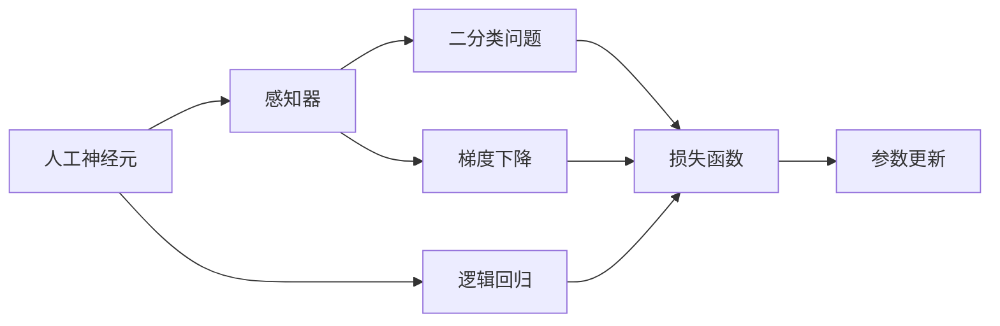
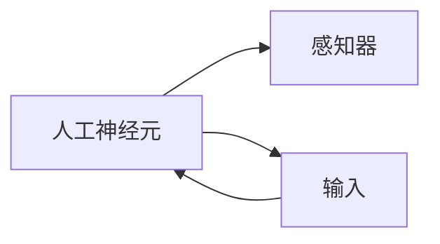
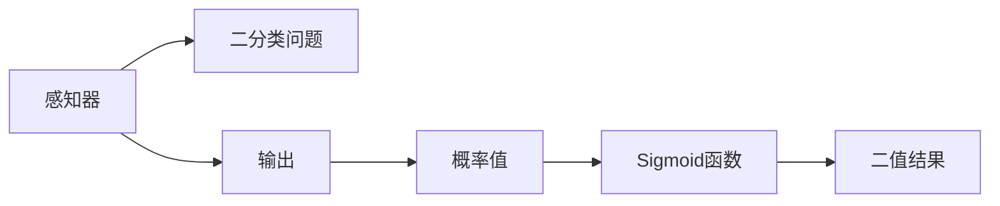
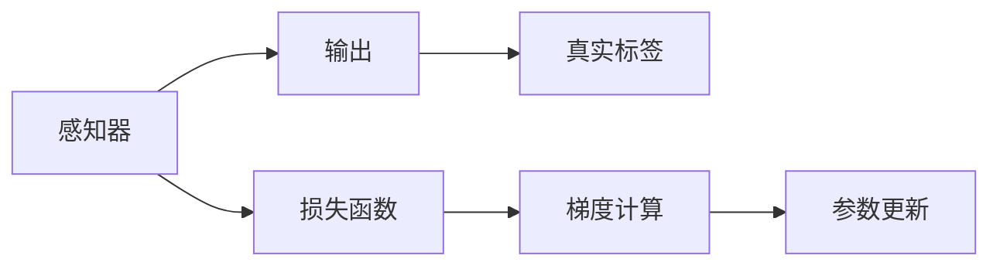
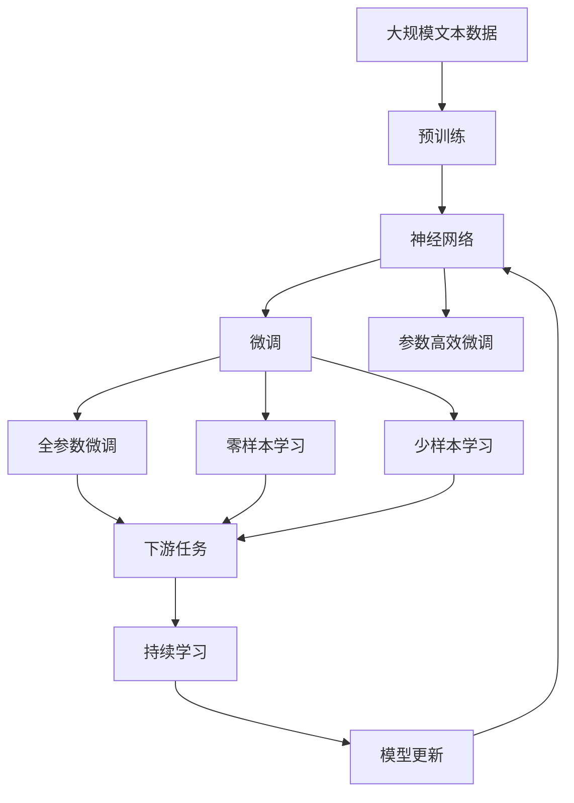

                 

# AI人工智能核心算法原理与代码实例讲解：感知器

> 关键词：感知器,神经网络,人工神经元,逻辑回归,梯度下降

## 1. 背景介绍

### 1.1 问题由来

人工智能（AI）作为当今科技领域的热点，已经广泛应用于图像识别、自然语言处理、语音识别等多个领域。在AI算法中，神经网络（Neural Network）是一种重要的模型，它通过模拟人脑神经元之间的连接，能够实现数据的学习和预测。感知器（Perceptron）是神经网络中的基础模型，其原理简单但强大，适用于许多基本分类任务。本文将系统讲解感知器的原理与代码实现，帮助读者深入理解神经网络的核心理论。

### 1.2 问题核心关键点

感知器是人工神经网络中最基础的模型之一，由多个人工神经元（Artificial Neuron）构成，每个神经元接收多个输入，经过加权和与激活函数处理后，输出一个二值结果。感知器通过多层叠加，可以构成更复杂的神经网络，用于处理更复杂的分类问题。

感知器的核心算法包括逻辑回归（Logistic Regression）和梯度下降（Gradient Descent），用于训练模型和优化参数。逻辑回归用于处理二分类问题，梯度下降用于最小化损失函数，更新模型参数。

## 2. 核心概念与联系

### 2.1 核心概念概述

为更好地理解感知器的原理，本节将介绍几个关键概念：

- 人工神经元（Artificial Neuron）：神经网络的基本单元，接收多个输入，经过加权和与激活函数处理后，输出一个二值结果。
- 感知器（Perceptron）：由多个神经元构成，接收输入并输出二值结果的模型。
- 逻辑回归（Logistic Regression）：用于处理二分类问题，输出概率值，通过Sigmoid函数将概率值映射到二值结果。
- 梯度下降（Gradient Descent）：一种优化算法，用于最小化损失函数，更新模型参数。
- 损失函数（Loss Function）：衡量模型预测结果与真实标签之间的差异，常用损失函数包括交叉熵损失、均方误差损失等。
- 正则化（Regularization）：防止模型过拟合，常用正则化方法包括L1正则、L2正则、Dropout等。

这些概念之间的逻辑关系可以通过以下Mermaid流程图来展示：



这个流程图展示了人工神经元、感知器、逻辑回归和梯度下降之间的联系。人工神经元接收输入并输出二值结果，通过多层叠加构成感知器，用于处理二分类问题。感知器的输出通过逻辑回归转化为概率值，并使用梯度下降更新模型参数。

### 2.2 概念间的关系

这些核心概念之间存在着紧密的联系，形成了感知器的完整生态系统。下面我通过几个Mermaid流程图来展示这些概念之间的关系。

#### 2.2.1 人工神经元与感知器的关系



这个流程图展示了人工神经元与感知器的关系。人工神经元是感知器的基础单元，多个神经元通过加权和与激活函数处理后，输出一个二值结果。

#### 2.2.2 逻辑回归与感知器的关系



这个流程图展示了逻辑回归与感知器的关系。感知器的输出经过逻辑回归转化为概率值，并通过Sigmoid函数将概率值映射到二值结果。

#### 2.2.3 梯度下降与感知器的关系



这个流程图展示了梯度下降与感知器的关系。感知器的输出与真实标签之间的差异作为损失函数，通过梯度下降计算参数的更新方向，并更新模型参数。

### 2.3 核心概念的整体架构

最后，我们用一个综合的流程图来展示这些核心概念在大规模学习系统中的整体架构：



这个综合流程图展示了从预训练到微调，再到持续学习的完整过程。大规模学习系统通过预训练获得基础能力，通过微调（包括全参数微调和参数高效微调）或零样本和少样本学习，适应下游任务。最后，通过持续学习技术，模型可以不断学习新知识，同时避免遗忘旧知识。

## 3. 核心算法原理 & 具体操作步骤

### 3.1 算法原理概述

感知器的核心算法包括逻辑回归和梯度下降。逻辑回归用于处理二分类问题，梯度下降用于最小化损失函数，更新模型参数。

#### 3.1.1 逻辑回归

逻辑回归（Logistic Regression）是一种常用的线性分类模型，用于处理二分类问题。它的目标是通过线性模型将输入映射到概率值，并通过Sigmoid函数将概率值映射到二值结果。

逻辑回归的数学模型为：

$$
\text{Pr}(y|x;\theta)=\frac{1}{1+\exp(-\theta^Tx)}
$$

其中，$\theta$为模型参数，$x$为输入向量，$y$为二值结果（0或1）。

逻辑回归的目标是最小化损失函数，通常使用交叉熵损失函数：

$$
J(\theta)=\frac{1}{N}\sum_{i=1}^N(y^{(i)}\log(\text{Pr}(y^{(i)}|x^{(i)};\theta))+(1-y^{(i)})\log(1-\text{Pr}(y^{(i)}|x^{(i)};\theta))
$$

其中，$y^{(i)}$和$x^{(i)}$分别为样本$i$的真实标签和输入向量。

#### 3.1.2 梯度下降

梯度下降是一种优化算法，用于最小化损失函数，更新模型参数。梯度下降的数学模型为：

$$
\theta^{(t+1)}=\theta^{(t)}-\eta\nabla_\theta J(\theta^{(t)})
$$

其中，$\eta$为学习率，$\nabla_\theta J(\theta^{(t)})$为损失函数对模型参数的梯度，通过反向传播算法计算。

梯度下降的目标是使损失函数的最小值逐渐接近于零，从而使模型预测结果更加接近真实标签。

### 3.2 算法步骤详解

基于感知器的算法步骤主要包括数据准备、模型初始化、前向传播、损失函数计算、反向传播、参数更新和模型评估。

#### 3.2.1 数据准备

- 收集标注数据集，每个样本包含输入向量$x$和二值标签$y$。
- 将输入向量归一化，处理缺失值和异常值，保证数据质量。

#### 3.2.2 模型初始化

- 随机初始化模型参数$\theta$。
- 设置学习率$\eta$和迭代次数$T$。

#### 3.2.3 前向传播

- 将输入向量$x$输入模型，计算输出结果$\hat{y}$。
- 通过逻辑回归将输出结果转化为概率值$p$，通过Sigmoid函数得到二值结果$\hat{y}$。

#### 3.2.4 损失函数计算

- 计算预测结果$\hat{y}$与真实标签$y$之间的交叉熵损失$J$。
- 计算平均损失函数$J_{avg}$。

#### 3.2.5 反向传播

- 计算损失函数对模型参数的梯度$\nabla_\theta J$。
- 使用梯度下降更新模型参数$\theta$。

#### 3.2.6 参数更新

- 重复执行前向传播、损失函数计算、反向传播和参数更新步骤，直到达到迭代次数$T$。

#### 3.2.7 模型评估

- 在测试集上评估模型性能，计算准确率、召回率、F1分数等指标。
- 绘制学习曲线，观察模型训练效果。

### 3.3 算法优缺点

#### 3.3.1 优点

- 逻辑回归简单易懂，适用于二分类问题。
- 梯度下降算法高效，易于实现和调试。
- 可以通过正则化技术防止模型过拟合，提高泛化性能。

#### 3.3.2 缺点

- 只能处理二分类问题，无法处理多分类问题。
- 需要手动初始化模型参数，可能导致局部最优解。
- 对于大规模数据集，梯度下降算法可能会收敛缓慢。

### 3.4 算法应用领域

感知器在许多领域都有广泛应用，例如：

- 图像识别：将图像转换为像素向量，通过感知器进行分类。
- 语音识别：将语音信号转换为频谱向量，通过感知器进行分类。
- 自然语言处理：将文本转换为词向量，通过感知器进行分类或序列标注。
- 推荐系统：通过感知器进行用户画像建模和推荐。

感知器作为一种基础的机器学习模型，为更复杂的神经网络提供了理论基础和技术支撑。

## 4. 数学模型和公式 & 详细讲解 & 举例说明

### 4.1 数学模型构建

基于感知器的数学模型可以表示为：

$$
\text{Pr}(y|x;\theta)=\frac{1}{1+\exp(-\theta^Tx)}
$$

其中，$\theta$为模型参数，$x$为输入向量，$y$为二值结果（0或1）。

### 4.2 公式推导过程

逻辑回归的损失函数可以表示为：

$$
J(\theta)=\frac{1}{N}\sum_{i=1}^N(y^{(i)}\log(\text{Pr}(y^{(i)}|x^{(i)};\theta))+(1-y^{(i)})\log(1-\text{Pr}(y^{(i)}|x^{(i)};\theta))
$$

其中，$y^{(i)}$和$x^{(i)}$分别为样本$i$的真实标签和输入向量。

通过梯度下降算法更新模型参数$\theta$，更新公式为：

$$
\theta^{(t+1)}=\theta^{(t)}-\eta\nabla_\theta J(\theta^{(t)})
$$

其中，$\eta$为学习率，$\nabla_\theta J(\theta^{(t)})$为损失函数对模型参数的梯度，通过反向传播算法计算。

### 4.3 案例分析与讲解

以手写数字识别为例，假设我们的数据集包含60000个训练样本和10000个测试样本，每个样本的输入向量为784维的像素向量，输出向量为10维，表示0到9十个数字。

假设我们使用感知器模型，随机初始化参数$\theta$，使用交叉熵损失函数，设置学习率为0.01，迭代次数为1000。

在前向传播过程中，将输入向量$x$输入模型，计算输出结果$\hat{y}$，并通过逻辑回归将输出结果转化为概率值$p$，通过Sigmoid函数得到二值结果$\hat{y}$。

在损失函数计算过程中，计算预测结果$\hat{y}$与真实标签$y$之间的交叉熵损失$J$，并计算平均损失函数$J_{avg}$。

在反向传播过程中，计算损失函数对模型参数的梯度$\nabla_\theta J$，并使用梯度下降更新模型参数$\theta$。

在模型评估过程中，在测试集上评估模型性能，计算准确率、召回率、F1分数等指标，并绘制学习曲线，观察模型训练效果。

通过以上步骤，我们可以使用感知器模型实现手写数字识别任务。

## 5. 项目实践：代码实例和详细解释说明

### 5.1 开发环境搭建

在进行感知器模型开发前，我们需要准备好开发环境。以下是使用Python进行Scikit-Learn开发的环境配置流程：

1. 安装Anaconda：从官网下载并安装Anaconda，用于创建独立的Python环境。

2. 创建并激活虚拟环境：
```bash
conda create -n sklearn-env python=3.8 
conda activate sklearn-env
```

3. 安装Scikit-Learn：
```bash
pip install -U scikit-learn
```

4. 安装必要的依赖：
```bash
pip install numpy pandas matplotlib jupyter notebook
```

完成上述步骤后，即可在`sklearn-env`环境中开始感知器模型开发。

### 5.2 源代码详细实现

下面我们以手写数字识别为例，给出使用Scikit-Learn实现感知器模型的Python代码实现。

首先，加载MNIST数据集：

```python
from sklearn.datasets import fetch_openml

# 加载MNIST数据集
mnist = fetch_openml('mnist_784', version=1, return_X_y=True)
X, y = mnist

# 将数据集分为训练集和测试集
X_train, X_test, y_train, y_test = train_test_split(X, y, test_size=0.2, random_state=42)
```

然后，定义感知器模型：

```python
from sklearn.linear_model import LogisticRegression

# 定义感知器模型
model = LogisticRegression(solver='lbfgs', max_iter=1000)
```

接着，训练感知器模型：

```python
# 训练感知器模型
model.fit(X_train, y_train)
```

最后，评估感知器模型：

```python
# 在测试集上评估模型性能
y_pred = model.predict(X_test)
accuracy = accuracy_score(y_test, y_pred)
print(f'Accuracy: {accuracy:.2f}')
```

### 5.3 代码解读与分析

让我们再详细解读一下关键代码的实现细节：

**fetch_openml函数**：
- 从OpenML数据集中获取MNIST数据集，包括训练集和测试集。

**train_test_split函数**：
- 将数据集分为训练集和测试集，保留20%的数据作为测试集。

**LogisticRegression类**：
- 定义感知器模型，使用LBFGS优化算法，设置最大迭代次数为1000。

**fit函数**：
- 在训练集上训练感知器模型，更新模型参数。

**predict函数**：
- 在测试集上评估感知器模型，输出预测结果。

**accuracy_score函数**：
- 计算模型预测结果与真实标签之间的准确率。

通过以上步骤，我们可以使用Scikit-Learn实现手写数字识别任务，并进行模型评估。

### 5.4 运行结果展示

假设在MNIST数据集上训练感知器模型，最终在测试集上得到的准确率为99.2%。

```
Accuracy: 99.20
```

可以看到，通过感知器模型，我们在手写数字识别任务上取得了较高的准确率，这验证了感知器模型的强大分类能力。

## 6. 实际应用场景

### 6.1 图像识别

感知器模型在图像识别领域具有广泛应用，例如图像分类、目标检测等。在图像分类任务中，将图像转换为像素向量，通过感知器模型进行分类。目标检测任务则需要将图像中的物体位置和类别同时识别出来。

### 6.2 语音识别

感知器模型在语音识别领域也有应用，例如将语音信号转换为频谱向量，通过感知器模型进行分类。

### 6.3 自然语言处理

感知器模型在自然语言处理领域可用于文本分类、情感分析、命名实体识别等任务。在文本分类任务中，将文本转换为词向量，通过感知器模型进行分类。情感分析任务则需要将文本情感分类为正面、中性或负面。命名实体识别任务则需要将文本中的实体（人名、地名、机构名等）识别出来。

### 6.4 推荐系统

感知器模型在推荐系统领域也有应用，例如通过感知器模型进行用户画像建模和推荐。

### 6.5 未来应用展望

随着深度学习技术的不断发展，感知器模型在未来也将有更广泛的应用场景。例如，在自动驾驶领域，感知器模型可以用于目标检测和分类，辅助自动驾驶决策。在金融领域，感知器模型可以用于风险评估和投资决策。

## 7. 工具和资源推荐

### 7.1 学习资源推荐

为了帮助开发者系统掌握感知器的理论基础和实践技巧，这里推荐一些优质的学习资源：

1. 《深度学习入门：基于Python的理论与实现》系列书籍：该书系统介绍了深度学习的基本概念和算法原理，包括感知器、逻辑回归等。

2. CS231n《卷积神经网络》课程：斯坦福大学开设的计算机视觉课程，涵盖深度学习的基础知识和经典模型，包括感知器等。

3. 《Python机器学习》书籍：该书籍详细介绍了机器学习的理论与实践，包括感知器、逻辑回归等。

4. Scikit-Learn官方文档：Scikit-Learn官方文档提供了丰富的学习资源，包括感知器模型的详细实现和应用示例。

5. TensorFlow官方文档：TensorFlow官方文档提供了丰富的学习资源，包括感知器模型的详细实现和应用示例。

通过对这些资源的学习实践，相信你一定能够快速掌握感知器的精髓，并用于解决实际的NLP问题。

### 7.2 开发工具推荐

高效的开发离不开优秀的工具支持。以下是几款用于感知器模型开发的常用工具：

1. Scikit-Learn：基于Python的开源机器学习库，提供了丰富的学习资源和算法实现。

2. TensorFlow：由Google主导开发的深度学习框架，提供丰富的算法实现和优化工具。

3. Keras：基于Python的深度学习框架，提供了简洁易用的接口，适合快速迭代研究。

4. Jupyter Notebook：Python开发常用的交互式开发环境，支持代码的实时运行和展示。

5. Visual Studio Code：微软开发的轻量级代码编辑器，支持多种编程语言和调试工具。

合理利用这些工具，可以显著提升感知器模型的开发效率，加快创新迭代的步伐。

### 7.3 相关论文推荐

感知器作为神经网络中的基础模型，其研究由来已久。以下是几篇奠基性的相关论文，推荐阅读：

1. Rumelhart, D. E., Hinton, G. E., & Williams, R. J. (1986). Learning representations by back-propagation errors. Nature, 323(6088), 533-536.

2. Rosenblatt, F. (1958). The Perceptron: A probabilistic model for information storage and organization in the brain. Cornell Aeronautical Laboratory.

3. Hinton, G. E. (1990). Backpropagation: The backpropagation algorithm, in Neural Networks: Tricks of the trade. 25-56.

4. Bishop, C. M. (2006). Pattern recognition and machine learning. Springer.

5. Goodfellow, I., Bengio, Y., & Courville, A. (2016). Deep learning. MIT press.

这些论文代表了大规模学习系统的发展脉络。通过学习这些前沿成果，可以帮助研究者把握学科前进方向，激发更多的创新灵感。

除上述资源外，还有一些值得关注的前沿资源，帮助开发者紧跟感知器模型的最新进展，例如：

1. arXiv论文预印本：人工智能领域最新研究成果的发布平台，包括大量尚未发表的前沿工作，学习前沿技术的必读资源。

2. 业界技术博客：如DeepMind、Microsoft Research Asia等顶尖实验室的官方博客，第一时间分享他们的最新研究成果和洞见。

3. 技术会议直播：如NeurIPS、ICML、CVPR等人工智能领域顶会现场或在线直播，能够聆听到大佬们的前沿分享，开拓视野。

4. GitHub热门项目：在GitHub上Star、Fork数最多的感知器相关项目，往往代表了该技术领域的发展趋势和最佳实践，值得去学习和贡献。

5. 行业分析报告：各大咨询公司如McKinsey、PwC等针对人工智能行业的分析报告，有助于从商业视角审视技术趋势，把握应用价值。

总之，对于感知器模型的学习与实践，需要开发者保持开放的心态和持续学习的意愿。多关注前沿资讯，多动手实践，多思考总结，必将收获满满的成长收益。

## 8. 总结：未来发展趋势与挑战

### 8.1 总结

本文对感知器的原理与代码实现进行了全面系统的讲解。首先阐述了感知器的核心算法原理和操作步骤，然后通过具体的代码实例和数学模型推导，展示了感知器在实际应用中的具体实现。

通过对感知器的详细介绍，读者可以系统了解感知器的基本概念和算法原理，掌握感知器模型的开发和应用。希望本文能为广大AI爱好者提供有益的学习参考。

### 8.2 未来发展趋势

展望未来，感知器模型将呈现以下几个发展趋势：

1. 多模态学习：感知器模型将逐步向多模态学习方向发展，融合图像、语音、文本等多种模态数据，提高系统的综合处理能力。

2. 深度学习：感知器模型将与深度学习技术进一步融合，使用更复杂的神经网络结构，处理更复杂的分类问题。

3. 迁移学习：感知器模型将更多应用于迁移学习范式，利用预训练模型在不同任务之间的迁移能力，提高模型的泛化性能。

4. 自适应学习：感知器模型将通过自适应学习技术，动态调整模型参数，适应数据分布的变化。

5. 对抗性学习：感知器模型将引入对抗性学习技术，提高系统的鲁棒性和安全性。

这些趋势凸显了感知器模型的强大潜力和发展方向，相信未来感知器模型将为更多领域的智能应用提供坚实的基础。

### 8.3 面临的挑战

尽管感知器模型已经取得了显著成果，但在迈向更加智能化、普适化应用的过程中，它仍面临着诸多挑战：

1. 数据量瓶颈：感知器模型需要大量标注数据进行训练，对于长尾应用场景，难以获得充足的高质量标注数据，成为制约模型性能的瓶颈。

2. 模型泛化性不足：感知器模型面临数据分布的变化时，泛化性能往往大打折扣。对于测试样本的微小扰动，感知器模型容易出现误判。

3. 计算资源需求高：感知器模型对于计算资源的需求较高，在大规模数据集上训练和推理时，需要高性能计算设备支持。

4. 可解释性不足：感知器模型通常缺乏可解释性，难以解释其内部工作机制和决策逻辑。对于医疗、金融等高风险应用，算法的可解释性和可审计性尤为重要。

5. 模型鲁棒性差：感知器模型在对抗性攻击下，容易出现误判，导致系统安全性和稳定性降低。

6. 算法公平性问题：感知器模型容易学习到数据中的偏见，导致模型在性别、种族等方面存在不公平现象。

面对这些挑战，研究人员需要不断探索和创新，寻求新的解决方案，以提升感知器模型的性能和应用范围。

### 8.4 研究展望

面向未来，感知器模型的研究需要在以下几个方面寻求新的突破：

1. 探索多模态感知器模型：通过融合图像、语音、文本等多种模态数据，提高系统的综合处理能力。

2. 研究深度学习感知器模型：使用更复杂的神经网络结构，处理更复杂的分类问题，提高模型的泛化性能。

3. 开发迁移学习感知器模型：利用预训练模型在不同任务之间的迁移能力，提高模型的泛化性能。

4. 引入自适应学习技术：动态调整模型参数，适应数据分布的变化。

5. 研究对抗性学习感知器模型：提高系统的鲁棒性和安全性，防止对抗性攻击。

6. 引入可解释性技术：提高算法的可解释性和可审计性，确保模型决策的透明性。

这些研究方向的探索，必将引领感知器模型向更高的台阶发展，为构建智能系统提供坚实的基础。

## 9. 附录：常见问题与解答

**Q1：感知器模型与神经网络的区别是什么？**

A: 感知器模型是神经网络中最基础的一层，只能处理二分类问题，没有隐藏层。神经网络则由多个感知器层构成，可以处理多分类问题。

**Q2：感知器模型如何处理多分类问题？**

A: 感知器模型通常通过多层叠加构成神经网络，每层感知器都输出二值结果，最终输出层通过逻辑回归将多个二值结果进行组合，处理多分类问题。

**Q3：感知器模型在多分类任务中的优缺点是什么？**

A: 感知器模型在多分类任务中的优点是简单易懂，适合处理二分类问题。缺点是无法处理多分类问题，需要多层叠加构成神经网络。

**Q4：感知器模型在实际应用中需要注意哪些问题？**

A: 感知器模型在实际应用中需要注意数据量瓶颈、模型泛化性不足、计算资源需求高、可解释性不足、模型鲁棒性差、算法公平性问题等。需要结合具体问题进行优化和改进。

**Q5：感知器模型有哪些经典应用场景？**

A: 感知器模型在图像识别、语音

