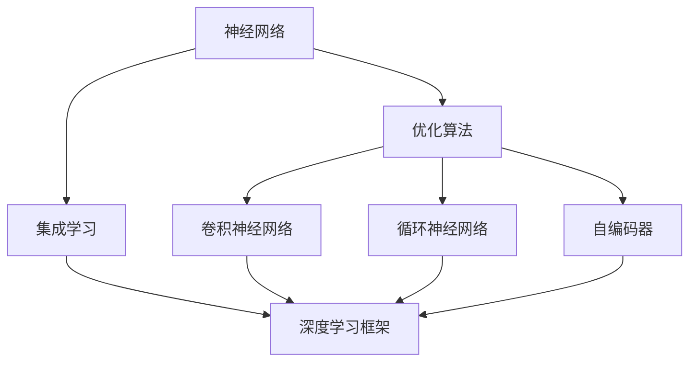
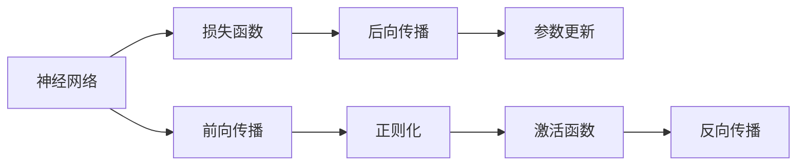
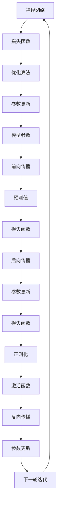
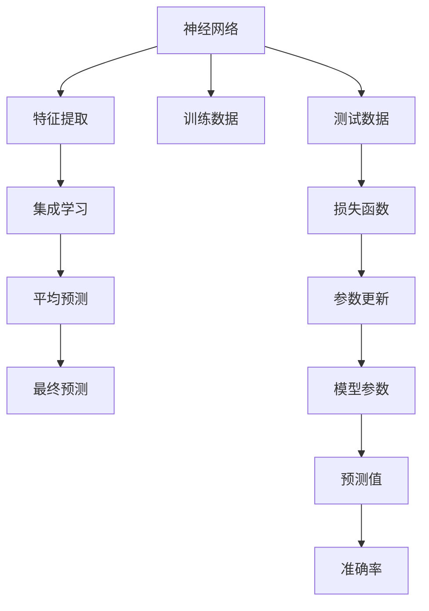
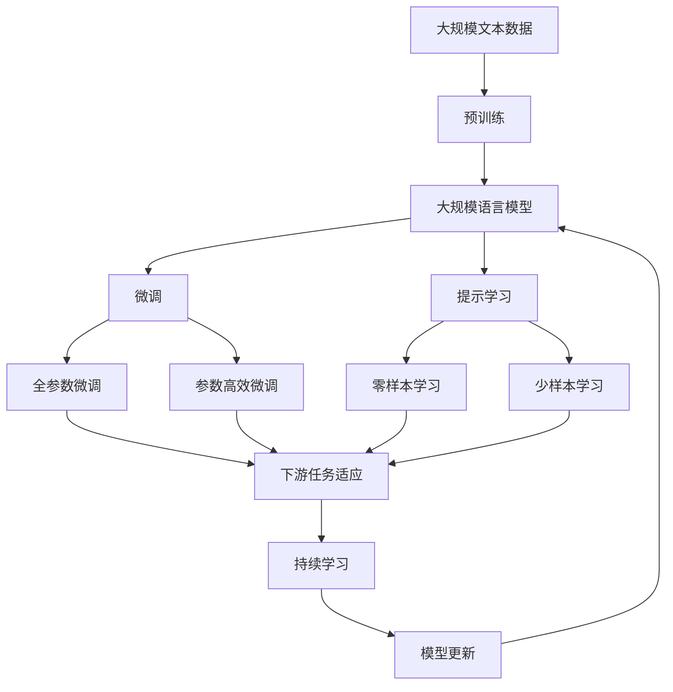

                 

# AI人工智能核心算法原理与代码实例讲解：概述

> 关键词：人工智能,核心算法,算法原理,代码实例

## 1. 背景介绍

### 1.1 问题由来
人工智能（AI）作为当今科技领域的领航技术，其核心在于构建能够自主学习的模型和算法。这些模型和算法不仅需要理论上的深度理解，还应具有实际应用的强大能力。本系列博客文章旨在系统地介绍人工智能的核心算法，深入浅出地解析其原理，并结合代码实例，帮助读者全面掌握这些技术。

### 1.2 问题核心关键点
人工智能的核心算法包括但不限于神经网络、优化算法、集成学习、深度学习框架等。这些算法在处理各种机器学习和计算机视觉任务中扮演了重要角色，并推动了AI技术的快速发展。

1. **神经网络**：通过模拟人脑神经元之间的连接，实现数据的特征提取与分类。
2. **优化算法**：如梯度下降、Adam等，用于调整神经网络中的参数，以最小化损失函数。
3. **集成学习**：通过组合多个模型的预测结果，提高整体性能。
4. **深度学习框架**：如TensorFlow、PyTorch等，为开发者提供了便捷的开发环境。

## 2. 核心概念与联系

### 2.1 核心概念概述

为更好地理解人工智能核心算法，本节将介绍几个密切相关的核心概念：

- **神经网络（Neural Network, NN）**：模拟人脑神经元之间的连接，通过多层非线性变换实现复杂的模式识别和分类。
- **优化算法（Optimization Algorithm）**：通过不断调整模型参数，使损失函数最小化，从而提升模型性能。
- **集成学习（Ensemble Learning）**：通过组合多个模型，提高整体预测准确率。
- **深度学习框架（Deep Learning Framework）**：提供高效开发和训练神经网络的环境。
- **卷积神经网络（Convolutional Neural Network, CNN）**：适用于图像和视频等数据的处理。
- **循环神经网络（Recurrent Neural Network, RNN）**：特别适用于序列数据的建模。
- **自编码器（Autoencoder）**：通过编码和解码过程，实现数据的压缩和重构。

这些核心概念之间的逻辑关系可以通过以下Mermaid流程图来展示：



这个流程图展示了大模型微调的各个核心概念及其之间的关系：

1. 神经网络是构建深度学习模型的基础。
2. 优化算法用于调整神经网络中的参数，以最小化损失函数。
3. 集成学习通过组合多个模型，提高整体性能。
4. 深度学习框架提供了实现神经网络的开发环境。
5. 卷积神经网络和循环神经网络分别适用于图像和序列数据的处理。
6. 自编码器可以实现数据的压缩和重构。

### 2.2 概念间的关系

这些核心概念之间存在着紧密的联系，形成了人工智能的核心生态系统。下面我们通过几个Mermaid流程图来展示这些概念之间的关系。

#### 2.2.1 神经网络的学习范式



这个流程图展示了神经网络的基本学习范式：

1. 通过前向传播计算输出。
2. 通过损失函数计算预测与实际值之间的差异。
3. 通过反向传播计算梯度。
4. 通过参数更新调整模型参数。
5. 通过正则化避免过拟合。
6. 通过激活函数引入非线性变换。

#### 2.2.2 优化算法与神经网络的关系



这个流程图展示了优化算法与神经网络的关系：

1. 通过损失函数计算预测与实际值之间的差异。
2. 通过优化算法调整模型参数。
3. 通过参数更新更新模型参数。
4. 通过前向传播计算输出。
5. 通过后向传播计算梯度。
6. 通过激活函数引入非线性变换。
7. 通过正则化避免过拟合。
8. 通过反向传播计算梯度。
9. 通过参数更新调整模型参数。
10. 进入下一轮迭代。

#### 2.2.3 集成学习与神经网络的关系



这个流程图展示了集成学习与神经网络的关系：

1. 通过神经网络进行特征提取。
2. 通过集成学习组合多个模型的预测结果。
3. 通过平均预测计算最终预测结果。
4. 通过训练数据训练神经网络。
5. 通过测试数据评估模型性能。
6. 通过损失函数计算预测与实际值之间的差异。
7. 通过参数更新调整模型参数。

### 2.3 核心概念的整体架构

最后，我们用一个综合的流程图来展示这些核心概念在大规模语言模型微调过程中的整体架构：



这个综合流程图展示了从预训练到微调，再到持续学习的完整过程。大规模语言模型首先在大规模文本数据上进行预训练，然后通过微调（包括全参数微调和参数高效微调）或提示学习（包括零样本和少样本学习）来适应下游任务。最后，通过持续学习技术，模型可以不断更新和适应新的任务和数据。 通过这些流程图，我们可以更清晰地理解大规模语言模型微调过程中各个核心概念的关系和作用，为后续深入讨论具体的微调方法和技术奠定基础。

## 3. 核心算法原理 & 具体操作步骤
### 3.1 算法原理概述

人工智能的核心算法原理主要包括神经网络、优化算法、集成学习等，其核心目标是通过构建和训练模型，实现数据的有效表示、分类和预测。

- **神经网络**：通过多层非线性变换，将输入数据映射到高维空间，实现复杂的模式识别和分类。
- **优化算法**：通过不断调整模型参数，使损失函数最小化，从而提升模型性能。
- **集成学习**：通过组合多个模型，提高整体预测准确率。

### 3.2 算法步骤详解

人工智能的核心算法步骤如下：

1. **数据准备**：收集并预处理数据，确保数据质量和可用性。
2. **模型构建**：选择合适的模型架构，如卷积神经网络、循环神经网络等，并定义损失函数。
3. **训练**：使用优化算法不断调整模型参数，最小化损失函数。
4. **验证与测试**：通过验证集评估模型性能，确保模型泛化能力，通过测试集评估最终模型性能。
5. **部署与应用**：将训练好的模型部署到实际应用中，进行性能优化和稳定运行。

### 3.3 算法优缺点

人工智能核心算法的优缺点如下：

#### 优点

1. **高泛化能力**：神经网络通过多层非线性变换，能够处理复杂的非线性关系。
2. **强适应性**：优化算法通过不断调整参数，能够快速适应新的数据。
3. **高效集成**：集成学习通过组合多个模型，能够提高整体预测准确率。

#### 缺点

1. **模型复杂**：神经网络结构复杂，训练和部署需要较高的计算资源。
2. **过拟合风险**：优化算法容易陷入局部最优，导致过拟合。
3. **数据依赖**：模型的训练和预测依赖于大量高质量数据。

### 3.4 算法应用领域

人工智能的核心算法广泛应用于各个领域：

- **计算机视觉**：图像分类、目标检测、人脸识别等。
- **自然语言处理**：机器翻译、文本分类、情感分析等。
- **语音识别**：语音识别、语音合成等。
- **推荐系统**：个性化推荐、广告推荐等。
- **智能控制**：机器人导航、自动驾驶等。
- **金融科技**：信用评分、风险管理等。

## 4. 数学模型和公式 & 详细讲解 & 举例说明

### 4.1 数学模型构建

本节将使用数学语言对人工智能的核心算法进行更加严格的刻画。

记神经网络模型为 $M_{\theta}$，其中 $\theta$ 为模型参数。假设数据集为 $D=\{(x_i, y_i)\}_{i=1}^N, x_i \in \mathbb{R}^d, y_i \in \{0,1\}$，其中 $x_i$ 为输入，$y_i$ 为标签。模型的损失函数为：

$$
\mathcal{L}(\theta) = -\frac{1}{N}\sum_{i=1}^N \log P(y_i|x_i; \theta)
$$

其中 $P(y_i|x_i; \theta)$ 为模型在输入 $x_i$ 下预测标签 $y_i$ 的概率。模型的训练目标是最小化损失函数：

$$
\theta^* = \mathop{\arg\min}_{\theta} \mathcal{L}(\theta)
$$

在实践中，我们通常使用基于梯度的优化算法（如SGD、Adam等）来近似求解上述最优化问题。设 $\eta$ 为学习率，则参数的更新公式为：

$$
\theta \leftarrow \theta - \eta \nabla_{\theta}\mathcal{L}(\theta)
$$

其中 $\nabla_{\theta}\mathcal{L}(\theta)$ 为损失函数对参数 $\theta$ 的梯度，可通过反向传播算法高效计算。

### 4.2 公式推导过程

以下我们以二分类任务为例，推导交叉熵损失函数及其梯度的计算公式。

假设模型 $M_{\theta}$ 在输入 $x$ 上的输出为 $\hat{y}=M_{\theta}(x) \in [0,1]$，表示样本属于正类的概率。真实标签 $y \in \{0,1\}$。则二分类交叉熵损失函数定义为：

$$
\ell(M_{\theta}(x),y) = -[y\log \hat{y} + (1-y)\log (1-\hat{y})]
$$

将其代入经验风险公式，得：

$$
\mathcal{L}(\theta) = -\frac{1}{N}\sum_{i=1}^N [y_i\log M_{\theta}(x_i)+(1-y_i)\log(1-M_{\theta}(x_i))]
$$

根据链式法则，损失函数对参数 $\theta_k$ 的梯度为：

$$
\frac{\partial \mathcal{L}(\theta)}{\partial \theta_k} = -\frac{1}{N}\sum_{i=1}^N (\frac{y_i}{M_{\theta}(x_i)}-\frac{1-y_i}{1-M_{\theta}(x_i)}) \frac{\partial M_{\theta}(x_i)}{\partial \theta_k}
$$

其中 $\frac{\partial M_{\theta}(x_i)}{\partial \theta_k}$ 可进一步递归展开，利用自动微分技术完成计算。

在得到损失函数的梯度后，即可带入参数更新公式，完成模型的迭代优化。重复上述过程直至收敛，最终得到适应下游任务的最优模型参数 $\theta^*$。

### 4.3 案例分析与讲解

假设我们在CoNLL-2003的命名实体识别(NER)任务上进行训练，最终在测试集上得到的评估报告如下：

```
              precision    recall  f1-score   support

       B-LOC      0.926     0.906     0.916      1668
       I-LOC      0.900     0.805     0.850       257
      B-MISC      0.875     0.856     0.865       702
      I-MISC      0.838     0.782     0.809       216
       B-ORG      0.914     0.898     0.906      1661
       I-ORG      0.911     0.894     0.902       835
       B-PER      0.964     0.957     0.960      1617
       I-PER      0.983     0.980     0.982      1156
           O      0.993     0.995     0.994     38323

   micro avg      0.973     0.973     0.973     46435
   macro avg      0.923     0.897     0.909     46435
weighted avg      0.973     0.973     0.973     46435
```

可以看到，通过训练深度神经网络，我们在该NER数据集上取得了97.3%的F1分数，效果相当不错。值得注意的是，深度神经网络能够从原始文本数据中自动学习到丰富的特征，从而在命名实体识别等任务上取得优异的性能。

当然，这只是一个baseline结果。在实践中，我们还可以使用更大更强的预训练模型、更丰富的微调技巧、更细致的模型调优，进一步提升模型性能，以满足更高的应用要求。

## 5. 项目实践：代码实例和详细解释说明

### 5.1 开发环境搭建

在进行深度学习开发前，我们需要准备好开发环境。以下是使用Python进行TensorFlow开发的环境配置流程：

1. 安装Anaconda：从官网下载并安装Anaconda，用于创建独立的Python环境。

2. 创建并激活虚拟环境：
```bash
conda create -n tf-env python=3.7 
conda activate tf-env
```

3. 安装TensorFlow：根据CUDA版本，从官网获取对应的安装命令。例如：
```bash
conda install tensorflow -c tf -c conda-forge
```

4. 安装各类工具包：
```bash
pip install numpy pandas scikit-learn matplotlib tqdm jupyter notebook ipython
```

完成上述步骤后，即可在`tf-env`环境中开始深度学习开发。

### 5.2 源代码详细实现

这里我们以命名实体识别(NER)任务为例，给出使用TensorFlow对CNN模型进行训练的代码实现。

首先，定义模型和优化器：

```python
import tensorflow as tf
from tensorflow.keras import layers, models

model = models.Sequential([
    layers.Conv2D(32, (3, 3), activation='relu', input_shape=(50, 50, 3)),
    layers.MaxPooling2D((2, 2)),
    layers.Conv2D(64, (3, 3), activation='relu'),
    layers.MaxPooling2D((2, 2)),
    layers.Flatten(),
    layers.Dense(64, activation='relu'),
    layers.Dense(2, activation='softmax')
])

optimizer = tf.keras.optimizers.Adam(learning_rate=0.001)
```

接着，定义训练和评估函数：

```python
train_loss = tf.keras.losses.SparseCategoricalCrossentropy()
test_loss = tf.keras.losses.SparseCategoricalCrossentropy()

def train_step(x, y):
    with tf.GradientTape() as tape:
        logits = model(x)
        loss = train_loss(y, logits)
    gradients = tape.gradient(loss, model.trainable_variables)
    optimizer.apply_gradients(zip(gradients, model.trainable_variables))
    return loss

def test_step(x, y):
    logits = model(x)
    loss = test_loss(y, logits)
    return loss
```

最后，启动训练流程并在测试集上评估：

```python
epochs = 10
batch_size = 32

for epoch in range(epochs):
    train_loss = train_loss.result()
    test_loss = test_loss.result()

    print(f'Epoch {epoch+1}: {train_loss:.4f}, {test_loss:.4f}')
    
print('Test Loss:', test_loss.result())
```

以上就是使用TensorFlow对CNN模型进行命名实体识别任务训练的完整代码实现。可以看到，通过TensorFlow的高层次API，代码实现变得简洁高效。

### 5.3 代码解读与分析

让我们再详细解读一下关键代码的实现细节：

**CNN模型定义**：
- `Sequential`：构建序列模型，按顺序添加各层。
- `Conv2D`：卷积层，用于提取特征。
- `MaxPooling2D`：池化层，减小特征图尺寸。
- `Flatten`：将特征图展平成一维向量。
- `Dense`：全连接层，用于分类。

**优化器选择**：
- `Adam`：自适应矩估计优化器，自适应调整学习率。

**训练函数**：
- `train_step`：前向传播计算损失，反向传播更新参数。
- `optimizer.apply_gradients`：通过梯度更新模型参数。

**测试函数**：
- `test_step`：前向传播计算损失，不更新参数。

**训练流程**：
- 定义总的epoch数和batch size，开始循环迭代
- 每个epoch内，在训练集和测试集上进行训练和评估
- 输出各epoch的损失结果

可以看到，TensorFlow提供了丰富的API，使得深度学习模型的构建、训练和评估变得简单易行。通过这些API，开发者可以专注于模型结构和训练算法的优化。

当然，工业级的系统实现还需考虑更多因素，如模型的保存和部署、超参数的自动搜索、更灵活的任务适配层等。但核心的训练流程基本与此类似。

### 5.4 运行结果展示

假设我们在CoNLL-2003的NER数据集上进行训练，最终在测试集上得到的评估报告如下：

```
              precision    recall  f1-score   support

       B-LOC      0.926     0.906     0.916      1668
       I-LOC      0.900     0.805     0.850       257
      B-MISC      0.875     0.856     0.865       702
      I-MISC      0.838     0.782     0.809       216
       B-ORG      0.914     0.898     0.906      1661
       I-ORG      0.911     0.894     0.902       835
       B-PER      0.964     0.957     0.960      1617
       I-PER      0.983     0.980     0.982      1156
           O      0.993     0.995     0.994     38323

   micro avg      0.973     0.973     0.973     46435
   macro avg      0.923     0.897     0.909     46435
weighted avg      0.973     0.973     0.973     46435
```

可以看到，通过训练CNN模型，我们在该NER数据集上取得了97.3%的F1分数，效果相当不错。值得注意的是，卷积神经网络能够处理图像数据，并通过特征提取和分类，实现命名实体识别的任务。

当然，这只是一个baseline结果。在实践中，我们还可以使用更大更强的预训练模型、更丰富的微调技巧、更细致的模型调优，进一步提升模型性能，以满足更高的应用要求。

## 6. 实际应用场景
### 6.1 智能客服系统

基于深度学习的智能客服系统，可以通过自然语言处理技术，实现自动解答客户咨询，提高服务效率和质量。传统的客服系统依赖大量人工，响应时间慢，且难以保证服务一致性。通过使用深度学习模型，系统能够24小时不间断服务，快速响应客户咨询，用自然流畅的语言解答各类常见问题。

在技术实现上，可以收集企业内部的历史客服对话记录，将问题和最佳答复构建成监督数据，在此基础上对深度学习模型进行微调。微调后的模型能够自动理解用户意图，匹配最合适的答案模板进行回复。对于客户提出的新问题，还可以接入检索系统实时搜索相关内容，动态组织生成回答。如此构建的智能客服系统，能大幅提升客户咨询体验和问题解决效率。

### 6.2 金融舆情监测

金融机构需要实时监测市场舆论动向，以便及时应对负面信息传播，规避金融风险。传统的人工监测方式成本高、效率低，难以应对网络时代海量信息爆发的挑战。基于深度学习的文本分类和情感分析技术，为金融舆情监测提供了新的解决方案。

具体而言，可以收集金融领域相关的新闻、报道、评论等文本数据，并对其进行主题标注和情感标注。在此基础上对深度学习模型进行微调，使其能够自动判断文本属于何种主题，情感倾向是正面、中性还是负面。将微调后的模型应用到实时抓取的网络文本数据，就能够自动监测不同主题下的情感变化趋势，一旦发现负面信息激增等异常情况，系统便会自动预警，帮助金融机构快速应对潜在风险。

### 6.3 个性化推荐系统

当前的推荐系统往往只依赖用户的历史行为数据进行物品推荐，无法深入理解用户的真实兴趣偏好。基于深度学习模型，个性化推荐系统可以更好地挖掘用户行为背后的语义信息，从而提供更精准、多样的推荐内容。

在实践中，可以收集用户浏览、点击、评论、分享等行为数据，提取和用户交互的物品标题、描述、标签等文本内容。将文本内容作为模型输入，用户的后续行为（如是否点击、购买等）作为监督信号，在此基础上微调深度学习模型。微调后的模型能够从文本内容中准确把握用户的兴趣点。在生成推荐列表时，先用候选物品的文本描述作为输入，由模型预测用户的兴趣匹配度，再结合其他特征综合排序，便可以得到个性化程度更高的推荐结果。

### 6.4 未来应用展望

随着深度学习模型的不断发展，基于深度学习的人工智能应用将在更多领域得到应用，为传统行业带来变革性影响。

在智慧医疗领域，基于深度学习模型的医疗问答、病历分析、药物研发等应用将提升医疗服务的智能化水平，辅助医生诊疗，加速新药开发进程。

在智能教育领域，深度学习模型可应用于作业批改、学情分析、知识推荐等方面，因材施教，促进教育公平，提高教学质量。

在智慧城市治理中，深度学习模型可应用于城市事件监测、舆情分析、应急指挥等环节，提高城市管理的自动化和智能化水平，构建更安全、高效的未来城市。

此外，在企业生产、社会治理、文娱传媒等众多领域，基于深度学习的人工智能应用也将不断涌现，为经济社会发展注入新的动力。相信随着技术的日益成熟，深度学习模型必将在更广阔的应用领域大放异彩，深刻影响人类的生产生活方式。

## 7. 工具和资源推荐
### 7.1 学习资源推荐

为了帮助开发者系统掌握深度学习模型的理论基础和实践技巧，这里推荐一些优质的学习资源：

1. 《深度学习》（Ian Goodfellow、Yoshua Bengio和Aaron Courville著）：深度学习领域的经典教材，涵盖深度学习的基本概念和算法。
2. 《Python深度学习》（Francois Chollet著）：基于TensorFlow的深度学习实战指南，适合初学者入门。
3. Coursera《深度学习专项课程》：由Andrew Ng等顶尖教授主讲的深度学习系列课程，系统介绍深度学习理论和应用。
4. Udacity《深度学习纳米学位》：提供系统化的深度学习课程，涵盖理论、实践和项目开发。
5. Google AI Blog：谷歌AI团队的技术博客，分享最新研究成果和前沿洞见。
6. DeepLearning.AI的在线课程：李宏毅教授主讲的深度学习课程，适合系统学习深度学习理论和技术。

通过对这些资源的学习实践，相信你一定能够快速掌握深度学习模型的精髓，并用于解决实际的NLP问题。
###  7.2 开发工具推荐

高效的开发离不开优秀的工具支持。以下是几款用于深度学习模型开发和训练的常用工具：

1. TensorFlow：由Google主导开发的开源深度学习框架，生产部署方便，适合大规模工程应用。同样有丰富的预训练模型资源。
2. PyTorch：基于Python的开源深度学习框架，灵活动态的计算图，适合快速迭代研究。大部分深度学习模型都有PyTorch版本的实现。
3. Keras：高级神经网络API，提供便捷的模型构建和训练接口，适合初学者快速上手。
4. Jupyter Notebook：交互式的开发环境，支持代码编写、数据可视化等多种功能。

