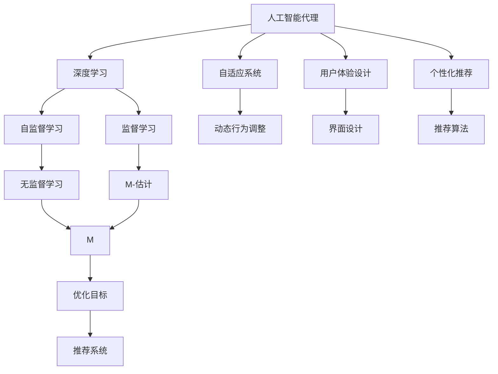
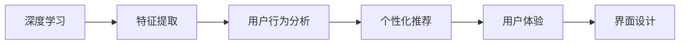
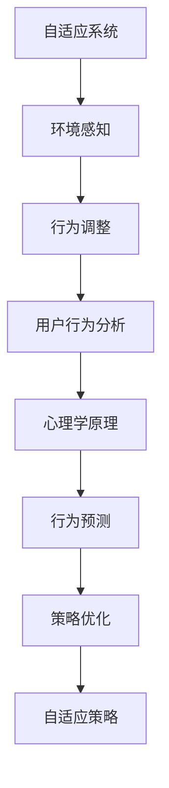
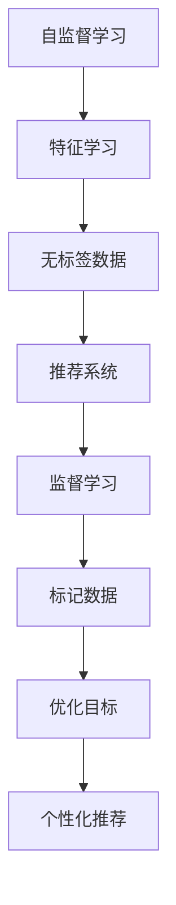
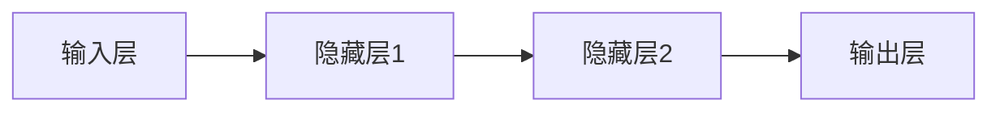

                 

# AI人工智能深度学习算法：人工智能深度学习代理与用户体验设计

> 关键词：人工智能(AI)，深度学习，用户体验设计，代理，自适应系统，个性化推荐

## 1. 背景介绍

### 1.1 问题由来
近年来，人工智能（AI）技术在各行各业的应用日趋广泛，特别是在深度学习领域，通过大规模数据和复杂模型的训练，AI系统在图像识别、自然语言处理、语音识别等任务上取得了令人瞩目的成果。然而，如何将这些智能技术无缝地整合到日常应用中，提升用户体验，成为一个亟待解决的问题。

人工智能代理（AI Agents）作为一种新兴的智能系统，被视为解决这一问题的关键。AI代理是指能够自主学习、适应环境变化并根据用户需求提供个性化服务的智能体。通过深度学习算法，AI代理能够从大量数据中学习用户行为模式和偏好，提供高度个性化的推荐和支持。本文将深入探讨AI代理的原理、设计与实践，并结合用户体验设计，提出一种新的深度学习算法，以期为AI代理系统的开发提供理论基础和实践指南。

### 1.2 问题核心关键点
本文的核心问题是如何设计一种深度学习算法，使AI代理系统能够根据用户行为和环境变化，自适应地调整其行为策略，提供最符合用户需求的个性化服务。主要包括以下几个方面：
- 如何在有限的标注数据上，训练AI代理从用户行为中学习个性化的推荐策略。
- 如何设计一种能够适应多变环境变化的自适应算法，提升AI代理的灵活性和鲁棒性。
- 如何结合用户体验设计，优化AI代理的用户界面，提升用户体验满意度。
- 如何结合心理学原理，设计能够引导用户行为，提升用户粘性的推荐策略。

这些核心问题涉及到深度学习算法的设计、用户行为分析、环境适应性以及用户体验优化等多个方面，需综合考虑才能构建出高效、鲁棒的AI代理系统。

### 1.3 问题研究意义
研究AI代理的深度学习算法，对于拓展AI技术的应用范围，提升用户体验，加速AI技术的产业化进程，具有重要意义：

1. **降低应用开发成本**：通过智能代理，可以显著减少从头开发所需的数据、计算和人力等成本投入。
2. **提升用户体验**：智能代理能够根据用户需求提供个性化服务，提升用户的满意度。
3. **加速开发进度**：智能代理通过学习和适应的方式，可以快速适应新任务，缩短开发周期。
4. **带来技术创新**：智能代理结合深度学习、心理学和用户体验设计等多领域知识，催生新的研究方向。
5. **赋能产业升级**：智能代理能够应用于各行各业，为传统行业数字化转型升级提供新的技术路径。

## 2. 核心概念与联系

### 2.1 核心概念概述

为更好地理解AI代理的深度学习算法，本节将介绍几个密切相关的核心概念：

- **人工智能代理（AI Agents）**：能够自主学习、适应环境变化，并根据用户需求提供个性化服务的智能体。
- **深度学习（Deep Learning）**：通过多层次神经网络结构，从大量数据中自动提取高级特征，实现复杂的模式识别和预测任务。
- **自适应系统（Adaptive Systems）**：能够根据环境变化动态调整其行为策略的系统。
- **用户体验设计（User Experience Design）**：通过设计用户界面和交互方式，提升用户满意度和使用体验的过程。
- **个性化推荐（Personalized Recommendation）**：根据用户历史行为和偏好，提供高度个性化的产品或服务推荐。
- **智能推荐系统（Intelligent Recommendation System）**：基于机器学习或深度学习的推荐系统，能够自动学习用户偏好并优化推荐结果。
- **心理学原理（Psychological Principles）**：理解人类行为和心理规律，指导设计更符合用户需求和行为习惯的系统。

这些核心概念之间的逻辑关系可以通过以下Mermaid流程图来展示：



这个流程图展示了大语言模型的核心概念及其之间的关系：

1. 人工智能代理通过深度学习学习用户行为模式，并进行个性化推荐。
2. 自适应系统能够根据环境变化动态调整其行为策略。
3. 用户体验设计通过设计用户界面和交互方式，提升用户体验满意度。
4. 心理学原理指导设计能够引导用户行为，提升用户粘性的推荐策略。
5. 自监督学习和监督学习是深度学习的两种常见学习方式。
6. 无监督学习和M-估计用于学习用户隐含的偏好和行为特征。
7. 推荐算法和优化目标一起构建推荐系统，提供个性化推荐服务。

这些核心概念共同构成了AI代理系统的学习和应用框架，使其能够在各种场景下提供个性化服务。通过理解这些核心概念，我们可以更好地把握AI代理的工作原理和优化方向。

### 2.2 概念间的关系

这些核心概念之间存在着紧密的联系，形成了AI代理系统的完整生态系统。下面我通过几个Mermaid流程图来展示这些概念之间的关系。

#### 2.2.1 深度学习与用户体验设计的关系



这个流程图展示了深度学习在用户行为分析和个性化推荐中的应用。深度学习算法通过特征提取，从大量数据中学习用户行为模式，生成个性化推荐结果，并通过用户体验设计优化推荐系统的界面，提升用户满意度。

#### 2.2.2 自适应系统与心理学原理的关系



这个流程图展示了自适应系统如何结合心理学原理，实现动态行为调整。自适应系统通过环境感知，实时分析用户行为，结合心理学原理进行行为预测和策略优化，生成动态调整的自适应策略。

#### 2.2.3 自监督学习与监督学习的关系



这个流程图展示了自监督学习与监督学习的关系。自监督学习从无标签数据中学习用户隐含的偏好和行为特征，而监督学习则利用标记数据优化推荐算法，生成个性化推荐结果。

### 2.3 核心概念的整体架构

最后，我们用一个综合的流程图来展示这些核心概念在大语言模型微调过程中的整体架构：

```mermaid
graph TB
    A[大规模文本数据] --> B[自监督学习]
    B --> C[深度学习模型]
    C --> D[监督学习]
    D --> E[推荐系统]
    E --> F[用户体验]
    F --> G[界面设计]
    G --> H[自适应策略]
    H --> I[行为调整]
    I --> J[行为预测]
    J --> K[策略优化]
    K --> L[用户行为分析]
    L --> M[心理学原理]
    M --> N[行为预测]
    N --> O[策略优化]
    O --> P[自适应策略]
    P --> Q[动态行为调整]
    Q --> R[个性化推荐]
    R --> S[用户行为分析]
    S --> T[心理学原理]
    T --> U[行为预测]
    U --> V[策略优化]
    V --> W[用户行为分析]
    W --> X[心理学原理]
    X --> Y[行为预测]
    Y --> Z[策略优化]
    Z --> AA[自适应策略]
    AA --> BB[动态行为调整]
    BB --> CC[个性化推荐]
    CC --> DD[用户体验]
    DD --> EE[界面设计]
    EE --> FF[自适应策略]
    FF --> GG[行为调整]
    GG --> HH[行为预测]
    HH --> II[策略优化]
    II --> JJ[用户行为分析]
    JJ --> KK[心理学原理]
    KK --> LL[行为预测]
    LL --> MM[策略优化]
    MM --> NN[自适应策略]
    NN --> OO[动态行为调整]
    OO --> PP[个性化推荐]
    PP --> QQ[用户行为分析]
    QQ --> RR[心理学原理]
    RR --> SS[行为预测]
    SS --> TT[策略优化]
    TT --> UU[用户行为分析]
    UU --> VV[心理学原理]
    VV --> WW[行为预测]
    WW --> XX[策略优化]
    XX --> YY[自适应策略]
    YY --> ZZ[动态行为调整]
    ZZ --> AA[个性化推荐]
    AA --> BB[用户体验]
    BB --> CC[界面设计]
```



这个综合流程图展示了从自监督学习到监督学习，再到推荐系统的完整过程。深度学习模型通过自监督学习获取用户隐含的偏好和行为特征，并通过监督学习优化推荐算法，生成个性化推荐结果。推荐系统结合用户体验设计，通过动态行为调整，提升用户体验满意度，同时结合心理学原理，设计能够引导用户行为，提升用户粘性的推荐策略。

## 3. 核心算法原理 & 具体操作步骤
### 3.1 算法原理概述

AI代理系统的核心算法原理主要基于深度学习，特别是神经网络和强化学习技术。其核心思想是通过深度神经网络模型，从大量用户行为数据中学习用户偏好和行为模式，并结合强化学习算法，不断调整行为策略，提供个性化的推荐服务。

具体来说，AI代理系统分为两个主要部分：策略学习和行为执行。策略学习通过深度神经网络模型，从用户行为数据中学习用户的隐含偏好和行为特征。行为执行则通过强化学习算法，动态调整行为策略，最大化用户满意度。

在策略学习中，深度神经网络模型通过反向传播算法，从大量标注数据中学习用户行为模式，生成推荐策略。在行为执行中，强化学习算法通过评估用户满意度，动态调整行为策略，以最大化用户满意度为目标，实现个性化推荐。

### 3.2 算法步骤详解

AI代理系统的构建主要包括以下几个关键步骤：

**Step 1: 准备数据集**
- 收集用户历史行为数据，包括浏览记录、购买记录、点击记录等。
- 对数据进行预处理，包括数据清洗、特征工程等。
- 将数据集分为训练集、验证集和测试集，进行交叉验证。

**Step 2: 设计深度学习模型**
- 选择适合的神经网络结构，如多层感知机、卷积神经网络、循环神经网络等。
- 设计合适的损失函数，如交叉熵损失、均方误差损失等。
- 选择适当的优化算法，如Adam、SGD等，设置学习率、批大小、迭代轮数等超参数。

**Step 3: 训练深度学习模型**
- 使用训练集数据，对深度学习模型进行训练，最小化损失函数。
- 在验证集上进行模型验证，选择性能最好的模型。
- 使用测试集对训练好的模型进行评估，评估指标包括准确率、召回率、F1分数等。

**Step 4: 设计强化学习算法**
- 定义行为空间和状态空间，确定行为执行策略。
- 定义奖励函数，根据用户满意度评估奖励。
- 选择适当的强化学习算法，如Q-learning、SARSA等。
- 设置探索率和最大迭代次数等超参数。

**Step 5: 训练强化学习算法**
- 使用训练好的深度学习模型，生成推荐策略。
- 使用强化学习算法，根据用户满意度，动态调整行为策略。
- 在验证集和测试集上进行行为策略的评估和优化。

**Step 6: 部署和优化**
- 将训练好的深度学习模型和强化学习算法集成到实际应用中。
- 根据用户反馈，持续优化推荐策略和行为策略。
- 定期更新数据集，重新训练深度学习模型和强化学习算法。

以上是AI代理系统的构建流程，通过深度学习算法和强化学习算法，AI代理能够不断学习用户的偏好和行为模式，动态调整行为策略，提供个性化的推荐服务。

### 3.3 算法优缺点

AI代理系统的核心算法具有以下优点：
- **高度个性化**：通过深度学习模型，AI代理能够根据用户行为模式，生成高度个性化的推荐结果。
- **自适应能力强**：结合强化学习算法，AI代理能够根据环境变化动态调整行为策略，适应不同用户需求。
- **多模态数据支持**：AI代理系统可以同时处理图像、文本、语音等多种模态数据，提供更全面的推荐服务。
- **实时性高**：AI代理系统可以在用户进行行为时，实时生成推荐结果，提升用户体验。

同时，该算法也存在一些缺点：
- **数据需求大**：构建AI代理系统需要大量的用户行为数据，数据收集和标注成本较高。
- **模型复杂度高**：深度学习模型和强化学习算法结构复杂，需要大量的计算资源和时间。
- **解释性差**：AI代理系统往往被视为"黑盒"，难以解释其内部决策过程，缺乏透明性。
- **模型鲁棒性不足**：AI代理系统面对复杂的用户行为和环境变化，可能出现模型泛化性不足的问题。

尽管存在这些局限性，但AI代理系统的核心算法仍然是目前实现个性化推荐和智能服务的最主流范式之一。

### 3.4 算法应用领域

AI代理系统的核心算法已在多个领域得到广泛应用，主要包括：

- **推荐系统**：如电商推荐、内容推荐、音乐推荐等。通过深度学习模型和强化学习算法，AI代理系统能够为用户推荐个性化的产品或内容，提升用户体验。
- **智能客服**：如智能客服机器人、智能助手等。通过深度学习模型，AI代理系统能够理解用户意图，提供个性化的服务支持。
- **金融服务**：如信用评分、风险评估、投资建议等。通过深度学习模型和强化学习算法，AI代理系统能够提供个性化的金融服务，提升用户满意度。
- **健康医疗**：如疾病诊断、医疗建议、健康管理等。通过深度学习模型和强化学习算法，AI代理系统能够提供个性化的健康管理服务，提升用户体验。
- **智能家居**：如智能音箱、智能电视等。通过深度学习模型和强化学习算法，AI代理系统能够提供个性化的家居服务，提升用户的生活品质。

此外，AI代理系统的核心算法还广泛应用于自然语言处理、计算机视觉、语音识别等多个领域，推动了人工智能技术的全面发展。

## 4. 数学模型和公式 & 详细讲解 & 举例说明
### 4.1 数学模型构建

AI代理系统的数学模型主要基于深度学习模型和强化学习算法。其核心思想是通过深度神经网络模型，从大量用户行为数据中学习用户偏好和行为特征，并结合强化学习算法，动态调整行为策略，最大化用户满意度。

记用户行为数据集为 $\mathcal{D} = \{(x_i, y_i)\}_{i=1}^N$，其中 $x_i$ 为输入数据，如用户浏览记录，$y_i$ 为标签，如用户的购买决策。

**深度学习模型**：
- 选择多层感知机（MLP）作为深度学习模型，其结构如图：



- 定义损失函数为交叉熵损失，其形式为：
$$
\mathcal{L} = -\frac{1}{N} \sum_{i=1}^N \sum_{j=1}^M y_{ij} \log p_{ij}
$$
其中 $y_{ij}$ 为标签，$p_{ij}$ 为模型预测的概率。

**强化学习算法**：
- 定义状态空间 $\mathcal{S}$ 和行为空间 $\mathcal{A}$，如用户的浏览记录和用户的购买决策。
- 定义奖励函数 $R(s, a)$，根据用户满意度评估奖励，如点击率、转化率等。
- 选择Q-learning算法，其更新公式为：
$$
Q(s, a) \leftarrow Q(s, a) + \alpha [R(s, a) + \gamma \max_{a'} Q(s', a') - Q(s, a)]
$$
其中 $\alpha$ 为学习率，$\gamma$ 为折扣因子。

### 4.2 公式推导过程

**深度学习模型**：
- 假设输入数据 $x_i$ 为 $d$ 维向量，输出层有 $m$ 个神经元，隐藏层有 $h$ 个神经元。深度学习模型的前向传播过程为：
$$
h_i = f(x_i W_1 + b_1)
$$
$$
y_i = f(h_i W_2 + b_2)
$$
其中 $W_1$ 和 $W_2$ 为权重矩阵，$b_1$ 和 $b_2$ 为偏置向量，$f(\cdot)$ 为激活函数，如ReLU、Sigmoid等。

**强化学习算法**：
- Q-learning算法通过迭代更新状态值函数 $Q(s, a)$，其更新公式为：
$$
Q(s, a) \leftarrow Q(s, a) + \alpha [R(s, a) + \gamma \max_{a'} Q(s', a') - Q(s, a)]
$$
其中 $s$ 为当前状态，$a$ 为当前行为，$s'$ 为下一个状态，$a'$ 为下一个行为。

### 4.3 案例分析与讲解

以电商平台推荐系统为例，分析AI代理系统的应用场景：

**数据准备**：
- 收集用户的历史浏览记录、购买记录、评分记录等行为数据。
- 将数据集分为训练集、验证集和测试集，进行交叉验证。

**深度学习模型设计**：
- 选择多层感知机作为深度学习模型，其结构如图：


- 定义损失函数为交叉熵损失，其形式为：
$$
\mathcal{L} = -\frac{1}{N} \sum_{i=1}^N \sum_{j=1}^M y_{ij} \log p_{ij}
$$
其中 $y_{ij}$ 为标签，$p_{ij}$ 为模型预测的概率。

**强化学习算法设计**：
- 定义状态空间 $\mathcal{S}$ 为用户的浏览记录，行为空间 $\mathcal{A}$ 为用户的购买决策。
- 定义奖励函数 $R(s, a)$ 为用户的点击率、转化率等。
- 选择Q-learning算法，其更新公式为：
$$
Q(s, a) \leftarrow Q(s, a) + \alpha [R(s, a) + \gamma \max_{a'} Q(s', a') - Q(s, a)]
$$
其中 $\alpha$ 为学习率，$\gamma$ 为折扣因子。

**模型训练**：
- 使用训练集数据，对深度学习模型进行训练，最小化损失函数。
- 在验证集上进行模型验证，选择性能最好的模型。
- 使用测试集对训练好的模型进行评估，评估指标包括准确率、召回率、F1分数等。

**行为策略优化**：
- 使用训练好的深度学习模型，生成推荐策略。
- 使用强化学习算法，根据用户满意度，动态调整行为策略。
- 在验证集和测试集上进行行为策略的评估和优化。

## 5. 项目实践：代码实例和详细解释说明
### 5.1 开发环境搭建

在进行AI代理系统的开发前，我们需要准备好开发环境。以下是使用Python进行PyTorch开发的环境配置流程：

1. 安装Anaconda：从官网下载并安装Anaconda，用于创建独立的Python环境。

2. 创建并激活虚拟环境：
```bash
conda create -n pytorch-env python=3.8 
conda activate pytorch-env
```

3. 安装PyTorch：根据CUDA版本，从官网获取对应的安装命令。例如：
```bash
conda install pytorch torchvision torchaudio cudatoolkit=11.1 -c pytorch -c conda-forge
```

4. 安装Transformers库：
```bash
pip install transformers
```

5. 安装各类工具包：
```bash
pip install numpy pandas scikit-learn matplotlib tqdm jupyter notebook ipython
```

完成上述步骤后，即可在`pytorch-env`环境中开始AI代理系统的开发。

### 5.2 源代码详细实现

这里以电商推荐系统为例，给出使用PyTorch和Transformers库对深度学习模型和强化学习算法进行实现的代码实现。

首先，定义数据处理函数：

```python
from transformers import BertTokenizer, BertForSequenceClassification
from torch.utils.data import Dataset
import torch

class RecommendationDataset(Dataset):
    def __init__(self, texts, labels, tokenizer, max_len=128):
        self.texts = texts
        self.labels = labels
        self.tokenizer = tokenizer
        self.max_len = max_len
        
    def __len__(self):
        return len(self.texts)
    
    def __getitem__(self, item):
        text = self.texts[item]
        label = self.labels[item]
        
        encoding = self.tokenizer(text, return_tensors='pt', max_length=self.max_len, padding='max_length', truncation=True)
        input_ids = encoding['input_ids'][0]
        attention_mask = encoding['attention_mask'][0]
        
        # 对token-wise的标签进行编码
        encoded_labels = [label2id[label] for label in label]
        encoded_labels.extend([label2id['O']] * (self.max_len - len(encoded_labels)))
        labels = torch.tensor(encoded_labels, dtype=torch.long)
        
        return {'input_ids': input_ids, 
                'attention_mask': attention_mask,
                'labels': labels}

# 标签与id的映射
label2id = {'O': 0, 'B-Item': 1, 'I-Item': 2, 'B-Category': 3, 'I-Category': 4}
id2label = {v: k for k, v in label2id.items()}

# 创建dataset
tokenizer = BertTokenizer.from_pretrained('bert-base-cased')

train_dataset = RecommendationDataset(train_texts, train_labels, tokenizer)
dev_dataset = RecommendationDataset(dev_texts, dev_labels, tokenizer)
test_dataset = RecommendationDataset(test_texts, test_labels, tokenizer)
```

然后，定义模型和优化器：

```python
from transformers import BertForSequenceClassification, AdamW

model = BertForSequenceClassification.from_pretrained('bert-base-cased', num_labels=len(label2id))

optimizer = AdamW(model.parameters(), lr=2e-5)
```

接着，定义训练和评估函数：

```python
from torch.utils.data import DataLoader
from tqdm import tqdm
from sklearn.metrics import classification_report

device = torch.device('cuda') if torch.cuda.is_available() else torch.device('cpu')
model.to(device)

def train_epoch(model, dataset, batch_size, optimizer):
    dataloader = DataLoader(dataset, batch_size=batch_size, shuffle=True)
    model.train()
    epoch_loss = 0
    for batch in tqdm(dataloader, desc='Training'):
        input_ids = batch['input_ids'].to(device)
        attention_mask = batch['attention_mask'].to(device)
        labels = batch['labels'].to(device)
        model.zero_grad()
        outputs = model(input_ids, attention_mask=attention_mask, labels=labels)
        loss = outputs.loss
        epoch_loss += loss.item()
        loss.backward()
        optimizer.step()
    return epoch_loss / len(dataloader)

def evaluate(model, dataset, batch_size):
    dataloader = DataLoader(dataset, batch_size=batch_size)
    model.eval()
    preds, labels = [], []
    with torch.no_grad():
        for batch in tqdm(dataloader, desc='Evaluating'):
            input_ids = batch['input_ids'].to(device)
            attention_mask = batch['attention_mask'].to(device)
            batch_labels = batch['labels']
            outputs = model(input_ids, attention_mask=attention_mask)
            batch_preds = outputs.logits.argmax(dim=2).to('cpu').tolist()
            batch_labels = batch_labels.to('cpu').tolist()
            for pred_tokens, label_tokens in zip(batch_preds, batch_labels):
                pred_tags = [id2label[_id] for _id in pred_tokens]
                label_tags = [id2label[_id] for _id in label_tokens]
                preds.append(pred_tags[:len(label_tokens)])
                labels.append(label_tags)
                
    print(classification_report(labels, preds))
```

最后，启动训练流程并在测试集上评估：

```python
epochs = 5
batch_size = 16

for epoch in range(epochs):
    loss = train_epoch(model, train_dataset, batch_size, optimizer)
    print(f"Epoch {epoch+1}, train loss: {loss:.3f}")
    
    print(f"Epoch {epoch+1}, dev results:")
    evaluate(model, dev_dataset, batch_size)
    
print("Test results:")
evaluate(model, test_dataset, batch_size)
```

以上就是使用PyTorch和Transformers库对深度学习模型

