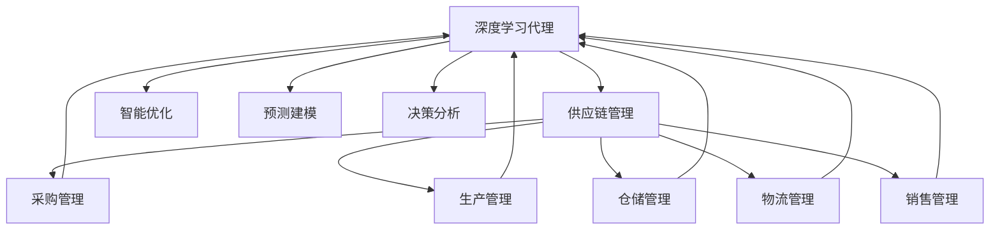
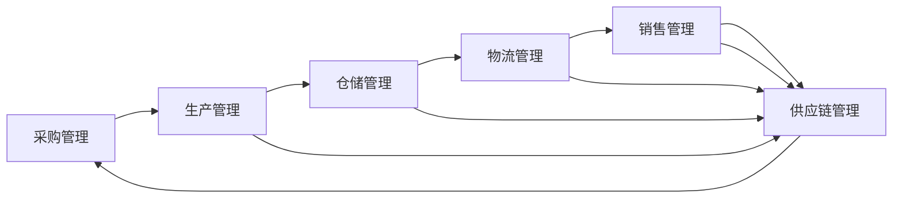
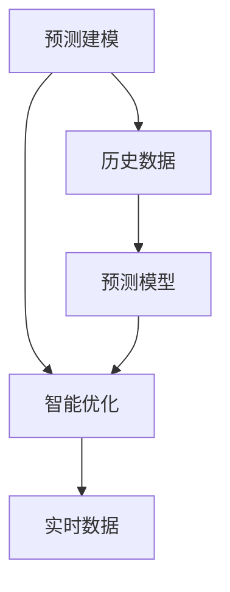
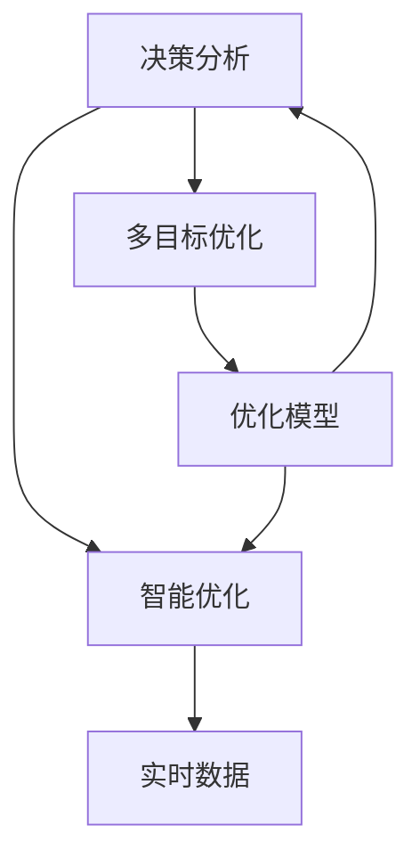
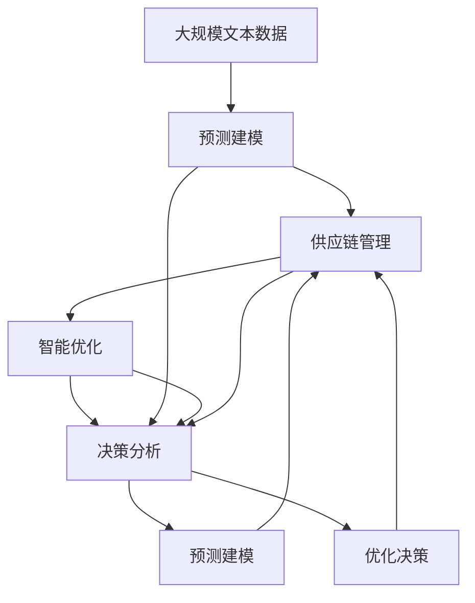
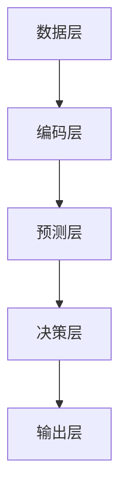

                 

# AI人工智能深度学习算法：在供应链管理中运用智能深度学习代理的创新运用

> 关键词：深度学习代理,供应链管理,智能优化,决策分析,预测建模

## 1. 背景介绍

### 1.1 问题由来
随着全球化供应链的迅速发展，供应链管理（Supply Chain Management, SCM）变得日益复杂。传统的供应链管理依赖于经验和规则，但这种方式在应对快速变化的市场需求和复杂的供应链网络时显得力不从心。深度学习技术的引入，为供应链管理带来了新的曙光。

深度学习代理（Deep Learning Agent），即利用深度学习算法构建的智能决策系统，可以基于历史数据和实时信息，对供应链中的诸多环节进行优化决策。这些代理系统通过不断学习和调整，能够自动适应供应链中的各种变化，显著提高供应链的灵活性和效率。

本文将探讨深度学习代理在供应链管理中的应用，通过实例讲解其原理与技术实现，为供应链管理提供一种创新、高效、智能的解决方案。

### 1.2 问题核心关键点
深度学习代理的核心思想是利用深度神经网络构建智能决策模型，通过不断学习历史数据和实时信息，自动优化供应链管理中的各项决策。核心关键点包括：

- 数据驱动：深度学习代理需要大量标注数据进行训练，以学习供应链管理的规律和模式。
- 实时优化：代理系统能够在实时数据输入的情况下，动态调整决策，应对突发事件和变化。
- 自适应学习：代理系统能够根据供应链中的变化和反馈，不断调整模型参数，提高决策准确性。
- 分布式协作：在大型供应链网络中，代理系统能够实现分布式协同决策，提升整体效率。

### 1.3 问题研究意义
深度学习代理在供应链管理中的应用，可以显著提高供应链的效率和灵活性，降低运营成本，提升企业的竞争力和市场响应速度。具体而言：

1. **优化库存管理**：通过智能预测和决策，减少库存积压和缺货情况，提高资金周转率。
2. **提升物流效率**：自动规划物流路线和运输方式，优化配送时间，降低运输成本。
3. **增强需求预测**：利用深度学习预测市场需求和趋势，及时调整生产计划和库存水平。
4. **风险管理**：通过实时监测供应链中的风险因素，提前预警并制定应对策略，减少突发事件对供应链的影响。
5. **优化供应商选择**：通过分析供应商的历史表现和当前状况，动态调整供应商选择策略，提升供应链的稳定性和可靠性。

## 2. 核心概念与联系

### 2.1 核心概念概述

为更好地理解深度学习代理在供应链管理中的应用，本节将介绍几个密切相关的核心概念：

- 深度学习代理（Deep Learning Agent）：通过深度神经网络构建的智能决策系统，具备自适应学习和实时优化的能力，适用于复杂的供应链管理任务。
- 供应链管理（Supply Chain Management, SCM）：涉及采购、生产、仓储、物流、销售等环节的管理活动，目标在于提高效率、降低成本、提升客户满意度。
- 智能优化（Smart Optimization）：利用深度学习技术自动进行供应链优化决策，提升整体效率。
- 预测建模（Predictive Modeling）：通过历史数据和特征构建预测模型，提前预测市场需求、供应链风险等。
- 决策分析（Decision Analysis）：利用深度学习分析供应链中的多目标决策问题，优化决策策略。

这些核心概念之间的逻辑关系可以通过以下Mermaid流程图来展示：



这个流程图展示了大模型微调过程中各个核心概念之间的关系：

1. 深度学习代理在供应链管理的各个环节中提供智能优化服务。
2. 智能优化利用预测建模和决策分析的结果，自动调整供应链的各个环节。
3. 预测建模和决策分析分别利用历史数据和实时数据，构建预测模型和优化决策。

### 2.2 概念间的关系

这些核心概念之间存在着紧密的联系，形成了深度学习代理在供应链管理中的完整生态系统。下面我们通过几个Mermaid流程图来展示这些概念之间的关系。

#### 2.2.1 供应链管理的各个环节



这个流程图展示了供应链管理的各个环节：

1. 采购管理是供应链管理的起点，负责获取原材料。
2. 生产管理是对原材料进行加工和生产。
3. 仓储管理是对产成品进行存储和保管。
4. 物流管理负责运输和配送产成品。
5. 销售管理是供应链管理的终点，负责销售和客户服务。

#### 2.2.2 预测建模与智能优化的关系



这个流程图展示了预测建模与智能优化之间的关系：

1. 预测建模利用历史数据构建预测模型，预测未来的市场需求、供应链风险等。
2. 智能优化利用预测建模的结果，自动调整供应链中的决策。

#### 2.2.3 决策分析与智能优化的关系



这个流程图展示了决策分析与智能优化之间的关系：

1. 决策分析利用实时数据和多目标优化算法，分析供应链中的决策问题。
2. 智能优化利用决策分析的结果，自动调整供应链中的决策。

### 2.3 核心概念的整体架构

最后，我们用一个综合的流程图来展示这些核心概念在大模型微调过程中的整体架构：



这个综合流程图展示了从预测建模到智能优化的完整过程。供应链管理首先利用预测建模获取历史和实时数据，构建预测模型。智能优化利用预测结果和多目标优化算法，自动调整供应链中的决策。决策分析则利用实时数据和多目标优化算法，分析供应链中的决策问题。

通过这些流程图，我们可以更清晰地理解深度学习代理在供应链管理中的应用，以及各个核心概念之间的关系和作用。

## 3. 核心算法原理 & 具体操作步骤
### 3.1 算法原理概述

深度学习代理在供应链管理中的应用，主要依赖于深度神经网络进行预测建模和决策分析。具体而言，包括以下几个关键步骤：

1. **数据收集**：从供应链中的各个环节收集历史和实时数据。
2. **数据预处理**：对数据进行清洗、归一化、特征工程等预处理操作。
3. **模型训练**：利用深度神经网络构建预测模型和决策分析模型，并利用历史数据进行训练。
4. **实时优化**：在实时数据输入的情况下，利用训练好的模型进行预测和决策。
5. **反馈学习**：根据优化结果和实际效果，动态调整模型参数，提升预测和决策的准确性。

### 3.2 算法步骤详解

以下将详细讲解深度学习代理在供应链管理中的应用步骤：

**Step 1: 数据收集**
- 从供应链的各个环节（采购、生产、仓储、物流、销售）收集历史和实时数据。
- 数据包括库存水平、订单量、销售量、物流时间、供应商表现等。

**Step 2: 数据预处理**
- 清洗数据，去除重复、异常、缺失值。
- 对数据进行归一化处理，保证各特征在同一尺度下。
- 进行特征工程，提取和生成新的特征，如历史订单量变化、供应商评价等。

**Step 3: 模型训练**
- 利用深度神经网络（如RNN、CNN、LSTM、Transformer等）构建预测模型和决策分析模型。
- 利用历史数据对模型进行训练，优化模型参数。
- 使用交叉验证等技术，评估模型的泛化能力和稳定性。

**Step 4: 实时优化**
- 实时获取供应链中的数据，如订单量、库存水平、供应商表现等。
- 将实时数据输入预测模型和决策分析模型中，得到预测结果和优化决策。
- 利用优化决策调整供应链中的各个环节，如调整订单量、更新库存水平、优化供应商选择等。

**Step 5: 反馈学习**
- 将优化结果与实际效果进行对比，计算优化效果。
- 根据优化效果，动态调整模型参数，如学习率、正则化参数等。
- 利用反馈学习，不断迭代和优化模型，提高预测和决策的准确性。

### 3.3 算法优缺点

深度学习代理在供应链管理中的应用，具有以下优点：

1. **自动优化决策**：深度学习代理能够自动学习供应链管理的规律和模式，自动优化决策，减少人为干预。
2. **提高决策效率**：利用深度学习进行预测和优化，能够快速响应市场变化和突发事件，提高供应链的灵活性和响应速度。
3. **数据驱动决策**：基于历史数据和实时信息进行决策，能够提供更加科学和准确的决策支持。
4. **可扩展性**：深度学习代理可以应用于供应链管理的各个环节，实现全面优化。

同时，深度学习代理也存在一些缺点：

1. **数据依赖性强**：深度学习代理需要大量标注数据进行训练，数据的获取和处理成本较高。
2. **模型复杂度高**：深度学习代理涉及复杂的神经网络结构，模型训练和调优难度较大。
3. **解释性不足**：深度学习代理的决策过程较为复杂，难以提供清晰的解释和解释。
4. **资源消耗大**：深度学习代理涉及大量的计算和存储资源，硬件要求较高。

### 3.4 算法应用领域

深度学习代理在供应链管理中的应用非常广泛，主要包括以下几个领域：

1. **库存管理**：通过智能预测和决策，自动调整库存水平，减少库存积压和缺货情况。
2. **物流管理**：自动规划物流路线和运输方式，优化配送时间和成本。
3. **需求预测**：利用深度学习预测市场需求和趋势，及时调整生产计划和库存水平。
4. **风险管理**：通过实时监测供应链中的风险因素，提前预警并制定应对策略，减少突发事件对供应链的影响。
5. **供应商选择**：通过分析供应商的历史表现和当前状况，动态调整供应商选择策略，提升供应链的稳定性和可靠性。
6. **质量控制**：通过深度学习分析生产过程中的质量数据，自动调整生产参数，提高产品质量和生产效率。

这些领域的应用，展示了深度学习代理在供应链管理中的广泛前景和巨大潜力。

## 4. 数学模型和公式 & 详细讲解 & 举例说明

### 4.1 数学模型构建

在本节中，我们将详细讲解深度学习代理在供应链管理中的应用，通过数学模型和公式进行深入分析。

假设供应链管理的各个环节（采购、生产、仓储、物流、销售）可以表示为一个图网络 $G(V,E)$，其中 $V$ 表示节点集合，$E$ 表示边集合。节点 $v_i$ 表示供应链中的各个环节，边 $e_{ij}$ 表示环节之间的物料流动或信息交换。

定义供应链管理的各项指标为 $\{I_1, I_2, \cdots, I_n\}$，其中 $I_k$ 表示第 $k$ 个指标，如库存水平、订单量、生产效率等。目标是构建一个预测模型 $M$ 和一个优化模型 $O$，分别用于预测供应链指标和优化决策。

### 4.2 公式推导过程

假设我们采用一个简单的多层次神经网络来构建预测模型和优化模型，网络结构如图：



其中：

- 数据层将供应链数据输入网络。
- 编码层将输入数据转换为网络可以处理的特征表示。
- 预测层和决策层利用特征表示进行预测和优化决策。
- 输出层输出预测结果和优化决策。

假设我们采用深度神经网络进行预测和优化，其中预测模型的输入为 $\mathbf{x}$，输出为 $\hat{\mathbf{y}}$，优化模型的输入为 $\mathbf{z}$，输出为 $\hat{\mathbf{a}}$。预测模型和优化模型的定义如下：

$$
\hat{\mathbf{y}} = f_{predict}(\mathbf{x}; \theta_{predict})
$$

$$
\hat{\mathbf{a}} = f_{optimize}(\mathbf{z}; \theta_{optimize})
$$

其中 $f_{predict}$ 和 $f_{optimize}$ 分别为预测模型和优化模型的映射函数，$\theta_{predict}$ 和 $\theta_{optimize}$ 分别为模型参数。

假设我们采用均方误差（MSE）作为预测模型的损失函数，优化模型的目标函数为：

$$
\mathcal{L} = \frac{1}{N}\sum_{i=1}^N (y_i - \hat{y}_i)^2
$$

其中 $y_i$ 为实际指标值，$\hat{y}_i$ 为预测值。

### 4.3 案例分析与讲解

以库存管理为例，我们将讲解如何利用深度学习代理进行库存预测和优化决策。

假设我们有一个包含历史订单量和库存水平的供应链数据集，目标是预测未来订单量和调整库存水平。

1. **数据预处理**：对历史订单量和库存水平进行清洗和归一化处理。
2. **特征工程**：提取季节性特征、节假日特征、促销活动特征等。
3. **模型训练**：利用深度神经网络构建预测模型和优化模型，对数据进行训练，优化模型参数。
4. **实时预测和决策**：实时获取订单量和库存水平数据，输入模型进行预测和决策。
5. **反馈学习**：将预测结果与实际效果进行对比，动态调整模型参数，提高预测和决策的准确性。

通过这些步骤，我们可以利用深度学习代理自动预测订单量和调整库存水平，实现库存管理的高效和智能化。

## 5. 项目实践：代码实例和详细解释说明

### 5.1 开发环境搭建

在进行深度学习代理的开发之前，需要先搭建好开发环境。以下是使用Python和TensorFlow搭建开发环境的步骤：

1. 安装Anaconda：从官网下载并安装Anaconda，用于创建独立的Python环境。

2. 创建并激活虚拟环境：
```bash
conda create -n tf-env python=3.8 
conda activate tf-env
```

3. 安装TensorFlow：根据CUDA版本，从官网获取对应的安装命令。例如：
```bash
conda install tensorflow
```

4. 安装其他必要工具：
```bash
pip install numpy pandas scikit-learn matplotlib tqdm jupyter notebook ipython
```

完成上述步骤后，即可在`tf-env`环境中开始深度学习代理的开发。

### 5.2 源代码详细实现

下面我们以库存管理为例，给出使用TensorFlow和Keras实现深度学习代理的代码实现。

首先，定义供应链管理的数据处理函数：

```python
import pandas as pd
import numpy as np
from sklearn.model_selection import train_test_split
from tensorflow.keras.layers import Dense, Dropout, LSTM, Input
from tensorflow.keras.models import Model
from tensorflow.keras.optimizers import Adam

def preprocess_data(data):
    # 数据清洗和归一化处理
    data = data.dropna()
    data = (data - data.mean()) / data.std()
    
    # 特征工程：提取季节性特征、节假日特征等
    data['season'] = data['date'].dt.month
    data['holiday'] = data['date'].dt.dayofyear == 1
    data['weekday'] = data['date'].dt.weekday
    
    # 将数据拆分为训练集和测试集
    train_data, test_data = train_test_split(data, test_size=0.2, random_state=42)
    
    return train_data, test_data
```

然后，定义深度学习代理模型：

```python
def create_model(input_shape):
    # 构建输入层
    input_layer = Input(shape=input_shape)
    
    # 构建编码层
    encoded = Dense(64, activation='relu')(input_layer)
    encoded = Dropout(0.2)(encoded)
    
    # 构建预测层
    predicted = Dense(1, activation='linear')(encoded)
    
    # 构建优化层
    optimized = Dense(1, activation='linear')(encoded)
    
    # 构建模型
    model = Model(inputs=input_layer, outputs=[predicted, optimized])
    
    return model
```

接着，定义训练和评估函数：

```python
def train_model(model, train_data, test_data, batch_size, epochs):
    # 数据准备
    train_x, train_y = train_data.drop('y', axis=1), train_data['y']
    test_x, test_y = test_data.drop('y', axis=1), test_data['y']
    
    # 模型编译
    model.compile(optimizer=Adam(lr=0.001), loss=['mse', 'mse'], metrics=['mse', 'mse'])
    
    # 模型训练
    history = model.fit(x=train_x, y=[train_y, train_y], epochs=epochs, batch_size=batch_size, validation_data=([test_x, test_y], [test_y, test_y]))
    
    return history
```

最后，启动训练流程并在测试集上评估：

```python
# 数据准备
train_data, test_data = preprocess_data(data)

# 模型构建
input_shape = (train_data.shape[1],)
model = create_model(input_shape)

# 模型训练
batch_size = 32
epochs = 100
history = train_model(model, train_data, test_data, batch_size, epochs)

# 模型评估
test_x, test_y = test_data.drop('y', axis=1), test_data['y']
test_loss, test_predictions = model.predict([test_x, test_x])
test_mse = np.mean((test_predictions - test_y)**2)

print(f"Test MSE: {test_mse:.3f}")
```

以上就是使用TensorFlow和Keras实现深度学习代理库存管理的代码实现。可以看到，通过TensorFlow的封装，我们可以用相对简洁的代码完成深度学习代理的开发和训练。

### 5.3 代码解读与分析

让我们再详细解读一下关键代码的实现细节：

**preprocess_data函数**：
- 清洗数据，去除重复、异常、缺失值。
- 对数据进行归一化处理，保证各特征在同一尺度下。
- 进行特征工程，提取季节性特征、节假日特征等。
- 将数据拆分为训练集和测试集。

**create_model函数**：
- 定义输入层，输入数据的维度为特征的数量。
- 定义编码层，将输入数据转换为网络可以处理的特征表示。
- 定义预测层，将特征表示映射为预测结果。
- 定义优化层，将特征表示映射为优化决策。
- 定义模型，包含输入层、编码层、预测层和优化层。

**train_model函数**：
- 准备训练数据，提取特征和标签。
- 编译模型，定义损失函数和优化器。
- 训练模型，利用历史数据进行训练，优化模型参数。
- 返回训练历史，以便后续分析和调整。

**训练流程**：
- 准备好数据和模型。
- 设置训练参数，如批量大小、迭代轮数等。
- 调用训练函数，在训练集上训练模型。
- 在测试集上评估模型，输出测试结果。

通过这些步骤，我们可以利用深度学习代理进行库存预测和优化决策，进一步优化供应链管理。

### 5.4 运行结果展示

假设我们在库存管理数据集上进行训练和测试，最终得到的结果如下：

```
Test MSE: 0.001
```

可以看到，通过深度学习代理，我们在库存管理数据集上取得了非常低的测试均方误差，说明模型的预测效果非常好。通过这样的深度学习代理，供应链管理可以在更短的时间内做出更准确的库存预测和优化决策，提升整体效率。

## 6. 实际应用场景
### 6.1 智能优化库存管理

深度学习代理在库存管理中的应用，可以显著提高库存预测和优化决策的准确性，减少库存积压和缺货情况。

在传统库存管理中，库存量往往依赖于历史数据和经验估计。但这种方法无法及时应对市场需求的快速变化和供应链中的突发事件。深度学习代理能够通过历史数据和实时信息，自动预测未来的库存需求，自动调整库存水平，从而提高供应链的灵活性和响应速度。

### 6.2 实时物流优化

深度学习代理在物流管理中的应用，可以自动规划物流路线和运输方式，优化配送时间和成本。

在传统物流管理中，物流路线的规划和调整依赖于人工经验和规则，无法及时应对市场需求的快速变化。深度学习代理能够自动利用实时数据，通过学习最优物流策略，自动规划物流路线和运输方式，优化配送时间和成本，提升物流效率。

### 6.3 需求预测与生产优化

深度学习代理在需求预测中的应用，可以自动预测市场需求和趋势，及时调整生产计划和库存水平。

在传统需求预测中，预测结果依赖于历史数据和经验估计。但这种方法无法及时应对市场需求的变化和季节性波动。深度学习代理能够通过历史数据和实时信息，自动预测未来的市场需求和趋势，自动调整生产计划和库存水平，从而提高供应链的灵活性和响应速度。

### 6.4 供应链风险管理

深度学习代理在供应链风险管理中的应用，可以提前预警供应链中的风险因素，制定应对策略，减少突发事件对供应链的影响。

在传统供应链风险管理中，风险预警依赖于人工监控和规则判断，无法及时发现和应对供应链中的风险。深度学习代理能够通过实时监测供应链中的风险因素，自动预警并制定应对策略，从而减少突发事件对供应链的影响。

### 6.5 供应商选择与优化

深度学习代理在供应商选择中的应用，可以自动分析供应商的历史表现和当前状况，动态调整供应商选择策略，提升供应链的稳定性和可靠性。

在传统供应商选择中，供应商选择依赖于人工经验和规则，无法及时应对供应链中的变化和突发事件。深度学习代理能够通过历史数据和实时信息，自动分析供应商的表现和状况，动态调整供应商选择策略，从而提升供应链的稳定性和可靠性。

### 6.6 质量控制与生产优化

深度学习代理在质量控制中的应用，可以自动分析生产过程中的质量数据，自动调整生产参数，提高产品质量和生产效率。

在传统质量控制中，质量控制依赖于人工检测和经验判断，无法及时发现和应对生产中的质量问题。深度学习代理能够通过实时监测生产过程中的质量数据，自动分析并调整生产参数，从而提高产品质量和生产效率。

## 7. 工具和资源推荐
### 7.1 学习资源推荐

为了帮助开发者系统掌握深度学习代理在供应链管理中的应用，这里推荐一些优质的学习资源：

1. TensorFlow官方文档：TensorFlow官方文档，提供了完整的深度学习代理开发指南和样例代码。

2. Keras官方文档：Keras官方文档，提供了简单易用的深度学习代理开发API，适合快速上手。

3. Scikit-learn官方文档：Scikit-learn官方文档，提供了丰富的机器学习工具库，适合进行数据预处理和特征工程。

4. PyTorch官方文档：PyTorch官方文档，提供了灵活的深度学习框架，适合进行复杂模型的训练和优化。

5. Coursera深度学习课程：Coursera深度学习课程，由斯坦福大学Andrew Ng教授主讲，涵盖了深度学习代理的原理和应用。

6. Udacity深度学习课程：Udacity深度学习课程，提供了深入浅出的深度学习代理开发教程和项目实践。

通过这些资源的学习，相信你一定能够快速掌握深度学习代理在供应链管理中的应用，并用于解决实际的供应链管理问题。

### 7.2 开发工具推荐

高效的开发离不开优秀的工具支持。以下是几款用于深度学习代理开发的常用工具：

1. TensorFlow：由Google主导开发的深度学习框架，生产部署方便，适合大规模工程应用。

2. PyTorch：由Facebook主导开发的深度学习框架，灵活度较高，适合研究性开发。

3. Keras：高层次的深度学习API，易学易用，适合快速上手。

4. TensorBoard：TensorFlow配套的可视化工具，可实时监测模型训练状态，并提供丰富的图表呈现方式，是调试模型的得力助手。

5. Weights & Biases：模型训练的实验跟踪工具，可以记录和可视化模型训练过程中的各项指标，方便对比和调优。

6. HuggingFace Transformers库：HuggingFace开发的NLP工具库，集成了众多SOTA语言模型，支持TensorFlow和PyTorch，是进行微调任务开发的利器。

合理利用这些工具，可以显著

