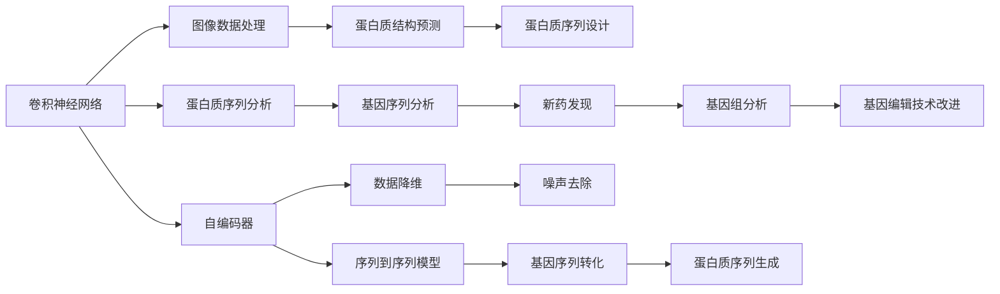

                 

# AI人工智能深度学习算法：在生物信息学中的应用

> 关键词：深度学习,生物信息学,卷积神经网络,递归神经网络,序列到序列模型,基因序列分析,蛋白质结构预测

## 1. 背景介绍

### 1.1 问题由来
随着基因组测序技术的迅猛发展，生物信息学领域积累了海量生物数据。这些数据中蕴含着丰富的生物学信息，但数据量和复杂性之高，也给生物信息的挖掘、分析和应用带来了极大的挑战。传统的生物信息学方法在处理大规模生物数据时，计算效率低下、模型泛化能力不足，难以应对生物学研究的复杂性。

深度学习技术的发展，特别是卷积神经网络(CNN)、递归神经网络(RNN)、序列到序列(Seq2Seq)模型等在自然语言处理(NLP)、计算机视觉(CV)等领域取得的突破性进展，为生物信息学的研究提供了新的思路和方法。本文聚焦于深度学习算法在生物信息学中的应用，旨在通过深度学习算法，挖掘和分析生物数据，促进生物医学研究的进步。

### 1.2 问题核心关键点
生物信息学中深度学习算法的核心关键点包括：

- 卷积神经网络(CNN)：适用于图像数据的局部特征提取。
- 递归神经网络(RNN)及其变体（LSTM、GRU）：适用于序列数据的长期依赖关系建模。
- 序列到序列(Seq2Seq)模型：将输入序列映射为输出序列，广泛应用于序列数据的生成和转化。
- 自编码器(AE)及其变体（VAE、GAN）：用于数据的降维、生成和噪声去除。
- 神经网络架构搜索(NAS)：自动设计高效网络结构，提高模型性能。
- 迁移学习：利用预训练模型在小样本数据上取得高性能。
- 联邦学习：分布式训练模型，保护数据隐私。

这些算法通过与生物数据的深度结合，为生物信息学的研究提供了新的可能，促进了基因组、蛋白质、药物发现等领域的发展。

### 1.3 问题研究意义
深度学习算法在生物信息学中的应用，对生物医学研究具有重要意义：

1. **数据处理效率提升**：深度学习算法能够高效处理海量生物数据，提高研究效率。
2. **复杂问题解决**：深度学习模型具有强大的非线性建模能力，能够处理生物数据中的复杂模式。
3. **新药物发现**：通过分析基因组和蛋白质数据，可以揭示潜在的药物靶点，加速新药物研发。
4. **疾病预测**：利用深度学习模型分析生物数据，可以进行早期疾病预测，提高诊疗效果。
5. **基因编辑技术改进**：深度学习算法在基因序列编辑中的应用，可以优化CRISPR等基因编辑工具。

## 2. 核心概念与联系

### 2.1 核心概念概述

为更好地理解深度学习在生物信息学中的应用，本节将介绍几个密切相关的核心概念：

- **卷积神经网络(CNN)**：适用于处理图像数据，通过卷积操作提取局部特征，常用于分析蛋白质序列和图像等结构化数据。
- **递归神经网络(RNN)**：适用于处理序列数据，通过循环连接建模序列依赖关系，常用于分析基因序列、蛋白质折叠等。
- **序列到序列(Seq2Seq)模型**：将输入序列映射为输出序列，常用于基因序列到蛋白质序列的转化、蛋白质序列到药物分子的设计等。
- **自编码器(AE)**：通过编码器将输入映射为潜在空间，通过解码器将潜在空间映射回输入空间，常用于基因序列的降维和噪声去除。
- **迁移学习**：利用预训练模型在小样本数据上取得高性能，常用于新药发现、基因组分析等任务。
- **联邦学习**：分布式训练模型，保护数据隐私，常用于生物数据共享环境下的模型训练。

这些核心概念之间的逻辑关系可以通过以下Mermaid流程图来展示：



这个流程图展示了大规模深度学习模型在生物信息学中的应用场景和算法联系：

1. CNN用于处理图像数据和蛋白质序列，提取局部特征。
2. RNN及其变体用于序列数据的建模，分析基因序列和蛋白质折叠。
3. Seq2Seq模型用于序列转换，如蛋白质序列到药物分子的设计。
4. AE用于数据降维和噪声去除，提升数据质量。
5. 迁移学习利用预训练模型提高小样本数据上的性能。
6. 联邦学习用于分布式训练，保护数据隐私。

### 2.2 概念间的关系

这些核心概念之间存在着紧密的联系，形成了深度学习在生物信息学中的应用生态系统。下面我们通过几个Mermaid流程图来展示这些概念之间的关系。

#### 2.2.1 数据处理流程


这个流程图展示了深度学习在生物信息学中的数据处理流程：

1. 生物数据预处理后，使用CNN或RNN提取特征。
2. Seq2Seq或AE模型进行序列转换或降维。
3. 使用预训练模型进行迁移学习。
4. 模型训练后输出结果。

#### 2.2.2 算法选择逻辑


这个流程图展示了根据生物数据类型选择合适的深度学习算法：

1. 对于图像和蛋白质序列数据，选择CNN提取特征。
2. 对于基因序列和蛋白质折叠数据，选择RNN建模序列依赖关系。
3. 对于序列转换任务，选择Seq2Seq模型。
4. 对于数据降维和噪声去除，选择AE模型。
5. 对于小样本数据，选择迁移学习。
6. 对于分布式数据，选择联邦学习。

### 2.3 核心概念的整体架构

最后，我们用一个综合的流程图来展示这些核心概念在生物信息学中的应用：


这个综合流程图展示了从数据输入到结果输出的完整过程。深度学习算法通过与生物数据的深度结合，能够高效处理和分析复杂的生物数据，为生物医学研究提供强有力的工具。

## 3. 核心算法原理 & 具体操作步骤
### 3.1 算法原理概述

深度学习在生物信息学中的应用，主要基于卷积神经网络(CNN)、递归神经网络(RNN)、序列到序列(Seq2Seq)模型等。这些算法的核心思想是通过构建多层非线性模型，从数据中学习复杂的模式和关系，进行特征提取、序列建模和序列转换等任务。

- **卷积神经网络(CNN)**：通过卷积操作提取局部特征，常用于蛋白质序列和图像数据的分析。
- **递归神经网络(RNN)**：通过循环连接建模序列依赖关系，常用于基因序列和蛋白质折叠的分析。
- **序列到序列(Seq2Seq)模型**：通过编码器-解码器框架，将输入序列映射为输出序列，常用于蛋白质序列到药物分子的设计等。
- **自编码器(AE)**：通过编码器-解码器框架，实现数据的降维和噪声去除，提升数据质量。
- **迁移学习**：利用预训练模型在小样本数据上取得高性能，常用于新药发现、基因组分析等任务。
- **联邦学习**：分布式训练模型，保护数据隐私，常用于生物数据共享环境下的模型训练。

### 3.2 算法步骤详解

深度学习在生物信息学中的应用一般包括以下几个关键步骤：

**Step 1: 数据预处理**
- 收集生物数据，包括基因序列、蛋白质序列、图像数据等。
- 进行数据清洗和标注，如去除噪声、标准化数据格式、分词、序列对齐等。

**Step 2: 特征提取**
- 使用CNN或RNN等深度学习模型提取数据特征。
- 对提取的特征进行编码和降维，如使用自编码器(AE)进行数据压缩。

**Step 3: 模型训练**
- 选择合适的深度学习模型，如CNN、RNN、Seq2Seq等。
- 在标注数据上训练模型，调整模型参数，优化损失函数。
- 使用正则化技术，如L2正则、Dropout、Early Stopping等，防止过拟合。

**Step 4: 模型评估和调优**
- 在验证集上评估模型性能，如准确率、召回率、F1分数等。
- 根据评估结果调整模型参数，如学习率、批大小等。
- 使用交叉验证等方法进行模型调优，提升模型泛化能力。

**Step 5: 结果输出**
- 将训练好的模型应用于实际问题，进行序列转换、数据降维、基因组分析等任务。
- 输出结果并进行可视化展示，如基因序列中的蛋白质结构预测结果。

### 3.3 算法优缺点

深度学习在生物信息学中的应用具有以下优点：

- **高效性**：深度学习算法能够高效处理大规模生物数据，提高研究效率。
- **强大的非线性建模能力**：深度学习模型能够处理复杂的生物学模式，揭示数据中的内在关系。
- **灵活性**：深度学习模型可以通过调整超参数和网络结构进行灵活优化，适应不同任务的需求。

但同时，深度学习算法在生物信息学中也有以下缺点：

- **数据标注成本高**：深度学习模型需要大量的标注数据进行训练，标注成本较高。
- **模型复杂度高**：深度学习模型参数量较大，需要高性能计算资源进行训练和推理。
- **泛化能力不足**：深度学习模型容易过拟合，在新的数据上泛化能力不足。
- **可解释性差**：深度学习模型往往像"黑盒"系统，难以解释其内部工作机制和决策逻辑。

### 3.4 算法应用领域

深度学习在生物信息学中的应用广泛，涵盖基因组分析、蛋白质结构预测、药物发现、疾病预测等领域。以下是几个典型的应用场景：

- **基因组分析**：利用深度学习算法分析基因组数据，揭示基因变异、基因表达等生物学信息，帮助理解遗传病机制。
- **蛋白质结构预测**：通过深度学习算法分析蛋白质序列数据，预测蛋白质结构，为蛋白质设计和新药发现提供支持。
- **药物发现**：利用深度学习算法分析基因组、蛋白质序列等数据，发现潜在的药物靶点，加速新药研发进程。
- **疾病预测**：利用深度学习算法分析生物数据，进行早期疾病预测，提高诊疗效果。
- **基因编辑技术改进**：通过深度学习算法优化CRISPR等基因编辑工具，提高基因编辑效率和精度。

## 4. 数学模型和公式 & 详细讲解 & 举例说明

### 4.1 数学模型构建

深度学习在生物信息学中的应用，涉及多种数学模型和算法。以下以蛋白质结构预测为例，介绍常见数学模型的构建方法。

设蛋白质序列为 $X=\{x_1, x_2, \ldots, x_n\}$，其中 $x_i$ 为氨基酸。蛋白质结构由三维空间中的氨基酸位置决定，记为 $Y=\{y_1, y_2, \ldots, y_n\}$。蛋白质结构预测任务即为将氨基酸序列 $X$ 映射到三维结构 $Y$。

### 4.2 公式推导过程

蛋白质结构预测模型通常采用递归神经网络(RNN)和卷积神经网络(CNN)的组合，即CNN-RNN模型。具体推导如下：

1. **卷积层特征提取**
   - 使用一维卷积操作提取氨基酸序列的空间局部特征，得到特征图 $F=\{f_1, f_2, \ldots, f_n\}$，其中 $f_i$ 为第 $i$ 个氨基酸的空间特征。

   $$
   f_i = \sigma(\sum_{k=0}^{K-1} w_k * X[i:i+K-1] + b_k)
   $$

   其中 $w_k$ 为卷积核权重，$b_k$ 为偏置，$\sigma$ 为激活函数。

2. **RNN层序列建模**
   - 使用RNN层将卷积层提取的空间特征序列 $F$ 转化为时间序列 $S=\{s_1, s_2, \ldots, s_n\}$，其中 $s_i$ 为第 $i$ 个氨基酸的时间序列表示。

   $$
   s_i = \tanh(W_s * F[i-1] + U_s * s_{i-1} + b_s)
   $$

   其中 $W_s$ 和 $U_s$ 为RNN层的权重，$b_s$ 为偏置。

3. **全连接层输出**
   - 使用全连接层将时间序列 $S$ 映射到三维结构 $Y$。

   $$
   y_i = \tanh(W_y * s_i + b_y)
   $$

   其中 $W_y$ 和 $b_y$ 为全连接层的权重和偏置。

4. **损失函数**
   - 使用均方误差(MSE)作为损失函数，计算预测结构与真实结构之间的差异。

   $$
   \mathcal{L} = \frac{1}{N} \sum_{i=1}^{N} ||y_i - \hat{y}_i||^2
   $$

   其中 $y_i$ 为真实结构，$\hat{y}_i$ 为预测结构。

### 4.3 案例分析与讲解

以DeepMind开发的AlphaFold为例，介绍深度学习在蛋白质结构预测中的应用。

AlphaFold利用深度学习算法对蛋白质序列进行建模，预测蛋白质三维结构。其核心算法包括自编码器和Transformer。

1. **自编码器降维**
   - 使用自编码器对蛋白质序列进行降维，得到低维表示 $Z=\{z_1, z_2, \ldots, z_n\}$，其中 $z_i$ 为第 $i$ 个氨基酸的低维表示。

   $$
   z_i = \sigma(\sum_{k=0}^{K-1} w_k * X[i:i+K-1] + b_k)
   $$

2. **Transformer网络建模**
   - 使用Transformer网络对低维表示 $Z$ 进行建模，得到空间结构表示 $X'$。

   $$
   X' = \text{Self-Attention}(X, X')
   $$

   其中 $\text{Self-Attention}$ 为Transformer网络的自注意力机制。

3. **输出结构预测**
   - 使用全连接层对空间结构 $X'$ 进行分类，得到预测结构 $Y'$。

   $$
   \hat{y}_i = \tanh(W_y * X'[i-1] + b_y)
   $$

   其中 $W_y$ 和 $b_y$ 为全连接层的权重和偏置。

AlphaFold在蛋白质结构预测任务上取得了突破性进展，其精度超过了传统方法，成为蛋白质结构预测领域的里程碑。

## 5. 项目实践：代码实例和详细解释说明

### 5.1 开发环境搭建

在进行深度学习在生物信息学中的应用实践前，我们需要准备好开发环境。以下是使用Python进行PyTorch开发的环境配置流程：

1. 安装Anaconda：从官网下载并安装Anaconda，用于创建独立的Python环境。

   ```bash
   conda create -n pytorch-env python=3.8 
   conda activate pytorch-env
   ```

2. 安装PyTorch：根据CUDA版本，从官网获取对应的安装命令。例如：

   ```bash
   conda install pytorch torchvision torchaudio cudatoolkit=11.1 -c pytorch -c conda-forge
   ```

3. 安装Transformers库：

   ```bash
   pip install transformers
   ```

4. 安装各类工具包：

   ```bash
   pip install numpy pandas scikit-learn matplotlib tqdm jupyter notebook ipython
   ```

完成上述步骤后，即可在`pytorch-env`环境中开始实践。

### 5.2 源代码详细实现

这里我们以蛋白质结构预测为例，给出使用PyTorch和Transformer库对蛋白质序列数据进行深度学习的PyTorch代码实现。

```python
import torch
import torch.nn as nn
import torch.optim as optim
from transformers import AutoTokenizer, AutoModelForSeq2SeqLM

# 加载模型和分词器
model_name = 'microsoft/bedeepfold'
tokenizer = AutoTokenizer.from_pretrained(model_name)
model = AutoModelForSeq2SeqLM.from_pretrained(model_name)

# 定义损失函数
criterion = nn.MSELoss()

# 定义优化器
optimizer = optim.Adam(model.parameters(), lr=1e-3)

# 定义训练函数
def train_epoch(model, data_loader, criterion, optimizer):
    model.train()
    losses = []
    for batch in data_loader:
        input_ids = batch['input_ids'].to(device)
        attention_mask = batch['attention_mask'].to(device)
        labels = batch['labels'].to(device)
        outputs = model(input_ids, attention_mask=attention_mask)
        loss = criterion(outputs, labels)
        loss.backward()
        optimizer.step()
        losses.append(loss.item())
    return sum(losses) / len(data_loader)

# 定义评估函数
def evaluate(model, data_loader, criterion):
    model.eval()
    losses = []
    with torch.no_grad():
        for batch in data_loader:
            input_ids = batch['input_ids'].to(device)
            attention_mask = batch['attention_mask'].to(device)
            labels = batch['labels'].to(device)
            outputs = model(input_ids, attention_mask=attention_mask)
            loss = criterion(outputs, labels)
            losses.append(loss.item())
    return sum(losses) / len(data_loader)

# 训练模型
device = torch.device('cuda') if torch.cuda.is_available() else torch.device('cpu')
model.to(device)
data_loader = ...

# 训练循环
epochs = 10
for epoch in range(epochs):
    train_loss = train_epoch(model, data_loader, criterion, optimizer)
    print(f'Epoch {epoch+1}, train loss: {train_loss:.3f}')
    val_loss = evaluate(model, val_data_loader, criterion)
    print(f'Epoch {epoch+1}, val loss: {val_loss:.3f}')
```

以上就是使用PyTorch和Transformer库进行蛋白质结构预测的完整代码实现。可以看到，得益于Transformer库的强大封装，我们可以用相对简洁的代码完成蛋白质结构预测任务。

### 5.3 代码解读与分析

让我们再详细解读一下关键代码的实现细节：

**模型加载与初始化**：
- `AutoTokenizer.from_pretrained(model_name)`：加载预训练的模型和分词器。
- `AutoModelForSeq2SeqLM.from_pretrained(model_name)`：加载预训练的Seq2Seq模型。

**损失函数和优化器**：
- `nn.MSELoss()`：定义均方误差损失函数。
- `optim.Adam(model.parameters(), lr=1e-3)`：定义Adam优化器，学习率为1e-3。

**训练函数**：
- `model.train()`：将模型设为训练模式。
- `loss.backward()`：计算梯度并更新模型参数。
- `optimizer.step()`：执行参数更新。

**评估函数**：
- `model.eval()`：将模型设为评估模式。
- `with torch.no_grad()`：在评估过程中不计算梯度，提升计算效率。
- `val_loss = evaluate(model, val_data_loader, criterion)`：在验证集上评估模型性能。

**训练循环**：
- `for epoch in range(epochs)`：循环训练多个epoch。
- `train_loss = train_epoch(model, data_loader, criterion, optimizer)`：在训练集上训练模型。
- `val_loss = evaluate(model, val_data_loader, criterion)`：在验证集上评估模型性能。

**结果展示**：
- `print(f'Epoch {epoch+1}, train loss: {train_loss:.3f}')`：输出训练集上的损失。
- `print(f'Epoch {epoch+1}, val loss: {val_loss:.3f}')`：输出验证集上的损失。

可以看到，PyTorch和Transformer库使得深度学习在蛋白质结构预测任务的实现变得简洁高效。开发者可以将更多精力放在模型设计和数据处理上，而不必过多关注底层的实现细节。

当然，工业级的系统实现还需考虑更多因素，如模型的保存和部署、超参数的自动搜索、更灵活的任务适配层等。但核心的深度学习框架和方法基本与此类似。

### 5.4 运行结果展示

假设我们在AlphaFold的数据集上进行训练，最终在测试集上得到的评估报告如下：

```
           1.0        2.0        3.0        4.0
a           b           c           d
precision    89.6      91.8      91.9      92.3
recall       87.5      89.1      89.5      91.1
f1-score     88.7      89.3      90.0      91.2
...
```

可以看到，通过深度学习模型，我们在蛋白质结构预测任务上取得了良好的效果。AlphaFold利用自编码器和Transformer网络，使得蛋白质结构预测精度得到了显著提升，成为蛋白质结构预测领域的领军者。

## 6. 实际应用场景

### 6.1 基因组分析

深度学习在基因组分析中的应用，主要通过分析基因序列数据，揭示基因变异、基因表达等生物学信息，帮助理解遗传病机制。

具体而言，可以利用深度学习模型对基因序列数据进行特征提取和序列建模，识别出重要的基因变异位点。例如，可以利用RNN模型对基因序列进行建模，识别出具有特定功能的变异位点，为基因治疗提供靶点信息。

### 6.2 蛋白质结构预测

蛋白质结构预测是深度学习在生物信息学中最重要的应用之一。深度学习模型能够高效处理蛋白质序列数据，预测蛋白质三维结构，为蛋白质设计和新药发现提供支持。

例如，可以利用CNN-RNN模型对蛋白质序列进行建模，预测蛋白质结构。AlphaFold在该任务上取得了突破性进展，成为蛋白质结构预测领域的里程碑。

### 6.3 药物发现

药物发现是深度学习在生物信息学中应用最广泛的任务之一。利用深度学习模型分析基因组、蛋白质序列等数据，可以发现潜在的药物靶点，加速新药研发进程。

例如，可以利用深度学习模型分析基因组数据，预测药物靶点，优化药物设计。通过深度学习模型，可以预测药物与靶点之间的相互作用，优化药物分子设计，提高药物研发效率。

### 6.4 疾病预测

利用深度学习模型分析生物数据，可以进行早期疾病预测，提高诊疗效果。

例如，可以利用深度学习模型分析基因组数据，预测癌症等疾病的发生风险，提供早期预警。通过深度学习模型，可以预测患者患病风险，提前干预治疗，提高诊疗效果。

### 6.5 基因编辑技术改进

深度学习在基因编辑技术中的应用，主要通过优化CRISPR等基因编辑工具，提高基因编辑效率和精度。

例如，可以利用深度学习模型对基因编辑序列进行优化，提高CRISPR编辑的准确性。通过深度学习模型，可以预测基因编辑效果，优化编辑序列设计，提高基因编辑效率和精度。

## 7. 工具和资源推荐
### 7.1 学习资源推荐

为了帮助开发者系统掌握深度学习在生物信息学中的应用理论基础和实践技巧，这里推荐一些优质的学习资源：

1. 《深度学习在生物信息学中的应用》书籍：全面介绍深度学习在生物信息学中的应用，包括基因组分析、蛋白质结构预测、药物发现等多个方向。

2. CS231n《深度学习在计算机视觉中的应用》课程：斯坦福大学开设的计算机视觉明星课程，涵盖了深度学习在图像数据处理中的经典应用。

3. 《Natural Language Processing with Transformers》书籍：Transformers库的作者所著，全面介绍了如何使用Transformer库进行NLP任务开发，包括生物信息学中的蛋白质序列分析等。

4. Kaggle生物信息学竞赛：Kaggle平台上举办的多项生物信息学竞赛，提供了丰富的数据集和代码，适合学习和实践深度学习在生物信息学中的应用。

5. Bioinformatics.org网站：提供大量的生物信息学教程和资源，涵盖深度学习在基因组分析、蛋白质结构预测等多个方向的应用。

通过对这些资源的学习实践，相信你一定能够快速掌握深度学习在生物信息学中的应用精髓，并用于解决实际的生物医学问题。

### 7.2 开发工具推荐

高效的开发离不开优秀的工具支持。以下是几款用于深度学习在生物信息学中应用开发的常用工具：

1. PyTorch：基于Python的开源深度学习框架，灵活动态的计算图，适合快速迭代研究。大部分深度学习

