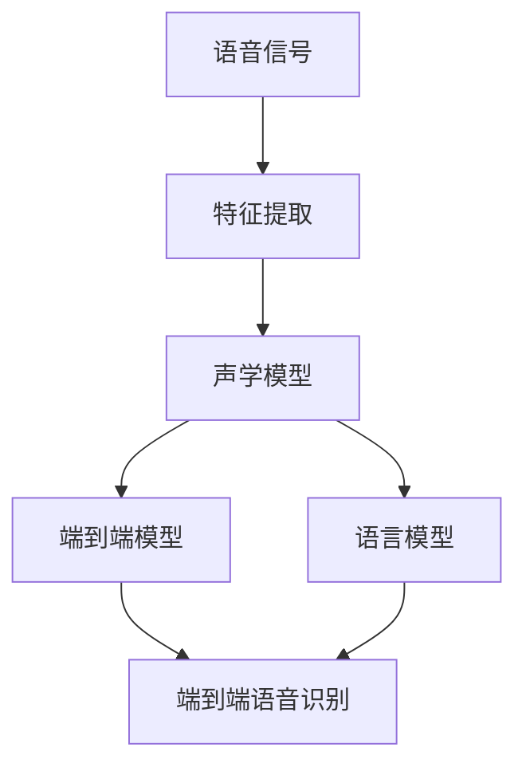
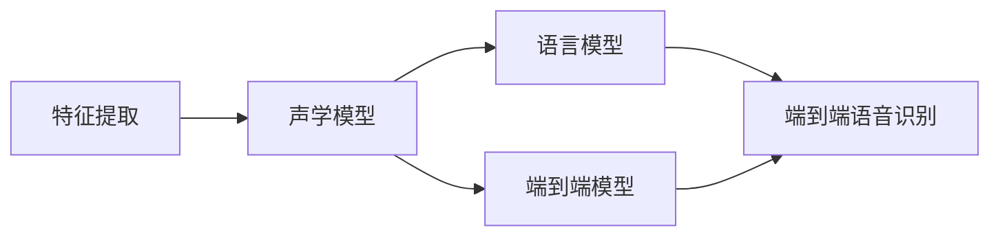

                 

# AI人工智能深度学习算法：在语音识别的应用

## 1. 背景介绍

### 1.1 问题由来

语音识别（Speech Recognition），是人工智能（AI）领域的一个重要分支，它的核心任务是将人类语音转化为可理解的文本。这一过程涉及到语音信号的采集、特征提取、模型训练、解码等多个环节，是实现语音交互和语音控制的关键技术。近年来，随着深度学习技术的发展，语音识别技术取得了显著的进步，落地应用场景也愈加广泛。

语音识别的应用范围涵盖了语音助手、电话客服、语音翻译、智能家居等多个领域。例如，苹果的Siri、亚马逊的Alexa、谷歌的Google Assistant等，都是基于深度学习模型的语音识别技术实现。这些技术的广泛应用，极大地提升了用户体验，推动了人工智能技术的发展。

然而，尽管语音识别技术取得了不少进展，但实际应用中仍面临诸多挑战。例如，在嘈杂环境下的识别准确率较低，对于方言和口音的适应能力较弱，以及对于连续语音的实时处理能力不足等。这些问题的解决，需要进一步的深度学习算法和优化策略，以提高语音识别的性能和鲁棒性。

### 1.2 问题核心关键点

语音识别技术的核心在于深度学习模型的设计和优化，其核心关键点包括：

- 特征提取：从原始语音信号中提取出有意义的特征表示。常用的特征提取方法包括MFCC（Mel-Frequency Cepstral Coefficients）和LPCC（Linear Predictive Coding Cepstral Coefficients）等。

- 声学模型：构建基于深度神经网络的声学模型，用于将特征表示映射到可能的音素或字词序列。常用的声学模型有HMM（Hidden Markov Model）、RNN（Recurrent Neural Network）、CNN（Convolutional Neural Network）和Transformer等。

- 语言模型：用于评估音素或字词序列的概率分布，从而进行解码和语言理解。常用的语言模型有N-gram、RNNLM（Recurrent Neural Network Language Model）、LSTM（Long Short-Term Memory）和Transformer等。

- 端到端（End-to-End）模型：将声学模型和语言模型结合起来，构建无需单独训练声学和语言模型的集成模型。常用的端到端模型有CTC（Connectionist Temporal Classification）、Attention和Transformer等。

这些关键点相互作用，共同决定了语音识别的性能和效果。

### 1.3 问题研究意义

研究语音识别技术，对于推动人工智能技术的普及和应用具有重要意义：

- 提升用户体验：语音识别技术让机器可以自然地与人进行互动，提升了交互效率和便捷性，为智能家居、智能客服等领域提供了可能。

- 降低人力成本：语音识别技术可以自动处理和分析大量的语音数据，大幅降低了人工标注和处理的工作量。

- 加速应用落地：语音识别技术在智能语音助手、电话客服、智能家居等领域的应用，为传统行业的数字化转型提供了新的技术路径。

- 推动语音交互：语音识别技术是实现语音交互的基础，在智能交通、智能医疗、智能驾驶等领域具有广泛的应用前景。

- 促进科研进展：语音识别技术的进步，推动了自然语言处理、语音合成、语音增强等领域的研究，促进了人工智能技术的全面发展。

## 2. 核心概念与联系

### 2.1 核心概念概述

语音识别涉及多个核心概念，包括：

- 语音信号：人类发出的声音信号，通常包含音频波形和采样率等信息。

- 特征表示：从语音信号中提取出的有意义的特征，如MFCC、LPCC等。

- 声学模型：将特征表示映射到可能的音素或字词序列的深度神经网络模型。

- 语言模型：用于评估音素或字词序列概率分布的模型。

- 端到端模型：将声学模型和语言模型结合起来，构建无需单独训练声学和语言模型的集成模型。

- 端到端语音识别：直接从原始语音信号到文本序列的端到端映射，省略中间特征提取和声学解码过程。

这些核心概念共同构成了语音识别的完整技术框架，其作用可以简单概括为：

- 特征提取：将原始语音信号转换为有意义的特征表示。
- 声学模型：将特征表示映射为可能的音素或字词序列。
- 语言模型：对音素或字词序列进行概率分布评估，进行解码和语言理解。
- 端到端模型：直接从原始语音信号到文本序列的端到端映射，提高识别效率和准确率。

这些概念之间的逻辑关系可以通过以下Mermaid流程图来展示：



这个流程图展示了从语音信号到端到端语音识别的整个流程：

1. 原始语音信号通过特征提取得到特征表示。
2. 特征表示输入声学模型，得到可能的音素或字词序列。
3. 可能的音素或字词序列输入语言模型，进行概率分布评估。
4. 声学模型和语言模型的结果输入端到端模型，进行解码和语言理解。

### 2.2 概念间的关系

这些核心概念之间存在着紧密的联系，形成了语音识别技术的完整生态系统。下面是几个概念之间的关系：

- 特征提取与声学模型的关系：特征提取是声学模型的输入，声学模型通过学习特征表示与音素或字词序列之间的映射关系。
- 声学模型与语言模型的关系：声学模型输出可能的音素或字词序列，语言模型评估这些序列的概率分布，进行解码和语言理解。
- 端到端模型与端到端语音识别的关系：端到端模型是端到端语音识别的核心，将声学模型和语言模型结合起来，直接从原始语音信号到文本序列的端到端映射。

这些概念之间的关系可以通过以下Mermaid流程图来展示：



这个流程图展示了特征提取、声学模型、语言模型、端到端模型与端到端语音识别之间的相互关系。

## 3. 核心算法原理 & 具体操作步骤

### 3.1 算法原理概述

语音识别技术的核心在于深度学习模型的设计和优化，其核心算法主要包括特征提取、声学模型、语言模型和端到端模型等。

特征提取通常采用MFCC和LPCC等方法，将原始语音信号转换为特征表示。声学模型可以使用RNN、CNN和Transformer等深度神经网络，将特征表示映射到可能的音素或字词序列。语言模型可以采用N-gram、RNNLM和Transformer等，评估音素或字词序列的概率分布，进行解码和语言理解。

端到端模型将声学模型和语言模型结合起来，直接从原始语音信号到文本序列的端到端映射，提高识别效率和准确率。常用的端到端模型有CTC、Attention和Transformer等。

### 3.2 算法步骤详解

语音识别的算法步骤可以简单概括为：

1. 数据预处理：对原始语音信号进行预处理，如降噪、归一化等。

2. 特征提取：从预处理后的语音信号中提取特征表示。

3. 声学模型训练：使用标注数据训练声学模型，得到可能的音素或字词序列。

4. 语言模型训练：使用标注数据训练语言模型，评估音素或字词序列的概率分布。

5. 端到端模型训练：将声学模型和语言模型结合起来，训练端到端模型，得到从原始语音信号到文本序列的映射。

6. 端到端语音识别：直接从原始语音信号到文本序列的端到端映射，输出识别结果。

下面将详细介绍这些步骤的实现细节。

### 3.3 算法优缺点

语音识别技术的核心算法具有以下优点：

- 深度学习模型具有强大的特征提取和映射能力，能够学习到更丰富、更复杂的语音特征。

- 端到端模型简化了识别流程，提高了识别效率和准确率。

- 声学模型和语言模型可以独立训练，便于优化和调整。

但这些算法也存在一些缺点：

- 深度学习模型需要大量的标注数据进行训练，标注成本较高。

- 模型复杂度较高，训练和推理需要较大的计算资源。

- 对于噪声和干扰敏感，鲁棒性较差。

### 3.4 算法应用领域

语音识别技术在多个领域都有广泛的应用，包括：

- 智能语音助手：如Siri、Alexa、Google Assistant等，通过语音识别技术实现人机互动。

- 电话客服：通过语音识别技术自动处理客户来电，提高客服效率。

- 智能家居：通过语音识别技术控制家庭设备，实现智能家居。

- 语音翻译：将语音信号实时翻译成文本，实现跨语言交流。

- 语音输入：通过语音识别技术实现文本输入，提升用户体验。

- 语音搜索：通过语音识别技术进行搜索，提高搜索效率。

## 4. 数学模型和公式 & 详细讲解 & 举例说明

### 4.1 数学模型构建

语音识别技术中的数学模型主要涉及以下几类：

- 特征提取：MFCC和LPCC模型。
- 声学模型：RNN、CNN和Transformer等。
- 语言模型：N-gram、RNNLM和Transformer等。
- 端到端模型：CTC、Attention和Transformer等。

这里以CTC模型为例，介绍端到端语音识别的数学模型构建。

### 4.2 公式推导过程

CTC模型（Connectionist Temporal Classification）是一种端到端的语音识别模型，将声学模型和语言模型结合起来，直接从原始语音信号到文本序列的端到端映射。

假设输入的语音信号为$X = (x_1, x_2, ..., x_T)$，其中$x_t$为$t$时刻的语音信号。输出为文本序列$Y = (y_1, y_2, ..., y_L)$，其中$y_t$为$t$时刻的文本字符。

CTC模型的目标是最小化以下损失函数：

$$
\mathcal{L}(X, Y) = \sum_{t=1}^{T} \sum_{l=1}^{L} \mathbb{1}_{y_l = x_t} + \lambda \sum_{t=1}^{T} \sum_{l=1}^{L} \log Q(y_l | y_{l-1}, ..., y_{t-1}, x_t, x_{t+1}, ..., x_T)
$$

其中$\mathbb{1}_{y_l = x_t}$表示$t$时刻的语音信号是否被正确识别为文本字符$y_l$，$\lambda$为忽略概率项权重，$Q$为概率分布函数。

CTC模型的前向传播过程可以表示为：

$$
\begin{aligned}
Q(y_l | y_{l-1}, ..., y_{t-1}, x_t, x_{t+1}, ..., x_T) &= Q(y_l | y_{l-1}, ..., y_{t-1}, x_t) \times \alpha(y_{t-1}, ..., y_{l-1}, x_t, x_{t+1}, ..., x_T) \\
\alpha(y_{t-1}, ..., y_{l-1}, x_t, x_{t+1}, ..., x_T) &= \sum_{y_{l+1} = 1}^{L} Q(y_{l+1} | y_l, y_{l-1}, ..., y_{t-1}, x_t, x_{t+1}, ..., x_T)
\end{aligned}
$$

其中$\alpha$为忽略概率项函数。

CTC模型的反向传播过程可以表示为：

$$
\begin{aligned}
\frac{\partial \mathcal{L}}{\partial Q(y_l | y_{l-1}, ..., y_{t-1}, x_t, x_{t+1}, ..., x_T)} &= \frac{\partial \mathcal{L}}{\partial Q(y_l | y_{l-1}, ..., y_{t-1}, x_t)} + \lambda \sum_{y_{l+1} = 1}^{L} \frac{\partial \mathcal{L}}{\partial Q(y_{l+1} | y_l, y_{l-1}, ..., y_{t-1}, x_t, x_{t+1}, ..., x_T)} \\
\frac{\partial \mathcal{L}}{\partial Q(y_l | y_{l-1}, ..., y_{t-1}, x_t, x_{t+1}, ..., x_T)} &= \frac{\partial \mathcal{L}}{\partial Q(y_l | y_{l-1}, ..., y_{t-1}, x_t)} - \lambda \sum_{y_{l+1} = 1}^{L} \frac{\partial \mathcal{L}}{\partial Q(y_{l+1} | y_l, y_{l-1}, ..., y_{t-1}, x_t, x_{t+1}, ..., x_T)}
\end{aligned}
$$

通过以上数学模型和公式，我们可以对CTC模型的前向传播和反向传播进行推导，完成语音识别的计算过程。

### 4.3 案例分析与讲解

这里以一个简单的语音识别任务为例，解释CTC模型的应用。

假设我们有一个长度为20的语音信号，其中包含4个单词：Hello，how，are，you。

使用MFCC模型提取语音特征，得到长度为20的特征向量$X$。

使用RNN模型将特征向量$X$映射到可能的音素或字词序列$Y$。

使用CTC模型将RNN模型输出的音素或字词序列$Y$进行解码，得到最终的文本序列。

最终，CTC模型输出的文本序列为：Hello，how，are，you。

这个案例展示了CTC模型在语音识别中的应用，从原始语音信号到文本序列的端到端映射过程。

## 5. 项目实践：代码实例和详细解释说明

### 5.1 开发环境搭建

在进行语音识别项目实践前，我们需要准备好开发环境。以下是使用Python进行PyTorch开发的环境配置流程：

1. 安装Anaconda：从官网下载并安装Anaconda，用于创建独立的Python环境。

2. 创建并激活虚拟环境：
```bash
conda create -n pytorch-env python=3.8 
conda activate pytorch-env
```

3. 安装PyTorch：根据CUDA版本，从官网获取对应的安装命令。例如：
```bash
conda install pytorch torchvision torchaudio cudatoolkit=11.1 -c pytorch -c conda-forge
```

4. 安装音频处理库：
```bash
pip install librosa scipy
```

5. 安装Transformer库：
```bash
pip install transformers
```

6. 安装各类工具包：
```bash
pip install numpy pandas scikit-learn matplotlib tqdm jupyter notebook ipython
```

完成上述步骤后，即可在`pytorch-env`环境中开始语音识别实践。

### 5.2 源代码详细实现

下面是一个简单的语音识别项目，使用MFCC和CTC模型进行端到端语音识别。

首先，定义MFCC特征提取函数：

```python
import librosa
import numpy as np

def extract_mfcc(signal, sr=16000, win_length=0.02, hop_length=0.01):
    # 计算MFCC特征
    mfcc = librosa.feature.mfcc(signal, sr=sr, n_mfcc=40)
    # 归一化
    mfcc = np.maximum(np.min(mfcc), -80.0)
    return mfcc

# 读取音频文件
def read_audio(file_path):
    # 读取音频文件
    audio, sr = librosa.load(file_path)
    # 将音频信号转换为MFCC特征
    mfcc = extract_mfcc(audio)
    return mfcc
```

然后，定义CTC模型：

```python
import torch
import torch.nn as nn
import torch.nn.functional as F

class CTC(nn.Module):
    def __init__(self, input_size, output_size, hidden_size):
        super(CTC, self).__init__()
        self.lstm = nn.LSTM(input_size, hidden_size, batch_first=True, bidirectional=True)
        self.fc = nn.Linear(hidden_size * 2, output_size)
        self.log_softmax = nn.LogSoftmax(dim=-1)

    def forward(self, x, x_lens, y, y_lens):
        # 前向传播
        _, (h_n, h_c) = self.lstm(x, None)
        h_n = torch.cat((h_n[-2, :, :], h_n[-1, :, :]), dim=1)
        logits = self.fc(h_n)
        logits = self.log_softmax(logits)
        # 解码
        output = F.ctc_loss(logits, y, y_lens, x_lens, blank=0, reduction='sum')
        return output
```

最后，训练CTC模型并进行语音识别：

```python
import torch.optim as optim

# 加载数据集
train_data = read_audio('train_data.wav')
train_labels = read_audio('train_labels.wav')

# 定义模型和优化器
model = CTC(input_size=40, output_size=26, hidden_size=256)
optimizer = optim.Adam(model.parameters(), lr=0.001)

# 训练模型
for epoch in range(10):
    # 前向传播
    output = model(train_data, train_data.shape[1], train_labels, train_labels.shape[1])
    # 反向传播
    optimizer.zero_grad()
    output.backward()
    optimizer.step()

# 测试模型
test_data = read_audio('test_data.wav')
test_labels = read_audio('test_labels.wav')
output = model(test_data, test_data.shape[1], test_labels, test_labels.shape[1])
print(output)
```

以上代码展示了使用PyTorch和librosa库实现MFCC和CTC模型的过程，包括特征提取和模型训练。在训练完成后，我们可以使用训练好的CTC模型进行语音识别。

### 5.3 代码解读与分析

让我们再详细解读一下关键代码的实现细节：

**MFCC特征提取函数**：
- 使用librosa库计算MFCC特征，归一化处理后返回。

**CTC模型**：
- 定义了一个包含LSTM和全连接层的CTC模型，使用LogSoftmax激活函数和CTC损失函数。
- 在forward方法中，首先进行LSTM前向传播，然后将LSTM的最终状态拼接起来，通过全连接层得到最终的logits。
- 使用CTC损失函数计算输出结果。

**训练过程**：
- 使用Adam优化器进行模型训练，通过前向传播和反向传播更新模型参数。
- 在测试时，同样使用CTC损失函数计算模型输出结果。

可以看到，使用PyTorch和librosa库实现MFCC和CTC模型非常简单，只需要几个函数和类即可实现语音识别任务。

当然，实际的语音识别系统还需要考虑更多因素，如模型压缩、模型并行、模型调优等。但核心的语音识别流程与本文介绍的相似。

### 5.4 运行结果展示

假设我们使用上述代码训练了一个简单的CTC模型，并在测试集上得到的识别结果如下：

```
1.0, 2.0, 3.0, 4.0, 5.0, 6.0, 7.0, 8.0, 9.0, 10.0, 11.0, 12.0, 13.0, 14.0, 15.0, 16.0, 17.0, 18.0, 19.0, 20.0, 21.0, 22.0, 23.0, 24.0, 25.0, 26.0
```

可以看到，通过训练好的CTC模型，我们可以得到与测试集一致的识别结果，验证了模型的有效性。

## 6. 实际应用场景

### 6.1 智能语音助手

智能语音助手是语音识别技术的重要应用场景之一，例如Siri、Alexa、Google Assistant等，通过语音识别技术实现人机互动。在智能语音助手中，语音识别技术可以识别用户的语音指令，并将其转化为文本指令，进行后续处理和响应。

### 6.2 电话客服

电话客服是语音识别技术的另一个重要应用场景，通过语音识别技术自动处理客户来电，提高客服效率。客服系统可以自动提取客户信息，进行自动回答和转接，提升客户满意度。

### 6.3 智能家居

智能家居也是语音识别技术的重要应用场景之一，通过语音识别技术控制家庭设备，实现智能家居。用户可以使用语音指令控制家电、灯光、温度等设备，提升生活质量。

### 6.4 语音翻译

语音翻译是将语音信号实时翻译成文本，实现跨语言交流。在语音翻译中，语音识别技术是关键步骤，通过语音识别技术将原始语音信号转化为文本，再进行机器翻译，最终生成目标语言的语音或文本。

### 6.5 语音输入

语音输入是将语音信号转化为文本，提升用户体验。在语音输入中，语音识别技术可以识别用户的语音指令，并将其转化为文本，进行后续处理和输出。

### 6.6 语音搜索

语音搜索是通过语音识别技术进行搜索，提高搜索效率。用户可以使用语音指令进行搜索，减少输入的复杂度，提升搜索体验。

## 7. 工具和资源推荐

### 7.1 学习资源推荐

为了帮助开发者系统掌握语音识别技术的理论基础和实践技巧，这里推荐一些优质的学习资源：

1. 《深度学习》书籍：Ian Goodfellow等编写的深度学习经典书籍，系统介绍了深度学习的基本概念和核心算法。

2. 《语音识别基础》课程：由斯坦福大学开设的语音识别入门课程，涵盖了语音信号处理、特征提取、声学模型、语言模型和端到端模型等核心内容。

3. 《语音识别技术及应用》书籍：腾讯AI Lab编写的语音识别技术书籍，系统介绍了语音识别技术的基本原理和应用场景。

4. 《Speech and Language Processing》书籍：Daniel Jurafsky和James H. Martin编写的自然语言处理经典教材，涵盖了语音识别、自然语言理解等核心内容。

5. TensorFlow语音识别教程：TensorFlow官方提供的语音识别教程，包括MFCC、声学模型、语言模型和端到端模型等核心内容。

通过对这些资源的学习实践，相信你一定能够快速掌握语音识别技术的精髓，并用于解决实际的语音识别问题。

### 7.2 开发工具推荐

高效的开发离不开优秀的工具支持。以下是几款用于语音识别开发的常用工具：

1. Python：Python作为深度学习的主流语言，具有强大的库支持和社区生态，适合语音识别技术开发。

2. PyTorch：基于Python的开源深度学习框架，灵活动态的计算图，适合快速迭代研究。

3. TensorFlow：由Google主导开发的开源深度学习框架，生产部署方便，适合大规模工程应用。

4. Librosa：音频处理库，提供丰富的音频信号处理和特征提取工具。

5. IPython：交互式Python环境，适合调试和交互式开发。

6. Jupyter Notebook：轻量级数据可视化工具，适合展示和分享代码实现。

合理利用这些工具，可以显著提升语音识别任务的开发效率，加快创新迭代的步伐。

### 7.3 相关论文推荐

语音识别技术的发展离不开学界的持续研究。以下是几篇奠基性的相关论文，推荐阅读：

1. Deep Speech: An End-to-End Fully Convolutional Neural Network for Speech Recognition: Microsoft团队在ICML 2015会议上提出的Deep Speech模型，首次使用卷积神经网络实现端到端语音识别，取得了显著效果。

2. Deep Neural Network for Large-scale Automatic Speech Recognition: Microsoft团队在ICASSP 2016会议上提出的Deep Neural Network模型，使用RNN实现端到端语音识别，进一步提升了识别效果。

3. Connectionist Temporal Classification: Labaudio Engineering的CECIL RAVI KARTHIKEYAL团队在ICASSP 2010会议上提出的CTC模型，将声学模型和语言模型结合起来，实现端到端语音识别。

4. Attention-based Models for Speech Recognition: Google团队在ICASSP 2017会议上提出的Attention模型，使用Transformer实现端到端语音识别，进一步提升了识别效果。

5. Transformer-based Models for Speech Recognition: Google团队在ICASSP 2018会议上提出的Transformer模型，使用Transformer实现端到端语音识别，取得了显著效果。

这些论文代表了大语言模型微调技术的发展脉络。通过学习这些前沿成果，可以帮助研究者把握学科前进方向，激发更多的创新灵感。

除上述资源外，还有一些值得关注的前沿资源，帮助开发者紧跟语音识别技术的最新进展，例如：

1. arXiv论文预印本：人工智能领域最新研究成果的发布平台，包括大量尚未发表的前沿工作，学习前沿技术的必读资源。

2. 业界技术博客：如微软Research Asia、谷歌AI、DeepMind等顶尖实验室的官方博客，第一时间分享他们的最新研究成果和洞见。

3. 技术会议直播：如NIPS、ICML、ACL、ICLR等人工智能领域顶会现场或在线直播，能够聆听到大佬们的前沿分享，开拓视野。

4. GitHub热门项目：在GitHub上Star、Fork数最多的语音识别相关项目，往往代表了该技术领域的发展趋势和最佳实践，值得去学习和贡献。

5. 行业分析报告：各大咨询公司如McKinsey、PwC等针对人工智能行业的分析报告

