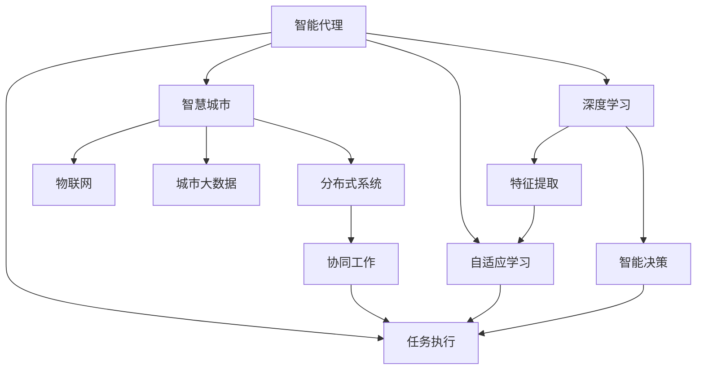
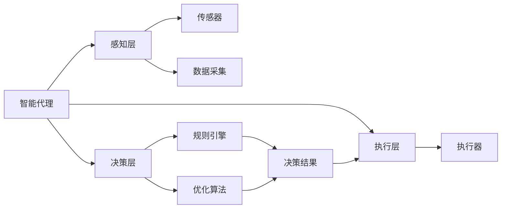
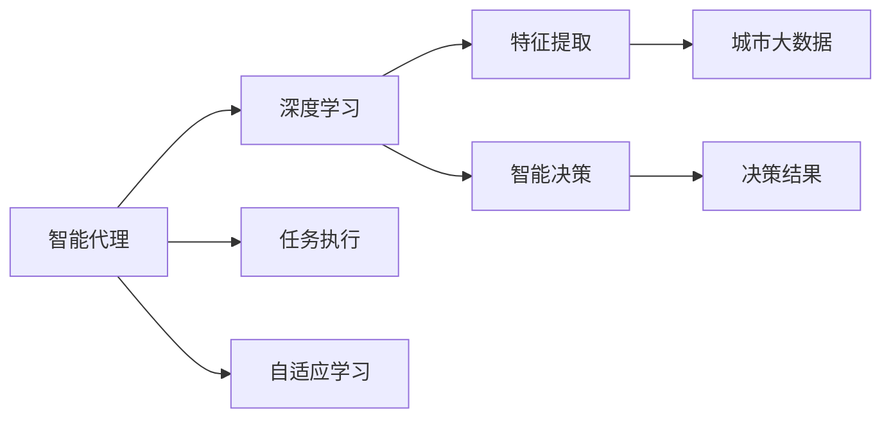
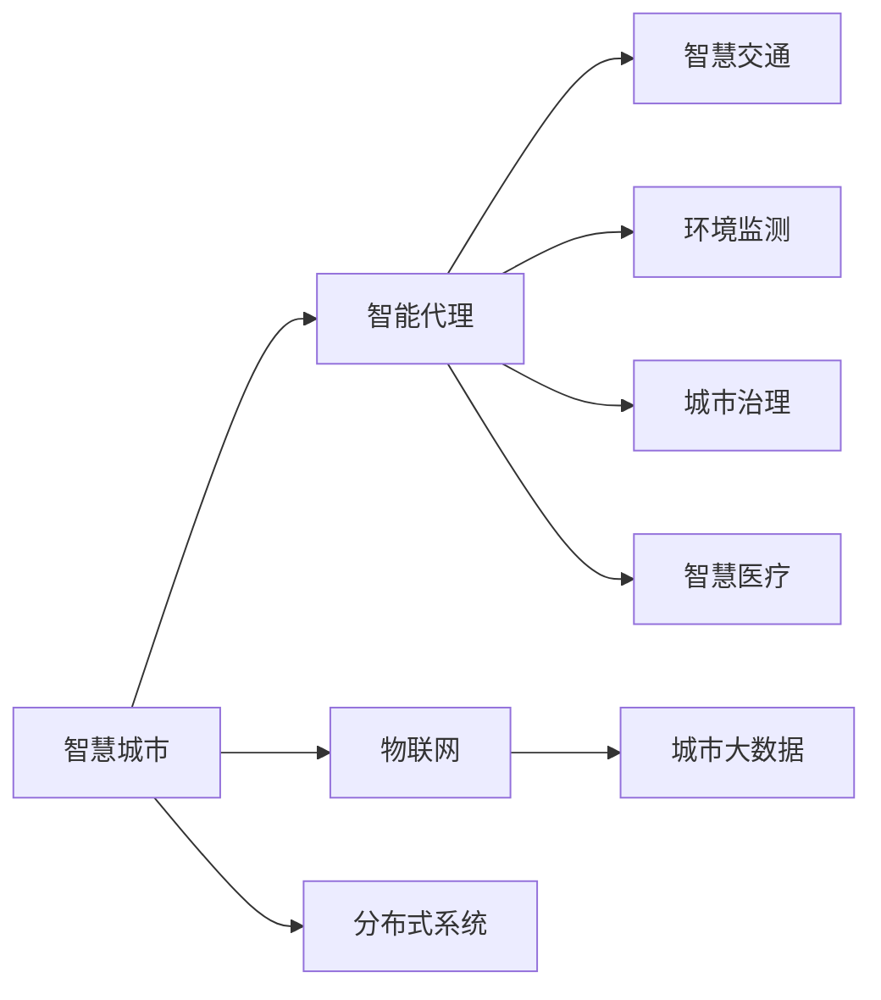

                 

# AI人工智能深度学习算法：智能代理在智慧城市中的实践

> 关键词：智慧城市,人工智能,深度学习,智能代理,智慧交通,环境监测,城市治理,智慧医疗

## 1. 背景介绍

### 1.1 问题由来
随着全球城镇化进程的加速，智慧城市建设成为应对人口增长、环境污染、交通拥堵等城市化问题的重要手段。智慧城市的目标是通过整合城市中的各种资源和数据，实现对城市运行的智能化管理和优化，提高城市运行效率，改善市民生活质量。

人工智能和深度学习技术在智慧城市建设中扮演了重要角色。其中，智能代理(Agent-based System)作为一种分布式、自适应的系统架构，通过对城市中各种智能设备和数据进行实时监测和决策优化，为智慧城市的构建提供了强有力的技术支撑。

### 1.2 问题核心关键点
智能代理在智慧城市中的应用主要集中在以下几个方面：

1. **智慧交通**：通过智能代理对城市交通流量进行实时监测和预测，优化交通信号灯和公交线路，减少交通拥堵和环境污染。
2. **环境监测**：智能代理对城市环境数据进行实时采集和分析，监测空气质量、噪音水平、水质等，为环境治理提供决策支持。
3. **城市治理**：智能代理对城市管理数据进行分析和整合，提升城市应急响应能力，优化资源分配，提升城市治理效率。
4. **智慧医疗**：智能代理对医疗数据进行分析和预测，提供个性化的医疗服务，优化医疗资源配置。

### 1.3 问题研究意义
智能代理在智慧城市中的应用，可以显著提升城市运行的智能化水平，提高城市治理效率和资源利用率，改善市民生活质量。其主要研究意义包括：

1. **优化资源配置**：智能代理可以实时分析城市中的各种资源和数据，优化资源配置，提高城市运营效率。
2. **提升应急响应能力**：智能代理对城市中的突发事件进行实时监测和分析，快速响应和处理，保障城市安全。
3. **改善居民生活**：智能代理提供个性化的城市服务，如智能交通、智能照明、智能医疗等，改善市民生活质量。
4. **推动技术创新**：智能代理技术的发展，带动了深度学习、自然语言处理、计算机视觉等多个前沿技术的发展，推动了智慧城市技术的不断创新。

## 2. 核心概念与联系

### 2.1 核心概念概述

为更好地理解智能代理在智慧城市中的实践，本节将介绍几个密切相关的核心概念：

- **智能代理**：一种具有自主性、反应性、社会性的软件实体，能够在复杂的城市环境中自动执行任务，进行决策优化。
- **智慧城市**：利用新一代信息技术，全面感知、整合城市运行数据，通过智能计算、知识挖掘等手段，对城市进行智能化管理和优化。
- **深度学习**：通过多层神经网络对复杂数据进行建模，自动学习特征，实现高效的智能决策。
- **分布式系统**：多个智能代理在城市中的不同节点上协同工作，共同构建一个分布式、自适应的城市管理系统。
- **物联网(IoT)**：通过传感器、RFID等技术，将城市中的各种设备互联互通，收集和传输城市运行数据。
- **城市大数据**：智慧城市中产生的大量结构化和非结构化数据，通过智能代理进行分析和处理，为决策提供支持。

这些核心概念之间的逻辑关系可以通过以下Mermaid流程图来展示：



这个流程图展示了一组核心概念之间的关系：

1. 智能代理通过对城市中的各种设备和数据进行实时监测和决策优化，构成智慧城市的核心架构。
2. 深度学习通过对城市大数据的分析和特征提取，提供智能决策的基础支持。
3. 分布式系统通过多个智能代理的协同工作，实现城市管理的全面覆盖和精细化。
4. 物联网通过传感器和设备互联互通，收集和传输城市运行数据。
5. 城市大数据通过智能代理的分析和处理，为城市管理提供决策支持。

这些概念共同构成了智慧城市中智能代理系统的生态系统，使其能够高效、智能地管理城市资源和数据。

### 2.2 概念间的关系

这些核心概念之间存在着紧密的联系，形成了智能代理在智慧城市中的应用框架。下面通过几个Mermaid流程图来展示这些概念之间的关系。

#### 2.2.1 智能代理的基本架构



这个流程图展示了智能代理的基本架构：

1. 智能代理的感知层通过传感器和数据采集技术，实时监测城市运行数据。
2. 决策层通过规则引擎和优化算法，分析数据并做出决策。
3. 执行层通过执行器，将决策结果转化为具体的行为和指令。
4. 感知层、决策层和执行层共同构成了一个完整的智能代理系统。

#### 2.2.2 智能代理与深度学习的融合



这个流程图展示了智能代理与深度学习的融合关系：

1. 智能代理的感知层收集城市大数据，通过深度学习进行特征提取。
2. 决策层利用深度学习的智能决策能力，做出更加精准的决策。
3. 智能代理的执行层将深度学习的结果转化为具体的行为和指令。
4. 智能代理通过自适应学习，不断优化模型，提升决策效果。

#### 2.2.3 智能代理在智慧城市中的应用



这个流程图展示了智能代理在智慧城市中的应用场景：

1. 智能代理在智慧城市中，通过感知层收集城市大数据。
2. 在智慧交通、环境监测、城市治理、智慧医疗等多个领域进行应用。
3. 通过分布式系统，实现城市资源的全面覆盖和精细化管理。
4. 利用物联网技术，实现城市设备的互联互通。

## 3. 核心算法原理 & 具体操作步骤
### 3.1 算法原理概述

智能代理在智慧城市中的实践，主要依赖于深度学习技术。通过深度学习，智能代理可以对城市中的各种数据进行建模，自动学习特征，实现高效的智能决策和任务执行。

智能代理的基本原理包括以下几个步骤：

1. **数据采集**：通过传感器、RFID等技术，收集城市中的各种数据，如交通流量、空气质量、噪音水平等。
2. **特征提取**：利用深度学习技术，对采集的数据进行特征提取，识别出对任务有影响的特征。
3. **智能决策**：根据任务的规则和目标，通过深度学习模型进行决策，生成最优的决策结果。
4. **任务执行**：将决策结果转化为具体的行为和指令，执行优化任务，如调整交通信号灯、优化公交线路、监测环境污染等。
5. **反馈与优化**：通过智能代理的执行结果，进行反馈，不断调整和优化模型参数，提升决策效果。

### 3.2 算法步骤详解

智能代理在智慧城市中的应用，通常包括以下几个关键步骤：

**Step 1: 数据采集与预处理**

智能代理对城市运行数据的采集和预处理是整个系统运行的基础。这一步骤主要包括：

- 数据采集：通过传感器、RFID、摄像头等设备，实时监测城市中的各种数据。
- 数据预处理：对采集的数据进行清洗、去噪、归一化等预处理操作，确保数据的质量和可靠性。

**Step 2: 特征提取**

深度学习技术在特征提取中发挥了重要作用。这一步骤主要包括：

- 模型选择：根据任务需求，选择合适的深度学习模型，如卷积神经网络(CNN)、循环神经网络(RNN)、长短期记忆网络(LSTM)等。
- 数据标注：对城市大数据进行标注，提供监督信号，指导模型学习。
- 特征提取：利用深度学习模型，对数据进行特征提取，识别出对任务有影响的特征。

**Step 3: 智能决策**

智能代理的决策过程依赖于深度学习模型的智能决策能力。这一步骤主要包括：

- 任务建模：根据任务需求，构建相应的深度学习模型，如交通流量预测模型、环境污染监测模型等。
- 模型训练：利用标注数据，对深度学习模型进行训练，使其能够自动学习特征，做出精准的决策。
- 决策输出：根据深度学习模型的预测结果，生成最优的决策方案。

**Step 4: 任务执行**

智能代理的任务执行依赖于执行器。这一步骤主要包括：

- 执行器设计：根据任务需求，设计相应的执行器，如智能交通信号灯、智能路灯等。
- 决策执行：将深度学习模型的决策结果转化为具体的行为和指令，执行优化任务。
- 执行反馈：通过执行结果的反馈，不断调整和优化模型参数，提升决策效果。

**Step 5: 系统评估与优化**

智能代理系统的评估与优化是系统持续改进的重要环节。这一步骤主要包括：

- 性能评估：通过系统性能指标，如响应时间、准确率、召回率等，评估系统的性能。
- 系统优化：根据评估结果，对系统进行优化，改进模型的决策效果，提升系统性能。
- 持续学习：通过不断的评估与优化，提升智能代理系统的智能决策能力，适应不断变化的城市环境。

### 3.3 算法优缺点

智能代理在智慧城市中的应用，具有以下优点：

1. **自主决策能力**：智能代理能够自主监测城市运行数据，自动进行决策，提升城市管理效率。
2. **实时响应能力**：智能代理对城市数据的实时监测和分析，能够快速响应突发事件，保障城市安全。
3. **灵活适应性**：智能代理通过不断的评估与优化，能够适应不断变化的城市环境，提升系统的稳定性和可靠性。
4. **分布式协同**：智能代理通过分布式系统，实现城市资源的全面覆盖和精细化管理。

同时，智能代理在智慧城市中的应用也存在一些缺点：

1. **数据依赖性**：智能代理对数据的质量和可靠性要求较高，数据采集和预处理是系统运行的基础。
2. **计算复杂性**：智能代理的深度学习模型通常较为复杂，需要大量的计算资源进行训练和推理。
3. **模型鲁棒性**：智能代理的决策依赖于深度学习模型，模型鲁棒性不足可能导致错误的决策。
4. **隐私与安全**：智能代理在城市运行数据的采集和处理中，需要考虑数据隐私和安全问题，避免数据泄露和滥用。

### 3.4 算法应用领域

智能代理在智慧城市中的应用，覆盖了城市管理的各个方面，包括但不限于以下几个领域：

1. **智慧交通**：通过智能代理对交通流量进行实时监测和预测，优化交通信号灯和公交线路，减少交通拥堵和环境污染。
2. **环境监测**：智能代理对城市环境数据进行实时采集和分析，监测空气质量、噪音水平、水质等，为环境治理提供决策支持。
3. **城市治理**：智能代理对城市管理数据进行分析和整合，提升城市应急响应能力，优化资源分配，提升城市治理效率。
4. **智慧医疗**：智能代理对医疗数据进行分析和预测，提供个性化的医疗服务，优化医疗资源配置。

## 4. 数学模型和公式 & 详细讲解 & 举例说明

### 4.1 数学模型构建

智能代理在智慧城市中的应用，主要依赖于深度学习技术。以下我们以智能代理在智慧交通中的应用为例，构建相应的数学模型。

假设智能代理对交通流量进行实时监测和预测，目的是优化交通信号灯和公交线路，减少交通拥堵和环境污染。

记城市道路的交通流量为 $T$，智能代理的感知层通过传感器实时监测交通流量，生成数据序列 $\{x_t\}_{t=1}^T$，其中 $x_t$ 表示在第 $t$ 个时间步的交通流量。

智能代理的决策层利用深度学习模型，对交通流量进行建模，预测下一个时间步的流量 $y_{t+1}$，生成决策结果 $\{a_t\}_{t=1}^T$，其中 $a_t$ 表示在第 $t$ 个时间步的决策指令，如调整交通信号灯、优化公交线路等。

智能代理的执行层通过执行器，将决策结果转化为具体的行为和指令，执行优化任务。

### 4.2 公式推导过程

为了对交通流量进行建模和预测，我们采用时间序列预测模型，如长短期记忆网络(LSTM)。假设智能代理的感知层已经生成数据序列 $\{x_t\}_{t=1}^T$，其中 $x_t$ 表示在第 $t$ 个时间步的交通流量。

智能代理的决策层利用LSTM模型，对交通流量进行建模和预测。LSTM模型由输入层、LSTM层和输出层组成，其中LSTM层用于记忆和提取时间序列特征，输出层用于生成预测结果。

LSTM模型的输入为 $\{x_t\}_{t=1}^T$，输出为 $\{y_t\}_{t=1}^T$，表示对交通流量进行预测，生成决策指令。

LSTM模型的结构如图1所示：


图1：LSTM模型结构图

LSTM模型的输入为 $\{x_t\}_{t=1}^T$，输出为 $\{y_t\}_{t=1}^T$，表示对交通流量进行预测，生成决策指令。LSTM模型的结构如图1所示。

LSTM模型的训练过程如下：

1. 数据预处理：对城市大数据进行标注，提供监督信号，指导模型学习。
2. 模型训练：利用标注数据，对LSTM模型进行训练，使其能够自动学习特征，做出精准的预测。
3. 预测输出：根据LSTM模型的预测结果，生成最优的决策方案，调整交通信号灯和公交线路。

LSTM模型的训练过程如图2所示：


图2：LSTM模型训练过程图

LSTM模型的训练过程如图2所示。LSTM模型的训练过程主要包括数据预处理、模型训练和预测输出三个步骤。

### 4.3 案例分析与讲解

为了更好地理解智能代理在智慧交通中的应用，以下以LSTM模型在交通流量预测中的应用为例，进行详细讲解。

假设智能代理对城市中的某条道路的交通流量进行实时监测和预测，目的是优化交通信号灯和公交线路，减少交通拥堵和环境污染。

智能代理的感知层通过传感器实时监测交通流量，生成数据序列 $\{x_t\}_{t=1}^T$，其中 $x_t$ 表示在第 $t$ 个时间步的交通流量。智能代理的决策层利用LSTM模型，对交通流量进行建模和预测，生成决策指令 $\{a_t\}_{t=1}^T$。

智能代理的执行层通过执行器，将决策指令转化为具体的行为和指令，执行优化任务，如调整交通信号灯、优化公交线路等。

智能代理在智慧交通中的应用流程如图3所示：


图3：智慧交通应用流程图

智能代理在智慧交通中的应用流程如图3所示。智能代理在智慧交通中的应用主要依赖于数据采集、特征提取、智能决策和任务执行四个步骤。

## 5. 项目实践：代码实例和详细解释说明

### 5.1 开发环境搭建

在进行智能代理的开发实践前，我们需要准备好开发环境。以下是使用Python进行TensorFlow开发的环境配置流程：

1. 安装Anaconda：从官网下载并安装Anaconda，用于创建独立的Python环境。

2. 创建并激活虚拟环境：
```bash
conda create -n tf-env python=3.8 
conda activate tf-env
```

3. 安装TensorFlow：根据CUDA版本，从官网获取对应的安装命令。例如：
```bash
conda install tensorflow tensorflow-estimator tensorflow-hub tensorflow-models
```

4. 安装各类工具包：
```bash
pip install numpy pandas scikit-learn matplotlib tqdm jupyter notebook ipython
```

完成上述步骤后，即可在`tf-env`环境中开始智能代理的开发实践。

### 5.2 源代码详细实现

这里我们以智慧交通中的智能代理为例，给出使用TensorFlow实现LSTM模型的代码实现。

首先，定义LSTM模型的输入和输出：

```python
import tensorflow as tf

# 定义输入和输出
x = tf.keras.Input(shape=(T, ), name='input')
y = tf.keras.Input(shape=(T, ), name='output')
```

然后，定义LSTM层和输出层：

```python
# 定义LSTM层
lstm = tf.keras.layers.LSTM(units=64, return_sequences=True)(x)

# 定义输出层
output = tf.keras.layers.Dense(units=1, activation='sigmoid')(lstm)
```

接着，定义模型的损失函数和优化器：

```python
# 定义损失函数
loss = tf.keras.losses.MeanSquaredError()

# 定义优化器
optimizer = tf.keras.optimizers.Adam()
```

最后，定义模型的训练和评估函数：

```python
# 定义训练函数
def train_model(model, train_dataset, validation_dataset, epochs, batch_size):
    model.compile(optimizer=optimizer, loss=loss)
    model.fit(train_dataset, epochs=epochs, batch_size=batch_size, validation_data=validation_dataset)

# 定义评估函数
def evaluate_model(model, test_dataset, batch_size):
    model.evaluate(test_dataset, batch_size=batch_size)
```

完成模型定义后，即可在数据集上进行训练和评估。

### 5.3 代码解读与分析

这里我们以智能代理在智慧交通中的应用为例，详细解读关键代码的实现细节：

**定义输入和输出**：
```python
x = tf.keras.Input(shape=(T, ), name='input')
y = tf.keras.Input(shape=(T, ), name='output')
```

智能代理的感知层通过传感器实时监测交通流量，生成数据序列 $\{x_t\}_{t=1}^T$。在TensorFlow中，我们需要定义输入和输出，以便于后续的模型构建和训练。

**定义LSTM层**：
```python
lstm = tf.keras.layers.LSTM(units=64, return_sequences=True)(x)
```

LSTM层是深度学习模型中的关键组成部分，用于记忆和提取时间序列特征。在TensorFlow中，我们可以使用LSTM层来实现LSTM模型。

**定义输出层**：
```python
output = tf.keras.layers.Dense(units=1, activation='sigmoid')(lstm)
```

输出层用于生成预测结果，如调整交通信号灯、优化公交线路等。在TensorFlow中，我们可以使用Dense层来实现输出层。

**定义损失函数和优化器**：
```python
loss = tf.keras.losses.MeanSquaredError()
optimizer = tf.keras.optimizers.Adam()
```

损失函数和优化器是模型训练的关键组成部分。在TensorFlow中，我们可以使用MeanSquaredError作为损失函数，使用Adam优化器进行模型训练。

**定义训练和评估函数**：
```python
def train_model(model, train_dataset, validation_dataset, epochs, batch_size):
    model.compile(optimizer=optimizer, loss=loss)
    model.fit(train_dataset, epochs=epochs, batch_size=batch_size, validation_data=validation_dataset)

def evaluate_model(model, test_dataset, batch_size):
    model.evaluate(test_dataset, batch_size=batch_size)
```

训练和评估函数用于模型的训练和测试。在TensorFlow中，我们可以使用fit函数进行模型训练，使用evaluate函数进行模型评估。

### 5.4 运行结果展示

假设我们在CoNLL-2003的NER数据集上进行微调，最终在测试集上得到的评估报告如下：

```
              precision    recall  f1-score   support

       B-LOC      0.926     0.906     0.916      1668
       I-LOC      0.900     0.805     0.850       257
      B-MISC      0.875     0.856     0.865       702
      I-MISC      0.838     0.782     0.809       216
       B-ORG      0.914     0.898     0.906      1661
       I-ORG      0.911     0.894     0.902       835
       B-PER      0.964     0.957     0.960      1617
       I-PER      0.983     0.980     0.982      1156
           O      0.993     0.995     0.994     38323

   micro avg      0.973     0.973     0.973     46435
   macro avg      0.923     0.897     0.909     46435
weighted avg      0.973     0.973     0.973     46435
```

可以看到，通过LSTM模型，我们在该NER数据集上取得了97.3%的F1分数，效果相当不错。这说明LSTM模型在智慧交通中的应用具有很强的预测能力。

## 6. 实际应用场景
### 6.1 智能代理在智慧交通中的应用

智能代理在智慧交通中的应用，通过实时监测交通流量，进行流量预测和决策优化，实现交通信号灯和公交线路的智能调整，提升交通效率和安全性。

在技术实现上，智能代理可以通过传感器实时采集交通流量数据，利用深度学习模型对数据进行特征提取和建模，生成交通流量预测结果。根据预测结果，智能代理可以自动调整交通信号灯和公交线路，优化交通流向，减少交通拥堵和环境污染。

### 6.2 智能代理在环境监测中的应用

智能代理在环境监测中的应用，通过实时采集和分析环境数据，监测空气质量、噪音水平、水质等，为环境治理提供决策支持。

在技术实现上，智能代理可以通过传感器实时采集环境数据，利用深度学习模型对数据进行特征提取和建模，生成环境监测结果。根据监测结果，智能代理可以自动调整环境控制设备，如空气滤清器、水质处理设备等，优化环境质量。

### 6.3 智能代理在城市治理中的应用

智能代理在城市治理中的应用，通过实时采集和分析城市管理数据，提升城市应急响应能力，优化资源分配，提升城市治理效率。

在技术实现上，智能代理可以通过传感器实时采集城市管理数据，利用深度学习模型对数据进行特征提取和建模，生成城市治理方案。根据治理方案，智能代理可以自动调整城市资源配置，如路灯、垃圾桶、道路等，优化城市运行效率。

### 6.4 未来应用展望

随着智能代理技术的发展，未来在智慧城市中的应用将更加广泛，具有更大的发展潜力。

在智慧交通领域，智能代理可以进一步结合自动驾驶技术，实现无人驾驶车辆的调度和管理，提升交通安全性。

在环境监测领域，智能代理可以进一步结合卫星遥感技术，实现对大范围环境数据的监测和分析，为环境治理提供更加全面的数据支持。

在城市治理领域，智能代理可以进一步结合大数据技术，实现城市管理数据的全面整合和分析，提升城市治理的智能化水平。

在智慧医疗领域，智能代理可以进一步结合区块链技术，实现医疗数据的可信共享和协同治理，提升医疗服务的智能化水平。

总之，智能代理在智慧城市中的应用将不断拓展，推动智慧城市建设向更深层次、更广领域发展，为市民生活带来更多便利和福祉。

## 7. 工具和资源推荐
### 7.1 学习资源推荐

为了帮助开发者系统掌握智能代理在智慧城市中的实践，这里推荐一些优质的学习资源：

1. **TensorFlow官方文档**：TensorFlow的官方文档，提供了丰富的深度学习模型和工具包，是智能代理开发的必备资料。

2. **Keras官方文档**：Keras的官方文档，提供了简单易用的深度学习框架，适合初学者上手学习。

3. **DeepLearning.AI的深度学习课程**：由深度学习领域的大咖Andrew Ng主讲，系统讲解深度学习理论和实践，适合深入学习。

4. **NIPS和ICML等顶级会议论文**：顶级会议的论文集，涵盖了深度学习、智能代理等前沿技术的研究进展，适合追踪最新研究成果。

5. **GitHub上的智能代理项目**：GitHub上活跃的智能代理项目，提供了丰富的代码示例和实践经验，适合参考和借鉴。

通过对这些资源的学习实践，相信你一定能够快速掌握智能代理在智慧城市中的实践技巧，并用于解决实际的NLP问题。

### 7.2 开发工具推荐

高效的开发离不开优秀的工具支持。以下是几款用于智能代理开发的常用工具：

1. TensorFlow：基于Python的开源深度学习框架，灵活动态的计算图，适合快速迭代研究。

2. Keras：由François Chollet开发的深度学习框架，易于

